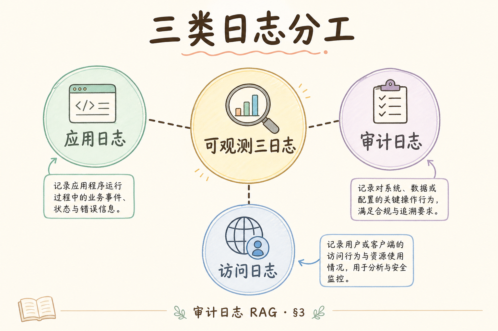
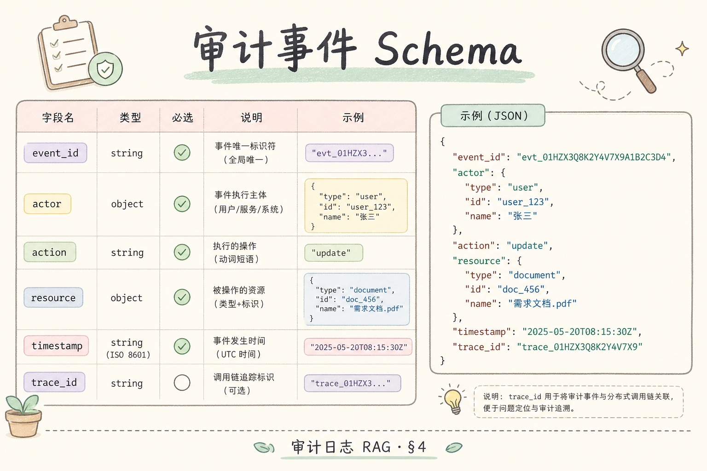
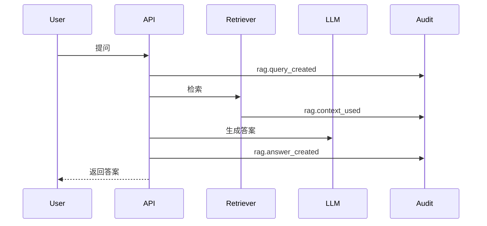
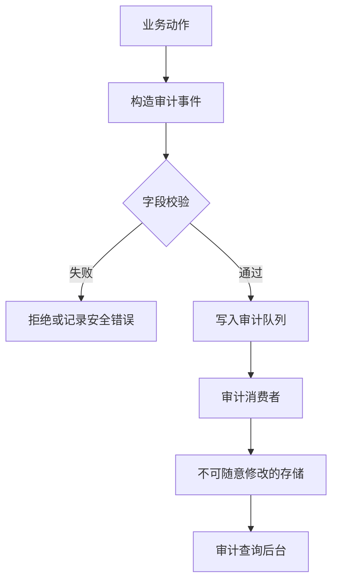

# G 生产（十八）：RAG 审计日志完全指南

> 普通日志回答“系统发生了什么”；审计日志回答“谁在什么时候对什么数据做了什么动作，是否可追责”。RAG 系统涉及文档上传、权限检索、上下文注入、LLM 回答和导出操作，生产环境必须留下可查询、可保留、可脱敏的审计记录。

---

## 目录

1. [为什么需要审计日志](#1-为什么需要审计日志)
2. [审计日志是什么](#2-审计日志是什么)
3. [它解决什么问题](#3-它解决什么问题)
4. [RAG 链路哪些动作必须留痕](#4-rag-链路哪些动作必须留痕)
5. [审计事件 schema 怎么设计](#5-审计事件-schema-怎么设计)
6. [写入、存储与查询流程](#6-写入存储与查询流程)
7. [脱敏、保留和不可篡改](#7-脱敏保留和不可篡改)
8. [最小实现示例](#8-最小实现示例)
9. [常见陷阱与 FAQ](#9-常见陷阱与-faq)
10. [总结](#10-总结)

## 1. 为什么需要审计日志

企业 RAG 不是个人笔记工具。用户可能上传合同、政策、客户资料和内部工单。系统回答问题时，可能检索到敏感文档，也可能把答案导出给外部人员。出了问题后，团队必须能回答：

| 问题 | 需要的记录 |
|------|------------|
| 谁查看了某份敏感文档？ | 用户、时间、doc_id、动作 |
| 某次回答引用了哪些 chunk？ | request_id、chunk_ids、模型版本 |
| 谁导出了结果？ | export 事件、文件 ID、接收人 |
| 权限绕过是否发生？ | ACL 检查结果、租户信息 |

没有审计日志，安全事故只能靠猜；有审计日志，至少能定位影响范围和责任链。

### 1.1 与结构化日志、Trace 的分工

| 类型 | 主要读者 | 典型问题 |
|------|----------|----------|
| 结构化日志 | 开发值班 | 这次请求为什么 500？ |
| Trace | 性能排障 | 慢在哪个 span？ |
| 审计日志 | 安全/合规 | 谁导出了哪份合同？ |

三者可共用 `request_id` 关联，但**存储、保留期、访问 RBAC 必须分开**。把 debug 日志当审计用，会导致字段漂移、权限过宽、保留期不足。

### 1.2 触发审计需求的典型场景

客户安全问卷、等保测评、内部数据泄露调查、离职员工账号追溯——都会问“RAG 是否记录文档访问与导出”。PoC 阶段可以简化实现，但 schema 与事件名应尽早稳定，避免上线后全链路改字段。

---

## 2. 审计日志是什么

**审计日志**（Audit Log）：面向追责和合规的结构化事件记录。它记录主体、动作、对象、时间、结果和上下文。

通俗说：普通应用日志像开发者日记；审计日志像门禁刷卡记录。它不追求记录所有细节，而是记录关键动作是否可追溯。


审计日志应独立于普通 debug 日志存储，至少要有更严格的权限和保留策略。

### 2.1 审计事件的最小可信要素

任何一条审计记录至少应能回答：**谁（actor）、何时（created_at）、对什么（object）、做了什么（action）、结果如何（result）**。缺少 actor 或 object_id 的记录，在调查时往往无法立案。

---

## 3. 它解决什么问题

PoC 可简化实现，但 `event_type` 与核心 schema 应尽早稳定——上线后全链路改字段成本远高于先定枚举。Langfuse 等观测系统不能替代审计：保留、RBAC、不可篡改模型不同，可互补并用 `request_id` 关联。

审计日志的读者是安全与合规，不是开发值班——字段要稳定、权限要更严、保留要更久。与结构化日志、Trace 可共用 `request_id` 关联，但**不得混库混 RBAC**。调查「谁导出了哪份合同」时，若只有 debug 日志，字段漂移与短保留会让追责无法立案。

审计日志解决的是追踪、问责和合规证明。



| 目标 | 说明 |
|------|------|
| 追踪 | 还原一次敏感操作的过程 |
| 问责 | 确认是谁做的动作 |
| 合规 | 满足内部安全、客户审计、法规要求 |
| 排查 | 判断是否发生越权访问 |

它不应该用来替代业务日志、指标或 tracing。审计日志更少、更稳定、更结构化，也更敏感。

### 3.1 排错：调查时查不到记录

| 原因 | 处理 |
|------|------|
| 事件未接入 | 对照第 4 节事件表补埋点 |
| 写队列失败被吞 | 高风险动作应失败即拒绝或本地 WAL |
| 租户 ID 错误 | 查询条件 `tenant_id` 与写入不一致 |
| 保留期已过 | 合规要求 180 天时勿只存 7 天 |

---

## 4. RAG 链路哪些动作必须留痕

越权调查典型路径：`rag.query_created` → `rag.context_used` → `document.acl_changed` 历史。`retrieval_denied` 也要记——否则无法证明是 ACL 漏洞还是提示词误导。粒度在业务动作级，不要记每个 token 或每次 cosine。

RAG 的审计点不只在“用户登录”。至少覆盖五类动作：

| 动作 | 事件名示例 | 关键字段 |
|------|------------|----------|
| 上传文档 | `document.uploaded` | user_id、doc_id、tenant_id |
| 修改权限 | `document.acl_changed` | actor、target、old_acl、new_acl |
| 发起问答 | `rag.query_created` | request_id、user_id、query_hash |
| 使用证据 | `rag.context_used` | chunk_ids、doc_ids、acl_result |
| 导出/分享 | `answer.exported` | answer_id、target、format |





注意：不要把完整用户 query 和完整 context 原文直接写入审计日志。可以写 hash、doc_id、chunk_id 和脱敏摘要。

### 4.1 建议扩展的高风险动作

| 动作 | 事件名 | 说明 |
|------|--------|------|
| 删除文档 | `document.deleted` | 含软删与硬删 |
| 管理员 impersonate | `admin.impersonation_started` | 明确 actor 与目标用户 |
| 检索被拒绝 | `rag.retrieval_denied` | ACL 失败也要记 |
| 模型/配置变更 | `config.model_changed` | 影响回答边界 |
| API Key 轮换 | `secret.rotated` | 与 [188](188.secrets-management-rag-tutorial.md) 联动 |

### 4.2 案例：越权检索调查

用户举报“看到了不该看的政策文档”。调查路径：`rag.query_created`（query_hash）→ `rag.context_used`（chunk_ids）→ `document.acl_changed` 历史 → 对比检索时 `acl_result`。若 `retrieval_denied` 未记录，将无法证明是检索漏洞还是提示词注入误导。

### 4.3 什么不必记

单次向量 cosine 计算、每个 token 的 LLM 流式 chunk、健康检查探针——这些进 debug 日志或 metrics，不进审计，否则噪声淹没关键事件且存储爆炸。

---

## 5. 审计事件 schema 怎么设计

`metadata` 只放可选扩展，核心字段（actor、tenant、object、result）不得只藏在 metadata 里。时间统一 UTC；跨区调查时乱序会误判因果。对外 B 端合同通常期望 A1 以上成熟度：五类核心事件 + 独立表 + 保留策略。

schema 稳定性比字段多更重要：`event_type` 枚举化后不改旧语义；`result=denied` 与 `failed` 要区分（策略拒绝 vs 系统错误）；query 用 `query_hash` 而非明文。需要法务复核时，通过 `request_id` 在受控冷存储调取原文，审计表只做可追责索引。

一个稳定 schema 比临时拼字符串重要。建议最小字段如下：

| 字段 | 说明 |
|------|------|
| `event_id` | 唯一事件 ID |
| `event_type` | 事件类型 |
| `actor_id` | 谁触发 |
| `tenant_id` | 租户 |
| `object_type` | 文档、答案、权限、导出 |
| `object_id` | 对象 ID |
| `action` | upload、query、export 等 |
| `result` | success、denied、failed |
| `request_id` | 关联请求 |
| `created_at` | 时间 |
| `metadata` | 脱敏后的补充字段 |

示例：

```json
{
  "event_type": "rag.context_used",
  "actor_id": "user_123",
  "tenant_id": "tenant_a",
  "object_type": "rag_answer",
  "object_id": "answer_789",
  "action": "use_context",
  "result": "success",
  "request_id": "req_456",
  "metadata": {
    "doc_ids": ["policy_2026"],
    "chunk_ids": ["policy_2026_017"],
    "query_hash": "sha256:..."
  }
}
```

### 5.1 字段稳定性约定

| 规则 | 说明 |
|------|------|
| `event_type` 枚举化 | 新增用新值，不改旧语义 |
| `metadata` 只放可选扩展 | 核心字段禁止只藏在 metadata |
| 时间统一 UTC ISO8601 | 跨区调查时不乱序 |
| `result=denied` 与 `failed` 区分 | denied=策略拒绝，failed=系统错误 |

### 5.2 query 与 context 的处理

| 数据 | 审计中建议 |
|------|------------|
| 用户 query | `query_hash`、`query_length`、可选分类 |
| 检索 context | `chunk_ids`、`doc_ids`，不存原文 |
| 生成答案 | `answer_id`、长度、是否导出 |

需要法务复核时，通过 `request_id` 在受控冷存储调取原文，而非在审计表里明文保存。

---

## 6. 写入、存储与查询流程

审计日志最好不要阻塞主请求。常见做法是业务服务同步生成事件，再写入队列，由后台消费者落库。



查询后台要严格限权。普通用户不应能搜索全租户审计记录；安全管理员也应只看到脱敏字段，必要时通过审批查看详情。

### 6.1 同步 vs 异步写入

| 策略 | 适用事件 |
|------|----------|
| 异步队列（默认） | query、context_used、answer_created |
| 同步落库或失败拒绝 | ACL 变更、删除、导出 |
| 本地 WAL + 重试 | 队列短暂不可用时的兜底 |

高风险动作“先应答用户、审计慢慢写”会在事故时留下空白，合规上站不住脚。

### 6.2 查询 API 设计要点

| 要求 | 说明 |
|------|------|
| 强制 `tenant_id` 过滤 | 防跨租户泄露 |
| 分页 + 时间范围 | 默认最近 7 天 |
| 导出 CSV 需审批 | 防批量拖库 |
| 查询本身也审计 | `audit.query_executed` |

### 6.3 与 [195](195.pii-redaction-rag-tutorial.md) 的衔接

审计 metadata 中的 `actor_id`、邮箱、IP 等 PII 应脱敏或 hash；查询界面按角色决定可见粒度。审计日志不是“比业务库更全的副本”，而是**可追责索引**。

---

## 7. 脱敏、保留和不可篡改

审计日志本身也可能包含敏感信息，所以要控制三件事。

| 控制 | 要求 |
|------|------|
| 脱敏 | 不存完整 query、context、PII |
| 保留 | 按合规要求保存 90 天、180 天或更久 |
| 不可篡改 | 普通管理员不能直接改写历史审计 |

不可篡改不一定一开始就上复杂系统。PoC 可以先做到：追加写、限制删除权限、每日导出快照、记录 hash。高合规场景再考虑 WORM 存储或专门审计系统。

### 7.1 保留与归档

| 阶段 | 做法 |
|------|------|
| 热存储 30–90 天 | 快速调查 |
| 冷归档至对象存储 | 低成本、带生命周期 |
| 超期删除 | 按政策自动执行并记 `audit.purged` |

RAG 文档可能比审计事件活得更久——保留策略由合规决定，不是由 Postgres 默认配置决定。

### 7.2 完整性校验（进阶）

每日对审计表按 `event_id` 排序做 Merkle 或整表 hash，hash 本身写入只读桶或第三方时间戳服务。被质疑“记录是否事后改过”时，可出示 hash 链。

### 7.3 评测：审计成熟度

| 级别 | 特征 |
|------|------|
| A0 | 无专用审计，只有应用日志 |
| A1 | 五类核心事件 + 独立表 |
| A2 | 队列异步 + RBAC 查询 + 保留策略 |
| A3 | 不可篡改 + 导出审批 + 与 SIEM 对接 |

对外 B 端合同通常期望 A1 以上；金融、政务倾向 A2+。

---

## 8. 最小实现示例

函数只演示字段形状；上线须加 Pydantic 校验、`event_type` Literal 枚举、队列失败兜底与脱敏检查。埋点在「业务动作」级——上传成功、ACL commit、检索拿到 chunk、返回答案、导出——不要在 LLM 流式循环里每条 token 写审计。

下面是一个简化事件构造函数：

```python
from datetime import datetime, timezone
from uuid import uuid4

def audit_event(event_type, actor_id, tenant_id, object_type, object_id, action, result, metadata=None):
    return {
        "event_id": str(uuid4()),
        "event_type": event_type,
        "actor_id": actor_id,
        "tenant_id": tenant_id,
        "object_type": object_type,
        "object_id": object_id,
        "action": action,
        "result": result,
        "metadata": metadata or {},
        "created_at": datetime.now(timezone.utc).isoformat(),
    }

event = audit_event(
    event_type="rag.context_used",
    actor_id="user_123",
    tenant_id="tenant_a",
    object_type="answer",
    object_id="answer_789",
    action="use_context",
    result="success",
    metadata={"chunk_ids": ["policy_2026_017"]},
)
```

这段代码演示的是字段结构。真正上线时，还要加 schema 校验、队列写入失败兜底、脱敏检查和权限控制。

### 8.1 埋点位置建议

| 位置 | 事件 |
|------|------|
| 上传 API 成功回调 | `document.uploaded` |
| ACL 服务 commit 后 | `document.acl_changed` |
| 检索管线拿到 chunk 后 | `rag.context_used` |
| 返回答案前 | `rag.answer_created` |
| 导出 endpoint | `answer.exported` |

避免在 LLM 流式循环里每条 token 写审计；粒度在“业务动作”级。

### 8.2 Schema 校验示例思路

用 Pydantic 模型约束 `event_type` 为 Literal 枚举、`result` 为固定集、`metadata` 禁止额外未声明的敏感键。校验失败时打安全告警而非静默丢弃，防止“以为记了其实没有”。

---

## 9. 常见陷阱与 FAQ

这一节收束审计日志的边界。审计日志不是“把所有东西都记下来”，而是“把关键动作用稳定 schema 记下来”。

### 9.1 能不能把完整 query 写进审计日志？

不建议。query 可能含 PII、客户名、合同条款。写 hash、长度、分类和关联 request_id 更安全。

### 9.2 审计日志和普通日志有什么区别？

普通日志服务开发排障；审计日志服务安全追责。审计日志字段更稳定、权限更严、保留更久。

### 9.3 写审计失败怎么办？

高风险动作可以失败即拒绝；低风险动作可以进入本地缓冲和重试队列。策略要按事件等级区分。

### 9.4 审计日志会不会太多？

会，所以不要记录每个内部函数调用。只记录安全、权限、数据访问、导出、删除、配置变更等关键动作。

### 9.5 排错：队列积压导致审计延迟

监控 `audit_queue_lag`。积压时优先保证 ACL/导出类同步写路径；扩容消费者；切勿直接删队列消息“清积压”，否则调查断链。

### 9.6 FAQ：开源 Langfuse 能否当审计系统？

Langfuse 偏 LLM 观测与 trace，保留与 RBAC 模型与合规审计不同。可互补：Langfuse 看模型调用，专用审计库存追责事件，用 `request_id` 关联。

### 9.7 FAQ：多租户 SaaS 客户能否看自己的审计？

可提供**租户管理员**视图，仅本租户 `tenant_id` 过滤，且仍脱敏平台内部字段。平台超级管理员动作不应出现在客户视图里，或仅以聚合形式展示。

---

## 10. 总结

RAG 审计日志的核心是把“谁、何时、对什么数据、做了什么、结果如何”结构化记录下来，并且控制脱敏、保留和查询权限。


### 10.1 本篇检查清单

- [ ] 五类核心 RAG 动作均有稳定 `event_type`
- [ ] schema 含 actor、tenant、object、result、request_id
- [ ] 不存完整 query/context 原文，用 hash 与 ID
- [ ] 审计存储与 debug 日志分离，RBAC 更严
- [ ] 高风险动作有同步或失败拒绝策略
- [ ] 保留期与归档符合合同/合规要求
- [ ] 查询与导出操作本身留痕

一句话记忆：**普通日志帮开发排 bug；审计日志帮团队在安全和合规问题上说得清、查得到、追得回。**
