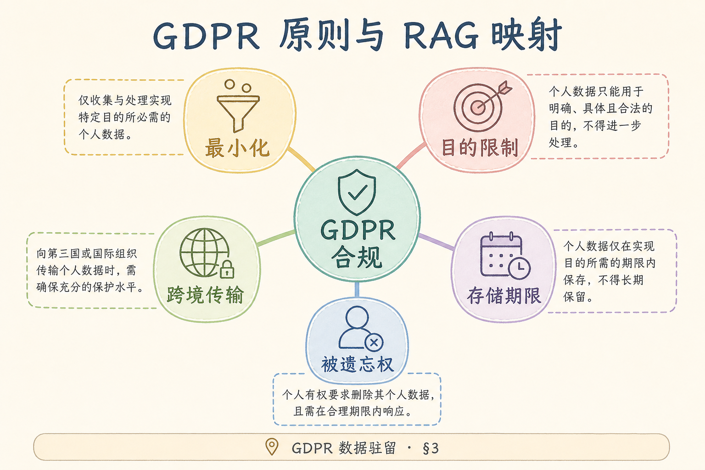
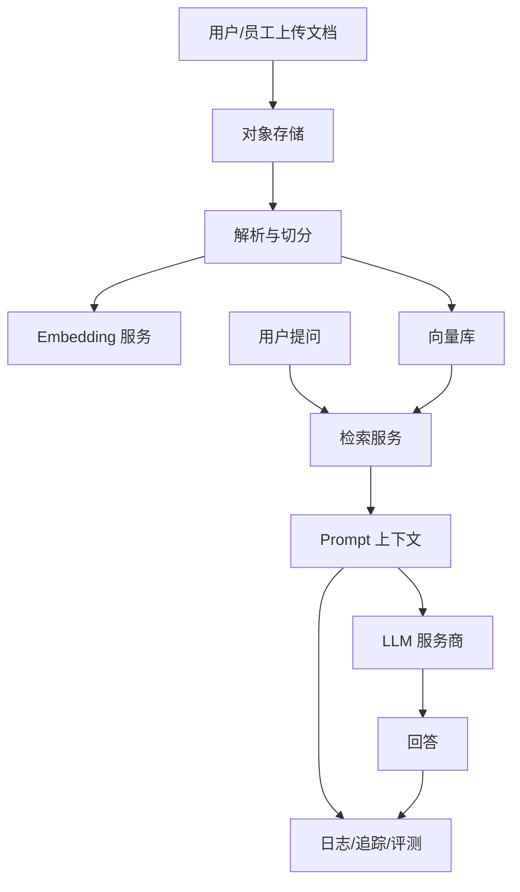
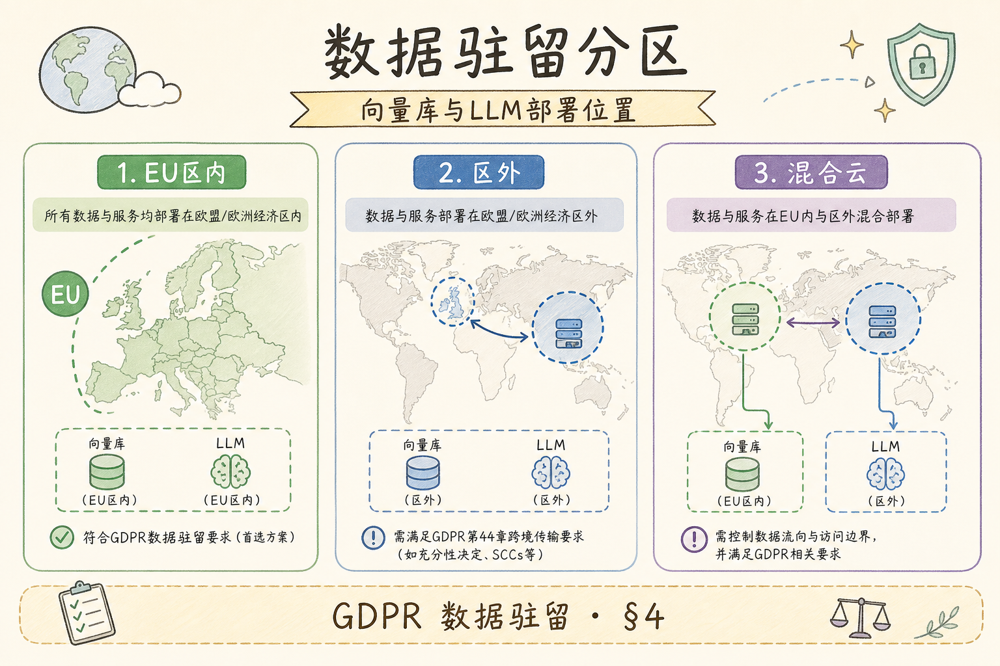
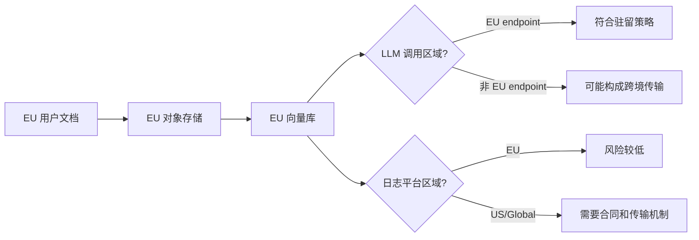
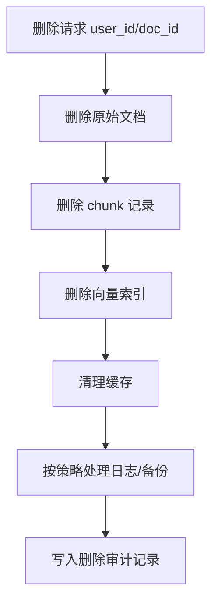

# G 生产（十九）：GDPR 与数据驻留（RAG 视角）完全指南

> RAG 系统看起来只是“把企业文档拿来问答”，但从合规视角看，它会处理用户问题、内部文档、检索片段、模型调用、日志追踪和供应商服务。**GDPR 与数据驻留**要解决的问题是：哪些数据能处理、在哪里处理、由谁处理、用户要求删除时能不能真的删干净。

---

## 目录

1. [为什么 RAG 会碰到 GDPR 与数据驻留](#1-为什么-rag-会碰到-gdpr-与数据驻留)
2. [GDPR 与数据驻留是什么](#2-gdpr-与数据驻留是什么)
3. [RAG 数据流地图](#3-rag-数据流地图)
4. [GDPR 原则如何映射到 RAG](#4-gdpr-原则如何映射到-rag)
5. [数据驻留与跨境传输](#5-数据驻留与跨境传输)
6. [删除权：RAG 最容易漏的地方](#6-删除权rag-最容易漏的地方)
7. [供应商、DPA 与子处理器](#7-供应商dpa-与子处理器)
8. [工程控制清单](#8-工程控制清单)
9. [常见误解与 FAQ](#9-常见误解与-faq)
10. [总结](#10-总结)

---

## 1. 为什么 RAG 会碰到 GDPR 与数据驻留

**GDPR**（General Data Protection Regulation，欧盟通用数据保护条例）关注个人数据如何被收集、处理、存储、删除和跨境传输。

**数据驻留**（Data Residency）关注数据必须或应该存放在哪个国家、地区或云区域。

RAG 系统容易触发这些问题，因为它不是只读一份静态文档。它会把数据复制到多个地方：

- 原始文档存储；
- chunk 切分结果；
- 向量库；
- Prompt 上下文；
- LLM 厂商请求；
- 日志、追踪、评测数据；
- 缓存和备份。

只说“我们不训练模型”并不能自动排除 GDPR 风险。只要系统处理了个人数据，就需要回答处理目的、合法性基础、存储位置、删除流程和供应商责任。

---

## 2. GDPR 与数据驻留是什么

处理者再委托的日志、监控、向量托管都是子处理器——签约与清单要随集成变更更新。个人数据不限于姓名手机号；能识别个人的工单、组合字段、可关联的 embedding 都应保守管理。

控制者决定处理目的与范围，处理者与云厂商签 DPA，子处理器清单要能回答：谁处理什么、在哪、保留多久、如何删除。「不训练模型」不等于豁免 GDPR——检索、嵌入、发 Prompt、写日志都是处理。数据驻留是合同承诺，主库在 EU 但 LLM endpoint 在 US 仍可能构成跨境传输。

GDPR 可以先用一句话理解：**处理个人数据必须有理由、有边界、可解释、可删除。**

数据驻留可以先用一句话理解：**数据放在哪里，也是一项合规和合同承诺。**

| 概念 | 白话解释 | RAG 中的例子 |
|---|---|---|
| 个人数据 | 能识别个人的信息 | 邮箱、姓名、工单内容、IP |
| 处理 | 对数据做任何操作 | 切分、嵌入、检索、生成 |
| 控制者 | 决定为什么处理数据的一方 | 企业客户或你的产品 |
| 处理者 | 按要求处理数据的一方 | 云厂商、LLM 厂商 |
| 子处理器 | 处理者再使用的供应商 | 日志、监控、向量数据库服务 |
| 数据驻留 | 数据存放区域要求 | 只能在 EU 区域保存 |

---

## 3. RAG 数据流地图

审查数据流时，旁路节点（日志、追踪、评测、缓存、备份）与主链路同等重要——它们常保存完整 Prompt 与检索片段。每个节点要问：是否含个人数据、存放在哪、谁能访问、保留多久、删除时如何清理、是否传给第三方。漏掉日志平台区域，等于「文档在 EU、观测在 US」的隐性跨境。

读这张图时不要只看主链路，也要看旁路：日志、追踪、评测数据经常被忽略，但它们可能保存了完整 Prompt 和检索片段。

做 GDPR 和数据驻留审查时，需要为每个节点回答：

- 是否包含个人数据；
- 存放在哪个区域；
- 谁能访问；
- 保留多久；
- 用户删除时如何清理；
- 是否传给第三方。

---

## 4. GDPR 原则如何映射到 RAG

「准确性」在 RAG 里体现为文档版本与索引版本可追踪；「存储限制」体现为日志、缓存、评测样本的保留期与自动删除。原则不是背法条，而是评审会上能指到具体配置：哪张表、哪个 bucket、哪条保留策略。

原则落地要可验收：数据最小化 = chunk 与 Prompt 不带无关 PII；存储限制 = 日志与缓存设保留期；可问责 = RoPA、DPA、审计记录可查。不要把整份合同塞进 Prompt「图省事」——这既抬 token 成本，也违反最小化。

| GDPR 原则 | 白话解释 | RAG 工程落点 |
|---|---|---|
| 合法、公平、透明 | 处理要有正当理由并告知用户 | 隐私政策说明 RAG 用途 |
| 目的限制 | 不能拿来做未声明用途 | 文档只用于问答，不默认训练 |
| 数据最小化 | 能少拿就少拿 | chunk 不带无关 PII |
| 准确性 | 数据错误要能纠正 | 文档版本与索引版本可追踪 |
| 存储限制 | 不要无限期保存 | 日志和缓存设置保留期 |
| 完整性与保密性 | 防泄露、防越权 | 权限过滤、加密、审计 |
| 可问责 | 能证明你做了控制 | RoPA、DPA、审计记录 |

这些原则不是法律文本背诵题，而是工程约束。比如“数据最小化”落到 RAG，就是不要把整份合同都塞进 Prompt；只取回答需要的片段，并且去掉无关个人信息。

---

## 5. 数据驻留与跨境传输

区域清单要覆盖对象存储主区与备份区、向量库副本、LLM API endpoint、日志 ingest 与冷归档、CI 是否把样本带出生产区。客户合同写「数据在境内」时，一条含员工工单的 Prompt 调到境外模型，技术上可能已构成出境——工程需提供数据类别与量级供法务评估，不能口头保证「我们没用境外」。

数据驻留常见要求是“EU 用户数据必须留在 EU 区域”或“某客户数据只能在指定云区域处理”。RAG 中最容易漏掉的是：你以为文档在 EU，但 LLM 调用、日志平台或向量库托管服务在其他区域。

工程上要建立“区域清单”：

| 数据位置 | 必查项 |
|---|---|
| 对象存储 | bucket 区域、备份区域 |
| 数据库 | 主库、只读副本、备份 |
| 向量库 | 托管区域、索引副本 |
| LLM 服务 | API endpoint 区域、是否留存请求 |
| 日志平台 | ingest 区域、冷存储区域 |
| CI/导出数据 | 是否把样本带出生产区域 |

数据驻留不是只选一个云区域就结束。你要确认整条处理链都没有把数据带出承诺区域。

---

## 6. 删除权：RAG 最容易漏的地方

删除请求要覆盖派生物：embedding 保守视为派生个人数据；缓存与日志中的 PII 按策略擦除或匿名化；备份可能延迟删除但须有记录与时间表。只删 Postgres 文档行而向量库仍留 chunk，检索仍可能召回已删用户信息——删除流程应可审计，并写入 `audit.purged` 类事件。

GDPR 下用户可能要求删除个人数据。RAG 系统难点在于数据有多个副本和派生物。

一个完整删除流程至少覆盖：

- 原始文件；
- 文档元数据；
- chunk 表；
- embedding / vector index；
- 检索缓存；
- Prompt 或回答缓存；
- 日志与追踪中的个人数据；
- 备份中的延迟删除策略；
- 删除操作审计记录。

不要只删数据库里的文档记录。如果向量库里还留着对应 chunk，检索仍可能召回被删除用户的信息。

---

## 7. 供应商、DPA 与子处理器

RAG 供应链长：云、LLM、向量库、日志、评测平台都可能接触个人数据。签约前确认：是否用客户数据训练、默认保留期、删除 API 是否真删、区域与备份区域。子处理器清单应随版本更新，发布新集成（如换观测 SaaS）时同步法务评审。

**DPA**（Data Processing Agreement，数据处理协议）是控制者和处理者之间约定个人数据处理责任的合同。

RAG 项目通常会涉及多个供应商：

| 供应商类型 | 可能处理的数据 | 需要确认 |
|---|---|---|
| 云厂商 | 数据库、存储、网络日志 | 区域、备份、访问控制 |
| LLM 厂商 | Prompt、检索片段、回答 | 是否训练、保留期、区域 |
| 向量库服务 | chunk、embedding、metadata | 数据删除、租户隔离 |
| 日志平台 | 请求、错误、trace | 是否含 PII、保留期 |
| 评测平台 | 样本问题与答案 | 是否脱敏、导出路径 |

子处理器清单要能回答：谁在处理数据、处理什么、在哪处理、保留多久、如何删除。

---

## 8. 工程控制清单

上线前压测问题：**某 EU 用户要求删除全部数据时，能否在承诺时限内证明删了什么、什么因备份延迟仍存在？** 清单应覆盖分类、ACL、脱敏、区域、保留、删除、供应商、审计——缺一项都可能在客户安全问卷里被卡住。

下面这张清单适合放进上线前评审。

| 控制项 | 最低要求 |
|---|---|
| 数据分类 | 标记哪些字段/文档可能含个人数据 |
| 权限过滤 | 检索前按用户权限过滤文档 |
| PII 脱敏 | Prompt 和日志前至少做基础脱敏 |
| 区域控制 | 对象存储、DB、向量库、LLM endpoint 区域一致 |
| 日志保留 | 设置保留期，避免永久保存 Prompt |
| 删除流程 | 删除原文、chunk、向量、缓存并记录审计 |
| 供应商审查 | DPA、子处理器、保留期、训练用途 |
| 审计记录 | 谁访问、谁删除、策略版本是什么 |

上线前可以用一个问题压测设计：**某个 EU 用户要求删除全部数据时，我们能在多长时间内证明哪些数据被删、哪些因备份策略延迟删除？**

---

## 9. 常见误解与 FAQ

合规问题常常不是因为团队完全没做控制，而是因为对“处理”“驻留”“删除”的理解过窄。下面这些误解会直接影响 RAG 架构设计，需要在方案阶段就澄清。

### 9.1 错：RAG 不训练模型，所以没有 GDPR 问题

GDPR 关注的是“处理个人数据”，不是只关注“训练模型”。检索、嵌入、发送 Prompt、写日志都可能是处理。

### 9.2 错：数据库在 EU 就满足数据驻留

还要看向量库、LLM endpoint、日志平台、备份、导出样本。只管主数据库是不够的。

### 9.3 错：删除原文就完成删除

RAG 有派生数据。chunk、embedding、向量索引、缓存和日志都要纳入删除策略。

### 9.4 FAQ：Embedding 算不算个人数据？

可能算。Embedding 虽然不是原文，但如果能关联回个人、文档或用户，就不能简单当成匿名数据。保守做法是把它当作派生个人数据管理。

### 9.5 FAQ：能不能把生产日志拿去做评测集？

可以，但要先经过脱敏、抽样审批和用途限定。不要把含 PII 的真实 Prompt 直接导出到开发环境或第三方评测平台。

---

## 10. 总结

GDPR 与数据驻留在 RAG 系统里不是“法务最后看一眼”的问题，而是会影响架构设计的问题。

最小落地路线是：

1. 画出 RAG 数据流，标出所有存储、供应商和日志节点；
2. 标记哪些节点可能含个人数据；
3. 确认每个节点的区域、保留期和访问权限；
4. 给 Prompt、日志和评测数据做 PII 控制；
5. 建立删除流程，覆盖原文、chunk、向量、缓存和日志；
6. 用 DPA 和子处理器清单管理第三方责任。

一句话记忆：**RAG 不训练模型，也仍然在处理数据；数据在哪里流动，合规责任就跟到哪里。**
