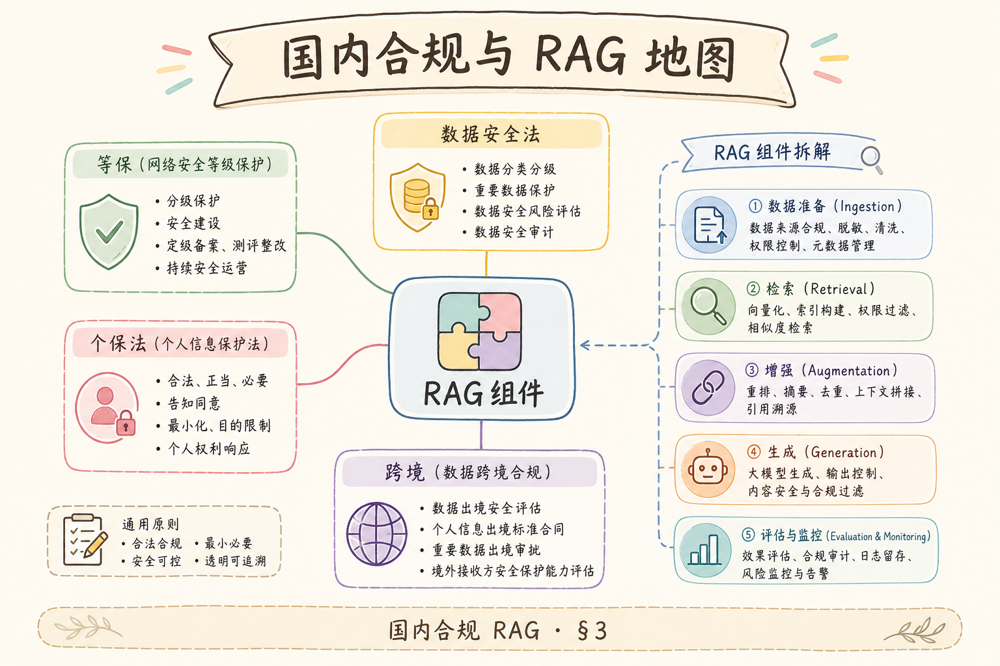
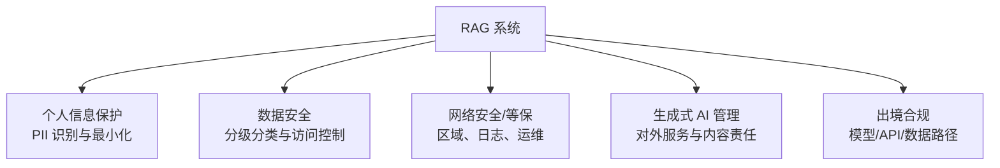
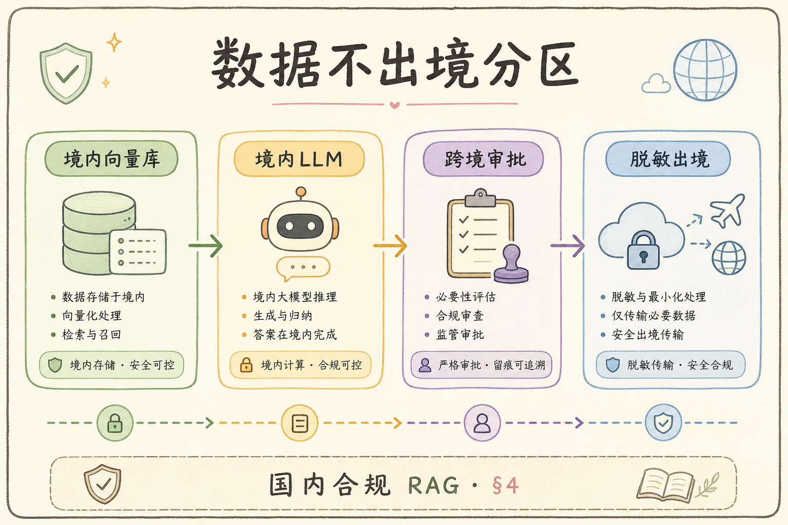
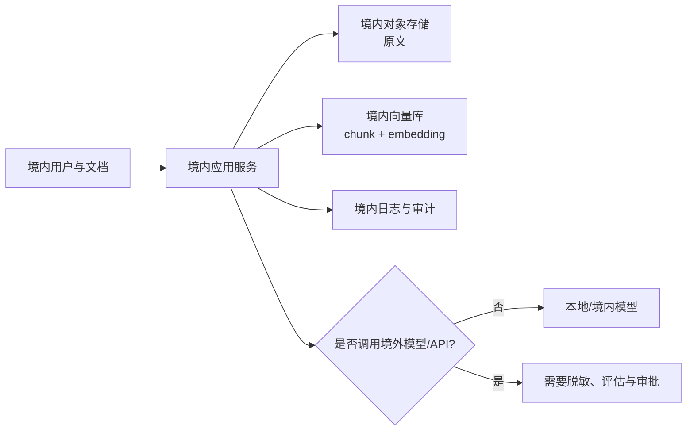
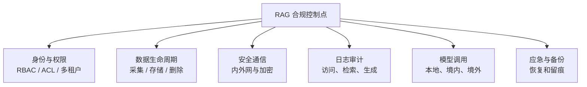

# G 生产（二十）：等保与 RAG 合规语境完全指南

> 国内政企客户招标常写：**等保二级/三级**、**数据不出境**、**生成式 AI 备案**、**个人信息保护法**。工程师听到「合规」往往懵：这和 [195 PII](195.pii-redaction-rag-tutorial.md)、[196 审计](196.audit-log-rag-tutorial.md) 差在哪？本篇用 **了解篇** 粒度，把 **等保 2.0、关基、数据安全法、生成式 AI 管理办法** 与 **RAG 架构选择** 对齐——让你能 **画边界、列控制项、答招标技术偏离**。不替代等保测评机构。前置：[195 PII](195.pii-redaction-rag-tutorial.md)、[196 审计](196.audit-log-rag-tutorial.md)、[188 密钥](188.secrets-management-rag-tutorial.md)、[197 GDPR](197.gdpr-data-residency-tutorial.md)（对照出海场景）。

---

## 目录

本目录用于快速定位合规主题。建议初学者先顺读 1～6 节建立边界，再回到 7～14 节做工程检查。

1. [前言：同一套 RAG，两套合规语言](#1-前言同一套-rag两套合规语言)
2. [本文边界与学习目标](#2-本文边界与学习目标)
3. [国内合规地图：五部法律与 RAG](#3-国内合规地图五部法律与-rag)
4. [等保 2.0：定级、备案与扩展要求](#4-等保-20定级备案与扩展要求)
5. [安全物理与环境：云客户要看什么](#5-安全物理与环境云客户要看什么)
6. [安全通信与区域：数据不出境工程化](#6-安全通信与区域数据不出境工程化)
7. [安全计算环境：RAG 组件控制项](#7-安全计算环境rag-组件控制项)
8. [安全管理中心：日志与审计（≥6 月）](#8-安全管理中心日志与审计6-月)
9. [生成式 AI 与算法备案语境](#9-生成式-ai-与算法备案语境)
10. [与 GDPR 出海双轨架构](#10-与-gdpr-出海双轨架构)
11. [先错对对：四种典型误解](#11-先错对对四种典型误解)
12. [综合概念地图](#12-综合概念地图)
13. [常见陷阱与 FAQ](#13-常见陷阱与-faq)
14. [总结与系列下一步](#14-总结与系列下一步)

## 1. 前言：同一套 RAG，两套合规语言

销售话术：「我们 RAG 很先进。」  
招标条款：「系统应满足等保三级要求，采用国密算法，日志留存不少于 6 个月，向境外提供数据应通过安全评估。」

若工程团队只熟悉 [76 Chroma](76.chroma-vector-db-tutorial.md) 和 [93 混合检索](93.hybrid-search-tutorial.md)，容易 **把等保当成「买防火墙」** 或 **把备案当成「填表」**。实际上：

- **等保** 是 **等级保护制度** 对 **信息系统** 的分级防护；  
- **个保法** 管 **个人信息** 处理；  
- **数据安全法** 管 **重要数据、出境**；  
- **生成式 AI 办法** 管 **面向公众的服务** 与 **训练/标注数据** 义务——企业内 RAG 与 **对外聊天机器人** 边界不同。

**读完本文（了解篇），你应该能做到：**

1. 说出 **等保三级** 对日志、身份鉴别、入侵防范的 **工程直觉**。  
2. 把 [196 审计](196.audit-log-rag-tutorial.md) 映射到 **「安全管理中心」**。  
3. 列出 **数据不出境** 时 LLM、向量库、备份的 **选型约束**。  
4. 区分 **对内知识库 RAG** 与 **对外生成服务** 的备案语境。  
5. 与 [197 GDPR](197.gdpr-data-residency-tutorial.md) **双轨部署** 时画分区。

### 1.1 了解篇定位

这一小节只说明本篇在路线图中的位置，不展开新概念。它帮助你确认前后篇章的阅读顺序。

```text
214 GDPR [197]
215 等保与合规语境 ← 本篇（了解，招标/答辩向）
216 Graph RAG [199]
```

## 2. 本文边界与学习目标

**交付物**是合规对照表（控制项 → 已有技术 → gap）与数据流分区图——不是等保打分表逐条背诵。工程师角色是 **把法规语言翻译成可验收的配置、接口与日志**，密评、法律意见书仍须专业机构。与 [197 GDPR](197.gdpr-data-residency-tutorial.md) 对照读，可画境内/欧盟双轨架构。

**档位：G 生产了解篇（路线图 215）。**

**本文讲：** 国内法规地图、等保分级直觉、RAG 组件控制、日志 6 月、出境、生成式 AI 语境、双轨架构。  
**本文不讲：** 等保测评打分表逐条、密评全套、律师出具法律意见书。

**交付物**：**合规对照表**（控制项 → 已有技术 → gap）+ **数据流分区图**。

## 3. 国内合规地图：五部法律与 RAG

读下图时，先看「国内合规与 RAG 地图」想表达的主线：它把本节的概念关系压缩成一张可对照的图。



下面这张图把国内合规语境和 RAG 组件放在一起。读图时重点看：合规不是只看模型，而是从数据来源、存储、检索、生成到审计全链路覆盖。



结论：做合规不能只问“模型放在哪里”。更重要的是数据怎么进来、谁能检索、答案怎么输出、日志能否追溯。

| 法规/制度 | RAG 触点 |
|-----------|----------|
| 网络安全法 | 运营者义务、关键信息基础设施 |
| 数据安全法 | 分类分级、重要数据、出境评估 |
| 个人信息保护法 | 员工/客户 PII、[195 脱敏](195.pii-redaction-rag-tutorial.md) |
| 等保 2.0 | 系统技术与管理措施 |
| 生成式 AI 管理办法 | 公众服务、内容标识、训练数据合法性 |

**关键**：企业 **内部 HR 知识库** 与 **对外营销机器人** 触发的义务 **不同**——产品形态要先定性。

## 4. 等保 2.0：定级、备案与扩展要求

RAG 通常作为业务应用子系统定级，**不是「用了 AI 就自动四级」**。云计算扩展要求下 IaaS 与客户共担：客户仍须负责应用层 ACL、审计、上传扫描。政企主流招标多为三级直觉——双因素、审计集中、入侵防范、备份恢复都应在工程 backlog 里有对应故事，而非测评前两周突击。

**等级保护**（MLPS）：按系统遭到破坏后的危害程度 **定级**（1～5，常见 **2/3 级**），按对应 **基本要求+扩展要求** 建设，并通过 **测评**。



RAG 系统通常作为 **业务应用子系统** 或 **大数据/云计算扩展** 的一部分定级——**不是** 「用了 AI 就自动四级」。

| 级 | 直觉 | RAG 团队常见接触 |
|----|------|------------------|
| 二级 | 县级以下、一般企业 | SaaS 中小客户 |
| 三级 | 地级市以上、重要单位 | 政企主流招标 |
| 四级 | 省级以上、极高危害 | 金融、能源核心 |

**扩展要求**（了解）：**云计算** 场景下责任共担——IaaS 提供基础设施合规，**你的 RAG 应用层** 仍要满足 **身份鉴别、访问控制、安全审计、数据完整性** 等。

## 5. 安全物理与环境：云客户要看什么

招标材料里索要的等保测评摘要、ISO27001、可用区境内证明，应进入项目合规文件夹，与工程配置交叉验证。RAG 组件部署遵循：VPC 私有子网跑 API/Worker，向量库与 DB 无公网 IP，仅 ALB+WAF 对外。

上云不等于外包全部合规：**责任共担**——IaaS 提供机房与基础能力，RAG 应用层仍要满足身份鉴别、访问控制、审计与数据完整性。招标要求国密时，向云厂商索证 KMS 是否真支持 SM4、TLS 套件是否启用，而非官网「支持国密」一句带过。向量库与 DB 应无公网 IP，公网仅 ALB + WAF。

工程师不建机房，但要 **向云厂商索证**：

- 等保测评报告摘要、ISO27001；  
- **可用区** 是否境内；  
- **KMS** 是否支持 **国密 SM4**（若招标硬性要求）。

RAG 组件部署：

```text
VPC 私有子网：API + Worker [159]
公网仅 ALB + WAF
向量库/DB 无公网 IP [81][78]
```

## 6. 安全通信与区域：数据不出境工程化

读下图时，先看「数据不出境分区」想表达的主线：它把本节的概念关系压缩成一张可对照的图。

下面这张图说明“数据不出境”的工程分区。读图时重点看：原文、向量、日志、Prompt 都可能含敏感信息，不能只管文件本身。



这张图的结论是：RAG 的出境风险常藏在 Prompt、检索片段、trace 和日志里，不只是在数据库字段里。

| 数据流 | 不出境做法 |
|--------|------------|
| LLM 推理 | 境内 **私有部署** 或 **境内云模型 API** |
| Embedding | 本地 [72](72.local-embedding-inference-tutorial.md) 或境内 API |
| 向量库 | 境内 Region RDS/Qdrant |
| 备份 | 禁止 **跨境复制**；快照桶策略 |
| 监控 | [191](191.prometheus-metrics-rag-tutorial.md) 不 export 到境外 SaaS |

**出境安全评估**（数据安全法）：向境外提供 **重要数据或达到阈值的个人信息**——RAG 若含 **大规模员工档案**，法务需评估；工程提供 **数据类别与量级**。

## 7. 安全计算环境：RAG 组件控制项

上传路径要有类型限制与恶意代码扫描；备份恢复要演练而不仅是勾选。与 [195 PII](195.pii-redaction-rag-tutorial.md)、[188 密钥](188.secrets-management-rag-tutorial.md) 联动后，控制项才能覆盖「数据进来—存—检索—出去—删」全生命周期。

等保「安全计算环境」在 RAG 上映射为：SSO/MFA、metadata ACL、审计、上传扫描、TLS 与密钥管理、PII 脱敏、备份演练。容器场景用网络策略隔离 `rag-api` 与 `vector-db`；入侵防范含 WAF 与 embedding/问答限流。控制项要能对应到配置或 runbook，测评抽测时才能快速举证。

等保 **安全计算环境** 与 RAG 映射（三级直觉）：

| 控制项 | RAG 实现 |
|--------|----------|
| 身份鉴别 | SSO、MFA、禁用共享账号 |
| 访问控制 | [53 ACL](53.metadata-acl-tutorial.md)、RBAC、最小权限 |
| 安全审计 | [196](196.audit-log-rag-tutorial.md) |
| 入侵防范 | WAF、限流 [69](69.embedding-retry-rate-limit-tutorial.md) |
| 恶意代码防范 | 上传扫描、容器镜像扫描 |
| 数据完整性 | 校验和、版本 [48](48.doc-versioning-tutorial.md) |
| 数据保密性 | TLS、磁盘加密、[188](188.secrets-management-rag-tutorial.md) |
| 个人信息保护 | [195](195.pii-redaction-rag-tutorial.md) |
| 备份恢复 | [90](90.vector-db-backup-tutorial.md) 演练 |

**容器/K8s**（[187 了解](187.kubernetes-basics-rag-tutorial.md)）：网络策略隔离 `rag-api` 与 `vector-db`。

## 8. 安全管理中心：日志与审计（≥6 月）

等保三级常要求审计留存不少于 6 个月、集中管理、时钟同步、禁止普通研发删审计。[190 结构化日志](190.structured-logging-rag-tutorial.md) 定字段规范，[196 审计](196.audit-log-rag-tutorial.md) 定事件与 RBAC；等保定保留与集中。存不起时热冷分层：热库快速调查，冷归档 Parquet 降成本，保留可查询索引。

等保三级常见要求：**审计记录留存不少于 6 个月**，保护审计进程、集中管理。

与 [196 篇](196.audit-log-rag-tutorial.md) 对齐：

- **集中** 到 SIEM 或日志服务；  
- **时钟同步** NTP；  
- **禁止** 普通研发 delete audit；  
- **分类**：登录、权限变更、文档删除、`rag.query`。

[190 结构化日志](190.structured-logging-rag-tutorial.md) 提供 **字段规范**；等保提供 **保留与集中** 要求。

## 9. 生成式 AI 与算法备案语境

**生成式人工智能服务管理暂行办法** 等规范，主要约束 **向公众提供服务** 的生成式 AI：

| 场景 | 典型义务（了解） |
|------|------------------|
| 对外公众聊天 | 备案、内容安全、标识 |
| 企业内部 RAG | 往往 **不适用同一套备案**，但仍需 **内容安全** [122]、**员工告知** |
| 深度合成标识 | 若输出合成内容需标识 |

**RAG 优势陈述**：答案 **基于检索资料**（[34 Grounding](34.grounding-citation-tutorial.md)），降低 **胡编** 风险——招标可写 **「检索增强可追溯」**，但不等于免备案。

**训练数据**：企业 RAG 多用 **自有文档**，义务是 **来源合法、含个人信息时同意或脱敏**（[195](195.pii-redaction-rag-tutorial.md)）。

### 9.1 对内知识库 vs 对外客服机器人

| 维度 | 对内 RAG | 对外生成服务 |
|------|----------|--------------|
| 用户 | 员工 SSO | 公众注册 |
| 备案 | 通常非生成式「服务」备案重点 | 可能需算法/服务备案 |
| 内容标识 | 内部可选 | 可能需显式标识 |
| 安全评估 | 等保+内控 | 另加公众舆情 |

**产品定错类** 会导致 **要么过度合规成本，要么违规上线**——立项时 **法务+产品+工程** 一页纸定性。

### 9.2 等保测评前工程自查表（节选）

- [ ] 三员分立（系统管理员/安全员/审计员）账号  
- [ ] 密码策略与 MFA  
- [ ] [196 审计](196.audit-log-rag-tutorial.md) 留存 ≥6 月  
- [ ] 上传文件杀毒或类型限制 [157](157.file-upload-multipart-tutorial.md)  
- [ ] [188 密钥](188.secrets-management-rag-tutorial.md) 不进 git  
- [ ] 默认端口与 **管理后台** 不公网裸露  
- [ ] [189 health](189.health-readiness-rag-tutorial.md) 与入侵检测联动  

测评机构会 **抽测**——自查表勾完再约测评，少返工。

### 9.3 密评与等保区别（工程师版）

**密评**关注 **国密算法使用、密钥管理、密码产品**——招标写「支持 SM2/SM3/SM4」时，要核对 **TLS 套件、数据库加密、签名验签** 是否真启用，不是 logo 页写「支持国密」。

### 9.4 政务云与行业云

政务云往往 **物理位置与网络隔离** 已满足部分等保扩展——你仍要在 **应用层** 实现 [53 ACL](53.metadata-acl-tutorial.md) 与 [195 脱敏](195.pii-redaction-rag-tutorial.md)。「上政务云」≠「应用不用改」。

## 10. 与 GDPR 出海双轨架构

出海产品与境内产品 **不要混库混日志混备份**。同一套代码通过 `REGION` 与独立 Secret 命名空间切换实例；跨境支持团队需要两边 runbook，避免境内值班误操作欧盟生产库。

双轨不是「代码两套」，而是 **配置 `REGION` 驱动**：境内实例的向量库、LLM、审计 SIEM 均在境内；欧盟实例独立；**禁止混库混日志**。同一套代码便于维护，但数据平面必须物理或逻辑隔离，否则 GDPR 与个保/数据安全法同时违约。

| 分区 | 境内实例 | 欧盟实例 |
|------|----------|----------|
| 向量库 | 境内 PG | 欧盟 PG |
| LLM | 境内模型 | 欧盟 endpoint |
| 审计 | 境内 SIEM | 欧盟 SIEM |
| 代码 | 同一套 | 配置 `REGION` |

[197 GDPR](197.gdpr-data-residency-tutorial.md) 与本篇 **并行**——**不要** 混库混日志。

## 11. 先错对对：四种典型误解

误区背后是把复杂系统简单化：上政务云≠应用不用改 ACL；内网 RAG 仍受个保法约束；偷偷调境外 LLM 在招标与合同上是技术偏离一票否决；等保≠密评，国密招标要单独 gap。立项时 **法务+产品+工程** 一页纸定性产品形态，避免过度合规或违规上线。

下面这些误区都来自把复杂系统简单化：图谱、合规和权限不是加一个标签就完成，而是要能解释来源、关系、边界和失败处理。


### 11.1 错：「上了等保三级云就不用管应用」

**对**：**责任共担**——RAG 层 ACL、审计、上传扫描仍是你的。

### 11.2 错：「内网 RAG 不用做 PII」

**对**：个保法 **不问内外网**——[195](195.pii-redaction-rag-tutorial.md) 照样要做。

### 11.3 错：「用国外 LLM API 偷偷调」

**对**：**出境与合同** 风险；招标 **技术偏离** 一票否决。

### 11.4 错：「等保等于密评」

**对**：**商用密码应用安全性评估** 是另一套——招标写「国密」时要 **单独** gap 分析。

## 12. 综合概念地图

初学者把此图当工程自查表：每个控制点对应配置、接口、日志或流程。招标答辩时，用「法规 → RAG 控制 → 证据」三层叙述，比罗列法条更有说服力。进阶可与 [199 Graph RAG](199.graph-rag-tutorial.md) 衔接，但图索引与实体抽取若走境外 NLP API，同样触发出境评估。

读下图时，先看「等保 RAG 合规概念地图」想表达的主线：它把本节的概念关系压缩成一张可对照的图。

下面这张概念地图总结 RAG 合规落地的核心控制点。读图时重点看：控制点要落到组件，而不是停留在政策名词。



初学者可以把这张图当成工程自查表：每个控制点都要能对应到一个配置、接口、日志或流程。

```text
法规(网安/数安/个保/生成式AI) + 等保定级
         ↓
RAG: 身份/ACL/审计/加密/备份/不出境
         ↓
招标对照表 + 双轨(国内/欧盟 [197])
         ↓
进阶: Graph RAG [199]、Agent [201]
```

## 13. 常见陷阱与 FAQ
最后用 FAQ 回到合规落地。合规 RAG 的关键不是回答得更像专家，而是权限、审计、数据边界和人工复核都能说清楚。

### 13.1 二级和三级工程差多少？

三级 **更严**：双因素、审计集中、入侵防范、更细备份——具体以测评机构 checklist 为准，工程上 **按三级做** 常能覆盖二级。

### 13.2 开源模型本地部署是否满足「自主可控」？

招标词义不一——通常要 **权重来源说明 + 供应链安全 + 境内运行**，非仅「开源」二字。

### 13.3 SaaS 多租户如何通过政企验收？

**专属实例** 或 **VPC 部署** + **数据隔离** [53] + **审计导出** [196]。

### 13.4 与 [199 Graph RAG] 关系？

Graph 索引 **仍存境内**；实体抽取若用 **境外 NLP API** 同样出境。

### 13.5 日志 6 个月存不起怎么办？

**热冷分层**——[196](196.audit-log-rag-tutorial.md) 归档 Parquet 到廉价存储，保留 **可查询索引**。

---

## 14. 总结与系列下一步

国内 RAG 合规不是把模型部署在境内就结束。初学者可以按这条主线记：先确认产品形态，再划清数据边界，接着把身份、权限、日志、加密、备份、内容安全逐项落到系统组件上，最后用检查清单和审计记录证明这些控制项真的存在。

### 14.1 本篇要点回顾

下面五点是本篇最应该带走的工程判断。真正落地时，把它们转成项目检查项，而不是只当合规名词记忆。

1. **等保** 关注信息系统的分级保护，RAG 应用层仍要负责 ACL、审计、上传扫描和备份恢复。
2. **数据不出境** 要看原文、chunk、embedding、prompt、trace、日志和备份全链路，不能只看数据库 region。
3. **生成式 AI 备案语境** 取决于是否面向公众提供服务；企业内部知识库和对外客服机器人要分开判断。
4. **密评与等保不是一回事**，招标写国密时要单独核对 SM2/SM3/SM4、TLS 套件、密钥管理和签名验签。
5. **审计留存** 要能查、能导出、能保护，普通研发账号不应能删除审计记录。

### 14.2 最小落地检查清单

这张表适合放进项目验收单。每一行都应该能对应到配置、接口、日志或运维文档。

| 检查项 | 初学者要看什么 |
|------|----------------|
| 产品形态 | 对内知识库、对外客服、公众服务分别标清 |
| 数据分区 | 原文、向量、日志、备份是否都在合规区域 |
| 权限控制 | SSO、MFA、RBAC、ACL、多租户隔离是否闭环 |
| 审计日志 | 登录、权限变更、文档删除、`rag.query` 是否可追溯 |
| 内容安全 | 拒答策略、敏感内容过滤、人工复核队列是否存在 |
| 运维证明 | runbook、备份演练、测评材料、验收记录是否可交付 |

### 14.3 系列交叉阅读

如果某一项合规要求需要深入实现，可以沿着下面的文章继续补细节。

| 目标 | 阅读 |
|------|------|
| 个人信息脱敏 | [195 PII](195.pii-redaction-rag-tutorial.md) |
| 审计日志字段 | [196 审计](196.audit-log-rag-tutorial.md) |
| 出海双轨架构 | [197 GDPR](197.gdpr-data-residency-tutorial.md) |
| 密钥与配置 | [188 密钥](188.secrets-management-rag-tutorial.md) |
| 内容安全与拒答 | [122 内容安全](122.content-safety-filter-tutorial.md)、[112 拒答策略](112.refusal-strategy-tutorial.md) |

### 14.4 给工程团队的一句话

在企业 RAG 落地国内合规时，把验收标准写进 Definition of Done：功能可用、权限正确、数据边界清楚、审计可查、备份可恢复、异常可回滚。这样合规才不是上线前临时补材料，而是系统设计的一部分。

