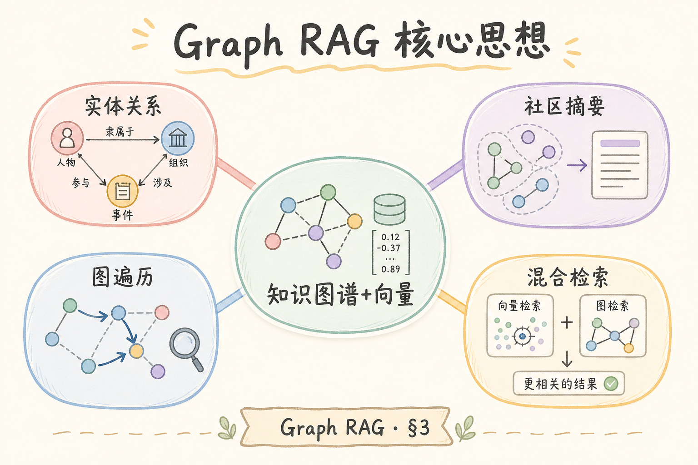
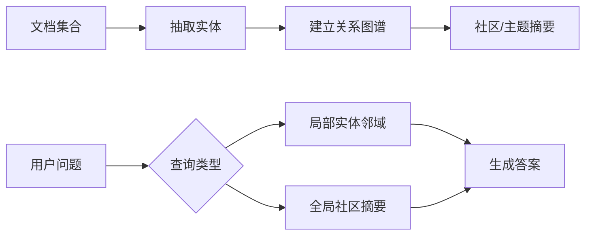
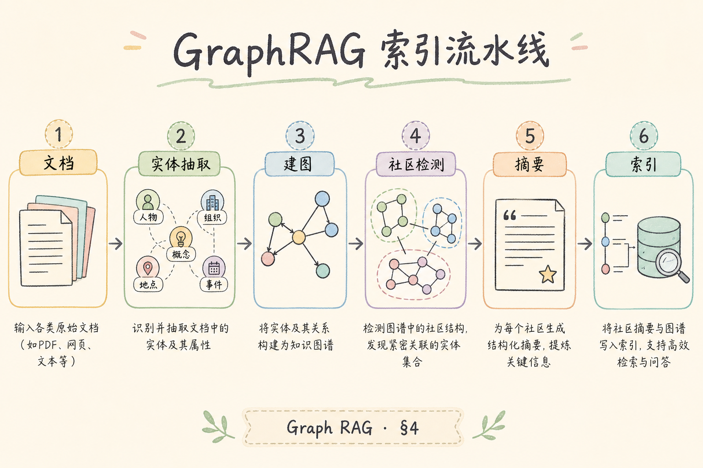
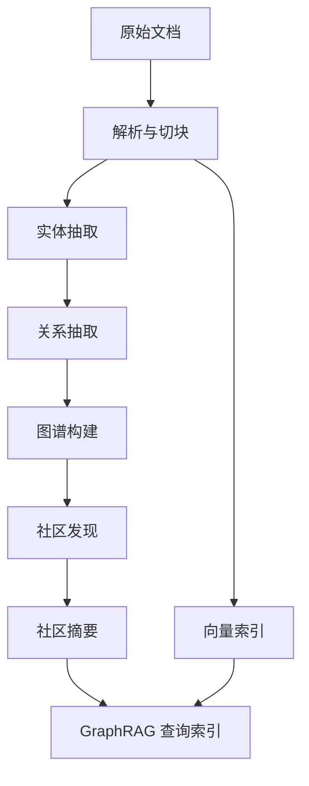
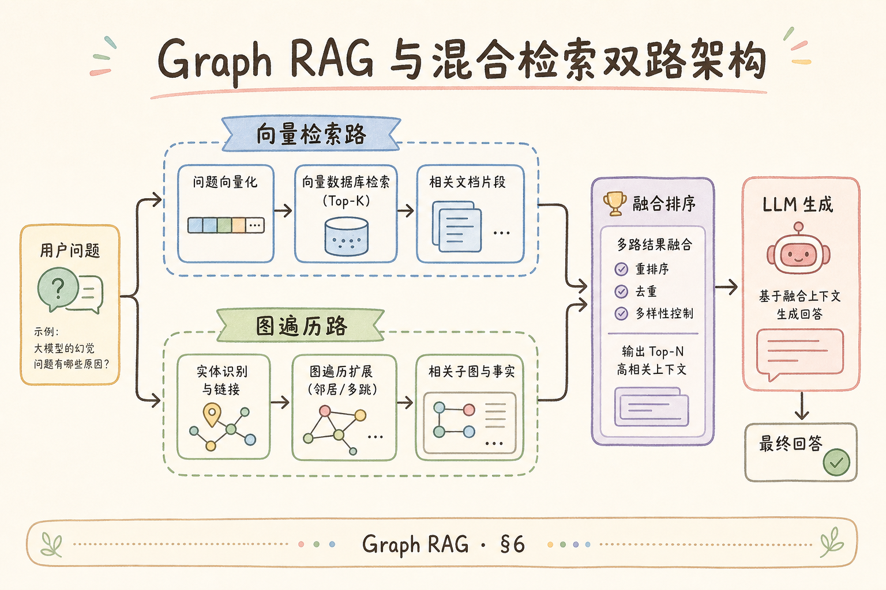
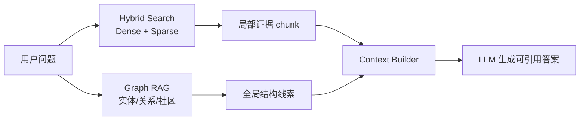
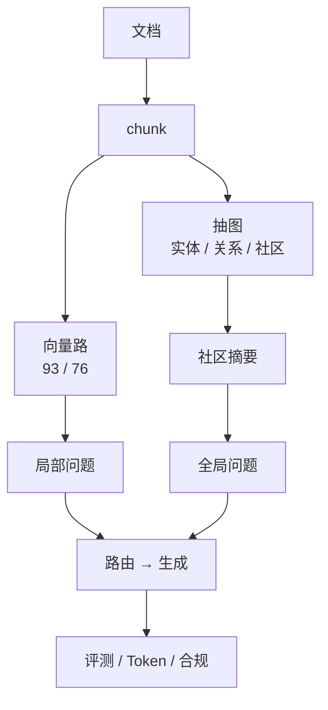

# H 进阶（一）：Graph RAG 完全指南

> 传统 RAG 用 [93 混合检索](93.hybrid-search-tutorial.md) 找 **相似 chunk**——面对「整库主题趋势」「A 和 B 两个部门政策有何矛盾」这类 **全局、关联型问题**，单向量 Top-k 常常 **碎片化**。[Microsoft GraphRAG](https://github.com/microsoft/graphrag) 把文档变成 **实体—关系—社区摘要** 的知识图，查询时走 **local / global / drift** 不同搜索模式。这篇是 [企业 RAG 路线图](ENTERPRISE_RAG_ROADMAP.md) **H 进阶主线篇**（路线图第 **216** 条），带你理解 **索引流水线、社区检测、与经典检索如何并存**。前置：[93 混合检索](93.hybrid-search-tutorial.md)、[104 多跳检索](104.multi-hop-retrieval-tutorial.md)、[76 Chroma](76.chroma-vector-db-tutorial.md)、[110 RAG Prompt](110.rag-prompt-template-tutorial.md)、[194 Token 成本](194.llm-token-cost-optimization-tutorial.md)。

---

## 目录

1. [前言：相似 chunk 解决不了的全局问题](#1-前言相似-chunk-解决不了的全局问题)
2. [本文边界与动手路径](#2-本文边界与动手路径)
3. [Graph RAG 是什么](#3-graph-rag-是什么)
4. [与经典向量 RAG 的分工](#4-与经典向量-rag-的分工)
5. [Microsoft GraphRAG 索引流水线](#5-microsoft-graphrag-索引流水线)
6. [实体、关系与社区摘要](#6-实体关系与社区摘要)
7. [查询模式：Local、Global、Drift](#7-查询模式localglobaldrift)
8. [与 [93] 混合检索的架构组合](#8-与-93-混合检索的架构组合)
9. [先错对对：五种典型翻车](#9-先错对对五种典型翻车)
10. [综合实战：GraphRAG 最小实验](#10-综合实战graphrag-最小实验)
11. [成本、延迟与 Token 预算](#11-成本延迟与-token-预算)
12. [综合概念地图](#12-综合概念地图)
13. [常见陷阱与 FAQ](#13-常见陷阱与-faq)
14. [总结与系列下一步](#14-总结与系列下一步)

## 1. 前言：相似 chunk 解决不了的全局问题

评测两类问题：

| 类型 | 例子 | 经典 RAG |
|------|------|----------|
| **局部** | 「差旅住宿上限？」 | [98 Top-k](98.top-k-retrieval-tutorial.md) 擅长 |
| **全局** | 「公司政策对员工福利的整体态度？」 | Top-k **各说各话** |
| **关联** | 「财务制度与采购制度在审批流上冲突吗？」 | 需 **跨文档关系** |

[104 多跳检索](104.multi-hop-retrieval-tutorial.md) 用 **多轮检索** 缓解关联题；**Graph RAG** 在 **索引期** 用 LLM 抽 **实体与边**，再对图做 **社区聚类与摘要**，查询期用 **图结构 + 向量** 选上下文。

**Graph RAG**（Graph-based Retrieval-Augmented Generation）：以 **知识图谱式结构**（节点、边、社区）增强检索与上下文组织，使 **全局聚合与关系推理** 有显式载体。通俗说：**先画人物关系网并写「圈子梗概」，再问「整个圈子在讨论什么」**。

本篇会回答：Graph RAG 是什么、有什么用、为什么能解决普通 Top-k 难处理的全局问题、怎么用 local/global 查询，以及典型用法和不该用的场景。

**读完本文，你应该能做到：**

1. 说清 Graph RAG 与 [93](93.hybrid-search-tutorial.md) **互补而非替代**。  
2. 描述 GraphRAG **index 四阶段** 与产出物目录。  
3. 选择 **local vs global** 查询模式。  
4. 设计 **双路架构**：常规问走向量，全局问走图。  
5. 评估 **索引 Token 成本**（[194](194.llm-token-cost-optimization-tutorial.md)）。  
6. 完成 §9 五种先错对对。

### 1.1 H 进阶线位置

```text
G 生产合规 [195-198]
216 Graph RAG ← 本篇（主线）
217 KG 增强检索 [200]（了解）
218 Agentic RAG [201]
```

### 1.2 术语速查

| 中文 | English | 一句话 |
|------|---------|--------|
| 实体 | Entity | 人、组织、概念节点 |
| 关系 | Relationship | 实体间有向边 |
| 社区 | Community | 图聚类子图 |
| 社区摘要 | Community Report | LLM 写的子图综述 |
| Local Search | 局部图搜索 | 实体邻域 |
| Global Search | 全局图搜索 | 跨社区聚合 |

## 2. 本文边界与动手路径

动手路径强调 **小语料试点**：5～6 篇 md 跑通 `graphrag index` 与 global/local 对比，再评估是否值得全库投入。本文不讲 Neo4j 全栈运维与每版 YAML 全参数——目标是理解流水线、查询模式与和 [93 混合检索](93.hybrid-search-tutorial.md) 的双路组合。索引成本远高于普通向量 RAG，决策前用 [194](194.llm-token-cost-optimization-tutorial.md) 思维粗算 LLM token。

**档位：H 进阶主线篇（路线图 216）。**

**本文讲：** 概念、GraphRAG 流水线、查询模式、与 93 组合、最小实验、成本。  
**本文不讲：** Neo4j 全栈运维、自研图神经网络、每版 GraphRAG YAML 全参数。

本文适合已经做过普通向量 RAG 的读者。你会看到 Graph RAG 多出来的不是一个新 API，而是一套“抽图、建社区、写摘要、按问题路由”的索引与查询流程。

### 2.1 动手路径

| 步骤 | 验收 |
|------|------|
| A | 读 §3～§4，画双路架构 | 白板 |
| B | `pip install graphrag`，准备 5 篇 md | input/ |
| C | 跑 `graphrag index` | output/ 有 parquet |
| D | `graphrag query --method global` | 有主题综述 |
| E | 对比同问 [93] 向量-only | 各写优缺点 |

**环境：** Python 3.10+；OpenAI 兼容 API Key；16GB+ RAM 建议；小语料实验。

### 2.2 沿用前文

| 概念 | 来自 |
|------|------|
| 混合检索 | [93](93.hybrid-search-tutorial.md)、[94 RRF](94.rrf-fusion-tutorial.md) |
| 多跳 | [104](104.multi-hop-retrieval-tutorial.md) |
| 向量库 | [76](76.chroma-vector-db-tutorial.md)、[78](78.qdrant-tutorial.md) |
| Prompt | [110](110.rag-prompt-template-tutorial.md) |
| Token | [194](194.llm-token-cost-optimization-tutorial.md) |

## 3. Graph RAG 是什么

读下图时，先看「Graph RAG 核心思想」想表达的主线：它把本节的概念关系压缩成一张可对照的图。



下面这张图说明 Graph RAG 的核心思想。读图时重点看：Graph RAG 不只找相似 chunk，还会把实体、关系和社区摘要作为全局理解线索。



结论：Graph RAG 适合跨文档、跨实体、需要全局归纳的问题；普通事实问答未必需要它。

价值在于 **全局问题** 有社区摘要当「日报」，**局部问题** 有实体邻域当「放大镜」——索引期多走抽图、聚类、写报告，查询期按问题类型路由，不是把向量检索简单改名。

经典 RAG：**文档 → chunk → 向量 → 相似度**。  
Graph RAG 增加：

```text
文档 → chunk → LLM 抽实体/关系 → 图
              → 社区检测 → 社区摘要（高层语义）
查询 → 选社区/实体子图 → 拼上下文 → LLM 答
```

**价值**：**全局问题** 用 **社区摘要** 当日报；**局部问题** 用 **实体邻域** 当放大镜。

## 4. 与经典向量 RAG 的分工

生产常见 **混合架构**：FAQ 与局部事实仍走 [93]；全局主题、跨文档矛盾走 GraphRAG。索引贵、global 延迟高——默认不应全库替代向量。运维上要管理 parquet、社区报告版本与 `graph_index_v` 参数，换 chunk_size 往往全量重跑 index。

先用一张表把边界讲清楚：向量 RAG 负责“找相似文本”，Graph RAG 负责“组织实体关系和全局摘要”。两者经常一起用，不是非此即彼。



如果问题能被几段局部证据回答，向量 RAG 更轻；如果问题要求跨文档看主题、冲突或组织关系，Graph RAG 才值得引入。

| 维度 | 向量 RAG [93] | Graph RAG |
|------|---------------|-----------|
| 索引成本 | embed 为主 | **大量 LLM 抽图** |
| 查询延迟 | 低 | global 较高 |
| 局部事实 | 强 | 强（local） |
| 全局主题 | 弱 | **强（global）** |
| 关系/冲突 | 需多跳 [104] | **显式边** |
| 运维 | 成熟 | 图产物 + 版本 |

**结论**：生产常见 **混合架构**（§8），而非 **二选一**。

## 5. Microsoft GraphRAG 索引流水线

读下图时，先看「GraphRAG 索引流水线」想表达的主线：它把本节的概念关系压缩成一张可对照的图。

下面这张图展示 GraphRAG 的索引流水线。读图时重点看：它比普通向量入库多了实体抽取、关系抽取和社区摘要，成本也更高。



这张图的结论是：GraphRAG 的能力来自额外索引加工，不是把向量检索换个名字。

官方 [microsoft/graphrag](https://github.com/microsoft/graphrag) 典型阶段：

| 阶段 | 产出 |
|------|------|
| 1. Chunk | 文本块（衔接 [58](58.recursive-character-chunking-tutorial.md)） |
| 2. Extract | `entities.parquet`、`relationships.parquet` |
| 3. Cluster | 社区划分 `communities.parquet` |
| 4. Summarize | `community_reports` 自然语言摘要 |
| 5. Embed | 实体/报告向量（可选） |

**配置**：`settings.yaml` 指定 LLM、embedding、chunk size——改 chunk 要 **全量重跑 index**（成本见 §11）。

下面命令只展示最小路径：初始化目录、编辑配置、构建索引、分别跑 global 和 local 查询。具体参数会随官方版本变化，真实项目以 README 和锁定版本为准。

```bash
# 最小命令（版本以官方 README 为准）
graphrag init ./rag_graph
# 编辑 settings.yaml 与 .env
graphrag index --root ./rag_graph
graphrag query --root ./rag_graph --method global "主题问题"
graphrag query --root ./rag_graph --method local "实体细节问题"
```

跑完后重点检查 `output/` 里的实体、关系、社区和报告文件，而不是只看命令是否退出成功。

## 6. 实体、关系与社区摘要

**社区摘要**是 global 查询的核心上下文——LLM 读子图写的几百字综述，相当于「圈子梗概」。实体名归一化（别名表）与图质量直接相关：同一部门被抽成多个节点会分裂社区，全局答案碎片化。与 [200 KG 增强](200.kg-enhanced-retrieval-tutorial.md) 区别：GraphRAG 偏 LLM 自动抽图 + 社区；传统 KG 常人工本体。

**实体**（Entity）：文本中稳定指称——「采购部」「报销制度」「2024 预算」。  


**关系**（Relationship）：`采购部 --[负责]--> 审批流程`。  
**社区**（Community）：图聚类（如 Leiden）得到的 **紧密子图**。  
**社区摘要**（Community Report）：LLM 读社区内实体与边，写 **几百字综述**——**global 查询的核心上下文**。

与 [200 KG 增强检索](200.kg-enhanced-retrieval-tutorial.md)（了解篇）区别：GraphRAG **强调 LLM 自动抽图 + 社区摘要**；传统 KG 常 **人工本体**。

## 7. 查询模式：Local、Global、Drift

选型口诀：实体细节问 **local**（邻域 + 关联 chunk）；全库主题问 **global**（多社区报告 map-reduce）；**drift** 用于探索性主题漂移，PoC 可先不启用。global 延迟与 token 高于 local，路由层应识别问题形态，避免所有问句都走最贵路径。

Graph RAG 查询模式的区别在于“上下文从哪里来”。local 更像围绕一个实体查邻居，global 更像阅读多个社区摘要后做总括，drift 用于探索主题漂移。

初学者可以先只掌握 local 和 global：一个回答实体细节，一个回答整体主题。

等这两种模式能稳定运行后，再考虑 drift 这类探索性查询。

| 模式 | 适用 | 上下文来源 |
|------|------|------------|
| **local** | 「张三负责什么？」 | 实体邻域 + 关联 chunk |
| **global** | 「全库主要风险主题？」 | **多社区摘要** 聚合 |
| **drift** | 主题漂移探索 | 社区间路径 |

**Global 直觉**：不是 Top-k chunk，而是 **选 Top 社区报告** → map-reduce 式生成（衔接 [207 Map-Reduce](207.map-reduce-summarization-tutorial.md)）。

## 8. 与 [93] 混合检索的架构组合

读下图时，先看「Graph RAG 与混合检索双路架构」想表达的主线：它把本节的概念关系压缩成一张可对照的图。

下面这张图说明 Graph RAG 与混合检索如何组合。读图时重点看：两条路径可以互补，不必互相替代。



结论：生产系统常用双路架构。Hybrid Search 保证具体证据，Graph RAG 补充跨文档结构和全局摘要。

推荐 **路由 + 融合**：

```text
用户问 → 意图分类（FAQ / 全局 / 关联）
       ├─ FAQ/事实 → [93] BM25+向量 → [96 rerank] → 生成
       └─ 全局/主题 → GraphRAG global/local → 生成
```

| 组件 | 职责 |
|------|------|
| [93 混合检索](93.hybrid-search-tutorial.md) | 高精度 **条文、编号、条款** |
| GraphRAG | **主题、趋势、矛盾** |
| [94 RRF](94.rrf-fusion-tutorial.md) | 若双路都跑，按名次融合 chunk + 报告片段 |
| [107 预算](107.context-budget-tutorial.md) | 社区报告很长，**必裁** |

**ACL**（[53](53.metadata-acl-tutorial.md)）：图节点带 `tenant_id`；**无权限社区** 不进 global 聚合。

### 4.3 Microsoft GraphRAG 索引阶段

源码流水线：chunk → 实体关系抽取 → 社区检测 → 社区摘要。索引成本远高于普通向量 RAG，适合 **多文档主题全局问**。

### 5.3 局部 vs 全局查询

局部：实体邻域 + 向量；全局：社区摘要汇总。Map-Reduce 式回答「整个库的主题趋势」。

### 6.3 与 [200 KG 增强](200.kg-enhanced-retrieval-tutorial.md)

GraphRAG 偏 **无/schema 轻**；若已有 Neo4j 本体，可 hybrid。

### 7.3 存储与费用

图 + 摘要双倍存储；[193 向量成本](193.vector-storage-cost-tutorial.md) 需另算图数据库。

### 8.3 何时不选 GraphRAG

FAQ 单跳、库小、预算紧——普通 [93 混合检索](93.hybrid-search-tutorial.md) 足够。

### 9.2 最小 PoC 步骤

选 hundred 页内文档子集；跑官方 GraphRAG CLI；对比普通 RAG 在「总结性问题」上的胜率。

### 10.3 与 [104 多跳](104.multi-hop-retrieval-tutorial.md)

GraphRAG 全局路类似多跳摘要；局部路仍是向量检索。

### 10.4 运维复杂度

索引小时级、需 GPU 抽图时，纳入 [187 K8s](187.kubernetes-basics-rag-tutorial.md) 批处理 Job。

---

## 9. 先错对对：五种典型翻车

翻车多源于把 GraphRAG 当万能开关：全库替代向量、小语料期望奇迹、抽图用小模型不评测、社区摘要不随文档更新、忽视 index 阶段 LLM 费用。每条都应在 PoC 检查清单里勾选，再决定是否扩大语料。

下面这些误区都来自把复杂系统简单化：图谱、合规和权限不是加一个标签就完成，而是要能解释来源、关系、边界和失败处理。

### 9.1 错：全库 GraphRAG 替代向量

**对**：**索引贵、延迟高**——默认 FAQ 仍走 [93](93.hybrid-search-tutorial.md)。

### 9.2 错：小语料上 GraphRAG 期望奇迹

**对**：图需 **规模与关系密度**；5 页 PDF **向量足够**。

### 9.3 错：抽图 LLM 换便宜模型不评测

**对**：边错 **全局答案全歪**——用 [143 Golden](143.golden-dataset-tutorial.md) 评 **全局题**。

### 9.4 错：社区摘要不更新

**对**：文档 [49 增量](49.incremental-update-tutorial.md) 后 **局部重跑 index** 或标记社区 stale。

### 9.5 错：忽视 [194 Token 成本]

**对**：index 阶段 **每 chunk 多次 LLM**——先做 **子集试点**（[192](192.embedding-batch-cost-tutorial.md) 思维用在 LLM）。

## 10. 综合实战：GraphRAG 最小实验

实验必须带 **对照组**：同问走向量-only 与 global/local，记录延迟、prompt tokens、引用质量。只跑 GraphRAG 无法判断提升来自图结构还是 prompt 更长。语料与 [76 §9](76.chroma-vector-db-tutorial.md) 对齐即可，不必第一天就上全库 PDF。

**语料**：与 [76 §9](76.chroma-vector-db-tutorial.md) 对齐——`handbook` 差旅 + `finance` 预算 4～6 个 md 文件。

这个实验的目的不是证明 Graph RAG 一定更好，而是让你亲手看到它的成本和适用题型。请同时准备一个普通向量 RAG 作为对照。

没有对照组时，你很难判断 GraphRAG 的提升来自图结构，还是只是 prompt 更长、模型调用更多。

```text
rag_graph/
├── input/           # *.md
├── settings.yaml
├── .env             # OPENAI_API_KEY 等
└── output/          # index 后 parquet + lancedb 等
```

**对比实验**：

1. 问「差旅住宿标准」→ **local + [93] 向量** 应都好。  
2. 问「员工手册与财务制度的整体关注点差异」→ **global** 应更连贯。  
3. 记录 **延迟、prompt tokens、答案引用**（[113 引用](113.inline-citation-tutorial.md)）。

**合规**：抽图 LLM 若出境，接 [197](197.gdpr-data-residency-tutorial.md)/[198](198.china-compliance-rag-tutorial.md)；日志 [196](196.audit-log-rag-tutorial.md)。

## 11. 成本、延迟与 Token 预算

Graph RAG 的主要成本集中在索引阶段，因为抽实体、抽关系、写社区摘要都会调用 LLM。查询阶段也会变重，尤其是 global 查询要聚合多个社区报告。

| 阶段 | 成本驱动 |
|------|----------|
| Index extract | chunk 数 × LLM 调用 |
| Community report | 社区数 × 摘要长度 |
| Query global | 多报告 map-reduce |
| Query local | 小于 global |

**优化**（[194](194.llm-token-cost-optimization-tutorial.md)）：

- 仅对 **变更 doc** 增量抽图；  
- 限制 **社区报告字数**；  
- global 用 **小模型** 做 map，大模型 final；  
- 缓存 **稳定社区摘要**。

存储：[193](193.vector-storage-cost-tutorial.md)——parquet + lancedb **另计磁盘**。

### 11.1 Index 成本粗算模板

下面是粗算模板，用来判断是否先做 10% 试点。它不是财务精算，但足够帮你发现“全库 GraphRAG 可能超预算”的风险。

```text
index_llm_cost ≈ chunk数 × (抽取调用token + 关系调用token) × 单价
report_cost ≈ 社区数 × 每社区摘要token × 单价
```

**试点**：先对 **10% 文档** index，外推全库——在 [184 看板](184.admin-log-eval-dashboard-tutorial.md) 设 **index 预算上限**，超则 **降 chunk 或换小模型抽图**。

### 11.2 settings.yaml 关键项（概念）

| 项 | 影响 |
|----|------|
| chunk_size | 实体密度与调用次数 |
| llm.model | 抽图质量与成本 |
| community.max_level | 社区粒度 |
| embed.model | 与 [93] 向量空间是否一致 |

改 chunk_size **全量重跑**——在 [154 参数版本](154.param-version-management-tutorial.md) 记 **graph_index_v3**。

### 11.3 Local 查询与 [93] 结果融合示例

```text
1. [93] hybrid top 5 chunks
2. GraphRAG local 实体 E 的邻域 top 3 chunks
3. RRF 融合去重 [94]
4. [107] 预算装填 → [110] prompt
```

**禁止** 两路各生成一次答案再让用户选—— **融合后再单次生成**，否则 **双倍 Token**（[194](194.llm-token-cost-optimization-tutorial.md)）。

### 11.4 实体归一化表

维护 `alias.csv`：`采购部,采购中心,Procurement` → `entity_procurement`。抽图 LLM **不一致的实体名** 会 **分裂社区**——归一化是 **图质量的地基**，不比调 HNSW 次要。

### 11.5 失败回退策略

```text
global 超时或空社区 → fallback [93] hybrid + 提示「以下为条文检索」
local 实体未命中 → 扩大 hop 或降级向量
```

[112 拒答](112.refusal-strategy-tutorial.md) 在 **两路皆空** 时触发——勿编造 **社区报告没有的主题**。

## 12. 综合概念地图

实现时把路由决策、命中的社区报告与引用 chunk 写进 trace，方便复盘「为何走图路」。向量路与图路最终 **融合后再单次生成**，避免双倍 token 与矛盾双答案（见 [194](194.llm-token-cost-optimization-tutorial.md)）。

读这张图时，先看“向量路”和“图路”如何分工：向量路负责局部事实，图路负责全局主题和关系路径。

图里的两条路最后都会进入同一个生成环节，这意味着用户只看到一个答案，系统内部才决定证据来自哪条路。

因此实现时要把路由决策、命中的社区报告和引用 chunk 都写进 trace，方便后续复盘。



结论：Graph RAG 不是替代向量检索，而是给全局问题加一条显式结构通道。

## 13. 常见陷阱与 FAQ

Graph RAG 最容易踩的坑不是“图数据库没装好”，而是把图当成万能开关。先确认问题是不是需要全局关系和社区摘要，再决定是否引入 Graph RAG。

### 13.1 GraphRAG 必须用 Neo4j 吗？

不是。Microsoft 方案常见的是 Parquet + 向量存储的组合，重点是索引产物和查询编排，不是数据库品牌。

### 13.2 与 [104 多跳] 怎么选？

多跳更偏查询时迭代，GraphRAG 更偏索引时建图。关系密、主题重、需要全局总结时用 GraphRAG；单纯找证据时仍以向量检索为主。

### 13.3 中文文档效果怎么样？

取决于抽图 LLM 的中文能力和实体归一化质量。中文别名、机构简称、制度缩写要先统一，否则同一个实体会被拆成多个节点。

### 13.4 如何评测 Graph RAG？

分局部金标和全局 rubric。局部题看证据是否找对，全局题看摘要是否覆盖主要主题、是否遗漏冲突和关系路径。

### 13.5 和 [201 Agentic RAG] 的关系？

Agent 可以把 GraphRAG 当成一种工具路由：局部问题走向量，全局问题走图。GraphRAG 不是 Agent 的替代品，而是工具箱里的一个组件。

## 14. 问题形态：什么时候该用 Graph RAG

立项前先问：评测集里全局题/关联题占比是否足够高，能否承担 index 阶段多轮 LLM 的成本与小时级索引工期。若 80% 是单条条款 FAQ，[93 混合检索](93.hybrid-search-tutorial.md) 通常是更优默认。

判断标准不是「库很大就上 Graph」，而是 **问题是否需要跨文档关系与全局归纳**。纯条款查询、小语料 FAQ、预算紧的 PoC 仍优先 [93 混合检索](93.hybrid-search-tutorial.md)。引入 GraphRAG 前应有金标：局部题与全局题分开评，避免用全局摘要回答本该 local 的事实问。

当问题需要多跳关系、跨文档归纳、或者“不是某一句，而是整套制度怎么协同”时，Graph RAG 才真正发挥作用。纯事实问答、局部条款查询、小语料检索通常不必强上。

## 15. 构图：实体抽取与边类型

ingest 阶段通常先抽实体，再抽关系，再把这些边挂回来源 chunk_id。你可以把它理解成“把原文里的名词和动词变成可查询的图结构”，而不是直接把整篇文章丢进图数据库。

构图质量直接决定后续答案质量。实体漏抽会召回不到，关系抽错会把全局结论带偏。

建议先在一个小领域里人工抽查 20 条边，确认关系方向和来源 chunk 都可信，再扩大索引范围。

```text
实体：人 / 部门 / 制度 / 合同
关系：隶属 / 引用 / 负责 / 冲突
```

边必须保留 provenance，也就是来源 chunk_id。这样当图里某条关系错了，你可以回到原文修复，而不是在图里盲修。

## 16. 查询与生成编排

GraphRAG 查询不是“先搜图再搜文”这么简单，而是先识别问题类型，再决定走 local、global 还是两路融合。最终回答前，仍然要把图的线索和文本 chunk 重新拼回 prompt。

这里最重要的工程原则是“融合后再生成”：不要让向量路和图路各生成一份答案再交给用户选择。

融合后单次生成还能统一引用格式、降低 token 成本，并避免两个答案互相矛盾。

```text
问题 → 实体链接 → local / global 路由 → chunk + 社区摘要 → LLM
```

这一步的关键不是流程复杂，而是每一层都能被 trace 和评测记录下来。

## 17. 与 KG 增强检索衔接

选型时问：问题是「全局主题」还是「实体桥接」？前者偏 199 社区摘要，后者偏 217 白名单过滤。同一产品可双轨：路由层决定走哪条路，trace 记录决策与命中社区/实体，便于成本与质量复盘。

[200](200.kg-enhanced-retrieval-tutorial.md) 是轻量在线图约束：实体链接 → doc 白名单 → 向量检索，运维通常比全量 GraphRAG 索引轻。可并存：199 提供社区级全局摘要，217 提供实体桥接过滤；路由见 [206 Adaptive RAG](206.adaptive-rag-tutorial.md)。分仓存储索引产物与边表，文档化数据来源供 on-call。

[200 KG 增强](200.kg-enhanced-retrieval-tutorial.md) 是 Graph RAG 的轻量变体。它更适合术语表、同义词扩展和简单关系补全；Graph RAG 则适合更重的社区摘要和全局归纳。

### 系列交叉阅读

- [200 KG 增强](200.kg-enhanced-retrieval-tutorial.md)
- [104 多跳](104.multi-hop-retrieval-tutorial.md)
- [201 Agentic](201.agentic-rag-tutorial.md)

## 18. 总结与下一步

Graph RAG 的代价是索引 LLM 调用多、运维重——适合小域试点再扩全库。下一步：读牢 [93](93.hybrid-search-tutorial.md) 与 [104 多跳](104.multi-hop-retrieval-tutorial.md)，对照本篇 local/global，再与 [200 KG 增强](200.kg-enhanced-retrieval-tutorial.md) 选型。合规上抽图 LLM 出境接 [197](197.gdpr-data-residency-tutorial.md)/[198](198.china-compliance-rag-tutorial.md)；日志接 [196 审计](196.audit-log-rag-tutorial.md)。

Graph RAG 解决的是“局部 chunk 够不够”的问题之外那一层：跨文档关系、全局主题和结构化归纳。它的代价是索引更贵、流程更重，所以最适合先做小域试点，再决定是否扩展到全库。

下一步建议按这个顺序继续：先把 [93 混合检索](93.hybrid-search-tutorial.md) 和 [104 多跳](104.multi-hop-retrieval-tutorial.md) 读牢，再回来看本篇的 local/global 分工，最后和 [200 KG 增强](200.kg-enhanced-retrieval-tutorial.md) 做选型对比。
