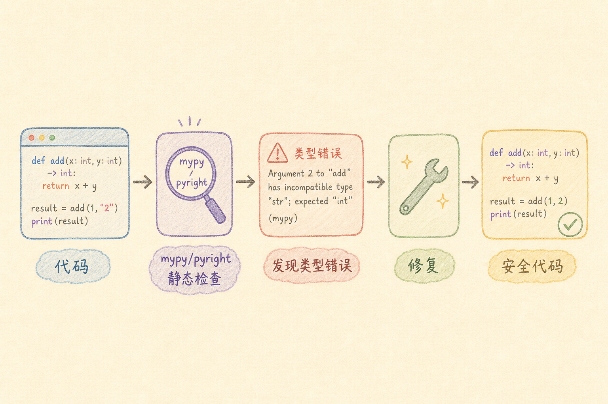
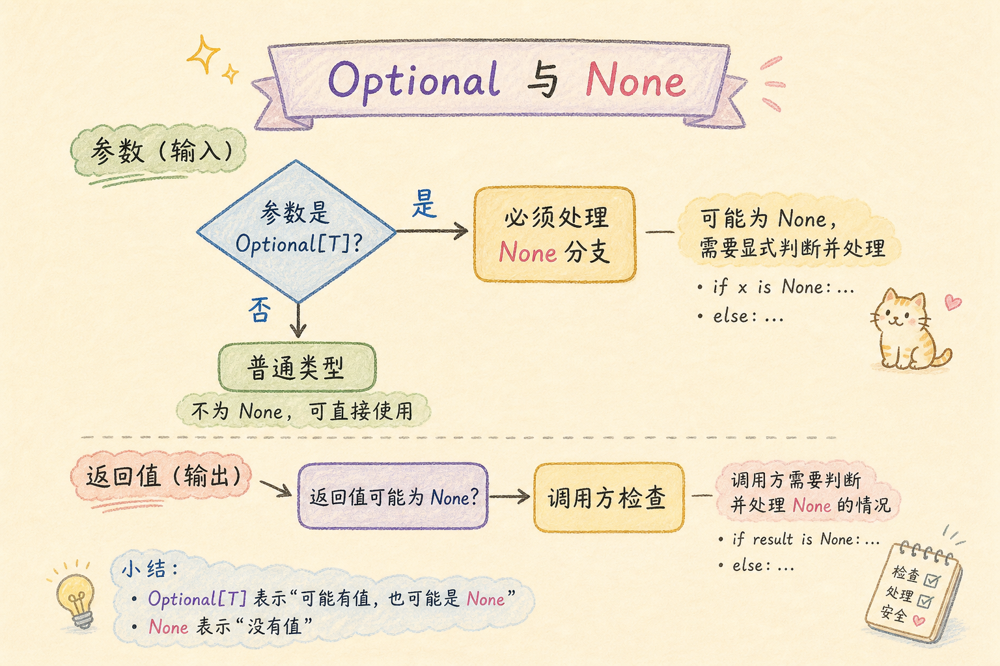
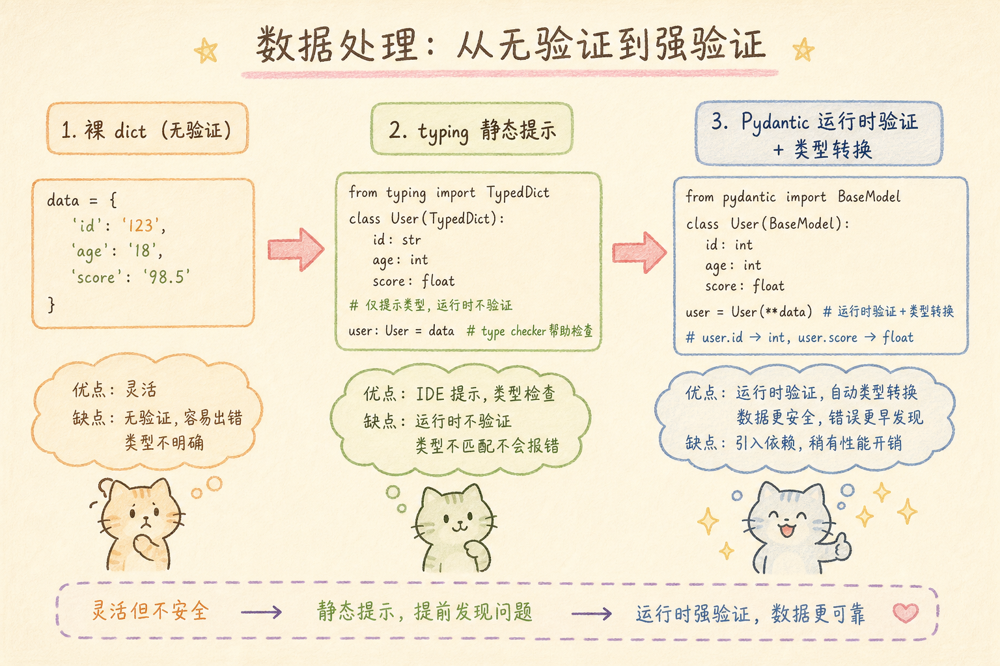
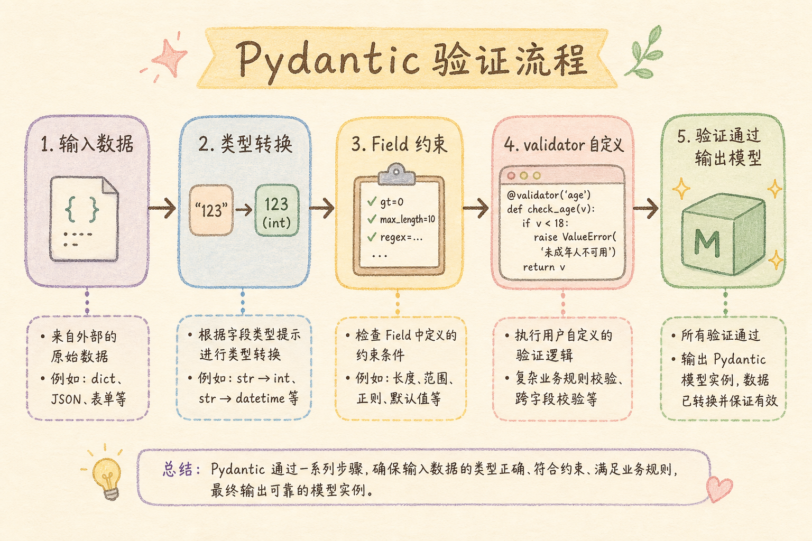
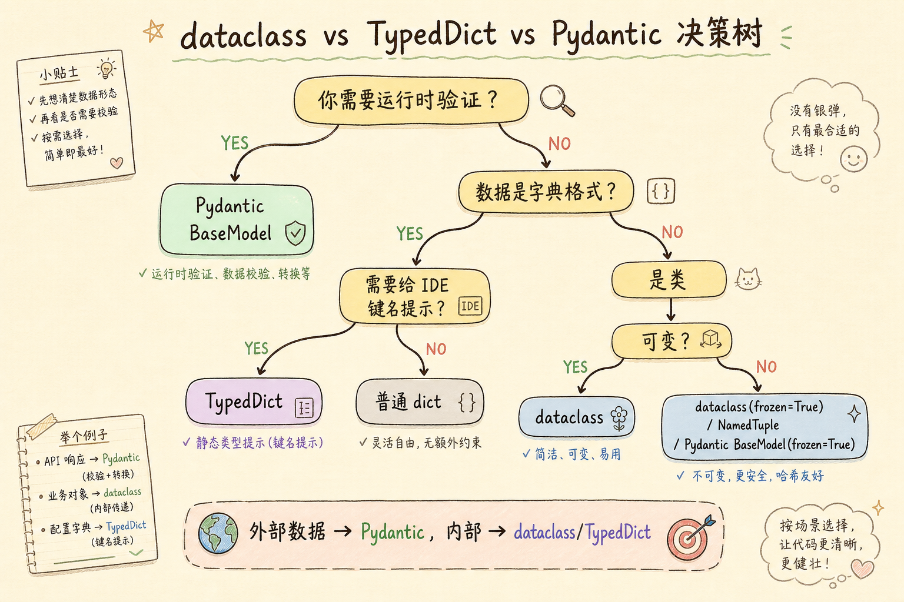

# Python 类型注解完全指南：从 typing 到 pydantic，告别「动态一时爽，重构火葬场」

> 你是不是也经历过——深夜改一个函数，不知道参数到底是字符串还是整数、是不是可以为 None？翻遍了注释也没找到答案，最后只能靠 `print(type(x))` 一步一步调试？这篇教程从零带你掌握 Python 类型注解，用 typing 让代码自带「说明书」，用 pydantic 让数据验证坚如磐石。

---

## 目录

1. [前言：一段血泪史](#1-前言一段血泪史)
2. [什么是类型注解](#2-什么是类型注解)
3. [typing 基础篇](#3-typing-基础篇)
4. [类型检查器实战](#4-类型检查器实战)
5. [typing 进阶篇](#5-typing-进阶篇)
6. [Pydantic 入门](#6-pydantic-入门)
7. [Pydantic 进阶](#7-pydantic-进阶)
8. [实战案例](#8-实战案例)
9. [dataclass vs TypedDict vs Pydantic](#9-dataclass-vs-typeddict-vs-pydantic)
10. [最佳实践与避坑指南](#10-最佳实践与避坑指南)
11. [总结](#11-总结)

---

## 1. 前言：一段血泪史

凌晨两点，你盯着屏幕上一行报错，眼睛已经快睁不开了：

```
Traceback (most recent call last):
  ...
AttributeError: 'NoneType' object has no attribute 'get'
```

翻了三层函数调用，你终于找到源头：

```python
def process_order(order):
    """处理订单"""
    total = order.get("total") * order.get("quantity")  # order 可能是 None？！
    ...
```

`order` 到底是什么？字典？对象？它从哪来的？可能是 `None` 吗？

你打开同事写的函数：

```python
def fetch_order(order_id):
    """从数据库获取订单"""
    ...
    return result  # result 是什么类型？找不到文档！
```

**这就是动态类型的暗面：你永远不知道一个变量到底是什么，直到运行时它炸了。**

更可怕的是你在团队协作中遇到的场景：

- 老项目里 3000 行的 `utils.py`，每个函数的参数都没有类型标注，全靠变量名猜
- 接口文档写着 `data: object`，前端同事跑来问你「object 到底长什么样」
- 重构一个基础函数，改完后怕得不敢合并——你不知道改了什么下游类型
- 后端返回的数据你以为有 `id` 字段，实际上是 `user_id`，线上跑了三周才被客户发现


**类型注解就是为解决这些问题而生的。** 它让你：

1. **在写代码的时候就发现问题**，而不是等到运行时
2. **让 IDE 给你提供智能补全**，Tab 键按到起飞
3. **代码本身就是文档**，不需要额外维护注释
4. **大胆重构**，类型检查器会告诉你哪里还没改完

> Python 的类型注解**不会在运行时强制检查**——Python 依然是动态语言。类型注解是一种可选的「标注」，只有当你使用 mypy 或 pyright 等类型检查器时，它们才会发挥作用。这就像是给你的代码加了一份可验证的「说明书」。

---

## 2. 什么是类型注解

### 2.1 最简单的例子

类型注解就是在变量、函数参数、返回值后面用冒号标注类型。让我们从一个没有注解的函数开始，逐步加上注解：

```python
# ❌ 没有类型注解——阅读者什么都不知道
def get_user_score(user):
    if user.is_vip:
        return user.points * 1.5
    return user.points

# ✅ 加上类型注解——一眼就能看懂
def get_user_score(user: User) -> float:
    if user.is_vip:
        return user.points * 1.5
    return user.points
```

就这么简单。`user: User` 表示参数类型是 `User` 类，`-> float` 表示函数返回浮点数。

### 2.2 Python 3.12 之前 vs 之后

类型注解语法在 Python 3.12 有一个重要的变化：

```python
# Python 3.8 及更早版本——需要从 typing 导入
from typing import List, Dict, Optional

def get_names(ids: List[int]) -> Dict[int, str]:
    ...

# Python 3.9+——可以直接用内置类型
def get_names(ids: list[int]) -> dict[int, str]:
    ...

# Python 3.10+——Union 可以用 | 语法
def get_user(user_id: int | None) -> User | None:
    ...

# Python 3.12+——泛型语法进一步简化
def first[T](items: list[T]) -> T | None:
    return items[0] if items else None
```

> **本文使用 Python 3.10+ 语法作为标准。** 如果你还在用老版本，可以用 `from __future__ import annotations` 来启用新语法。

### 2.3 类型注解只是「注解」

这是最重要的概念，值得单独一节。

```
类型注解 ≠ 运行时强制

Python 解释器在运行代码时，根本不会检查类型注解。
它只是把注解存起来，你可以通过 __annotations__ 属性读取。
```

```python
def add(a: int, b: int) -> int:
    return a + b

# 传字符串进去，Python 不会报错！它只是把两个字符串拼起来了
print(add("hello", "world"))  # 输出: helloworld

# 查看函数的注解
print(add.__annotations__)
# 输出: {'a': <class 'int'>, 'b': <class 'int'>, 'return': <class 'int'>}
```

**那类型注解有什么用？** 答案是：配合**静态类型检查器**使用。你写代码时 IDE 会实时检查类型；提交前跑一下 mypy 或 pyright，它们会扫描你的代码，在不运行的情况下检查类型错误。



---

## 3. typing 基础篇

### 3.1 基本类型的注解

```python
# 原始类型——直接写 Python 内置类型即可
name: str = "Alice"
age: int = 25
price: float = 99.9
is_active: bool = True
data: bytes = b"hello"

# 任何类型（尽量少用）
from typing import Any
anything: Any = "可以是任何东西"  # Any 等于放弃类型检查

# None 值
result: None = None

# 可调用对象
from collections.abc import Callable
callback: Callable[[int, str], bool] = lambda x, y: True
#                     ↑ 参数类型      ↑ 返回值类型
```

### 3.2 容器类型的注解

```python
# 列表
names: list[str] = ["Alice", "Bob", "Charlie"]
matrix: list[list[int]] = [[1, 2], [3, 4]]

# 元组（重要：不同长度的元组用不同的注解方式）
point: tuple[int, int] = (10, 20)          # 固定长度、已知每项类型
record: tuple[int, str, bool] = (1, "hi", True)
# 可变长度的同类型元组：
numbers: tuple[int, ...] = (1, 2, 3, 4, 5)  # ... 表示任意数量的 int

# 字典
scores: dict[str, int] = {"Alice": 95, "Bob": 87}
config: dict[str, str | int] = {"host": "localhost", "port": 8080}

# 集合
tags: set[str] = {"python", "typing", "tutorial"}
frozenset_of_ints: frozenset[int] = frozenset([1, 2, 3])

# 序列 / 可迭代对象
from collections.abc import Sequence, Iterable, Mapping

def process_items(items: Sequence[int]) -> int:
    return sum(items)  # 接受列表、元组等任意序列类型

def count_items(iterable: Iterable[str]) -> int:
    return sum(1 for _ in iterable)  # 接受任意可迭代对象
```

> **技巧**：定义参数时用抽象类型（`Sequence`、`Iterable`、`Mapping`），定义返回值时用具体类型（`list`、`dict`）。这样做让你的函数适应性更强——传入列表或元组都可以，而调用方知道会拿到什么。

### 3.3 Optional 和 Union——处理「可能为空」

```python
# Union——可以是多种类型之一
def process_id(item_id: int | str) -> str:
    return str(item_id)

# Optional——可以是某个类型或是 None（等价于 X | None）
def find_user(user_id: int) -> str | None:
    if user_id == 0:
        return None  # 没找到
    return f"User_{user_id}"

# ❌ 常见错误：忘记处理 None
def greet(user_id: int) -> str:
    user_name = find_user(user_id)
    return f"Hello, {user_name.upper()}"  # user_name 可能是 None！
    #                         ↑ mypy 会在这里报错

# ✅ 正确处理 None
def greet(user_id: int) -> str:
    user_name = find_user(user_id)
    if user_name is None:
        return "Hello, Guest"
    return f"Hello, {user_name.upper()}"  # mypy 知道这里一定不是 None
```

这就是类型注解的核心价值：**mypy 会强制你处理 `None` 的情况**，防止运行时的 `AttributeError`。



### 3.4 Literal——精确限定可选值

```python
from typing import Literal

# 不只是字符串，是哪些字符串
def set_mode(mode: Literal["read", "write", "append"]) -> None:
    ...

set_mode("read")     # ✅ OK
set_mode("delete")   # ❌ mypy 报错：不在允许的值中

# 实际应用：HTTP 方法
def request(url: str, method: Literal["GET", "POST", "PUT", "DELETE"]) -> dict:
    ...

# 结合 Union
Alignment = Literal["left", "center", "right"]
Color = Literal["red", "green", "blue"]

def style_text(text: str, align: Alignment, color: Color) -> str:
    ...
```

`Literal` 让你的类型注解精度提升了一个档次——它告诉 IDE 和调用者，「不是任何字符串都行，必须是这几个中的一个」。

### 3.5 Final——禁止修改的常量

```python
from typing import Final

MAX_CONNECTIONS: Final = 100
API_BASE_URL: Final = "https://api.example.com/v2"

# MAX_CONNECTIONS = 200  # ❌ mypy 报错：不能重新赋值给 Final 变量

class Config:
    TIMEOUT: Final[int] = 30
    # 子类也不能覆盖
```

### 3.6 类型别名

当类型变得复杂时，给它起个名字：

```python
# ❌ 难读
def process(data: dict[str, list[tuple[int, str]]]) -> dict[str, int]:
    ...

# ✅ 使用类型别名
from typing import TypeAlias

UserScores: TypeAlias = dict[str, list[tuple[int, str]]]
AggregatedScores: TypeAlias = dict[str, int]

def process(data: UserScores) -> AggregatedScores:
    ...
```

---

## 4. 类型检查器实战

### 4.1 mypy——最流行的 Python 类型检查器

安装和基本使用：

```bash
pip install mypy
mypy your_project/
```

mypy 会扫描目录下所有 `.py` 文件并报告类型错误：

```
src/main.py:15: error: Argument 1 to "greet" has incompatible type "str"; expected "int"
src/utils.py:42: error: Item "None" of "Optional[str]" has no attribute "upper"
src/models.py:8: note: Revealed type is "builtins.list[builtins.str]"
```

### 4.2 mypy 配置文件

在项目根目录创建 `mypy.ini` 或 `pyproject.toml`：

```toml
[tool.mypy]
python_version = "3.11"
strict = true                          # 启用最严格的检查
warn_return_any = true                 # 返回 Any 时警告
warn_unused_configs = true             # 检查配置是否正确
disallow_untyped_defs = true           # 不允许无类型的函数定义
check_untyped_defs = true              # 即使无类型也尽力检查

[[tool.mypy.overrides]]
module = ["tests.*"]
ignore_errors = true                   # 测试文件可以宽松一点
```

> `strict = true` 是开启 mypy 所有严格检查的快捷方式，建议新项目从 strict 模式开始。对老项目，可以从最基本的检查逐步开启。

### 4.3 Pyright——VS Code 内置的引擎

如果你用的是 VS Code 的 Python 扩展 + Pylance，那么你已经在用 Pyright 了。它是微软开发的，比 mypy 更快（用 TypeScript 写的），对类型推断更聪明。

在项目根目录创建 `pyrightconfig.json`：

```json
{
    "include": ["src"],
    "exclude": ["tests", "**/__pycache__"],
    "typeCheckingMode": "strict",
    "reportOptionalMemberAccess": true,
    "reportGeneralTypeIssues": true
}
```

或者直接放在 `pyproject.toml` 里：

```toml
[tool.pyright]
include = ["src"]
typeCheckingMode = "strict"
reportOptionalMemberAccess = true
```

### 4.4 在 CI 中集成

在 GitHub Actions 中加入类型检查，确保不合规的代码进不了主分支：

```yaml
# .github/workflows/lint.yml
name: Lint

on: [push, pull_request]

jobs:
  type-check:
    runs-on: ubuntu-latest
    steps:
      - uses: actions/checkout@v4
      - uses: actions/setup-python@v5
        with:
          python-version: "3.12"
      - run: pip install mypy
      - run: mypy src/ --strict
```

这样如果有人提交了类型不匹配的代码，CI 会直接标红，PR 无法合并。

### 4.5 渐进式添加类型注解

给老项目加类型注解不需要一步到位。推荐采用「纸巾策略」——一次擦一块：

```
阶段 1: 核心工具函数加注解         → mypy 只检查 utils.py
阶段 2: 数据模型和 API 接口        → 扩大到 models/ 和 api/
阶段 3: 全部业务逻辑               → 全项目 strict 模式
```

```bash
# 阶段 1：只检查核心模块
mypy src/utils.py --strict

# 阶段 2：逐步扩大
mypy src/utils.py src/models.py src/api.py --strict

# 阶段 3：全局严格
mypy src/ --strict
```

---

## 5. typing 进阶篇

### 5.1 TypeVar——泛型函数

当你想要函数的输入类型和输出类型之间存在关联时，用 `TypeVar`：

```python
from typing import TypeVar

T = TypeVar("T")

def first(items: list[T]) -> T | None:
    """取列表第一项，返回类型与列表元素类型相同"""
    return items[0] if items else None

# mypy 推断：
n = first([1, 2, 3])        # n 是 int | None
s = first(["a", "b", "c"])  # s 是 str | None

# 更复杂的例子：保证输入输出类型一致
def make_pair(a: T, b: T) -> tuple[T, T]:
    return (a, b)

make_pair(1, 2)         # ✅ tuple[int, int]
make_pair("a", "b")     # ✅ tuple[str, str]
make_pair(1, "b")       # ❌ mypy 报错：int 和 str 不兼容
```

**限定 TypeVar 的范围：**

```python
from typing import TypeVar

# T 只能是 int、float 或它们的子类
N = TypeVar("N", bound=int | float)

def multiply(a: N, b: N) -> N:
    return a * b  # 两个数字相乘，返回同类型

multiply(3, 4)       # ✅ N 是 int
multiply(3.0, 4.0)   # ✅ N 是 float
multiply(3, "hi")    # ❌ mypy 报错：str 不满足 bound
```

### 5.2 Generic——泛型类

当你写一个容器类时非常有用：

```python
from typing import Generic, TypeVar

T = TypeVar("T")

class Stack(Generic[T]):
    """类型安全的栈"""
    def __init__(self) -> None:
        self._items: list[T] = []

    def push(self, item: T) -> None:
        self._items.append(item)

    def pop(self) -> T | None:
        if not self._items:
            return None
        return self._items.pop()

# 使用
int_stack = Stack[int]()
int_stack.push(1)        # ✅
int_stack.push("hello")  # ❌ mypy 报错

str_stack = Stack[str]()
str_stack.push("hello")  # ✅
```

### 5.3 Protocol——鸭子类型的静态版本

Python 信奉鸭子类型：如果它走起来像鸭子、叫起来像鸭子，它就是鸭子。`Protocol` 让你在静态检查中也能用这个哲学：

```python
from typing import Protocol

class Flyable(Protocol):
    """只要能飞，就是 Flyable——不需要继承它"""
    def fly(self) -> None: ...

class Bird:
    def fly(self) -> None:
        print("鸟儿在飞")

class Airplane:
    def fly(self) -> None:
        print("飞机在飞")

# 函数要求 Flyable，Bird 和 Airplane 都满足
def take_off(entity: Flyable) -> None:
    entity.fly()

take_off(Bird())      # ✅
take_off(Airplane())  # ✅  —— 尽管 Airplane 没有显式实现 Flyable
```

这比要求所有东西都继承同一个抽象基类灵活得多。Protocol 让类型检查器理解「结构子类型」（structural subtyping）——不是看「你继承了谁」，而是看「你有什么方法」。

### 5.4 TypedDict——给字典加上结构约束

普通 `dict` 太模糊了，`TypedDict` 让你定义字典的「形状」：

```python
from typing import TypedDict

class Movie(TypedDict):
    title: str
    year: int
    rating: float

# 类型检查
movie: Movie = {
    "title": "Inception",
    "year": 2010,
    "rating": 8.8,
}

print(movie["title"])   # IDE 会提示所有合法键名
print(movie["director"]) # ❌ mypy 报错：Movie 没有 "director" 键

# 使用 total=False 让所有字段变成可选的
class MoviePatch(TypedDict, total=False):
    title: str
    year: int
    rating: float

# 或者用 NotRequired 精确控制（Python 3.11+）
from typing import NotRequired

class MovieV2(TypedDict):
    title: str           # 必填
    year: NotRequired[int]       # 选填
    rating: NotRequired[float]   # 选填
```

> `TypedDict` 在运行时就是普通字典，零开销。它的力量在于静态检查——在写代码时和 mypy 检查时生效。

### 5.5 overload——同一个函数，不同参数

当你的函数参数不同会导致返回值类型不同时，用 `@overload`：

```python
from typing import overload

@overload
def get_value(key: str) -> str | None: ...

@overload
def get_value(key: str, default: str) -> str: ...

def get_value(key: str, default: str | None = None) -> str | None:
    """实际实现——只是把两个重载合并"""
    data = {"name": "Alice", "city": "Beijing"}
    return data.get(key, default)

# 用 default 参数时，mypy 知道返回值一定不是 None
name = get_value("name")          # 推断为 str | None
name = get_value("name", "Bob")   # 推断为 str
```

注意，`@overload` 装饰的函数体永远不会被执行——它们只是「签名声明」，真正的实现在最后一个无装饰器的函数中。

### 5.6 Self——返回自身的类型

在链式调用的场景中非常有用（Python 3.11+）：

```python
from typing import Self

class QueryBuilder:
    def __init__(self) -> None:
        self._table: str = ""
        self._conditions: list[str] = []

    def from_table(self, name: str) -> Self:
        self._table = name
        return self

    def where(self, condition: str) -> Self:
        self._conditions.append(condition)
        return self

    def build(self) -> str:
        return f"SELECT * FROM {self._table} WHERE {' AND '.join(self._conditions)}"

# 链式调用
query = QueryBuilder().from_table("users").where("id > 0").build()
```

如果没有 `Self`，你就得用复杂的泛型写法。`Self` 让这一切变得优雅。

### 5.7 条件导入：解决循环引用

在大型项目中，类型注解容易造成循环引用。用 `TYPE_CHECKING` 解决：

```python
from __future__ import annotations  # 让所有注解变成字符串，延迟求值
from typing import TYPE_CHECKING

if TYPE_CHECKING:
    # 这个 import 只在 mypy 检查时执行，运行时不会导入
    from myapp.models import User
    from myapp.services import UserService

def get_user(service: "UserService", user_id: int) -> "User | None":
    # 运行时这些注解只是字符串，mypy 检查时会把它们当实际类型
    return service.find_by_id(user_id)
```

加上 `from __future__ import annotations` 后，所有注解都会被当成字符串，Python 解释器不会去执行它们——完美避免了循环导入。

---

## 6. Pydantic 入门

前面讲的 typing 解决的是**静态检查**问题——帮助 IDE 和 mypy 在编码阶段发现错误。但现实世界中，数据往往来自外部：

- 用户提交的 JSON
- 数据库查询结果
- 第三方 API 响应
- 环境变量和配置文件

**这些数据在运行时才产生，静态检查无能为力。** 这就是 Pydantic 的用武之地：



### 6.1 安装

```bash
pip install pydantic
# 推荐同时安装 email-validator 用于邮箱验证
pip install pydantic[email]
```

### 6.2 第一个 Pydantic 模型

```python
from pydantic import BaseModel, Field
from datetime import datetime

class User(BaseModel):
    id: int
    name: str
    email: str
    age: int = Field(ge=0, le=150)                # 0 到 150 岁
    signup_date: datetime
    is_active: bool = True                          # 有默认值的字段放后面

# 从字典创建——Pydantic 会自动验证和转换
user = User(
    id=1,
    name="张三",
    email="zhangsan@example.com",
    age=25,
    signup_date="2024-01-15T10:30:00",  # 字符串自动转 datetime！
    # is_active 省略了，使用默认值 True
)

print(user.name)          # 张三
print(user.signup_date)   # 2024-01-15 10:30:00  ← 已经是 datetime 对象
print(user.model_dump())  # {'id': 1, 'name': '张三', ...}
#         ↑ Pydantic v2 用 model_dump()，v1 用 dict()
```

**如果数据不合法呢？**

```python
from pydantic import ValidationError

try:
    user = User(
        id="not_a_number",   # ❌ 应该是 int
        name="张三",
        email="不是邮箱",
        age=999,              # ❌ 超过 150
        signup_date="2024-01-15",
    )
except ValidationError as e:
    print(e)
    """
    3 validation errors for User
    id
      Input should be a valid integer, unable to parse string as an integer
    email
      value is not a valid email address
    age
      Input should be less than or equal to 150
    """
```

Pydantic 的错误信息**清晰到令人感动**——它告诉你每个字段哪里不对，为什么不对。你再也不用写一堆 `assert isinstance(data["id"], int)` 了。

### 6.3 Field 的常用约束

```python
from pydantic import BaseModel, Field

class Product(BaseModel):
    name: str = Field(
        min_length=1,
        max_length=100,
        description="商品名称",
    )
    price: float = Field(
        gt=0,                    # 大于 0，不能等于 0
        description="价格（元）",
    )
    stock: int = Field(
        ge=0,                    # 大于等于 0
        default=0,
        description="库存数量",
    )
    tags: list[str] = Field(
        default_factory=list,    # 可变默认值必须用 default_factory
        max_length=10,           # 最多 10 个标签
        description="商品标签",
    )
    discount: float | None = Field(
        default=None,
        ge=0,
        le=1,                    # 0 到 1 之间
        description="折扣率",
    )

    # Field 参数速查：
    # gt   — 大于       ge   — 大于等于
    # lt   — 小于       le   — 小于等于
    # min_length / max_length  — 字符串/列表长度
    # pattern — 正则匹配
    # default — 默认值
    # default_factory — 懒惰默认值
    # examples — JSON Schema 示例
```

### 6.4 Pydantic 的自动类型转换

这可能是 Pydantic 最让人上瘾的特性——它会智能地转换类型：

```python
from pydantic import BaseModel

class Demo(BaseModel):
    int_field: int
    float_field: float
    bool_field: bool
    list_field: list[str]
    date_field: str  # 当然也支持 datetime 等

demo = Demo(
    int_field="42",                       # 字符串 "42" → 整数 42 ✅
    float_field="3.14",                   # 字符串 "3.14" → 浮点数 3.14 ✅
    bool_field=1,                         # 整数 1 → True ✅（0 会变成 False）
    list_field="hello",                   # 单字符串 → ["hello"] ✅
    date_field="2024-01-01",             # 保持为字符串 ✅
)

print(demo.int_field)    # 42 (int)
print(demo.float_field)  # 3.14 (float)
print(demo.bool_field)   # True (bool)
print(demo.list_field)   # ['hello'] (list)
```

> **注意**：`bool_field=1` 变成 `True` 是 Python 的一个经典坑。`bool` 是 `int` 的子类，Pydantic 遵循 Python 的规则。如果需要严格模式，用 `strict=True` 配置。

### 6.5 嵌套模型

真实世界的数据很少是扁平的。Pydantic 让你可以嵌套定义：

```python
from pydantic import BaseModel

class Address(BaseModel):
    street: str
    city: str
    zip_code: str
    country: str = "中国"

class User(BaseModel):
    id: int
    name: str
    email: str
    address: Address            # 嵌套模型
    tags: list[str] = []

# 创建——自动处理嵌套
user = User(
    id=1,
    name="张三",
    email="zhangsan@example.com",
    address={                    # 传字典也行
        "street": "长安街 100 号",
        "city": "北京",
        "zip_code": "100000",
    },
    tags=["vip", "developer"],
)

print(user.address.city)  # 北京
# user.address 是 Address 实例，不是字典！

# 完整导出
print(user.model_dump())
# {
#   'id': 1, 'name': '张三', 'email': 'zhangsan@example.com',
#   'address': {'street': '长安街 100 号', 'city': '北京',
#               'zip_code': '100000', 'country': '中国'},
#   'tags': ['vip', 'developer']
# }
```

---

## 7. Pydantic 进阶

### 7.1 自定义验证器

`Field` 的约束是最基本的。更复杂的验证逻辑用 `field_validator` 和 `model_validator`：

```python
from pydantic import BaseModel, field_validator, model_validator
from typing import Self

class Registration(BaseModel):
    username: str
    password: str
    confirm_password: str

    # 字段级验证——只检查一个字段（Pydantic v2 用法）
    @field_validator("username")
    @classmethod
    def username_must_be_valid(cls, v: str) -> str:
        if len(v.strip()) < 3:
            raise ValueError("用户名至少 3 个字符")
        if not v.isalnum():
            raise ValueError("用户名只能包含字母和数字")
        return v.strip()

    # 模型级验证——可以访问多个字段
    @model_validator(mode="after")
    def passwords_must_match(self) -> Self:
        if self.password != self.confirm_password:
            raise ValueError("两次输入的密码不一致")
        return self
```



### 7.2 字段序列化器

除了验证，你还可以控制如何输出：

```python
from pydantic import BaseModel, field_serializer
from datetime import datetime

class Post(BaseModel):
    title: str
    content: str
    created_at: datetime

    # 控制如何序列化
    @field_serializer("created_at")
    def serialize_datetime(self, dt: datetime) -> str:
        return dt.strftime("%Y年%m月%d日 %H:%M")

post = Post(title="Hello", content="World", created_at=datetime(2024, 1, 15, 10, 30))
print(post.model_dump())
# {'title': 'Hello', 'content': 'World', 'created_at': '2024年01月15日 10:30'}
```

### 7.3 BaseSettings——配置管理神器

处理环境变量和配置文件是多痛苦的事，写过的人都懂。`BaseSettings` 把这件事变得无比优雅：

```python
from pydantic_settings import BaseSettings
from pydantic import Field

# 需要先安装：pip install pydantic-settings

class Settings(BaseSettings):
    # Pydantic 会自动从环境变量读取这些值
    app_name: str = "My App"
    debug: bool = False
    database_url: str
    redis_url: str
    api_key: str = Field(min_length=32)
    max_connections: int = Field(default=10, ge=1, le=100)

    model_config = {
        "env_file": ".env",            # 从 .env 文件加载
        "env_file_encoding": "utf-8",
        "case_sensitive": False,       # 环境变量大小写不敏感
    }

# 一行代码加载所有配置
settings = Settings()  # type: ignore[call-arg]
# ↑ 自动读取 .env 文件 + 环境变量，验证所有字段

print(settings.database_url)
# 如果 DATABASE_URL 没设置，Pydantic 会抛错！
```

`.env` 文件内容：

```bash
DATABASE_URL=postgresql://localhost:5432/mydb
REDIS_URL=redis://localhost:6379/0
API_KEY=super-secret-key-at-least-32-chars
DEBUG=true
```

Pydantic 会自动把 `"true"` 字符串转成 `True` 布尔值。你再也不用写下面这种代码了：

```python
# ❌ 以前的混乱配置方式——没有验证，没有类型，全靠自觉
import os

DEBUG = os.getenv("DEBUG", "false").lower() == "true"
DATABASE_URL = os.getenv("DATABASE_URL")  # 要是没设置，后面就炸了
MAX_CONNECTIONS = int(os.getenv("MAX_CONNECTIONS", "10"))  # 如果是 "abc" 呢？
```

### 7.4 使用 discriminated union 处理多种数据格式

当一个字段可以是多种不同的模型时：

```python
from typing import Literal, Annotated
from pydantic import BaseModel, Field

class TextContent(BaseModel):
    type: Literal["text"]
    body: str

class ImageContent(BaseModel):
    type: Literal["image"]
    url: str
    alt: str | None = None

class VideoContent(BaseModel):
    type: Literal["video"]
    url: str
    duration_seconds: int

# 用 Annotated + Field(discriminator=...) 做类型辨别
class Message(BaseModel):
    content: TextContent | ImageContent | VideoContent = Field(
        discriminator="type"    # 根据 type 字段的值自动判断
    )

# Pydantic 根据 "type" 字段的值自动选择合适的模型
msg = Message.model_validate({
    "content": {"type": "image", "url": "https://example.com/pic.jpg", "alt": "风景照"}
})
print(type(msg.content))  # <class 'ImageContent'>
```

### 7.5 模型配置一览

```python
from pydantic import BaseModel

class MyModel(BaseModel):
    name: str
    age: int

    model_config = {
        # 常用配置项
        "extra": "forbid",              # 禁止多余的字段（默认是忽略）
        # "extra": "allow",             # 允许额外字段，保留在模型中
        # "extra": "ignore",            # 忽略额外字段（默认）

        "frozen": False,                # True 则模型不可变（类似 frozen dataclass）

        "str_strip_whitespace": True,   # 自动去掉字符串两端空格

        "validate_default": True,       # 验证默认值（默认跳过默认值验证）

        "use_enum_values": False,       # True 则序列化时用枚举的值而非名称

        "validate_assignment": False,   # True 则给属性赋值时也做验证
    }
```

---

## 8. 实战案例

### 8.1 案例一：API 请求/响应校验（FastAPI 风格）

```python
from pydantic import BaseModel, Field, field_validator
from datetime import datetime
from typing import Annotated

# ===== 请求模型 =====
class CreateOrderRequest(BaseModel):
    """前端传来的订单数据——在这里完成验证"""
    customer_name: str = Field(min_length=1, max_length=50)
    customer_email: str
    items: list["OrderItem"]  # 嵌套
    shipping_address: str

    @field_validator("customer_email")
    @classmethod
    def validate_email(cls, v: str) -> str:
        if "@" not in v:
            raise ValueError("邮箱格式不正确")
        return v.lower().strip()

class OrderItem(BaseModel):
    product_id: str
    product_name: str
    quantity: int = Field(gt=0)
    unit_price: float = Field(gt=0)

# ===== 响应模型 =====
class OrderResponse(BaseModel):
    order_id: str
    customer_name: str
    total_amount: float
    status: str
    created_at: datetime

    model_config = {"from_attributes": True}
    # ↑ 允许从 ORM 对象创建（以前叫 orm_mode）

# ===== 在路由中使用 =====
# @app.post("/orders")
# async def create_order(req: CreateOrderRequest) -> OrderResponse:
#     # req 已经是验证过的 CreateOrderRequest 实例
#     order = await order_service.create(req)
#     return OrderResponse.model_validate(order)
```

看看这对比有多强烈：

```python
# ❌ 传统写法——手动验证，又臭又长
def create_order_old(data: dict) -> dict:
    if not isinstance(data.get("customer_name"), str) or len(data["customer_name"]) < 1:
        raise ValueError("customer_name 必填且长度不小于 1")
    if "customer_email" not in data or "@" not in data["customer_email"]:
        raise ValueError("邮箱格式不正确")
    for item in data.get("items", []):
        if not isinstance(item.get("quantity"), int) or item["quantity"] <= 0:
            raise ValueError(f"商品 {item.get('product_id')} 数量不正确")
    # ... 50 行验证代码 ...
    return {"total": sum(i["quantity"] * i["unit_price"] for i in data["items"])}

# ✅ Pydantic——一行 model_validate 完成所有验证
req = CreateOrderRequest.model_validate(data)
total = sum(item.quantity * item.unit_price for item in req.items)
```

### 8.2 案例二：配置文件管理

实际项目中的完整配置方案：

```python
# config.py
from pydantic_settings import BaseSettings
from pydantic import Field, field_validator
from pathlib import Path

class DatabaseSettings(BaseSettings):
    host: str = "localhost"
    port: int = Field(default=5432, ge=1, le=65535)
    name: str
    user: str
    password: str

    @property
    def url(self) -> str:
        """生成连接字符串"""
        return f"postgresql+asyncpg://{self.user}:{self.password}@{self.host}:{self.port}/{self.name}"

class RedisSettings(BaseSettings):
    url: str = "redis://localhost:6379/0"
    max_connections: int = Field(default=10, ge=1)

class AppSettings(BaseSettings):
    # 嵌套配置组
    database: DatabaseSettings
    redis: RedisSettings

    # 顶级配置
    debug: bool = False
    secret_key: str = Field(min_length=32)
    log_level: str = "INFO"

    @field_validator("log_level")
    @classmethod
    def validate_log_level(cls, v: str) -> str:
        allowed = {"DEBUG", "INFO", "WARNING", "ERROR"}
        v_upper = v.upper()
        if v_upper not in allowed:
            raise ValueError(f"log_level 必须是 {allowed} 之一")
        return v_upper

    model_config = {
        "env_file": ".env",
        "env_nested_delimiter": "__",   # 嵌套分隔符
    }

# .env 文件：
# DATABASE__HOST=db.example.com
# DATABASE__NAME=myapp
# DATABASE__USER=admin
# DATABASE__PASSWORD=secret
# REDIS__URL=redis://cache.example.com:6379/1
# SECRET_KEY=your-very-long-secret-key-here-12345

settings = AppSettings()  # type: ignore[call-arg]
# 整个应用使用 settings.database.url、settings.redis.url 等
```

### 8.3 案例三：数据清洗流水线

```python
from pydantic import BaseModel, field_validator, model_validator
from typing import Self
import re

class RawUserRecord(BaseModel):
    """从 CSV 读入的原始数据"""
    full_name: str
    phone: str
    age: str          # CSV 里全是字符串
    signup_date: str

    @field_validator("full_name")
    @classmethod
    def clean_name(cls, v: str) -> str:
        v = v.strip()
        v = re.sub(r"\s+", " ", v)  # 合并多余空格
        return v

    @field_validator("phone")
    @classmethod
    def normalize_phone(cls, v: str) -> str:
        # "138-1234-5678" → "13812345678"
        digits = re.sub(r"\D", "", v)
        if len(digits) != 11:
            raise ValueError(f"手机号位数不对: {v}")
        return digits

class CleanUserRecord(BaseModel):
    """清洗后的标准数据"""
    full_name: str
    phone: str
    age: int
    signup_date: str
    is_valid: bool = True

def clean_pipeline(raw_records: list[dict]) -> list[CleanUserRecord]:
    """数据清洗流水线"""
    clean_records: list[CleanUserRecord] = []

    for raw in raw_records:
        try:
            raw_model = RawUserRecord.model_validate(raw)
            clean = CleanUserRecord(
                full_name=raw_model.full_name,
                phone=raw_model.phone,
                age=int(raw_model.age),
                signup_date=raw_model.signup_date,
            )
            clean_records.append(clean)
        except Exception as e:
            print(f"记录丢弃: {raw.get('full_name')}, 原因: {e}")
            # 可以记录到日志或死信队列

    return clean_records
```

---

## 9. dataclass vs TypedDict vs Pydantic

很多新手看到这三个容易懵。这里一次性讲清楚：

| 特性 | `dataclass` | `TypedDict` | `BaseModel` (Pydantic) |
|------|-------------|-------------|------------------------|
| **本质** | 普通 Python 类 | 字典的「形状」注解 | 完整的数据模型 |
| **运行时行为** | 普通类实例 | 就是dict，零开销 | 自带验证和转换 |
| **类型检查** | ✅ mypy 支持 | ✅ mypy 支持 | ✅ mypy 支持 |
| **运行时验证** | ❌ 需手动写 | ❌ 完全没有 | ✅ 自动 |
| **类型强制转换** | ❌ | ❌ | ✅ "42" → 42 |
| **JSON 序列化** | 需自己写 | 就是dict | ✅ model_dump() |
| **JSON Schema** | ❌ | ❌ | ✅ model_json_schema() |
| **环境变量** | ❌ | ❌ | ✅ BaseSettings |
| **嵌套模型** | ✅ | ✅ | ✅ 更强 |
| **自定义验证** | ❌ | ❌ | ✅ validators |
| **性能** | 极快 | 零开销 | 中等（一般够用） |

### 决策树



简单粗暴的口诀：

> **数据来自外界（API、DB、文件、环境变量）→ Pydantic**
> **数据在代码内部流转，只是要给 IDE 提示 → dataclass 或 TypedDict**
> **数据是从外部 JSON 拿到的字典 → TypedDict 用于给 IDE 智能提示**

---

## 10. 最佳实践与避坑指南

### 10.1 类型注解的六条黄金法则

**法则一：新项目从 strict 模式开始，老项目渐进式加注解**

```bash
# 新项目立即启用
mypy src/ --strict

# 老项目逐步收紧
mypy src/utils.py --strict              # 第 1 周：核心工具
mypy src/utils.py src/models.py         # 第 2 周：数据层
mypy src/                               # 第 3 周：全局
```

**法则二：优先用具体类型，不得已才用 Any**

```python
# ❌ Any 会传染
def process(data: Any) -> Any:
    return data.do_something()

# ✅ 哪怕不完美，也比 Any 强
from typing import Protocol
class Processable(Protocol):
    def do_something(self) -> str: ...

def process(data: Processable) -> str:
    return data.do_something()
```

**法则三：参数用抽象类型，返回值用具体类型**

```python
from collections.abc import Sequence, Mapping

# 参数宽进——调用方可以传列表、元组等任意序列
# 返回值严出——调用方明确知道拿到的是列表
def filter_positive(numbers: Sequence[int]) -> list[int]:
    return [n for n in numbers if n > 0]
```

**法则四：总是处理 None**

```python
# ❌
def get_user_name(uid: int) -> str | None:
    ...
name = get_user_name(1).upper()  # 如果返回 None 就炸了

# ✅
name = get_user_name(1)
if name is not None:
    print(name.upper())
```

**法则五：Pydantic 模型保持纯粹**

```python
# ❌ 在 Pydantic 模型里写业务逻辑
class User(BaseModel):
    name: str
    email: str

    def send_welcome_email(self):  # 别这样做
        ...

# ✅ 模型只管数据，业务逻辑放在 Service 层
class User(BaseModel):
    name: str
    email: str

class UserService:
    def send_welcome_email(self, user: User) -> None:
        ...
```

**法则六：类型注解也要写测试**

类型注解减少了运行时测试的需求，但不能完全替代测试。类型检查不能发现逻辑错误：

```python
def divide(a: float, b: float) -> float:
    return a / b

# mypy 检查通过 ✅——但 b == 0 时还是会抛异常！
# 运行时逻辑错误，类型检查器帮不了你
```

### 10.2 Pydantic 常见坑

**坑一：可变默认值**

```python
# ❌ 错误——所有实例共享同一个 list
class Config(BaseModel):
    tags: list[str] = []  # 危险！

# ✅ 正确
class Config(BaseModel):
    tags: list[str] = Field(default_factory=list)
```

**坑二：frozen 实例仍然可变的部分**

```python
class Container(BaseModel):
    items: list[int]
    model_config = {"frozen": True}

c = Container(items=[1, 2, 3])
# c.items = [4, 5, 6]  # ❌ frozen=True 禁止重新赋值
c.items.append(4)       # ✅ 但列表内容仍然可以修改！
```

如果需要真正的不可变，用 `tuple` 代替 `list`，或者使用 `frozendict` 等第三方库。

**坑三：性能敏感场景**

Pydantic 的验证有开销。对于每秒调用几十万次的热路径，考虑：

```python
from pydantic import BaseModel

# 频繁创建的场景——用 model_validate 比直接构造快
data = User.model_validate({"name": "Alice", "age": 30})

# 极致性能——考虑 dataclass 或 NamedTuple
from dataclasses import dataclass

@dataclass(slots=True)  # __slots__ 减少内存占用
class FastUser:
    name: str
    age: int
```

**坑四：Any 类型不会报错**

```python
from typing import Any
from pydantic import BaseModel

class LooseModel(BaseModel):
    data: Any  # Pydantic 不会验证 Any 类型字段

# 什么都能过
LooseModel(data=None)
LooseModel(data=[1, "two", {"three": 3}])
# 都能通过——失去了 Pydantic 的意义！
```

**坑五：区分 v1 和 v2 API**

Pydantic v2（2023 年发布）是一次大更新，许多 API 名字变了：

| v1 (已废弃) | v2 (当前) |
|-------------|----------|
| `.dict()` | `.model_dump()` |
| `.json()` | `.model_dump_json()` |
| `.parse_obj()` | `.model_validate()` |
| `.parse_raw()` | `.model_validate_json()` |
| `.schema()` | `.model_json_schema()` |
| `@validator` | `@field_validator` |
| `@root_validator` | `@model_validator` |
| `class Config` | `model_config = {}` |

如果你在看网上的教程，注意作者用的是哪个版本。所有 `class Config` 和 `.dict()` 的写法都是 v1，新项目请用 v2。

### 10.3 团队落地建议

```
第 1 步：在核心数据结构上先用 Pydantic
        → API 的 request/response model
        → 配置文件类

第 2 步：新代码强制加类型注解
        → 配合 pre-commit hook 自动检查
        → .pre-commit-config.yaml 里加 mypy

第 3 步：CI 中集成类型检查
        → PR 合并不通过类型检查就合不进去

第 4 步：定期 review 类型覆盖率
        → mypy --strict 的报告
        → 逐步提高覆盖率
```

---

## 11. 总结

类型注解是 Python 生态过去五年最重要的变化之一。它既保留了 Python 的灵活性，又给了你静态检查的安全感。

三条核心原则：

1. **typing 解决静态问题**——让 IDE 和 mypy 在编码阶段发现类型错误
2. **Pydantic 解决运行时问题**——让数据在进入系统之前就得到验证
3. **两者配合使用**——类型注解做防御，Pydantic 做最后一道防线


希望这篇教程能帮你迈出类型注解的第一步。从今天开始，给你的下一个函数加上类型注解——哪怕只是简单的 `def add(a: int, b: int) -> int`。你会惊讶于 IDE 突然变得多么聪明，而你再也不用半夜爬起来修 `NoneType has no attribute` 的 bug。

---

> **延伸阅读：**
> - [mypy 官方文档](https://mypy.readthedocs.io/)
> - [Pydantic v2 官方文档](https://docs.pydantic.dev/latest/)
> - [Python typing 官方规范](https://docs.python.org/3/library/typing.html)
> - [TypeShed：Python 标准库的类型存根](https://github.com/python/typeshed)
> - [FastAPI 文档（Pydantic 最佳实践参考）](https://fastapi.tiangolo.com/)
