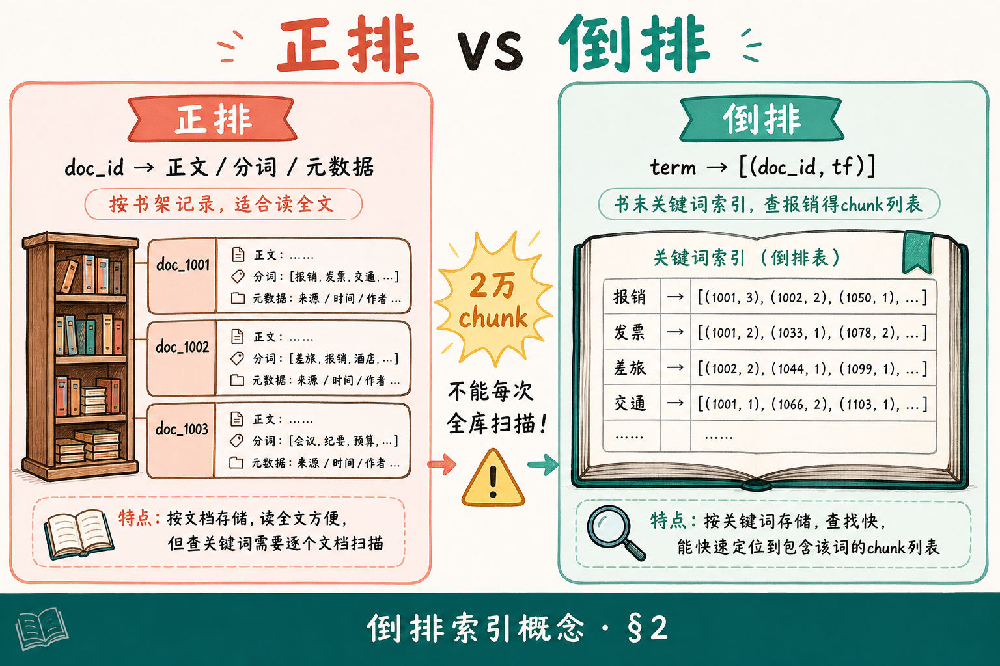
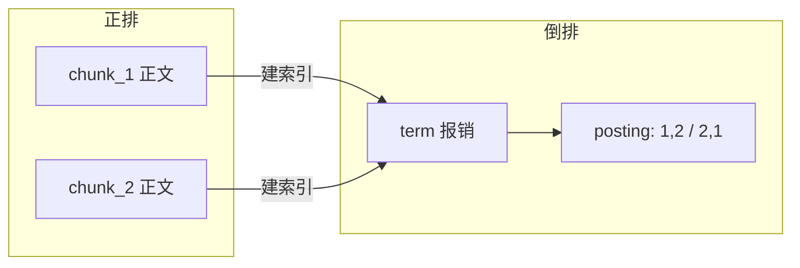
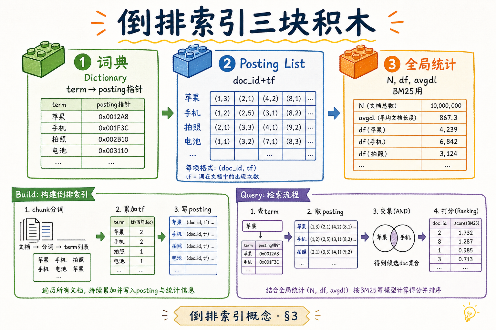
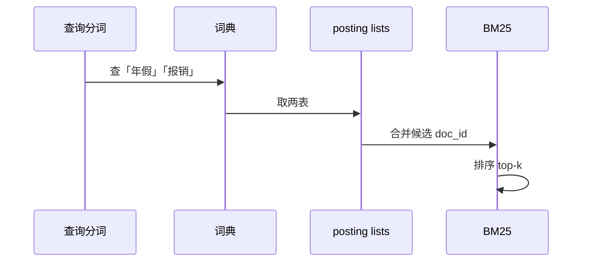
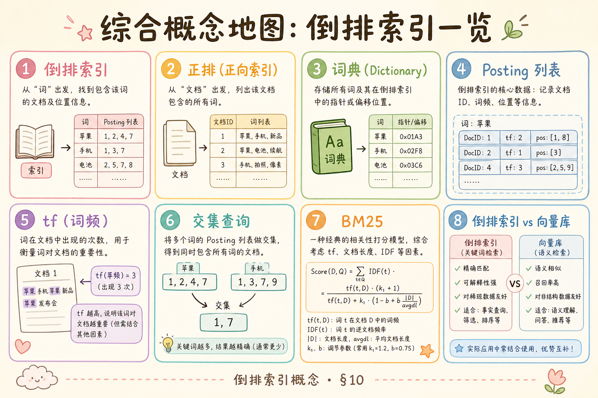

# NLP / IR / LLM 基础（四）：倒排索引概念完全指南

> 你学完 [BM25](19.bm25-sparse-retrieval-tutorial.md)，知道分数靠 **词频、idf、文档长度** 算出来——但两万个 chunk 不可能每次查询都从头到尾扫一遍数「报销」出现几次。**倒排索引**（inverted index，倒排表）才是稀疏检索能用的原因：从 **词项** 出发，直接拿到「哪些 chunk 含这个词、各出现几次」，再在上面跑 BM25。Elasticsearch、Lucene 内核都是它；向量库是另一条数据结构。这篇是 [企业 RAG 路线图](ENTERPRISE_RAG_ROADMAP.md) **B 轨第四篇**、接 [TF-IDF](18.tfidf-principles-tutorial.md) 与 [BM25](19.bm25-sparse-retrieval-tutorial.md)：概念为主，说明建库与查询在干什么；代码仅最小示意。前置 [分词](17.nlp-tokenization-basics-tutorial.md)。

---

## 目录

1. [前言：为什么需要「反着查」](#1-前言为什么需要反着查)
2. [正排 vs 倒排：两种看图方式](#2-正排-vs-倒排两种看图方式)
3. [倒排索引的三块积木](#3-倒排索引的三块积木)
4. [建索引：从 chunk 到 posting](#4-建索引从-chunk-到-posting)
5. [查询：多 term 怎么找交集](#5-查询多-term-怎么找交集)
6. [与 TF-IDF、BM25 怎么挂在一起](#6-与-tf-idfbm25-怎么挂在一起)
7. [压缩、跳表与大规模（了解即可）](#7-压缩跳表与大规模了解即可)
8. [倒排 vs 向量索引 in RAG](#8-倒排-vs-向量索引-in-rag)
9. [Elasticsearch 里你见到的映射](#9-elasticsearch-里你见到的映射)
10. [综合概念地图](#10-综合概念地图)
11. [常见陷阱与 FAQ](#11-常见陷阱与-faq)
12. [总结与系列下一步](#12-总结与系列下一步)

---

## 1. 前言：为什么需要「反着查」

典型场景：制度库 2 万个 chunk，用户搜「年假报销」。朴素做法：循环 2 万次，每次分词、数词、算 BM25——CPU 和延迟都受不了。倒排索引把问题反过来：**先查词典里的「年假」「报销」**，每张表直接列出含该词的 chunk 编号与次数，只在 **候选集合** 上打分排序。

**倒排索引**（inverted index）：以 **term（词项）** 为键，值为包含该 term 的 **文档（chunk）列表** 及出现信息（如 tf）的数据结构。  
通俗说：**字典目录**——查「报销」一页，立刻看到出现在第 3、7、102 号 chunk，各几次。

**读完本文，你应该能做到：**

1. 区分 **正排**（按文档存内容）与 **倒排**（按词找文档）。
2. 说出 **词典、posting list、全局统计（N、df、avgdl）** 各存什么。
3. 描述 **建库** 与 **查询** 各走哪些步骤（概念级）。
4. 解释倒排如何承载 [BM25](19.bm25-sparse-retrieval-tutorial.md) 打分，而非替代打分公式。
5. 在 RAG 里说明 **chunk 即文档**、与向量索引如何并存。

**前置**：[17 分词](17.nlp-tokenization-basics-tutorial.md)、[18 TF-IDF](18.tfidf-principles-tutorial.md)、[19 BM25](19.bm25-sparse-retrieval-tutorial.md)。  
**边界**：不讲分片路由、Lucene 文件格式源码、FST 实现细节。

### 1.1 和前几篇的分工

| 篇章 | 回答的问题 |
|------|------------|
| [17 分词](17.nlp-tokenization-basics-tutorial.md) | term 怎么切 |
| [18 TF-IDF](18.tfidf-principles-tutorial.md) | 词项权重怎么算 |
| [19 BM25](19.bm25-sparse-retrieval-tutorial.md) | 工业打分公式 |
| **本篇** | 权重存在哪、查询怎么 **快** 找到候选 doc |

没有倒排，BM25 公式只能写在 PPT 上；有了倒排，才能在企业知识库 **毫秒级** 返回 top-k chunk。

---

## 2. 正排 vs 倒排：两种看图方式

### 2.1 正排（forward index）

**正排**：`doc_id → 正文 / 分词结果 / 元数据`。  
通俗说：**按书架上每一本书** 记录书里有什么词——适合「打开 chunk 读全文」、适合生成时取 snippet，**不适合**「全库哪些书含报销」。

RAG 里原始 chunk 文本、向量库里的 embedding，都可视为某种正排或旁路存储。

### 2.2 倒排（inverted index）

**倒排**：`term → [(doc_id, tf), ...]`。  
通俗说：**按词条索引**——像书末关键词索引「报销 → 第 12、45 页」。





读图：**建库**时从正排扫一遍生成倒排；**查询**时先走倒排找候选，再按需用正排取原文给 LLM。

| | 正排 | 倒排 |
|---|------|------|
| 键 | 文档 id | 词项 term |
| 典型用途 | 展示、生成、向量化 | 关键词检索、BM25 |
### 2.3 图书馆类比

**正排**像「逐册编目卡」：第 12 号书架上的书，目录列出所有章节关键词——适合管理员按书号取书。  
**倒排**像「馆际关键词总索引」：查「报销」一页，列出 12、45、102 号书架——适合读者按主题找书。RAG 系统两种都要：**倒排找 chunk 号**，**正排取 chunk 全文** 给模型读。

---

## 3. 倒排索引的三块积木

### 3.1 词典（lexicon / term dictionary）



存 **词表**：所有出现过的 term，及指向 posting 的指针（或 term→posting 的偏移）。  
可能按字典序排序，支持二分或 **前缀树（trie）/ FST** 快速查找。  
通俗说：**目录页**——「报销」这个词在索引里的哪一段。

### 3.2 Posting list（倒排列表）

对每个 term，一条 **有序列表**，元素常为：

- **doc_id**（或 chunk_id）  
- **tf**（该词在该 doc 中出现次数）  
- （可选）位置信息 positions，用于短语查询「年假 报销」相邻  

示例（与 [18、19 篇](18.tfidf-principles-tutorial.md) 迷你语料一致）：

| term | posting（doc_id, tf） |
|------|----------------------|
| 报销 | (d₁, 2), (d₃, 1) |
| 年假 | (d₁, 1) |
| 公司 | (d₁, 1), (d₂, 2), (d₃, 1) |

### 3.3 全局统计

整库 **N**（文档数）、每个 term 的 **df**、**avgdl** 等——供 [BM25](19.bm25-sparse-retrieval-tutorial.md) 的 idf 与长度项使用。常存在索引元数据或随词典维护。

### 3.4 可选：位置信息（positions）

若 posting 除 (doc_id, tf) 外还存 **该词在文档中的字符或词偏移**，引擎可做 **短语查询**（phrase query）：要求「年假」与「报销」相邻或同句。  
RAG 默认 top-k 常 **不强制短语**，只要 chunk 内都出现即可；但调试高亮、引用溯源时，positions 有助于 **准确定位 snippet**。地基篇知道 **posting 可厚可薄**；越厚，索引越大、功能越强。

---

## 4. 建索引：从 chunk 到 posting

RAG 离线流水线（稀疏一路）概念步骤：

1. **切 chunk**（路线图 C2 分块篇）。  
2. **分词** → term 序列（[17 篇](17.nlp-tokenization-basics-tutorial.md)）。  
3. 对每个 chunk：**统计本地 tf**（每个 term 出现几次）。  
4. 对每个 (term, doc_id, tf)：**追加到该 term 的 posting list**（建库常合并排序）。  
5. 更新 **df**、**avgdl**；可选算好 idf 缓存。  
6. **压缩** posting（§7）后落盘。

**演示什么**：极简 Python 建倒排（教学用，非生产）。

```python
from collections import defaultdict

def build_inverted(docs: dict[str, list[str]]):
    """docs: {doc_id: [term, ...]}"""
    postings = defaultdict(list)
    df = defaultdict(int)
    lengths = {}
    for doc_id, terms in docs.items():
        lengths[doc_id] = len(terms)
        tf_local = defaultdict(int)
        for t in terms:
            tf_local[t] += 1
        for t, tf in tf_local.items():
            postings[t].append((doc_id, tf))
            df[t] += 1
    N = len(docs)
    avgdl = sum(lengths.values()) / N if N else 0
    return dict(postings), dict(df), N, avgdl
```

**预期**：`postings["报销"]` 含 (d₁,2)、(d₃,1)；`df["年假"]` 为 1。

入库、删 chunk 时要 **增量更新** posting 与 df——生产用 ES/Lucene，不用手写 dict。

### 4.1 迷你语料 walkthrough

沿用三篇 chunk（[18 篇 §6](18.tfidf-principles-tutorial.md)）：

- d₁：`报销 年假 公司 报销`  
- d₂：`公司 制度 公司`  
- d₃：`报销 流程 公司`  

建库后倒排核心片段：

- `报销` → (d₁,2), (d₃,1) → **df=2**  
- `年假` → (d₁,1) → **df=1**  
- `公司` → (d₁,1), (d₂,2), (d₃,1) → **df=3**  

**N=3**，**avgdl**=(4+3+3)/3。查询「年假」：只读 `年假` 的 posting，**候选只有 d₁**——不必看 d₂、d₃。查询「报销」：候选 d₁、d₃，再 BM25 细排。这就是 **从 O(N) 全库扫描** 到 **O( posting 长度 )** 的原因。

### 4.2 增量与删除

新 chunk d₄ 入库：分词 → 对每个 term 在 posting 末尾追加 (d₄, tf)，df 相应 +1，N 与 avgdl 更新。  
删除 d₁：需在三条 posting 里去掉 d₁ 的记录（或标 **删除位**，后台 merge 时物理清理）。Elasticsearch 的 `delete` API 即触发此类维护；**不要** 以为删了业务库记录倒排会自动干净，需走索引删除或全量重建。

---

## 5. 查询：多 term 怎么找交集

用户问「年假报销」→ 分词得 `年假`、`报销`。

1. 查词典，取两个 **posting list**。  
2. **合并策略**：  
   - 布尔 **AND**：两表求 **doc_id 交集**（都要命中）。  
   - **BM25 默认**：对出现在任一词 posting 中的 doc **累加得分**（软匹配，[19 篇 §8](19.bm25-sparse-retrieval-tutorial.md)）。  
3. 对候选 doc 用 **tf、|d|、idf** 算 BM25，降序取 top-k。  
4. 用 **正排** 取 chunk 原文 → 进 prompt 或调试台。

多 term 时 posting 列表常 **按 doc_id 排序**，便于 **归并求交**——时间复杂度与候选规模相关，而非全库 N。

### 5.1 AND 与 BM25 软排序

| 模式 | 行为 |
|------|------|
| AND | 查询 term 必须全出现在 doc |
| BM25 默认 | 部分命中也计分，稀有词权重大 |

Elasticsearch `match` 走 BM25；`bool` 的 `must` 可硬要求某词必含。RAG 问句自然，多用软排序；结果太宽再加 `must` 收窄。

### 5.2 倒排之后：取正文

top-k 的 chunk_id 确定后，从 **正排**（`_source`、数据库）取原文进 LLM 或 [引用 UI](react/09.citation-source-ui.md)。倒排通常 **不存全文**，只负责「找人」。



---

## 6. 与 TF-IDF、BM25 怎么挂在一起

倒排 **不负责** 决定「报销」重要还是「公司」重要——那是 **idf、BM25 公式** 的事（[18、19 篇](18.tfidf-principles-tutorial.md)）。倒排 **负责**：

- 快速找到 **含某 term 的所有 doc**；  
- 提供 **tf**；  
- 配合全局 **df、N、avgdl** 完成打分。

没有倒排，BM25 只是公式；有了倒排，公式才能在百万 chunk 上 **秒级** 运行。TF-IDF 余弦 likewise：在稀疏空间只对 **posting 里非零维** 算点积。

### 6.1 一张表串起 B 轨前四篇

| 步骤 | 对象 | 篇章 |
|------|------|------|
| 切 term | 分词器 | 17 |
| 词权重 | tf、idf、BM25 | 18、19 |
| 存哪、怎么快查 | 倒排 posting | **本篇** |
| 语义路 | 向量索引 | 路线图 32+ |

---

## 7. 压缩、跳表与大规模（了解即可）

Posting list 占索引大部分体积。工程常用：

- **变长编码**（如 VByte、PForDelta）压缩 doc_id 差值、tf；  
- **跳表**（skip list）：归并长 posting 时跳过不可能入选的段；  
- **WAND、Block-Max**：上界剪枝，少算 BM25。

地基篇只需知道：**倒排不只是 Python dict**，百万级以上必须压缩与跳表——这正是 Elasticsearch/Lucene 的价值。

### 7.1 为何 doc_id 常存差值

Posting 按 doc_id 排序后，存 **与上一行的差值** 而非绝对 id，压缩率更高——原理类似倒排对「重复 term」的压缩。你无需实现，只需知道 **索引体积** 主要来自 posting，运维要监控段大小与 merge。

---

## 8. 倒排 vs 向量索引 in RAG

| | 倒排索引 | 向量索引（HNSW 等） |
|---|----------|---------------------|
| 键 | term | doc_id → 向量 |
| 查询 | 分词后的 term | 问句 embedding |
| 擅长 | 精确词、专有名词 | 语义 paraphrase |
| 典型存储 | ES 倒排段 | Milvus、pgvector |

同一批 **chunk_id**：  
- 倒排一路：`chunk_text → 分词 → posting`；  
- 向量一路：`chunk_text → Embedding → 向量库`。  

查询时 [Hybrid](19.bm25-sparse-retrieval-tutorial.md) 两路各 top-k，再融合——**两种索引结构并行**，不是二选一。

### 8.1 何时可以暂时只有倒排

语料小、问法接近关键词、无 GPU 预算时，**倒排 + BM25** 可先撑起 RAG 原型。用户开始用口语 paraphrase 提问、召回明显下降时，再加向量一路——倒排索引 **不必拆**，在旁路加 embedding 即可。

---

## 9. Elasticsearch 里你见到的映射

`content` 字段设 `type: text`，`analyzer` 指定分词（中文常用 IK）。写入文档时 ES 自动 **建倒排**；`match` 查询走倒排 + BM25。  
`keyword` 类型则 **不分词**，整段当一个 term——适合 `doc_id`、`status`。  

RAG 常见映射直觉：

- `content`（text）→ 倒排 + BM25；  
- `chunk_id`、`source`（keyword）→ 过滤、展示；  
- `embedding`（dense_vector）→ kNN，与倒排并列。

**keyword 与 text 别混用**：把长正文误建成 `keyword` 则整段当一个 term，无法按词检索；把 `doc_id` 建成 `text` 则可能被分词切碎，过滤失效。

[检索调试台](react/13.retrieval-debug-console.md) 展示的 **score、rank** 背后，在线查询已走过倒排与 BM25（若走稀疏一路）。

### 9.1 写入与刷新（概念）

文档 `index` API 写入后，倒排先在 **内存 buffer**，`refresh` 后对搜索可见（近实时）；`flush` 落盘成 **段（segment）**。段多了要 **merge** 压缩 posting——这与删除 tombstone、查询延迟有关。地基篇知道：**索引不是写进数据库立刻可搜**，有 buffer/refresh 时序；调试「刚上传搜不到」先查 refresh 策略。

---

## 10. 综合概念地图

| 名词 | 通俗说 |
|------|--------|
| 正排 | 按 chunk 存正文 |
| 倒排 | 按词找 chunk |
| posting | 某词出现在哪些 doc、几次 |
| df | 有几篇 doc 含该词 |
| 词典 | term → posting 的目录 |
| 归并 | 多 posting 表合并求交/打分 |

**决策**：要做关键词 / BM25 检索 → **必须有倒排**（或等价结构）；只做语义向量 → 向量索引为主，仍建议保留倒排做 Hybrid。倒排是稀疏检索的 **基础设施**，BM25 是挂在上的 **评分规则**——先搞清结构，再调公式。



---

## 11. 常见陷阱与 FAQ

**陷阱 1**：索引与查询 **analyzer 不一致** → 查不到。  
**陷阱 2**：把整篇 PDF 当一个 doc_id，|d| 极大，BM25 长度项异常。  
**陷阱 3**：以为建了向量库就不需要倒排 → 专有词、条款号常仍需稀疏一路。  
**陷阱 4**：手写 dict 不上锁并发写 posting → 生产用 ES/Lucene。  
**陷阱 5**：只更新正文不 **reindex** 倒排 → 搜到过期内容或漏新词。

**Q：倒排和路线图第 27 条？**  
A：本篇即该条的地基解释。

**Q：要存词在文中的位置吗？**  
A：短语查询、高亮 snippet 需要 positions；纯 BM25 top-k 有时只存 tf 够用。

**Q：删除文档怎么更新？**  
A：标记删除或重建段；Lucene 用 tombstone，最终 merge。

**Q：中文倒排和英文有区别吗？**  
A：**结构相同**；区别在 analyzer 分词与词典体积。同一套 posting 逻辑，analyzer 配 IK/jieba。

**Q：一个小服务不用 ES 行吗？**  
A：几千 chunk 可用 `rank_bm25` 内存建倒排；上万以上建议 ES/Lucene/Whoosh。

---

## 12. 总结与系列下一步

1. **倒排 = 从 term 找 doc**，正排相反。  
2. **词典 + posting + 全局统计** 支撑 BM25。  
3. 建库：分词 → 累加 posting；查询：取 posting → 打分 → top-k。  
4. RAG 里 **chunk 即文档**；倒排与向量 **可并存**。  
5. 大规模靠 **压缩与跳表**，用成熟引擎而非裸 dict。以上五点把 B 轨「稀疏检索如何实现」闭环；向量检索从 Embedding 篇另开一条路。

下一篇建议：路线图 **28 Word2Vec / 静态词向量** 或 **32 Embedding**，进入稠密检索。动手可对 [19 篇 §10](19.bm25-sparse-retrieval-tutorial.md) 的 `rank_bm25` 语料，用 §4 的 `build_inverted` 打印 posting，对照 `get_scores` 理解「数据结构 vs 打分公式」。

### 12.1 学习目标自检

- [ ] 能画「正排 / 倒排」箭头方向  
- [ ] 能写出迷你语料里 `报销` 的 posting 行  
- [ ] 能说明查询为何不必扫全库 N 篇  
- [ ] 能解释倒排与 BM25 谁负责「快」谁负责「准」

以上四条可用作发布前自检清单，通过即可进入 Embedding 篇学习。

---

> **初学者可能仍困惑的点**  
> - 倒排解决 **快**，BM25 解决 **准**——二者配合。  
> - posting 里的是 **chunk_id**，不是 PDF 文件名。  
> - 向量索引 **不能替代** 倒排做「必须包含某型号」类查询。  
> - 建库与查询必须用 **同一 analyzer**，否则 posting 与查询词对不上号。  
> - 上传新文档后若搜不到，先查索引 **refresh**，再查 analyzer 是否一致。
