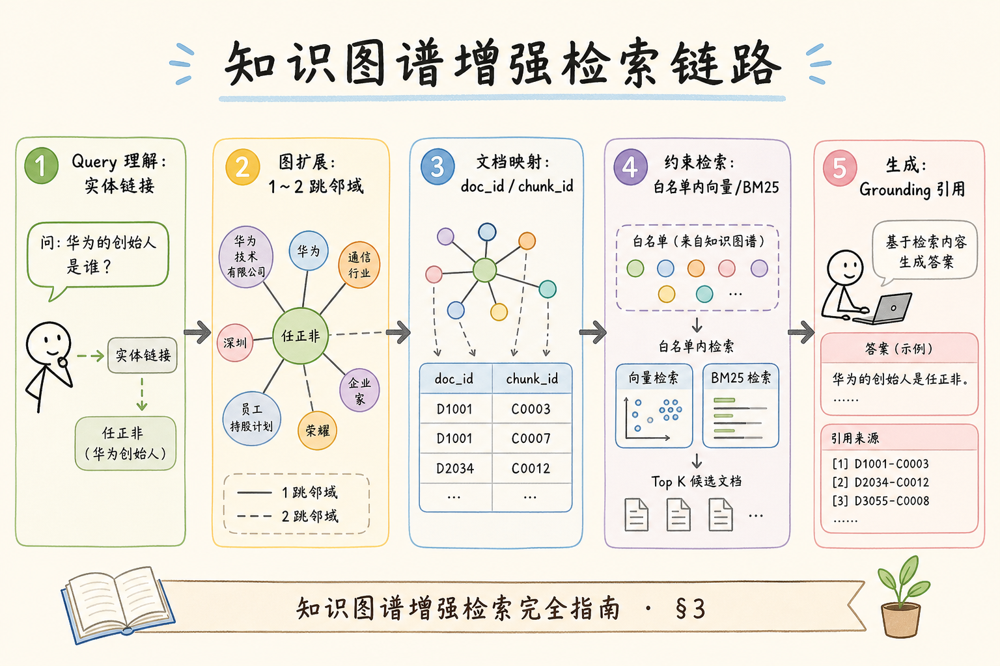
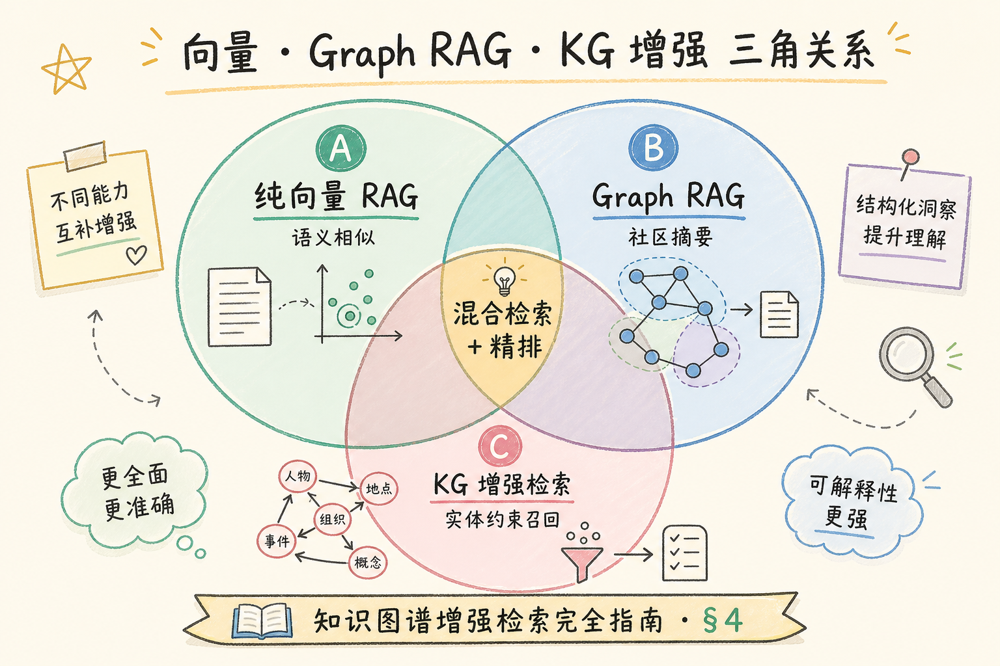
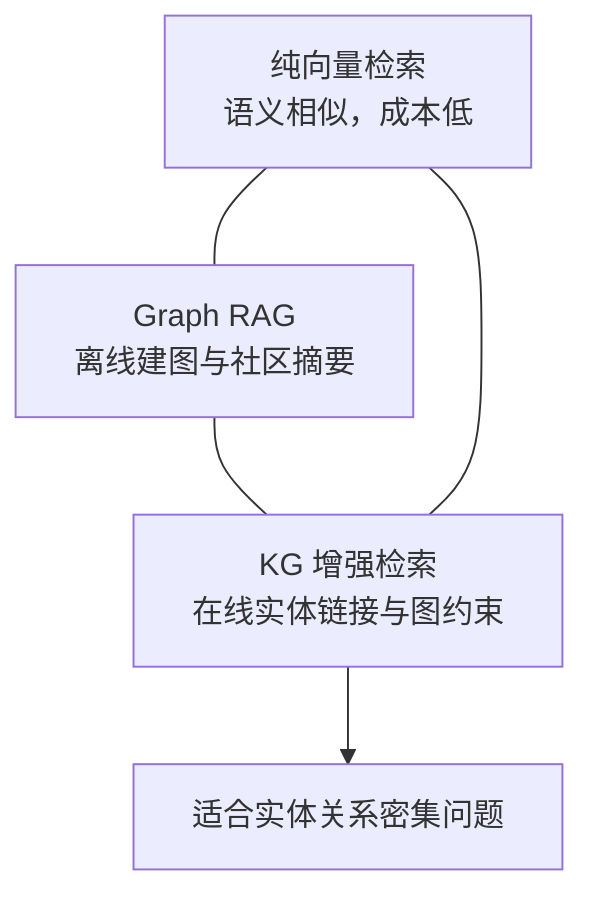
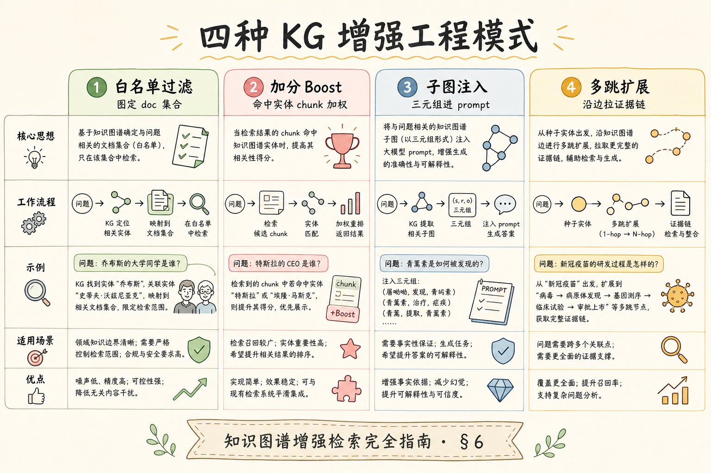
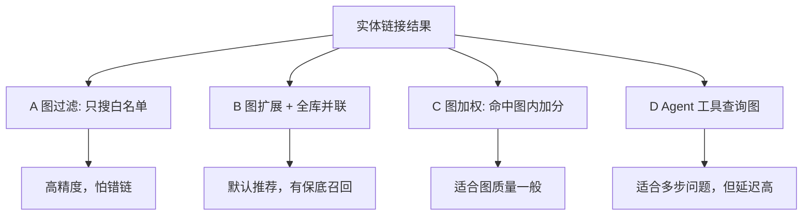

# H 进阶（二）：知识图谱增强检索完全指南

> 向量检索擅长「意思相近」，却常在 **实体关系、制度依赖、跨文档桥接** 上失手——「张总监审批的上海项目住宿上限」需要先把 **人—项目—城市—标准** 串起来。[Graph RAG](199.graph-rag-tutorial.md) 讲 **图索引与社区摘要**；本篇聚焦 **在已有向量库旁，用知识图谱增强检索（KG-Enhanced Retrieval）**：实体链接、关系扩展、图约束过滤，与 [93 混合检索](93.hybrid-search-tutorial.md) 并联而非替代。这篇是 [企业 RAG 路线图](ENTERPRISE_RAG_ROADMAP.md) **H 轨了解篇**（路线图第 **217** 条）。前置：[199 Graph RAG](199.graph-rag-tutorial.md)、[91 Dense](91.dense-retrieval-tutorial.md)、[104 Multi-hop](104.multi-hop-retrieval-tutorial.md)。

---

## 目录

1. [前言：向量不够时，图补哪一块](#1-前言向量不够时图补哪一块)
2. [本文边界与动手路径](#2-本文边界与动手路径)
3. [知识图谱增强检索是什么](#3-知识图谱增强检索是什么)
4. [与 Graph RAG、纯向量的三角关系](#4-与-graph-rag纯向量的三角关系)
5. [图谱从哪里来：抽取、对齐、增量](#5-图谱从哪里来抽取对齐增量)
6. [增强检索的四种工程模式](#6-增强检索的四种工程模式)
7. [实体链接与关系扩展](#7-实体链接与关系扩展)
8. [与混合检索、精排衔接](#8-与混合检索精排衔接)
9. [综合实战：图约束 + 向量召回 Mini-RAG](#9-综合实战图约束--向量召回-mini-rag)
10. [幻觉、拒答与证据链](#10-幻觉拒答与证据链)
11. [先错对对：五种典型翻车](#11-先错对对五种典型翻车)
12. [常见陷阱与 FAQ](#12-常见陷阱与-faq)
13. [总结与系列下一步](#13-总结与系列下一步)

## 1. 前言：向量不够时，图补哪一块

企业知识库里，大量问题是 **结构化依赖** 而非 **语义相似**：

- 「**产假** 与 **年假** 能否连休？」——两实体在向量空间里可能 **都不靠近** 用户原句；  
- 「**2023 版** 制度废止后，**2025 版** 哪条替代了原第 7 章？」——需要 **版本—章节—替代关系**；  
- 「**上海项目** 的审批人是谁、依据哪条 **住宿标准**？」——桥接事实散落在 **项目表、人事表、财务制度** 三处。

**纯向量检索**（见 [91 Dense](91.dense-retrieval-tutorial.md)）把 chunk 嵌成点，用余弦近邻捞相似段——**不保证** 捞到关系链上的每一环。  
**知识图谱增强检索**（KG-Enhanced Retrieval）：在检索阶段引入 **实体（节点）与关系（边）**，用图遍历、子图匹配或图约束过滤 **缩小/扩展** 向量候选集，再把命中的 chunk 交给生成器。

通俗说：向量负责「这段话 **像不像** 在答你的问题」；图负责「这几份资料 **连不连得上**」。

**读完本文，你应该能做到：**

1. 区分 [199 Graph RAG](199.graph-rag-tutorial.md) 的 **图索引** 与本文的 **图增强检索**。  
2. 画出 **query → 实体链接 → 图扩展 → 向量过滤 → 生成** 数据流。  
3. 说明何时 **只上图约束**、何时 **图+向量并联**。  
4. 实现 §9 最小 **实体→doc_id 白名单** 过滤。  
5. 对照 [33 幻觉](33.llm-hallucination-tutorial.md) 解释：图约束如何降低 **桥接型胡编**。  
6. 知道 PoC 阶段 **不必** 上 Neo4j 全量——元数据图也能起步。

### 1.1 H 轨位置

```text
216 Graph RAG [199]（图索引主线）
217 KG 增强检索 ← 本篇（了解）
218 Agentic RAG [201]
219 ReAct [202]
220 多步工具检索 [203] → 衔接 [124 Function Calling]
```

### 1.2 术语双轨速查

| 中文 | English | 一句话 |
|------|---------|--------|
| 知识图谱 | Knowledge Graph (KG) | 实体+关系的结构化网络 |
| 实体链接 | Entity Linking | 把 query 里的词对齐到图节点 |
| 关系扩展 | Relation Expansion | 沿边找邻域实体或文档 |
| 图约束检索 | Graph-constrained Retrieval | 用子图限制向量候选 doc/chunk |
| 异构检索 | Hybrid retrieval | 图路 + 向量路 + 稀疏路并联 |

### 1.3 读完本篇的最小交付物

1. 一张 **向量 vs 图增强** 选型白板；  
2. §9 脚本：给定实体能 **缩小** `where doc_id in (...)`；  
3. 日志含 `linked_entities`、`expanded_nodes`、`final_chunk_ids`；  
4. 能口述与 [93 混合检索](93.hybrid-search-tutorial.md) 的融合点；  
5. §11 五种翻车对照表。

## 2. 本文边界与动手路径

PoC 可用 JSON 邻接表或 Excel 导出的边表，不必第一天 Neo4j。交付物：选型白板、§9 脚本能 `where doc_id in (...)`、日志含 `linked_entities`/`retrieval_mode`。与 [199 Graph RAG](199.graph-rag-tutorial.md) 分工：217 偏 **在线图约束**，199 偏 **离线图索引与社区摘要**。

**档位：H 了解篇（路线图 217）。**

**本文讲：** KG 增强检索直觉、与 Graph RAG 分工、四种模式、实体链接、与混合检索衔接、最小实战、幻觉关联。  
**本文不讲：** 全量 GraphRAG 社区发现算法细节、知识图谱自动构建 ML 全书、图神经网络嵌入训练、Neo4j 集群运维全书。

### 2.1 动手路径表

| 步骤 | 你做什么 | 验收 |
|------|----------|------|
| A | 读 §3～§4，画三角关系图 | 能说明 199 与 217 分工 |
| B | 用 Excel 建 10 节点迷你 KG | 含 `entity→doc_id` 边 |
| C | 实现 §9 实体链接（规则/词典） | 命中「上海项目」 |
| D | 向量检索加 `where` 过滤 | chunk 只来自扩展 doc |
| E | 并联 [93 混合](93.hybrid-search-tutorial.md) 一路 | 融合 Top-K |
| F | 写 wiki「何时不上图」 | 一段决策文字 |

**环境：** Python 3.10+；沿用 [76 Chroma](76.chroma-vector-db-tutorial.md) 或内存 dict；图可先 **JSON 邻接表**，无需图数据库。

### 2.2 沿用前文

| 概念 | 来自 |
|------|------|
| 图索引与社区摘要 | [199 Graph RAG](199.graph-rag-tutorial.md) |
| 稠密检索 | [91 Dense](91.dense-retrieval-tutorial.md) |
| 多跳证据链 | [104 Multi-hop](104.multi-hop-retrieval-tutorial.md) |
| 混合融合 | [93 Hybrid](93.hybrid-search-tutorial.md)、[94 RRF](94.rrf-fusion-tutorial.md) |
| 元数据过滤 | [88 Metadata Filter](88.metadata-filter-retrieval-tutorial.md) |
| 幻觉归因 | [33 Hallucination](33.llm-hallucination-tutorial.md) |
| Agent 多步检索 | [203 多步工具](203.multi-step-tool-retrieval-tutorial.md)、[124 FC](124.function-calling-tool-use-tutorial.md) |

## 3. 知识图谱增强检索是什么

读下图：用户问句先链接实体，再沿图扩展得到相关文档集合，最后在集合内做向量检索。




这张图的关键结论是：图负责缩小或扩展候选集合，最终答案仍应来自可引用的 chunk。

对照上图：

1. **Query 理解**：抽取或链接实体（人名、项目、制度版本、城市）；  
2. **图扩展**：1～2 跳邻域——例如 `上海项目 --located_in--> 一线城市 --governed_by--> 差旅制度_2025`；  
3. **文档映射**：边上挂 `doc_id` / `chunk_id` 指针，或节点属性含 `source_doc`；  
4. **约束检索**：向量/BM25 只在 **白名单 doc** 内搜，或给白名单内 chunk **加分**；  
5. **生成**：与标准 RAG 相同，配合 [34 Grounding](34.grounding-citation-tutorial.md) 引用。

**关键洞见**：图增强 **不替代** Embedding 索引——它解决 **候选空间过大** 与 **关系缺失** 两类问题。没有高质量 chunk，图只能指向 **空文档**。

### 3.1 与「在 prompt 里塞三元组」的区别

有人把 `(张三, 审批, 上海项目)` 直接写进 system prompt——那是 **提示词增强**，不是 **检索增强**：

| 做法 | 检索是否变 | 可扩展性 | 幻觉风险 |
|------|------------|----------|----------|
| Prompt 塞三元组 | 否 | 图变大 prompt 爆 | 模型可能无视 |
| 图约束向量检索 | 是 | 图在库外，检索时查 | 证据仍来自 chunk |

工程上优先 **检索层图约束**；生成层只消费 **检回的 chunk 文本**。

### 3.2 最小可行 KG 长什么样

PoC 不必上 RDF。一张表即可：

```text
nodes:  { id, name, type }           # 上海项目, PROJECT
edges:  { src, rel, dst, doc_ids } # 上海项目 --in_city--> 一线城市, doc_ids=[d7,d8]
```

**实体类型**（type）建议与业务对齐：`PERSON`、`PROJECT`、`CITY_TIER`、`POLICY_VERSION`、`CLAUSE`。  
**关系**（rel）克制枚举：`APPROVES`、`GOVERNED_BY`、`SUPERSEDES`、`MENTIONS`。

## 4. 与 Graph RAG、纯向量的三角关系

读下图：三角顶点分别是纯向量、Graph RAG 图索引、KG 增强检索。





读图时不要把三者看成替代关系：大多数企业 PoC 会先有纯向量，再把 KG 增强作为关系型问题的补强。

| 方案 | 索引物 | 检索主路径 | 典型成本 |
|------|--------|------------|----------|
| 纯向量 | chunk 向量 | ANN Top-K | 低 |
| Graph RAG | 图 + 社区摘要向量 | 图遍历 + 摘要检索 | 高（建图+摘要） |
| KG 增强检索 | chunk 向量 + 轻量 KG | 实体链接 → 图过滤 → ANN | 中（维护边表） |

**选型口诀**：

- 资料 **扁平 FAQ**、关系少 → 纯向量 + [93 混合](93.hybrid-search-tutorial.md) 够；  
- 需要 **全局主题叙事**（「整个供应链风险」）→ 看 [199 Graph RAG](199.graph-rag-tutorial.md) 社区摘要；  
- 问题 **实体关系密集**、但全文仍要 **逐条引用** → **KG 增强 + 向量** 常是甜点位。

本篇与 199 **互补**：199 偏 **离线索引创新**；217 偏 **在线检索管道里加图约束**——你可先 217 再 199，也可只用 217。

## 5. 图谱从哪里来：抽取、对齐、增量
Embedding 成本的真正放大器通常不是单次调用，而是重索引、失败重试和批量任务。只要文档量、chunk 数和模型价格相乘，任何一次全量重跑都可能变成明显账单。

### 5.1 三条建图路径

| 路径 | 做法 | 优点 | 风险 |
|------|------|------|------|
| 规则/词典 | HR 主数据、项目编码表导入 | 准、可审计 | 覆盖有限 |
| LLM 抽取 | 对 chunk 抽三元组入库 | 快 | 需人工抽检 |
| 共建 | 规则核心实体 + LLM 补关系 | 平衡 | 版本要对齐 |

与 ingest 并行：每篇文档入库时跑 **轻量 NER + 关系模板**（「适用于」「废止」「审批人」），写入 `edges` 表，并挂 `doc_id`。

### 5.2 与向量库的版本一致

图边引用的 `doc_id` 必须与 [48 文档版本](48.doc-versioning-tutorial.md) 一致。制度升级时：

1. 新版本文档 reindex；  
2. **SUPERSEDES** 边指向新 `doc_id`；  
3. 检索时若链接到旧版实体，沿 `SUPERSEDES` **跳转** 新版——避免检索到废止条款。

### 5.3 增量与删除

删除文档时 **级联**：移除边上 `doc_ids` 引用；无引用的孤立节点可归档。与 [49 增量更新](49.incremental-update-tutorial.md) 同一事务边界，防止「图指向幽灵 chunk」。

## 6. 增强检索的四种工程模式
知识图谱增强检索的价值，是把“文字相似”补成“实体和关系可追踪”。这一节先看图谱如何从文本抽取出来，再看它如何参与召回、扩展和过滤。

### 6.1 模式 A：图过滤（Graph Filter）

实体链接得到节点集合 `S`，收集 `doc_ids(S)`，向量检索：

```python
where = {"doc_id": {"$in": list(doc_ids)}}
hits = collection.query(query_embeddings=[q_vec], n_results=k, where=where)
```

**适用**：实体识别准、候选 doc 集合小（<200）。  
**风险**：链接错实体 → **检索全军覆没**（见 §11）。

### 6.2 模式 B：图扩展 + 向量并联（Parallel）

- 路 1：图扩展 doc 集内向量 Top-K₁；  
- 路 2：全库 [93 混合](93.hybrid-search-tutorial.md) Top-K₂；  
- [94 RRF](94.rrf-fusion-tutorial.md) 融合。

**适用**：怕图漏召回，要 **保底全库一路**。企业 **默认推荐**。

### 6.3 模式 C：图加权（Graph Boost）

全库检索后，对 `doc_id ∈ graph_docs` 的 chunk **分数 +Δ** 或 **精排特征加一维**。

**适用**：图不确定、不愿硬过滤。  
**实现**：在 [95 Cross-Encoder](95.cross-encoder-rerank-tutorial.md) 输入加 `in_graph: bool` 特征（或后处理加分）。

### 6.4 模式 D：子图序列化进 Multi-hop

把图遍历结果序列化成 **中间状态**，驱动 [104 Multi-hop](104.multi-hop-retrieval-tutorial.md) 第二跳 query——与 [203 多步工具检索](203.multi-step-tool-retrieval-tutorial.md) 的 `search_kb` 串联：第一跳 `link_entity`，第二跳 `search_kb(filter=...)`。

四种模式可以按“硬过滤到软加权”排列，初学者优先从并联保底开始。





这张图的结论是：图谱质量没有稳定前，不要一上来硬过滤全库。

## 7. 实体链接与关系扩展
知识图谱增强检索的价值，是把“文字相似”补成“实体和关系可追踪”。这一节先看图谱如何从文本抽取出来，再看它如何参与召回、扩展和过滤。

### 7.1 实体链接流水线

```text
user query
  → 候选 span（词典 / NER / LLM）
  → 消歧（同名项目、多义「标准」）
  → node_id
```

**消歧**靠上下文：「上海 **项目**」vs「上海 **出差**」——可用 **类型约束**（PROJECT vs CITY）或 **共现边**（与「张总监」共现的 PROJECT 节点）。

### 7.2 扩展跳数

| 跳数 | 例子 | 建议 |
|------|------|------|
| 0 跳 | 仅过滤当前实体 doc | 链接极准时 |
| 1 跳 | 项目 → 城市等级 → 制度 | **默认** |
| 2 跳 | 再加审批人、部门 | 谨慎，爆炸 |

设 **度数上限** 与 **边类型白名单**（只沿 `GOVERNED_BY`、`IN_CITY` 扩展，不沿 `MENTIONS` 泛化）。

### 7.3 链接失败时的降级

无链接命中 → **退回模式 B 并联全库**，并打日志 `kg_link_miss=1`。  
禁止：链接失败仍 **空 where** 却告诉用户「根据知识图谱」——这是 [33 幻觉](33.llm-hallucination-tutorial.md) 里的 **忠实性胡编** 温床。

## 8. 与混合检索、精排衔接

精排阶段可把 `in_graph: bool` 作为特征（模式 C），在图质量一般时避免硬过滤。整条管道应在 [182 检索调试台](182.retrieval-debug-console-tutorial.md) 可复现：`kg_entities`、`kg_doc_whitelist`、`retrieval_mode` 与最终 `chunk_ids` 同屏展示。

p95 若超 SLA，可缩小全库保底路 `k` 或仅对高置信链接开图过滤。图查询通常毫秒级，主要额外开销在并联检索与边表维护——要用金标证明桥接召回提升值得这笔运维账。

在线管道默认 **模式 B：图扩展 + 全库并联保底**，再 RRF 与 [96 BGE 精排](96.bge-reranker-tutorial.md)。`doc_whitelist` 必须与 [53 ACL](53.metadata-acl-tutorial.md) 求交——图不能绕过权限。Agent 形态可把 `link_entities`、`expand_graph` 做成 [124 FC](124.function-calling-tool-use-tutorial.md) 工具，与 `search_kb` 串联（见 [203](203.multi-step-tool-retrieval-tutorial.md)）。

推荐在线管道：

```text
query
  → entity_link (optional)
  → graph_expand → doc_whitelist
  ├→ dense@whitelist (k=20)
  ├→ bm25@whitelist (k=20)     # 见 [93 混合](93.hybrid-search-tutorial.md)
  └→ dense@global (k=10)       # 保底路
  → RRF → dedupe
  → [96 BGE 精排](96.bge-reranker-tutorial.md) → Top-5
  → LLM + [34 Grounding](34.grounding-citation-tutorial.md)
```

**ACL**：`doc_whitelist` 与 [53 metadata ACL](53.metadata-acl-tutorial.md) **求交**——图不能绕过权限。

**Agent 形态**：把 `link_entities`、`expand_graph` 声明为 [124 Function Calling](124.function-calling-tool-use-tutorial.md) 工具，与 `search_kb` 并列——详见 [201 Agentic RAG](201.agentic-rag-tutorial.md)、[203 篇](203.multi-step-tool-retrieval-tutorial.md)。

## 9. 综合实战：图约束 + 向量召回 Mini-RAG

下面最小示例：**规则词典链接** + **Chroma where 过滤**。生产可换 Neo4j / 图 API。

```python
# kg_mini.py — 教学用邻接表
GRAPH = {
    "上海项目": {"type": "PROJECT", "docs": ["doc_travel_2025"], "edges": [("in_city", "一线城市")]},
    "一线城市": {"type": "CITY_TIER", "docs": ["doc_city_tier"], "edges": [("governed_by", "差旅制度2025")]},
    "差旅制度2025": {"type": "POLICY", "docs": ["doc_travel_2025"], "edges": []},
}
ALIAS = {"上海": "上海项目", "沪": "上海项目"}

def link_entities(query: str) -> list[str]:
    found = []
    for alias, canonical in ALIAS.items():
        if alias in query:
            found.append(canonical)
    for name in GRAPH:
        if name in query:
            found.append(name)
    return list(dict.fromkeys(found))

def expand_docs(entities: list[str], max_hop: int = 1) -> set[str]:
    docs = set()
    frontier = list(entities)
    for hop in range(max_hop + 1):
        next_frontier = []
        for ent in frontier:
            node = GRAPH.get(ent)
            if not node:
                continue
            docs.update(node["docs"])
            for rel, dst in node.get("edges", []):
                if dst not in entities:
                    next_frontier.append(dst)
        frontier = next_frontier
    return docs

def search_with_kg(collection, query: str, q_vec, k: int = 5):
    ents = link_entities(query)
    doc_ids = expand_docs(ents)
    if doc_ids:
        where = {"doc_id": {"$in": list(doc_ids)}}
        hits = collection.query(query_embeddings=[q_vec], n_results=k, where=where)
        return hits, {"entities": ents, "docs": list(doc_ids), "mode": "kg_filter"}
    # 降级：全库
    hits = collection.query(query_embeddings=[q_vec], n_results=k)
    return hits, {"entities": ents, "docs": [], "mode": "global_fallback"}
```

**验收问句**：「上海项目住宿上限多少？」  
期望：`entities` 含「上海项目」→ `docs` 含 `doc_travel_2025` → hits 来自差旅制度 chunk，而非无关城市介绍。

**日志字段**：`kg_entities`、`kg_doc_whitelist`、`retrieval_mode`、`chunk_ids`——方便与 [182 检索调试台](182.retrieval-debug-console-tutorial.md) 对齐。

### 9.1 案例深潜：差旅制度桥接（端到端叙事）

**背景**：某互联网公司知识库含《差旅管理制度 2025》《城市分级表》《项目立项清单》三份 PDF，已切块入库并跑通 [93 混合检索](93.hybrid-search-tutorial.md)。员工问：「**上海项目** 出差住宿每晚上限是多少？谁审批超标？」

**无 KG 增强时**：单跳向量检索 Top-5 常返回《项目立项清单》中「上海项目简介」与《差旅制度》中 **泛化条款**，缺少「上海项目 → 一线城市 → 具体金额」链。模型在 [33 幻觉](33.llm-hallucination-tutorial.md) 压力下可能 **编造 500 元** 或 **张冠李戴** 北京标准。

**建图**：从立项 CSV 导入节点 `上海项目:PROJECT`；从《城市分级》导入 `一线城市:CITY_TIER`；边 `上海项目 --IN_CITY--> 一线城市` 挂 `doc_ids=[立项.pdf]`；边 `一线城市 --GOVERNED_BY--> 差旅制度2025` 挂 `doc_ids=[差旅2025.pdf]`；审批关系 `住宿超标 --APPROVED_BY--> 部门总监` 挂制度章节 chunk。

**在线链路**：

1. `link_entities` 命中「上海项目」；  
2. `expand_docs` 1 跳得 `{立项, 差旅2025, 城市分级}`；  
3. 模式 B：whitelist 内 [93 hybrid] `k=20` + 全库保底 `k=10` → RRF；  
4. [96 BGE](96.bge-reranker-tutorial.md) 后 Top-5 含 **金额句** 与 **审批句** 两 chunk；  
5. 生成引用 [34 Grounding](34.grounding-citation-tutorial.md)。

**调试台**（[182](182.retrieval-debug-console-tutorial.md)）展示：`kg_entities=["上海项目"]`，`kg_doc_whitelist` 三项，运营可一眼看出 **图是否指错文档**。

**与 [199 Graph RAG](199.graph-rag-tutorial.md) 分工**：若员工改问「公司差旅合规总体要求」，社区摘要更合适；本问 **实体桥接** 用本篇 217 即可，无需上全量 GraphRAG 索引。

**与 [124 Function Calling](124.function-calling-tool-use-tutorial.md) 形态**：`link_graph` → `search_kb(filters=whitelist)` 两工具；[203 多步](203.multi-step-tool-retrieval-tutorial.md) 状态机记 `seen_chunk_ids`，避免重复搜立项简介。

**失败演练**：若链接把「上海项目」误连到「上海分公司」（同名），whitelist 偏了——并联全库路保底 + 金标回归修正别名表。链接失败 **不得** 在答案写「根据知识图谱」却无 chunk（[33 忠实性胡编](33.llm-hallucination-tutorial.md)）。

### 9.2 案例深潜：制度版本 SUPERSEDES

**问句**：「2023 版差旅里一线城市住宿标准是否仍有效？」

边：`差旅制度2023 --SUPERSEDES--> 差旅制度2025`。链接「2023 版」节点后，扩展 **沿 SUPERSEDES 转发** 到 2025 doc，检索 **优先 2025**；若用户明确「2023 历史」，则只 whitelist 2023 并 Final 注明 **已废止**（[54 版本元数据](54.metadata-timestamp-version-tutorial.md)）。图与向量 **协同** 避免检索到废止条款却答「有效」——另一类企业 [33 幻觉](33.llm-hallucination-tutorial.md) 高发场景。

### 5.4 从 Excel 到在线 API 的迁移路径

**第 1 周**：业务方在 Excel 维护 `nodes/edges` 两张表，每日导出 CSV；ingest 脚本写入 SQLite，提供 `expand_docs` HTTP 接口（[156 FastAPI 结构](156.fastapi-project-structure-tutorial.md)）。

**第 2 周**：向量检索在 Chroma `where` 中调用 `expand_docs`；并联 [93 混合](93.hybrid-search-tutorial.md) 保底路；日志 `kg_entities` 落 [190 JSON 日志](190.structured-logging-rag-tutorial.md)。

**第 4 周**：抽检 50 条桥接金标；若召回显著优于纯向量，再迁 PostgreSQL 边表。与 [199 Graph RAG](199.graph-rag-tutorial.md) 并行评估时，217 通常运维更轻。

**权限**：边表 `doc_ids` 与 [53 ACL](53.metadata-acl-tutorial.md) 求交；敏感边用 `acl_group` 过滤。

### 6.5 模式选型决策树

```text
实体能否稳定链接？否 → 仅 [93 混合]
  是 → 候选 doc<200？是 → 模式 A 图过滤
  否 → 怕漏召回？是 → 模式 B 并联（默认）
  图置信度中等？→ 模式 C 加分
  多跳工具？→ 模式 D + [203 多步](203.multi-step-tool-retrieval-tutorial.md)
```

**与 [124 Function Calling](124.function-calling-tool-use-tutorial.md)**：`link_graph` 写入会话 state，后续 `search_kb` 自动带 filter，降低 [33 幻觉](33.llm-hallucination-tutorial.md) 乱填参数。

### 10.0 与 H 轨接口契约

| 下游 | 带走 |
|------|------|
| [201 Agentic](201.agentic-rag-tutorial.md) | link_graph 工具 |
| [203 多步](203.multi-step-tool-retrieval-tutorial.md) | whitelist + state |
| [206 Adaptive](206.adaptive-rag-tutorial.md) | use_graph_hint |

199 离线索引与 217 在线边表 **分仓存储**，文档化数据来源供 on-call 使用。

## 10. 幻觉、拒答与证据链

图约束缓解 **检索遗漏型** 幻觉，尤其是桥接题；链接错实体时硬过滤会更糟，故必须并联全库。图对但切块烂仍会胡编——归因仍在 chunk 质量。`expand_docs` 为空且全库 Top-1 低于阈值时走 [112 拒答](112.refusal-strategy-tutorial.md)，勿用「根据知识图谱」包装无证据答案。

[33 幻觉](33.llm-hallucination-tutorial.md) 指出：检索空或错仍硬答，模型会 **编造桥接事实**。KG 增强降低的是 **检索遗漏型** 幻觉，尤其是 **桥接型**（[104 Multi-hop](104.multi-hop-retrieval-tutorial.md) §4.1）：

| 场景 | 无图 | 有图约束 |
|------|------|----------|
| 项目→城市→标准链断裂 | 单跳常只检到「项目介绍」 | 扩展必含制度 doc |
| 链接错实体 | — | **更糟**，需并联全库保底 |
| 图对但 chunk 切块烂 | 仍胡编 | 仍胡编——归因切块非图 |

**拒答**：`expand_docs` 为空且全库 Top-1 分低于 [99 阈值](99.score-threshold-tutorial.md) → 走 [112 拒答](112.refusal-strategy-tutorial.md)，勿用图 **假装有依据**。

**证据链**：生成时要求引用 **至少两个 doc_id** 若问题含对比——图扩展得到的 doc 列表可写进 **调试 UI**，供运营核对「系统认为相关的制度有哪些」。

## 11. 先错对对：五种典型翻车

评审新功能时对照此表：若准备「只建图不维护版本」或「硬过滤无保底」，应直接打回设计。图是 **约束检索** 的手段，不是向用户炫耀的卖点文案。

维护边表是持续成本：制度升级、项目更名、人员调动都要更新 `SUPERSEDES` 与别名。图「建一次就忘」比不用图更危险，因为团队会过度信任错误关系。

图增强最常见翻车是 **硬过滤无保底**（链接错则零结果）与 **只建图不维护版本**（答废止条款）。LLM 抽边不抽检、图塞 prompt 不约束检索、忽略 ACL 都会让「上了图」反而更糟。金标桥接集季度回归，召回升 <5% 且运维重时可维持纯 [93 混合](93.hybrid-search-tutorial.md)。

| # | 错法 | 现象 | 对法 |
|---|------|------|------|
| 1 | 只建图不维护版本 | 答废止条款 | `SUPERSEDES` 边 + 版本元数据 |
| 2 | 硬过滤无保底路 | 链接错则零结果 | 模式 B 并联全库 |
| 3 | LLM 抽三元组不抽检 | 边噪声爆炸 | 人工金标 50 条 + 阈值 |
| 4 | 图塞 prompt 不约束检索 | 仍检索无关 chunk | 检索层 where / boost |
| 5 | 忽略 ACL | 图指向无权 doc | whitelist ∩ ACL |

## 12. 常见陷阱与 FAQ
最后用 FAQ 判断图谱增强是否真的有收益。不要只看图谱是否存在，要看它是否改善召回、解释路径和实体关系的可验证性。

### 12.1 和 [199 Graph RAG](199.graph-rag-tutorial.md) 必须一起上吗？

不必。199 适合 **全局图叙事**；217 适合 **已有向量库加关系表**。很多团队先做 217。

### 12.2 需要 Neo4j 吗？

PoC 用 **PostgreSQL 边表** 或 JSON 即可。节点 >100 万、复杂图算法再上图数据库。

### 12.3 实体链接用 LLM 还是词典？

**核心实体**（工号、项目编码）词典；**长尾表述** LLM 辅助。链接分低于阈值 **不扩展**。

### 12.4 和 [124 工具](124.function-calling-tool-use-tutorial.md) 怎么分工？

`link_entity`、`expand_graph` 可做成工具；`search_kb` 吃 `doc_ids` 参数——见 [203 篇](203.multi-step-tool-retrieval-tutorial.md)。

### 12.5 评测指标？

除答案准确率外，标 **期望 doc_id 集合**；算 **图扩展召回率**（期望 doc 是否进 whitelist）。

### 12.6 成本？

图查询毫秒级；主要成本在 **维护边表** 与 **抽检**。在线多一路并联检索，延迟 +10～30ms 常见。

### 12.7 多语言实体？

别名表分语言；链接后统一 `node_id`。与 [70 混合语言 Embedding](70.mixed-language-embedding-tutorial.md) 无冲突。

### 12.8 图太大 prompt 放不下？

**永远不要** 把全图塞 prompt——只把 **检回 chunk** 给模型。

### 12.9 与 [201 Agentic RAG](201.agentic-rag-tutorial.md)？

Agent 可 **决定是否调用** 图工具；简单 FAQ 应 **跳过图** 以省延迟（见 [206 Adaptive RAG](206.adaptive-rag-tutorial.md)）。

### 12.10 面试 30 秒版？

「KG 增强检索是在向量检索前用实体链接和图扩展得到 doc 白名单或加分，解决关系桥接漏检；与 Graph RAG 全图索引不同，它轻量、可和混合检索并联，链接失败要降级全库。」

### 12.11 制造业 BOM 场景怎么建图？

物料节点 `PART`、供应商 `VENDOR`、替代料 `REPLACES` 边挂 `doc_ids`（规格书 PDF）。问「A 料停产后推荐替代？」→ 链接 `PART:A` → 沿 `REPLACES` 扩展 → 只在关联规格书内 [93 混合](93.hybrid-search-tutorial.md) 检索——比全库搜「替代」更准。图数据来自 PLM 导出 CSV，每周批更新，与 [49 增量](49.incremental-update-tutorial.md) 同批。

### 12.12 人事制度场景与 [33 幻觉](33.llm-hallucination-tutorial.md)？

桥接型问题「销售部驻外补贴是否适用上海项目？」需 `部门→政策适用范围→城市` 链。无图时向量常只检到「销售部考勤」chunk，模型用参数记忆编补贴金额——典型 [33](33.llm-hallucination-tutorial.md) 事实性胡编。图扩展强制纳入 `差旅制度2025` doc 后，若仍无金额句，应 [112 拒答](112.refusal-strategy-tutorial.md) 而非编造。

### 12.13 图存储 PostgreSQL 边表示例？

```sql
CREATE TABLE kg_edge (
  id SERIAL PRIMARY KEY,
  src TEXT, rel TEXT, dst TEXT,
  doc_ids TEXT[],  -- PostgreSQL 数组
  valid_from DATE, valid_to DATE
);
CREATE INDEX ON kg_edge (src, rel);
```

查询 `expand_docs` 变为 SQL 递归 CTE（1～2 跳），应用层缓存 60s。与 [81 pgvector](81.pgvector-tutorial.md) 同库可减少网络跳，ACL 在 SQL 层 `JOIN doc_acl`。

### 12.14 如何评测 KG 增强是否值得？

金标 50 条 **桥接型** 问句（见 [104 §4.1](104.multi-hop-retrieval-tutorial.md)），对比 **纯 [93 混合](93.hybrid-search-tutorial.md)** vs **图+并联**：看 **期望 doc_id 召回率** 与 **最终答案准确率**。若召回升 <5% 而运维成本显著，维持纯混合；若法务场景召回升 >15%，保留图路。

### 12.15 与 [199 Graph RAG](199.graph-rag-tutorial.md) 同时部署会冲突吗？

不冲突：199 的 **社区摘要** 可作为并联第三路「主题召回」；217 的 **实体边表** 做细粒度 filter。路由层见 [206 Adaptive RAG](206.adaptive-rag-tutorial.md)：实体密集问句 `use_graph_hint=true`，宽泛主题问句走 `community_search`。

### 12.16 实体链接 LLM 提示要点？

要求输出 `{"entities":[{"text":"…","type":"PROJECT","confidence":0.9}]}`，**禁止** LLM 编造图中不存在的 node_id。链接结果必须与边表 **交集验证**；未验证的实体不触发硬过滤，只走并联全库路。

### 12.17 多跳与图扩展的边界？

[104 Multi-hop](104.multi-hop-retrieval-tutorial.md) 的跳是 **检索轮次**；图扩展的跳是 **结构邻域**。二者可组合：图扩展定 doc 白名单，Multi-hop 在 whitelist 内用不同 query 搜——避免把「图 2 跳」误解成「检索 2 次」的充分条件。

### 12.18 上线检查单（KG 增强）

- [ ] 边表版本与 KB `kb_version` 联动  
- [ ] 链接失败有 `global_fallback` 日志  
- [ ] 并联路 [93](93.hybrid-search-tutorial.md) 始终开启  
- [ ] ACL ∩ whitelist 单测覆盖  
- [ ] [182 调试台](182.retrieval-debug-console-tutorial.md) 展示 `kg_entities`  
- [ ] 金标桥接集季度回归  

### 12.19 token 与延迟？

图查询通常 <20ms；主要额外开销在 **多一路并联检索**。p95 若超 SLA，缩小全库保底路 `k` 或仅对 **高置信链接** 开图过滤（模式 A），其余走模式 C 加分。

### 12.20 团队分工建议？

**业务方**维护实体词典与关系枚举；**数据工程** ingest 挂边；**算法**调链接与融合；**后端** 在线 `expand_docs` API；**QA** 维护桥接金标。与 [201 Agentic RAG](201.agentic-rag-tutorial.md) 联调时，图 API 由 `link_graph` 工具封装，避免 Agent 直接读库。

## 13. 总结与系列下一步

KG 增强检索补 **关系与候选约束**，不替代 chunk 向量；与 199 可并存、与 201 Agent 可工具化。上线底线：版本边、ACL 求交、链接失败 `global_fallback` 日志、并联全库保底。下一步 [201 Agentic RAG](201.agentic-rag-tutorial.md) 看多步检索编排。

1. **KG 增强检索** 补的是 **关系与候选约束**，不替代 chunk 向量索引。  
2. 与 [199 Graph RAG](199.graph-rag-tutorial.md) 分工：217 偏在线管道，199 偏图索引与社区摘要。  
3. 企业推荐 **图扩展 + 全库并联** + [93 混合](93.hybrid-search-tutorial.md) + 精排，链接失败可降级。  
4. 图维护 **版本边** 与 **ACL 求交** 是上线底线。  
5. 桥接型 [33 幻觉](33.llm-hallucination-tutorial.md) 可缓解，切块错/生成胡编仍要别手段。

### 13.1 系列下一步

| 目标 | 阅读 |
|------|------|
| 图索引主线 | [199 Graph RAG](199.graph-rag-tutorial.md) |
| Agent 编排 | [201 Agentic RAG](201.agentic-rag-tutorial.md) |
| 多步工具检索 | [203 Multi-step Tool Retrieval](203.multi-step-tool-retrieval-tutorial.md) |
| 自适应路由 | [206 Adaptive RAG](206.adaptive-rag-tutorial.md) |

## 14. 金标、参数与上线检查

桥接型金标（期望实体 + 期望 doc_id）是验证 KG 是否值得保留的唯一客观依据。参数从保守起步：`max_hop=1`、高链接置信度才硬过滤；错链率高时改实体表而非盲目加大 hop。上线检查单应含：边表版本与 `kb_version` 联动、ACL∩whitelist 单测、调试台展示 `kg_entities`。

季度回归桥接金标：若图路召回升 <5% 而边表运维显著，可维持纯 [93 混合](93.hybrid-search-tutorial.md)。上线检查单勾完再放量流量，比事后修错链成本低一个数量级。

KG 增强检索必须用桥接型问题验证，而不是只看普通 FAQ。建议准备一张金标表：

| id | 用户问句 | 期望实体 | 期望 doc_id | 验收点 |
|----|----------|----------|-------------|--------|
| B01 | 上海项目住宿上限 | 上海项目, 一线城市 | 差旅2025 | 找到城市与制度关系 |
| B02 | 产假年假能否连休 | 产假, 年假 | 人事制度 | 至少两条证据 |
| B03 | 2023 版差旅是否有效 | 差旅2023 | 差旅2025 | 能沿废止/替代关系跳转 |

PoC 参数建议从保守值开始：`max_hop=1`、`link_confidence=0.75`、图内 `k=20`、全库保底 `k=10`。如果错链率高，优先改实体链接和边表，不要盲目扩大 hop。

## 15. 上线 FAQ 补充

**PoC 一定要 Neo4j 吗？** 不一定。Excel、CSV、JSON 邻接表都可以验证“实体链接 → doc_id 白名单 → 约束检索”这条最小路径。

**图越大越好吗？** 不是。错边比无边更危险，尤其在金融、医药、人事制度场景里，错误关系会把答案带偏。

**为什么还要全库保底一路？** 因为实体链接可能失败。并联全库检索能避免图漏召回导致“一个证据都找不到”。

**和 Graph RAG 怎么分工？** Graph RAG 更偏离线图索引和社区摘要；KG 增强检索更偏在线检索时用图约束候选集合。

## 16. 收束与下一步

从轻量边表、规则实体链接、并联保底检索起步；图越大不等于越好，**错边比无边更危险**。制造业 BOM、人事制度等场景可用 CSV/PostgreSQL 边表周更，不必为了「知识图谱」而上重型图数据库。下一步 [201 Agentic RAG](201.agentic-rag-tutorial.md) 理解检索步骤变多后的工具编排。

KG 增强检索解决的是“语义相似不等于关系正确”的问题。它让系统先识别实体和关系，再把向量检索限制或加权到更可信的文档集合中。初学者应从轻量边表、规则实体链接、并联保底检索开始，不要一上来建设复杂图数据库。

下一步读 [201 Agentic RAG](201.agentic-rag-tutorial.md)，理解当检索步骤变多以后，如何让工具调用和检索策略协同。
