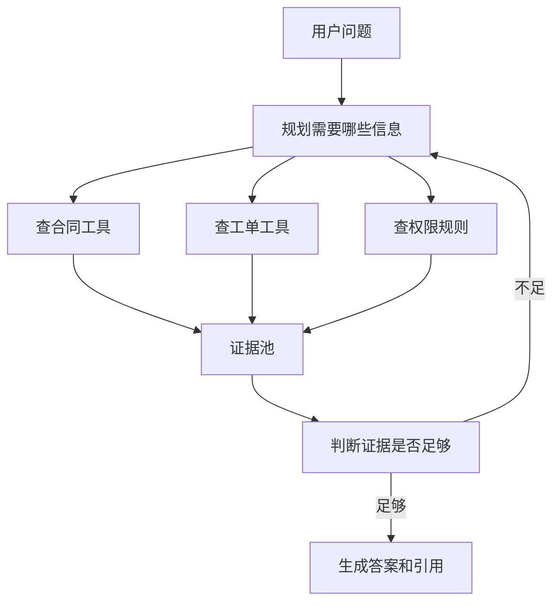
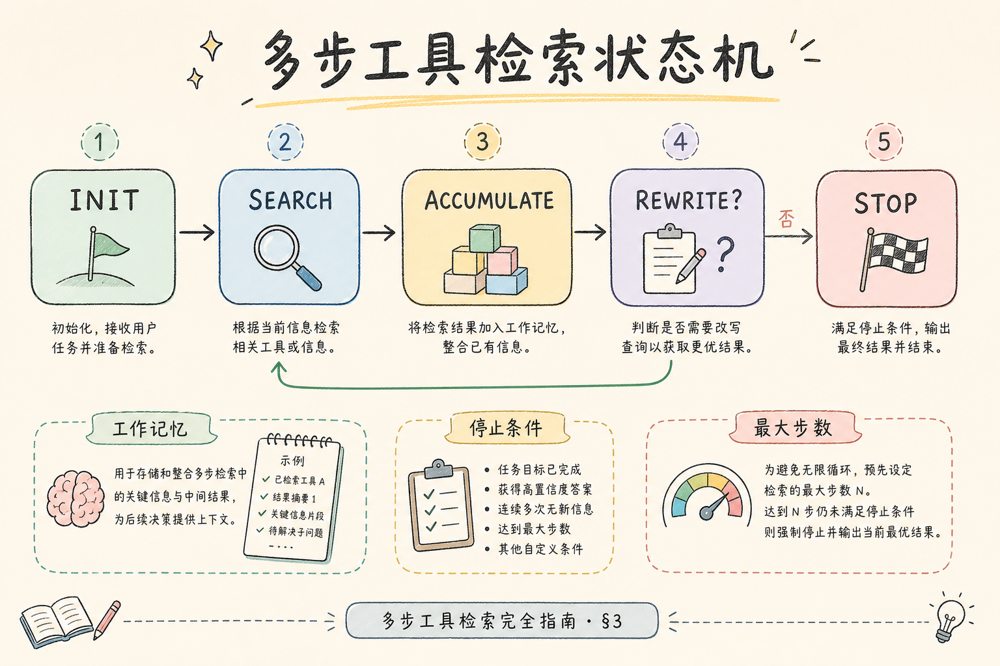
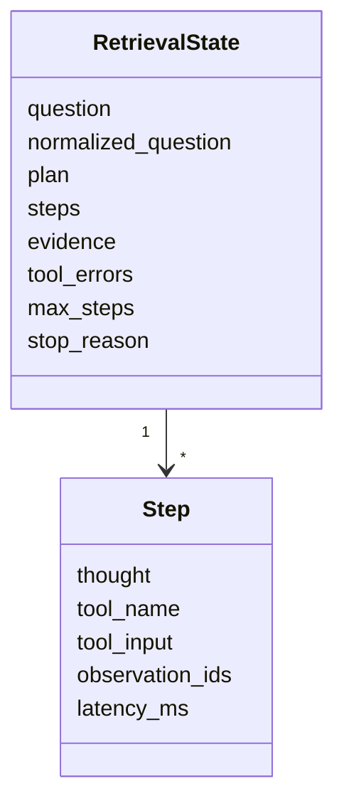
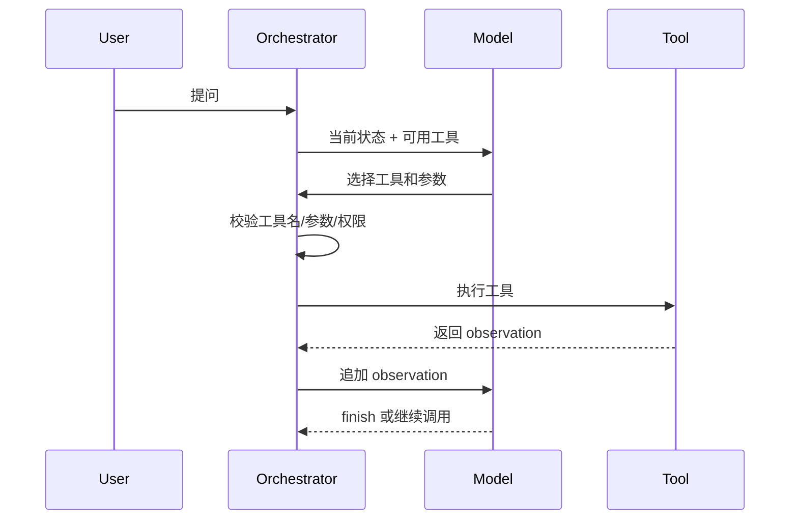
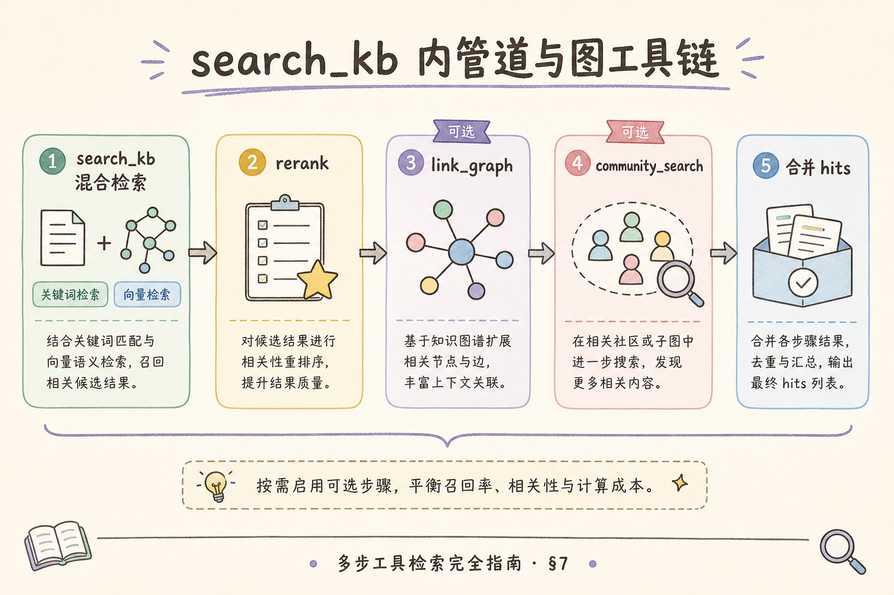
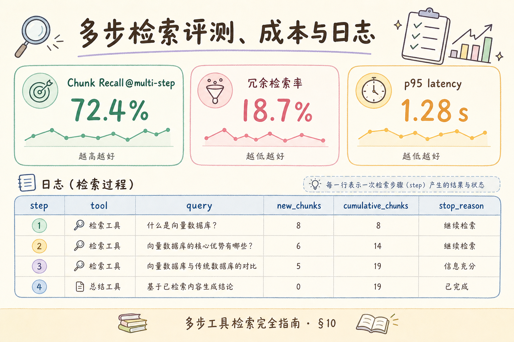

# H 进阶方向（五）：Multi-step Tool Retrieval 完全指南（了解）

> [202 ReAct](202.react-reasoning-rag-tutorial.md) 讲“边想边行动”的思想；本文讲工程落地：当一个 RAG 问题需要多次检索、多个工具、多个中间状态时，系统应该如何组织步骤、停止条件、状态记录和错误处理。

---

## 目录

1. [为什么需要多步工具检索](#1-为什么需要多步工具检索)
2. [它是什么](#2-它是什么)
3. [解决什么问题](#3-解决什么问题)
4. [核心状态怎么设计](#4-核心状态怎么设计)
5. [工具调用流程](#5-工具调用流程)
6. [停止条件与失败处理](#6-停止条件与失败处理)
7. [最小实现示例](#7-最小实现示例)
8. [边界与 FAQ](#8-边界与-faq)
9. [总结](#9-总结)

## 1. 为什么需要多步工具检索

普通 RAG 默认只有一个检索动作。用户问问题，系统查知识库，模型回答。这个流程清晰、便宜、稳定，但处理不了所有问题。

例如用户问：“根据最新合同、历史工单和权限策略，判断这个客户能不能访问高级报表。”这类问题至少涉及三类资料：合同、工单、权限策略。一次检索很可能只命中其中一类。

多步工具检索的目标是把复杂问题拆成多个工具动作，并把每一步结果记录下来，最终形成可审计的答案。

## 2. 它是什么

**Multi-step Tool Retrieval**：一个 RAG 编排模式。系统允许模型或规则在多个步骤里调用不同工具，例如 `search_contracts`、`search_tickets`、`search_policy`、`rerank`、`finish`。

通俗说：它像一个办事流程。不是“拿一份资料就下结论”，而是按清单查合同、查记录、查规则，最后把证据合并。



和 ReAct 的区别：ReAct 更强调 prompt 格式和模型思考动作；多步工具检索更强调工程状态、工具边界和可追踪执行。

## 3. 解决什么问题

它解决三类工程问题。



第一，资料分散在多个系统。合同在一个库，工单在另一个库，权限策略在第三个库，单一检索器不够。

第二，查询需要逐步缩小范围。先查客户 ID，再查合同版本，再查某条权限规则。

第三，团队需要审计 trace。生产系统不能只输出“模型说可以”，还要知道它查了哪些工具、拿了哪些证据、为什么停止。

| 场景 | 单步 RAG 风险 | 多步工具检索做法 |
|------|---------------|------------------|
| 合同 + 政策联合判断 | 只查到政策 | 分工具查合同和政策 |
| 客服复杂追问 | 丢掉历史上下文 | 状态里保留已查证据 |
| Agent 工具调用 | 乱调工具 | 工具白名单 + 停止条件 |
| 合规审计 | 无法解释答案来源 | 记录 trace |

## 4. 核心状态怎么设计

多步系统必须有状态。没有状态，模型每一步都会“失忆”，也无法调试。



建议字段：

| 字段 | 用途 |
|------|------|
| `question` | 原始问题 |
| `plan` | 当前拆解出的信息需求 |
| `steps` | 每一步工具调用记录 |
| `evidence` | 已收集证据，按来源去重 |
| `tool_errors` | 超时、空结果、权限拒绝 |
| `max_steps` | 防无限循环 |
| `stop_reason` | 完成、证据不足、工具失败、超步数 |

状态不是为了复杂而复杂。它的直接收益是：出错时能定位“哪一步查错了”，而不是只看到最终答案错。

## 5. 工具调用流程

工具调用要有明确边界。模型不能随便发明工具名，也不能传入无限长参数。



实际工程中，Orchestrator（编排器）很重要。它负责校验工具、限制步数、捕获错误、写 trace，而不是让模型直接控制所有外部系统。

## 6. 停止条件与失败处理

多步检索最容易坏在“停不下来”。必须提前定义停止条件：

| 停止条件 | 说明 |
|----------|------|
| `finish` | 模型认为证据足够 |
| `max_steps` | 达到最大步数 |
| `no_new_evidence` | 连续两步没有新证据 |
| `tool_error_limit` | 工具错误过多 |
| `unsafe_request` | 权限或安全规则拒绝 |

失败时不要硬答。可以输出：“当前证据不足，已查合同和权限策略，但未找到客户历史授权记录。”这比编造一个结论更适合企业 RAG。

## 7. 最小实现示例

下面是伪代码，演示结构，不绑定具体框架：



```python
state = {
    "question": user_question,
    "steps": [],
    "evidence": [],
    "max_steps": 4,
}

for _ in range(state["max_steps"]):
    action = model_choose_action(state)

    if action["tool"] == "finish":
        return generate_answer(state["evidence"])

    if action["tool"] not in {"search_kb", "search_ticket", "search_policy"}:
        state["steps"].append({"error": "invalid_tool"})
        continue

    observation = run_tool(action["tool"], action["input"])
    state["steps"].append({
        "tool": action["tool"],
        "input": action["input"],
        "observation": observation["ids"],
    })
    state["evidence"].extend(observation["chunks"])

return "证据不足：已达到最大检索步数。"
```

这段代码的关键不是循环本身，而是每一步都写入 `state`。上线后，trace 能直接进入 [182 检索调试台](182.retrieval-debug-console-tutorial.md) 或审计日志。

## 8. 边界与 FAQ

这一节说明多步工具检索的适用边界。它的本质是工程编排，不是让模型拥有无限自主权。

### 8.1 是否每个复杂问题都要多步？

不需要。可以先用路由判断复杂度。简单事实题走普通 RAG；多来源、多条件、多工具问题才走多步。

### 8.2 模型能不能自己决定所有工具？

不建议。工具列表、参数 schema、权限校验和最大步数都应该由系统控制。模型只在受限范围内选择。

### 8.3 和 ReAct 的关系是什么？

ReAct 是一种让模型输出 thought/action/observation 的交互范式；多步工具检索是把这套范式工程化，重点是状态、工具、trace 和停止条件。

### 8.4 最大上线风险是什么？

成本和不可解释性。多一步工具调用就多一次延迟和失败点。如果没有 trace，复杂流程会变成更难排查的黑盒。

## 9. 总结

Multi-step Tool Retrieval 的核心是把复杂 RAG 问题拆成多个可记录、可校验、可停止的工具步骤。它适合多来源、多条件、需要审计 trace 的企业问答，不适合替代简单 RAG。



一句话记忆：**ReAct 讲“边想边查”的方法，多步工具检索讲“怎么把边想边查做成可上线系统”。**
