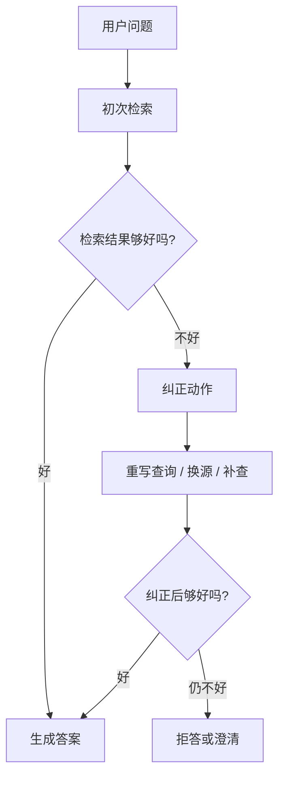
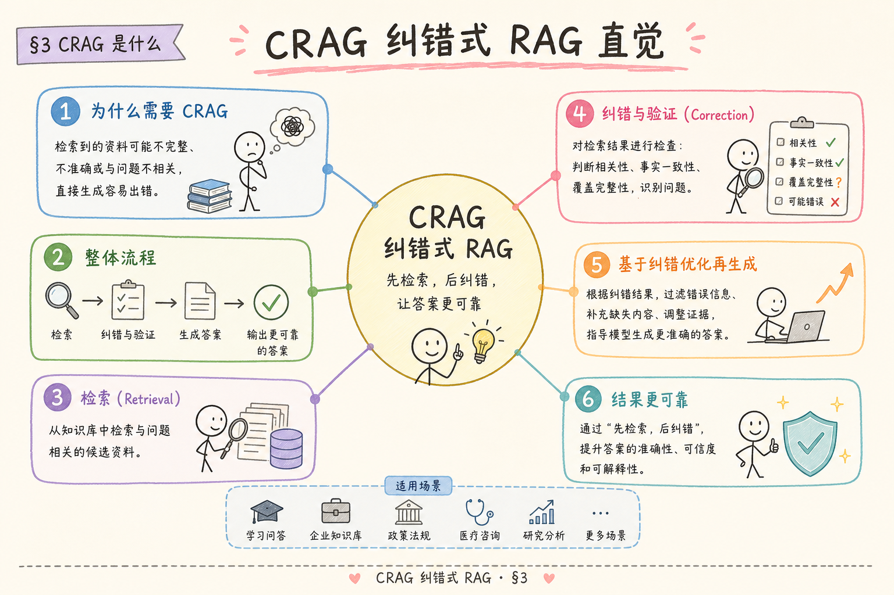
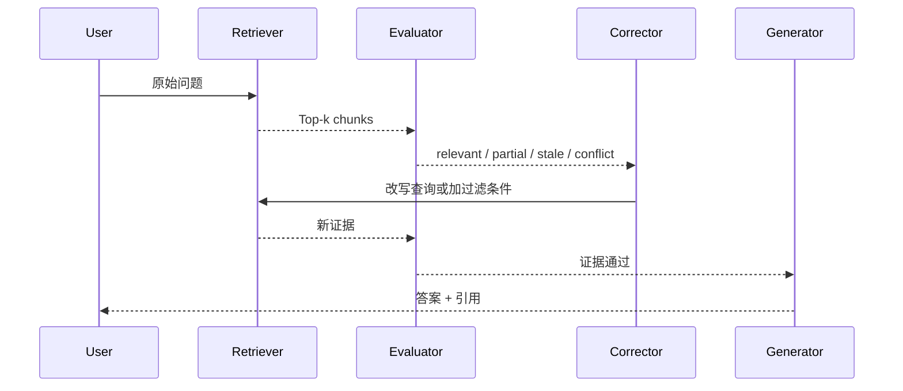
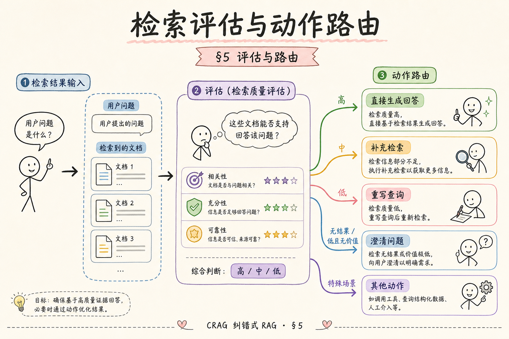
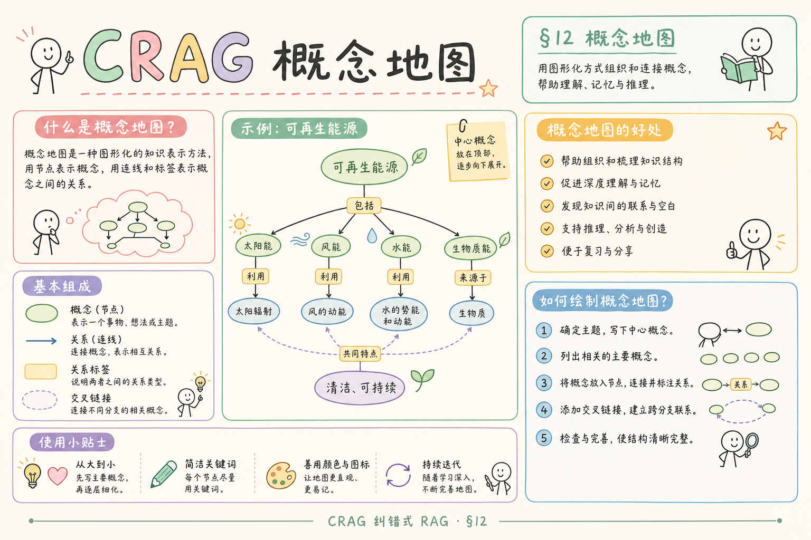

# H 进阶方向（七）：CRAG 纠错式 RAG 完全指南（了解）

> 普通 RAG 容易假设“检索结果就是可用证据”。CRAG（Corrective RAG）关注的是另一件事：当检索结果质量差时，系统应该识别出来，并采取纠正动作，而不是继续生成一个看似有引用的错误答案。

---

## 目录

1. [为什么需要 CRAG](#1-为什么需要-crag)
2. [CRAG 是什么](#2-crag-是什么)
3. [它解决什么问题](#3-它解决什么问题)
4. [纠错流程怎么走](#4-纠错流程怎么走)
5. [工程简化版怎么做](#5-工程简化版怎么做)
6. [和 Self-RAG、Adaptive RAG 的区别](#6-和-self-ragadaptive-rag-的区别)
7. [评测与上线门禁](#7-评测与上线门禁)
8. [常见陷阱与 FAQ](#8-常见陷阱与-faq)
9. [总结](#9-总结)

## 1. 为什么需要 CRAG

RAG 的错误很多时候不是生成阶段才发生，而是检索阶段已经错了。比如用户问“2026 年差旅住宿上限”，系统却检索到 2024 旧政策；或者用户问“删除用户数据流程”，系统命中的是“上传用户数据流程”。

普通 RAG 如果不检查检索质量，会把错误 context 直接送给模型。模型很可能基于错误资料给出流畅答案，看起来专业，但事实错误。

CRAG 的目标是：在生成前判断检索结果是否足够好；如果不好，主动纠正。

## 2. CRAG 是什么

**CRAG**（Corrective Retrieval-Augmented Generation，纠错式检索增强生成）：在 RAG 流程中加入检索结果评估和纠正步骤。当检索结果不相关、不完整或冲突时，系统会重写查询、补充检索、换数据源，或拒答。

通俗说：普通 RAG 像“查到什么就用什么”；CRAG 像“先检查资料对不对，不对就重新查或说明查不到”。



这张图的关键是：纠错发生在生成之前。不要等答案胡编后才补救。

## 3. 它解决什么问题

CRAG 主要解决检索质量差导致的错误。



| 检索问题 | 表现 | CRAG 动作 |
|----------|------|-----------|
| 不相关 | Top-k 和问题主题不一致 | 重写查询 |
| 不完整 | 只命中部分条件 | 补充检索 |
| 过期 | 命中旧版本文档 | 加版本过滤 |
| 冲突 | 多份资料结论不同 | 展示冲突并要求澄清 |
| 低置信度 | 分数很低或证据稀疏 | 拒答或降级 |

CRAG 不等于“再检索一次”。它的核心是先判断坏在哪里，再选择对应纠正动作。

## 4. 纠错流程怎么走

一个实用 CRAG 流程可以分成三步：评估、纠正、生成。



Evaluator 可以是规则、reranker、分类器或 LLM judge。初期建议先用可解释规则：分数阈值、版本过滤、关键词覆盖、metadata 匹配，再补 LLM judge。

## 5. 工程简化版怎么做

最小版本不需要复现论文。可以先加一个 retrieval evaluator：



```python
def evaluate_retrieval(question, chunks):
    if not chunks:
        return "empty"
    if max(c["score"] for c in chunks) < 0.35:
        return "low_confidence"
    if any(c.get("version") == "deprecated" for c in chunks):
        return "stale"
    return "ok"

status = evaluate_retrieval(question, chunks)
if status == "ok":
    answer(chunks)
elif status == "low_confidence":
    retry_with_query_rewrite(question)
elif status == "stale":
    retry_with_latest_version(question)
else:
    refuse("当前资料不足，无法可靠回答。")
```

这段代码的目标是说明 CRAG 的工程位置：它在生成前对检索结果做门禁。门禁失败时，系统选择重试、换源或拒答，而不是硬答。

## 6. 和 Self-RAG、Adaptive RAG 的区别

这些方案常被混在一起。按职责区分会更清楚：

| 方案 | 主要判断 | 典型动作 |
|------|----------|----------|
| Self-RAG | 需要检索吗？答案被支持吗？ | 自检、拒答、重写 |
| CRAG | 检索结果质量好吗？ | 纠正检索、换源、补查 |
| Adaptive RAG | 这个问题该走哪条路径？ | 普通 RAG / 多步 / 高成本路线 |


如果只能先做一个，建议从 CRAG 的“检索门禁”做起，因为它最容易和现有 RAG 管道集成。

## 7. 评测与上线门禁

CRAG 要用 bad case 评测，而不是只看平均回答质量。

| 指标 | 看什么 |
|------|--------|
| retrieval correction rate | 坏检索是否被识别 |
| false correction rate | 好检索是否被误判为坏 |
| stale document hit rate | 旧版本是否减少 |
| faithfulness | 最终答案是否基于新证据 |
| latency | 重试是否拖慢太多 |

上线门禁：坏检索识别率提升，误杀率可接受，最终 Faithfulness 不下降。如果纠错动作导致大量好问题被拒答，说明阈值过严。

## 8. 常见陷阱与 FAQ

这一节收束 CRAG 的边界。CRAG 是检索质量门禁，不是让模型在错误资料上“聪明生成”。

### 8.1 CRAG 能修所有幻觉吗？

不能。它主要修检索质量问题。模型在证据充足时仍可能总结错误，这要靠 Faithfulness judge、引用检查和人工评测。

### 8.2 是否每次都要重试检索？

不需要。只有 evaluator 判定低置信、不完整、过期或冲突时才重试。否则会浪费成本。

### 8.3 LLM judge 可以直接决定是否回答吗？

可以辅助，但不要单独决定。生产上应结合分数、metadata、版本、权限和抽检结果。

### 8.4 和 151/152 bad case 有什么关系？

[151 检索遗漏](151.bad-case-retrieval-miss-tutorial.md) 和 [152 幻觉坏例](152.bad-case-hallucination-tutorial.md) 提供训练和评测样本。CRAG 把这些坏例变成自动门禁和纠错策略。

## 9. 总结

CRAG 的核心是：生成前先检查检索结果质量，发现不相关、不完整、过期或冲突时主动纠正。



一句话记忆：**普通 RAG 查到就答；CRAG 先问“查到的资料靠谱吗”，不靠谱就重查、换源或拒答。**
