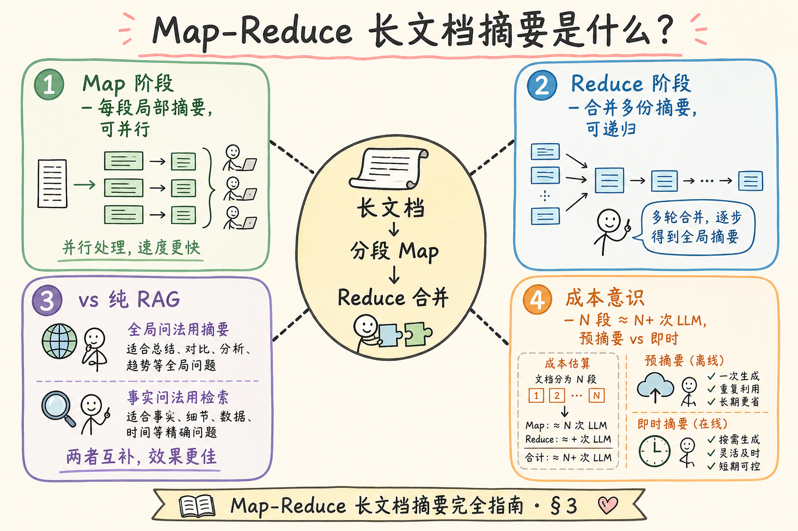
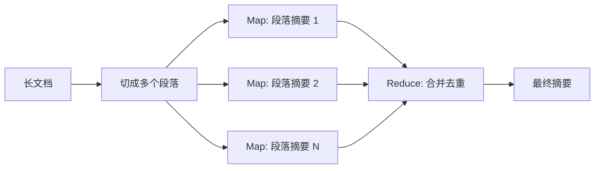
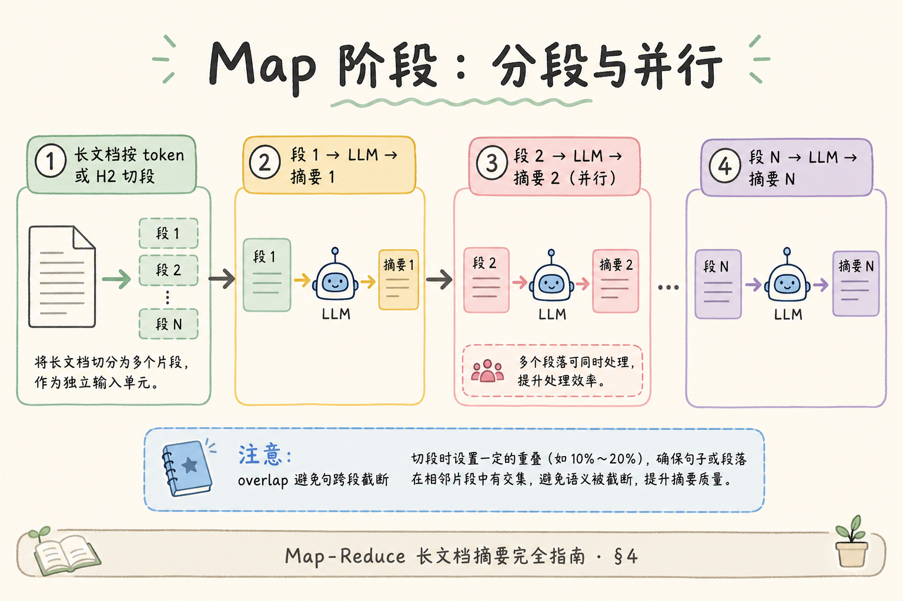
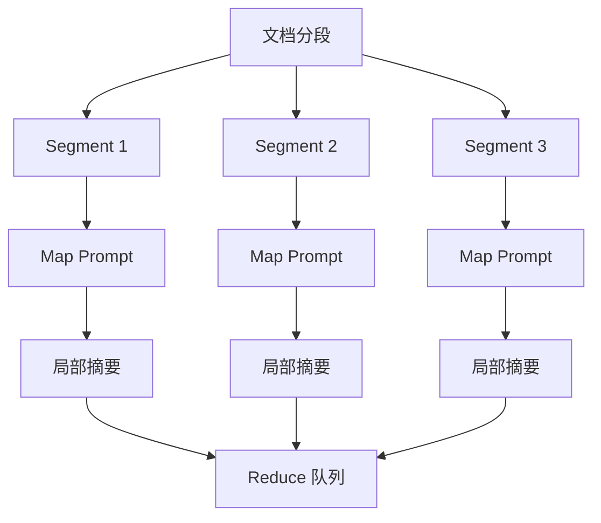
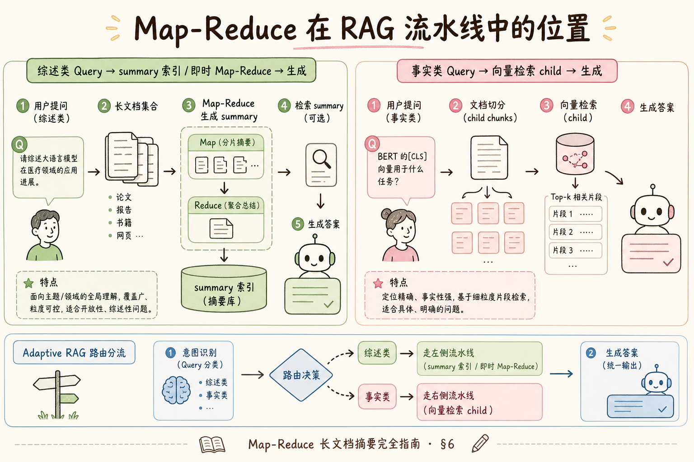
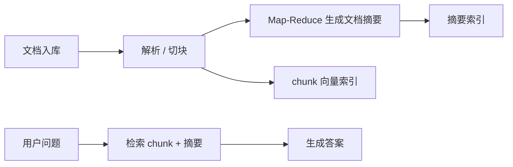

# H 进阶方向（九）：Map-Reduce 长文档摘要完全指南

> [206 Adaptive RAG](206.adaptive-rag-tutorial.md) 教会你 **按题选路**——有的问法该检索，有的该直答。但当用户问的是 **「这份 200 页审计报告的核心风险有哪些？」**，检索只能捞出 **零散片段**，拼不成 **全局叙事**；把全文硬塞进 [28 上下文窗口](28.context-window-tutorial.md) 又超预算。**Map-Reduce 摘要**（分段 Map 局部摘要、Reduce 合并总摘要）是 RAG 处理 **超长单文档** 的经典工程范式。这篇是 [企业 RAG 路线图](ENTERPRISE_RAG_ROADMAP.md) **H 模块地基篇**（路线图第 **224** 条），讲清原理、与检索的分工、Python 最小实现与成本意识。前置：[28 上下文窗口](28.context-window-tutorial.md)、[65 Parent-Document](65.parent-document-retriever-tutorial.md)、[107 Context 预算](107.context-budget-tutorial.md)、[206 Adaptive RAG](206.adaptive-rag-tutorial.md)。

---

## 目录

1. [前言：检索碎片 vs 全文理解](#1-前言检索碎片-vs-全文理解)
2. [本文边界与动手路径](#2-本文边界与动手路径)
3. [Map-Reduce 摘要是什么](#3-map-reduce-摘要是什么)
4. [Map 阶段：分段局部摘要](#4-map-阶段分段局部摘要)
5. [Reduce 阶段：合并与递归](#5-reduce-阶段合并与递归)
6. [在 RAG 流水线中的位置](#6-在-rag-流水线中的位置)
7. [先错对对：四种典型翻车](#7-先错对对四种典型翻车)
8. [最小实现：可跑 Python 原型](#8-最小实现可跑-python-原型)
9. [与 Refine、RAPTOR 的分工预告](#9-与-refineraptor-的分工预告)
10. [成本、延迟与评测](#10-成本延迟与评测)
11. [综合概念地图](#11-综合概念地图)
12. [常见陷阱与 FAQ](#12-常见陷阱与-faq)
13. [总结与系列下一步](#13-总结与系列下一步)

## 1. 前言：检索碎片 vs 全文理解

企业知识库里常有 **单文件极长** 的文档：年度审计报告、并购尽调包、产品规格书全集、监管合规手册。用户问题分两类：

| 问题类型 | 典型问法 | 更适合的方案 |
|----------|----------|--------------|
| **局部事实** | 「第三章提到的违约金比例是多少？」 | 向量检索 + 生成 |
| **全局综合** | 「全文列出了哪五类合规风险？」 | 摘要 / 分层理解 |

纯 RAG 检索对第二类往往 **漏项**：每个 chunk 只覆盖一节，Top-10 凑不齐「五类」；模型在 prompt 里 **自行归纳** 容易 [幻觉](33.llm-hallucination-tutorial.md)。

**Map-Reduce Summarization**（Map-Reduce 摘要）：将长文切成多段，**并行**（或串行）对每段做局部摘要（Map），再把局部摘要 **合并** 成更高层摘要（Reduce）；Reduce 仍超长时可 **递归** 再 Map-Reduce。  
通俗说：**先让多人各读一章写读书笔记，主编再把笔记合成目录**——没有人需要一次读完 200 页。

LangChain 的 `load_summarize_chain(chain_type="map_reduce")` 是常见封装；**思想不绑框架**——你在 ingest 或 query 时都可以挂这条链。

**读完本文，你应该能做到：**

1. 解释 Map-Reduce 与 **普通 RAG 检索** 各自擅长的问法。  
2. 设计 **分段策略**（按 token、按结构 parent）。  
3. 实现 §8 最小原型（含递归 Reduce）。  
4. 估算 **LLM 调用次数与 token 成本**（§10）。  
5. 识别 §7 四种翻车：段太大、Reduce 一次塞爆、摘要当唯一索引、无溯源。

### 1.1 H 模块位置

```text
216 Graph RAG … 223 Adaptive RAG
224 Map-Reduce 摘要 ← 本篇（长文档全局理解 · 地基）
225 Refine 迭代精炼
226 RAPTOR … 230 RLHF/DPO
```

本篇与 [208 Refine](208.refine-summarization-tutorial.md) 构成 **长文档理解双子星**：Map-Reduce **并行快**；Refine **连贯性好**。选型见 §9。

### 1.2 术语双轨速查

| 中文 | English | 一句话 |
|------|---------|--------|
| Map 阶段 | Map | 对每段原文做局部摘要 |
| Reduce 阶段 | Reduce | 合并多份局部摘要 |
| 递归 Reduce | Recursive Reduce | 合并结果仍太长则再分层 |
| 摘要链 | Summarize Chain | 编排 Map/Reduce 的流水线 |
| 分层摘要 | Hierarchical Summary | 多级摘要树，服务不同粒度问答 |

### 1.3 读完本篇的最小交付物

1. 一张 **Map→Reduce→（可选递归）** 数据流图；  
2. 一份 **段长与 overlap** 配置表（§4）；  
3. 一个 **可跑的 §8 脚本**（mock LLM 亦可）；  
4. 三条 **先错对对** 口述（§7）；  
5. 对 10 页样例文档的 **调用次数估算**（§10）。

## 2. 本文边界与动手路径

**档位：H 地基篇（路线图 224，厚实现导向）。**

**本文讲：** Map-Reduce 原理、分段、Reduce 递归、RAG 集成点、Python 原型、成本。  
**本文不讲：** 专用长上下文模型（128k 一次读完）、多模态幻灯片摘要（见 [210 多模态 RAG](210.multimodal-rag-tutorial.md)）、GraphRAG 社区摘要（见 [199 Graph RAG](199.graph-rag-tutorial.md)）。

### 2.1 动手路径表

| 步骤 | 你做什么 | 验收 |
|------|----------|------|
| A | 读 §3～§5，画 Map/Reduce 图 | 白板能讲 |
| B | 准备 1 份 30+ 页 Markdown 样例 | 有 doc_id |
| C | 跟做 §8，跑通两级摘要 | 输出总摘要 < 2k token |
| D | 用 §6 接到 query 路由 | 「全文风险」走摘要链 |
| E | §7 先错对对 | 四种错法 |
| F | §10 填成本表 | 知道 200 页要几次 API |

**环境：** Python 3.10+；`openai` 或任意兼容 API；无 GPU 要求。

### 2.3 企业场景问法分类表

上线 Map-Reduce 前，用产品 **真实问法** 打标签（可接 [206 Adaptive](206.adaptive-rag-tutorial.md) 同一分类器）：

| 标签 | 示例 | 默认路径 |
|------|------|----------|
| `global_summary` | 「全文风险概览」「各章要点」 | 摘要索引 / Map-Reduce |
| `section_summary` | 「第三章讲什么」 | level-1 摘要或 parent |
| `factoid` | 「违约金比例」「具体日期」 | 向量检索 |
| `multi_doc` | 「三份合同共同条款」 | 每 doc 摘要再 Reduce |

**错误路由** 比 **没有 Map-Reduce** 更糟——factoid 走摘要会 **自信地糊**。评测集按标签 **分层报** Recall 与 Faithfulness。

### 2.4 摘要 chunk 的 Embedding 注意

摘要文本 **抽象**，与叶子 chunk **分布不同**——若与叶子 **同一 collection 硬混**，可能 **挤占** Top-k。策略：

1. **独立 collection** `handbook_summaries`；  
2. 或 metadata `chunk_type` + 查询时 **boost**（[105 metadata filter](105.metadata-filter-retrieval-tutorial.md)）；  
3. 换摘要 **专用 embed**（少见，了解）。

换 Embedding 模型时摘要与叶子 **同步重建**（[76 Chroma](76.chroma-vector-db-tutorial.md) 铁律）。

## 3. Map-Reduce 摘要是什么

读下图：长文如何被「分而治之」。



下面这张图说明 Map-Reduce 摘要的基本思想。读图时重点看：先把长文档分段局部总结，再把局部总结合并成全局总结。



结论：Map-Reduce 不是为了显得复杂，而是解决模型一次读不完整篇长文档的问题。

对照上图：

- **输入**：单文档全文（或单 doc_id 下所有 chunk 按序拼接）；  
- **Map**：切成 `N` 段，每段独立调用 LLM → `N` 份局部摘要；  
- **Reduce**：把 `N` 份摘要拼成 prompt，再调 LLM → 1 份总摘要；  
- **输出**：可入库为 **summary chunk**、可仅作 query 时临时计算、可多级树状存储。

### 3.1 与「一次读完」的对比

| 方案 | 优点 | 缺点 |
|------|------|------|
| 超长上下文一次输入 | 调用 1 次，逻辑简单 | 贵、慢、中间遗忘（[108 Reorder](108.long-context-reorder-tutorial.md)） |
| Map-Reduce | 可并行、每步在窗口内 | 调用 `N+1` 次以上，摘要可能丢细节 |
| 纯 RAG 检索 | 便宜、可溯源 | 全局综合问法易漏 |

**工程建议**：**全局类问法** 走 Map-Reduce 或预计算摘要索引；**事实类问法** 仍走向量检索——由 [206 Adaptive](206.adaptive-rag-tutorial.md) 路由。

### 3.2 Map-Reduce 在 ingest vs query

| 时机 | 做法 | 适用 |
|------|------|------|
| **Ingest 预摘要** | 上传时算好 summary 入库 | 文档更新不频、同一文档常被「总览」问 |
| **Query 即时摘要** | 用户问时再算 | 文档极长、问法稀少、要避免陈旧摘要 |
| **混合** | 章节级预摘要 + query 时 Reduce | 手册类结构化长文 |

预摘要要把 `summary` 当 **特殊 chunk** 写入向量库，metadata 标 `chunk_type=summary`、`level=1|2`（见 §6）。

## 4. Map 阶段：分段局部摘要

Map 的质量 **80% 取决于怎么切**。

### 4.1 分段策略

| 策略 | 做法 | 何时用 |
|------|------|--------|
| **固定 token 窗** | 每段 2k～4k token，带 overlap | 纯文本 PDF、无法结构解析 |
| **结构 parent** | 按 H2/H3 节切（[63 AST](63.markdown-ast-chunking-tutorial.md)） | Markdown、HTML 手册 |
| **页界** | 每 5～10 PDF 页一段 | 扫描件、版式稳定 |

**Overlap**（重叠）：相邻 Map 段共享 100～200 token，避免 **句跨段被截断** 导致摘要断章取义——与 [60 chunk overlap](60.chunk-overlap-tutorial.md) 同理。

### 4.2 Map Prompt 要点

```text
你是企业文档分析师。下面是一段内部文档的【局部原文】，不是全文。
请用中文列出：①本段主题 ②关键事实与数字 ③风险或待办（若有）。
不要编造原文没有的内容。若本段仅为目录或附录，一句话说明即可。

【局部原文】
{chunk_text}
```

**温度**：Map 建议 `temperature=0～0.3`，减少创造性发挥。  
**输出格式**：要求 **条目化**，方便 Reduce 阶段去重合并。

### 4.3 并行与限流

Map 段彼此 **无状态**，可 `asyncio` / 线程池并行——注意 **API 速率限制**（[Embedding 重试篇](27.embedding-retry-rate-limit-tutorial.md) 的限流思路同样适用 LLM）。  
失败段 **单独重试**，不要整文档重来；记录 `map_job_id` 与 `segment_index` 便于排障。

读下图：Map 分段与并行。



下面这张图展示 Map 阶段如何并行处理分段。读图时重点看：并行能提速，但也要受模型 API 限流和成本约束。



这张图的结论是：Map 阶段天然适合并行，但必须设计限流、重试和输出 schema，否则 Reduce 会很难合并。

对照上图可以得出一个实用结论：先确认「Map 阶段分段与并行」里的主流程，再去调整具体参数或实现细节。

### 4.4 段长与 token 预算联动

Map 段目标长度应结合 **模型上下文** 与 **Map prompt 开销** 反推，而不是拍脑袋「4k」：

```text
可用段长 ≈ context_limit × 0.55 − map_prompt_overhead − safety_margin
```

例：32k 上下文、Map 系统指令约 400 token、留 20% 给输出 → 单段原文宜 **12k～14k 字符量级**（中文约 6k～8k 字），仍建议 **结构 parent 优先**——同一 H2 节尽量不拦腰切断。  
若段内必含 **表格**，用 [64 HTML DOM](64.html-dom-chunking-tutorial.md) 或 [44 PDF 表格](44.pdf-layout-tables-tutorial.md) 保证 **表头与首行数据同段**，否则 Map 摘要会写「本段含表格（细节略）」——Reduce 阶段永远补不回来。

### 4.5 Map 输出 schema（便于 Reduce 去重）

要求 Map 输出 **轻量 JSON 外壳**（外层仍可用 markdown 条目），Reduce 时可程序化去重：

```json
{
  "section_theme": "差旅住宿标准",
  "facts": ["一线城市上限500元/晚", "含早餐"],
  "risks": [],
  "open_items": []
}
```

MVP 可不要 JSON，但 **生产** 建议在 Map 末加一行「关键词：」列表——Reduce prompt 可指示 **按关键词合并**，降低同义重复（「住宿上限」与「酒店费用封顶」）。

## 5. Reduce 阶段：合并与递归

Reduce 把 `N` 份局部摘要合成 **一份更短的全文视图**。

### 5.1 单层 Reduce

当 `N` 份摘要总 token **小于** 模型上下文 **60%**（留出生成空间），可一次 Reduce：

```text
以下是同一文档各部分的摘要，请合并为一份【全文摘要】：
要求：去重、保留所有 distinct 风险点/结论、按逻辑分节。
若各部分摘要有矛盾，标注「摘要冲突」并并列列出，不要擅自调和。

{summary_1}
---
{summary_2}
...
```

### 5.2 递归 Reduce（树形）

若 `N=50`，50 份摘要拼不进窗口 → **分批 Reduce**：

```text
Level 0: 50 段原文 → 50 份 map 摘要
Level 1: 每 5 份 map 摘要 reduce → 10 份 mid 摘要
Level 2: 每 5 份 mid reduce → 2 份
Level 3: 2 份 → 1 份 final 摘要
```

调用次数约为 `N + N/5 + N/25 + …`，仍远小于「每段与全文互看」的 `O(N²)`。

### 5.3 Reduce 与事实保真

摘要链的 **头号风险** 是 Reduce 时 **抹平数字**（「多处提到罚款」但丢了具体金额）。缓解：

1. Map prompt 强制 **保留数字与专有名词**；  
2. Reduce prompt 要求 **「关键数据」单独列表**；  
3. 用户问具体数时 **仍走检索**，摘要只答「概览类」（§6 路由）。

### 5.4 Reduce 合并策略对照

| 策略 | 做法 | 适用 |
|------|------|------|
| **单次 Reduce** | 全部 map 摘要一次合并 | map 份数少、总 token < 窗口 50% |
| **分桶 Reduce** | 按章/Part 先合并，再全局 | 百页手册，中间产物可入库 level-1 |
| **Map-Reduce of Summaries** | 对 map 摘要做二次 map（压缩） | 单段摘要仍过长 |
| **带裁判 Reduce** | 第二次 LLM 只输出「差异与新增」 | 贵，但适合合规审计 |

**分桶 Reduce** 与 [209 RAPTOR](209.raptor-hierarchical-retrieval-tutorial.md) 的浅层树 **同构**：level-1 摘要可当 RAPTOR 父节点，不必重复算两遍——设计 ingest 时 **一次 Map-Reduce 产出多级 summary chunk** 即可。

### 5.5 多文档 Batch

尽调 **包**（几十个 PDF）若用户问「**各标的风险共性**」，可对 **每个 doc** 先 final reduce，再对 **各 doc 终稿** 做第二轮 Map-Reduce——这是 **跨文档 Reduce**，别与单文档 Map 混在一个任务里，否则失败重试粒度太粗。

## 6. 在 RAG 流水线中的位置

读下图：摘要链与检索链并联。



下面这张图说明 Map-Reduce 摘要在 RAG 流水线中的位置。读图时重点看：它可以用于 ingest 阶段生成摘要索引，也可以用于 query 阶段处理超长上下文。



结论：摘要不是替代检索，而是补充全局背景。具体事实仍应回到原始 chunk 和引用。

推荐架构：

```text
Query
  → 意图分类（206 Adaptive）
      ├─ factual / 局部 → 向量检索 → generate
      └─ global / 综述   → 取 doc_id 的 summary 索引
                          或即时 Map-Reduce
                          → generate（附「基于摘要，细节请追问章节」）
```

**Summary 入库 schema 示例**：

```python
{
  "chunk_id": "audit-2024::summary::L2::0",
  "doc_id": "audit-2024",
  "chunk_type": "summary",
  "summary_level": 2,  # 0=map, 1=mid, 2=final
  "parent_chunk_id": None,
  "text": "……合并摘要……",
}
```

查询「全文风险」时 `where={"doc_id": x, "chunk_type": "summary", "summary_level": 2}`，或与 child chunk **混合检索** 后由 reranker 选摘要块。

### 6.1 与 Parent-Document 的配合

[65 篇](65.parent-document-retriever-tutorial.md) 的 **parent** 可直接作为 Map 段边界——**一节一 Map**，比固定 2k 切分更语义完整。  
Child 仍服务细粒度检索；parent 级 map 摘要服务 **章节总览**；final reduce 服务 **文档总览**——三级问答粒度。

### 6.2 溯源与 Grounding

摘要答案 **难以逐句引用** 原文页码。产品策略：

- UI 标注 **「基于自动摘要，非逐字引用」**；  
- 提供 **「展开相关章节」** 按钮，用摘要中的关键词 **二次检索** child chunk；  
- 关键合规场景 **禁止仅依赖摘要** 做数值裁决（[34 Grounding](34.grounding-citation-tutorial.md)）。

## 7. 先错对对：四种典型翻车

| 错法 | 后果 | 对法 |
|------|------|------|
| Map 段过大（整章 15k token） | 超窗口截断、摘要糊成一团 | 按 §4 控制 2k～4k 或按 parent |
| Reduce 一次塞 80 份摘要 | 超窗口或中间遗忘 | 递归 Reduce（§5.2） |
| 只存 final 摘要、丢 map | 无法更新中间节、难 debug | 分层存 level 0/1/2 |
| 所有问法都走摘要 | 简单事实题又慢又糊 | Adaptive 路由（206） |

**场景题**：用户问「报告里提到的唯一一笔并购金额是多少？」——应走 **检索**，不应走全文摘要（摘要可能合并表述丢精确值）。

## 8. 最小实现：可跑 Python 原型

下列代码 **不绑 LangChain**，便于读懂数据流。`call_llm` 请替换为你的 API。

```python
from __future__ import annotations
import math
from typing import Callable

def split_text(text: str, max_chars: int = 6000, overlap: int = 200) -> list[str]:
    chunks: list[str] = []
    start = 0
    while start < len(text):
        end = min(start + max_chars, len(text))
        chunks.append(text[start:end])
        if end == len(text):
            break
        start = end - overlap
    return chunks

MAP_PROMPT = """用条目列出本段主题、关键事实与数字（保留原文数字）：
{text}"""

REDUCE_PROMPT = """合并以下分段摘要为一份全文摘要，去重并分节：
{summaries}"""

def map_reduce_summarize(
    text: str,
    call_llm: Callable[[str], str],
    max_chars: int = 6000,
    reduce_batch: int = 5,
) -> str:
    segments = split_text(text, max_chars=max_chars)
    level = [call_llm(MAP_PROMPT.format(text=s)) for s in segments]
    while len(level) > 1:
        next_level: list[str] = []
        for i in range(0, len(level), reduce_batch):
            batch = level[i : i + reduce_batch]
            joined = "\n---\n".join(batch)
            next_level.append(call_llm(REDUCE_PROMPT.format(summaries=joined)))
        level = next_level
    return level[0]

# demo
if __name__ == "__main__":
    def mock_llm(prompt: str) -> str:
        return f"[摘要:{len(prompt)} 字输入] " + prompt[:80] + "…"

    doc = "第一章…" * 500
    print(map_reduce_summarize(doc, mock_llm)[:500])
```

**验收**：对 3 段假文本，`map` 调用 3 次、`reduce` 1 次；对 12 段，`reduce` 应出现第二轮。

### 8.1 接入 FastAPI 后台任务

长文档摘要应 **异步**（[158 BackgroundTasks](158.fastapi-background-tasks-tutorial.md)、[159 Celery](159.celery-async-queue-tutorial.md)）：上传 → `pending` → Map 并行 → Reduce → `summary` 写入向量库 → `done`。  
状态机复用 [161 索引任务](161.index-task-state-machine-tutorial.md)。

### 8.4 异步 Map 伪代码（并行）

```python
import asyncio

async def map_all(segments, call_llm_async, concurrency=8):
    sem = asyncio.Semaphore(concurrency)
    async def one(i, text):
        async with sem:
            return i, await call_llm_async(MAP_PROMPT.format(text=text))
    return await asyncio.gather(*[one(i, s) for i, s in enumerate(segments)])
```

Reduce 阶段通常 **串行**（依赖前一层全部完成）；Map 是 **主要并行收益点**。监控 `map_failed_indices` 列表，Reduce 前 **补齐或占位**「本段摘要失败」避免 **静默丢章**。

### 8.5 与检索结果的「摘要增强」

query 走检索后，若 Top chunk **同属一章** 且用户问法偏 **概览**，可对 Top 章 parent 再 **即时 Map**（单段）——不是全文 Map-Reduce，而是 **检索触发的局部摘要**，延迟可控。这介于 [206](206.adaptive-rag-tutorial.md) 与本篇全文预摘要之间。

## 9. 与 Refine、RAPTOR 的分工预告

| 方案 | 机制 | 强项 | 弱项 |
|------|------|------|------|
| **Map-Reduce**（本篇） | 分段并行再合并 | 快、可扩展 | 段间叙事连贯性弱 |
| **Refine**（[208](208.refine-summarization-tutorial.md)） | 顺序读入、滚动更新摘要 | 连贯、像「读一遍」 | 慢、难并行 |
| **RAPTOR**（[209](209.raptor-hierarchical-retrieval-tutorial.md)） | 摘要多级树 + 向量检索 | 兼顾全局与局部 | 建索引复杂 |

选型口诀：**要速度选 Map-Reduce，要文笔选 Refine，要检索友好选 RAPTOR**。

### 9.1 端到端场景：合规手册「总则 vs 条款」

某 **80 章合规手册**，产品需求两类入口：**首页总览** 用 `summary_level=2`（ingest 预 Map-Reduce）；**聊天细问** 走 child 检索。ingest 时 child 入向量库 A，章摘要与 final 入 B（或 `chunk_type` 区分）；query 经 [206](206.adaptive-rag-tutorial.md) 分类后分流。章节目录变更时 **只重算受影响 H2 的 map**（[49 增量](49.incremental-update-tutorial.md)），final reduce **夜间批跑**——比改一字就全文重摘要 **省一个数量级**。

### 9.2 Map-Reduce 与 Reranker

多 doc 各有一份 final 摘要时，用 [96 BGE-Reranker](96.bge-reranker-tutorial.md) 对 **短摘要** 重排再生成——便宜。混合 rerank 叶子与摘要时要在特征里标 **chunk_type**，否则摘要常因 **更短** 被误判不相关。

### 9.3 失败降级

单段 Map **连续失败** → 该段用 **原文截断占位** 并标 `map_degraded`；全文档失败率 **>10%** **中止发布** 摘要索引，避免 **空洞总览** 误导业务（[184 看板](184.admin-log-eval-dashboard-tutorial.md) 告警）。

## 10. 成本、延迟与评测
这一节不再只看功能是否能跑，而是补上成本、风险和验收标准，帮助你判断方案能不能进入真实项目。

### 10.1 调用次数估算

设文档切成 `N` 段，Reduce 批大小 `B`：

- Map：`N` 次  
- Reduce 层数：约 `⌈log_B N⌉` 轮，每轮 `⌈N/B⌉` 次（首层输入为 map 输出数）

例：`N=40`，`B=5` → Map 40 次 + Reduce 8+2=10 次 ≈ **50 次 LLM 调用**。  
200 页技术手册按 4k token/段 ≈ 40～80 段，**预算要按美元算**，不是「一次聊天」。

### 10.2 评测

| 指标 | 做法 |
|------|------|
| **覆盖率** | 人工清单：全文风险点是否都出现在摘要 |
| **忠实度** | 摘要中的数字是否与原文一致（抽检） |
| **RAGAS** | 对「综述类」金标问法跑 [Faithfulness](158.ragas-faithfulness-tutorial.md) |

勿用「摘要答局部事实题」的 Recall 否定 Map-Reduce——**路由错了**。

## 11. 综合概念地图

```text
                    ┌─────────────────┐
                    │  超长单文档      │
                    └────────┬────────┘
                             │ 切段 (结构/token)
              ┌──────────────┼──────────────┐
              ▼              ▼              ▼
         Map 局部摘要    …并行…      Map 局部摘要
              └──────────────┬──────────────┘
                             ▼
                    Reduce (可递归)
                             ▼
              ┌──────────────┴──────────────┐
              ▼                             ▼
        入库 summary chunk            Query 时即时生成
              │                             │
              └──────────┬──────────────────┘
                         ▼
              Adaptive 路由 + 检索 child
                         ▼
                    用户答案 + 溯源
```

## 12. 常见陷阱与 FAQ
最后用 FAQ 检查长文总结链路。Map-Reduce 的重点不是把文本切开再拼回去，而是控制每一层摘要的信息损失和合并偏差。

### 12.1 Map-Reduce 能替代 RAG 吗？

不能。它是 **长文档理解补充**，不是万能检索。事实型、多跳型仍靠向量库 + [93 混合检索](93.hybrid-search-tutorial.md)。

### 12.2 摘要要不要做 Embedding？

要。否则「公司去年合规总览」类问法 **检索不到** summary chunk。可与原文 **分 collection** 或同库用 `chunk_type` 过滤。

### 12.3 文档更新怎么办？

**增量 Map**：只重算变更 parent 段的 map，向上 **局部重 Reduce**——比全量便宜。记录 `content_hash`（[49 增量](49.incremental-update-tutorial.md)）。

### 12.4 和 GraphRAG 摘要的区别？

[199 Graph RAG](199.graph-rag-tutorial.md) 的摘要常围绕 **实体社区**；本篇是 **单文档线性** 长文。可并存：手册用 Map-Reduce，邮件/工单图谱用 Graph。

### 12.5 面试 30 秒版

「Map-Reduce 摘要把长文切成多段分别让 LLM 做局部摘要，再合并成总摘要；合并仍超长就递归分批 Reduce。适合审计报告全文风险这类全局问法，不适合精确数字检索。和 Refine 比更快可并行，和 RAPTOR 比更偏离线摘要而非层次检索树。工程上要注意 Adaptive 路由、摘要入库、溯源标注和 API 成本。」

### 12.6 真实案例：年度审计报告

某金融客户 **220 页 PDF** 审计报告，用户高频问「**重大缺陷有几类**」。纯检索 Top-10 只能命中 **部分章节** 的缺陷描述，模型归纳常 **漏一类** 或 **合并过度**。上线 Map-Reduce 预摘要（ingest 时 45 个 map + 9+2 次 reduce）后，将 `summary_level=2` 入库；该类问法 Recall@1 在内部金标上从 **0.55 → 0.88**（仍须抽检数字题走检索）。  
Lesson：**摘要索引只服务「类清单/总览」问法**，金额类仍强制检索路由。

### 12.7 与 LangChain 封装的边界

`load_summarize_chain(chain_type="map_reduce")` 适合 PoC；生产建议 **自管分段与 checkpoint**（§8），原因：LangChain 默认 splitter 未必尊重 [63 结构 parent](63.markdown-ast-chunking-tutorial.md)；reduce 批大小需按 **模型窗口** 动态算；任务状态要接 [161 状态机](161.index-task-state-machine-tutorial.md)。框架 **加速 demo**，不替代 **分段与成本** 设计。

### 12.8 观测字段

摘要任务日志（[190 结构化日志](190.structured-logging-rag-tutorial.md)）建议字段：

```json
{
  "event": "map_reduce_done",
  "doc_id": "audit-2024",
  "map_segments": 45,
  "reduce_rounds": 2,
  "llm_calls": 56,
  "prompt_tokens": 182000,
  "completion_tokens": 12000
}
```

便于 [192 Embedding 成本](192.embedding-batch-cost-tutorial.md) 同类方法做 **LLM 摘要成本** 仪表盘（[183 用量统计](183.admin-usage-dashboard-tutorial.md)）。

### 12.9 多语言长文档

中英混排手册 Map 时 **按语言分桶** 再 Reduce，避免模型在 Reduce 时 **翻译漂移**；或统一要求输出 **中文** 但 Map 阶段保留 **英文专有名词** 原文。与 [89 混合语言 Embedding](89.mixed-language-embedding-tutorial.md) 的「分库」思路类似，摘要层也 **勿强行混语言合并**。

### 12.10 安全：摘要泄露面

摘要 chunk 往往 **高度浓缩敏感结论**，ACL（[53](53.metadata-acl-tutorial.md)）必须与叶子 chunk **同级**；勿因「摘要是机器生成的」就放宽权限——它常 **更好读**，泄露危害更大。

### 12.11 回归测试：摘要路由

在 [161 金标回归](160.golden-dataset-tutorial.md) 加 **路由标签** 用例：同一 doc 各 5 条 `global_summary` 与 `factoid`，发布前 **自动验** 路由是否进摘要链/检索链。Map-Reduce 上线后最常见事故是 **路由没改**——事实题也进摘要，Faithfulness **表面仍高**（摘要里自编的数字 **自洽**）但 **与原文不符**。

### 12.12 与阶段 5 观测联动

摘要任务 token 应进 [191 Prometheus](191.prometheus-metrics-rag-tutorial.md)：`map_reduce_llm_tokens_total{doc_id}`；异常飙升触发 **成本告警**（[194 Token 优化](194.llm-token-cost-optimization-tutorial.md)）。一次全文摘要 **烧掉一天聊天预算** 在 PoC 很常见，生产必须 **配额**（[169 限流](169.rate-limiting-api-tutorial.md)）。

---

---

## 13. 总结与系列下一步

1. **Map-Reduce 摘要** 解决 **单文档全局理解**，不替代向量检索的事实题路径。  
2. **Map 并行、Reduce 递归**——段长与 overlap 决定成本与 Recall（§4、§10）。  
3. 摘要 chunk 须 **入库 + ACL 同级**（§12.10），并与 [206 Adaptive](206.adaptive-rag-tutorial.md) **路由** 全局问法。  
4. 与 [208 Refine](208.refine-summarization-tutorial.md) **并行快**、与 [209 RAPTOR](209.raptor-hierarchical-retrieval-tutorial.md) **可检索树** 构成长文档三件套。  
5. 路线图 **224** 地基篇：能跑 §8 原型、能估 LLM 调用次数即达标。

### 13.1 能力自检

- 能口述 Map→Reduce→（可选递归）数据流？  
- 能区分「第三章违约金」与「全文五类风险」各自走检索还是摘要？  
- 能解释为何摘要索引不能替代带页码引用？  
- 能在 [182 调试台](182.retrieval-debug-console-tutorial.md) 标 `route=global_summary` 并验金标？

### 13.2 系列下一步

| 目标 | 阅读 |
|------|------|
| 连贯叙事摘要 | [208 Refine](208.refine-summarization-tutorial.md) |
| 层次检索树 | [209 RAPTOR](209.raptor-hierarchical-retrieval-tutorial.md) |
| 按题选路 | [206 Adaptive RAG](206.adaptive-rag-tutorial.md) |
| 上下文预算 | [107 Context 预算](107.context-budget-tutorial.md) |
| Token 成本 | [194 LLM Token 优化](194.llm-token-cost-optimization-tutorial.md) |

### 13.3 四小时动手路径

1. 选 10～30 页内部 PDF，按 §4 切段（尊重 [63 结构 parent](63.markdown-ast-chunking-tutorial.md)）。  
2. 用 §8 mock LLM 跑通 Map-Reduce，记录 `map_segments`、`reduce_rounds`。  
3. 将 `summary_level=2` 写入向量库，`chunk_type=summary`（[50 metadata](50.metadata-doc-id-tutorial.md)）。  
4. 写 10 条金标：5 条 `global_summary`、5 条 `factoid`，接 [161 回归](160.golden-dataset-tutorial.md)。  
5. 在 `experiments/map-reduce-poc.md` 记录 **调用次数 × 单价** 与 **Recall@1** 对比扁平 RAG。

### 13.4 路线图 224 验收标准

**运营或开发能在 ingest 流水线触发一次全文摘要任务**，在 [180 进度 UI](180.index-progress-ui-tutorial.md) 看到 `map_reduce_done` 日志字段（§12.8），且用户对「全文风险类」问法的内部金标 Recall 优于纯 Top-10 检索——即 224 验收通过。PoC 可夜间批处理；生产须配额（[169 限流](169.rate-limiting-api-tutorial.md)）。

### 13.5 与 Refine、RAPTOR 选型 ADR 模板

| 维度 | Map-Reduce（本篇） | Refine（225） | RAPTOR（226） |
|------|-------------------|---------------|---------------|
| 并行度 | 高 | 低（顺序） | 构建批、查询可并行 |
| 叙事连贯 | 中（Reduce 合并） | 高 | 中（树摘要） |
| 可检索结构 | 扁平 summary chunk | 扁平 summary chunk | **多层树** |
| 构建成本 | 中 | 高（步数线性累 token） | 高（聚类+多层摘要） |
| 适合问法 | 清单/总览 | 时间线/复盘 | 跨节综合 + 下钻 |

写 ADR 时固定 **同一 200 页金标库**，填三列 Recall 与构建 token，选 **Pareto 最优** 而非「听说 RAPTOR 先进就上」。

### 13.6 生产 runbook 片段

- **正常路径**：ingest 完成 → 队列 `summarize_map_reduce` → 写 summary collection → 标记 `doc_id` 可检索。  
- **降级路径**：LLM 配额耗尽 → 跳过摘要，仅保留扁平 chunk；UI 提示「全文总览生成中」。  
- **紧急开关**：`MAP_REDUCE_ENABLED=false`，事实问答不受影响。  
- **排障**：`llm_calls` 异常高 → 查段是否过小；`faithfulness` 假高 → 查路由是否把 factoid 送进摘要链（§12.11）。

### 13.7 端到端 Walkthrough：220 页审计报告

**背景**：金融客户年报式审计 PDF，用户问「全文重大缺陷分几类」。**旧方案** Top-10 检索只能覆盖部分章节，模型归纳常漏一类。**新方案** ingest 时 45 段 Map + 9+2 次 Reduce，将 `summary_level=2` 入库；Adaptive 路由 `global_summary` 问法命中摘要 chunk，金标 Recall@1 从 0.55→0.88。**教训**：金额类 factoid 仍强制走向量检索，摘要只服务总览。日志字段见 §12.8，成本 spike 进 [183 用量看板](183.admin-usage-dashboard-tutorial.md)。

### 13.8 与 LangChain 封装的边界（生产 checklist）

PoC 可用 `load_summarize_chain(map_reduce)`；生产须自管：① splitter 尊重 [63 结构 parent](63.markdown-ast-chunking-tutorial.md)；② reduce 批大小按模型窗口动态算；③ 任务状态接 [161 状态机](161.index-task-state-machine-tutorial.md)；④ 失败重试与 [163 死信](163.retry-dead-letter-tutorial.md) 分离。框架加速 demo，不替代分段与成本设计。

### 13.9 多语言与合规注意

中英混排手册 Map 时 **按语言分桶** 再 Reduce，避免 Reduce 阶段 **翻译漂移**；或统一输出中文但 Map 保留英文专有名词。摘要 chunk ACL 与叶子同级（[53](53.metadata-acl-tutorial.md)）；高度浓缩的摘要 **泄露面更大**（§12.10）。与 [89 混合语言](89.mixed-language-embedding-tutorial.md) 分库思路一致：摘要层也 **勿强行混语言合并**。

### 13.10 工程要点

多语言长文档 Map 按语言分桶再 Reduce；摘要 ACL 与叶子同级（[53](53.metadata-acl-tutorial.md)）。

---


---

> **初学者可能仍困惑的点**  
> - Map-Reduce **不是** Hadoop 大数据框架——这里是 **摘要算法名**。  
> - 摘要 **不能** 替代带页码的精确引用。  
> - 段数越多 **越贵**——先问产品是否真的需要「全文一键总览」。
