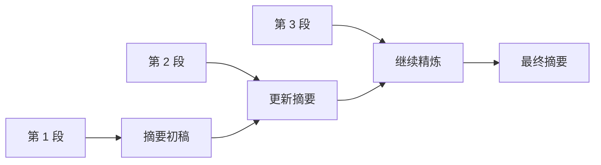
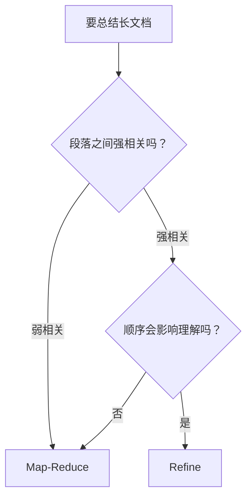
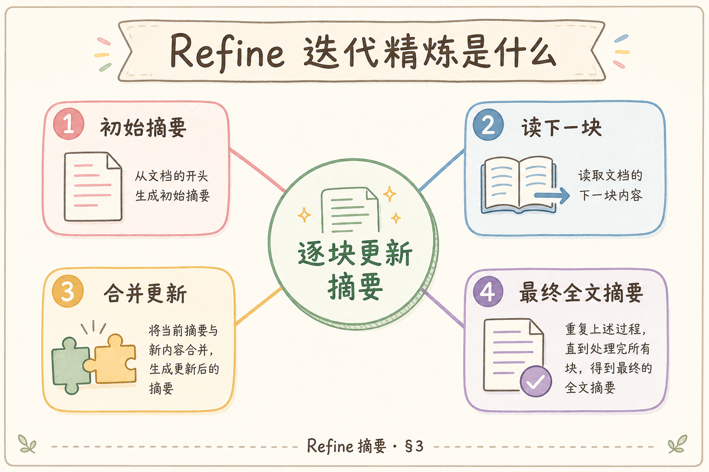
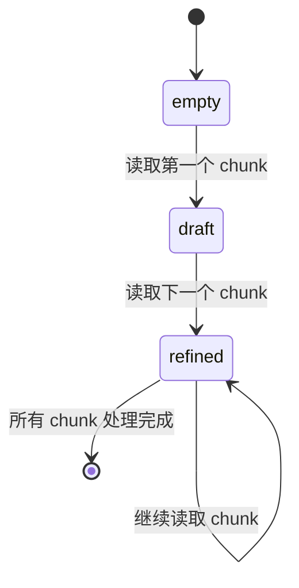
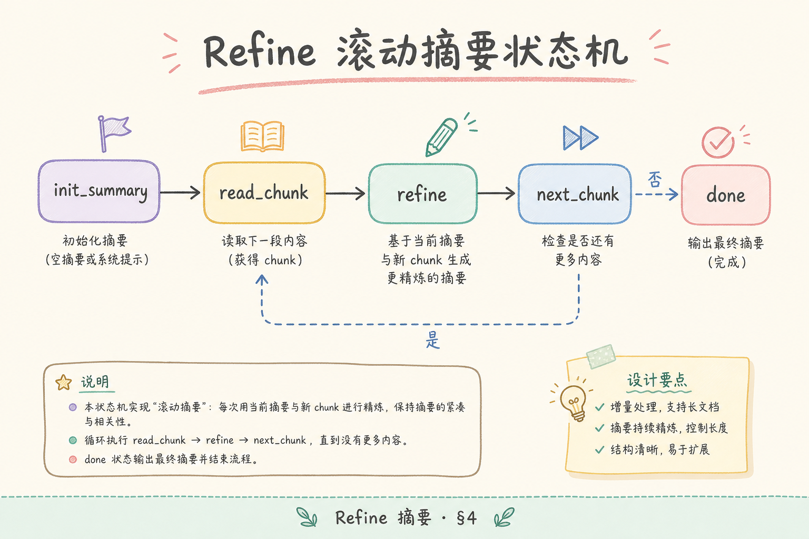
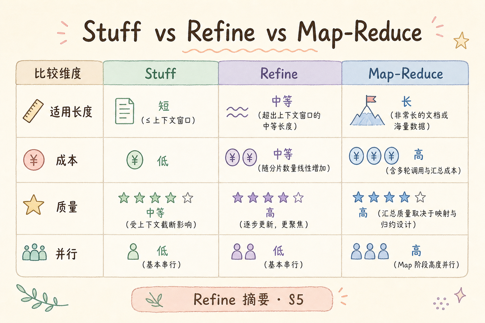

# H 进阶方向（十）：Refine 迭代精炼摘要入门

长文摘要有两种常见思路：一种是把文档切成多段并行摘要，最后合并；另一种是按顺序读每一段，不断更新一份“当前摘要”。后者就是 **Refine**（迭代精炼）：先生成初稿，再把新材料一段段喂进去，让摘要逐步变完整。

本文面向已经了解 Map-Reduce 摘要的初学者。读完后，你应该能说清 Refine 适合什么文档、解决什么问题、如何写最小实现，以及如何避免摘要越滚越长。

## 目录

- [1. Refine 解决什么问题](#1-refine-解决什么问题)
- [2. Refine 与 Map-Reduce 的区别](#2-refine-与-map-reduce-的区别)
- [3. Refine 的滚动状态机](#3-refine-的滚动状态机)
- [4. Prompt 设计：保留、更新、删减](#4-prompt-设计保留更新删减)
- [5. 最小 Python 实现](#5-最小-python-实现)
- [6. 在 RAG 中怎么用](#6-在-rag-中怎么用)
- [7. 质量控制与熔断](#7-质量控制与熔断)
- [8. 常见错误](#8-常见错误)
- [9. FAQ](#9-faq)
- [10. 总结](#10-总结)

## 1. Refine 解决什么问题

Refine 适合处理“后文会修正前文”的长文档。例如季度复盘、会议纪要、合同修订记录、产品路线图。读这些资料时，人不是把每页单独总结完再机械合并，而是边读边更新理解。



这张图里最重要的是“摘要本身是状态”。每读一个新片段，模型都要判断：哪些旧内容保留，哪些内容更新，哪些细节删掉。

## 2. Refine 与 Map-Reduce 的区别

**Map-Reduce 摘要**先让每个 chunk 独立生成小摘要，再把小摘要汇总。它快，适合并行，但容易丢掉跨段叙事。

**Refine 摘要**按顺序处理 chunk，每一步都拿“当前摘要 + 新 chunk”生成下一版摘要。它慢一些，但更适合有时间顺序或因果推进的材料。

| 维度 | Map-Reduce | Refine |
| --- | --- | --- |
| 处理方式 | 多段并行，再合并 | 一段段顺序更新 |
| 速度 | 快 | 较慢 |
| 适合文档 | 章节相对独立 | 前后有关联、会修订 |
| 主要风险 | 合并时重复或断裂 | 摘要越滚越长、早期错误累积 |

可以先用这个判断：



## 3. Refine 的滚动状态机

**状态机**可以理解为“系统在不同状态之间按规则切换”。Refine 的状态就是当前摘要。

一次 Refine 过程通常有三个状态：

1. `empty`：还没有摘要。
2. `draft`：根据第一段生成初稿。
3. `refined`：根据新片段不断更新摘要。





把 Refine 看成状态机有一个好处：你会自然想到保存中间结果。长任务失败时，可以从最近一次 refined 摘要继续，而不必从头跑。

## 4. Prompt 设计：保留、更新、删减

Refine Prompt 的核心不是“请继续总结”，而是明确告诉模型怎么处理旧摘要和新材料。



一个实用模板：

```text
你正在维护一份长文档摘要。

当前摘要：
{current_summary}

新材料：
{new_chunk}

请输出更新后的摘要，要求：
1. 保留当前摘要中仍然正确的重要结论。
2. 用新材料修正过时或不准确的内容。
3. 删除重复细节，控制在 300 字以内。
4. 不要加入新材料没有支持的推测。
```

这里有三个关键词：

| 动作 | 作用 |
| --- | --- |
| 保留 | 不要因为看了新 chunk 就忘掉前文 |
| 更新 | 后文修正前文时要改摘要 |
| 删减 | 防止摘要每轮都变长 |

没有“删减”约束时，Refine 很容易把每段内容都累加进去，最后变成长文复述。

## 5. 最小 Python 实现

下面代码用一个假的 `call_llm()` 模拟模型调用，重点展示 Refine 流程。真实项目只需要把它替换成你的 LLMClient。

```python
def call_llm(prompt: str) -> str:
    lines = [line.strip() for line in prompt.splitlines() if line.strip()]
    return " / ".join(lines[-3:])[:300]


def refine_summary(chunks: list[str]) -> str:
    summary = ""
    for index, chunk in enumerate(chunks, start=1):
        if not summary:
            prompt = f"请把下面材料总结成 200 字以内摘要：\n{chunk}"
        else:
            prompt = f"""
你正在维护一份长文档摘要。

当前摘要：
{summary}

新材料：
{chunk}

请输出更新后的摘要，保留重要结论，修正过时内容，删除重复细节。
"""
        summary = call_llm(prompt)
        print(f"step={index}, summary={summary}")
    return summary


chunks = [
    "第一季度客户增长快，但客服工单也明显增加。",
    "第二季度上线自助知识库后，重复工单下降 35%。",
    "第三季度重点变成提升企业客户续费率。",
]

final_summary = refine_summary(chunks)
print("最终摘要：", final_summary)
```

这个示例不是为了生成高质量摘要，而是让你看清控制流：每一轮都把上一轮摘要和当前 chunk 一起交给模型。

## 6. 在 RAG 中怎么用

Refine 可以用于 RAG 的两个位置：

| 位置 | 用法 |
| --- | --- |
| 离线索引阶段 | 为长文档生成文档级摘要，存入 metadata |
| 在线回答阶段 | 对多个检索片段按顺序合成更连贯答案 |

在线阶段要谨慎，因为 Refine 是串行的，延迟会随 chunk 数增加。更常见的做法是：离线用 Refine 生成高质量摘要，在线检索时把摘要作为辅助字段。





这样既利用了 Refine 的叙事优势，又不会让用户等待太久。

## 7. 质量控制与熔断

**熔断**是指发现过程已经不可靠时主动停止，避免继续扩大错误。Refine 的错误会累积，所以要设置检查点。

建议至少监控四件事：

| 检查项 | 风险信号 |
| --- | --- |
| 摘要长度 | 每轮都变长，超过限制 |
| 事实一致性 | 摘要出现新材料没有支持的结论 |
| 重复率 | 同一句话反复出现 |
| 失败次数 | LLM 调用连续失败 |

如果摘要连续膨胀，可以每隔几轮做一次压缩：

```python
def compress_summary(summary: str) -> str:
    prompt = f"把下面摘要压缩到 200 字以内，只保留结论和数字：\n{summary}"
    return call_llm(prompt)
```

压缩不是为了省字数而省字数，而是防止滚动状态变得太臃肿，影响后续判断。

## 8. 常见错误

这一节列出 Refine 摘要最常见的失败模式。它们大多来自“让模型无约束地滚动更新”。

### 8.1 没有长度上限

每一轮都追加新信息，最终摘要会接近原文长度。Prompt 里必须写清字数、保留优先级和删减规则。

### 8.2 文档顺序随意打乱

Refine 依赖顺序。如果合同修订记录、时间线材料被打乱，摘要会产生错误叙事。

### 8.3 早期错误一直累积

第一轮摘要如果理解错，后面可能一直沿用。建议保存中间摘要，并抽检关键节点。

### 8.4 在线请求处理过多 chunk

在线 Refine 会增加延迟。用户交互场景应限制 chunk 数，或把 Refine 放到离线阶段。

### 8.5 不和 Map-Reduce 做对照

Refine 不是永远更好。章节独立、可并行的材料，用 Map-Reduce 可能更快更稳定。

## 9. FAQ

**Q1：Refine 一定比 Map-Reduce 准吗？**  
不一定。Refine 更擅长顺序叙事，Map-Reduce 更擅长并行处理独立片段。要用测试集比较。

**Q2：Refine 能不能并行？**  
标准 Refine 是串行的。可以先分组 Map-Reduce，再对组摘要做 Refine，这叫混合流水线。

**Q3：每轮都要保留 source 吗？**  
建议保留。至少保存当前摘要来自哪些 chunk，方便追溯错误。

**Q4：摘要长度怎么定？**  
看用途。作为文档 metadata 可以短一些；作为管理层报告可以长一些。但无论多长，都要有明确上限。

## 10. 总结

Refine 的核心是“带着当前摘要继续读新材料”。它适合前后关联强、顺序重要、后文会修正前文的长文档。

初学者先记住四点：

1. Refine 是串行更新，不是并行合并。
2. Prompt 必须明确保留、更新和删减规则。
3. 中间摘要要可保存、可抽检、可恢复。
4. 在线场景要控制 chunk 数，避免延迟过高。

当你能解释为什么某篇文档适合 Refine，而不是只因为“它听起来高级”才使用它，摘要链路就更可靠。
