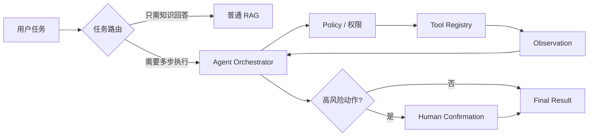

# AI Agent 工程（一）：从 RAG 走向 Agent

> [201 Agentic RAG](201.agentic-rag-tutorial.md) 已经介绍了“检索 + 工具 + 决策循环”的基本概念。这篇正式开启 AI Agent 工程系列，重点回答一个更基础的问题：现有 RAG 系统要增加哪些能力，才会成为一个可控的任务执行系统？

---

## 目录

1. [你会学到什么](#你会学到什么)
2. [它解决什么问题](#它解决什么问题)
3. [最小示例](#最小示例)
4. [工程化版本](#工程化版本)
5. [常见失败模式](#常见失败模式)
6. [什么时候不要这么做](#什么时候不要这么做)
7. [生产环境注意事项](#生产环境注意事项)
8. [如何观测和评测](#如何观测和评测)
9. [和 RAG 后端前端的关系](#和-rag--后端--前端的关系)
10. [面试怎么讲](#面试怎么讲)
11. [下一步](#下一步)

## 你会学到什么

学完这篇，你应该能：

- 解释普通 RAG、Agentic RAG 和业务 Agent 的边界。
- 识别一个 RAG 系统升级为 Agent 时新增的组件。
- 区分“模型建议调用工具”和“系统真正执行工具”。
- 为最小 Agent 加入工具白名单、步骤限制和执行轨迹。
- 判断一个需求是否值得承担 Agent 带来的成本和风险。

先记住这句话：

> RAG 是 Agent 的知识获取能力之一；Agent 在 RAG 之上增加任务判断、工具调用、流程控制、人类确认和执行轨迹。

## 它解决什么问题

普通 RAG 的典型链路是：

```text
问题 → 检索 → 拼接上下文 → 生成答案
```

它很适合回答“制度里怎么写”“某个参数是什么意思”。但用户经常提出任务型需求：

- “查一下客户套餐和权限，解释为什么看不到报表。”
- “对比三份制度，列出冲突条款，并创建一个复核任务。”
- “先检查知识库是否有答案，没有再查询工单系统。”
- “生成退款建议，金额超过 500 元时让我确认。”

这些需求不只是“找到资料并回答”，还包含判断、分步执行、工具调用和风险控制。

| 能力 | 普通 RAG | Agent 系统 |
|---|---|---|
| 获取知识 | 检索一次或固定次数 | 根据任务动态选择检索 |
| 调用工具 | 通常没有 | 从白名单中选择工具 |
| 执行状态 | 一次请求内的临时变量 | 显式记录步骤、证据和停止原因 |
| 风险控制 | 引用和拒答 | 权限、审批、幂等和审计 |
| 输出 | 答案 | 答案、建议、任务结果或待确认动作 |

关键变化不是“让模型多思考几次”，而是让系统拥有一个受约束的执行循环。



## 最小示例

下面的例子故意不依赖某个 Agent 框架，只展示 RAG 函数和 Agent 编排函数的差别。

```python
from dataclasses import dataclass, field
from typing import Any


def retrieve(query: str) -> list[str]:
    return [f"与 {query!r} 相关的制度片段"]


def generate_answer(task: str, evidence: list[str]) -> str:
    joined = "\n".join(evidence)
    return f"任务：{task}\n证据：\n{joined}"


def needs_retrieval(task: str) -> bool:
    return any(word in task for word in ("制度", "文档", "知识库", "规定"))


def needs_tool(task: str) -> bool:
    return any(word in task for word in ("套餐", "权限", "工单", "日志"))


def query_customer_plan(task: str) -> dict[str, Any]:
    return {"plan": "enterprise", "report_enabled": False}


def answer_with_rag(question: str) -> str:
    docs = retrieve(question)
    return generate_answer(question, docs)


@dataclass
class AgentState:
    task: str
    evidence: list[str] = field(default_factory=list)
    steps: list[dict[str, Any]] = field(default_factory=list)


def agent_answer(task: str) -> str:
    state = AgentState(task=task)

    if needs_retrieval(task):
        docs = retrieve(task)
        state.evidence.extend(docs)
        state.steps.append({"tool": "retrieve", "ok": True})

    if needs_tool(task):
        tool_result = query_customer_plan(task)
        state.evidence.append(f"客户套餐：{tool_result}")
        state.steps.append({"tool": "query_customer_plan", "ok": True})

    return generate_answer(task, state.evidence)
```

这个版本已经体现三个差别：

1. Agent 会根据任务决定是否检索或调用工具。
2. 每个工具结果会被转换成 evidence。
3. 每一步会记录到 state，便于追踪。

但它还不能直接上线，因为没有参数校验、权限检查、超时、最大步骤数和人工确认。

## 工程化版本

工程化 Agent 应该把模型、编排器、工具和权限分开。

```python
from dataclasses import dataclass
from typing import Callable


@dataclass(frozen=True)
class ToolContext:
    user_id: str
    roles: tuple[str, ...]
    trace_id: str


@dataclass(frozen=True)
class ToolResult:
    ok: bool
    data: dict
    error: str | None = None


ToolHandler = Callable[[dict, ToolContext], ToolResult]


class ToolRegistry:
    def __init__(self) -> None:
        self._handlers: dict[str, ToolHandler] = {}

    def register(self, name: str, handler: ToolHandler) -> None:
        self._handlers[name] = handler

    def execute(
        self,
        name: str,
        arguments: dict,
        context: ToolContext,
    ) -> ToolResult:
        if name not in self._handlers:
            return ToolResult(ok=False, data={}, error="tool_not_allowed")
        return self._handlers[name](arguments, context)
```

编排器的职责不是实现业务逻辑，而是管理执行边界：

| 边界 | 编排器要做什么 |
|---|---|
| 工具范围 | 只暴露当前用户允许的工具 |
| 参数 | 在执行前完成 schema 校验 |
| 步数 | 设置 `max_steps`，每步都递增 |
| 时间 | 为模型和工具设置超时 |
| 风险 | 写操作进入人工确认 |
| 状态 | 保存 goal、steps、evidence、stop_reason |
| 观测 | 为每次模型调用和工具调用记录 trace |

推荐先做“只读 Agent”：只能搜索知识库、查询配置、读取工单。等轨迹和权限模型稳定后，再增加创建工单、修改状态等写操作。

## 常见失败模式

### 把 Prompt 当权限系统

“请不要调用危险工具”只是自然语言提示，不是安全边界。真正的权限必须由工具注册表和后端 Policy 决定。

### 把所有 API 都暴露给模型

工具越多，选择越难，误调用概率和 token 成本也越高。应该按任务和用户权限动态生成工具白名单。

### 没有显式状态

如果只保留聊天消息，就很难回答：

- 当前目标是什么？
- 已经尝试过哪些工具？
- 哪些证据已经验证？
- 为什么停止？

### 没有停止条件

模型可能反复检索同一问题，或者在工具失败后不断重试。最小版本至少要有最大步数、连续失败阈值和任务完成条件。

### 过早加入写操作

读取错误通常影响回答质量，写入错误可能直接修改业务数据。写工具必须晚于只读工具，并加入审批和幂等键。

## 什么时候不要这么做

以下需求通常不需要 Agent：

1. 固定输入对应固定查询和固定输出，可以直接写普通 API。
2. 流程步骤确定，可以用状态机或 Workflow 明确表达。
3. 只需要一次检索和一次回答，普通 RAG 更便宜、更容易评测。
4. 无法记录工具调用、权限决策和中间状态。
5. 高风险动作没有人工确认或回滚机制。
6. 延迟预算只允许一次模型调用。

判断标准不是“Agent 能不能做”，而是“Agent 是否比确定性代码更合适”。

## 生产环境注意事项

生产 Agent 最少需要这些约束：

```text
allowed_tools
max_steps
tool_timeout
model_timeout
consecutive_failure_limit
approval_required_actions
idempotency_key
trace_id
stop_reason
```

还要考虑并发：同一个用户重复提交任务时，是复用已有任务、创建新任务，还是拒绝重复请求？如果工具会写数据，必须用幂等键避免双写。

不要把完整数据库记录直接放进模型上下文。工具层应该做字段裁剪、脱敏和行级权限过滤。

## 如何观测和评测

一次 Agent 执行建议记录：

```json
{
  "trace_id": "agent-20260722-001",
  "goal": "解释客户无法查看高级报表的原因",
  "steps": [
    {
      "index": 1,
      "tool": "query_customer_plan",
      "ok": true,
      "latency_ms": 83
    }
  ],
  "stop_reason": "completed",
  "total_tokens": 1820,
  "total_latency_ms": 1460
}
```

首批指标不需要复杂：

| 指标 | 含义 |
|---|---|
| 任务完成率 | 是否真正完成用户目标 |
| 工具选择准确率 | 是否选择了正确工具 |
| 参数有效率 | 工具参数是否通过校验 |
| 平均步骤数 | 是否存在过度规划 |
| 人工接管率 | 哪些任务经常需要人工处理 |
| 单任务成本 | 模型与工具总成本 |
| P95 延迟 | 最慢 5% 的任务体验 |

评测时必须看轨迹，不能只看最终答案。最终答案碰巧正确，不代表中间执行是安全的。

## 和 RAG / 后端 / 前端的关系

- **RAG**：作为 `search_knowledge_base` 工具，为 Agent 提供证据。
- **后端**：负责工具实现、权限、状态持久化、任务队列和审计。
- **前端**：展示步骤状态、工具结果、引用、人工确认和停止原因。

一个稳妥的职责分配是：

```text
模型负责建议下一步
编排器负责决定能不能执行
工具负责执行业务动作
前端负责让用户看见并确认关键动作
```

## 面试怎么讲

可以这样回答：

> 我不会把 Agent 理解成“多轮调用模型”。普通 RAG 解决知识回答，Agent 在它之上增加工具选择、状态管理和受控执行。生产实现中，模型只提出工具调用建议，真正的参数校验、权限、超时、幂等、审批和审计由后端编排器完成。我会先做只读工具，并用最大步数和停止条件约束执行循环。

如果面试官追问“什么时候不用 Agent”，要主动回答：固定流程用 Workflow，单次问答用普通 RAG，结构化规则用普通代码。

## 下一步

下一篇 [215 Agent、RAG 与 Workflow 的边界](215.agent-vs-rag-vs-workflow-tutorial.md) 会建立一套选型方法，帮助你在需求评审阶段就判断应该使用哪种形态。
