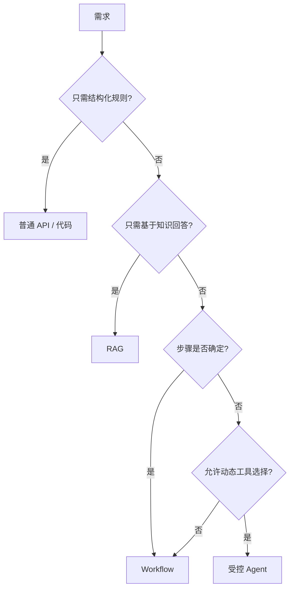

# AI Agent 工程（二）：Agent、RAG 与 Workflow 怎么选

> 上一篇把 RAG 升级为 Agent 所需的组件拆开了。这篇进一步建立选型框架：同一个需求，什么时候写普通 API，什么时候用 RAG，什么时候用 Workflow，什么时候才需要 Agent？

---

## 你会学到什么

- 区分 Chatbot、RAG、Workflow 和 Agent 的职责。
- 用“任务确定性”和“动作风险”选择实现方式。
- 识别把固定流程包装成 Agent 的过度设计。
- 设计“确定性外壳 + Agent 决策点”的混合架构。

## 它解决什么问题

团队在接触 Agent 后容易出现两个极端：

1. 所有需求都想让模型自动规划。
2. 因为担心不可控，所有步骤都写死。

更实际的做法是按不确定性拆分：确定的部分交给代码和 Workflow，不确定的理解、路由和信息整理由模型辅助。

| 形态 | 核心能力 | 适合场景 | 主要风险 |
|---|---|---|---|
| Chatbot | 对话生成 | FAQ、陪伴式问答 | 无法稳定执行动作 |
| RAG | 基于知识回答 | 企业知识库、文档问答 | 检索失败和引用错误 |
| Workflow | 固定流程执行 | 审批、工单、批处理 | 灵活性低 |
| Agent | 动态规划与工具调用 | 多步骤任务、半结构化任务 | 不可控、成本高、权限风险 |

还可以增加一个经常被忽略的选项：普通业务代码。

| 需求 | 首选 |
|---|---|
| 根据订单号查询状态 | 普通 API |
| 根据制度回答报销标准 | RAG |
| 退款必须经过固定三级审批 | Workflow |
| 根据客户问题动态查套餐、日志和工单 | Agent |

## 最小示例

可以用两个维度做第一轮判断：

- **步骤是否确定**：能不能在开发前写出完整流程？
- **是否需要动作**：系统只回答，还是要调用业务工具？

```python
from enum import StrEnum


class Solution(StrEnum):
    API = "api"
    RAG = "rag"
    WORKFLOW = "workflow"
    AGENT = "agent"


def choose_solution(
    *,
    needs_external_knowledge: bool,
    needs_action: bool,
    steps_are_deterministic: bool,
) -> Solution:
    if not needs_external_knowledge and not needs_action:
        return Solution.API

    if needs_external_knowledge and not needs_action:
        return Solution.RAG

    if needs_action and steps_are_deterministic:
        return Solution.WORKFLOW

    return Solution.AGENT
```

这不是最终架构，但能阻止“看到 LLM 就上 Agent”的冲动。



## 工程化版本

真实系统常常不是四选一，而是组合：

```text
确定性 Workflow
  ├─ Agent 节点：理解任务、生成计划候选
  ├─ RAG 节点：获取证据
  ├─ API 节点：执行确定动作
  └─ Human 节点：批准高风险操作
```

例如退款处理：

1. API 校验订单和用户身份。
2. RAG 查询退款政策。
3. Agent 根据订单、政策和历史沟通生成处理建议。
4. Workflow 根据金额走固定审批。
5. 人工批准后，API 执行退款。

这里 Agent 没有直接退款权限。它负责处理半结构化信息，Workflow 负责流程，API 负责动作。

```python
def refund_process(request: RefundRequest) -> RefundResult:
    order = order_api.get(request.order_id)
    policy = policy_rag.search(order.region, request.reason)
    proposal = agent.propose_refund(order, policy, request.message)

    if proposal.amount > 500:
        approval_id = workflow.request_human_approval(proposal)
        return RefundResult.pending(approval_id)

    return refund_api.execute(
        order_id=order.id,
        amount=proposal.amount,
        idempotency_key=request.request_id,
    )
```

工程原则是：让模型出现在真正需要语义判断的位置，而不是替代所有确定性逻辑。

## 常见失败模式

### 把 Workflow 叫成 Agent

如果流程永远是 A → B → C，只是在 B 调了一次模型，这更接近 AI Workflow，不需要宣称是自主 Agent。

### 让 Agent 决定权限

权限不是语义问题，而是确定性安全规则。模型可以解释为什么没有权限，但不能决定自己是否有权限。

### 用 Agent 做数据库字段映射

固定枚举和字段转换应该用代码。模型输出会引入不必要的不确定性。

### 为了灵活性牺牲可测试性

如果没有明确输入、状态、工具白名单和完成条件，所谓灵活最终会变成难以复现。

## 什么时候不要这么做

以下情况优先不用 Agent：

1. 步骤和分支在开发前就能完整列出。
2. 错误动作不可逆，并且没有人工确认。
3. 业务要求同一输入始终产生同一输出。
4. 每次请求的延迟或成本预算很低。
5. 没有工具级权限和审计能力。
6. 任务可以用一个数据库查询或普通 API 完成。

也不要为了“架构统一”把所有旧 Workflow 改成 Agent。只有存在真实语义不确定性的节点才值得引入模型。

## 生产环境注意事项

在架构评审中，为每个模型节点填写：

| 问题 | 示例答案 |
|---|---|
| 为什么必须用模型？ | 用户描述非结构化，需要识别意图 |
| 模型能调用什么？ | 只读套餐、日志、工单工具 |
| 谁校验权限？ | 后端 Policy Service |
| 如何停止？ | 最多 6 步，连续失败 2 次停止 |
| 错了如何恢复？ | 不执行写操作，转人工 |
| 如何评测？ | 意图分类、工具选择和任务完成率 |

如果团队无法回答这些问题，Agent 方案还没有达到上线标准。

## 如何观测和评测

不同形态的评测重点不同：

| 形态 | 关键指标 |
|---|---|
| API | 正确率、错误率、延迟 |
| RAG | Recall、Faithfulness、引用准确率 |
| Workflow | 节点成功率、流程完成率、补偿成功率 |
| Agent | 任务完成率、工具准确率、轨迹质量、成本、人工接管率 |

架构选型也应该被评测。可以拿同一批任务分别实现“固定 Workflow”和“Agent 版本”，比较：

- 完成率是否真的提高？
- 平均步骤和 token 是否可接受？
- 新增失败类型有哪些？
- 人工处理时间是否下降？

## 和 RAG / 后端 / 前端的关系

- RAG 是知识访问能力，可以被 Workflow 或 Agent 调用。
- 后端 Workflow 决定固定顺序、重试和补偿。
- Agent 在少数节点处理语义判断和动态工具选择。
- 前端需要区分“回答中”“执行中”“等待确认”“失败待处理”。

前端不要把所有状态都显示成一个加载动画。用户需要知道系统是在检索、调用工具，还是等待自己确认。

## 面试怎么讲

> 我不会把 Agent 当默认架构。只需知识回答时用 RAG，步骤固定时用 Workflow，结构化规则用普通代码。只有任务需要根据中间结果动态选择工具时才使用 Agent。生产系统通常是混合架构：Workflow 提供确定性外壳，Agent 处理语义决策，API 执行动作，高风险节点由人确认。

这个回答能体现你关注的是工程边界，而不是框架名。

## 下一步

下一篇 [216 什么时候不要使用 Agent](216.when-not-to-use-agent-tutorial.md) 会用反例和评审清单进一步收紧 Agent 的使用边界。
