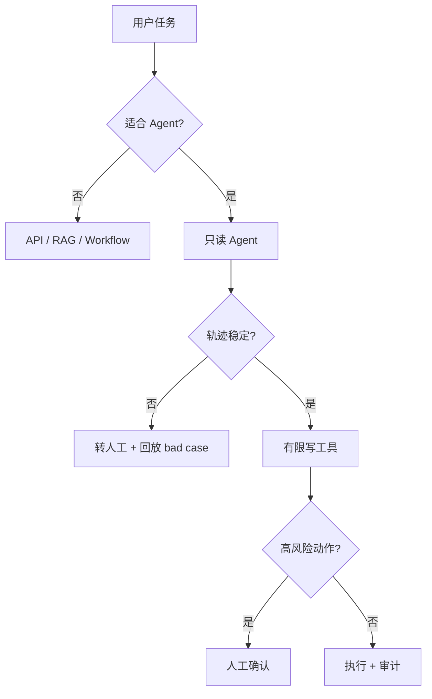

# AI Agent 工程（三）：什么时候不要使用 Agent

> Agent 的能力越强，失败空间也越大。一个成熟的 Agent 工程师不仅会实现 Agent，也会在不合适的需求中明确拒绝 Agent 方案。

---

## 你会学到什么

- 识别不适合 Agent 的六类需求。
- 理解确定性、风险、成本和可观测性如何影响选型。
- 用一套评审问题阻止 Agent 过度设计。
- 把不合适的 Agent 方案改造成 API、RAG 或 Workflow。

## 它解决什么问题

Agent demo 往往只展示成功路径：模型理解目标、正确选择工具、一次完成任务。但生产系统还必须面对：

- 模型选错工具。
- 参数结构正确但业务含义错误。
- 工具成功执行了错误动作。
- 循环没有停止。
- 同一个写操作执行两次。
- 用户无法理解系统为什么这样做。

如果需求本来可以用确定性代码完成，引入这些风险没有收益。

## 不该使用 Agent 的场景

1. 规则稳定、流程固定，用普通 Workflow 更清晰。
2. 输入输出完全结构化，用普通 API 更可靠。
3. 操作风险高但没有人工确认机制。
4. 无法记录工具调用和中间步骤。
5. 成本或延迟预算很紧。

还应该补充第六类：系统没有明确的权限边界，模型能接触超出用户权限的数据或动作。

## 最小示例

假设需求是“订单发货后 7 天自动确认收货”。这是典型确定性规则：

```python
from datetime import datetime, timedelta


def should_auto_confirm(
    shipped_at: datetime,
    now: datetime,
    has_open_dispute: bool,
) -> bool:
    return (
        not has_open_dispute
        and now >= shipped_at + timedelta(days=7)
    )
```

如果改成 Agent：

```text
读取订单 → 理解是否应该确认 → 调用确认工具
```

不仅更贵，还可能因为语言理解、上下文缺失或工具重试产生错误。这里普通代码更好。

再看一个适合 Agent 的对照需求：

```text
阅读客户最近三轮沟通、订单异常和售后政策，
判断应该解释、补偿还是升级人工，并给出证据。
```

它包含非结构化文本、多个信息源和动态判断，可以考虑 Agent，但最终补偿动作仍应进入 Workflow 和人工审批。

## 工程化版本

可以在需求评审阶段计算一个简单的 Agent Suitability Score。它不是数学真理，而是迫使团队公开讨论风险。

```python
from dataclasses import dataclass


@dataclass(frozen=True)
class AgentAssessment:
    semantic_uncertainty: int       # 0-2
    dynamic_tool_selection: int     # 0-2
    multi_step_reasoning: int       # 0-2
    action_risk: int                # 0-2，越高越不适合自主执行
    observability_ready: bool
    human_approval_ready: bool


def agent_suitability(value: AgentAssessment) -> int:
    benefit = (
        value.semantic_uncertainty
        + value.dynamic_tool_selection
        + value.multi_step_reasoning
    )
    risk_penalty = value.action_risk * 2

    if not value.observability_ready:
        risk_penalty += 3
    if value.action_risk > 0 and not value.human_approval_ready:
        risk_penalty += 3

    return benefit - risk_penalty
```

建议解释：

| 分数 | 建议 |
|---|---|
| 小于等于 0 | 优先 API、RAG 或固定 Workflow |
| 1–2 | 只在局部节点使用模型 |
| 3–4 | 可以做只读 Agent PoC |
| 5 以上 | 仍需完成权限、停止条件和评测设计 |

即使分数高，也不代表可以绕过安全评审。

## 常见失败模式

### “模型很聪明，所以让它判断”

聪明不等于稳定。业务规则可以编码时，确定性代码更容易测试、审计和回滚。

### 把成本只理解成 token

真正成本还包括轨迹存储、工具适配、评测集、人工复核、事故处理和长期框架升级。

### 把人工确认当万能保险

如果每一步都需要人确认，用户会产生审批疲劳。应该减少高风险工具，而不是无限增加弹窗。

### PoC 成功就直接上线

十个演示问题成功，不能说明在真实长尾输入、并发、超时和权限组合下可靠。

### 用最终答案掩盖错误轨迹

Agent 可能经过危险或无意义的步骤，最后碰巧得到正确答案。生产评测必须检查中间轨迹。

## 什么时候不要这么做

不要使用 Agent，或者只允许 Agent 生成建议，如果：

- 业务规则能用短小、稳定的代码表示。
- 流程分支有限且可以提前穷举。
- 动作不可逆且没有补偿机制。
- 当前系统没有用户权限、租户隔离和审计日志。
- 团队没有 Agent 轨迹评测能力。
- 请求必须在极低延迟内返回。
- 数据高度敏感，工具层还不能完成字段裁剪和脱敏。
- 失败后无法安全转人工。

不要因为竞品使用 Agent 就复制架构。应该比较任务完成率、总成本和事故风险。

## 生产环境注意事项

如果评审后仍决定使用 Agent，先设定降级路径：



上线顺序建议：

1. 影子模式：Agent 只生成计划，不执行。
2. 只读模式：可以查询但不能写。
3. 建议模式：生成动作建议，由人执行。
4. 审批模式：低风险自动、高风险确认。
5. 有限自主：仅对白名单任务开放。

## 如何观测和评测

评测“不该使用 Agent”同样重要。维护一组反例任务：

```json
{
  "task": "根据订单状态字段返回中文状态",
  "expected_solution": "api",
  "forbidden_tools": ["llm_planner", "web_search"],
  "reason": "完全结构化映射"
}
```

建议指标：

- Agent 使用拒绝准确率：该不用 Agent 时是否正确降级。
- 不必要模型调用率。
- 不必要工具调用率。
- 人工审批取消率：用户是否频繁否决 Agent 动作。
- Agent 版本相对 Workflow 的净收益。

## 和 RAG / 后端 / 前端的关系

- RAG 可以作为低风险降级方案：回答资料问题，不执行动作。
- 后端应提供确定性规则和 Workflow，不把所有判断推给模型。
- 前端要明确标记“AI 建议”和“已执行动作”，不能混淆。
- 人工处理界面要展示证据、计划和即将执行的具体参数。

## 面试怎么讲

> 我会先判断语义不确定性、是否需要动态工具选择、动作风险和可观测准备度。固定规则用代码，固定流程用 Workflow，只需知识回答用 RAG。Agent 更适合中间步骤无法预先穷举、需要根据 observation 动态选择工具的任务。即使使用 Agent，我也会先从影子模式和只读工具开始。

这种回答比“我们用了某个 Agent 框架”更能体现工程判断。

## 下一步

下一篇 [217 企业级 Agent 架构总览](217.enterprise-agent-architecture-overview-tutorial.md) 会把路由、编排器、工具、记忆、审批、权限和观测放进一张完整架构图。
