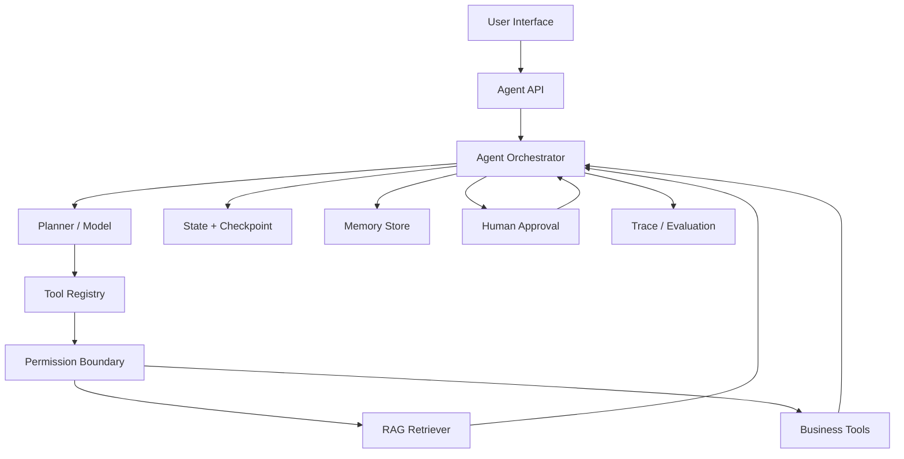
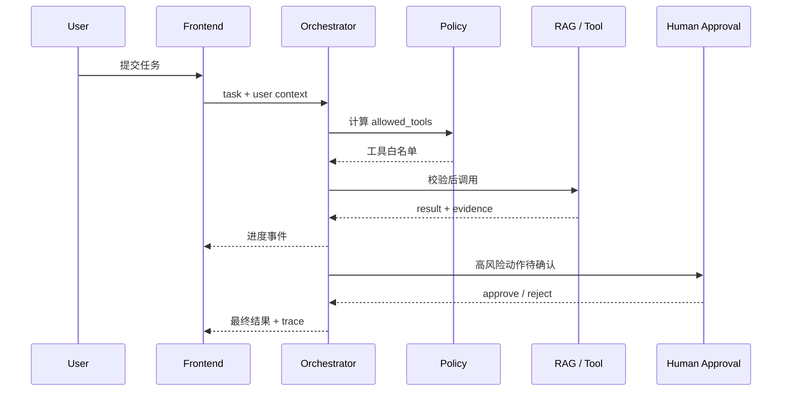

# AI Agent 工程（四）：企业级 Agent 架构总览

> 前三篇解决了 Agent 的定位和使用边界。这篇建立后续系列共同使用的参考架构：每个模块做什么、状态如何流动、风险在哪里拦截。

---

## 你会学到什么

- 认识企业 Agent 的九个核心组件。
- 理解模型、编排器、工具和权限的职责边界。
- 设计从请求到结果的状态流。
- 为人类确认、Checkpoint、Trace 和评测预留接口。

## 它解决什么问题

最小 Agent demo 往往只有：

```text
用户 → 模型 → 工具 → 模型 → 答案
```

企业系统还要回答：

- 当前用户能使用哪些工具？
- 工具参数由谁校验？
- 任务中断后如何恢复？
- 写操作由谁批准？
- 如何避免重复执行？
- 如何保存证据和引用？
- 如何回放一次失败轨迹？

因此需要把“模型调用”放进完整系统，而不是让模型成为系统本身。

## 最小示例

企业 Agent 的核心组件可以先记住这九个名字：

```text
User Interface
Agent Orchestrator
Planner
Tool Registry
RAG Retriever
Memory Store
Human Approval
Trace / Evaluation
Permission Boundary
```



最小状态结构：

```python
from dataclasses import dataclass, field
from typing import Any, Literal


StopReason = Literal[
    "completed",
    "need_approval",
    "permission_denied",
    "max_steps",
    "tool_failure",
]


@dataclass
class AgentState:
    task_id: str
    user_id: str
    goal: str
    allowed_tools: list[str]
    steps: list[dict[str, Any]] = field(default_factory=list)
    evidence: list[dict[str, Any]] = field(default_factory=list)
    pending_approval: dict[str, Any] | None = None
    stop_reason: StopReason | None = None
```

## 工程化版本

### User Interface

前端不只是聊天框，还要展示：

- 当前执行状态。
- 已调用工具及其安全摘要。
- 来源引用。
- 待确认动作和参数。
- 取消任务入口。
- 失败后的重试或转人工入口。

### Agent Orchestrator

编排器是系统核心，负责：

1. 加载用户和租户上下文。
2. 构建允许工具列表。
3. 调用 Planner 获取下一步建议。
4. 校验并执行工具。
5. 更新状态和 Checkpoint。
6. 判断完成、失败或等待确认。
7. 写入 Trace。

### Planner

Planner 可以由模型实现，但它只负责提出计划或下一步，不应该直接访问数据库、Secret 或业务服务。

### Tool Registry

工具注册表保存名称、描述、输入 schema、风险等级和 handler。

```python
from dataclasses import dataclass
from typing import Callable, Literal


RiskLevel = Literal["read", "write", "critical"]


@dataclass(frozen=True)
class ToolDefinition:
    name: str
    description: str
    risk: RiskLevel
    required_permission: str
    handler: Callable
```

### Permission Boundary

权限层必须在工具执行前运行，并继承当前用户和租户权限。Agent 不能因为使用系统账号就获得更高权限。

### RAG Retriever

RAG 作为工具提供知识证据，并返回可验证的 chunk_id、source、page 和 score，而不是只返回一段无来源文本。

### Memory Store

Memory 保存用户偏好和历史经验，但不能替代任务状态。任务状态要求一致性和可恢复；长期记忆允许异步写入和后续检索。

### Human Approval

人工确认对象应包含：

```json
{
  "action": "create_refund",
  "arguments": {
    "order_id": "ORD-1001",
    "amount": 680
  },
  "reason": "金额超过自动退款阈值",
  "evidence_ids": ["policy-17", "ticket-91"],
  "expires_at": "2026-07-22T18:00:00+08:00"
}
```

确认后不能让模型重新生成参数，必须执行用户看到并批准的那组参数。

### Trace / Evaluation

Trace 记录真实执行；Evaluation 用规则、数据集或人工标准给轨迹评分。两者不能混为一谈。

## 常见失败模式

### 编排器和工具耦合

如果每增加一个工具都要修改主循环，工具注册表没有真正形成边界。

### 把消息历史当状态数据库

消息适合模型理解，不适合可靠恢复。关键字段应该结构化存储。

### 确认前后参数漂移

用户确认的是 680 元，恢复后模型重新生成 860 元，属于严重安全问题。批准对象必须不可变。

### Trace 只记录模型文本

必须记录工具名、参数摘要、权限结果、耗时、错误、重试和停止原因。

### Memory 和知识库混用

知识库是组织事实，Memory 是用户或任务相关经验。两者的权限、更新和删除策略不同。

## 什么时候不要这么做

不需要一次性建设全部组件。如果当前只是内部只读 PoC，可以暂时简化：

- 不做长期 Memory，只保留任务状态。
- 不做复杂 Planner，只允许一步工具调用。
- 不做 Multi-Agent，只使用一个 Orchestrator。
- 不接写工具，只查询知识库和只读系统。

但不能省略：

- 工具白名单。
- 参数校验。
- 用户权限。
- 最大步骤数。
- Trace。
- 明确停止原因。

## 生产环境注意事项

推荐把运行状态设计成显式状态机：

```text
created
  → running
  → waiting_for_approval
  → running
  → completed

running
  → failed
  → retrying
  → running

running
  → cancelled
```

每次状态转换都要带版本号，避免两个 worker 同时更新同一任务。

持久化时区分：

| 数据 | 保存位置 | 保留策略 |
|---|---|---|
| 任务状态 | 事务数据库 | 按业务审计周期 |
| 工具大结果 | 对象存储 | 按敏感等级 |
| Trace | 可观测平台 | 支持检索和采样 |
| 长期记忆 | 专用 Memory Store | 用户可查看和删除 |
| RAG 文档 | 知识库 / 向量库 | 按文档生命周期 |

## 如何观测和评测

建议每个组件都有自己的指标：

| 组件 | 指标 |
|---|---|
| API | 请求量、鉴权失败、取消率 |
| Orchestrator | 完成率、平均步骤、停止原因 |
| Planner | 计划合法率、工具选择准确率 |
| Tool | 成功率、P95 延迟、重试率 |
| Permission | deny 率、越权拦截数 |
| Approval | 等待时长、批准率、参数修改率 |
| RAG | Recall、引用准确率、无结果率 |
| Memory | 写入率、命中率、删除请求完成率 |

回放一次任务时，应能从 trace_id 找到完整链路，而不是在多个日志系统里手工拼接。

## 和 RAG / 后端 / 前端的关系



RAG、后端和前端不是 Agent 的外围组件，它们共同构成可靠执行系统。

## 面试怎么讲

> 企业 Agent 架构的核心是职责分离：Planner 只提出下一步，Orchestrator 管理状态和停止条件，Tool Registry 管理工具 schema，Permission Boundary 执行真实权限，RAG 提供带来源证据，Human Approval 拦截高风险动作，Trace 记录完整轨迹。关键状态结构化持久化，不能只依赖聊天历史。

如果能补充“确认前后参数不可漂移”和“模型不能决定权限”，会更有工程深度。

## 下一步

下一篇 [218 Tool Calling 基础](218.tool-calling-basics-tutorial.md) 开始深入 Agent 的执行核心：如何把业务能力设计成模型能理解、系统能校验、用户能审计的工具。
