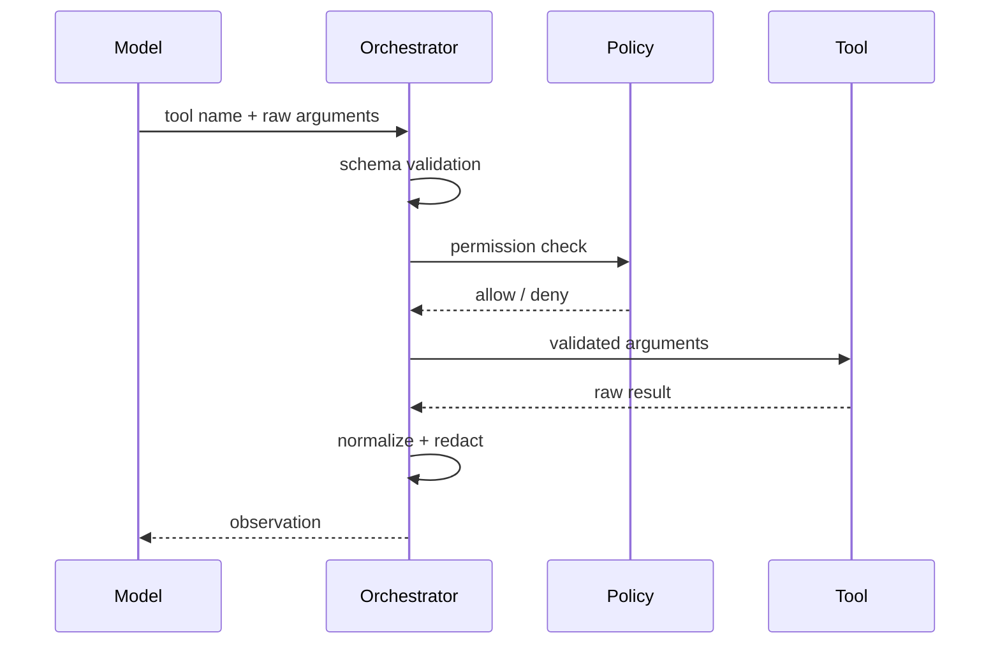

# AI Agent 工程（五）：Tool Calling 基础

> Agent 能“做事”的前提不是模型拥有业务权限，而是后端把少量业务能力包装成结构化工具，并在执行前后实施校验、权限和审计。

---

## 你会学到什么

- 理解 Tool Calling 的完整生命周期。
- 区分工具定义、模型建议和真实执行。
- 设计最小工具注册表。
- 识别 Tool Calling 与普通函数调用的差异。

## 它解决什么问题

模型擅长理解自然语言，业务系统擅长确定性执行。Tool Calling 把两者连接起来：

```text
用户自然语言
  → 模型选择工具并生成参数
  → 后端校验权限与参数
  → 工具执行
  → 结果标准化
  → 模型根据 observation 继续或结束
```

模型不会直接调用 Python 函数。它输出一个结构化“调用建议”，由编排器决定是否执行。

```json
{
  "name": "search_knowledge_base",
  "arguments": {
    "query": "员工差旅住宿标准",
    "top_k": 5
  }
}
```

## 最小示例

```python
from pydantic import BaseModel, Field


class SearchToolInput(BaseModel):
    query: str = Field(min_length=1, max_length=200)
    top_k: int = Field(default=5, ge=1, le=20)


def search_knowledge_base(value: SearchToolInput) -> dict:
    return {
        "items": [
            {
                "chunk_id": "travel-policy-17",
                "text": "一线城市住宿上限为 500 元/晚。",
            }
        ]
    }


def execute_tool(name: str, raw_arguments: dict) -> dict:
    if name != "search_knowledge_base":
        return {"ok": False, "data": None, "error": "tool_not_allowed"}

    value = SearchToolInput.model_validate(raw_arguments)
    data = search_knowledge_base(value)
    return {"ok": True, "data": data, "error": None}
```

关键点：

1. 模型生成的是 `raw_arguments`。
2. Pydantic 把不可信输入转成可信对象。
3. 白名单决定工具能否执行。
4. 工具结果不直接拼成任意字符串，而是返回结构化数据。

## 工程化版本

工具定义至少包含：

| 字段 | 作用 |
|---|---|
| `name` | 稳定、唯一、面向动作的名称 |
| `description` | 说明用途和不适用场景 |
| `input_schema` | 参数类型、范围和必填约束 |
| `risk` | read、write 或 critical |
| `required_permission` | 后端权限标识 |
| `timeout_ms` | 单次执行超时 |
| `handler` | 真实业务实现 |

```python
from dataclasses import dataclass
from typing import Callable, Literal


Risk = Literal["read", "write", "critical"]


@dataclass(frozen=True)
class ToolDefinition:
    name: str
    description: str
    input_model: type[BaseModel]
    risk: Risk
    required_permission: str
    timeout_ms: int
    handler: Callable[[BaseModel], dict]
```

一次调用的推荐顺序：



## 常见失败模式

- 工具名含糊，例如 `process_data`，模型无法判断用途。
- 描述只写“查询信息”，没有说明查询对象和限制。
- 把模型输出直接传给数据库或 shell。
- 工具返回几十 KB 原始数据，导致上下文膨胀。
- 同一个工具同时读取、修改和删除数据，风险边界不清。
- 工具异常直接抛到模型，暴露内部堆栈或敏感路径。

## 什么时候不要这么做

如果操作完全由固定规则触发，不需要模型选择工具，就直接调用业务函数，不要绕一层 Tool Calling。

如果工具是高风险写操作，并且还没有权限校验、幂等和人工确认，也不应该暴露给 Agent。

## 生产环境注意事项

工具输入来自模型，应视为不可信输入。即使 schema 校验通过，也要做业务校验：

- 用户能否访问该租户。
- 订单是否属于当前用户。
- 金额是否超过限额。
- 查询范围是否过大。
- 资源是否处于允许修改的状态。

工具返回给模型前要脱敏、裁剪和限制长度。日志中不要记录密码、token、身份证号或完整客户资料。

## 如何观测和评测

每次调用记录：

```json
{
  "trace_id": "trace-001",
  "tool_call_id": "call-003",
  "tool": "search_knowledge_base",
  "validated": true,
  "permission": "allowed",
  "ok": true,
  "latency_ms": 86,
  "result_items": 5
}
```

首批指标：

- 工具选择准确率。
- 参数校验通过率。
- 权限拒绝率。
- 工具成功率和 P95 延迟。
- 同一任务的平均工具调用数。

## 和 RAG / 后端 / 前端的关系

- RAG 检索器可以被包装成只读工具。
- 后端拥有最终执行权，模型没有。
- 前端应显示工具状态和安全摘要，而不是暴露原始内部参数。
- 高风险工具需要前端确认界面。

## 面试怎么讲

> Tool Calling 是模型输出结构化调用建议，后端编排器完成白名单、schema、权限、超时和真实执行。模型不能直接访问业务服务。工具结果还要标准化和脱敏，再作为 observation 返回模型。

## 下一步

下一篇 [219 工具 Schema 设计](219.tool-schema-design-tutorial.md) 会讲清工具命名、描述和参数边界如何影响选择准确率。
