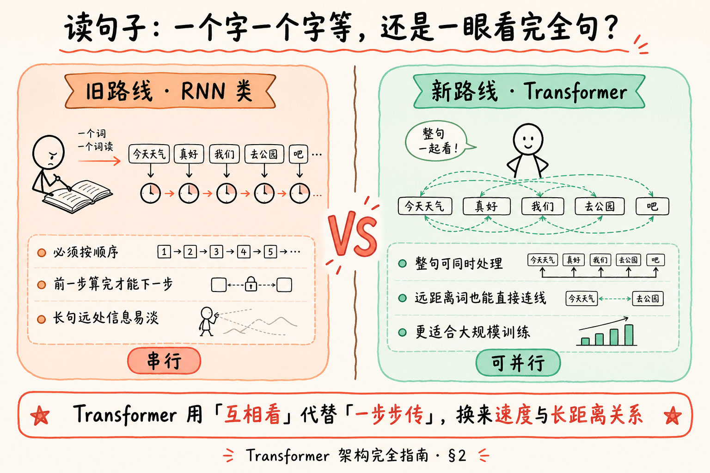
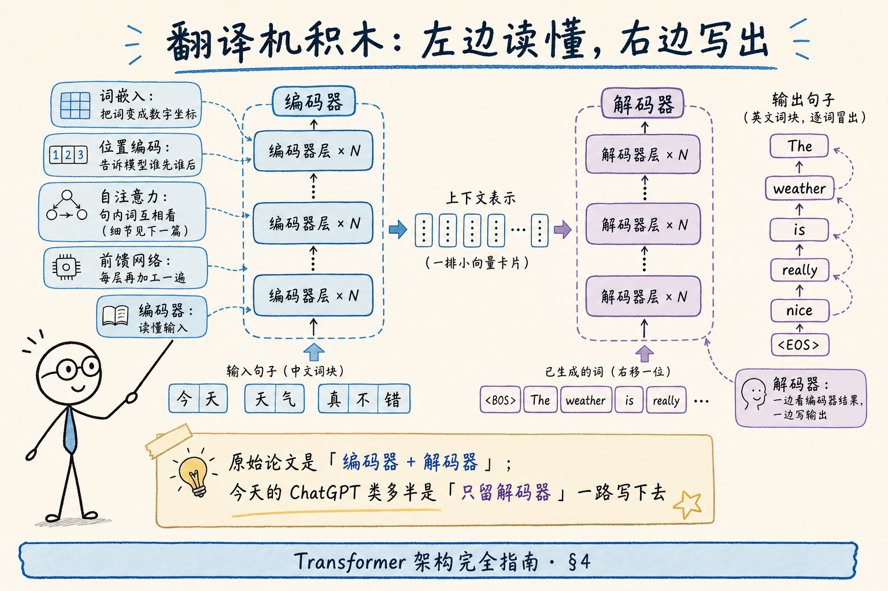
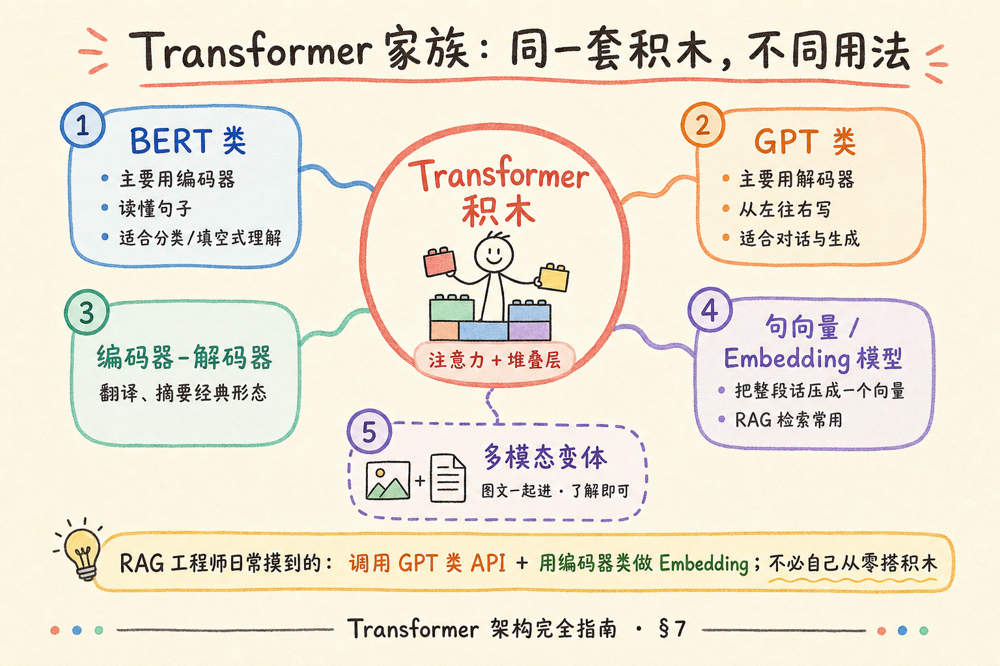
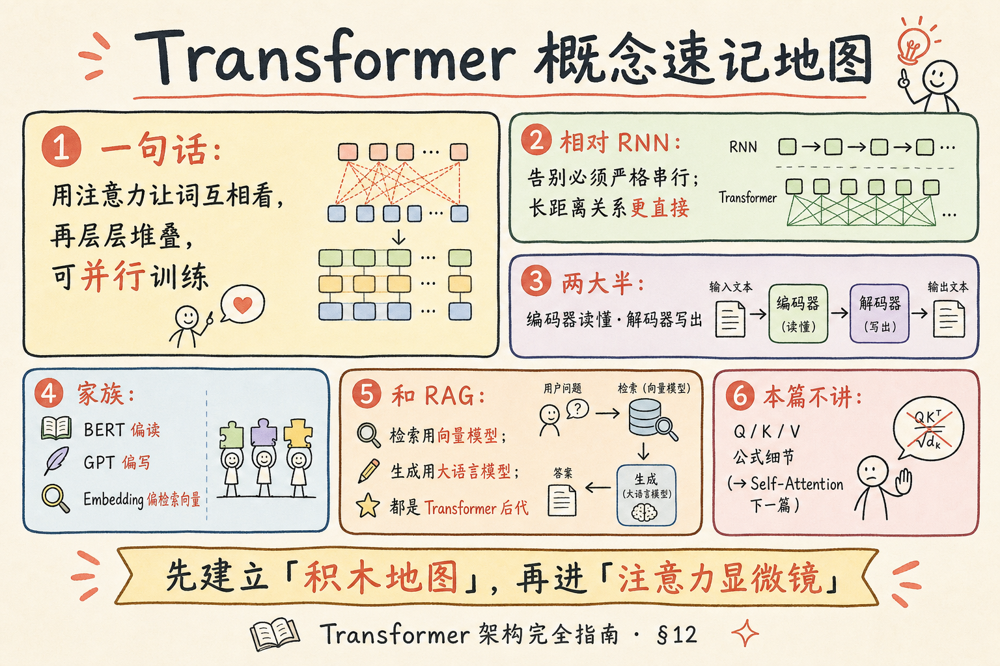

# NLP / IR / LLM 基础（六）：Transformer 架构完全指南

> 你学完 [Word2Vec 与静态词向量](21.word2vec-static-embeddings-tutorial.md)，知道「一词一向量」能让同义词靠近，也知道它怕多义词、且只是查表。今天几乎所有大语言模型、句向量模型，背后都站着同一套积木：**Transformer**。这篇是 [企业 RAG 路线图](ENTERPRISE_RAG_ROADMAP.md) **B 轨第六篇**（路线图第 29 条）：用文字把「这套积木长什么样、解决了什么痛、和 RAG 有什么关系」讲清楚；**不推导公式**。下一篇再单独讲 **Self-Attention（自注意力）**。前置建议读完第 21 篇。

---

## 目录

1. [前言：为什么到处都在说 Transformer](#1-前言为什么到处都在说-transformer)
2. [旧世界的痛：必须一个字一个字等](#2-旧世界的痛必须一个字一个字等)
3. [Transformer 一句话是什么](#3-transformer-一句话是什么)
4. [积木总览：编码器与解码器](#4-积木总览编码器与解码器)
5. [一层里面有什么（直觉版）](#5-一层里面有什么直觉版)
6. [位置信息：模型怎么知道谁先谁后](#6-位置信息模型怎么知道谁先谁后)
7. [家族地图：BERT、GPT、Embedding 模型](#7-家族地图bertgptembedding-模型)
8. [和 RAG 路线图的位置关系](#8-和-rag-路线图的位置关系)
9. [什么时候不必深挖架构](#9-什么时候不必深挖架构)
10. [最小代码：用 API「摸到」Transformer 后代](#10-最小代码用-api摸到transformer-后代)
11. [综合概念地图](#11-综合概念地图)
12. [常见陷阱与 FAQ](#12-常见陷阱与-faq)
13. [总结与系列下一步](#13-总结与系列下一步)

---

## 1. 前言：为什么到处都在说 Transformer

打开任意一篇介绍 ChatGPT、DeepSeek、BGE 句向量的文章，几乎都会冒出同一个词：**Transformer**。它不是某一家公司的产品名，而是 2017 年一篇论文提出的 **神经网络结构模板**——像「汽车底盘」：不同车厂可以做出轿车、卡车、面包车，但底盘思路同源。

**神经网络**（neural network）：用大量可调参数、从数据里学规律的计算结构。  
通俗说：一堆「旋钮」叠在一起，喂进例子，旋钮慢慢拧到能完成任务。

**架构**（architecture）：这些旋钮怎么分层、怎么连接、信息怎么流动的 **图纸**。  
通俗说：不是「学什么」，而是「房子怎么盖」——几层楼、电梯在哪、房间怎么通。

对 RAG 工程师来说，你很少从零实现 Transformer；但面试和排障时，常被问：

- 为什么现在模型能「看懂」整段上下文？
- Embedding 模型和聊天模型是不是一类东西？
- 上下文窗口、注意力、幻觉，和架构有什么关系？

本篇目标是：**建立正确的积木地图**，而不是把你变成论文复现选手。

**读完本文，你应该能做到：**

1. 用白话说明 Transformer 相对旧式「逐步读句子」模型的核心改进。
2. 指出 **编码器** 与 **解码器** 各自干什么，并举一个生活类比。
3. 说出 BERT 类、GPT 类、句向量模型分别偏「读」还是偏「写」。
4. 说明 RAG 里「检索用的向量模型」和「生成用的大模型」如何同属 Transformer 家族。
5. 判断自己何时只需会调 API，何时需要回来重读架构细节。
6. 知道本篇 **不讲** Self-Attention 的 Q/K/V 公式（留给下一篇）。

**前置**：[21 Word2Vec](21.word2vec-static-embeddings-tutorial.md)；有 [17 分词](17.nlp-tokenization-basics-tutorial.md) 更佳。  
**环境**：概念为主；§10 可选 Python 3.10+ 与任意 OpenAI 兼容 API（无 Key 可只读代码）。  
**本文边界（地基篇）**：讲清 **Transformer 作为结构模板** 的直觉与家族分工；**不讲** 反向传播推导、多头注意力公式、训练超参、从零用 PyTorch 搭模型。路线图第 30 条 Self-Attention、第 31 条预训练与微调、第 32 条 Embedding 在后续篇展开。

### 1.1 和前后篇的分工

| 篇章 | 回答的问题 |
|------|------------|
| [21 Word2Vec](21.word2vec-static-embeddings-tutorial.md) | 静态词向量怎么来、有何局限 |
| **本篇** | Transformer **整栋楼**长什么样、家族怎么分 |
| 路线图 30（下一篇） | **自注意力** 显微镜：词如何互相看 |
| 路线图 31 | 预训练 / 微调：旋钮何时拧、拧多少 |
| 路线图 32 | 生产里 Embedding 向量怎么用 |

---

## 2. 旧世界的痛：必须一个字一个字等

在 Transformer 流行之前，处理句子的主流之一是 **RNN** 一类模型（含 LSTM、GRU 等变体）。你不必记住缩写，先抓住体验：

**RNN**（Recurrent Neural Network，循环神经网络）：按时间步 **依次** 处理序列——先看第 1 个词，再看第 2 个，把「到目前为止的摘要」往下传。  
通俗说：像 **读一本书必须翻页**，不能整本摊开一眼扫完；下一页依赖上一页读完。

这带来两个工程痛点：

1. **难并行**：第 5 个词要等前 4 步算完，GPU 很难「整句一起算」。语料越大，训练越慢。  
2. **长距离吃力**：句子很长时，开头的信息要经过很多步才传到末尾，容易 **淡掉**——像传话游戏，传到最后走样。

Transformer 论文标题里有一句名言：**Attention Is All You Need**（注意力就是你所需要的）。大意是：不必靠「一步步传摘要」当主通道，让句子里的词 **直接互相看**，再堆很多层，就能学到复杂关系，并且训练时更容易并行。

下面这张图对比两种「读句子」方式。读图时重点看：**左边是否必须排队**，**右边是否能整句连线**。




对照上图：左边像翻页读书，右边像把句子摊开、用虚线把相关词连起来。RAG 里你调用的大模型，几乎都站在右边这条路上。

> **直觉类比，决策以后文为准**：并行不等于「永远更快」——推理时生成仍常一个 token 一个 token 往外吐；并行优势主要体现在 **训练** 与 **编码整段输入** 时。

---

## 3. Transformer 一句话是什么

**Transformer**：一种以 **自注意力** 为核心、把相同结构的层 **堆叠** 起来的序列模型架构；2017 年提出，后成为大语言模型与现代 Embedding 模型的主流骨架。  
通俗说：**一套可重复的积木**——每层让词互相看一眼、再各自加工，叠很多层，就变成很强的「读/写文字机器」。

三个关键词先立住（细节下一篇展开）：

| 词 | 白话 |
|----|------|
| **注意力 / 自注意力** | 算「这句话里，谁该多看谁一眼」 |
| **堆叠** | 同一套小结构重复很多层，一层比一层抽象 |
| **可并行（相对 RNN）** | 处理输入时不必严格「词 1→词 2→…」串行卡死 |

注意：Transformer **不是**「某一个具体聊天机器人」。ChatGPT、Claude、很多开源模型，是 **在 Transformer 图纸上** 用海量数据训出来的 **实例**。

---

## 4. 积木总览：编码器与解码器

原始 Transformer 面向 **机器翻译**（如中文 → 英文），图纸分成两大半：


**编码器**（Encoder）：负责 **读懂输入**。  
通俗说：左边的「阅读理解组」——把源句子变成一组丰富的内部表示（仍可想成每个位置一串数字）。

**解码器**（Decoder）：负责 **写出输出**。  
通俗说：右边的「写作组」——一边参考编码器的理解，一边 **从左到右** 生成目标句子。

生活类比：

- 编码器 = 口译员先 **听完并理解** 中文发言  
- 解码器 = 再 **组织英文** 说出来  
- 两者之间有「传话通道」，解码器写的时候可以回头看理解结果

下面这张结构拆解图帮助你记住积木位置。读图时顺着箭头：**输入 → 编码器塔 → 中间表示 → 解码器塔 → 输出**；旁注里的「自注意力」本篇只认门牌，不进公式。



对照上图：原始论文是「左读右写」完整机；今天聊天模型常常 **只保留解码器一侧**，从头到尾自己写——但积木基因仍是 Transformer。

### 4.1 为什么后来有人「砍掉一半」

| 形态 | 保留什么 | 典型用途 |
|------|----------|----------|
| 编码器 + 解码器 | 完整翻译机 | 翻译、摘要等 seq2seq |
| 主要编码器 | 擅长 **理解** | BERT 类、部分 Embedding |
| 主要解码器 | 擅长 **续写** | GPT 类对话模型 |

「砍掉」不是偷工减料，而是 **任务不同**：只做分类/检索，也许不需要生成英文；只做聊天，也许用「续写」一种技能就够覆盖问答、写作、代码。

---

## 5. 一层里面有什么（直觉版）

每一层编码器（或解码器）里，你可以先记住 **两个房间**（名字以后会反复出现）：

1. **自注意力子层**  
   让当前位置看看句子里其他人，决定「这次我该吸收谁的信息」。  
   → 细节见下一篇 Self-Attention。

2. **前馈网络子层**（Feed-Forward Network, FFN）  
   **前馈网络**：注意力混合完信息后，对每个位置再做一次独立的非线性加工。  
   通俗说：开完会（注意力）之后，每个人回工位 **自己消化笔记**。

此外还有工程上很重要、但初学可先当「胶水」的部件：

- **残差连接**（residual）：把层输入再加回输出，减轻「层太深学不动」。通俗说：留一条 **抄近道**，别让信号在深楼里迷路。  
- **层归一化**（layer normalization）：稳住每层数值尺度。通俗说：每层出门前 **校准一下音量**，别忽大忽小。

本篇你只要建立印象：**一层 = 互相看 + 各自加工 + 一些稳定训练的胶水**；堆 N 层 = 加深理解。

### 5.1 和 Word2Vec 的关键差别

| | Word2Vec | Transformer 层 |
|--|----------|----------------|
| 向量是否随上下文变 | **否**（静态） | **会**（动态表示） |
| 「银行」在不同句 | 同一向量 | 表示可不同 |
| 典型产物 | 词表查表 | 整句/整段的上下文相关表示 |

这正是第 21 篇结尾预告的台阶：静态词向量是历史地基；Transformer 让表示 **跟着上下文变**。

---

## 6. 位置信息：模型怎么知道谁先谁后

自注意力本身 **不天生知道顺序**——若只给一堆词向量、不告诉前后，模型可能把「狗咬人」和「人咬狗」搅在一起。

**位置编码**（positional encoding / positional embedding）：给每个位置加一份「第几号」信息，让模型区分顺序。  
通俗说：给每个词发一张 **座位号**，不只知道「有谁」，还知道「谁坐前排」。

实现方式有多种（正弦函数、可学习向量、相对位置等），初学不必背公式。你要记住的工程含义是：

- **顺序对语言很重要**，Transformer 用显式位置信息补上这一点；  
- 超长上下文、位置外推，是后续「上下文窗口」篇会碰到的话题。

---

## 7. 家族地图：BERT、GPT、Embedding 模型

下面用一张家族图把日常名词归位。读图时看 **中心是同一套积木**，外围是不同用法。




对照上图：你不必会训 BERT 或 GPT；但要能回答「检索向量」和「聊天生成」为何能放在同一张家族地图上。

### 7.1 三个名字的白话卡片

**BERT 类**（Bidirectional Encoder Representations from Transformers）：偏 **编码器**，训练时常做「挖空填词」等理解任务，双向看上下文。  
通俗说：**精读课代表**——适合分类、抽取、部分句向量思路的祖先。

**GPT 类**（Generative Pre-trained Transformer）：偏 **解码器**，从左到右预测下一个词，训完很会续写。  
通俗说：**写作课代表**——对话、代码、RAG 里的「根据资料回答」多半调这类 API。

**句向量 / Embedding 模型**（如 BGE、E5、部分 OpenAI embedding）：常基于 Transformer 编码器（或相关变体），把 **一句话/一段 chunk** 压成 **一个固定长度向量**，供相似度检索。  
通俗说：**图书馆编目员**——不管原文多长，先做成可比较的「书脊标签」。

### 7.2 一张表记住分工

| 你听到的名字 | 更偏 | RAG 里常见角色 |
|--------------|------|----------------|
| Chat / Instruct 模型 | 解码器生成 | 根据检索到的资料写答案 |
| Embedding 模型 | 编码成向量 | 给 query / chunk 打向量 |
| 重排序 Cross-Encoder | 成对打分 | 精排（后文 C4） |
| 翻译/摘要专用 | 编解码都有 | 非 RAG 主路径，了解即可 |

---

## 8. 和 RAG 路线图的位置关系

RAG 最小闭环是：

**文档 → 分块 → 向量化 → 检索 → 拼进提示词 → 大模型生成**

其中两处直接踩在 Transformer 上：

1. **向量化**：Embedding 模型（Transformer 后代）把 chunk / 问题变成向量。  
2. **生成**：聊天模型（多为解码器 Transformer）读「系统说明 + 检索片段 + 用户问题」，写出答案。

所以：

- 不懂 Transformer，你仍能调 API 做出 Demo；  
- 懂家族地图，你才能听懂「换 Embedding」「换底座模型」「上下文不够」在改哪一块积木。

| 路线图条目 | 和本篇关系 |
|------------|------------|
| 28 Word2Vec | 静态时代；本篇进入动态架构时代 |
| **29 Transformer（本篇）** | 总图纸 |
| 30 Self-Attention | 图纸里的核心零件特写 |
| 32 Embedding | 检索侧怎么用编码器产物 |
| 35 Context Window | 解码器一次能塞多少 |
| C3 / C6 | 生产向量化与生成 Grounding |

---

## 9. 什么时候不必深挖架构

诚实边界，避免初学者焦虑：

| 你的目标 | 建议 |
|----------|------|
| 两周内做出 Mini-RAG Demo | 会调 Embedding + Chat API 即可，本篇读到 §7 地图就够 |
| 面试讲清 RAG 链路 | 本篇 + 下一篇注意力直觉 + Embedding/相似度篇 |
| 训自己的大模型 / 改结构 | 需要系统深度学习，超出本系列地基范围 |
| 只做关键词 BM25 检索 | 可以暂缓，但读 LLM 生成仍建议懂 GPT 类是解码器 |

**不必用「自己实现 Transformer」的场景**：绝大多数企业 RAG；优先把分块、混合检索、引用、评测做好。

---

## 10. 最小代码：用 API「摸到」Transformer 后代

### 10.1 阅读说明

下面示例 **不训练** 任何网络，只演示：你日常调用的 Chat Completions，背后就是解码器类 Transformer 的 **托管实例**。

**演示什么**：发一条用户消息，拿到模型回复。  
**前置**：Python 3.10+；`pip install openai`；环境变量 `OPENAI_API_KEY`（或兼容网关的 Key / Base URL）。  
**预期**：打印一段助手回复文本。无 Key 时请只读，不要硬跑。

```python
# 最小对话：调用的是「解码器类 Transformer」训好的托管模型
import os
from openai import OpenAI

client = OpenAI(
    api_key=os.environ.get("OPENAI_API_KEY"),
    # 若用 DeepSeek 等兼容网关，取消下一行注释并改 base_url / model
    # base_url="https://api.deepseek.com",
)

resp = client.chat.completions.create(
    model="gpt-4o-mini",  # 换成你账号可用的模型名
    messages=[
        {
            "role": "system",
            "content": "你是助教。用两句话解释：Transformer 是架构模板，不是某一个 App。",
        },
        {"role": "user", "content": "Transformer 和 ChatGPT 是什么关系？"},
    ],
    temperature=0.2,
)

print(resp.choices[0].message.content)
```

代码后解读：`messages` 里的角色结构会在路线图第 37 条详讲；这里只要体会——**你没有 import Transformer 类**，但服务端跑的就是这类架构的实例。

### 10.2 先错后对：把「架构」和「产品」混为一谈

**错误说法（面试减分）：**

> 「我们项目用了 Transformer 框架做 RAG。」  
> （听起来像用了某个叫 Transformer 的 SDK，含糊且不专业。）

**更清楚的说法：**

> 「检索侧用 BGE 这类 Transformer 编码器做句向量；生成侧调 DeepSeek 这类解码器大模型；中间自研分块与引用。」

### 10.3 可选：本地看参数量级（了解即可）

若已安装 `transformers` 与某开源小模型，可打印 `num_parameters()`——会看到动辄上亿参数。  
**日常开发可跳过**：企业 RAG 更常调 API，而不是本地下载 70B。需要时再回深度学习专项。

---

## 11. 综合概念地图

读下图前，先自己在纸上写三个词：编码器、解码器、Embedding。再对照图检查有没有漏「和 RAG 的接点」。




对照上图：本篇收束在「积木地图」；下一篇进入「注意力显微镜」。若图中某格与正文冲突，**以正文表格为准**。

### 11.1 核心概念速记表

| 概念 | 一句话 |
|------|--------|
| Transformer | 以注意力为核心、可堆叠的序列架构模板 |
| 编码器 | 读懂输入，产出上下文相关表示 |
| 解码器 | 从左到右生成输出（可看编码器结果） |
| 位置编码 | 补上「谁先谁后」 |
| BERT 类 | 偏理解的编码器路线 |
| GPT 类 | 偏生成的解码器路线 |
| Embedding 模型 | 把文本压成检索用向量 |
| 相对 RNN | 输入侧更易并行，长距离关系更直接 |

---

## 12. 常见陷阱与 FAQ

### 12.1 常见陷阱

1. **以为 Transformer = ChatGPT**  
   危害：换模型、换 Embedding 时说不清改的是哪块。  
   纠正：Transformer 是图纸；ChatGPT 是某张图纸上的产品。

2. **以为必须会手推公式才能做 RAG**  
   危害：卡在论文里，迟迟不上链路。  
   纠正：地基篇建立地图即可；公式留给要改模型的人。

3. **以为「并行」等于生成也瞬间整篇出来**  
   危害：误解流式输出与延迟。  
   纠正：训练/编码可并行；自回归生成仍常逐步吐 token。

4. **忽略位置信息**  
   危害：无法理解乱序、超长外推等问题从哪来。  
   纠正：记住「注意力 + 座位号」。

5. **把 Word2Vec 与 Transformer 句向量当成同一种东西**  
   危害：多义词、静态/动态说不清。  
   纠正：静态查表 vs 上下文相关表示。

### 12.2 FAQ

**Q：Transformer 一定有编码器和解码器吗？**  
A：原始论文有；后世常 **只留一半**。看任务。

**Q：和「注意力机制」是什么关系？**  
A：注意力是核心零件；Self-Attention 是下一篇主角。本篇先认「词可以互相看」。

**Q：RAG 必须上 Transformer 吗？**  
A：纯关键词 BM25 也能做第一版；要语义检索与现代 LLM 生成，实务上会碰到 Transformer 后代。

**Q：学架构要不要先学微积分？**  
A：当 RAG 全栈工程师：**不必先学完**。会调 API、懂数据流、能排 bad case 优先；数学按需补。

**Q：多模态 Transformer 要现在学吗？**  
A：了解「图文可进同一套注意力思路」即可；路线图 H 区再展开。

**Q：论文要精读吗？**  
A：初学 skim 结构图即可；面试能画编码器/解码器与家族表通常够用。

---

## 13. 总结与系列下一步

1. **Transformer** 是现代 LLM / Embedding 的 **架构模板**，不是某一个 App。  
2. 相对 RNN 路线，它用 **注意力互相看** 减轻串行与长距离传话问题（训练侧尤明显）。  
3. **编码器读懂、解码器写出**；后世常砍半专用。  
4. **BERT 偏读、GPT 偏写、Embedding 偏检索向量**——RAG 两头都踩得到。  
5. 做企业 RAG：**会选会调会观测** 优先于从零实现架构。

### 13.1 系列下一步

| 目标 | 推荐阅读 |
|------|----------|
| 注意力如何算「谁看谁」 | [23 Self-Attention](23.self-attention-tutorial.md) |
| 预训练与微调 | [24 预训练与微调](24.pretrain-finetune-tutorial.md) |
| 句向量与生产 Embedding | [25 Embedding](25.embedding-vector-tutorial.md)、路线图 C3 |
| 相似度打分 | [26 相似度](26.similarity-metrics-tutorial.md) |
| 静态词向量回顾 | [21 Word2Vec](21.word2vec-static-embeddings-tutorial.md) |

### 13.2 学习目标自检

- [ ] 能用「翻页 vs 摊开连线」说明 RNN 与 Transformer 直觉差异  
- [ ] 能指出编码器 / 解码器各自职责  
- [ ] 能把 BERT / GPT / Embedding 放进家族表  
- [ ] 能说明 RAG 哪两步踩在 Transformer 上  
- [ ] 能区分「架构模板」与「具体产品/API」  
- [ ] 知道 Q/K/V 细节在下一篇，不在本篇硬背

### 13.3 深度与实战厚度说明

本篇定为 **地基篇**：综合实战以 **一次 API 调用建立「摸到后代」的手感** 为足够切片，不强制本地搭模型。更厚的动手（Embedding 批量、提示词角色、上下文裁剪）放在第 25 / 28 / 30 篇主线。

---

> **初学者可能仍困惑的点**  
> - 「层」很深时，中间表示人类不可读——正常，别强求每维有含义。  
> - 开源模型名带 Transformer 字样，不代表你要改它的层数才能做 RAG。  
> - 同一公司既有 Chat 模型又有 Embedding 模型——任务不同，别混用 endpoint。  
> - 中文资料里「Transformer」有时被译成「变换器」，和电力变压器无关，是音译+意译习惯。  
> - 下一篇会出现 Q、K、V 三个字母，那是注意力记账的三角色，不是数据库主键。
