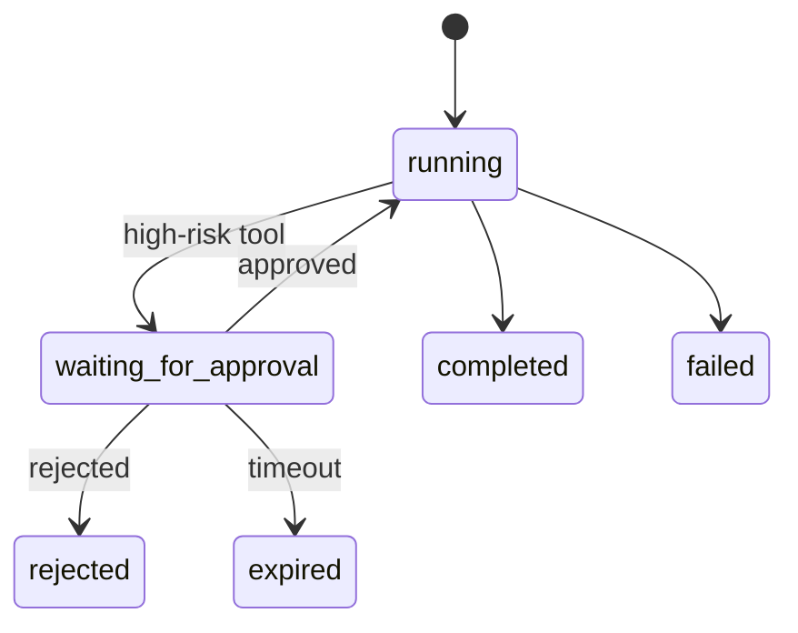

# AI Agent 工程（十一）：Human-in-the-loop 人工确认

> Human-in-the-loop 不是在页面上加一个“确认”按钮，而是把 Agent 执行暂停在可恢复状态，让用户看到并批准一组不可变动作参数。

---

## 你会学到什么

- 判断哪些动作必须人工确认。
- 设计不可变 Approval Request。
- 实现暂停、恢复、拒绝和过期。
- 防止确认前后参数漂移。

## 它解决什么问题

需要确认的典型动作：

- 退款、付款、下单。
- 删除、覆盖或批量修改数据。
- 对外发送邮件、短信或公告。
- 修改权限和密钥。
- 执行代码或 shell。
- 访问高度敏感信息。

如果只让模型问一句“确认吗？”，用户回复“确认”后模型可能重新规划并生成不同参数。真正安全的确认必须绑定具体动作。

## 最小示例

```python
from dataclasses import dataclass
from datetime import datetime
from typing import Any, Literal


ApprovalStatus = Literal["pending", "approved", "rejected", "expired"]


@dataclass(frozen=True)
class ApprovalRequest:
    approval_id: str
    task_id: str
    tool_name: str
    arguments: dict[str, Any]
    argument_hash: str
    reason: str
    expires_at: datetime
    status: ApprovalStatus = "pending"
```

恢复执行时：

```python
def resume_after_approval(request: ApprovalRequest) -> dict:
    if request.status != "approved":
        raise ValueError("approval_not_granted")
    if request.expires_at < now():
        raise ValueError("approval_expired")

    return tool_registry.execute(
        request.tool_name,
        request.arguments,
        idempotency_key=f"{request.approval_id}:{request.argument_hash}",
    )
```

注意：恢复时直接执行已批准参数，不再让模型生成。

## 工程化版本



Approval Request 推荐包含：

```json
{
  "approval_id": "APR-88",
  "task_id": "TASK-901",
  "tool_name": "create_refund",
  "arguments": {
    "order_id": "ORD-1001",
    "amount": "680.00"
  },
  "reason": "金额超过自动退款阈值 500 元",
  "evidence_ids": ["policy-17", "ticket-91"],
  "risk": "critical",
  "expires_at": "2026-07-22T18:00:00+08:00"
}
```

前端必须展示：

- 动作名称。
- 关键参数。
- 执行影响。
- 证据来源。
- 为什么需要确认。
- 过期时间。
- 批准和拒绝。

## 常见失败模式

- 只确认自然语言，不确认具体参数。
- 用户批准后模型重新生成参数。
- 审批永久有效。
- 任意用户都能批准他人的任务。
- 重复点击导致重复执行。
- 拒绝后 Agent 换一个工具绕过审批。
- 批量动作只展示“将修改若干条数据”，没有具体范围。

## 什么时候不要这么做

低风险、可逆、频繁动作如果每次确认，会造成审批疲劳。应该用风险等级和额度阈值决定：

| 风险 | 策略 |
|---|---|
| 只读 | 通常自动 |
| 低风险可逆写入 | 白名单自动 + 审计 |
| 中风险 | 条件确认 |
| 高风险或不可逆 | 强制确认 |

如果动作本身无法明确描述影响范围，也不应该交给用户确认后执行；应先改造工具。

## 生产环境注意事项

- Approval 绑定用户、租户、task_id 和参数 hash。
- 批准权限与工具执行权限分开。
- 执行前再次校验资源版本和业务状态。
- 使用幂等键防止重复批准。
- 过期后必须重新生成 Approval，而不是延长旧对象。
- 记录批准人、时间、IP、设备和理由。

审批界面不要隐藏风险信息，也不要用诱导性默认选项。

## 如何观测和评测

指标：

- 待确认数量和平均等待时间。
- 批准率、拒绝率和过期率。
- 批准后执行失败率。
- 参数修改后重新审批率。
- 重复点击被幂等拦截次数。
- 用户撤销或投诉次数。

评测集要包含过期审批、跨用户审批、参数被篡改和资源状态变化。

## 和 RAG / 后端 / 前端的关系

- RAG 提供批准动作所需证据。
- 后端保存 Approval 和 Checkpoint，并执行二次校验。
- 前端承担可理解的风险展示。
- Agent 在拒绝后应停止或转人工，不能自行绕过。

## 面试怎么讲

> Human-in-the-loop 的核心是暂停和恢复，不是聊天里问“是否确认”。我会把工具名、参数、证据、风险和过期时间固化成 Approval Request，用户批准后直接执行这组不可变参数，并用参数 hash、资源版本和幂等键防止漂移和重复执行。

## 下一步

下一篇 [225 工具权限边界](225.agent-tool-permission-boundary-tutorial.md) 会设计 Agent、用户和工具之间的最小权限模型。
