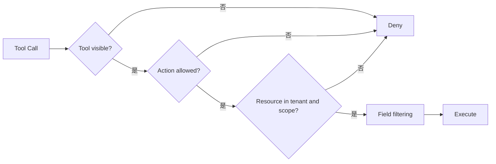

# AI Agent 工程（十二）：工具权限边界

> Agent 能看到工具，不代表 Agent 应该拥有工具背后的全部权限。工具执行权限必须来自当前用户、租户、资源和动作，而不是模型身份。

---

## 你会学到什么

- 建立 Agent 工具最小权限模型。
- 区分工具可见、工具可调用和资源可访问。
- 防止系统账号导致权限放大。
- 设计 Policy Decision 与审计记录。

## 它解决什么问题

危险架构：

```text
用户 → Agent → 使用后台超级账号访问所有数据
```

即使 Agent 正确选择了工具，也可能：

- 查询其他租户客户。
- 读取用户本来不可见的文档。
- 使用只应由管理员调用的写工具。
- 把敏感工具结果放进模型上下文。

权限必须在工具执行前由确定性系统判断。

## 最小示例

```python
from dataclasses import dataclass


@dataclass(frozen=True)
class UserContext:
    user_id: str
    tenant_id: str
    permissions: frozenset[str]


@dataclass(frozen=True)
class ToolPolicy:
    tool_name: str
    required_permission: str
    allowed_roles: frozenset[str]


def can_call(
    policy: ToolPolicy,
    user: UserContext,
) -> bool:
    return policy.required_permission in user.permissions
```

执行资源查询时还要自动注入租户范围：

```python
def list_tickets(arguments: dict, user: UserContext) -> list[dict]:
    return ticket_repository.list(
        tenant_id=user.tenant_id,
        customer_id=arguments["customer_id"],
    )
```

模型不能传入或覆盖 `tenant_id`。

## 工程化版本

权限判断至少包含四层：

| 层级 | 问题 |
|---|---|
| Tool | 当前用户能否使用这个工具？ |
| Action | 能读、创建、修改还是删除？ |
| Resource | 能否访问这个具体订单或文档？ |
| Field | 返回结果中哪些字段可以看到？ |



Policy Decision 推荐返回：

```json
{
  "allowed": false,
  "reason_code": "resource_outside_tenant",
  "policy_version": "agent-policy-v3",
  "decision_id": "PD-901"
}
```

模型只需要知道“无权限，不能继续”，内部策略细节不必全部暴露。

### 动态工具列表

不要把全部工具交给模型再依赖执行时拒绝。先按用户和任务过滤工具列表：

```python
def visible_tools(
    all_tools: list[ToolDefinition],
    user: UserContext,
) -> list[ToolDefinition]:
    return [
        tool
        for tool in all_tools
        if tool.required_permission in user.permissions
    ]
```

这既降低误选率，也减少 schema token。

## 常见失败模式

- 工具服务使用超级账号，不携带用户上下文。
- 只校验角色，不校验资源归属。
- 把 tenant_id 交给模型填写。
- 工具可见列表对所有用户相同。
- 权限拒绝后模型换另一个等价工具。
- 日志记录敏感返回值，绕过字段权限。
- RAG 检索先召回全部文档，再在生成阶段过滤。

## 什么时候不要这么做

不要让模型解释或推断真实权限。模型可以根据权限结果生成友好提示，但允许/拒绝必须来自 Policy。

如果现有业务系统没有可靠鉴权和租户隔离，不要先接 Agent；Agent 会放大原有权限漏洞。

## 生产环境注意事项

- 服务间调用传递不可伪造的用户和租户身份。
- 工具内部再次校验权限，不只依赖编排器。
- RAG 在检索前应用 ACL filter。
- Policy 版本写入 trace，便于事故回放。
- 权限缓存必须考虑撤权后的失效。
- 对 critical 工具同时要求权限和人工确认。

安全原则：

```text
模型建议 ≠ Policy 决策
工具可见 ≠ 工具可调用
工具可调用 ≠ 任意资源可访问
```

## 如何观测和评测

监控：

- tool_not_visible。
- permission_denied。
- resource_outside_tenant。
- field_redaction_count。
- approval_required。
- policy_version 分布。

安全测试要覆盖跨租户 ID、撤权后调用、工具别名绕过、RAG ACL 和日志脱敏。

## 和 RAG / 后端 / 前端的关系

- RAG 权限必须在检索阶段过滤文档。
- 后端 Policy 和业务服务承担最终权限。
- 前端只展示用户本来能看到的工具结果和引用。
- Agent 遇到 deny 后应给出安全解释或转人工。

## 面试怎么讲

> Agent 不能继承后台超级账号权限。我会按当前用户动态过滤工具列表，执行时再检查 action、resource 和 field 三层权限。tenant_id、user_id 由后端上下文注入，RAG 在检索前做 ACL。Policy 决策和版本进入 trace，模型只负责解释结果，不能决定权限。

## 下一步

Tool Calling 模块到这里完成。下一篇 [226 Agent Loop](226.agent-loop-observe-think-act-tutorial.md) 会把工具接入受控的 Observe / Decide / Act 循环。
