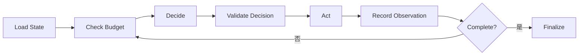

# AI Agent 工程（十三）：Agent Loop 与 Observe / Decide / Act

> Tool Calling 解决“怎么调用工具”，Agent Loop 解决“什么时候调用、调用后如何继续、什么时候停止”。

---

## 你会学到什么

- 理解 Agent Loop 的状态流。
- 把模型决策和真实执行分开。
- 记录 observation、step 和 stop_reason。
- 为循环设置硬边界。

## 它解决什么问题

一个 Agent 任务通常不能一次完成。它需要观察当前状态、决定下一步、执行动作，再观察结果：

```text
Observe → Decide → Act → Observe
```

这条循环只有在三项条件满足时才可靠：

1. Observation 是结构化、可信的工具结果。
2. Act 只能从后端允许的工具中选择。
3. 每轮都检查停止条件和剩余预算。

## 最小示例

```python
from dataclasses import dataclass, field
from typing import Any, Literal


DecisionKind = Literal["tool", "finish", "ask_user"]


@dataclass
class Decision:
    kind: DecisionKind
    tool_name: str | None = None
    arguments: dict[str, Any] = field(default_factory=dict)
    answer: str | None = None


@dataclass
class State:
    goal: str
    observations: list[dict[str, Any]] = field(default_factory=list)
    step: int = 0
    max_steps: int = 6
    stop_reason: str | None = None


def run_agent(state: State) -> State:
    while state.stop_reason is None:
        if state.step >= state.max_steps:
            state.stop_reason = "max_steps"
            break

        decision = planner.decide(state)
        state.step += 1

        if decision.kind == "finish":
            state.observations.append({"answer": decision.answer})
            state.stop_reason = "completed"
            break

        if decision.kind == "ask_user":
            state.stop_reason = "need_user_input"
            break

        result = tool_registry.execute(
            decision.tool_name,
            decision.arguments,
        )
        state.observations.append(result)

    return state
```

## 工程化版本

每轮循环分成五个明确阶段：



### Decision 必须结构化

```json
{
  "kind": "tool",
  "tool_name": "search_knowledge_base",
  "arguments": {
    "query": "高级报表权限条件",
    "top_k": 5
  }
}
```

### 状态记录事实，不记录隐藏思维

保存目标、工具调用、结果、证据和决策摘要即可，不要求模型输出私有推理过程。

### 预算是状态的一部分

```python
@dataclass
class Budget:
    remaining_steps: int
    remaining_tool_calls: int
    deadline_ms: int
    token_limit: int
```

任务恢复时，预算不能重置。

## 常见失败模式

- 把所有聊天消息当状态。
- 工具失败后继续相同调用，没有失败计数。
- 模型输出任意工具名。
- 达到最大步数后仍让模型“总结一下再结束”。
- observation 太长，旧证据被挤出上下文。
- 循环在同步 HTTP 请求里运行几分钟。

## 什么时候不要这么做

只有一步工具调用时不需要完整循环；一次 Tool Calling 加结果生成即可。

步骤固定时使用 Workflow，不要让模型每轮重新决定已知顺序。

## 生产环境注意事项

- 每步提交 Checkpoint，或至少在高风险动作前提交。
- 使用 task_id 和 state_version 防止并发 worker 重复推进。
- 取消任务时终止后续工具调用。
- 长任务转后台 worker，通过 SSE 或轮询报告状态。
- observation 写入前脱敏和裁剪。

## 如何观测和评测

一次轨迹至少能回答：

- 第几步选择了什么工具？
- 参数是否通过校验？
- 工具返回什么类型结果？
- 为什么继续或停止？
- 总共消耗多少时间、token 和工具调用？

指标包括平均步骤数、最大步数触发率、重复工具调用率和无进展循环率。

## 和 RAG / 后端 / 前端的关系

- RAG 工具产生 evidence observation。
- 后端编排器驱动循环和持久化状态。
- 前端展示步骤摘要、取消入口和等待确认。
- Workflow 可以把 Agent Loop 作为一个受控节点。

## 面试怎么讲

> Agent Loop 是 Observe、Decide、Act 的受控循环。模型只生成结构化 Decision，编排器校验工具、权限和预算。状态保存目标、步骤、证据和停止原因，不依赖聊天历史。每轮检查最大步数、失败阈值和任务 deadline。

## 下一步

下一篇 [227 ReAct 模式](227.react-agent-pattern-tutorial.md) 会说明“推理与行动交替”在工程中如何落地而不泄露或依赖隐藏思维。
