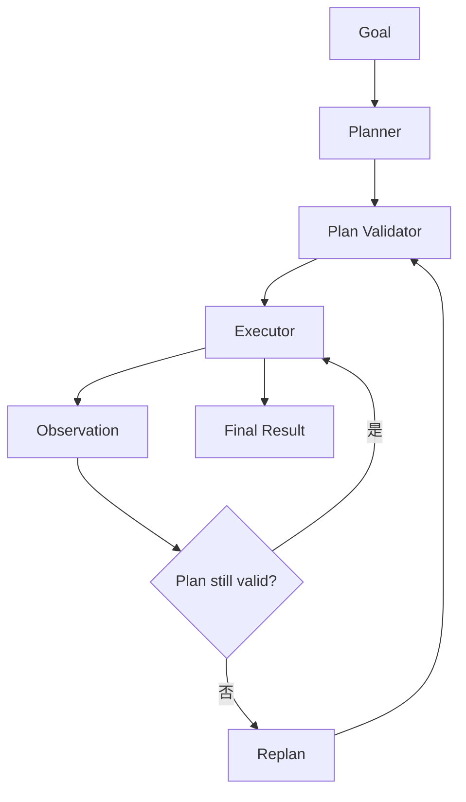

# AI Agent 工程（十五）：Plan-and-Execute

> ReAct 适合根据 observation 逐步决定；Plan-and-Execute 先生成可检查的计划，再由执行器按步骤推进，适合目标清晰但步骤较多的任务。

---

## 你会学到什么

- 区分 Planner 和 Executor。
- 设计结构化、可修改的执行计划。
- 判断何时需要重新规划。
- 防止计划成为无法执行的自然语言清单。

## 它解决什么问题

如果任务包含多个相对独立步骤，逐轮 ReAct 可能缺少全局视角：

```text
对比三份制度
  → 找出冲突条款
  → 给出统一建议
  → 创建复核任务
```

Plan-and-Execute 先生成计划：

```json
{
  "goal": "对比三份制度并创建复核任务",
  "steps": [
    {"id": "s1", "action": "retrieve_policy", "status": "pending"},
    {"id": "s2", "action": "compare_evidence", "status": "pending"},
    {"id": "s3", "action": "create_review_task", "status": "blocked"}
  ]
}
```

执行器只执行当前可执行步骤。

## 最小示例

```python
from pydantic import BaseModel, Field
from typing import Literal


class PlanStep(BaseModel):
    id: str
    objective: str
    tool_name: str
    depends_on: list[str] = Field(default_factory=list)
    status: Literal["pending", "running", "completed", "failed", "blocked"] = "pending"


class ExecutionPlan(BaseModel):
    goal: str
    steps: list[PlanStep] = Field(min_length=1, max_length=10)
```

执行前校验：

- tool_name 在白名单中。
- 依赖引用真实 step id。
- 没有循环依赖。
- 高风险步骤标记 approval。
- 步骤数不超过预算。

## 工程化版本



### Planner 不执行

Planner 只输出计划，不能绕过 Executor 调工具。

### Executor 不自由扩展计划

执行器只推进已批准步骤。发现计划缺失时返回 replan 请求。

### Replan 有明确触发条件

```python
def should_replan(result: StepResult) -> bool:
    return result.code in {
        "required_data_missing",
        "resource_changed",
        "tool_unavailable",
        "goal_constraint_changed",
    }
```

普通瞬时超时应由工具重试，不要每次超时都重新规划。

### 计划版本化

每次修改计划递增 `plan_version`，并保留变更原因。人工批准某一步时绑定计划版本。

## 常见失败模式

- 计划只是自然语言，无法验证和推进。
- Planner 生成不存在的工具。
- 每次 observation 都重建全部计划。
- Executor 临时添加高风险步骤。
- 计划依赖形成环。
- 用户修改目标后仍执行旧计划。

## 什么时候不要这么做

两三步且高度动态的任务，用 ReAct 更轻。

固定流程用 Workflow，不需要模型生成计划。

如果计划无法被结构化校验，就不要自动执行，只把它作为人类建议。

## 生产环境注意事项

- 限制总步骤数和并行步骤数。
- 写步骤默认 blocked，等待审批或前置证据。
- 每步保存输入、输出、状态和 retry_count。
- 计划变更后重新检查权限和成本预算。
- 任务取消时停止未开始步骤。

## 如何观测和评测

指标：

- 计划可执行率。
- 平均计划步骤数。
- Replan 率及原因。
- 未使用步骤比例。
- 执行顺序正确率。
- 计划完成率和总成本。

评测时同时比较初始计划和最终计划，检查变化是否由 observation 支持。

## 和 RAG / 后端 / 前端的关系

- RAG 为计划步骤提供证据。
- 后端 Executor 管理状态、依赖、重试和权限。
- 前端可以展示计划进度和待确认步骤。
- Workflow 可以承载 Executor，Planner 只生成受约束计划。

## 面试怎么讲

> Plan-and-Execute 把 Planner 和 Executor 分开。Planner 输出结构化步骤和依赖，执行前检查工具白名单、循环依赖、风险和预算；Executor 只推进已验证步骤。只有 observation 让原计划失效时才 Replan，并用版本号绑定审批和审计。

## 下一步

下一篇 [229 Reflection](229.reflection-agent-pattern-tutorial.md) 会讨论如何做受控自检，而不是无限“再想一遍”。
