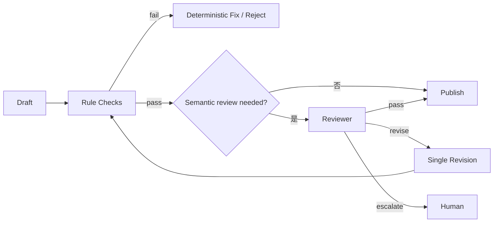

# AI Agent 工程（十六）：Reflection 受控自检

> Reflection 不是让模型无限“反思”，而是在少数高价值节点用明确标准检查结果，并限制修订次数。

---

## 你会学到什么

- 区分规则校验、模型评审和人工评审。
- 设计结构化 Reflection 结果。
- 控制修订轮数和触发条件。
- 防止自我评审制造新错误。

## 它解决什么问题

Agent 完成任务后可能存在：

- 回答缺少引用。
- 计划漏掉用户约束。
- 工具结果与结论不一致。
- 输出格式不符合要求。
- 高风险动作缺少证据。

一部分问题可以用确定性规则检查，剩余语义问题才交给 Reviewer。

## 最小示例

```python
from pydantic import BaseModel, Field
from typing import Literal


class ReviewResult(BaseModel):
    verdict: Literal["pass", "revise", "escalate"]
    issues: list[str] = Field(default_factory=list, max_length=5)
    revision_instruction: str | None = Field(default=None, max_length=500)


def deterministic_checks(answer: str, evidence_ids: list[str]) -> list[str]:
    issues: list[str] = []
    if evidence_ids and "[来源" not in answer:
        issues.append("missing_citation")
    if len(answer) > 5000:
        issues.append("answer_too_long")
    return issues
```

先跑规则；只有规则无法判断的语义一致性才调用 Reviewer。

## 工程化版本



### 使用独立评审标准

Reviewer 输入应包含目标、证据、输出和评分标准：

```text
忠实性：结论是否由证据支持
完整性：是否覆盖用户明确要求
安全性：是否包含未批准动作
引用：关键事实能否定位来源
```

### 限制修订次数

```python
MAX_REVISIONS = 1

if review.verdict == "revise" and state.revision_count < MAX_REVISIONS:
    state.revision_count += 1
    return revise_answer(review.revision_instruction)

if review.verdict != "pass":
    state.stop_reason = "human_review_required"
```

## 常见失败模式

- 同一个模型用同一提示自评，错误高度相关。
- 没有评分标准，只问“答案好吗”。
- 反思轮数无限。
- Reviewer 修改工具事实。
- 规则能检查的问题也调用模型。
- 评审只看答案，不看证据和轨迹。

## 什么时候不要这么做

格式、字段、权限和数值范围应使用确定性校验，不要用 Reflection。

低风险短回答不需要额外模型评审；成本可能超过收益。

如果 Reviewer 无法访问可靠证据，它不能判断事实正确性。

## 生产环境注意事项

- Reviewer 只能建议修订，不能执行工具。
- 修订不得改变已批准动作参数。
- 评审输入脱敏。
- 保存 review_version 和 rubric_version。
- 对高风险结论直接转人工，不使用多轮自我辩论。

## 如何观测和评测

关注：

- Reflection 触发率。
- pass / revise / escalate 分布。
- 修订后真实质量提升率。
- Reviewer 误报和漏报。
- 每次 Reflection 增加的 token 和延迟。

用人工标注集验证 Reviewer，而不是默认它可靠。

## 和 RAG / 后端 / 前端的关系

- RAG 提供可验证证据。
- 后端先跑规则检查，再决定是否调用 Reviewer。
- 前端在 escalate 时展示问题和证据给人工。
- 修订后的引用仍需重新验证。

## 面试怎么讲

> Reflection 只用于规则难以判断的语义质量。我会先做确定性校验，再让 Reviewer 按忠实性、完整性、安全性和引用标准返回结构化 verdict。修订最多一次，仍不通过就转人工；Reviewer 不能执行工具或修改已批准参数。

## 下一步

下一篇 [230 任务拆解](230.task-decomposition-agent-tutorial.md) 会把复杂目标拆成有输入、输出和完成条件的子任务。
