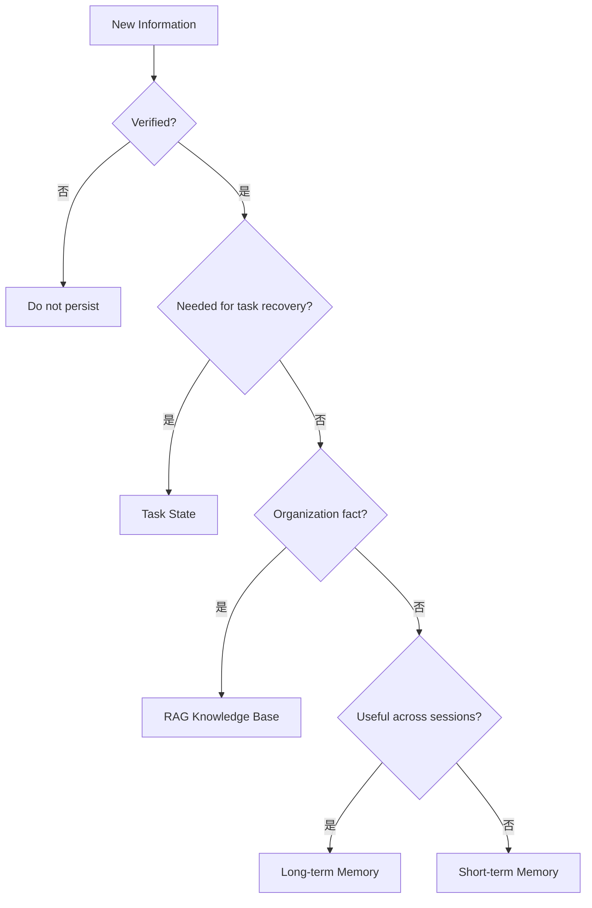

# AI Agent 工程（十九）：Agent Memory 类型

> Agent Memory 不是“把所有聊天记录都塞回上下文”。可靠系统要区分模型上下文、任务状态、短期记忆、长期记忆和组织知识库。

---

## 你会学到什么

- 区分五类容易混淆的数据。
- 判断信息应该进入状态、记忆还是 RAG。
- 识别 Memory 污染和越权风险。
- 为后续写入、检索和删除策略建立模型。

## 它解决什么问题

Agent 经常需要“记住”：

- 当前任务已经完成哪些步骤。
- 用户这轮对话的指代对象。
- 用户长期偏好中文和简洁回答。
- 组织制度规定的报销标准。
- 上一次相似任务的失败经验。

这些信息的生命周期、权限和一致性要求不同，不能放进同一个向量库。

| 类型 | 典型内容 | 生命周期 | 主要要求 |
|---|---|---|---|
| 模型上下文 | 当前 prompt 和工具 observation | 单次模型调用 | token 预算 |
| 任务状态 | step、evidence、stop_reason | 一次任务 | 一致性、可恢复 |
| 短期记忆 | 当前会话摘要、临时偏好 | 会话 | 相关性、过期 |
| 长期记忆 | 稳定用户偏好、历史经验 | 跨会话 | 同意、删除、审计 |
| RAG 知识库 | 制度、产品文档、手册 | 组织知识周期 | 版本、ACL、引用 |

## 最小示例

```python
from dataclasses import dataclass, field
from typing import Any


@dataclass
class TaskState:
    task_id: str
    goal: str
    step: int = 0
    evidence: list[dict[str, Any]] = field(default_factory=list)
    stop_reason: str | None = None


@dataclass
class SessionMemory:
    session_id: str
    summary: str
    active_entities: dict[str, str] = field(default_factory=dict)


@dataclass(frozen=True)
class LongTermMemory:
    memory_id: str
    user_id: str
    fact: str
    source: str
    expires_at: str | None
```

三个对象不能互换：任务恢复依赖 TaskState，代词解析使用 SessionMemory，跨会话偏好才进入 LongTermMemory。

## 工程化版本

写入前先分类：

| 信息类型 | 是否写入记忆 | 原因 | 删除策略 |
|---|---|---|---|
| 当前步骤编号 | 否，写任务状态 | 需要强一致恢复 | 任务归档时处理 |
| 本会话主题摘要 | 写短期记忆 | 减少上下文长度 | 会话过期删除 |
| 用户明确偏好中文 | 写长期记忆 | 跨会话稳定复用 | 用户可查看和删除 |
| 公司报销制度 | 否，写 RAG 知识库 | 属于组织事实 | 按文档版本治理 |
| 模型猜测的用户身份 | 否 | 未经用户确认 | 不保存 |

推荐路由：



## 常见失败模式

- 把任务状态存在向量库，恢复时出现多个相似版本。
- 把模型猜测当用户事实。
- 把组织制度写进个人 Memory。
- 长期记忆没有 source 和时间。
- 检索 Memory 时不做 user_id 和 tenant_id 过滤。
- 删除聊天记录后长期记忆仍然保留。

## 什么时候不要这么做

如果一次性任务不需要跨轮次信息，就不需要 Memory。

任务状态不能为了“统一检索”改成模糊语义搜索；它应该按 task_id 精确读取。

敏感信息没有明确用户同意和删除机制时，不应写入长期记忆。

## 生产环境注意事项

- 每条长期记忆带 user_id、tenant_id、source、created_at 和 expires_at。
- 记忆写入与读取分别授权。
- 任务状态和 Memory 使用不同存储与保留策略。
- Memory 检索结果视为不可信上下文，防止历史提示注入。
- 用户删除请求要覆盖索引、副本和缓存。

## 如何观测和评测

指标：

- Memory 写入率。
- 检索命中率和实际使用率。
- 过期记忆召回率。
- 用户纠正和删除率。
- 跨用户或跨租户泄露数。
- Memory 对任务完成率的真实提升。

## 和 RAG / 后端 / 前端的关系

- RAG 保存组织事实，Memory 保存用户或任务相关信息。
- 后端负责分类、权限、过期和删除。
- 前端应允许用户查看、纠正和删除长期记忆。
- Agent 只消费经过筛选的 Memory，不直接扫描全部历史。

## 面试怎么讲

> 我会区分模型上下文、任务状态、短期记忆、长期记忆和 RAG 知识库。任务状态要求强一致和按 task_id 恢复；组织事实进入带版本和 ACL 的 RAG；只有经确认、跨会话有价值的信息才进入长期记忆，并支持来源、过期和用户删除。

## 下一步

下一篇 [233 短期记忆](233.short-term-agent-memory-tutorial.md) 会设计会话摘要、活跃实体和上下文预算。
