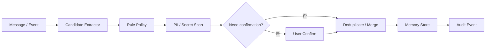

# AI Agent 工程（二十二）：Memory 写入策略

> Memory 写入应是受控管道：先提取候选，再经过规则、敏感检测和用户确认，最后才持久化。

---

## 你会学到什么

- 把 Memory 候选提取和真实写入分开。
- 设计规则优先的写入 Policy。
- 处理冲突、更新和重复记忆。
- 记录写入来源和审计事件。

## 它解决什么问题

如果模型可以直接写 Memory，它可能保存：

- 自己的猜测。
- Prompt Injection 中的恶意指令。
- API token 或身份证号。
- 只对当前任务有效的信息。
- 与已有偏好冲突的新记录。

因此模型最多生成候选，真正写入由 Policy 决定。

## 最小示例

```python
from pydantic import BaseModel, Field
from typing import Literal


class MemoryCandidate(BaseModel):
    category: Literal["preference", "profile", "experience"]
    content: str = Field(min_length=1, max_length=500)
    source_message_id: str
    explicit: bool
    useful_across_sessions: bool


def should_persist(candidate: MemoryCandidate) -> bool:
    return (
        candidate.explicit
        and candidate.useful_across_sessions
        and not contains_secret(candidate.content)
    )
```

## 工程化版本

写入决策表：

| 信息类型 | 是否写入记忆 | 原因 | 删除策略 |
|---|---|---|---|
| “以后默认用中文” | 是 | 用户明确且跨会话稳定 | 偏好变更或用户删除 |
| “这次只给摘要” | 否，写短期记忆 | 只对当前任务有效 | 会话结束 |
| “我可能是管理员” | 否 | 推测且涉及权限 | 不保存 |
| 已确认项目代号 | 是，可过期 | 后续任务可复用 | 项目结束自动过期 |
| Token、密码、私钥 | 否 | Secret | 立即阻断并告警 |

### 写入管道



### 冲突处理

同一 category 和 scope 只保留一个 active 值：

```python
def upsert_preference(candidate: MemoryCandidate, user_id: str) -> None:
    existing = memory_store.find_active(
        user_id=user_id,
        category=candidate.category,
    )
    if existing and existing.content != candidate.content:
        memory_store.expire(existing.memory_id, reason="superseded")
    memory_store.insert(candidate, user_id=user_id)
```

### 写入不阻塞主回答

低风险 Memory 可以异步写，但审计事件必须最终一致。需要用户确认的候选先进入 pending，不直接生效。

## 常见失败模式

- 提取模型直接拥有数据库写权限。
- 只按相似度去重，不按 category 和 scope。
- 冲突记录同时 active。
- 没有 source_message_id。
- 敏感检测只靠关键词。
- 删除旧记录后向量索引仍可召回。

## 什么时候不要这么做

没有跨会话收益时不要创建候选。

权限、身份、健康、财务等敏感推断不能自动写入。

用户明确说“不要记住”时，当前消息及其派生候选都应跳过。

## 生产环境注意事项

- Candidate Extractor 只输出结构化候选。
- Policy 版本写入审计。
- Secret 检测失败默认拒绝。
- pending 候选设置过期时间。
- 写入与向量索引更新使用 outbox。
- 用户撤销同意后停止后续写入。

## 如何观测和评测

监控：

- 每百条消息产生的候选数。
- Policy 拒绝原因。
- 用户确认接受率。
- 冲突与去重率。
- Secret/PII 拦截数。
- 写入到索引可见的延迟。

评测集包含显式偏好、临时要求、猜测、Secret 和 Prompt Injection。

## 和 RAG / 后端 / 前端的关系

- RAG 文档走内容治理，不走个人 Memory 写入管道。
- 后端 Policy 决定真实持久化。
- 前端展示待确认候选和当前 active Memory。
- Agent 不应因为 Memory 写入失败而伪装主任务失败。

## 面试怎么讲

> 模型只提取 MemoryCandidate，不能直接写库。后端 Policy 检查显式性、跨会话价值、敏感信息、冲突和用户同意，再 upsert 并写审计。临时信息进入短期状态，Secret 和权限推断拒绝持久化。

## 下一步

下一篇 [236 Memory 检索策略](236.memory-retrieval-policy-tutorial.md) 会控制何时召回、召回多少以及如何防止 Memory 注入。
