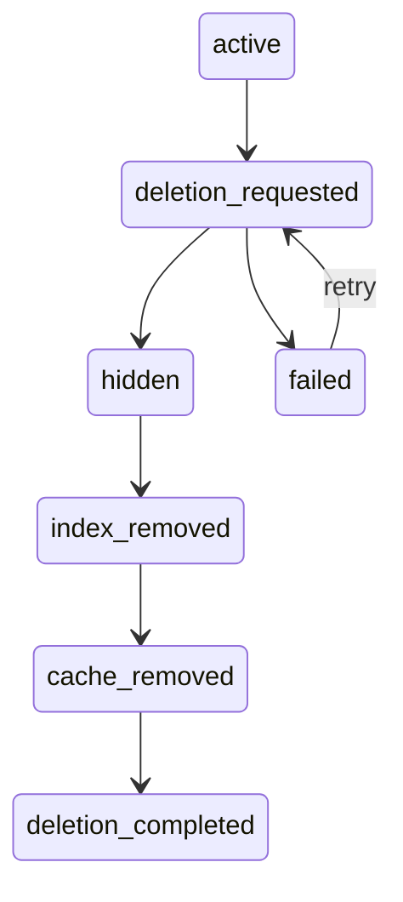

# AI Agent 工程（二十四）：Memory 隐私、纠正与删除

> 长期记忆一旦跨会话生效，就必须提供用户可见、可纠正、可删除的完整生命周期，而不是只做“新增”。

---

## 你会学到什么

- 设计 Memory 查看、纠正和删除接口。
- 区分逻辑删除、索引删除和备份保留。
- 处理用户撤回同意和租户迁移。
- 验证删除后的不可召回。

## 它解决什么问题

删除一条 Memory 可能涉及：

```text
主数据库
向量索引
缓存
搜索副本
审计记录
备份
离线评测数据
```

只把数据库字段设成 deleted，向量索引仍可能召回；只删向量，主记录和缓存仍可能使用。

## 最小示例

```python
from datetime import datetime


def delete_memory(memory_id: str, user: UserContext) -> None:
    record = memory_store.get(memory_id)
    if record.user_id != user.user_id or record.tenant_id != user.tenant_id:
        raise PermissionError("memory_not_owned")

    memory_store.mark_deleted(
        memory_id=memory_id,
        deleted_at=datetime.utcnow(),
        deleted_by=user.user_id,
    )
    outbox.publish(
        "memory.deleted",
        {"memory_id": memory_id, "user_id": user.user_id},
    )
```

消费者根据事件清理向量索引和缓存。

## 工程化版本

生命周期表：

| 信息类型 | 是否写入记忆 | 原因 | 删除策略 |
|---|---|---|---|
| 用户偏好 | 经同意写入 | 改善个性化 | 用户随时删除 |
| 项目上下文 | 可写且设置过期 | 跨会话协作 | 项目结束自动删除 |
| 敏感身份信息 | 默认不写 | 风险高 | 发现后立即清理 |
| Memory 审计事件 | 不作为模型记忆 | 合规追踪 | 按审计周期保留 |
| 已删除 Memory 向量 | 不允许保留可检索状态 | 防止再次召回 | 删除事件驱动清理 |

### 删除状态机



请求到达后先把记录标记 hidden，立即停止召回，再异步清理副本。

### 纠正

纠正不是覆盖审计历史：

```text
旧记录：expired，reason=user_corrected
新记录：active，source=user_confirmed
```

### 备份

备份通常不能立即物理修改，但恢复流程必须重新应用删除日志，确保已删除 Memory 不会复活。

## 常见失败模式

- 删除接口只能删当前数据库。
- 删除期间仍可被向量检索召回。
- 用户只能关闭“个性化”，不能查看具体记录。
- 纠正后旧记录仍 active。
- 备份恢复导致删除数据复活。
- 评测集长期保留真实用户 Memory。

## 什么时候不要这么做

不要承诺“立即从所有备份物理删除”如果基础设施做不到；应该准确说明立即停止使用、在线副本清理和备份到期策略。

审计日志不应包含完整 Memory 内容，只保留必要身份、操作和 hash。

## 生产环境注意事项

- 删除请求需要身份验证和资源归属校验。
- 在线检索立即隐藏。
- outbox 保证删除事件不丢失。
- 删除任务幂等。
- 建立 deletion_completed 状态和超时告警。
- 备份恢复后重放删除账本。
- 用户撤回同意后停止新写入。

## 如何观测和评测

指标：

- 删除请求完成时间。
- 删除失败和重试数。
- hidden 后仍被召回的次数。
- 纠正后冲突记录数。
- 备份恢复后的删除重放成功率。

自动测试：创建 Memory → 确认可召回 → 删除 → 确认数据库、索引和缓存均不可召回。

## 和 RAG / 后端 / 前端的关系

- RAG 文档删除有独立文档治理流程。
- 后端负责删除编排和副本清理。
- 前端提供 Memory 管理页面和完成状态。
- Agent 遇到已删除 memory_id 时忽略并记录异常召回。

## 面试怎么讲

> Memory 删除是跨主库、向量索引、缓存和备份恢复流程的数据生命周期。请求到达后先 hidden，立即停止召回，再用 outbox 异步清理副本；删除任务幂等并有完成状态。纠正通过旧记录失效和新记录生效实现，备份恢复要重放删除账本。

## 下一步

Memory 模块完成。下一篇 [238 Agentic RAG 架构](238.agentic-rag-architecture-tutorial.md) 会把 Query Planning、Retrieval Tool、Citation Verification 和 Bad Case Debugging 串成生产链路。
