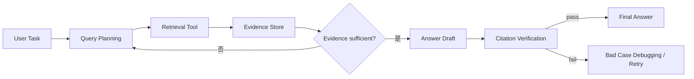

# AI Agent 工程（二十五）：Agentic RAG 生产架构

> [201 Agentic RAG](201.agentic-rag-tutorial.md) 介绍了概念和最小可控版本；这篇进一步设计生产链路：查询规划、检索工具、证据验证、状态持久化和失败调试。

---

## 你会学到什么

- 把 Agentic RAG 拆成独立可评测组件。
- 设计查询计划、检索 observation 和证据集合。
- 控制多步检索的预算与停止。
- 为引用验证和 bad case 回放预留数据。

## 它解决什么问题

普通 RAG 固定执行一次检索。Agentic RAG 根据任务和中间证据决定：

- 是否需要检索。
- 检索哪个数据源。
- 查询如何拆分。
- 证据是否足够。
- 是否需要业务工具补充。
- 最终引用能否验证。

本模块统一使用四个环节：**Query Planning、Retrieval Tool、Citation Verification、Bad Case Debugging**。

## 最小示例



结构化状态：

```python
from dataclasses import dataclass, field


@dataclass
class Evidence:
    evidence_id: str
    source: str
    page: int | None
    text: str
    score: float
    query_id: str


@dataclass
class AgenticRAGState:
    task: str
    queries: list[dict] = field(default_factory=list)
    evidence: list[Evidence] = field(default_factory=list)
    retrieval_calls: int = 0
    max_retrieval_calls: int = 4
    stop_reason: str | None = None
```

## 工程化版本

### Query Planner

输出结构化查询，不直接访问向量库。

```json
{
  "queries": [
    {
      "query_id": "q1",
      "text": "高级报表套餐要求",
      "source": "product_docs",
      "filters": {"version": "current"}
    }
  ]
}
```

### Retrieval Tool

检索器统一返回 evidence_id、source、page、text、score 和 query_id。ACL 在检索前应用。

### Evidence Store

按 evidence_id 去重，保存查询来源和版本。最终答案只能引用 Evidence Store 中的条目。

### Sufficiency Check

判断：

- 用户问题的每个子问题是否有证据。
- 证据是否来自当前版本。
- 是否存在冲突证据。
- 是否已经达到检索预算。

### Citation Verifier

逐句检查关键事实是否被引用支持，而不是只检查答案里有没有 `[1]`。

## 常见失败模式

- Planner 每轮生成同义查询。
- 不同检索源返回结构不一致。
- Evidence 丢失 query_id 和文档版本。
- 证据不足时仍强制生成答案。
- 引用编号存在，但内容不支持结论。
- Bad case 只保存最终答案，不保存查询和召回。

## 什么时候不要这么做

单一明确问题用普通 RAG 即可。

如果多步检索没有可量化收益，不要为了“Agentic”增加延迟。

当检索源没有 ACL 和版本治理时，先修基础 RAG。

## 生产环境注意事项

- 限制检索次数、top_k 和总 evidence 大小。
- 查询和 evidence 都带版本与 trace_id。
- 只读检索工具与写业务工具分开。
- 冲突证据触发人工或明确披露。
- 低置信度不自动扩展成无限网络搜索。

## 如何观测和评测

分层指标：

| 层 | 指标 |
|---|---|
| Query Planning | 子问题覆盖率、重复查询率 |
| Retrieval Tool | Recall、无结果率、ACL 拦截 |
| Evidence | 去重率、版本正确率、冲突率 |
| Citation Verification | 引用支持率、假引用率 |
| Bad Case Debugging | 根因分类覆盖率、修复回归率 |

## 和 RAG / 后端 / 前端的关系

- 复用现有 RAG 解析、索引和重排能力。
- 后端编排查询预算、状态和验证。
- 前端展示多来源证据和“资料不足”状态。
- Agent 只决定下一步检索建议，权限和过滤仍由后端执行。

## 面试怎么讲

> 生产 Agentic RAG 应拆成 Query Planning、Retrieval Tool、Evidence Store、Sufficiency Check 和 Citation Verification。每条 evidence 保留 query、source、page、版本和 ACL 上下文。多步检索有预算，答案只能引用 Evidence Store，bad case 保存完整查询与召回轨迹。

## 下一步

下一篇 [239 Query Planning](239.query-planning-rag-agent-tutorial.md) 深入查询拆解、数据源选择和计划校验。
