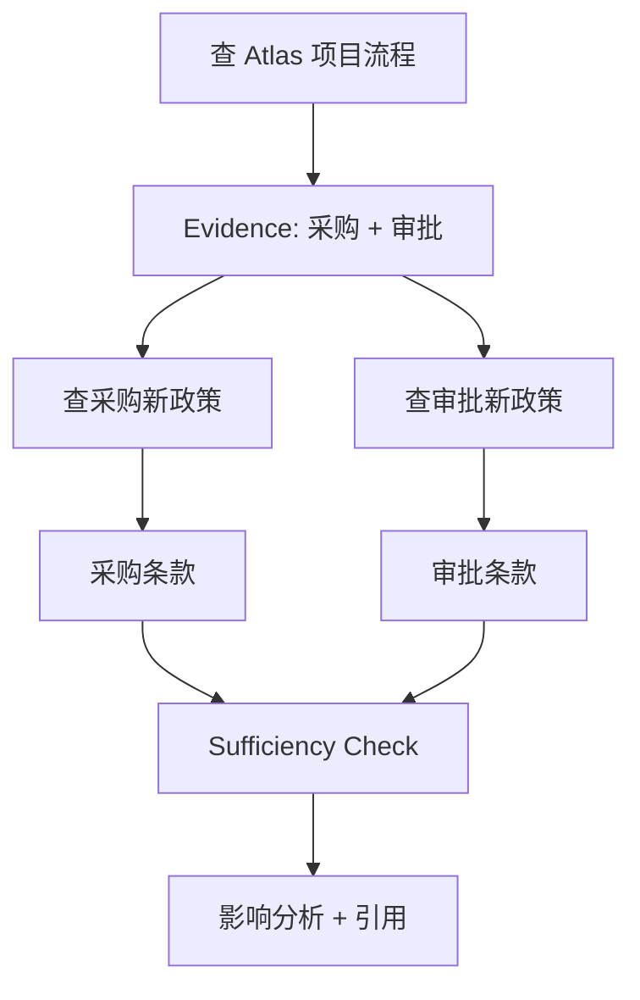

# AI Agent 工程（二十七）：多步检索

> 多步检索的关键是后一步查询由前一步证据决定。它不是一次生成十个 query 并行搜索，而是逐步减少未知信息。

---

## 你会学到什么

- 区分并行多查询和依赖式多步检索。
- 保存每一步查询、证据和未解决问题。
- 检测重复检索和证据饱和。
- 在预算内停止或请求用户补充。

## 它解决什么问题

示例：

```text
“新政策对 Atlas 项目有什么影响？”
```

第一步先查 Atlas 项目使用哪些流程；第二步根据流程名检索新政策条款；第三步才对比影响。后续 query 依赖前一步 evidence。

完整工程坐标：**Query Planning、Retrieval Tool、Citation Verification、Bad Case Debugging**。

## 最小示例

```python
from dataclasses import dataclass, field


@dataclass
class RetrievalStep:
    query_id: str
    query: str
    depends_on: list[str]
    evidence_ids: list[str] = field(default_factory=list)
    unresolved: list[str] = field(default_factory=list)


def next_query(state: AgenticRAGState) -> str | None:
    if state.retrieval_calls >= state.max_retrieval_calls:
        return None
    if not state.unresolved_questions:
        return None
    return planner.plan_next(
        goal=state.task,
        evidence=state.evidence,
        unresolved=state.unresolved_questions,
    )
```

## 工程化版本



### Evidence 驱动查询

Planner 输入只包含已验证 evidence 摘要和 unresolved questions。模型生成的未经验证实体不能直接成为资源 ID。

### 去重

```python
def retrieval_fingerprint(source: str, query: str, filters: dict) -> str:
    canonical = {
        "source": source,
        "query": normalize(query),
        "filters": sorted(filters.items()),
    }
    return stable_hash(canonical)
```

相同 fingerprint 不再次执行。

### Evidence 饱和

如果新增 evidence 全部与已有内容重复，连续两轮无新信息，就停止并报告不足。

### 证据冲突

旧版和新版政策冲突时，不自动选择相似度更高的文档；根据 effective_date 和 version 处理，无法判断时披露冲突。

## 常见失败模式

- 所有 query 在开始时一次生成，无法利用 observation。
- 后一步使用模型猜测而非 evidence。
- 不记录 query → evidence 映射。
- 同义改写绕过去重。
- 证据重复仍继续检索。
- 达到预算后编造缺失结论。

## 什么时候不要这么做

几个子问题互不依赖时可并行检索，不需要多轮 Agent。

单步检索已经稳定满足时，多步只会增加延迟。

检索源没有版本和时间字段时，先补数据治理。

## 生产环境注意事项

- 每一步独立超时，但共享总预算。
- Evidence Store 按 evidence_id 去重。
- 记录依赖 query_id。
- 并行只用于无数据依赖的只读查询。
- 用户取消后停止未开始步骤。

## 如何观测和评测

指标：

- 平均检索步数。
- 每步新增 evidence 数。
- 重复 fingerprint 拦截数。
- evidence 饱和停止率。
- 多步相对单步的 Recall 和任务完成率提升。
- Citation Verification 通过率。

Bad Case Debugging 要定位失败发生在计划、某一步 Retrieval Tool，还是最终证据组合。

## 和 RAG / 后端 / 前端的关系

- RAG 负责每一步可靠召回。
- 后端维护 query/evidence DAG 和预算。
- 前端可展示“正在补充哪类证据”，不展示内部自由推理。
- Citation Verification 根据依赖链解释答案来源。

## 面试怎么讲

> 多步检索要求后续 query 基于前一步已验证 evidence，状态中保存 query_id、depends_on、evidence_ids 和 unresolved questions。我会用规范化 fingerprint 去重，用 evidence 饱和检测停止，并让所有步骤共享总检索预算。

## 下一步

下一篇 [241 Tool-Augmented RAG](241.tool-augmented-rag-tutorial.md) 会把文档证据与业务系统实时数据组合起来。
