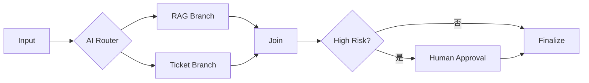

# AI Agent 工程（三十一）：Agent Workflow 模式

> 生产 Agent 通常不是一个无限自主循环，而是被放进确定性 Workflow：只有少数节点使用模型，其他节点由状态机、工具和人工确认控制。

---

## 你会学到什么

- 区分自由 Agent、AI Workflow 和混合架构。
- 设计确定性外壳与 Agent 节点。
- 处理状态、转换、暂停和恢复。
- 选择串行、路由、并行和审批模式。

## 它解决什么问题

企业任务往往既有确定步骤，也有语义判断：

```text
上传文档 → 解析 → 审核分类 → 建索引 → 通知用户
```

解析、建索引和通知是确定步骤；“审核分类”可能需要模型。让模型每次重新规划整个流程没有必要。

本模块统一术语：**State、Transition、Checkpoint、Resume、Human Approval**。

## 最小示例

```python
from dataclasses import dataclass
from typing import Literal


Status = Literal[
    "created",
    "classifying",
    "indexing",
    "waiting_for_approval",
    "completed",
    "failed",
]


@dataclass
class WorkflowState:
    task_id: str
    status: Status
    document_id: str
    category: str | None = None
    error: str | None = None
```

```python
def next_step(state: WorkflowState) -> WorkflowState:
    if state.status == "created":
        state.status = "classifying"
    elif state.status == "classifying" and state.category:
        state.status = "indexing"
    elif state.status == "indexing":
        state.status = "completed"
    return state
```

模型只参与 category 决策，不决定索引和通知顺序。

## 工程化版本

### 四种常用模式

| 模式 | 适合场景 |
|---|---|
| Sequential | 固定顺序处理 |
| Router | 根据语义选择有限分支 |
| Parallel Read | 并行查询多个只读来源 |
| Human Gate | 高风险动作前暂停 |



### Agent 节点契约

每个 Agent 节点有明确输入、输出、工具和预算：

```json
{
  "node": "classify_request",
  "allowed_tools": [],
  "max_steps": 1,
  "output_schema": {
    "category": "billing | product | security",
    "confidence": "0..1"
  }
}
```

## 常见失败模式

- 把整个 Workflow 塞进一个 Agent prompt。
- State 只有自由文本，无法做 Transition。
- 失败后从头重跑所有节点。
- 并行执行共享写资源。
- Human Approval 后重新生成参数。
- Workflow 版本升级后旧任务无法 Resume。

## 什么时候不要这么做

极简单的单次问答不需要 Workflow。

流程完全动态、无法定义任何稳定节点时，可先做只读 Agent PoC，但仍需要停止条件。

不要把“用图框架”误认为已经获得可靠执行；持久化和幂等仍需实现。

## 生产环境注意事项

- State 使用结构化 schema 和 version。
- 每个 Transition 都有允许来源和目标。
- 节点完成后保存 Checkpoint。
- Resume 读取原 Workflow 版本。
- 写节点使用幂等键。
- Human Approval 绑定不可变参数。

## 如何观测和评测

指标：

- 各节点成功率和 P95 延迟。
- Transition 失败率。
- Checkpoint 写入失败。
- Resume 成功率。
- Human Approval 等待时间。
- Agent 节点相对规则节点的增益。

## 和 RAG / 后端 / 前端的关系

- RAG 作为只读节点或工具。
- 后端 Workflow 管理 State 和 Transition。
- 前端展示节点进度、等待和失败。
- Agent 节点只处理语义不确定性。

## 面试怎么讲

> 生产 Agent 常用确定性 Workflow 包裹模型节点。State 和 Transition 由后端定义，Agent 节点有明确输入输出、工具白名单和预算；节点后写 Checkpoint，Human Approval 时暂停，Resume 使用原版本和批准参数。固定流程不让模型重复规划。

## 下一步

下一篇 [245 状态机 Agent](245.state-machine-agent-tutorial.md) 会把状态和转换规则设计得更严格。
