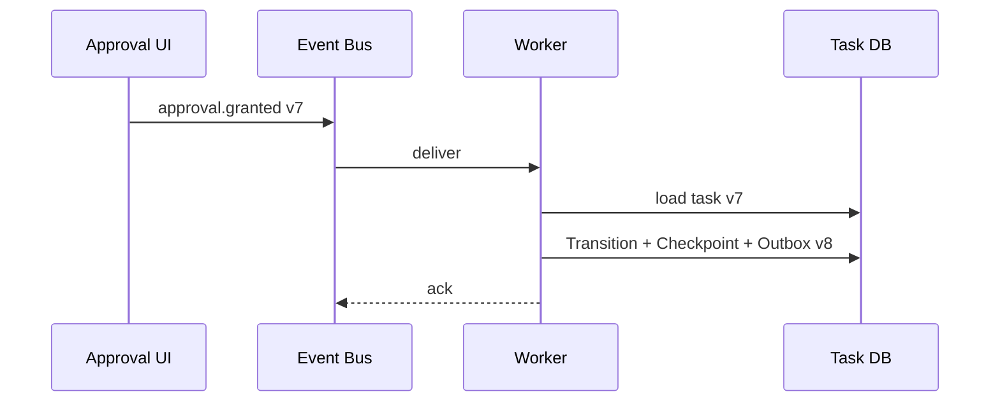

# AI Agent 工程（三十六）：事件驱动 Agent 架构

> 事件让 Agent 与业务系统解耦：任务创建、工具完成、审批决定和超时都通过稳定事件推进状态，而不是依赖一个进程持续轮询。

---

## 你会学到什么

- 设计 Agent 领域事件。
- 使用 outbox 保证状态与事件一致。
- 处理重复、乱序和过期事件。
- 用 correlation_id 串联完整任务。

## 它解决什么问题

Agent 需要接收：

- 用户创建任务。
- 异步工具回调。
- Human Approval 决定。
- 超时事件。
- 用户取消。

统一术语：**State、Transition、Checkpoint、Resume、Human Approval**。

## 最小示例

```json
{
  "event_id": "EV-1001",
  "event_type": "agent.approval.granted",
  "task_id": "TASK-901",
  "state_version": 7,
  "occurred_at": "2026-07-22T13:00:00+08:00",
  "payload": {
    "approval_id": "APR-88",
    "approved_by": "U-7"
  }
}
```

消费者：

```python
def handle_event(event: AgentEvent) -> None:
    if event_store.processed(event.event_id):
        return

    task = task_repository.get(event.task_id)
    transition = state_machine.apply(task, event)
    task_repository.save_with_outbox(transition)
    event_store.mark_processed(event.event_id)
```

## 工程化版本

### 事件类型

```text
agent.task.created
agent.step.completed
agent.tool.failed
agent.approval.requested
agent.approval.granted
agent.approval.rejected
agent.task.cancelled
agent.task.timed_out
agent.task.completed
```

### Outbox

状态更新和 outbox 记录放在同一数据库事务，异步发布器再投递事件，避免“状态已变但事件丢失”。

### 幂等消费者

使用 event_id 去重。业务写操作还需要自己的 idempotency_key。

### 乱序

事件携带 state_version。版本小于当前任务时通常忽略；版本超前时延迟重试或告警。



## 常见失败模式

- 事件没有 event_id。
- payload 直接塞完整敏感对象。
- 状态更新和发事件不一致。
- 重复事件重复执行写工具。
- 旧 Human Approval 事件推进新版本任务。
- 消费失败无限重试，没有死信。

## 什么时候不要这么做

单体同步流程不需要事件总线。

不要为了“解耦”把每个函数调用都变成事件；只在跨进程、长等待或独立消费者边界使用。

## 生产环境注意事项

- 事件 schema 版本化。
- payload 最小化并脱敏。
- 使用 correlation_id、task_id、trace_id。
- 消费者幂等。
- 死信队列有告警和重放工具。
- Human Approval 校验 task/version/argument_hash。
- Resume 只响应合法 Transition。

## 如何观测和评测

指标：

- 发布和消费延迟。
- 重复事件率。
- 乱序事件率。
- 死信数量。
- outbox 堆积。
- State Transition 失败。
- Checkpoint 与事件版本不一致。

## 和 RAG / 后端 / 前端的关系

- RAG 批处理完成可发布 evidence.ready。
- 后端事件消费者推进状态机。
- 前端订阅用户可见事件。
- Human Approval UI 发布带身份的决定事件。

## 面试怎么讲

> 事件驱动 Agent 用领域事件推进 State Transition。状态更新和 outbox 同事务，消费者按 event_id 幂等，并用 state_version 处理乱序。Human Approval 和工具回调都作为事件触发 Resume；payload 最小化，失败进入死信并可重放。

## 下一步

Workflow 模块完成。下一篇 [250 企业知识库 Agent 项目](250.build-knowledge-base-agent-tutorial.md) 会把前面所有能力组合成第一套完整项目。
