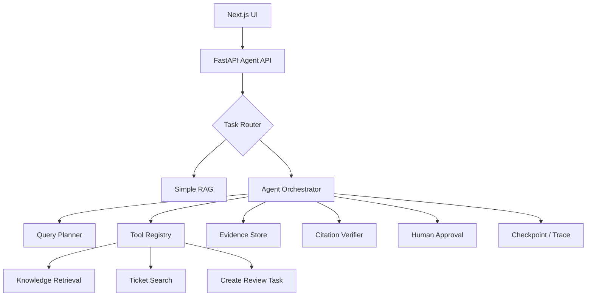

# AI Agent 工程（三十七）：构建企业知识库 Agent

> 这个项目把 Tool Calling、Agent Loop、Memory、Agentic RAG、Workflow、Human Approval 和 Trace 组合成一条完整主线。

---

## 项目目标

实现一个企业内部知识库 Agent：

- 普通知识问题走单步 RAG。
- 复杂问题先 Query Planning，再多步检索。
- 能查询用户可见的制度、产品文档和工单摘要。
- 关键结论带可定位引用。
- 需要创建复核任务时请求人工确认。
- 全程记录工具、证据、停止原因和成本。

## 你会学到什么

- 组合前面 214–249 的核心能力。
- 设计路由、检索、工具和审批边界。
- 实现任务状态和后台执行。
- 建立最小离线评测集。

## 它解决什么问题

普通知识库只能回答文档问题，不能处理：

```text
“对比新版和旧版差旅制度，说明影响了哪些报销流程；
如果存在冲突，帮我创建复核任务。”
```

这需要多版本检索、冲突检测、引用验证和受控写工具。

## 最小示例

```python
def route_task(request: AgentRequest) -> str:
    if request.requires_action:
        return "agent_workflow"
    if request.requires_multiple_sources:
        return "agentic_rag"
    return "simple_rag"


def answer_simple(question: str, user: UserContext) -> Answer:
    evidence = search_knowledge_base(
        query=question,
        acl=user.document_acl,
        top_k=5,
    )
    return generate_verified_answer(question, evidence)
```

先让单步问题保持简单，只有真正复杂的问题进入 Agent Loop。

## 系统架构



## 数据流

1. API 从认证上下文加载 user_id、tenant_id 和文档 ACL。
2. Router 判断 simple_rag 或 agent_workflow。
3. Query Planner 生成受限查询计划。
4. Retrieval Tool 在 ACL 范围内检索。
5. Evidence Store 去重并保留版本、source 和 page。
6. Citation Verification 检查 claims。
7. 写工具生成 Approval Request。
8. 用户批准后 Resume 并用幂等键创建复核任务。

## 工具设计

| 工具 | 风险 | 输入 | 输出 |
|---|---|---|---|
| search_knowledge_base | read | query、filters、top_k | evidence 列表 |
| get_document_versions | read | document_id | 版本元数据 |
| search_review_tasks | read | document_id | 已有复核任务 |
| create_review_task | write | title、evidence_ids | task_id |

`create_review_task` 需要 Human Approval 和 idempotency_key。

## 工程化版本

推荐状态：

```python
class KnowledgeAgentState(BaseModel):
    task_id: str
    user_id: str
    tenant_id: str
    goal: str
    route: str
    query_plan: list[dict] = []
    evidence_ids: list[str] = []
    claims: list[dict] = []
    pending_approval_id: str | None = None
    stop_reason: str | None = None
```

后端按 task_id 持久化；模型只收到必要 evidence 摘要。

## 权限与确认

- ACL 在检索前过滤。
- tenant_id 由后端注入。
- 模型不能查询不可见文档是否存在。
- 创建复核任务前展示标题、范围和证据。
- 批准后执行原参数，不重新生成。
- 任务创建使用 approval_id 派生幂等键。

## 常见失败模式

- 所有问题都进入多步 Agent。
- 新旧文档未按版本过滤。
- 引用只有文件名，没有 page 或 section。
- 复核任务重复创建。
- 前端只展示最终答案，不展示资料不足。
- bad case 缺 query 和 evidence。

## 什么时候不要这么做

FAQ 和单文档查询继续使用普通 RAG。

知识库没有版本、ACL 和引用定位时，先完善基础设施。

如果复核任务没有审批和幂等，不提供写工具。

## 生产环境注意事项

- Simple RAG 与 Agent 路径分别监控。
- Agent 路径限制检索和工具预算。
- 长任务返回 task_id。
- Evidence 和 Trace 按租户隔离。
- 文档更新后运行回归集。
- 工具失败时允许部分回答并披露缺失。

## 评测与观测

准备至少四类案例：

1. 单文档事实问答。
2. 多文档对比。
3. 新旧版本冲突。
4. 需要创建复核任务。

每个案例定义 expected_tools、expected_evidence、forbidden_actions 和 expected_stop_reason。

## 如何观测和评测

指标：

- Simple RAG 路由准确率。
- Query Planning 覆盖率。
- Retrieval Recall。
- Citation support rate。
- 复核任务重复率。
- Human Approval 批准率。
- 单任务成本和 P95 延迟。

## 和 RAG / 后端 / 前端的关系

- RAG 是证据核心。
- 后端提供 Workflow、Policy、Checkpoint 和工具。
- 前端展示进度、引用和 Approval。
- Agent 负责动态选择，不能绕过确定性边界。

## 面试怎么讲

> 我把企业知识库 Agent 分为 Simple RAG 和 Agentic 路径，避免所有问题都进入循环。复杂路径使用 Query Planning、ACL Retrieval、Evidence Store 和 Citation Verification；写工具进入 Human Approval，批准参数不可变且幂等。评测同时看路由、工具、证据和最终答案。

## 下一步

下一篇 [251 研究 Agent](251.build-research-agent-tutorial.md) 会处理更长时间、多来源和可恢复的资料研究任务。
