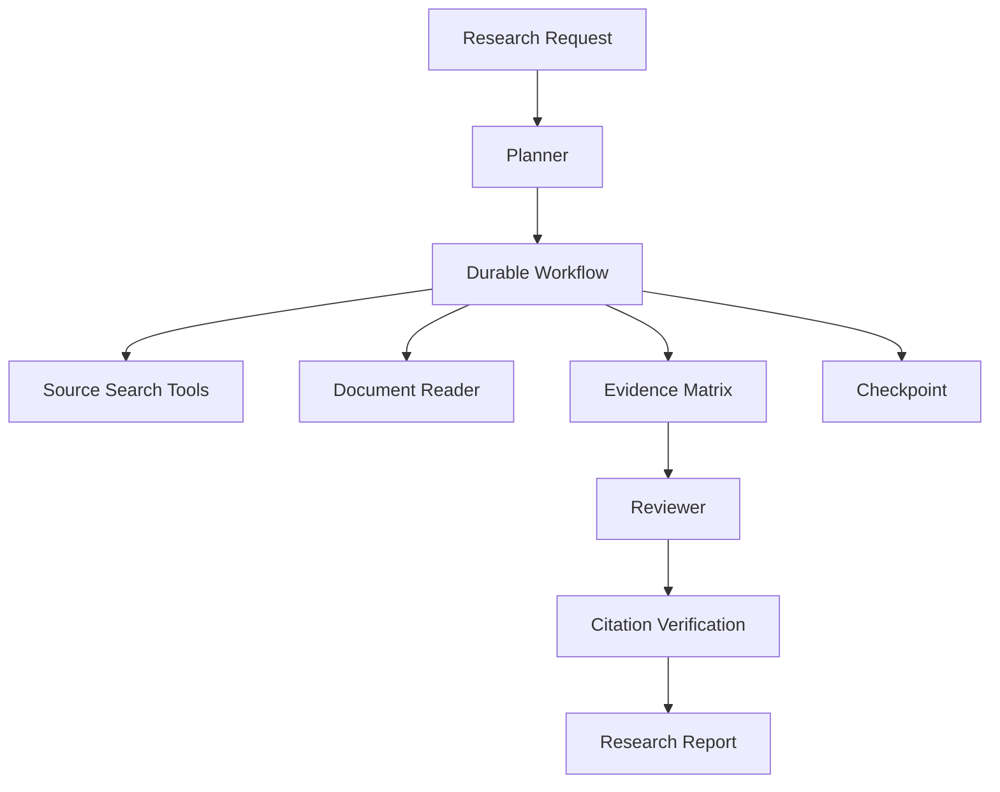

# AI Agent 工程（三十八）：构建研究 Agent

> 研究 Agent 的目标不是“搜索很多网页”，而是把研究问题拆成可验证子问题，维护证据矩阵，并在预算内生成带来源结论。

---

## 项目目标

实现一个内部研究 Agent：

- 接受明确主题、范围、时间和输出格式。
- 生成结构化研究计划。
- 查询受允许的内部与外部来源。
- 为每个结论维护证据和反证。
- 支持后台执行、取消和 Resume。
- 输出研究摘要、引用和未解决问题。

## 你会学到什么

- 设计长期研究任务。
- 管理多来源证据和冲突。
- 使用 Plan-and-Execute 与 Durable Execution。
- 控制搜索范围、成本和来源质量。

## 它解决什么问题

人工研究容易漏来源，普通一次性 RAG 又难以处理：

```text
“整理过去一年向量数据库在多租户隔离方面的方案，
对比至少三类实现，并说明适用条件和未解决风险。”
```

任务需要拆解、来源筛选、证据矩阵和最终综合。

## 最小示例

```python
class ResearchRequest(BaseModel):
    topic: str
    scope: str
    date_from: date
    date_to: date
    max_sources: int = Field(default=20, ge=3, le=50)
    output_language: Literal["zh-CN", "en"] = "zh-CN"


class ResearchQuestion(BaseModel):
    id: str
    question: str
    expected_evidence: str
```

## 系统架构



## 数据流

1. 校验主题、范围和日期。
2. Planner 生成 3–8 个研究问题。
3. Workflow 为每个问题搜索候选来源。
4. Reader 提取带位置证据。
5. Evidence Matrix 记录支持、反对和不确定。
6. Reviewer 检查覆盖和冲突。
7. Citation Verification 后生成报告。

## 工具设计

| 工具 | 作用 | 约束 |
|---|---|---|
| search_internal_sources | 搜内部资料 | ACL |
| search_allowed_web | 搜允许域名 | 域名、日期、次数 |
| read_source | 提取正文 | 最大长度 |
| extract_claims | 提取候选结论 | 不写业务数据 |
| save_research_note | 保存证据 | 幂等 |

搜索工具不得默认访问任意站点或登录态资源。

## 工程化版本

Evidence Matrix：

```json
{
  "question_id": "q2",
  "claim": "namespace 隔离适合逻辑多租户",
  "supporting_evidence_ids": ["src-7:p12"],
  "contradicting_evidence_ids": ["src-9:p4"],
  "confidence": "medium",
  "open_questions": ["大规模租户数量下的索引成本"]
}
```

每完成一个研究问题写 Checkpoint。外部搜索失败不应丢失已完成问题。

## 权限与确认

- 内部资料按 ACL 检索。
- 外部来源使用域名白名单。
- 不自动上传内部文档到外部服务。
- 报告发布到共享空间前请求确认。
- 引用敏感内部来源时按读者权限裁剪。

## 常见失败模式

- 计划问题互相重复。
- 只收集支持证据。
- 搜索结果标题被当作正文证据。
- 来源日期不在范围。
- 长任务没有 Checkpoint。
- 报告引用用户不可访问的内部资料。

## 什么时候不要这么做

只需查一个明确事实时普通检索更快。

需要法律、医疗或财务最终判断时，Agent 只能整理资料，必须由专业人员确认。

来源无法验证时不要生成确定结论。

## 生产环境注意事项

- 总来源数、搜索次数和 token 有预算。
- 来源正文存储遵守版权和保留策略。
- 记录抓取时间和内容 hash。
- 长任务可取消。
- Workflow 版本和模型版本进入报告元数据。
- 对外分享前做敏感检查。

## 评测与观测

评测计划覆盖率、来源质量、证据支持、反证覆盖和引用可访问性。

研究型任务必须人工抽检，不能只用答案相似度。

## 如何观测和评测

指标：

- 研究问题覆盖率。
- 每个 claim 平均证据数。
- 反证发现率。
- 无效来源率。
- Checkpoint / Resume 成功率。
- 单报告成本和耗时。

## 和 RAG / 后端 / 前端的关系

- RAG/搜索提供来源。
- 后端 Durable Workflow 管理长任务。
- 前端展示研究计划、进度和可取消状态。
- Agent 输出 evidence matrix，不只输出文章。

## 面试怎么讲

> 研究 Agent 使用 Plan-and-Execute，把主题拆成有 expected_evidence 的研究问题。每条 claim 放入 Evidence Matrix，记录支持、反证和 open questions。长任务用 Checkpoint 和 Resume，搜索有域名、日期和成本预算；报告经过引用验证和人工发布确认。

## 下一步

下一篇 [252 客服 Agent](252.build-customer-support-agent-tutorial.md) 会组合客户状态、制度、工单和人工转接。
