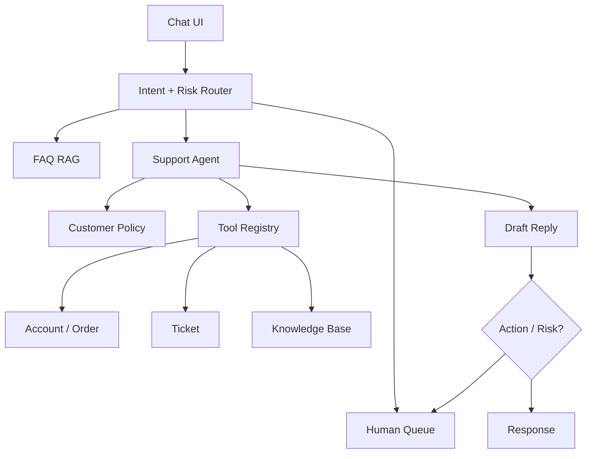

# AI Agent 工程（三十九）：构建客服 Agent

> 客服 Agent 的第一目标不是减少人工，而是在正确权限下收集证据、生成可靠建议，并在不确定或高风险时顺畅转人工。

---

## 项目目标

实现一个客服 Agent：

- 识别产品、账单、权限和安全问题。
- 查询客户套餐、订单、历史工单和知识库。
- 生成带证据的答复草稿。
- 低风险 FAQ 可自动回复。
- 补偿、退款和权限修改必须人工确认。
- 失败时把完整上下文转给客服。

## 你会学到什么

- 设计客户域工具。
- 组合 RAG 与实时业务状态。
- 建立风险路由和人工接管。
- 评测解决率、误操作和用户体验。

## 它解决什么问题

客服问题通常跨多个系统。用户说“我又被扣费了”，系统需要查订单、订阅、支付状态、退款政策和历史工单，而不是只用知识库回答。

## 最小示例

```python
class SupportIntent(BaseModel):
    category: Literal["product", "billing", "permission", "security", "unknown"]
    urgency: Literal["normal", "high"]
    requires_account_data: bool
    requires_human: bool


def route_support(intent: SupportIntent) -> str:
    if intent.category == "security" or intent.requires_human:
        return "human_queue"
    if intent.requires_account_data:
        return "support_agent"
    return "faq_rag"
```

## 系统架构



## 数据流

1. 从认证会话获取 customer_id 和 tenant_id。
2. Intent Router 判断类别与风险。
3. FAQ 走普通 RAG。
4. 账户问题调用只读工具。
5. Agent 组合业务状态和政策证据。
6. 生成答复草稿和建议动作。
7. 写动作转 Approval 或 Human Queue。

## 工具设计

| 工具 | 风险 |
|---|---|
| get_customer_plan | read |
| list_orders | read |
| get_payment_status | read |
| search_support_policy | read |
| list_tickets | read |
| create_ticket | write |
| create_refund | critical |
| change_permission | critical |

critical 工具不能直接出现在普通客服 Agent 工具列表中。

## 工程化版本

转人工包：

```json
{
  "customer_id": "C-18",
  "intent": "billing",
  "summary": "用户反馈重复扣费",
  "verified_facts": [
    "订单 ORD-91 支付成功",
    "存在另一笔相同金额支付"
  ],
  "evidence_ids": ["payment-91", "payment-92", "policy-7"],
  "attempted_tools": ["list_orders", "get_payment_status"],
  "reason": "potential_duplicate_charge"
}
```

人工不需要重新询问所有信息。

## 权限与确认

- customer_id 由认证上下文确定。
- 工具只返回必要字段。
- 支付与安全问题默认提高风险等级。
- 退款、补偿、权限修改强制 Human Approval。
- 用户不能通过 prompt 请求 Agent 切换到其他客户。

## 常见失败模式

- 用 RAG 猜订单状态。
- 自动承诺退款但未执行。
- 把“建议动作”显示成“已完成”。
- 转人工时不携带证据。
- 客服 Agent 使用管理员账号。
- 情绪强烈被误判为事实高置信。

## 什么时候不要这么做

账户被盗、支付争议、法律投诉和高价值客户升级应快速转人工。

身份尚未验证时，只回答公开政策，不查询账户数据。

系统没有客户级权限过滤时不接业务工具。

## 生产环境注意事项

- 明确“草稿、待确认、已执行”状态。
- 敏感数据在模型上下文中脱敏。
- 统一语气但不掩盖不确定性。
- 每次工具访问写审计。
- 维护高风险关键词之外的规则与模型双路由。
- 提供用户随时转人工入口。

## 评测与观测

评测 Intent、工具选择、政策忠实、转人工时机、动作安全和最终解决率。

错误自动退款比低自动解决率严重得多，应使用风险加权指标。

## 如何观测和评测

指标：

- 一次解决率。
- 转人工率和合理率。
- 工具调用准确率。
- 未授权访问拦截。
- 错误承诺率。
- Approval 拒绝率。
- 客户等待时间。

## 和 RAG / 后端 / 前端的关系

- RAG 解释政策。
- 后端工具提供实时客户状态。
- 前端区分草稿、执行和转人工。
- Agent 组合信息并生成建议，不拥有超级权限。

## 面试怎么讲

> 客服 Agent 使用风险路由：FAQ 走 RAG，账户问题进入只读 Agent，安全、支付争议和写动作转人工。customer_id 来自认证上下文，政策证据与业务状态分开。转人工包包含已验证事实、证据和已尝试工具，避免重复沟通。

## 下一步

下一篇 [253 代码审查 Agent](253.build-code-review-agent-tutorial.md) 会把工具权限换成仓库、diff 和评论发布边界。
