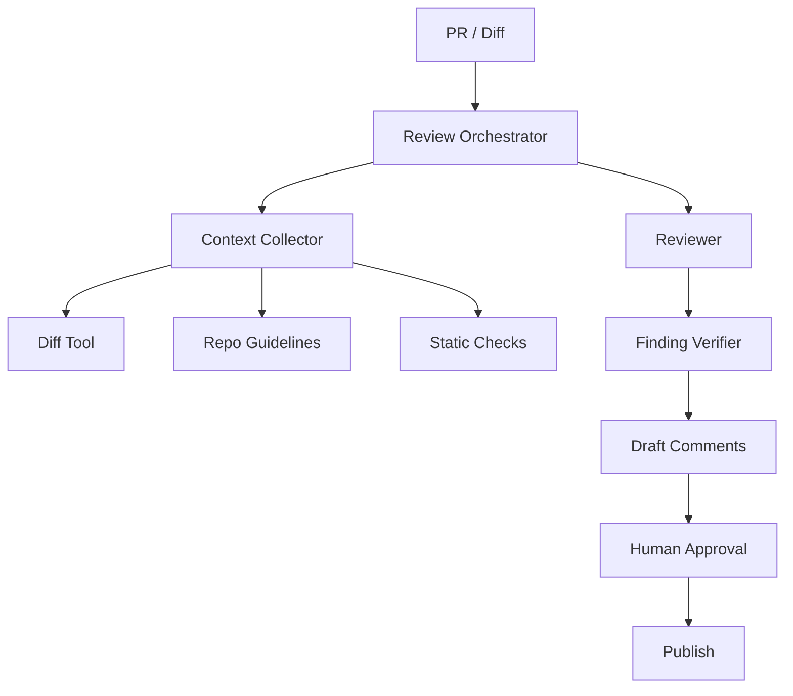

# AI Agent 工程（四十）：构建代码审查 Agent

> 代码审查 Agent 应先成为“证据充分的审查助手”，而不是自动修改或合并代码。它需要读取 diff、调用静态检查、定位行号并生成可验证评论。

---

## 项目目标

实现一个代码审查 Agent：

- 读取指定仓库和 PR 的 diff。
- 按语言和框架选择检查工具。
- 结合仓库规范识别缺陷。
- 只输出有文件、行号和证据的评论。
- 默认生成草稿，由人确认后发布。
- 不自动合并、不读取仓库外文件、不执行不可信代码。

## 你会学到什么

- 把代码、diff、测试和规范包装成工具。
- 管理工作区权限和命令白名单。
- 设计 Reviewer / Verifier 流程。
- 评测评论准确率和噪声。

## 它解决什么问题

大 PR 容易漏掉：

- 边界条件。
- 权限和租户过滤。
- 错误处理。
- 测试缺口。
- 与项目约定不一致的实现。

Agent 可以整理证据，但不能凭风格偏好制造大量低价值评论。

## 最小示例

```python
class ReviewFinding(BaseModel):
    title: str
    file: str
    line: int
    severity: Literal["high", "medium", "low"]
    evidence: str
    impact: str
    suggestion: str


def validate_finding(finding: ReviewFinding, diff: DiffIndex) -> None:
    if not diff.contains_changed_line(finding.file, finding.line):
        raise ValueError("finding_not_on_changed_line")
```

## 系统架构



## 数据流

1. 确认仓库、分支和 PR 身份。
2. 获取变更文件和 diff。
3. 只读取相关代码、测试和规范。
4. 运行白名单静态检查。
5. Reviewer 生成结构化 finding。
6. Verifier 检查文件、行号、证据和重复。
7. 用户批准后发布评论。

## 工具设计

| 工具 | 风险 | 限制 |
|---|---|---|
| get_diff | read | 指定 PR |
| read_repo_file | read | 仓库根目录内 |
| search_code | read | 限定仓库 |
| run_static_check | execute | 命令白名单、超时 |
| list_tests | read | 不运行不可信测试 |
| publish_comment | write | Human Approval |

不要给模型通用 shell 工具。

## 工程化版本

上下文预算按变更切分：

```text
PR summary
  → file-level diff
  → related symbols
  → relevant tests
  → repository rules
```

Finding Verifier 检查：

- 行号属于 diff。
- 引用代码真实存在。
- 影响描述可复现。
- suggestion 不引入更大风险。
- 与已有 finding 不重复。

## 权限与确认

- 工作区固定在目标仓库。
- 文件路径解析后必须位于仓库根。
- 命令使用数组白名单，不拼接 shell 字符串。
- Secret 文件默认不可读。
- 评论先草稿后确认。
- merge、push、修改文件使用独立权限，不在审查 Agent 默认范围。

## 常见失败模式

- 评论不在变更行。
- 把风格偏好当 bug。
- 不运行或不读取测试就声称测试失败。
- 读取仓库外路径。
- 自动执行 PR 中新增脚本。
- 一处根因生成多条重复评论。

## 什么时候不要这么做

小型、低风险、已有强静态检查的变更不需要复杂 Agent。

安全关键代码不能只依赖 AI 审查。

没有仓库隔离和命令沙箱时，不运行代码。

## 生产环境注意事项

- 每次审查固定 commit SHA。
- diff 更新后旧评论重新验证。
- 工具读取记录审计。
- 静态检查有 CPU、内存和时间限制。
- Prompt Injection 注释作为不可信代码内容处理。
- 默认不向外部模型发送私有代码，按组织政策选择部署。

## 评测与观测

建立真实历史缺陷集，评测：

- 缺陷召回。
- 评论准确率。
- 无效评论率。
- 重复评论率。
- 行号正确率。
- 人工接受率。

## 如何观测和评测

线上监控每次审查读取文件数、工具调用、耗时、token、finding 数、批准/拒绝和后续解决状态。

高评论数量不是成功指标；应优化“被开发者接受且最终修复”的比例。

## 和 RAG / 后端 / 前端的关系

- RAG 可检索仓库规范和架构文档。
- 后端隔离工作区、执行白名单工具。
- 前端或 PR UI 展示草稿 findings。
- Agent 负责候选分析，Verifier 和人负责发布边界。

## 面试怎么讲

> 代码审查 Agent 固定 commit SHA，只读取仓库内 diff、相关代码和规范。工具没有通用 shell，静态检查在受限环境运行。finding 必须包含 changed line、证据和影响，并经过确定性定位校验；评论默认草稿，人工确认后发布，自动 merge 不在默认权限内。

## 下一步

下一篇 [254 后台运营 Agent](254.build-admin-ops-agent-tutorial.md) 会处理指标、日志、批量动作和更严格的风险分级。
