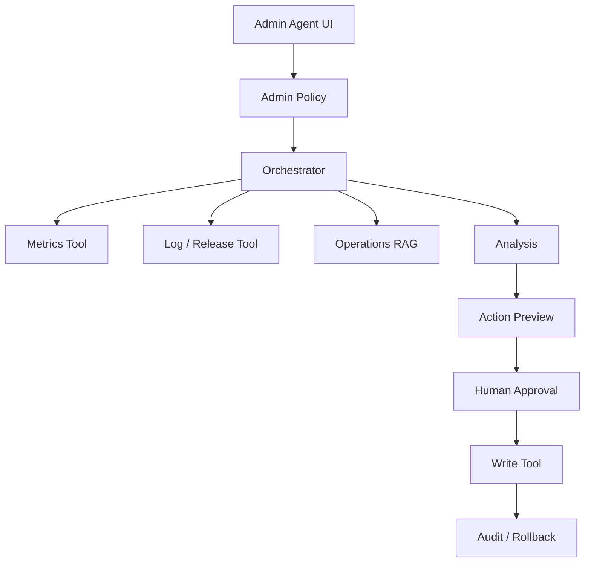

# AI Agent 工程（四十一）：构建后台运营 Agent

> 后台运营 Agent 可以帮助查询指标、解释异常和生成处理建议，但批量修改、封禁、配置变更等动作必须有严格权限、范围预览和人工确认。

---

## 项目目标

实现一个管理后台 Agent：

- 查询经过聚合的业务指标。
- 检索运营手册和告警规则。
- 分析异常并生成证据化建议。
- 创建处理工单。
- 批量动作先生成影响预览。
- 高风险操作由具备权限的人员确认。

## 你会学到什么

- 设计面向管理后台的安全工具。
- 控制批量查询和批量写入。
- 组合指标、日志、RAG 和审批。
- 建立影响预览、审计和回滚。

## 它解决什么问题

运营人员常问：

```text
“昨天注册转化为什么下降？
找出影响最大的渠道，给出处理建议，
必要时创建跟进任务。”
```

Agent 需要查指标、版本发布、告警和运营手册，但不能因为相关性就自动修改投放或封禁渠道。

## 最小示例

```python
class MetricQuery(BaseModel):
    metric: Literal["registration", "conversion", "revenue"]
    date_from: date
    date_to: date
    dimensions: list[Literal["channel", "region", "device"]] = []


class ActionPreview(BaseModel):
    tool_name: str
    affected_count: int
    affected_scope: list[str]
    reversible: bool
    approval_required: bool
```

## 系统架构



## 数据流

1. 从管理员身份计算可见指标和工具。
2. Query Planner 拆分指标、发布和规则证据。
3. 只读工具返回聚合数据。
4. Agent 生成假设和证据。
5. 如果需要动作，先生成 ActionPreview。
6. Policy 与审批人检查范围。
7. 执行幂等写工具并记录审计。

## 工具设计

| 工具 | 风险 | 约束 |
|---|---|---|
| query_metrics | read | 日期、维度、行数限制 |
| query_release_events | read | 时间范围 |
| search_ops_playbook | read | ACL |
| create_followup_task | write | 确认、幂等 |
| update_campaign_status | critical | 影响预览、双人审批 |
| disable_account_batch | critical | 默认不向 Agent 开放 |

## 工程化版本

ActionPreview 示例：

```json
{
  "tool_name": "update_campaign_status",
  "arguments_hash": "sha256:...",
  "affected_count": 3,
  "affected_scope": ["channel-a", "channel-b", "channel-c"],
  "before": "active",
  "after": "paused",
  "reversible": true,
  "rollback_window_minutes": 30,
  "approval_required": true
}
```

执行后保存 before snapshot 或可验证回滚句柄。

## 权限与确认

- 指标按角色、区域和业务线过滤。
- 模型不提供 admin_id。
- 批量动作限制最大影响数量。
- 高风险动作要求 Human Approval，必要时双人审批。
- 批准绑定 arguments_hash 和资源版本。
- Agent 默认不能封禁账户、修改权限或删除数据。

## 常见失败模式

- 用相关性描述因果。
- 指标查询范围过大拖垮数据库。
- 聚合结果泄露小样本用户数据。
- 批量动作没有预览。
- 用户确认后范围变化。
- 回滚只写在文档，没有实际工具。

## 什么时候不要这么做

涉及账号封禁、权限变更、资金和不可逆删除时，Agent 只能提供分析和草稿。

没有指标口径治理时，不应让 Agent解释业务变化。

查询可以用固定 Dashboard 完成时，不需要 Agent。

## 生产环境注意事项

- 指标工具只访问只读副本或聚合层。
- 查询设置日期、维度和结果上限。
- 小样本结果做隐私保护。
- 分析明确区分事实、相关性和假设。
- 写动作有幂等、影响预览和回滚。
- 审计记录批准人、Policy 和版本。

## 评测与观测

评测：

- 指标查询正确率。
- 异常解释证据支持率。
- 因果误述率。
- ActionPreview 范围准确率。
- 未授权动作拦截率。
- 回滚成功率。

## 如何观测和评测

指标：

- 每任务查询行数和扫描成本。
- 只读/写/critical 工具比例。
- Human Approval 批准与拒绝。
- 批量影响数量。
- 回滚触发率。
- 运营人员实际采纳率。

## 和 RAG / 后端 / 前端的关系

- RAG 提供运营手册和规则。
- 后端提供聚合指标、Policy、审计和回滚。
- 前端展示证据、假设、影响预览和审批。
- Agent 不直接获得管理后台全权限。

## 面试怎么讲

> 后台运营 Agent 默认只读，指标来自受限聚合工具，分析区分事实、相关性和假设。写动作先生成带影响范围、before/after、可逆性和 arguments_hash 的 ActionPreview，再由有权限人员批准；批量上限、幂等、审计和回滚由后端强制。

## 下一步

第一阶段 214–254 的正文主线完成。接下来应按统一视觉规范规划关键架构图，并运行文章结构、链接、编号和 Git 状态审计。
