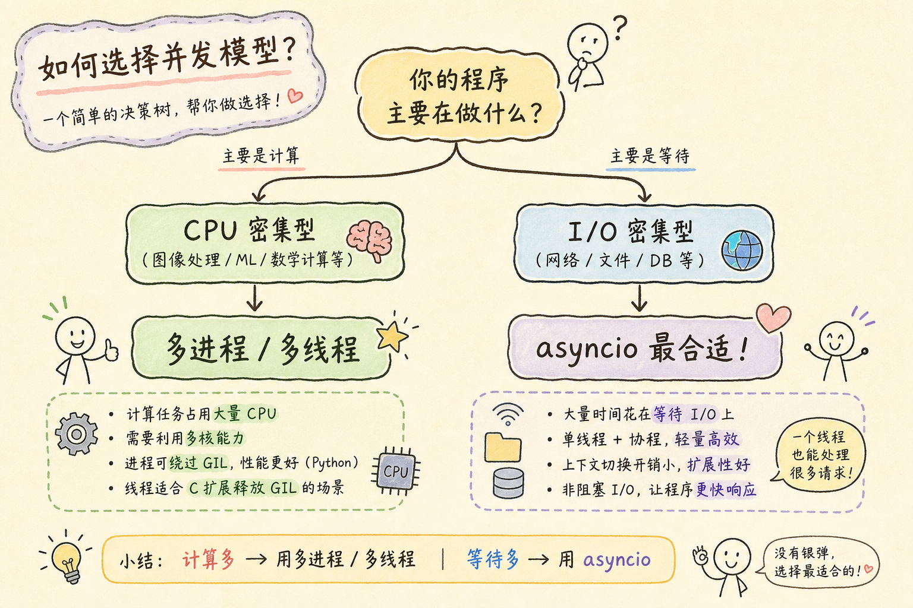
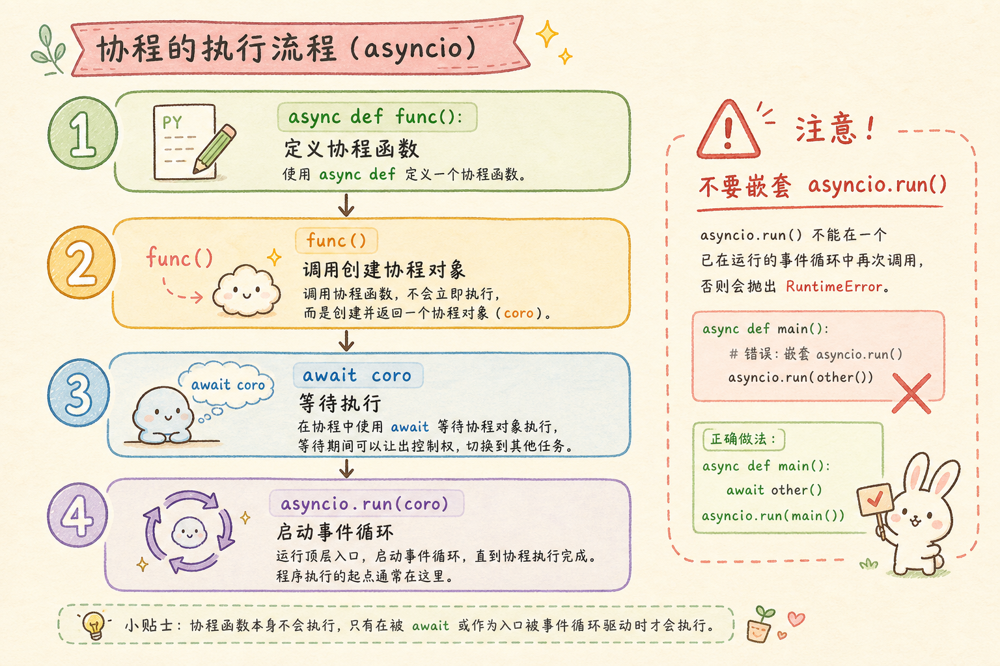
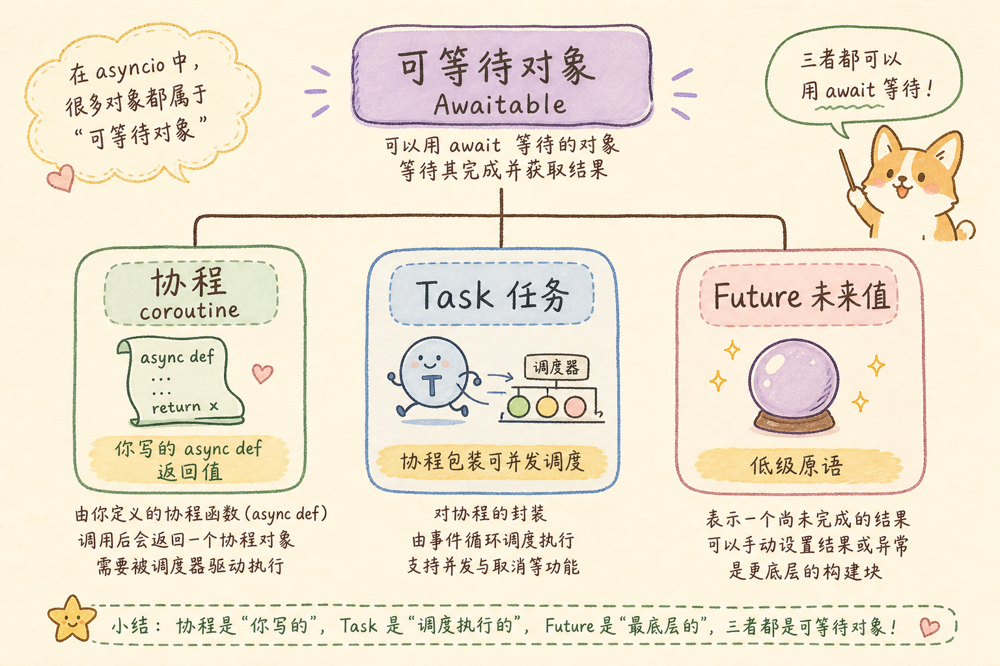
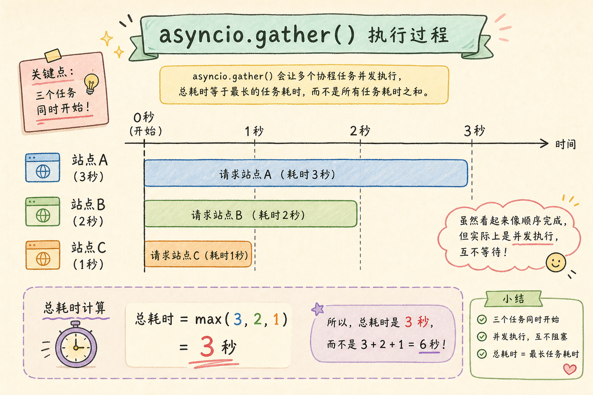
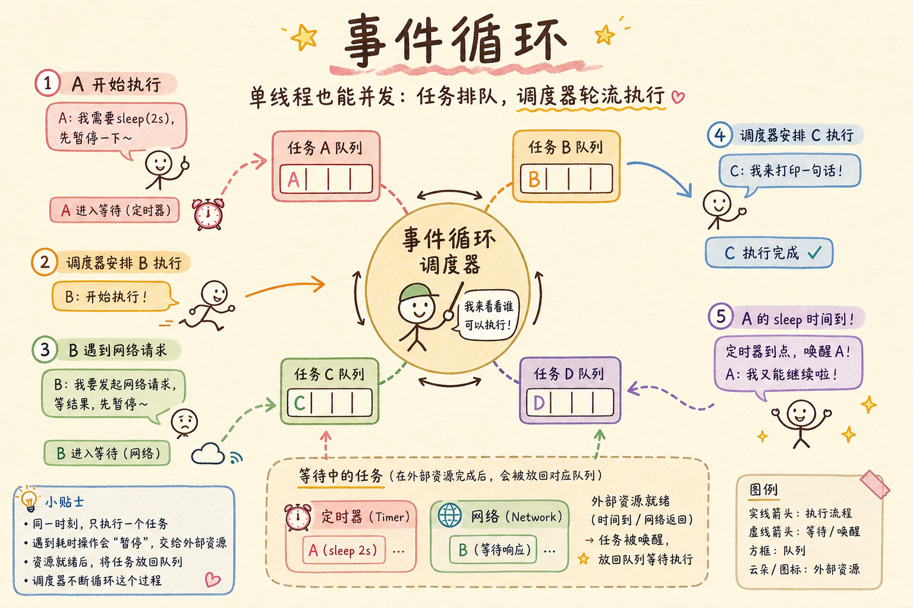
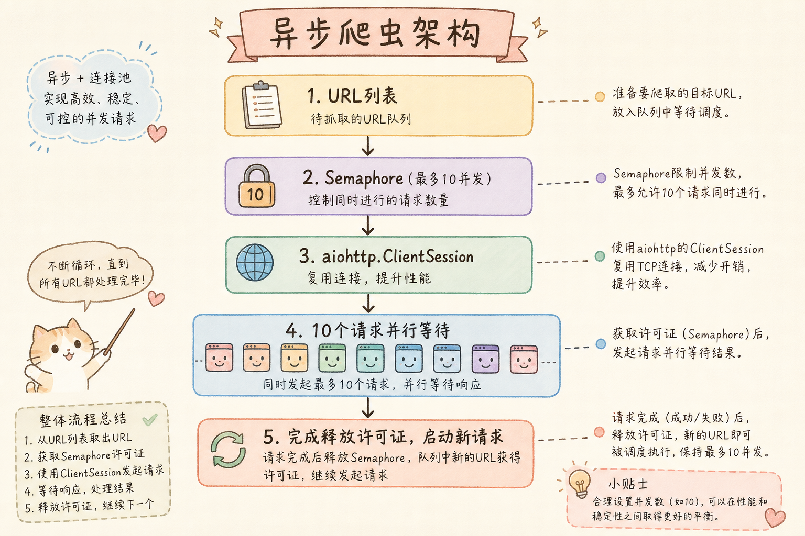
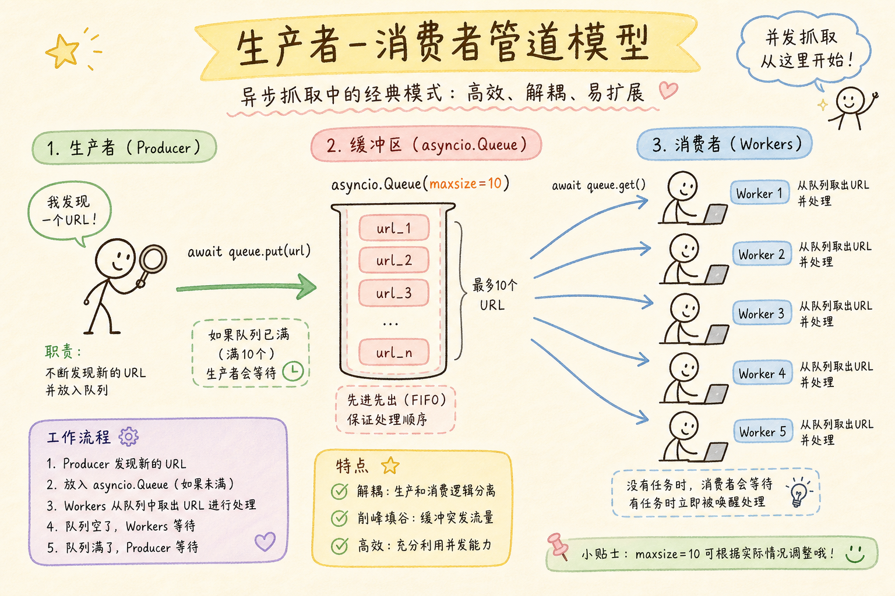
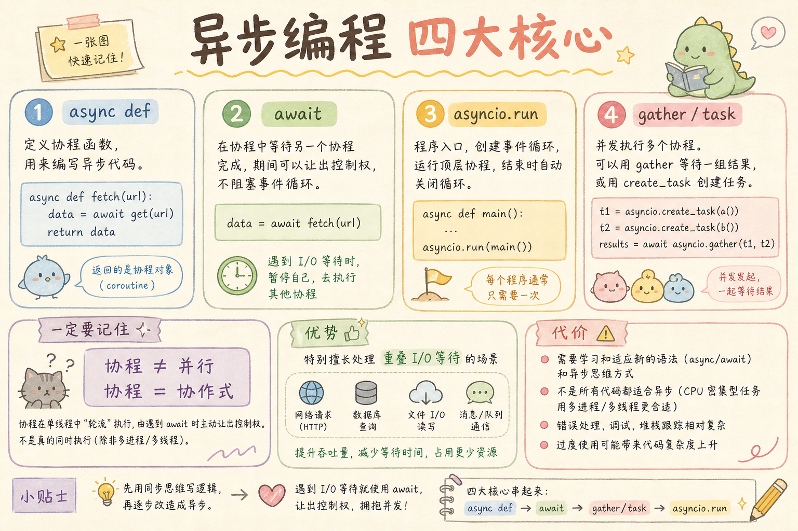

# Python 异步编程完全指南：从 asyncio 到 async/await，让代码飞起来

> 你的 Python 程序是不是经常卡在「等待网络响应」上，CPU 却在摸鱼？1000 个 URL 要爬半小时，其实 99.9% 的时间都在等服务器返回数据？这篇教程从零带你掌握 asyncio 异步编程，用协程把 I/O 等待时间「变废为宝」，让代码性能原地起飞。

**阅读建议：** 建议先阅读系列前两篇：[Python 虚拟环境教程](1.python-virtual-env-tutorial.md)、[Python 类型注解教程](2.python-type-annotation-tutorial.md)。

**环境要求：**
- Python **3.10+**（文中 `TaskGroup` 等特性需 **3.11+**，会单独标注）
- 示例依赖：`pip install aiohttp httpx asyncpg aiofiles fastapi uvicorn`

---

## 目录

1. [前言：一个让你血压飙升的故事](#1-前言一个让你血压飙升的故事)
2. [为什么要异步——从饭店后厨说起](#2-为什么要异步从饭店后厨说起)
3. [协程与 async/await 基础](#3-协程与-asyncawait-基础)
4. [任务调度与并发控制](#4-任务调度与并发控制)
5. [实战案例](#5-实战案例)
6. [协程同步原语与协程间通信](#6-协程同步原语与协程间通信进阶)
7. [异步上下文管理器与 async for（进阶）](#7-异步上下文管理器与-async-for进阶)
8. [异步生态系统](#8-异步生态系统)
9. [常见陷阱与最佳实践](#9-常见陷阱与最佳实践)
   - [9.4 常见问题（FAQ）](#94-常见问题faq)
10. [总结](#10-总结)

---

## 1. 前言：一个让你血压飙升的故事

凌晨一点，你盯着终端里缓慢滚动的日志，第 327 张图片还在下载中。你写了这样一个「爬虫」：

```python
import requests
import time

# 1000 个图片 URL（示例）
image_urls = [f"https://httpbin.org/image/png?page={i}" for i in range(1000)]

def download_image(url):
    print(f"开始下载: {url}")
    response = requests.get(url)          # 卡在这里等……
    print(f"下载完成: {url}")
    return response.content

start = time.time()
for url in image_urls:                    # 一张一张来
    download_image(url)
print(f"总耗时: {time.time() - start:.2f} 秒")
```

1000 张图片跑了 **487 秒**——也就是 8 分多钟。你就在那干等，CPU 利用率不到 1%。

```python
# 你打开系统监视器：
# CPU:  █░░░░░░░░░░░░░░░░░░░ 1%
# 带宽: ██░░░░░░░░░░░░░░░░░░ 5%
# 你:   ████████████████████ 100%（心态爆炸）
```

**问题在哪？** 你的代码是「同步」的——每次 `requests.get()` 发出网络请求后，Python 就傻傻地停在那里，什么也不干，等服务器响应。等待期间，CPU 完全是空闲的。


```
同步（串行）：  [等 URL1][等 URL2][等 URL3]……  → 487 秒
异步（并发）：  [等 URL1]
                [等 URL2]  ← 等待重叠
                [等 URL3]
                ……                        → ~10 秒
```

**异步版本又是怎样的？** 核心思路：不等上一个请求完成，就同时发出更多请求。下面是一个最小可运行示例（用 `asyncio.sleep` 模拟网络等待，无需安装第三方库）：

```python
import asyncio
import time

async def download_image(url, delay=0.5):
    print(f"开始下载: {url}")
    await asyncio.sleep(delay)   # 模拟网络等待，不阻塞其他协程
    print(f"下载完成: {url}")

async def main():
    urls = [f"image_{i}.png" for i in range(10)]
    await asyncio.gather(*[download_image(u) for u in urls])

start = time.time()
asyncio.run(main())
print(f"总耗时: {time.time() - start:.2f} 秒")  # 约 0.5 秒，而非 5 秒
```

换成真实的 HTTP 请求后（需先学完 [§3](#3-协程与-asyncawait-基础)–[§4](#4-任务调度与并发控制)，见 [§5.1](#51-案例一高性能异步爬虫)），1000 张图片可能只需要 **10 秒**——快了接近 50 倍。

> 这不是魔法，而是把等待时间「重叠」起来了。就像你在烧水的同时去切菜，而不是等水开了再开始切。

---

## 2. 为什么要异步——从饭店后厨说起

### 2.1 三种做菜方式

假设你是一个厨师，要做 10 份蛋炒饭。每份蛋炒饭有三个步骤：

1. **打鸡蛋**（CPU 操作，必须自己动手，10 秒）
2. **炒蛋**（CPU 操作，必须自己动手，20 秒）
3. **等米饭蒸好**（I/O 操作，电饭锅在工作，不需要你管，120 秒）

来看看三种工作方式：

**方式一：同步阻塞——一个做完再做下一个**


```
方式一 同步：  [炒饭1全部步骤][炒饭2全部步骤]……  1500 秒
方式二 多线程：[10个厨师同时做]                 ~150 秒
方式三 异步：  [1厨师穿插处理10锅饭]            ~150 秒
```

**总时间 = (30 秒 + 120 秒) × 10 = 1500 秒 = 25 分钟**。大部分时间厨师在盯着电饭锅发呆。

**方式二：多线程（多厨师）——雇 10 个厨师同时做**

10 个厨师各自独立做一份蛋炒饭：每人打鸡蛋 10 秒、炒蛋 20 秒，同时启动 10 个电饭锅等 120 秒。

**总时间 ≈ 30 秒 + 120 秒 = 150 秒（2.5 分钟）**。速度提升明显，但需要 10 个厨师（10 个线程），切换和管理有额外开销。

**方式三：异步（一个厨师 + 十个电饭锅）——同时启动 10 个电饭锅**

只有 1 个厨师：先给 10 个电饭锅全部通电，然后在炒蛋的 30 秒空档里穿插处理各份炒饭的打蛋、炒蛋步骤；米饭蒸好后再依次盛盘。

**总时间 ≈ 30 秒 + 120 秒 = 150 秒（2.5 分钟）**。效果和 10 个厨师相近，但只需 1 个人——对应程序里只需 1 个线程。

这就是异步的核心思想：**当一个任务在等 I/O 时，切换到另一个任务去执行，让 CPU 不闲着。**

### 2.2 什么时候该用异步

先弄清两个贯穿全文的概念：

| 术语 | 白话解释 | 典型例子 |
|------|----------|----------|
| **I/O 密集** | 程序大部分时间在**等待**外部资源，CPU 很闲 | 网络请求、读数据库、读文件 |
| **CPU 密集** | 程序大部分时间在**计算**，很少等待 | 加密、图像处理、大规模循环 |

**GIL**（全局解释器锁）：CPython 同一时刻只允许一个线程执行 Python 字节码。因此多线程无法让 CPU 密集任务真正跑在多核上；要榨干多核应使用 `multiprocessing`（多进程）。



```
大量 I/O 等待（网络/数据库）？
├─ 是 → 需要高并发？
│       ├─ 是 → 用 asyncio ✅
│       └─ 否 → 同步代码往往更简单
└─ 否（CPU 密集：加密、图像处理）
        → 用 multiprocessing，不要用 asyncio ❌
```

**asyncio 最适合的场景：**
- 爬虫：同时抓取成百上千个页面
- Web 服务端：同时处理大量客户端连接
- 数据库批量操作（多连接并发）
- 调用外部 API（OpenAI、微信支付等）
- WebSocket 长连接（详见 [WebSocket 教程](6.websocket-tutorial.md)）
- 大文件/网络文件系统读写（需配合 `aiofiles` 等异步库；普通 `open()` 会阻塞事件循环）

**什么时候不必用 asyncio：**
- 只有几个请求、脚本跑完就退出——`requests` 同步写法更简单
- 纯 CPU 计算——用 `multiprocessing` 或多进程
- 团队不熟悉 async/await——维护成本可能高于性能收益

**asyncio vs 多线程 vs 多进程：**

| 方案 | 适用场景 | 优点 | 缺点 |
|------|----------|------|------|
| **asyncio** | 大量 I/O 等待（网络、数据库） | 单线程高并发、资源占用低 | `async` 语法传染性；CPU 密集会卡死循环 |
| **threading** | I/O 密集、需调用同步库 | 可复用 requests 等同步库 | GIL 限制 CPU 并行（见上文）；线程切换有开销 |
| **multiprocessing** | CPU 密集计算 | 真正多核并行 | 进程开销大；进程间通信复杂 |

---

## 3. 协程与 async/await 基础

### 3.1 你的第一个协程

```python
import asyncio

async def greet(name):
    """这就是一个协程函数，用 async def 定义"""
    print(f"你好，{name}！")
    await asyncio.sleep(1)   # 模拟耗时操作，不会阻塞！
    print(f"再见，{name}！")

# 调用 async 函数不会执行它——它返回的是一个协程对象
coro = greet("张三")
print(type(coro))  # <class 'coroutine'>

# 必须用 asyncio.run() 来运行
asyncio.run(greet("张三"))
```

`asyncio.run()` 会做三件事：创建事件循环 → 运行你传入的协程 → 关闭循环。可以把它理解为异步程序的「启动按钮」。



```
async def foo()  →  调用 foo() 得到 coroutine 对象（不会执行）
                 →  asyncio.run(foo()) 启动事件循环
                 →  遇到 await 让出控制权，循环去跑其他协程
                 →  全部完成后退出
```

> **「传染性」：** 用 `async def` 定义的函数只能被 `await` 调用；因此一旦某个函数变成异步，调用它的上层函数通常也要改成 `async def`。这是使用 asyncio 的主要心智负担，后面会反复遇到。

**三个名词速记：**

| 名词 | 是什么 | 怎么得到 |
|------|--------|----------|
| **协程（coroutine）** | 可调度的异步函数单元 | 调用 `async def` 函数 |
| **任务（Task）** | 已被事件循环调度、正在运行的协程 | `asyncio.create_task(coro)` |
| **事件循环（Event Loop）** | 在单线程里轮流执行协程的调度器 | `asyncio.run()` 自动创建 |

---

### 3.2 await 到底在做什么

`await` 是异步编程的灵魂。它说：「我先让出 CPU，你去干别的事，等这个操作完成后通知我。」

```python
import asyncio

async def main():
    print("开始……")

    # await 后面跟的是「可等待对象」（Awaitable）
    await asyncio.sleep(2)    # 模拟等待 2 秒
    #     ↑
    #     在这里，事件循环会去执行其他协程
    #     而不是傻等 2 秒

    print("2 秒后继续……")

    result = await fetch_data()   # 等待另一个协程的返回值
    print(f"获取到数据: {result}")

async def fetch_data():
    await asyncio.sleep(1)
    return {"status": "ok", "count": 42}

asyncio.run(main())
```

`await` 可以作用于三类对象（统称为「可等待对象」，即实现了 `__await__` 协议、能被 `await` 的对象）：



| 类型 | 示例 | 说明 |
|------|------|------|
| **协程对象** | `await fetch_data()` | 调用 `async def` 函数返回的对象 |
| **Task** | `task = asyncio.create_task(coro); await task` | 已被调度、可取消的协程包装 |
| **Future** | 底层占位对象 | 代表「将来会有结果」的容器，一般由库内部创建；你日常写业务代码几乎用不到，知道有这层即可 |

### 3.3 并发运行多个协程

```python
import asyncio
import time

async def download(site_name, seconds):
    print(f"开始下载 {site_name}（预计 {seconds} 秒）")
    await asyncio.sleep(seconds)  # 模拟下载耗时
    print(f"{site_name} 下载完成！")
    return f"{site_name} 的内容"

async def main():
    # ❌ 错误做法——串行，总耗时 = 3+2+1 = 6 秒
    await download("站点A", 3)
    await download("站点B", 2)
    await download("站点C", 1)

async def main_correct():
    # ✅ 正确做法——并发，总耗时 = max(3,2,1) = 3 秒
    results = await asyncio.gather(
        download("站点A", 3),
        download("站点B", 2),
        download("站点C", 1),
    )
    print(f"所有结果: {results}")
    # ['站点A 的内容', '站点B 的内容', '站点C 的内容']

start = time.time()
asyncio.run(main_correct())
print(f"耗时: {time.time() - start:.1f} 秒")  # 约 3.0 秒
```

`asyncio.gather()` 是并发的关键——它**同时调度**所有协程（不是串行排队），等全部完成后返回结果列表。**返回顺序与传入顺序一致**，与谁先完成无关。



```
时间轴：  |-- 站点A(3s) --|
          |-- 站点B(2s) --|
          |-- 站点C(1s) --|
          总耗时 = max(3, 2, 1) = 3 秒
```

**异常处理：** 默认情况下，`gather` 中任一任务抛异常，整体会失败。若希望收集所有结果（含异常），使用 `return_exceptions=True`：

```python
async def failing_task():
    await asyncio.sleep(0.1)
    raise ValueError("下载失败")

results = await asyncio.gather(
    download("站点A", 1),
    failing_task(),
    return_exceptions=True,
)
# results[0] 正常返回；results[1] 是 ValueError 对象，而非直接中断
```

### 3.4 create_task——手动调度协程

`gather` 很方便，但它会等所有协程完成才返回。如果你想在协程运行时做其他事，用 `create_task`：

```python
import asyncio

async def download(site_name, seconds):
    print(f"开始下载 {site_name}（预计 {seconds} 秒）")
    await asyncio.sleep(seconds)
    print(f"{site_name} 下载完成！")
    return f"{site_name} 的内容"

async def main():
    # create_task 立即调度协程，返回一个 Task 对象
    task = asyncio.create_task(download("大文件", 10))
    # 协程已经开始在后台运行了！

    print("下载已在后台启动……")
    await asyncio.sleep(1)
    print("主程序可以做其他事情……")
    await asyncio.sleep(1)
    print("还在下载中吗？")

    # 最后再等任务完成，获取结果
    result = await task
    print(f"下载完成: {result}")

asyncio.run(main())
```

输出（实际顺序可能因调度略有不同，但逻辑一致）：

```
下载已在后台启动……
开始下载 大文件（预计 10 秒）
主程序可以做其他事情……
还在下载中吗？
大文件 下载完成！
下载完成: 大文件 的内容
```

> `create_task` 后 Task 可能立刻运行到第一个 `await` 之前，因此「开始下载」有时会在「下载已在后台启动」之前打印，属正常现象。

**`gather` vs `create_task` 什么时候用什么？**

| 场景 | 使用 |
|------|------|
| 并发执行多个协程，等全部结束拿结果 | `asyncio.gather()`（会立即调度所有协程） |
| 启动后台任务，边运行边做其他事 | `asyncio.create_task()` |
| 多个任务，哪个先完成用哪个 | `asyncio.wait(..., return_when=FIRST_COMPLETED)` |
| 限制同时运行的任务数量 | `asyncio.Semaphore`（见下文） |

---

## 4. 任务调度与并发控制

### 4.1 事件循环——异步的引擎

事件循环（Event Loop）是 asyncio 的核心。它就像是一个永不休息的调度员：



**关键认知：** 事件循环是单线程的，采用**协作式调度**——协程只在遇到 `await` 时主动让出控制权，不会在中途被强行打断。所有协程都在同一个线程里运行，不存在真正的并行。所以 CPU 密集操作会让整个事件循环卡住。

### 4.2 信号量——限制并发数

生产环境中你不会同时发 10000 个请求——你可能会把服务器打趴，或者被对方封 IP。用 `Semaphore`（信号量）控制并发上限：可以把它想成**只有 N 个车位的停车场**——第 N+1 辆车必须等有人开走才能进。

```python
import asyncio

# 信号量：同一时间最多允许 3 个协程「持有」
semaphore = asyncio.Semaphore(3)

async def download_with_limit(url):
    async with semaphore:   # 获取许可，如果满了就等
        print(f"  → 开始下载: {url}")
        await asyncio.sleep(2)  # 模拟下载
        print(f"  ← 下载完成: {url}")
        return f"{url} 的内容"

async def main():
    urls = [f"https://example.com/page/{i}" for i in range(20)]
    tasks = [download_with_limit(url) for url in urls]
    results = await asyncio.gather(*tasks)
    print(f"全部完成，共 {len(results)} 个")

asyncio.run(main())
```


### 4.3 as_completed——谁先完成先用谁

有时候你不需要等所有任务完成，谁先返回就用谁的结果：

```python
import asyncio

async def query_database(db_name, delay):
    await asyncio.sleep(delay)
    return f"{db_name} 查询结果（{delay}秒）"

async def main():
    tasks = [
        query_database("主库", 3),
        query_database("备库", 1),
        query_database("缓存", 0.5),
    ]

    # 按完成顺序获取结果（与 gather 的返回顺序不同）
    for finished in asyncio.as_completed(tasks):
        # 注意：as_completed 接收可等待对象（协程或 Task）
        result = await finished
        print(f"✓ 收到: {result}")

asyncio.run(main())
```

输出：

```
✓ 收到: 缓存 查询结果（0.5秒）    ← 最先完成
✓ 收到: 备库 查询结果（1秒）
✓ 收到: 主库 查询结果（3秒）      ← 最后完成
```

### 4.4 TaskGroup——更安全的并发管理（Python 3.11+）

> **版本提示：** `TaskGroup` 需要 Python 3.11+。若你使用 3.10 及以下，请用 `asyncio.gather()` 配合 `try/except` 手动处理异常和取消。

```python
import asyncio

async def worker(name, delay):
    await asyncio.sleep(delay)
    if delay > 2:
        raise ValueError(f"{name} 出错了！")
    return f"{name} 完成"

async def main():
    # TaskGroup 保证：任何一个任务出错，组内所有任务都会被取消
    async with asyncio.TaskGroup() as tg:
        task1 = tg.create_task(worker("A", 1))
        task2 = tg.create_task(worker("B", 3))   # 这个会出错
        task3 = tg.create_task(worker("C", 1))

    # 如果有任务抛异常，TaskGroup 会重新抛出 ExceptionGroup（Python 3.11+）
    # ExceptionGroup 把多个子异常打包在一起；可用 except* 语法分别捕获
    # task3 虽然没事，但也会被取消（不给失败的任务拖后腿）

# asyncio.run(main())  # 会抛出 ExceptionGroup，内含 worker("B") 的 ValueError
```

> **ExceptionGroup 是什么？** Python 3.11 引入的异常类型，表示「一组任务里有多处同时出错」。捕获示例：`except* ValueError as eg:` 可只处理其中的 `ValueError` 子异常。日常开发中，知道 TaskGroup 失败时会取消兄弟任务、并抛出打包后的异常即可。

```
    普通 gather：一个出错，其他继续跑（可能产生不一致状态）
    使用 TaskGroup：一个出错，全部取消（适合事务性操作）
```

### 4.5 wait_for——给任务加超时

```python
import asyncio

async def slow_operation():
    await asyncio.sleep(10)
    return "太慢了"

async def main():
    try:
        result = await asyncio.wait_for(
            slow_operation(),
            timeout=3.0          # 最多等 3 秒
        )
        print(result)
    except asyncio.TimeoutError:
        print("操作超时！3 秒内没完成")
        # 超时后 slow_operation 会被自动取消（cancel），不会继续在后台运行
        # 若协程持有连接/文件句柄，应在其中处理 CancelledError 并做好清理

asyncio.run(main())
```

---

## 5. 实战案例

> **阅读顺序：** 本节综合运用 §3 的 `gather`、§4 的 `Semaphore` 以及第三方异步库。若刚学完 §3，可先浏览代码结构，遇到不懂的 API 再回头查阅对应章节。

### 5.1 案例一：高性能异步爬虫

把前言里的同步爬虫改写成异步版本。这里用到 **aiohttp**（异步 HTTP 客户端）和 **ClientSession**（连接会话，内部维护连接池，复用 TCP 连接比每次新建请求快得多，因此用 `async with session` 包裹整批请求）：

```python
import asyncio
import aiohttp                # pip install aiohttp
import time

# 并发限制：最多同时 10 个请求
CONCURRENCY = 10
semaphore = asyncio.Semaphore(CONCURRENCY)

async def fetch_url(session, url):
    """异步下载单个页面"""
    async with semaphore:                         # 遵守并发限制
        try:
            async with session.get(url, timeout=30) as response:
                html = await response.text()
                print(f"✓ {url} — {len(html)} 字符")
                return {"url": url, "html": html, "status": response.status}
        except Exception as e:
            print(f"✗ {url} — {e}")
            return {"url": url, "error": str(e)}

async def crawl(urls):
    """并发爬取所有 URL"""
    # 创建一个共享的 session（复用连接，比每次新建快很多）
    async with aiohttp.ClientSession() as session:
        tasks = [fetch_url(session, url) for url in urls]
        results = await asyncio.gather(*tasks)
        return results

def main():
    urls = [
        f"https://httpbin.org/delay/1?page={i}"
        for i in range(50)
    ]

    start = time.time()
    results = asyncio.run(crawl(urls))
    elapsed = time.time() - start

    success = sum(1 for r in results if "error" not in r)
    print(f"\n{'='*50}")
    print(f"完成：{success}/{len(urls)}，耗时 {elapsed:.1f} 秒")
    # 预计：50个请求，并发10，每个1秒 → 约 5 秒

main()
```



```
main() → asyncio.run(crawl)
           ├─ ClientSession（共享连接池）
           ├─ Semaphore（限制并发 10）
           └─ gather(fetch_url × N)
```

### 5.2 案例二：异步数据库操作

以下示例需要本地已安装并运行 **PostgreSQL**，且库名/账号与代码一致；若无数据库环境，可先阅读代码了解 `asyncpg` 的 `await conn.fetch()` 等写法。

```python
import asyncio
import asyncpg          # pip install asyncpg

async def demo_database():
    # 连接 PostgreSQL
    conn = await asyncpg.connect(
        user="postgres",
        password="secret",
        database="mydb",
        host="localhost",
    )

    # 创建表
    await conn.execute("""
        CREATE TABLE IF NOT EXISTS users (
            id SERIAL PRIMARY KEY,
            name TEXT,
            email TEXT
        )
    """)

    # 批量插入——单连接上串行执行（asyncpg 同一连接不宜并发写）
    users = [
        ("张三", "zhangsan@example.com"),
        ("李四", "lisi@example.com"),
        ("王五", "wangwu@example.com"),
    ]

    # 准备 SQL，用 executemany 一次插入多行
    # $1、$2 是 PostgreSQL 的参数占位符（类似其他数据库的 ?），由 asyncpg 安全绑定，防止 SQL 注入
    stmt = await conn.prepare(
        "INSERT INTO users (name, email) VALUES ($1, $2)"
    )
    await stmt.executemany(users)

    # 若需并发写入，应创建多个连接（每连接独立操作）
    # async def insert_batch(conn, batch):
    #     stmt = await conn.prepare("INSERT INTO users (name, email) VALUES ($1, $2)")
    #     await stmt.executemany(batch)
    # conns = [await asyncpg.connect(...) for _ in range(4)]
    # await asyncio.gather(*[insert_batch(c, chunk) for c, chunk in ...])

    # 查询
    rows = await conn.fetch("SELECT * FROM users")
    for row in rows:
        print(f"  {row['id']}: {row['name']} ({row['email']})")

    await conn.close()

asyncio.run(demo_database())
```

### 5.3 案例三：异步 Web 服务器

用 **FastAPI**（底层基于 Starlette 和 asyncio）构建一个高并发 API。将下面代码保存为 `main.py`，在终端执行 `uvicorn main:app --reload` 即可启动；浏览器访问 `http://127.0.0.1:8000/docs` 可看到自动生成的 API 文档。

```python
# pip install fastapi uvicorn httpx
from fastapi import FastAPI
import asyncio
import httpx
import time

app = FastAPI()

# 模拟的「后端服务」调用的外部 API
async def call_external_api(item_id: int) -> dict:
    await asyncio.sleep(0.5)  # 模拟网络延迟
    return {"id": item_id, "name": f"商品_{item_id}", "price": item_id * 10.0}

# 端点 1：普通响应
@app.get("/")
async def root():
    return {"message": "异步服务器运行中"}

# 端点 2：调用外部 API
@app.get("/items/{item_id}")
async def get_item(item_id: int):
    result = await call_external_api(item_id)
    return result

# 端点 3：并发调用多个外部 API
@app.get("/items/batch/{count}")
async def get_items_batch(count: int):
    start = time.time()

    # 同时发出 count 个请求
    tasks = [call_external_api(i) for i in range(count)]
    results = await asyncio.gather(*tasks)

    elapsed = time.time() - start
    return {
        "count": count,
        "elapsed_seconds": elapsed,
        "items": results,
    }
    # 100 个请求，串行 = 50 秒，并发 ≈ 0.5 秒！

# 启动: uvicorn main:app --reload
```

当你请求 `/items/batch/100` 时，100 个对外部 API 的调用会同时发出，总耗时还是约 0.5 秒。这就是异步的威力——没有多线程的开销，却能处理海量并发。

### 5.4 案例四：生产者-消费者模式

经典的爬虫模式——一个协程负责发现 URL，多个协程负责下载。流程简述：

```
生产者 ──放入 URL──→ Queue（有容量上限）──取出 URL──→ 多个 Worker 并发下载
```

**背压（backpressure）**：`Queue(maxsize=10)` 表示队列最多存 10 个待处理项；满了之后生产者 `put` 时会自动等待，避免一次性塞入成千上万个 URL 撑爆内存——就像流水线后段慢了，前段会自动减速。

```python
import asyncio
from asyncio import Queue

async def producer(queue, urls, num_workers):
    """生产者：把 URL 放入队列"""
    for url in urls:
        await queue.put(url)
        print(f"  放入队列: {url}")
        await asyncio.sleep(0.1)  # 模拟发现 URL 的间隔

    # 放入结束信号（每个 worker 一个 None）
    for _ in range(num_workers):
        await queue.put(None)      # None 表示「没活了」

async def worker(queue, worker_id, results):
    """消费者：从队列取出 URL 并下载"""
    while True:
        url = await queue.get()
        if url is None:            # 收到结束信号
            queue.task_done()
            break

        print(f"    [Worker-{worker_id}] 下载: {url}")
        await asyncio.sleep(1)     # 模拟下载
        results.append(f"{url} 的内容")
        queue.task_done()

async def main():
    urls = [f"/page/{i}" for i in range(20)]
    NUM_WORKERS = 5

    queue = asyncio.Queue(maxsize=10)  # 队列最大长度，实现背压
    results = []

    # 启动生产者 + 多个消费者
    await asyncio.gather(
        producer(queue, urls, NUM_WORKERS),
        *[worker(queue, i, results) for i in range(NUM_WORKERS)],
    )

    print(f"\n全部完成！收集到 {len(results)} 个结果")

asyncio.run(main())
```



```
生产者 → Queue(maxsize=10) → Worker-0
                          → Worker-1 … Worker-N
         （队列满时生产者自动等待，实现背压，见上文说明）
```

---

## 6. 协程同步原语与协程间通信（进阶）

> **术语说明：** 此处的「同步」指**协程之间的协调与互斥**（和 threading 里的 Lock/Event 同类），**不是**前面说的「同步阻塞编程」（synchronous）。避免与 §1 的「同步爬虫」混淆。

> 本节适合已掌握 `gather` / `Semaphore` 的读者。日常爬虫和 API 开发通常用不到这些原语。

asyncio 提供了全套的协调工具——它们和 threading 的工具类似，但专为协程设计，**不会阻塞事件循环**。

| 原语 | 解决什么问题 |
|------|----------------|
| **Lock** | 防止多个协程同时改同一数据（尤其是跨 `await` 的操作序列） |
| **Event** | 一个发信号、多个等待通知 |
| **Semaphore** | 限制同时运行的协程数量（§4.2 已介绍） |
| **Condition** | 等待「某个条件成立」后再继续 |

### 6.1 Lock——互斥锁

```python
import asyncio

counter = 0
lock = asyncio.Lock()

async def increment():
    global counter
    async with lock:           # 同一时间只有一个协程能进入
        current = counter
        await asyncio.sleep(0.001)  # 模拟计算中的一点延迟
        counter = current + 1

async def main():
    await asyncio.gather(*[increment() for _ in range(100)])
    print(f"counter = {counter}")  # 100，而不是一个随机的小于 100 的数

asyncio.run(main())
```

> 实际上，由于 asyncio 是单线程的，`counter += 1` 这个简单的操作即使不加锁也不会出问题。Lock 用于保护**跨多个 `await` 的临界区**——即那些可能在 await 处被切换走的操作序列。

### 6.2 Event——事件通知

```python
import asyncio

async def waiter(event, name):
    print(f"  {name} 在等待事件……")
    await event.wait()          # 阻塞直到 event.set() 被调用
    print(f"  {name} 收到通知！开始工作")

async def setter(event):
    await asyncio.sleep(2)
    print("\n=== 事件触发！===\n")
    event.set()                 # 唤醒所有等待者

async def main():
    event = asyncio.Event()
    await asyncio.gather(
        waiter(event, "A"),
        waiter(event, "B"),
        waiter(event, "C"),
        setter(event),
    )

asyncio.run(main())
```

### 6.3 Semaphore——信号量（复习）

信号量控制「同时最多 N 个」，上面已经用过。下面是一个根据错误率动态调整并发上限的思路示例：

```python
import asyncio

class AdaptiveLimiter:
    """根据错误率动态调整并发上限"""

    def __init__(self, initial: int = 10):
        self._limit = initial
        self.semaphore = asyncio.Semaphore(initial)
        self.failures = 0
        self.successes = 0

    async def __aenter__(self):
        await self.semaphore.acquire()
        return self

    async def __aexit__(self, *args):
        self.semaphore.release()

    def report_result(self, success: bool):
        if success:
            self.successes += 1
        else:
            self.failures += 1

    def adjust(self):
        """每 20 次请求后，根据错误率调整并发"""
        total = self.failures + self.successes
        if total < 20:
            return
        error_rate = self.failures / total

        if error_rate > 0.1 and self._limit > 1:
            self._limit = max(1, self._limit // 2)
            self.semaphore = asyncio.Semaphore(self._limit)
            print(f"  ⚠ 错误率 {error_rate:.0%}，降低并发至 {self._limit}")
        elif error_rate < 0.01 and self._limit < 50:
            self._limit = min(50, self._limit + 2)
            self.semaphore = asyncio.Semaphore(self._limit)
            print(f"  ✓ 错误率低，提高并发至 {self._limit}")

        self.failures = 0
        self.successes = 0

# 使用示例
async def fetch_with_adaptive(limiter, url):
    async with limiter:
        await asyncio.sleep(0.2)  # 模拟请求
        success = "error" not in url
        limiter.report_result(success)
        limiter.adjust()
        return url

async def main():
    limiter = AdaptiveLimiter(initial=5)
    urls = [f"https://example.com/{i}" for i in range(30)]
    await asyncio.gather(*[fetch_with_adaptive(limiter, u) for u in urls])

# asyncio.run(main())
```

> **注意：** `adjust()` 里直接新建 `Semaphore` 是简化演示；生产环境中正在 `acquire` 的协程可能与新信号量脱节，需更谨慎地实现动态限流。

### 6.4 Condition——条件变量

`Condition` 适合「等队列非空再继续」这类场景。`wait_for(lambda: len(items) > 0)` 的含义是：在持有锁的情况下，若列表仍为空就挂起；一旦 `notify_all()` 被调用且条件为真，等待者被唤醒。`lambda` 只是返回 True/False 的判断函数，必须写在 `async with cond` 内部，因为要先拿到锁才能安全地检查 `items`。

```python
import asyncio

async def producer(cond, items, total):
    for i in range(total):
        await asyncio.sleep(0.5)
        async with cond:
            items.append(f"产品_{i}")
            print(f"  生产了 产品_{i}")
            cond.notify_all()

    # 发送结束信号
    async with cond:
        items.append(None)
        cond.notify_all()

async def consumer(cond, items, name):
    while True:
        async with cond:
            await cond.wait_for(lambda: len(items) > 0)
            item = items.pop(0)
        if item is None:
            break
        print(f"    [{name}] 消费了 {item}")

async def main():
    items = []
    cond = asyncio.Condition()
    await asyncio.gather(
        producer(cond, items, 5),
        consumer(cond, items, "消费者A"),
        consumer(cond, items, "消费者B"),
    )

asyncio.run(main())
```

---

## 7. 异步上下文管理器与 async for（进阶）

> **要不要读本章？** 若你只想写爬虫、调 API、用 `aiohttp` / `FastAPI`，读完 [§5](#5-实战案例) 和 [§9](#9-常见陷阱与最佳实践) 通常已够用——前文里的 `async with session` 直接用即可，**不必会自己写** `__aenter__`。本章适合想搞懂「`async with` / `async for` 背后是什么」或需要**封装自己的异步资源**时再读。

**本章三张地图（先建立直觉，再看代码）：**

| 你已见过的写法 | 正式名称 | 通俗说 |
|----------------|----------|--------|
| `async with session`（§5.1） | **异步上下文管理器** | 进入时自动「打开/连接」，退出时自动「关闭/清理」，即使报错也会收拾干净——像借书自动还书 |
| `async for x in ...`（下面 7.2 才详讲） | 消费**异步可迭代对象** | 数据**一条一条**来，每取一条时可以 `await` 等待，不必一次性全加载到内存 |
| `async def foo(): yield x` | **异步生成器** | 最常见的异步可迭代来源；`yield` 之间可以 `await` |

> **迭代器 vs 生成器：** 本章标题不再单独强调「迭代器」——日常开发里你主要遇到的是 **`async for` + 异步生成器**（带 `yield` 的 `async def`）。底层 `__aiter__` / `__anext__` 协议由库实现即可，初学者知道「用 `async for` 逐条读」就够。

**阅读顺序：** 建议已读过 [§5.1](#51-案例一高性能异步爬虫)（见过 `async with ClientSession`）。未学过同步 `with open()` 也没关系，下面会从「自动清理资源」讲起。

### 7.1 异步上下文管理器

**上下文管理器**（context manager）：配合 `with` 使用的对象，负责 **进入时准备资源、退出时释放资源**（关连接、关文件），异常时也会执行清理。

**异步上下文管理器**就是它的异步版：语法是 `async with`，背后用 `__aenter__` / `__aexit__`（可在里面 `await`），对应同步版的 `__enter__` / `__exit__`。

你在 §5.1 已经用过—— `async with aiohttp.ClientSession() as session` 就是在说：这段代码块里用 session，**块结束后自动关闭连接池**。

下面演示**自己写一个**异步上下文管理器（模拟数据库连接）。预期行为：先打印「打开连接」，查询，退出 `async with` 后打印「关闭连接」。

```python
import asyncio

class AsyncConnection:
    """自定义异步上下文管理器"""

    async def __aenter__(self):
        print("  打开连接……")
        await asyncio.sleep(0.5)   # 模拟连接建立
        return self

    async def __aexit__(self, exc_type, exc_val, exc_tb):
        print("  关闭连接……")
        await asyncio.sleep(0.1)   # 模拟优雅关闭

    async def query(self, sql):
        await asyncio.sleep(0.5)
        return f"查询结果: {sql}"

async def main():
    async with AsyncConnection() as conn:
        result = await conn.query("SELECT * FROM users")
        print(f"  {result}")
    # 退出 async with 时自动关闭，即使块内抛异常也会走 __aexit__

asyncio.run(main())
```

若你熟悉同步写法，对照关系是：

| 同步 | 异步 |
|------|------|
| `with open(...) as f` | `async with aiofiles.open(...) as f` |
| `__enter__` / `__exit__` | `__aenter__` / `__aexit__`（方法内可 `await`） |

### 7.2 异步生成器与 async for

**生成器**（generator）：用 `yield` 逐个产出值的函数，不必一次性返回整个列表。同步版你已经可能见过：

```python
def sync_counter(n):
    for i in range(n):
        yield i          # 每 yield 一次，产出一个数

for x in sync_counter(3):  # 普通 for：同步取数
    print(x)               # 0, 1, 2
```

**异步生成器**把 `def` 换成 `async def`，在两次 `yield` 之间可以 `await`（例如等网络、等 I/O）。消费它要用 **`async for`**，不能用普通 `for`——因为每一次取下一个值都可能需要等待。

| | 同步 | 异步 |
|---|------|------|
| 定义 | `def f(): yield x` | `async def f(): yield x` |
| 消费 | `for x in f()` | `async for x in f()` |
| `yield` 之间 | 不能 `await` | 可以 `await` |

下面示例：每 0.5 秒「产出」一个数，共 5 个；`async for` 会等每条数据就绪再打印。总耗时约 2.5 秒，而不是一次性返回。

```python
import asyncio

async def number_generator(n):
    """异步生成器：yield 之间可以 await"""
    for i in range(n):
        await asyncio.sleep(0.5)   # 模拟从慢速数据源读下一条
        yield i

async def main():
    async for num in number_generator(5):
        print(f"  收到: {num}")

asyncio.run(main())
```

**适用场景**（不必自己写协议，会用 `async for` 即可）：
- 从 WebSocket **逐条**读消息
- **分页**拉 API，一页一页处理
- **逐行**读大文件（配合 `aiofiles` 等）
- 实时数据流

### 7.3 异步推导式（可选阅读）

> **了解即可：** 这是 7.2 的语法糖，把 `async for` 写成一行列表推导。日常写业务**很少手写**；读懂 7.2 后，需要时再来查本节。

`[x async for x in agen()]` 等价于用 `async for` 收集成列表；`[await f(x) async for x in agen()]` 则在循环里对每个元素再 `await` 一次。

```python
import asyncio

async def async_range(n):
    for i in range(n):
        await asyncio.sleep(0.1)
        yield i

async def fetch_num(n):
    await asyncio.sleep(0.1)
    return n * 10

async def main():
    # 从异步生成器收集值 → 等价于 async for 循环 + append
    nums = [n async for n in async_range(5)]
    print(nums)  # [0, 1, 2, 3, 4]

    # 组合 await + async for（建议先拆成两行理解）：
    # 对每个 n：await fetch_num(n)，再收集
    results = [await fetch_num(n) async for n in async_range(3)]
    print(results)  # [0, 10, 20]

    # 等价的展开写法（推荐初学者先写这种）：
    results2 = []
    async for n in async_range(3):
        results2.append(await fetch_num(n))

asyncio.run(main())
```

---

## 8. 异步生态系统

### 8.1 异步库速查表

很多传统同步库都有异步替代品：


| 同步库 | 异步替代 | 用途 |
|--------|----------|------|
| `requests` | `aiohttp` / `httpx` | HTTP 请求 |
| `psycopg2` | `asyncpg` | PostgreSQL |
| `pymysql` | `aiomysql` | MySQL |
| `open()` | `aiofiles` | 文件读写 |
| `redis-py` | `redis.asyncio` | Redis |
| `boto3` | `aioboto3` | AWS SDK |

### 8.2 aiohttp 快速入门

```python
import aiohttp
import asyncio

async def fetch_json(session, url):
    """复用外部传入的 session，避免每次请求都新建连接"""
    async with session.get(url) as response:
        return await response.json()

async def post_data(session, url, data):
    async with session.post(url, json=data) as response:
        return await response.json()

async def main():
    urls = [
        "https://jsonplaceholder.typicode.com/posts/1",
        "https://jsonplaceholder.typicode.com/posts/2",
        "https://jsonplaceholder.typicode.com/posts/3",
    ]
    # 整个应用共享一个 ClientSession（与 §5.1 一致）
    async with aiohttp.ClientSession() as session:
        posts = await asyncio.gather(*[fetch_json(session, u) for u in urls])
    for post in posts:
        print(f"  {post['title']}")

asyncio.run(main())
```

### 8.3 httpx——同时支持同步和异步

```python
import httpx
import asyncio

# httpx 的 API 和 requests 几乎一样，但同时支持异步
# TaskGroup 需要 Python 3.11+；3.10 请改用 asyncio.gather()
async def fetch_with_httpx():
    async with httpx.AsyncClient() as client:
        async with asyncio.TaskGroup() as tg:
            tasks = [
                tg.create_task(client.get(f"https://httpbin.org/delay/1?page={i}"))
                for i in range(10)
            ]
        # 退出 TaskGroup 后任务已完成，用 result() 取响应
        return [t.result().status_code for t in tasks]

# 同步版本（和 requests 一模一样的 API）
def sync_fetch():
    with httpx.Client() as client:
        r = client.get("https://httpbin.org/get")
        return r.json()

if __name__ == "__main__":
    print(asyncio.run(fetch_with_httpx()))  # 异步：并发 10 个请求的状态码列表
```

---

## 9. 常见陷阱与最佳实践

### 9.1 八大陷阱

**陷阱一：在协程里调用同步阻塞函数**

```python
# ❌ 这是最最常见的错误！
async def bad():
    import time
    time.sleep(5)              # 阻塞了整个事件循环！
    # 这 5 秒内，其他所有协程都无法运行

# ✅ 正确做法
async def good():
    await asyncio.sleep(5)     # 不阻塞，让出控制权

# ✅ 如果必须调用同步函数，放进线程池
async def run_sync_in_thread():
    loop = asyncio.get_running_loop()
    result = await loop.run_in_executor(
        None,                   # 默认线程池
        time.sleep,             # 要调用的同步函数
        5                       # 参数
    )
```

**陷阱二：忘记 await**

```python
async def fetch():
    await asyncio.sleep(1)
    return "data"

async def main():
    # ❌ 没有 await——创建了协程但没有运行它！
    fetch()                     # RuntimeWarning: coroutine was never awaited

    # ❌ 两个问题：缺少 await，且 gather 接收 *args 而非 list
    tasks = [fetch(), fetch()]
    asyncio.gather(tasks)       # 应写 await asyncio.gather(*tasks)

    # ✅ gather 正确用法——用 * 解包，并 await
    results = await asyncio.gather(*[fetch(), fetch()])

    # ✅ 或者直接传多个参数
    results = await asyncio.gather(fetch(), fetch(), fetch())
```

**陷阱三：create_task 后未等待任务完成**

```python
async def main():
    # ❌ 未保存引用且 main 很快结束——后台任务可能来不及跑完
    asyncio.create_task(important_work())
    # main 退出后事件循环关闭，important_work 可能被取消

    # ✅ 保存引用并 await
    task = asyncio.create_task(important_work())
    await task

    # ✅ 用 TaskGroup 自动管理
    async with asyncio.TaskGroup() as tg:
        tg.create_task(important_work())
```

**陷阱四：CPU 密集型计算卡死事件循环**

```python
# ❌ 大量计算会阻塞事件循环
async def process():
    for i in range(10_000_000):
        hash(str(i))          # 几秒钟内所有协程冻结
    return "done"

# ✅ 放进进程池（CPU 密集必须用进程：GIL 下多线程无法并行执行 Python 计算，线程池帮不上忙）
from concurrent.futures import ProcessPoolExecutor

def heavy_compute():
    return sum(hash(str(i)) for i in range(10_000_000))

async def process_async():
    loop = asyncio.get_running_loop()
    with ProcessPoolExecutor() as pool:
        return await loop.run_in_executor(pool, heavy_compute)
```

**陷阱五：嵌套调用 `asyncio.run()`**

```python
# ❌ 事件循环已经在运行时，不能再 run
async def inner():
    asyncio.run(other())   # RuntimeError

# ✅ asyncio.run() 只在程序入口调用一次
# ✅ 在已有循环中（如 FastAPI、Jupyter）直接用 await
```

**陷阱六：没有设置超时**

```python
# ❌ 外部服务可能永远不响应
async def risky():
    async with aiohttp.ClientSession() as session:
        async with session.get("https://slow-api.example.com") as resp:
            return await resp.json()

# ✅ 始终加超时
async def safe():
    timeout = aiohttp.ClientTimeout(total=10)  # 10 秒超时
    async with aiohttp.ClientSession(timeout=timeout) as session:
        async with session.get("https://slow-api.example.com") as resp:
            return await resp.json()
```

**陷阱七：在 Jupyter Notebook 里运行 asyncio**

```python
# ❌ 在 Jupyter 里不能用 asyncio.run()
asyncio.run(main())   # RuntimeError: asyncio.run() cannot be called from a running event loop

# ✅ Jupyter 本身已经运行了事件循环，直接用 await
await main()
```

**陷阱八：混用同步和异步上下文管理器**

```python
# ❌ 在 async 函数里用普通 with
async def bad():
    with open("file.txt") as f:  # 普通 open 不支持异步
        data = f.read()

# ✅ 用异步文件操作
import aiofiles  # pip install aiofiles

async def good():
    async with aiofiles.open("file.txt") as f:
        data = await f.read()
```

### 9.2 最佳实践清单

```
□ 1. 总是在协程中用 await asyncio.sleep()，而不是 time.sleep()
□ 2. 外部 I/O 用异步库（aiohttp、asyncpg、httpx），不用同步库
□ 3. 给所有网络请求加超时
□ 4. 用 Semaphore 控制并发上限
□ 5. 用 TaskGroup（3.11+）而非裸 create_task
□ 6. CPU 密集操作用 ProcessPoolExecutor + run_in_executor；阻塞 I/O 用线程池
□ 7. 异步函数命名不需要加 async_ 前缀——和同步函数名一样就好
□ 8. session/连接池在应用层级共享（如 aiohttp.ClientSession）
□ 9. 在 asyncio.run() 入口处只调用一次
□ 10. 用 async with 管理需要清理的资源
```

### 9.3 性能排障工具

```python
import asyncio

async def main():
    await asyncio.sleep(0.1)
    # … 你的业务逻辑 …

# 开启调试模式（将 main 替换为你自己的入口协程）
asyncio.run(main(), debug=True)
# 会检测：协程运行时间过长、未 await 的协程等

# 环境变量方式
# PYTHONASYNCIODEBUG=1 python my_script.py

# 在协程内部查看当前运行的所有 Task
async def show_tasks():
    for task in asyncio.all_tasks():
        print(f"  {task.get_name()}: {task.get_coro()}")

async def main_with_debug():
    asyncio.create_task(show_tasks())
    # … 其他逻辑 …
```

### 9.4 常见问题（FAQ）

**Q：`RuntimeWarning: coroutine 'xxx' was never awaited` 是什么意思？**

你调用了 `async def` 函数但忘了写 `await`。补上 `await` 或用 `asyncio.create_task()` 调度即可。

**Q：为什么我的 `gather` 还是串行的？**

检查是否在 `gather` 之前就 `await` 了每个协程。`await download()` 会等它完成才继续，应把协程对象直接传给 `gather`：`await asyncio.gather(download(), download())`。

**Q：`asyncio.run()` 和 `await` 有什么区别？**

`asyncio.run(main())` 用于普通 `.py` 脚本的入口，负责创建和销毁事件循环。`await` 用于已经在异步上下文（协程内部、Jupyter、FastAPI）中调用。

**Q：异步能让我的代码快多少？**

仅对 I/O 密集场景有效，通常 10～100 倍；CPU 密集场景用异步反而可能更慢。

---

## 10. 总结

### 核心概念速记



| 核心概念 | 一句话 |
|----------|--------|
| `async def` | 定义协程函数 |
| `await` | 让出控制权，等 I/O 完成 |
| 事件循环 | 单线程调度所有协程 |
| `gather` | 并发运行，等全部完成 |

### 何时用异步——决策树


```
需要处理大量 I/O？
├─ 否 → 同步代码即可
└─ 是 → 是否需要同时维持大量等待中的连接/请求（数十个以上）？
        ├─ 是 → asyncio
        └─ 否 → 多线程或同步都可行，选更简单的
```

### 一句话总结

> **asyncio 让你用一个线程处理成千上万的并发连接，因为当一个协程在等 I/O 时，事件循环自动切换到另一个协程。你付出的代价是 `async/await` 语法的「传染性」——一旦一个函数用了 async，调用它的函数也必须 async。但这个代价值得，因为换来的性能提升往往是 10 倍到 100 倍。**

---

> **延伸阅读：**
> - 系列续篇：[WebSocket 教程](6.websocket-tutorial.md)
> - [Python 官方 asyncio 文档](https://docs.python.org/3/library/asyncio.html)
> - [Real Python: Async IO in Python](https://realpython.com/async-io-python/)
> - [aiohttp 官方文档](https://docs.aiohttp.org/)
> - [httpx 官方文档](https://www.python-httpx.org/async/)
> - [FastAPI 官方文档](https://fastapi.tiangolo.com/)——asyncio 在 Web 框架中的最佳实践
> - [Trio 文档](https://trio.readthedocs.io/)——asyncio 之外的另一个选择，设计更优雅
> - [EdgeDB 的 asyncio 风格指南](https://github.com/python/asyncio/wiki)
