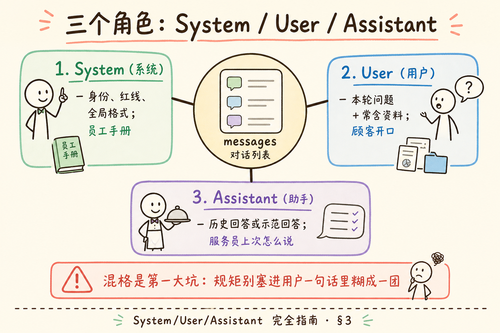
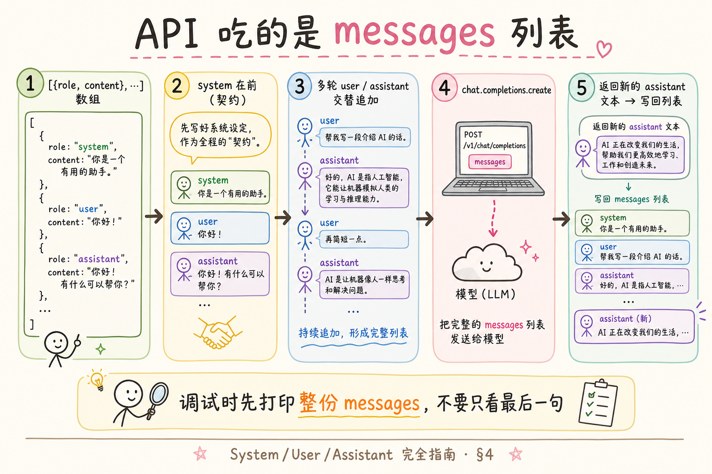
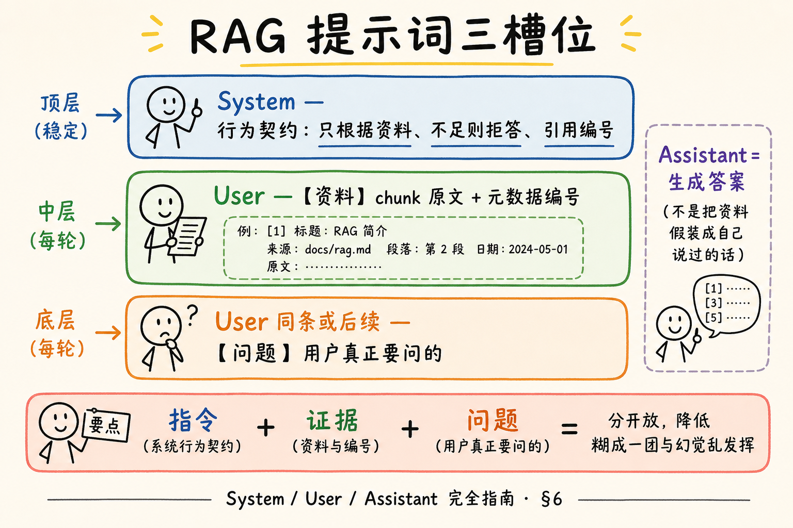
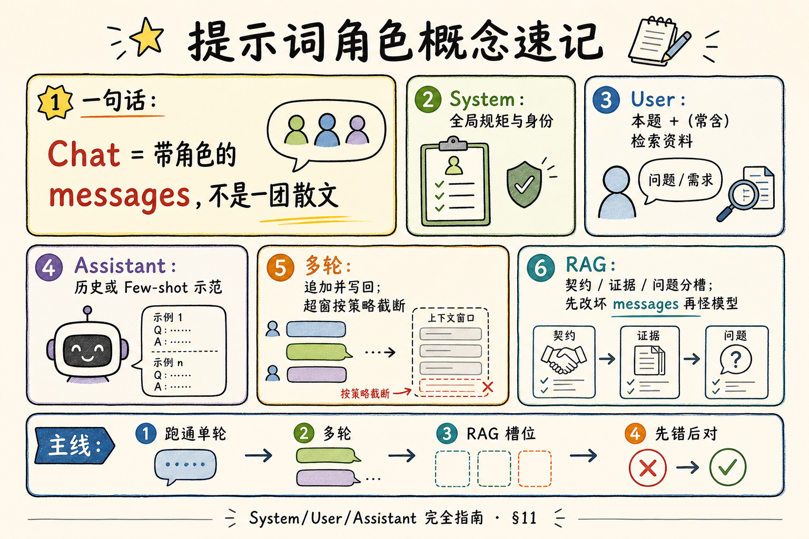

# NLP / IR / LLM 基础（十四）：System / User / Assistant 提示词角色完全指南

> 你会调 Embedding、会算相似度，下一步几乎立刻碰到：**怎么跟聊天模型说话？** 很多「模型不听话」其实不是模型坏了，而是 **角色塞错格子**——把系统规矩塞进用户一句话、多轮历史乱序、RAG 上下文和指令糊成一团。这篇是 [企业 RAG 路线图](ENTERPRISE_RAG_ROADMAP.md) **B 轨第十四篇**（路线图第 **37** 条），定位 **主线篇**：把 `messages` 列表讲透，并带你跑通可运行的 OpenAI 兼容 Chat 调用。前置建议：路线图 34～36（Token、窗口、采样）有印象即可；未读也可从本篇直接上手。

---

## 目录

1. [前言：模型看到的不是「一整段话」](#1-前言模型看到的不是一整段话)
2. [本文边界与动手路径](#2-本文边界与动手路径)
3. [三个角色：System / User / Assistant](#3-三个角色system--user--assistant)
4. [messages 列表：API 真正吃的数据结构](#4-messages-列表api-真正吃的数据结构)
5. [多轮对话：历史怎么拼、哪里会炸](#5-多轮对话历史怎么拼哪里会炸)
6. [RAG 提示词槽位：指令、证据、问题分开放](#6-rag-提示词槽位指令证据问题分开放)
7. [综合实战：完整 messages 可运行示例](#7-综合实战完整-messages-可运行示例)
8. [综合实战：多轮历史与会话状态](#8-综合实战多轮历史与会话状态)
9. [先错后对：别把系统指令塞进 User](#9-先错后对别把系统指令塞进-user)
10. [工程清单：权限、截断、可观测](#10-工程清单权限截断可观测)
11. [综合概念地图](#11-综合概念地图)
12. [常见陷阱与 FAQ](#12-常见陷阱与-faq)
13. [总结与系列下一步](#13-总结与系列下一步)

---

## 1. 前言：模型看到的不是「一整段话」

初学者常以为调用大模型就是：

```text
把一段超长字符串 POST 上去 → 等一段回复
```

对 **Chat Completions**（聊天补全）类接口来说，更准确的画面是：你提交一份 **带角色标签的消息列表**，模型在「接着写下一句助手回复」。角色标签告诉模型：这句话是 **规矩**、是 **用户**，还是 **它自己以前说过的话**。

**Prompt**（提示词）：你喂给模型、用来引导其行为与输出的文本输入（广义上也包括结构化消息）。  
通俗说：考试卷上的题目说明 + 题目本身；写清楚，答卷才靠谱。

**Chat Completions API**（聊天补全接口）：以 `messages` 数组为输入、返回助手下一轮文本的常见调用形态（OpenAI 兼容网关大多如此）。  
通俗说：不是交一篇作文，而是交一本「带角色标注的对话剧本」，请模型写下一句。

**读完本文，你应该能做到：**

1. 用一句话说清 System / User / Assistant 各自职责。  
2. 手写一份合法的 `messages` 列表，并解释每条 `role` 的含义。  
3. 说明多轮历史为何必须按时间顺序追加，以及截断时优先砍什么。  
4. 画出 RAG 场景下「系统指令 / 检索证据 / 用户问题」的槽位分工。  
5. 跑通 §7 最小 Chat 脚本（有 Key）或跟读其数据流（无 Key）。  
6. 识别「把系统指令塞进 user」这类常见坏味道，并改成正确结构。

---

## 2. 本文边界与动手路径

**档位：主线篇。**

**本文讲：** 三角色语义、`messages` 结构、多轮拼接、RAG 槽位、可运行最小 Chat、先错后对对照。  
**本文不讲：** 工具调用 / Function Calling 全流程、多模态图片消息细节、厂商特有的「开发者消息」变体穷举、完整 Prompt 评测平台。Few-shot 与 Chain-of-Thought 见第 31、32 篇。

### 2.1 动手路径表

| 步骤 | 你做什么 | 验收 |
|------|----------|------|
| A | 读 §3～§4，能口述三角色 | 白板三格不混 |
| B | 跑 §7 单轮 Chat | 终端打出助手回复 |
| C | 跑 §8 多轮追加 | 第二轮能引用第一轮约定 |
| D | 对照 §9 改掉「系统塞 user」 | 能指出坏 messages |
| E | 对照 §6 画 RAG 槽位 | 指令/证据/问题分离 |

**环境：** Python 3.10+；`pip install openai`；`OPENAI_API_KEY` 或兼容网关的 Key + `base_url`。无 Key 时把 §7～§8 当阅读材料，重点看 `messages` 形状。

### 2.2 沿用前文

| 概念 | 来自 |
|------|------|
| 提示词是「不改参数的适配」 | [24 预训练与微调](24.pretrain-finetune-tutorial.md) |
| 上下文窗口有限 | 路线图 35 |
| Token 计费 | 路线图 34 |
| 检索回来的是原文 chunk | [25 Embedding](25.embedding-vector-tutorial.md) |

---

## 3. 三个角色：System / User / Assistant

读下图时，先建立「三格信箱」的直觉：规矩、提问、回答各进各的格。




对照上图：**System 定规矩，User 提需求，Assistant 是模型（或你模拟的）历史回答。** 混格是初学者第一大坑。

### 3.1 System（系统）

**System message**（系统消息）：通常放在对话最前，描述助手身份、硬约束、输出格式、安全与拒答策略等「全局规矩」。  
通俗说：员工手册首页——今天你是谁、什么能做、什么绝对不能做。

适合放进 System 的内容示例：

- 身份：「你是企业内部知识库助手。」  
- 硬约束：「不知道就说不知道；禁止编造制度条款。」  
- 格式：「先给结论，再列依据编号。」  
- RAG 行为：「只根据提供的【资料】回答；资料不足时明确说明。」

不适合塞满 System 的：每一轮都变的长篇检索原文（那会挤爆窗口，且难审计）——长证据更常见放在 **User** 的结构化区块，或单独的「上下文消息」约定（见 §6）。

### 3.2 User（用户）

**User message**（用户消息）：终端用户（或你的后端代用户）发出的内容——问题、指令、上传摘要、以及你拼进去的「本轮上下文」。  
通俗说：顾客开口说的话；在 RAG 里，常常是「问题 + 本轮检索到的资料」。

注意：后端工程师经常 **代表用户** 组装 user 内容（例如把检索结果包进模板）。对模型而言，只要 `role=user`，它就按「用户侧输入」理解——所以模板要干净，别把「你是系统」这种元指令偷偷写进 user 还指望它和真正的 system 同等效力（见 §9）。

### 3.3 Assistant（助手）

**Assistant message**（助手消息）：模型已经生成过的回复；在多轮里由你的服务端 **原样写回** `messages`，作为历史。  
通俗说：服务员上次怎么答的，要记在对话本上，否则下一轮就像失忆。

两种常见来源：

1. **真实历史**：上一轮 API 返回的 `content`。  
2. **人工/脚本注入**：Few-shot 时你伪造几轮「示范问答」（见第 31 篇）——此时 assistant 不是「刚才模型说的」，而是「你希望它模仿的样板」。

### 3.4 角色对照表

| 角色 | 谁在说话 | 典型内容 | 谁写入 messages |
|------|----------|----------|-----------------|
| `system` | 产品/安全/架构约定 | 身份、红线、全局格式 | 后端固定或按租户配置 |
| `user` | 终端用户 + 本轮上下文 | 问题、资料块、澄清 | 前端原文 + 后端模板 |
| `assistant` | 模型（或示范） | 历史回答、样板回答 | 上一轮响应或你构造的示例 |

> **厂商差异提醒**：有的模型把 system 合并进首条 user；有的支持额外 `developer` 角色。学概念时以三角色为准；上线时读你所用网关的文档，做一次「空 system / 有 system」对照实验。

---

## 4. messages 列表：API 真正吃的数据结构

读下图，盯住「数组 + 每项 role/content」。




对照上图：你调试 Prompt 时，优先打印 **整份 JSON 形状的 messages**，而不是只看最后一句 user。

### 4.1 最小合法形状

```python
messages = [
    {"role": "system", "content": "你是简洁的中文助手。"},
    {"role": "user", "content": "用一句话解释什么是 RAG。"},
]
```

字段直觉：

- **role**：这句属于哪个信箱。  
- **content**：文本正文（多模态时可能是数组，本篇只谈文本）。

调用时（OpenAI Python SDK 习惯）：

```python
completion = client.chat.completions.create(
    model="gpt-4o-mini",  # 换成你可用的 chat 模型
    messages=messages,
)
text = completion.choices[0].message.content
```

### 4.2 为什么是「列表」而不是「一个大字符串」

1. **角色可区分**：同样一句「不要编造」，放在 system 与埋在 user 长文里，服从程度常不同。  
2. **多轮可追加**：新一轮只需 `append`，不必每次手工重排整篇小说。  
3. **截断可策略化**：可以按消息边界丢弃旧轮，而不是从字符串中间砍半句。  
4. **可观测**：日志里按 role 过滤「本轮 user」「本轮 system 版本号」。

### 4.3 Token 与列表的关系（门牌级）

**Token**（词元）：模型计费与窗口计量的小片段。  
通俗说：不是「按汉字个数」那么简单，中英混合时数量会飘。

整份 `messages` 都会占用上下文窗口。System 越长、历史越长、RAG 资料越多，留给「生成答案」的空间越少。主线工程里要会做：

- 估算或用官方 tokenizer 计数；  
- 超限时丢最旧的 user/assistant 对，或压缩资料；  
- **尽量不先砍 system 里的安全红线**（除非你有更短的等效版本）。

---

## 5. 多轮对话：历史怎么拼、哪里会炸

### 5.1 正确追加姿势

伪代码：

```text
messages = [system]
循环:
  收到用户输入 u
  messages.append({role:user, content:u})
  调用 API → 得到 a
  messages.append({role:assistant, content:a})
  把 a 返回前端
```

要点：

- **顺序**：时间正序；不要把新问题插到 system 前面。  
- **成对**：通常 user 与 assistant 交替出现（中间可有 tool 消息，本篇略）。  
- **一致性**：写回的 assistant 文本应与用户当时看到的一致，避免「前端展示润色版、历史却是原文」导致下一轮错乱。

### 5.2 常见爆炸点

| 症状 | 可能原因 |
|------|----------|
| 第二轮忘了第一轮约定 | 没把历史 assistant/user 带上 |
| 越聊越贵、越慢 | 历史无限追加，未截断 |
| 答非所问 | 截断时砍掉了关键上下文，或 RAG 资料被旧闲聊挤掉 |
| 「你刚才说你会……」对不上 | 前端显示与 messages 不一致 |

### 5.3 会话状态放哪

| 存放处 | 适合 |
|--------|------|
| 服务端 Session / DB | 要审计、多端同步、权限控制 |
| 仅前端 | 玩具 Demo；刷新即丢 |
| 无状态每次重传全历史 | 简单，但要注意大小与敏感信息 |

企业 RAG 对话几乎总要：**会话 ID + 消息表 + 可选「本轮检索 chunk_id 列表」**，方便排障。

---

## 6. RAG 提示词槽位：指令、证据、问题分开放

检索把 chunk 原文找回来之后，生成阶段仍是 Chat：你要把 **规矩、证据、问题** 放进合适的格子。

读下图的三槽位。




对照上图：**System 管行为契约；User（或约定区块）携带【资料】与【问题】；Assistant 只负责生成——不要让模型去「回忆」库里没有的制度。**

### 6.1 推荐槽位（实践向）

**System（稳定、短、可版本化）：**

```text
你是企业知识库助手。
规则：
1. 只根据用户消息中的【资料】回答。
2. 资料不足时明确说「资料中未找到」，不要编造。
3. 回答末尾用 [1][2] 标注依据编号。
```

**User（每轮变化）：**

```text
【资料】
[1] （来源：请假制度.pdf p.3）……
[2] （来源：……）……

【问题】
年假最多可以休几天？
```

### 6.2 为什么证据常放 User 而不是 System

1. **每轮都变**：System 适合稳定契约；把整库塞进 System 既浪费又难缓存。  
2. **权限与审计**：日志里「本轮 user 带了哪些 chunk」更好查。  
3. **截断策略清晰**：超窗时优先压缩或丢低分资料，而不是改员工手册。

有人用第二条 `user` 只放资料、第三条再放问题——也可以，关键是 **团队约定统一**，并在评测集上固定。

### 6.3 和「幻觉」的关系（预告）

**Hallucination**（幻觉）：模型生成看似合理但与事实/资料不符的内容。  
通俗说：一本正经地瞎编。

角色与槽位正确 **不能消灭** 幻觉，但能显著降低「模型以为自己可以自由发挥制度」的概率。路线图 40～41 会专讲幻觉与 Grounding。

---

## 7. 综合实战：完整 messages 可运行示例

### 7.1 阅读顺序

先读完 §3～§4，再跑本节。

**演示什么：** 用 OpenAI 兼容 SDK 发起一次带 system 的单轮 Chat。  
**前置：** `openai`、API Key。  
**预期：** 助手用中文、较短地解释 RAG，并遵守 system 里的「两句以内」。

```python
"""最小实战：System + User 的完整 messages 调用。"""
import os
from openai import OpenAI

client = OpenAI(api_key=os.environ["OPENAI_API_KEY"])
# 兼容网关示例：
# client = OpenAI(
#     api_key=os.environ["OPENAI_API_KEY"],
#     base_url="https://api.deepseek.com",
# )

MODEL = "gpt-4o-mini"  # 换成你账号可用的 chat 模型名

messages = [
    {
        "role": "system",
        "content": (
            "你是面向初学者的中文助教。"
            "回答不超过两句。"
            "不要使用英文缩写而不解释。"
        ),
    },
    {
        "role": "user",
        "content": "什么是检索增强生成？请用生活比喻说明。",
    },
]

resp = client.chat.completions.create(model=MODEL, messages=messages)
print(resp.choices[0].message.content)
```

代码后解读：

- 真正决定「像不像助教、是否两句以内」的，首先是 **system**；  
- user 只负责 **本题**；  
- 打印 `messages` 应能一眼看出两格信箱，而不是一大段散文。

### 7.2 自检清单

- [ ] 响应偏短、偏中文（随模型有波动，看趋势）  
- [ ] 若删掉 system 再跑，风格/长度常明显变松  
- [ ] 你能向同事展示这份 `messages` JSON

### 7.3 迷你 RAG 形状（仍单轮）

把 §6 模板填进 user，即可在同一脚本上改一版：

```python
messages = [
    {
        "role": "system",
        "content": (
            "只根据【资料】回答。"
            "资料不足时说「资料中未找到」。"
            "句末用 [编号] 标注依据。"
        ),
    },
    {
        "role": "user",
        "content": (
            "【资料】\n"
            "[1] 公司年假上限为 15 天（含）。\n"
            "[2] 病假需医院证明。\n\n"
            "【问题】\n"
            "年假最多几天？"
        ),
    },
]
```

预期：答案应落在 15 天附近，并出现 `[1]`。若模型编出「20 天」，说明约束仍不够或模型未遵守——这正是后续要做的 **评测与提示词迭代**，而不是「再把规矩重复三遍塞进 user」就能一劳永逸。

---

## 8. 综合实战：多轮历史与会话状态

**演示什么：** 第一轮约定昵称，第二轮追问时带上完整历史。  
**前置：** 接 §7 的 `client` / `MODEL`。  
**预期：** 第二轮能叫出昵称「小航」。

```python
"""多轮：把 assistant 历史写回 messages。"""
import os
from openai import OpenAI

client = OpenAI(api_key=os.environ["OPENAI_API_KEY"])
MODEL = "gpt-4o-mini"

messages = [
    {
        "role": "system",
        "content": "你是友好的中文助手。记住用户告诉你的昵称。",
    }
]

def chat(user_text: str) -> str:
    messages.append({"role": "user", "content": user_text})
    resp = client.chat.completions.create(model=MODEL, messages=messages)
    reply = resp.choices[0].message.content or ""
    messages.append({"role": "assistant", "content": reply})
    return reply

print("R1:", chat("请记住，我的昵称是小航。只用一句话确认。"))
print("R2:", chat("我的昵称是什么？只回答昵称本身。"))
print("--- messages 条数:", len(messages))
for m in messages:
    print(m["role"], ":", (m["content"] or "")[:60])
```

代码后解读：

- 第二轮 **没有** 再次声明昵称，全靠历史里的 user/assistant；  
- 生产中把 `messages` 换成「从 DB 按 session_id 读出 + 本轮 append」；  
- 打印条数时记得：1 system + 2 user + 2 assistant = 5。

### 8.1 故意搞坏：不写回 assistant

若第二轮调用时只发送 `[system, 最新user]`，模型通常 **不知道** 昵称。这能帮你建立肌肉记忆：**多轮 = 带历史，不是只带最新一句。**

### 8.2 截断策略（最小可用）

```python
def truncate_keep_system(msgs, max_messages=9):
    """保留 system + 最近若干条（演示用，生产请按 token 计）。"""
    if not msgs:
        return msgs
    system = msgs[0] if msgs[0]["role"] == "system" else None
    rest = msgs[1:] if system else msgs
    rest = rest[-(max_messages - (1 if system else 0)) :]
    return ([system] + rest) if system else rest
```

更严肃的做法按 **token 预算** 从最旧的完整轮次删除，并为 RAG 资料单独留配额（例如「历史 ≤ 40%，资料 ≤ 40%，问题与余量 ≤ 20%」——比例按产品调）。

---

## 9. 先错后对：别把系统指令塞进 User

这是主线篇必做的对照实验：同一任务，坏结构 vs 好结构。

### 9.1 错误示范：系统指令塞进 user

```python
# ❌ 坏味道：把「员工手册」写进用户一句话里，且没有 system
bad_messages = [
    {
        "role": "user",
        "content": (
            "你是企业知识库助手，必须只根据资料回答，"
            "不许编造，输出要带引用编号。"
            "资料：年假上限 15 天。"
            "问题：年假最多几天？"
        ),
    }
]
```

可能出现的问题：

1. **约束与问题糊成一团**，模型有时「表演式服从」，有时忽略前半段。  
2. **多轮时约束被冲掉**：下一轮用户只问新问题，旧约束若没再粘贴就消失。  
3. **难版本化**：安全策略应随 `system_prompt_version` 发布，而不是散落在每个 user 字符串。  
4. **权限混淆**：终端用户若能注入「忽略以上所有规则」，你把规则放在同一 user 气泡里更危险——需要配合服务端固定 system、输入消毒与策略模型（进阶安全话题）。

### 9.2 正确示范：分格

```python
# ✅ 对：规矩进 system，资料与问题进 user
good_messages = [
    {
        "role": "system",
        "content": (
            "你是企业知识库助手。"
            "只根据【资料】回答；不足则说明未找到；"
            "句末用 [编号] 引用。"
        ),
    },
    {
        "role": "user",
        "content": (
            "【资料】\n[1] 年假上限 15 天。\n\n"
            "【问题】\n年假最多几天？"
        ),
    },
]
```

### 9.3 对比实验怎么做

| 步骤 | 动作 |
|------|------|
| 1 | 固定模型与 temperature（如 0） |
| 2 | 同一问题跑 bad / good 各 N 次（如 5） |
| 3 | 记录：是否编造、是否带引用、是否超短废话 |
| 4 | 把好结构固化为后端模板 |

**Temperature**（温度）：控制采样随机性的参数；偏低更稳、偏高更发散。  
通俗说：温度低像「照着念」，温度高像「即兴发挥」。对比角色结构时，先把温度拧低，减少噪声。

### 9.4 另一类先错后对：伪造错误历史

**错：** 为了省事，把检索资料写成 `role=assistant` 的「我找到了如下资料……」。  
**对：** 资料是 **你提供给模型的上下文**，不是模型已经说过的话；用 user 模板或独立约定区块，避免污染「助手人设与历史」。

---

## 10. 工程清单：权限、截断、可观测

进入企业项目时，三角色会碰到真实约束：

| 项 | 建议 |
|----|------|
| System 版本号 | 配置中心发布；日志带 `prompt_version` |
| 用户输入 | 长度限制、敏感词/注入基础防护 |
| 检索资料 | 按权限过滤后再进 messages |
| 截断 | 按 token；保留 system 红线与本轮问题 |
| 日志 | 可复现的 messages（注意脱敏） |
| 流式 | SSE 推 `delta`；最终仍要落库完整 assistant |
| 评测 | 固定 messages 模板 + 金标问答集 |

和前端的关系：聊天 UI 展示的气泡 ≈ 过滤后的 user/assistant；**system 一般不给终端用户看全文**（可展示「助手说明」的友好版）。

---

## 11. 综合概念地图




对照上图：先跑通单轮 messages，再加多轮，再套 RAG 三槽位。

### 11.1 速记表

| 概念 | 一句话 |
|------|--------|
| System | 全局规矩与身份 |
| User | 本轮问题与（常含）资料 |
| Assistant | 历史/示范回答 |
| messages | 带角色的对话数组 |
| RAG 槽位 | 契约 / 证据 / 问题分离 |
| 截断 | 保红线与本题，砍旧闲聊 |

---

## 12. 常见陷阱与 FAQ

1. **只有 user，没有 system**——能跑，但契约难稳定、难版本化。  
2. **system 里塞整本知识库**——窗口与缓存双杀。  
3. **多轮不写回 assistant**——表现为失忆。  
4. **前端气泡 ≠ 后端 messages**——排障时两头对不上。  
5. **把 Few-shot 样板和真实历史混着截断**——示范被砍掉，行为漂移（见第 31 篇）。  
6. **以为 role 能替代权限系统**——模型服从 ≠ 数据库行级权限。

**Q：System 一定会被严格遵守吗？**  
A：不会 100%。它是强先验，不是密码学保证。关键约束还要：拒答策略、输出校验、检索 Grounding、人工审核（视风险）。

**Q：要把用户的「你是 GPT」人设覆盖掉吗？**  
A：产品策略问题。企业助手通常以服务端 system 为准，并明确「不扮演越权角色」。

**Q：和 Completion 老接口（单字符串）比呢？**  
A：老接口把角色信息揉进纯文本约定；Chat 的 `messages` 更清晰。新项目优先 Chat。

**Q：RAG 一定要 Chat 模型吗？**  
A：生成阶段通常要；检索阶段用 Embedding。别把 chat 模型名传给 embeddings 接口。

---

## 13. 总结与系列下一步

1. Chat 的核心输入是 **带角色的 messages 列表**，不是一团散文。  
2. **System 定契约，User 带本题与资料，Assistant 记历史（或示范）。**  
3. 多轮 = 追加并写回；超窗要按策略截断。  
4. RAG 生成期把 **指令 / 证据 / 问题** 分槽，降低糊成一团的概率。  
5. 「系统指令塞进 user」是典型坏味道——用 §9 对照改掉。

### 13.1 系列下一步

| 目标 | 阅读 |
|------|------|
| 用例子教格式 | 路线图 **38** → [31 Few-shot](31.few-shot-prompting-tutorial.md) |
| 让模型逐步想 | 路线图 **39** → [32 CoT](32.chain-of-thought-tutorial.md)（了解档） |
| 幻觉与引用 | 路线图 40～41 |
| 闭源 API 模式 | 路线图 42 |

### 13.2 学习目标自检

- [ ] 能画三角色信箱  
- [ ] 能手写合法 messages  
- [ ] 能说明多轮写回与截断  
- [ ] 能画出 RAG 三槽位  
- [ ] 跑通或跟读 §7～§8  
- [ ] 能改掉 §9 坏例子  

---

> **初学者可能仍困惑的点**  
> - 「模型不听话」先查 messages 形状与截断，再怀疑模型智商。  
> - System 不是魔法咒语；要配合低温、格式校验与检索质量。  
> - 不同厂商对 system 的权重不同——以你的网关实测为准。  
> - 下一篇 Few-shot：在 messages 里插入「样板问答」来教格式与风格。
