# Python 包管理与依赖锁定完全指南：从 pip 到 uv.lock，构建可复现的项目环境

> 你是否遇到过——本地跑得好好的代码，推到服务器上就炸了？同事 `pip install` 后的项目行为和你不一样？排查半天才发现是某个依赖的「小版本」更新引入了一个 bug。这篇教程带你彻底搞懂 Python 的包管理机制，掌握从 `requirements.txt` 到锁文件、从 pip 到 uv 的全套依赖管理方案，让你的项目在任何机器上都能精确复现。

**阅读建议：** 建议先读系列第 1 篇 [Python 虚拟环境教程](1.python-virtual-env-tutorial.md)——那篇解决「依赖装在哪」；**本篇解决「依赖装哪个版本、如何锁死」**。第 1 篇只保留 Poetry/uv 的导读，本篇才系统讲工具选型、锁文件和团队可复现工作流。

**环境要求：**
- Python **3.10+**（示例以 3.12 为主）
- 已能创建并激活虚拟环境（`venv` 或工具自带环境均可）
- pip / pip-tools 示例默认在已激活的虚拟环境中执行
- Poetry / uv 示例默认在项目根目录执行；它们通常会自己创建或选择虚拟环境
- Poetry / uv / pipx 这类工具的安装命令属于用户级或全局工具安装，不等同于项目依赖安装

---

## 目录

1. [前言：一颗小炸弹](#1-前言一颗小炸弹)
2. [pip 与 PyPI——一切从这里开始](#2-pip-与-pypi一切从这里开始)
3. [requirements.txt 的困局](#3-requirementstxt-的困局)
4. [依赖锁定是什么](#4-依赖锁定是什么)
5. [pip-tools：给 pip 装上锁](#5-pip-tools给-pip-装上锁)
6. [Poetry：一站式依赖管理](#6-poetry一站式依赖管理)
7. [uv：下一代超快工具](#7-uv下一代超快工具)
8. [三方案深度对比](#8-三方案深度对比)
9. [依赖安全与哈希校验](#9-依赖安全与哈希校验)
10. [私有源与镜像管理](#10-私有源与镜像管理)
11. [最佳实践与避坑指南](#11-最佳实践与避坑指南)
   - [11.5 常见问题（FAQ）](#115-常见问题faq)
12. [总结](#12-总结)

---

## 1. 前言：一颗小炸弹

2024 年 3 月，一个普通的周二下午。你的同事小张推送了一段代码，CI 全绿，合并到了主分支。五分钟后，生产环境的报警短信响了。

你冲到电脑前看日志：

```
ImportError: cannot import name 'cached_property' from 'django.utils.functional'
```

纳尼？这个函数明明在 Django 3.2 里存在啊！你检查服务器上装的 Django 版本——

```bash
$ pip show django
Name: django
Version: 4.2.11   ← 什么时候变成 4.2 了？
```

你翻开 `requirements.txt`：

```
django>=3.2
requests
celery
# ... 下面还有 80 行
```

问题找到了。`django>=3.2` 这个写法太宽泛——它允许安装 3.2、4.0、4.1、4.2 等任何版本。你在本地开发时系统里缓存了 Django 3.2.25，一切都正常。但服务器部署时 `pip install` 选择了「最新可用版本」，也就是 Django 4.2.11。

而你们项目依赖的某个插件 `django-old-plugin` 在 `setup.py` 里写死了 `django>=3.2,<4.0`——它还没适配 Django 4.x。大版本升级后，插件调用的旧 API 在新版 Django 里已变更或移除，于是 import 失败。（上面 `cached_property` 只是示意：真实报错取决于你装了哪些插件和写了什么代码。）

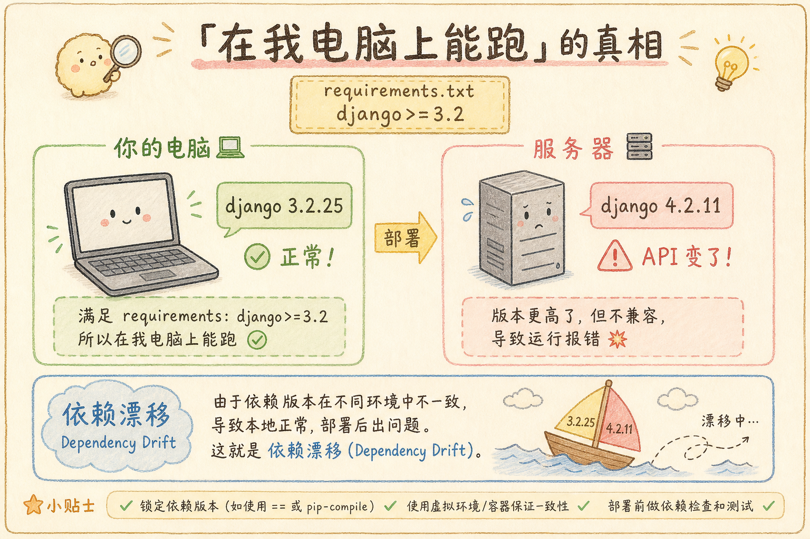


这就是本教程要解决的问题——**如何确保你的项目在任何时间、任何机器上安装的依赖都完全一致？**

---

## 2. pip 与 PyPI——一切从这里开始

### 2.1 pip 与 PyPI 的工作原理

**pip**（Python 官方包安装器）：从仓库下载第三方库并装进当前 Python 环境。

**PyPI**（Python Package Index，https://pypi.org）：Python 的公共「应用商店」，托管 `requests`、`django` 等海量开源包。`pip install requests` 本质上就是去 PyPI 找包、下载、安装。

当你在终端敲下 `pip install requests` 时，幕后发生了这么几件事：

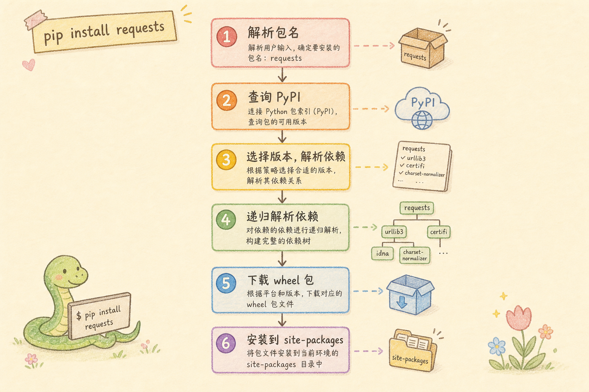

每一步都可能有问题。比如第 3 步——pip 会在满足版本约束、Python 版本和平台条件的候选版本中，**通常**选择最高的非预发布版——这就是「依赖漂移」的根源：约束写太宽时，今天和下周装到的版本可能不同。

### 2.2 版本号的三位数字

很多 Python 包会采用类似 **语义化版本（Semantic Versioning，简称 SemVer）** 的三段写法：版本号写成 `主版本.次版本.修订号`（`MAJOR.MINOR.PATCH`），例如 `4.2.11`。但 Python 打包实际遵循 **[PEP 440](https://peps.python.org/pep-0440/)** 版本规范——SemVer 只是常见习惯，不是强制规则；兼容性承诺要看项目自己的 changelog：

| 段位 | 含义 | 升级时通常意味着 |
|------|------|------------------|
| **4**（MAJOR） | 主版本 | 可能有破坏性变更，代码要改 |
| **2**（MINOR） | 次版本 | 新功能，尽量向后兼容 |
| **11**（PATCH） | 修订号 | 修 bug，最安全 |

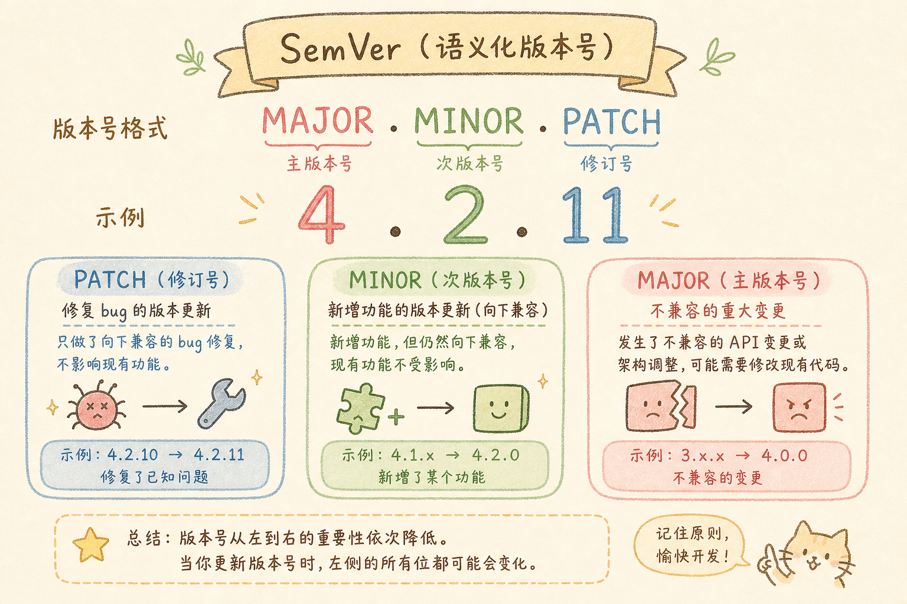


但在 Python 生态中，语义化版本更多是一种「约定」而非「强制规则」。很多包并不严格遵守，所以依赖锁定才变得如此重要。

### 2.3 pip install 的版本指定方式

```bash
# 1. 不指定——装最新版（最危险）
pip install django
# → 安装当前 PyPI 上最新的版本，今天是 4.2，下周可能就是 5.0

# 2. 大于等于——允许大版本升级（危险）
pip install "django>=3.2"
# → 3.2.x 到 99.x.x 都行，范围太宽

# 3. 兼容版本——允许 PATCH 升级（较安全）
pip install "django~=3.2.0"
# → 等价于 >=3.2.0, <3.3.0，只允许修 bug 的版本
# 注意：~=3.2（少写一段）等价于 >=3.2, <4.0，范围更宽，别混用

# 4. 精确版本——锁死（最安全）
pip install "django==3.2.25"
# → 就装这个，不多不少

# 5. 排除某个版本
pip install "django!=4.2.0"
```

来看一个更直观的对比：

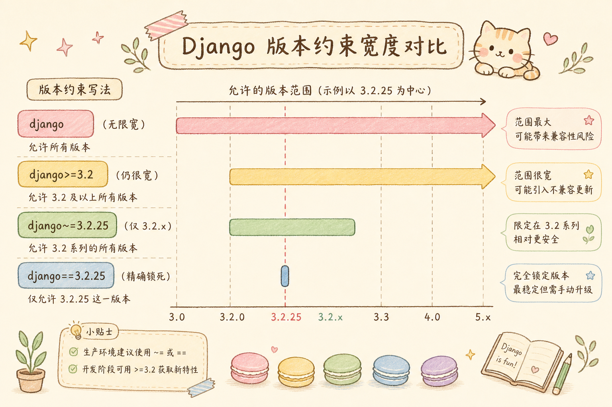


---

## 3. requirements.txt 的困局

### 3.1 最简单的 requirements.txt

```bash
# 生成依赖快照（临时复现实验环境可以用；长期项目维护不推荐直接当声明文件）
pip freeze > requirements.txt
```

这个文件长这样：

```
asgiref==3.7.2
certifi==2024.2.2
charset-normalizer==3.3.2
Django==4.2.11
idna==3.6
requests==2.31.0
sqlparse==0.4.4
urllib3==2.2.1
```

看起来所有版本都锁定了，很完美？**问题在于——这个文件里的很多包你根本没有「主动」安装。**

- `asgiref`、`sqlparse` 是 Django 的依赖
- `certifi`、`idna`、`urllib3` 是 requests 的依赖

这就带来了几个严重问题：

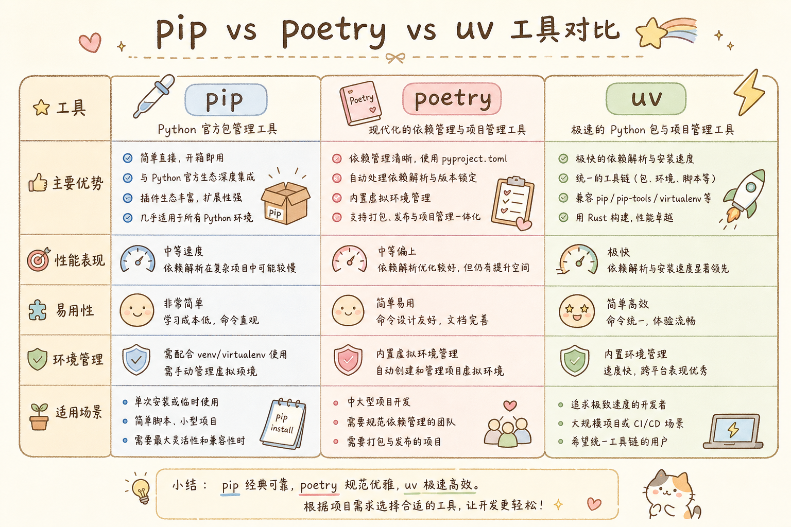


### 3.2 手写 requirements.txt 的进阶用法

如果你想保持「直接依赖」和「间接依赖」的分离，可以分文件管理：

```
my-project/
├── requirements/
│   ├── base.in           ← 手写：你真正需要的包
│   ├── base.txt          ← 自动生成：所有锁定的包（含间接依赖）
│   ├── dev.in            ← 开发环境额外需要的包
│   └── dev.txt           ← 开发环境完整锁定
```

**base.in（你手写）：**

```
django~=4.2
requests~=2.31
python-dotenv~=1.0
```

**dev.in（你手写）：**

```
-c base.txt               # 继承 base.txt 的约束
pytest~=7.4
black~=23.7
ruff~=0.0.280
```

然后**用工具自动生成 `.txt` 文件**：

```bash
pip-compile requirements/base.in -o requirements/base.txt
pip-compile requirements/dev.in -o requirements/dev.txt
pip-sync requirements/base.txt requirements/dev.txt
```

> **命名说明：** 下文 §5 用扁平文件名 `requirements.in` / `requirements.txt` 演示，与这里的 `base.in` / `base.txt` **等价**——只是目录组织方式不同。开发依赖的约束文件务必写 `-c` 指向**已编译好的 base 锁文件**（`base.txt` 或 `requirements.txt`）。

这就是下一章的主角——`pip-tools`。

---

## 4. 依赖锁定是什么

在介绍具体工具之前，先理解依赖锁定的核心概念。

### 4.1 直接依赖 vs 间接依赖

- **直接依赖**：你在代码里 `import`、在配置文件里**主动声明**的包（如 `django`、`requests`）。
- **间接依赖**（传递依赖）：这些包自己还要用的库。你装 Django 时，pip 会自动拉上 `asgiref`、`sqlparse`——你从没写过它们，但它们会进环境。

```
你声明: django, requests
         │
         ├─ django → asgiref, sqlparse …
         └─ requests → urllib3, certifi, idna …
```

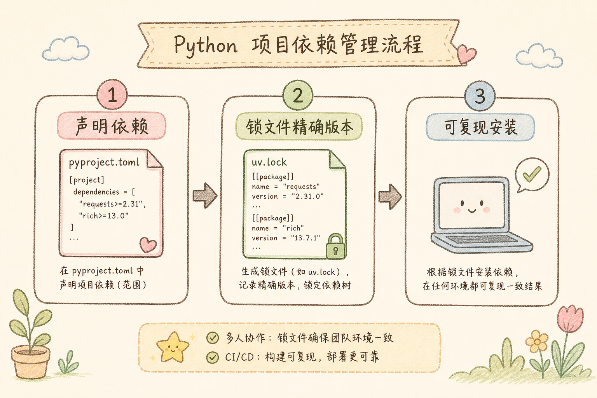

**依赖锁定的含义是：不仅锁死你直接依赖的版本，也锁死所有间接依赖的版本。** 这样整个依赖树从上到下每一个包都是确定的。

### 4.2 锁文件的本质

**锁文件**（lock file）：工具在某次解析后生成的「完整购物小票」——记下**每一个**直接/间接依赖的**精确版本**（常含哈希、来源注释）。通俗说：「2024 年 3 月 15 日、在这台机器上、用 Python 3.12 解析出来的唯一正确答案」。

它与「声明文件」（`requirements.in`、`pyproject.toml` 里的宽松范围）分工不同：声明写**意图**，锁文件写**快照**。

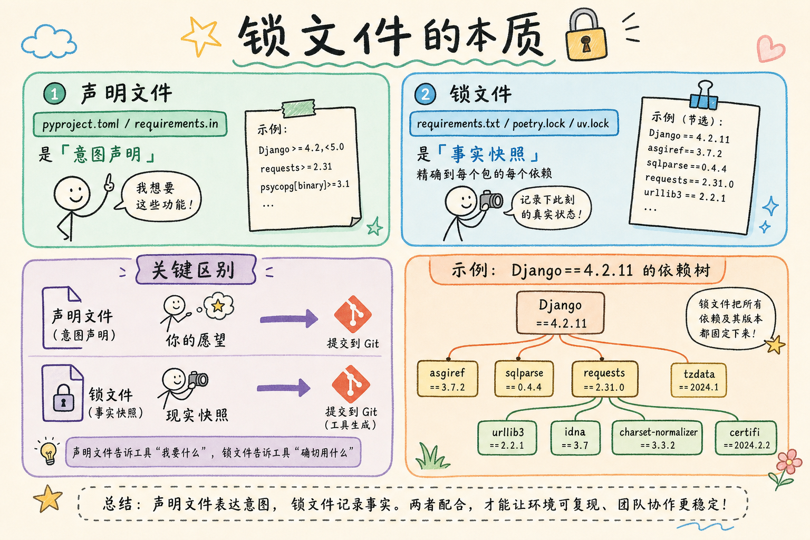


### 4.3 为什么锁文件必须提交到版本控制

「锁文件要不要放到 `.gitignore` 里」是一个常见争议。答案是——**必须提交**。

```
提交锁文件的好处：
  ✓ 所有开发者获得完全一致的依赖版本
  ✓ CI/CD 环境与开发环境一致
  ✓ 代码审查时可以看到依赖变化（谁升级了什么）
  ✓ 可以回溯任意历史版本的确切依赖状态
  ✓ 安全审计——可以查某个有漏洞的版本是何时引入的

不提交锁文件的风险：
  ✗ 每个环境独立解析依赖 → 结果可能不同
  ✗ CI 和本地不一致 → 「CI 上明明能过」的诡异 bug
  ✗ 无法回溯——三个月前那次部署到底用的什么版本？
  ✗ 新同事 clone 项目后装了一堆新版本 → 跑不起来
```

---

## 5. pip-tools：给 pip 装上锁

`pip-tools` 是给 pip 生态加锁文件的最轻量方案。它不要求你改变现有工作流——依然是 `pip install`，只是加了一个 **「编译」** 步骤。

通俗类比：

| 步骤 | 文件 | 比喻 |
|------|------|------|
| 你手写 | `requirements.in` | 菜谱（要哪些菜） |
| `pip-compile` | `requirements.txt` | 带分量的采购单（每样菜精确到克） |
| `pip-sync` | 按 `.txt` 装环境 | 按单清库存再进货，不多不少 |

> **虚拟环境：** pip-tools **不会**自动建 venv，需先用 [venv](1.python-virtual-env-tutorial.md) 或已有环境，再 `pip-sync`。

### 5.1 安装与快速上手

**环境：** 在项目目录、已激活的虚拟环境中执行；`pip install pip-tools` 在系统终端或 venv 内均可。

```bash
pip install pip-tools
# 预期：pip-tools 安装成功，可运行 pip-compile --version
```

**工作流：**

```bash
# 第一步：手写 requirements.in（你只需要写直接依赖）
# 第二步：编译生成 requirements.txt（工具自动解析所有间接依赖）
pip-compile requirements.in
# 预期：生成或更新 requirements.txt

# 第三步：用生成的文件安装
pip-sync requirements.txt
# 预期：环境精确匹配锁文件；会卸载不在 requirements.txt 中的包
# ⚠️ 只在项目虚拟环境中执行 pip-sync，别在全局环境跑
```

### 5.2 完整示例

**requirements.in——你手写的声明文件：**

```
# 只需要写你直接 import 的包
django
requests
python-dotenv
```

就这么简单。最小示例可以不写版本号，也不需要写间接依赖。**真实项目**建议给直接依赖写合理范围，例如 `django>=4.2,<5.0`，避免首次锁定时就引入过新的大版本。

```bash
# 编译——pip-compile 会解析所有依赖并锁定版本
$ pip-compile requirements.in
```

生成的 **requirements.txt：**

```
#
# This file is autogenerated by pip-compile with Python 3.12
# by the following command:
#
#    pip-compile requirements.in
#
asgiref==3.7.2
    # via django
certifi==2024.2.2
    # via requests
charset-normalizer==3.3.2
    # via requests
django==4.2.11
    # via -r requirements.in
idna==3.6
    # via requests
python-dotenv==1.0.1
    # via -r requirements.in
requests==2.31.0
    # via -r requirements.in
sqlparse==0.4.4
    # via django
urllib3==2.2.1
    # via requests
```

注意看注释——每一行都标明了**「这个包是被谁带进来的」**。这解决了 `pip freeze` 的「罪一」：你永远知道每个间接依赖的源头。

```
    依赖来源一目了然

    asgiref==3.7.2
        # via django          ← 哦，是 Django 需要的

    certifi==2024.2.2
        # via requests        ← 是 requests 需要的

    django==4.2.11
        # via -r requirements.in  ← 是我主动装的！
```

### 5.3 开发依赖分离

**dev-requirements.in（手写）：**

```
-c requirements.txt
pytest
black
ruff
```

`-c requirements.txt` 表示：开发依赖的版本选择不能与基础锁文件冲突（对应 §3.2 多文件结构时，改为 `-c base.txt`）。

```bash
# 先编译基础依赖，再编译开发依赖
pip-compile requirements.in
pip-compile dev-requirements.in

# 同步安装（基础 + 开发）
pip-sync requirements.txt dev-requirements.txt
```

### 5.4 升级依赖

```bash
# 升级所有包到最新兼容版本
pip-compile --upgrade requirements.in

# 只升级某个特定的包
pip-compile --upgrade-package django requirements.in

# 只升级某个包到指定版本
pip-compile --upgrade-package "django<5.0" requirements.in
```

### 5.5 生成哈希校验

```bash
# 生成带哈希的锁文件
pip-compile --generate-hashes requirements.in
```

生成的 requirements.txt 会变成这样：

```
django==4.2.11 \
    --hash=sha256:6e6ff3db2d8dd0c986b4e9f0c4f74e1f27a15c23b3e4e8c2d0c87a5e7f9a4b3c \
    --hash=sha256:a1b2c3d4e5f6g7h8i9j0k1l2m3n4o5p6q7r8s9t0u1v2w3x4y5z6a7b8c9d0e1f
    # via -r requirements.in
```

有了哈希，pip 安装时会验证下载的文件是否和锁文件中记录的哈希一致——若包内容被篡改，pip 会拒绝安装（详见 [§9.1](#91-为什么需要哈希校验)）。

### 5.6 pip-tools 工作流全景

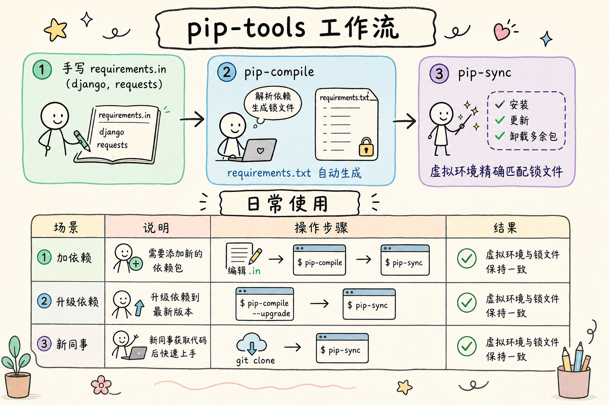


---

## 6. Poetry：一站式依赖管理

> **要不要读本章？** 若你选 **pip-tools** 或 **uv** 且不做 PyPI 发包，可略读命令对比；若你要**发布库到 PyPI** 或喜欢「一条命令管环境+依赖」，本章值得精读。

**虚拟环境**（通俗说：项目专属的独立 Python「小房间」，依赖互不干扰）：Poetry 会**自动**创建和管理，无需手动 `python -m venv`。概念详解见 [虚拟环境教程 §2](1.python-virtual-env-tutorial.md#2-什么是虚拟环境)。

**本章必记三条：** `poetry add 包名` · `poetry install` · `poetry lock`

`pip-tools` 解决了依赖锁定问题，但你还是需要自己管理虚拟环境。Poetry 则是一站式方案——虚拟环境 + 依赖声明 + 锁定 + 打包发布，全包了。

### 6.1 安装与初始化

**环境：** 在系统终端执行，不需要先进入项目虚拟环境；安装成功后 `poetry --version` 应输出版本号。下文命令示例基于 **Poetry 1.8+**；Poetry 2.x 的 `lock`/`sync` 子命令请以 `poetry lock --help` 和官方文档为准。

```bash
# 安装 Poetry（推荐用官方脚本）
# Windows (PowerShell):
(Invoke-WebRequest -Uri https://install.python-poetry.org -UseBasicParsing).Content | python -

# macOS / Linux:
curl -sSL https://install.python-poetry.org | python3 -

# 验证安装
poetry --version

# 创建新项目
poetry new my-project
cd my-project
```

创建后的目录结构：

```
my-project/
├── pyproject.toml          ← 项目元数据 + 依赖声明（你维护）
├── poetry.lock             ← 锁文件（Poetry 自动生成，提交到 Git）
├── README.md
├── tests/
│   └── __init__.py
└── my_project/
    └── __init__.py
```

### 6.2 pyproject.toml——依赖声明

**pyproject.toml**：项目的「总控配置文件」——项目名、版本、依赖范围、构建方式都写在这里（Poetry 使用 `[tool.poetry]` 段；uv 更常用 [PEP 621](https://peps.python.org/pep-0621/) 标准的 `[project]` 段，见 §7.3）。

```toml
[tool.poetry]
name = "my-project"
version = "0.1.0"
description = "一个示例项目"
authors = ["你的名字 <you@example.com>"]
readme = "README.md"

[tool.poetry.dependencies]
python = "^3.10"          # 兼容 3.10、3.11、3.12，但不接受 4.0
django = "^4.2"           # 允许 4.2.x 到 4.x（不到 5.0）
requests = "^2.31"
python-dotenv = "^1.0"

[tool.poetry.group.dev.dependencies]
pytest = "^7.4"
black = "^24.1"
ruff = "^0.1"

[build-system]
requires = ["poetry-core"]
build-backend = "poetry.core.masonry.api"
```

`^` 符号（caret 约束）是 Poetry 的特色：

```
^4.2    意味着 >=4.2, <5.0     允许 MINOR 和 PATCH 升级，不容 MAJOR
^1.0    意味着 >=1.0, <2.0
^0.3    意味着 >=0.3, <0.4     （0.x 版本特殊处理，不允许 MINOR 升级）
^4.2.11 意味着 >=4.2.11, <5.0
```

### 6.3 poetry.lock——锁文件的王者

```bash
# 安装所有依赖（创建或更新 poetry.lock）
poetry install

# 只装生产依赖
poetry install --only main

# 安装时不更新锁文件（使用已有的 lock 文件）
poetry install --sync
```

> **版本提示**：Poetry 2.x 更推荐查看 `poetry sync`；不同版本命令细节可能变化，遇到不一致时以 `poetry --help` 为准。

`poetry.lock` 长什么样？

```toml
[[package]]
name = "django"
version = "4.2.11"
description = "A high-level Python web framework..."
python-versions = ">=3.8"

[package.dependencies]
asgiref = ">=3.6.0,<4"
sqlparse = ">=0.3.1"

[[package]]
name = "asgiref"
version = "3.7.2"
description = "ASGI specs, helper code, and adapters"
python-versions = ">=3.7"

[package.dependencies]
typing-extensions = {version = ">=4"}
```

### 6.4 日常命令：加依赖与升级

下面是最常用的 Poetry 依赖命令；读图时对照「加生产依赖 / 加开发依赖 / 升级 / 锁定」四条主线。

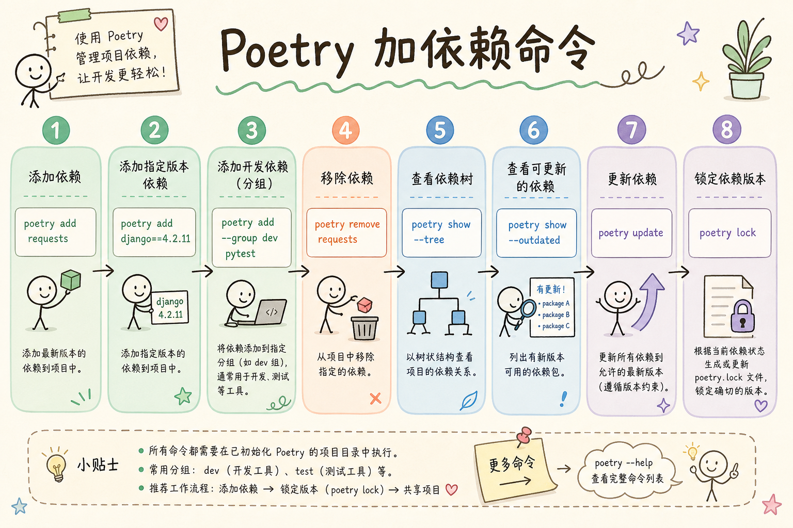

```bash
poetry add httpx                    # 加生产依赖，更新 pyproject.toml + poetry.lock
poetry add --group dev pytest       # 加开发依赖
poetry update django                # 只升级 django 及其依赖链
poetry lock                         # 根据 pyproject.toml 重新解析并刷新锁文件（版本可能变）
poetry sync                         # Poetry 2.x：按锁文件同步环境（类似 uv sync）
```

对照上图：`poetry add` 改声明并解析锁文件；`poetry update` 在约束范围内尝试新版本；`poetry lock` 只刷新锁、不安装；`poetry show --tree` 查看依赖树。

### 6.5 Poetry 的依赖解析过程

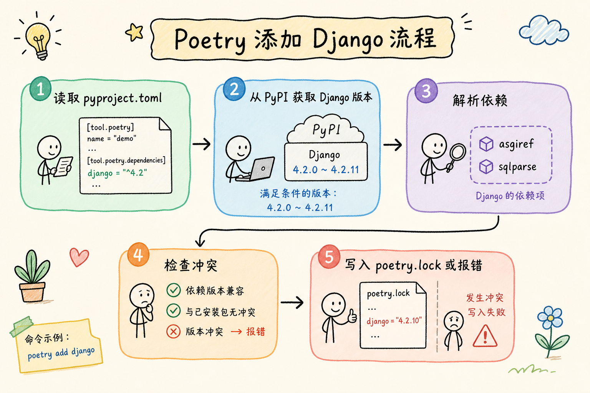

Poetry 的依赖解析器在版本冲突时会**回溯尝试**（backtracking）——换一组版本组合直到满足所有约束。现代 pip（20.3+ 起的新解析器）也会回溯，但在**复杂冲突**场景下，Poetry/uv 的策略往往更可预测。具体行为随工具版本演进，选型时以你团队实测为准。

---

## 7. uv：下一代超快工具

> **要不要读本章？** 新项目、追求速度和简单工作流，**推荐精读**；老项目已深度绑定 Poetry 且运行良好，可先读 §8 对比再决定是否迁移。

**本章必记三条：** `uv add 包名` · `uv sync` · `uv run python 脚本.py`

[uv](https://github.com/astral-sh/uv) 由 Astral（ruff 团队）用 Rust 开发，可替代 pip、pip-tools、Poetry、pyenv、virtualenv 等多款工具；`uv add` 时会**自动创建虚拟环境**。

### 7.1 安装

**环境：** 在系统终端执行；成功后 `uv --version` 应输出版本号。

```bash
# Windows
powershell -c "irm https://astral.sh/uv/install.ps1 | iex"

# macOS / Linux
curl -LsSf https://astral.sh/uv/install.sh | sh

# 或用 pip 安装（适合临时体验；团队长期使用更推荐官方安装器或 pipx）
pip install uv
```

### 7.2 速度对比

```
              pip install django (冷缓存) 耗时对比

    pip:      ████████████████████████████████  12.3 秒
    poetry:   ██████████████████████████        10.1 秒
    uv:       ███                               2.7 秒

              pip install django (热缓存)

    pip:      ████████████████████████████        5.2 秒
    poetry:   ██████████████████                 3.8 秒
    uv:       █                                     0.3 秒

    测试环境: Python 3.12, macOS, 100Mbps 网络
    ⚠️ 以上为示意 benchmark，实际结果因网络、缓存、机器而异
```

### 7.3 快速上手

```bash
# 创建项目
uv init my-project
cd my-project

# 加依赖（自动创建虚拟环境）
uv add django requests

# 删除依赖
uv remove requests

# 运行脚本
uv run python manage.py runserver

# 同步环境（安装 pyproject.toml 中所有依赖）
uv sync
```

`uv init` 生成的 **pyproject.toml：**

```toml
[project]
name = "my-project"
version = "0.1.0"
description = "Add your description here"
readme = "README.md"
requires-python = ">=3.12"
dependencies = []

# uv 使用 PEP 621 标准 [project] 段，而不是 Poetry 的 [tool.poetry] 自定义格式
# PEP 621 = Python 官方规定的 pyproject.toml 项目元数据写法
# 这是它和 Poetry 的一个重要区别
```

`uv add django` 之后：

```toml
[project]
name = "my-project"
version = "0.1.0"
description = "Add your description here"
readme = "README.md"
requires-python = ">=3.12"
dependencies = [
    "django>=4.2.11",
    "requests>=2.31.0",
]
```

### 7.4 uv.lock——跨平台的锁文件

`uv.lock` 的一个关键特性是**跨平台解析**。pip-tools 生成的 `requirements.txt` 常更偏「生成时的解析环境」；Poetry 的 `poetry.lock` 也支持 markers，但跨平台体验与 uv 不同。`uv.lock` 可以在同一份锁文件里记录多 Python 版本、多平台的 wheel 与哈希：

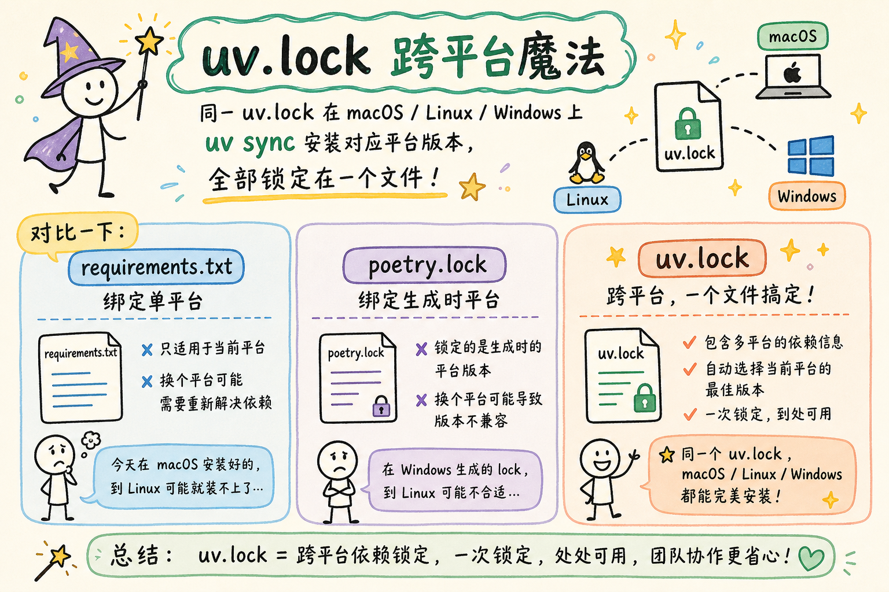

对照上图：同一份 `uv.lock` 可同时容纳 Windows 与 Linux 下不同 wheel 条目，团队 clone 后 `uv sync` 会按本机环境选对的那条。

```bash
# uv sync 或 uv lock 会生成 uv.lock
uv lock
```

示例片段（真实 `uv.lock` 字段名以你本机 `uv lock` 生成为准）：

```toml
# uv.lock 片段（真实格式简化，字段名以你本机 uv lock 生成为准）
[[package]]
name = "django"
version = "4.2.11"
source = { registry = "https://pypi.org/simple" }
dependencies = [
    { name = "asgiref" },
    { name = "sqlparse" },
]

[[package]]
name = "asgiref"
version = "3.7.2"
# 不同平台/ Python 版本可能有不同 wheel 条目与哈希，同存于 uv.lock
```

### 7.5 uv 常用工作流

```bash
# === 日常开发 ===

# 加依赖 → 自动更新 pyproject.toml + uv.lock
uv add httpx

# 加开发依赖
uv add --dev pytest black

# 升级某个包
uv lock --upgrade-package django

# 升级所有包
uv lock --upgrade

# === 生产部署 ===

# 严格按锁文件安装（生产环境推荐）
uv sync --frozen         # 不更新锁文件，完全按 uv.lock 来

# 只装生产依赖
uv sync --no-dev

# === CI/CD ===

# CI 中快速安装——用缓存
uv sync --frozen --no-dev

# === 工具运行（类似 npx） ===

# 不安装到项目，直接运行
uvx ruff check .        # 等价于 npx，但针对 Python 工具
uvx black --check .
```

### 7.6 uv 的依赖解析速度为什么这么快（可选阅读）

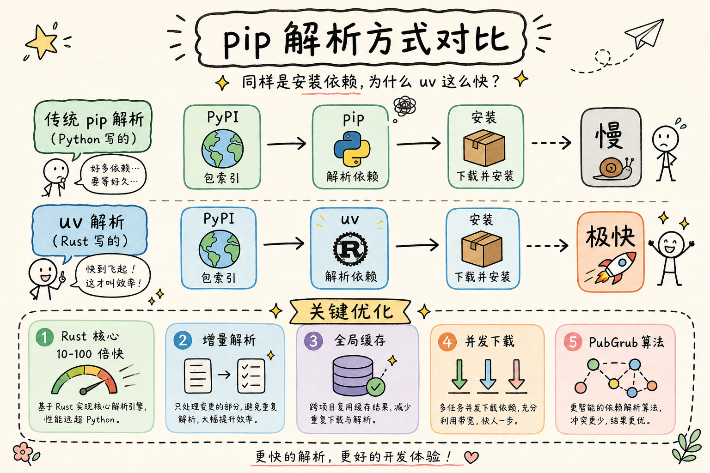

uv 用 Rust 实现解析与下载，并采用 **PubGrub** 等高效算法——核心思想是**提前剪枝**：一旦发现某条依赖路径不可能成功，立刻放弃，少做无效尝试。你只需知道「uv 解析通常比传统 pip 快很多」即可；算法细节不影响日常使用。

---

## 8. 三方案深度对比

### 8.1 功能矩阵

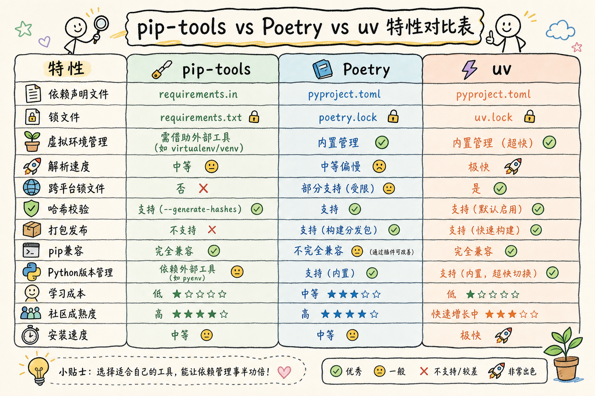

| 能力 | pip-tools | Poetry | uv |
|------|-----------|--------|-----|
| 依赖锁定 | `requirements.txt` | `poetry.lock` | `uv.lock` |
| 虚拟环境 | 需自己建（venv） | 自动管理 | 自动管理 |
| 声明文件 | `requirements.in` | `pyproject.toml` `[tool.poetry]` | `pyproject.toml` `[project]`（PEP 621） |
| 发布到 PyPI | 需配合 build 工具 | 内置 `poetry publish` | 支持 build/publish 工作流 |
| 速度 | 中等 | 较慢 | 很快 |
| 迁移成本 | 最低（加在现有 pip 上） | 中 | 低～中（可导入 requirements） |
| 跨平台锁文件 | 较弱 | 一般 | 强（`uv.lock` 多平台） |

### 8.2 我应该选哪个——决策树

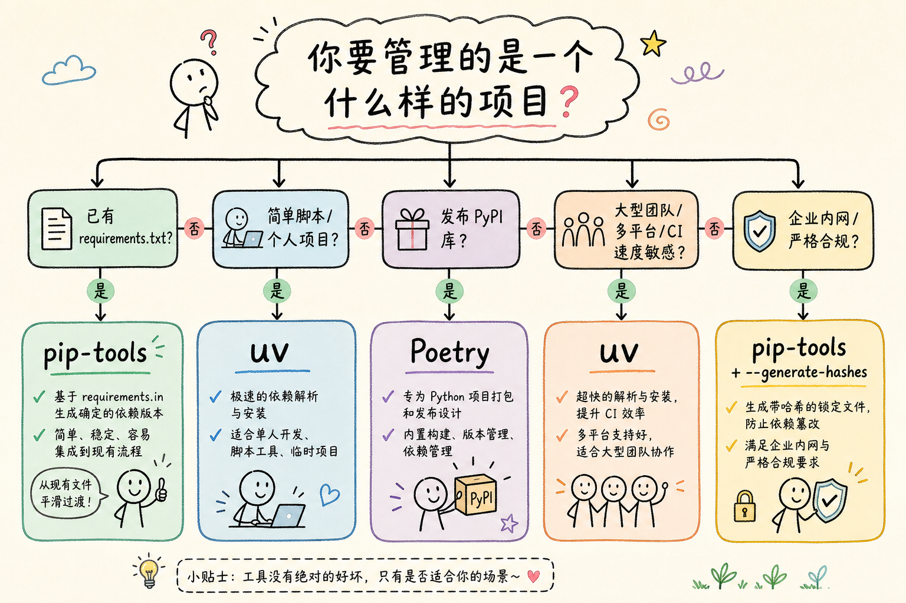

```
已有 pip + requirements，只想加锁、少改习惯？
├─ 是 → pip-tools
└─ 否 → 要发布库到 PyPI、看重打包生态？
        ├─ 是 → Poetry
        └─ 否 → 新项目 / 要极速 / 要一站式 → uv（目前最常被推荐的新默认）
```

> 没有绝对正确答案；团队已有规范时，**统一比选型优雅更重要**。


### 8.3 从 pip-tools 迁移到 uv

**建议流程：** 新分支迁移 → 生成 `uv.lock` 后跑测试 → README 写明唯一权威锁文件。

```bash
# 如果你已经有 requirements.txt 或 pyproject.toml
uv pip install -r requirements.txt   # uv 兼容 pip 的命令

# 或者直接让 uv 接管
uv init                    # 创建 pyproject.toml（如果还没有）
uv add -r requirements.txt # 从 requirements.txt 导入
# 预期：生成 uv.lock，pyproject.toml 写入依赖

# 从 Poetry 迁移
# uv 可以直接读 Poetry 的 pyproject.toml
uv sync   # 会生成 uv.lock；不必保留 poetry.lock，二者选一种锁文件即可
# 预期：测试通过后，停止更新 poetry.lock
```

> **`poetry.lock` 与 `uv.lock` 能共存吗？** 文件可以同在仓库，但**不应两套同时作为权威**。迁移期生成 `uv.lock` 后，应停止更新 `poetry.lock`，并在 README 中写明团队以哪套为准。

---

## 9. 依赖安全与哈希校验

### 9.1 为什么需要哈希校验

两类风险要分开看：

**1. 装错包名（typosquatting）**  
攻击者在 PyPI 上传与知名包拼写相近的恶意包（如 `rquests`）。这靠**仔细核对包名**、`pip-audit` 和代码审查防范——**哈希校验帮不上「名字打错」**。

**2. 包内容被篡改（供应链攻击）**  
若 PyPI 上合法包的某个版本被替换，或下载途中被中间人篡改，**哈希校验**可比对「下载文件的指纹」与锁文件记录是否一致，不一致则拒绝安装。

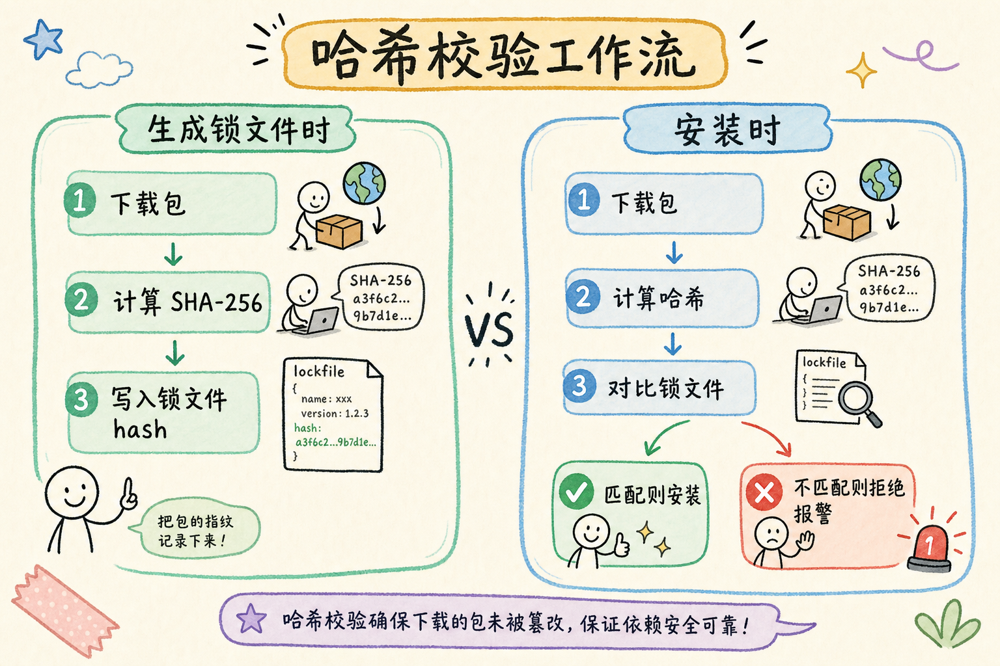


### 9.2 各工具的哈希支持

```bash
# pip-tools
pip-compile --generate-hashes requirements.in
# 生成带 --hash=sha256:... 的 requirements.txt

# Poetry——默认启用，不需要额外参数
poetry lock
# poetry.lock 中每个包自动包含哈希

# uv——默认启用
uv lock
# uv.lock 中包含所有平台的哈希
```

### 9.3 依赖安全检查工具

**CVE**（Common Vulnerabilities and Exposures）：公开的安全漏洞编号。`pip-audit` 会拿你环境里的包版本与漏洞库比对，提示应升级到的修复版本。

```bash
# pip-audit: 检查已知漏洞
# 推荐作为一次性开发工具运行，避免把审计工具混进项目运行依赖
uvx pip-audit

# 如果不用 uv，也可以使用 pipx
pipx run pip-audit

# 输出:
# Found 3 known vulnerabilities in 2 packages
# Name    Version  ID                  Fix Versions
# django  4.2.10   CVE-2024-XXXX-XXXX  4.2.11
# requests 2.31.0  CVE-2023-XXXX-XXXX  2.32.0

# 如果团队决定把它作为开发工具固定下来，再安装到 dev 依赖中
pip install pip-audit
pip-audit
# 输出:
# Found 3 known vulnerabilities in 2 packages
# Name    Version  ID                  Fix Versions
# django  4.2.10   CVE-2024-XXXX-XXXX  4.2.11
# requests 2.31.0  CVE-2023-XXXX-XXXX  2.32.0

# safety: 另一个安全检查工具
pip install safety
safety check

# 在 CI 中集成
# .github/workflows/security.yml
# - run: pip-audit
```

---

## 10. 私有源与镜像管理

### 10.1 为什么要用镜像源和私有源

- **镜像源**（如阿里云、清华 PyPI 镜像）：在国内访问 PyPI 慢或不稳定时，用离你很近的副本加速 `pip install`。**通俗说：就近仓库，不是换一套包。**
- **私有源**：公司内部的包仓库，存放不能公开发布的内部库（`my-internal-lib`）。公网 PyPI 上没有，必须从私有源拉。

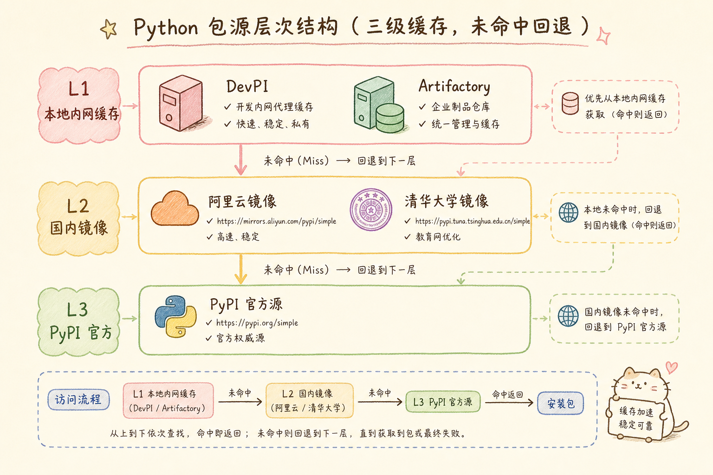


### 10.2 配置镜像源

**pip / pip-tools：**

```ini
# pip.conf (Linux/macOS: ~/.pip/pip.conf; Windows: %APPDATA%\pip\pip.ini)
[global]
index-url = https://mirrors.aliyun.com/pypi/simple/
```

> 只有在使用 HTTP 源或遇到公司证书代理等特殊问题时，才考虑 `trusted-host`；普通 HTTPS 镜像不建议默认加。

```bash
# 或使用环境变量
export PIP_INDEX_URL=https://mirrors.aliyun.com/pypi/simple/
# Windows PowerShell:
# $env:PIP_INDEX_URL="https://mirrors.aliyun.com/pypi/simple/"
```

```bash
# pip-compile 时指定源
pip-compile --index-url https://mirrors.aliyun.com/pypi/simple/ requirements.in
```

**Poetry：**

> **安装源 vs 发布仓库：** `[[tool.poetry.source]]` 配置的是**安装依赖**时从哪里下载；`poetry config repositories.*` 主要用于**发布包**到私有仓库。初学者配置镜像请优先用下面的项目级 source。

```toml
# pyproject.toml（推荐——项目级安装源）
[[tool.poetry.source]]
name = "aliyun"
url = "https://mirrors.aliyun.com/pypi/simple/"
priority = "primary"
```

**uv：**

```bash
# 环境变量
export UV_INDEX_URL=https://mirrors.aliyun.com/pypi/simple/
# Windows PowerShell:
# $env:UV_INDEX_URL="https://mirrors.aliyun.com/pypi/simple/"

# 或命令行参数
uv sync --index-url https://mirrors.aliyun.com/pypi/simple/

# 或在 pyproject.toml 中
```

```toml
# pyproject.toml
[tool.uv]
index-url = "https://mirrors.aliyun.com/pypi/simple/"
```

### 10.3 混合公有/私有源

实际项目中经常需要同时从公共 PyPI 和私有仓库获取包：

**Poetry：**

```toml
# pyproject.toml
[[tool.poetry.source]]
name = "private"
url = "https://pypi.mycompany.com/simple/"
priority = "explicit"      # 只有显式指定的包才从这里下载

[[tool.poetry.source]]
name = "aliyun"
url = "https://mirrors.aliyun.com/pypi/simple/"
priority = "primary"       # 默认源（替代 PyPI）

[tool.poetry.dependencies]
my-internal-lib = {version = "^1.0", source = "private"}
django = "^4.2"            # 不指定 source，从 primary 源下载
```

---

## 11. 最佳实践与避坑指南

### 11.1 十大黄金法则

**法则一：锁文件一定要提交到 Git**

```
.gitignore 里不应该有:
  ❌ poetry.lock
  ❌ uv.lock
  ❌ requirements.txt（应用项目中编译生成的锁定依赖清单）

.gitignore 里应该有:
  ✅ .venv/
  ✅ __pycache__/
  ✅ *.pyc
```

如果你写的是可发布到 PyPI 的库，是否提交编译后的 `requirements.txt` 要看团队发布策略；但 Web 应用、脚本服务、数据任务这类“要部署运行”的项目，锁定后的依赖清单通常应该提交。

**法则二：声明文件宽松，锁文件严格**

```toml
# pyproject.toml——人类维护，声明意图
dependencies = [
    "django>=4.2,<5.0",    # 宽松范围
    "requests>=2.31",
]

# lock 文件——工具生成，精确锁定
# django==4.2.11    ← 具体到 PATCH 号
# requests==2.31.0
```

**法则三：区分直接依赖和间接依赖**

```python
# ❌ 在 requirements.in 里写满间接依赖
# ❌ 用 pip freeze > requirements.in

# ✅ 只写你真正 import 的包
# 让工具去处理间接依赖
```

**法则四：生产环境用 `--frozen` 或 `--sync`**

```bash
# ⚠️ pip install -r requirements.txt 不会更新锁文件，但只增量安装/升级，
#    不会清理环境中多余的旧包，也不一定强制哈希校验
pip install -r requirements.txt

# ✅ 按锁文件精确安装（推荐生产或长期环境）
pip-sync requirements.txt        # pip-tools：精确匹配，会卸载多余包
poetry install --sync            # Poetry 1.x 常见写法；Poetry 2.x 可查看 poetry sync
uv sync --frozen                 # uv
```

**法则五：定期更新和审计依赖**

```bash
# 每周跑一次——看看哪些包可以升级
pip-compile --upgrade && pip-audit     # pip-tools
poetry show --outdated && pip-audit     # Poetry
uv lock --upgrade && pip-audit         # uv

# 在 CI 中自动化这些检查
```

**法则六：设置 Python 版本要求**

```toml
# pyproject.toml
[project]
requires-python = ">=3.10"
# ↑ 防止在不兼容的 Python 版本上安装

# 或
[tool.poetry.dependencies]
python = "^3.10"
```

**法则七：分离生产依赖和开发依赖**

```toml
# pyproject.toml (PEP 621 标准格式)
[project]
dependencies = [
    "django>=4.2",
    "requests>=2.31",
]

[project.optional-dependencies]
dev = [
    "pytest>=7.4",
    "black>=24.1",
]
```

```bash
# 安装时区分
uv sync --no-dev          # 生产环境，不装 dev
uv sync                   # 开发环境，全装
```

**法则八：用 `pip-sync` 而不是 `pip install`**

```bash
# ❌ pip install -r requirements.txt
# 只会「添加」新的包，不会「删除」不再需要的包

# ✅ pip-sync requirements.txt
# 精确匹配——卸载不在 requirements.txt 中的包，安装缺失的包
```

**法则九：多环境共用约束文件**

```
requirements/
├── base.in          # 所有环境共用的依赖
├── base.txt         # 生成的锁文件
├── dev.in           # -c base.txt + 开发工具
├── dev.txt
├── prod.in          # -c base.txt + 生产工具
└── prod.txt
```

**法则十：新成员加入只需一条命令**

按你项目选定的工具执行（**三选一，与 §8 决策一致**）：

```bash
git clone <repo> && cd <repo>

# pip-tools
pip-sync requirements.txt requirements/dev-requirements.txt   # 若有开发依赖

# Poetry
poetry install

# uv
uv sync
```

工具会自动处理虚拟环境与依赖安装；若用 pip-tools，需先确保已 `python -m venv .venv` 并激活（见 [虚拟环境教程](1.python-virtual-env-tutorial.md)）。

### 11.2 常见踩坑实录

**坑一：在 Docker 里不用锁文件**

```dockerfile
# ❌ 每次 build 结果可能不同
FROM python:3.12
COPY requirements.in .
RUN pip-compile requirements.in && pip install -r requirements.txt

# ✅ 在本地编译，Docker 里只安装锁定的版本
FROM python:3.12
COPY requirements.txt .
RUN pip install --no-cache-dir -r requirements.txt
```

**坑二：`poetry update` vs `poetry lock` 分不清**

```bash
poetry lock              # 解析 pyproject.toml 约束，生成新的锁文件（版本可能变）
poetry update            # 更新锁文件 + 安装新版本
poetry update django     # 只更新 Django 及其依赖链
# Poetry 1.x 曾有 lock --no-update；Poetry 2.x 行为有变，以 poetry lock --help 为准
```

**坑三：Python 版本变了但锁文件没变**

```
在 Python 3.11 下生成的 poetry.lock，拿到 Python 3.12 的机器上运行。
某些包有 `python_requires` 约束，3.12 可能不支持。

→ 确保所有开发者和 CI 用相同 Python 版本
→ 或用 .python-version 文件统一（pyenv/uv 支持）
→ 如果是 uv，uv.lock 天然支持跨版本
```

**坑四：忽略 `pyproject.toml` 中的 `package-mode`**

```toml
# 如果你的项目不是要发布的库（大多数 Web 应用都不是）
# 在 uv 中:
[tool.uv]
package = false  # 不尝试构建 wheel，节省时间

# 在 Poetry 中同样:
[tool.poetry]
package-mode = false
```

**坑五：`pip install -e .` 和锁文件的关系**

```bash
# 可编辑安装（开发模式）—— 代码改动立即生效
pip install -e .

# 但这对依赖锁定没有影响——间接依赖的处理方式和普通安装一样
# 只是你项目本身的代码用符号链接而非复制
```

### 11.3 依赖管理成熟度模型

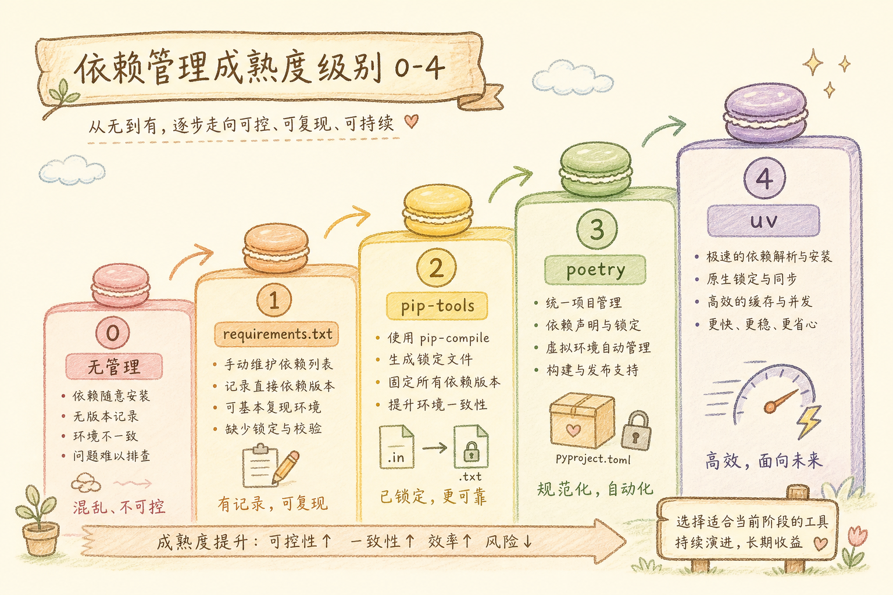

| 级别 | 典型做法 | 风险 |
|------|----------|------|
| **0** | 无 venv、无锁文件、`pip install` 随意装 | 「在我电脑上能跑」 |
| **1** | 有 venv，`pip freeze > requirements.txt` | 间接依赖混在一起，难升级 |
| **2** | `requirements.in` + `pip-compile` 或 Poetry/uv 锁文件 | 可复现，团队可协作 |
| **3** | 锁文件 + 哈希 + CI 审计（pip-audit） | 可复现且可审计 |
| **4** | 多环境约束、私有源、自动化升级策略 | 适合中大型团队 |

### 11.4 何时不必换工具

- 老项目 Poetry 运行良好、团队已熟悉 → **不必**为追新而迁 uv。
- 只是个人脚本、无协作 → venv + 精确 `requirements.txt` 可能够用。
- 团队已有统一规范 → **统一比选型优雅更重要**（见 §8.2）。

### 11.5 常见问题（FAQ）

**Q：`pip freeze` 和 `pip-compile` 应该用哪个？**

`pip freeze` 适合临时快照；长期维护用 `pip-compile`——只写直接依赖，间接依赖带来源注释，可升级、可审计。

**Q：`requirements.in` 和 `pyproject.toml` 能同时存在吗？**

可以，但迁移期应明确**哪份是权威**。常见路径：`requirements.in` → 逐步迁到 `pyproject.toml` + `uv.lock` / `poetry.lock`。

**Q：`poetry.lock` 和 `uv.lock` 要一起提交吗？**

只提交团队**实际使用**的那一种锁文件。迁移 uv 后不要再更新 `poetry.lock`，避免两套版本漂移。

**Q：锁文件要不要放进 `.gitignore`？**

**不要。** 锁文件必须进 Git（见 §4.3、法则一）。应忽略的是 `.venv/` 等环境目录。

**Q：生产环境能用 `pip install -r requirements.txt` 吗？**

能装，但可能多装/少装旧包。推荐 `pip-sync`、`poetry install --sync`（Poetry 2.x 可看 `poetry sync`）或 `uv sync --frozen`，严格贴合锁文件。

**Q：这篇和系列第 1 篇虚拟环境教程有什么区别？**

第 1 篇讲「依赖装在哪」；本篇讲「装哪个版本、如何锁死」。虚拟环境 + 锁文件一起用，才能彻底告别「在我电脑上能跑」。

---

## 12. 总结

### 核心概念速记

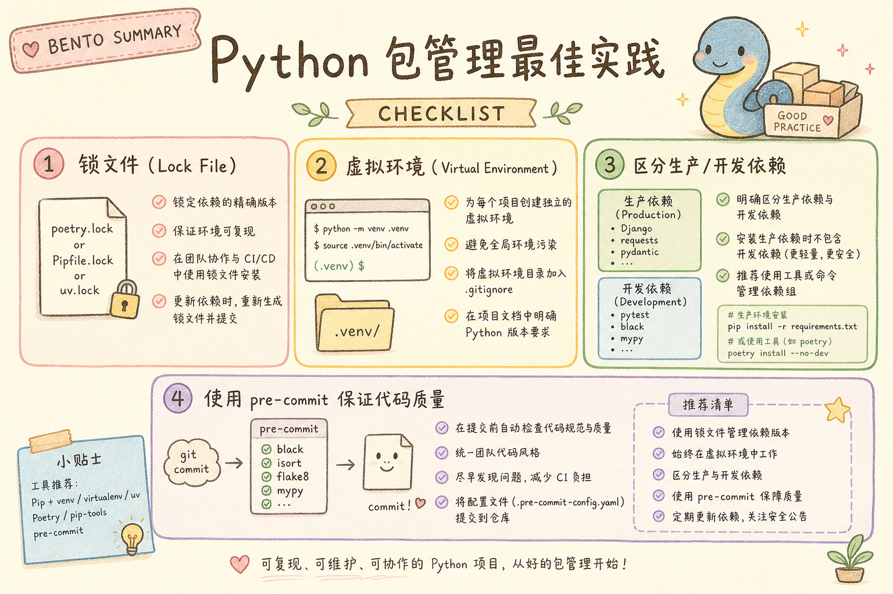


### 一句话选型指南

> **简单项目不想折腾 → `uv`（快，简单，一站到位）。已有 pip 工作流不想改 → `pip-tools`（最小改动，最大收益）。要发布库/包到 PyPI → `Poetry`（生态最成熟）。追求极速和跨平台 → `uv`（Rust 内核，10 倍速度）。**

### 推荐学习路径

```
第 0 步: 会创建虚拟环境（若还不会）
         → [虚拟环境教程](1.python-virtual-env-tutorial.md)

第 1 步: 理解 pip 和 PyPI 的基本概念
         → 本文第 2 章

第 2 步: 理解依赖锁定的必要性
         → 本文第 3-4 章

第 3 步: 根据你的情况选择一个工具
         → 本文第 8 章决策树

第 4 步: 深入学习选定的工具
         → pip-tools: 第 5 章
         → Poetry:    第 6 章
         → uv:        第 7 章

第 5 步: 了解安全实践
         → 本文第 9 章

第 6 步: 在实际项目中用起来
         → 从下一个新项目开始，严格按照锁文件流程来
         → 老项目逐步迁移——先让 pip-tools 接管 requirements.txt
```

---

> **延伸阅读：**
> - [Python Packaging User Guide](https://packaging.python.org/)——Python 官方打包指南
> - [pip-tools 文档](https://pip-tools.readthedocs.io/)
> - [Poetry 官方文档](https://python-poetry.org/docs/)
> - [uv 官方文档](https://docs.astral.sh/uv/)
> - [PEP 621——pyproject.toml 标准](https://peps.python.org/pep-0621/)
> - [Semantic Versioning 规范](https://semver.org/lang/zh-CN/)
> - [pip-audit——Python 依赖漏洞扫描](https://pypi.org/project/pip-audit/)
