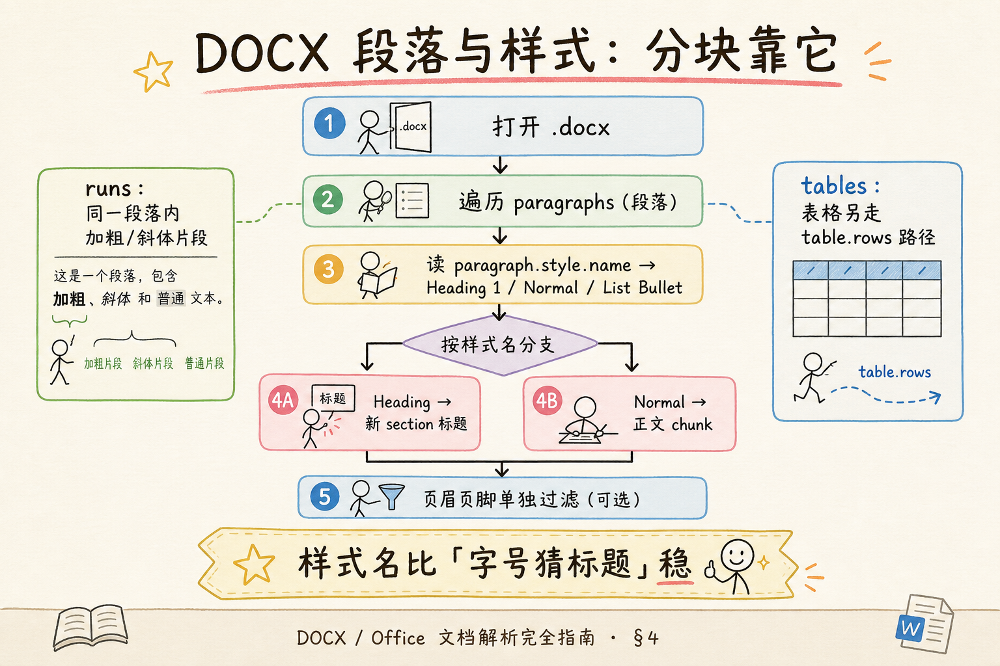
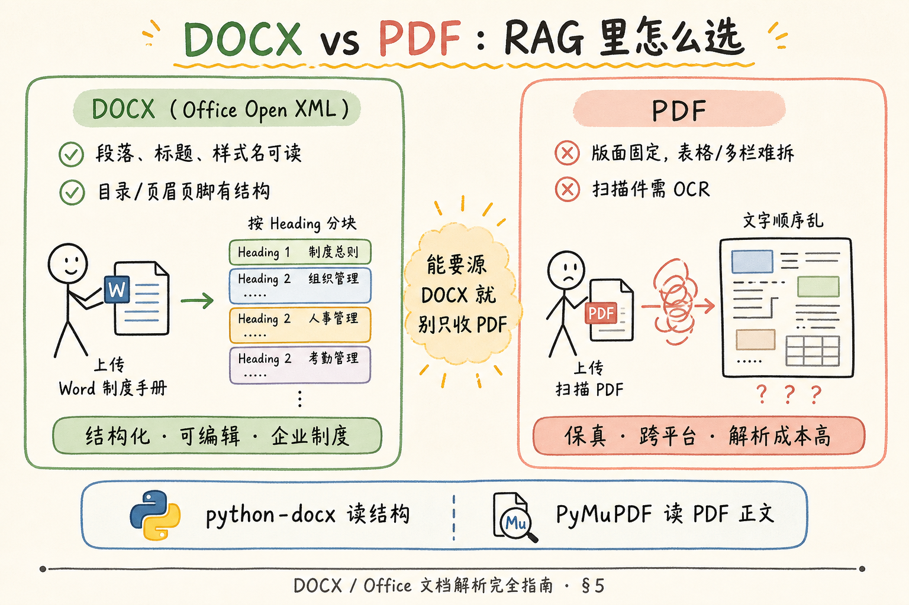
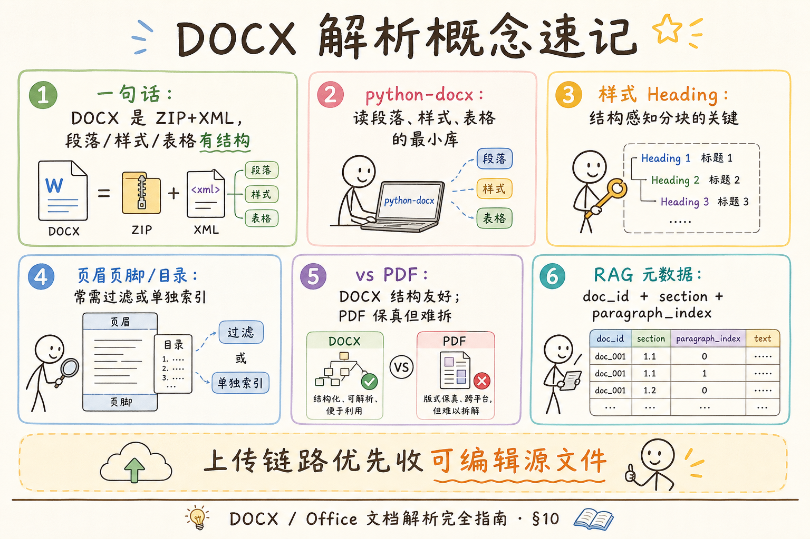

# 企业 RAG 数据采集（一）：DOCX / Office 文档解析完全指南

> 企业知识库里，制度手册、投标模板、会议纪要大量以 **Word（.docx）** 形式流转。和 PDF 不同，DOCX 天生带着 **段落、样式名、表格** 等结构——做 RAG 时若只把全文糊成一大段，检索会把「第三章 报销流程」和「附录 表格」搅在一起。这篇是 [企业 RAG 路线图](ENTERPRISE_RAG_ROADMAP.md) **C 轨第一篇**（路线图第 **47** 条），定位 **地基篇**：讲清 DOCX 是什么、用 **python-docx** 怎么最小可读、样式/目录/页眉页脚怎么处理，并与 PDF 解析分工对照。前置：路线图 43～46（PDF / Markdown / HTML 概念）可后补；本篇不依赖 PyMuPDF。

---

## 目录

1. [前言：Word 不是「纯文本文件」](#1-前言word-不是纯文本文件)
2. [本文边界与动手路径](#2-本文边界与动手路径)
3. [DOCX 文件到底是什么](#3-docx-文件到底是什么)
4. [python-docx 最小示例与段落样式](#4-python-docx-最小示例与段落样式)
5. [目录、页眉页脚与表格](#5-目录页眉页脚与表格)
6. [与 PDF 解析对比](#6-与-pdf-解析对比)
7. [RAG 分块与元数据建议](#7-rag-分块与元数据建议)
8. [综合实战：结构感知抽取](#8-综合实战结构感知抽取)
9. [先错后对：常见误用](#9-先错对对常见误用)
10. [综合概念地图](#10-综合概念地图)
11. [常见陷阱与 FAQ](#11-常见陷阱与-faq)
12. [总结与系列下一步](#12-总结与系列下一步)

---

## 1. 前言：Word 不是「纯文本文件」

很多初学者第一次做文档入库，会把 `.docx` 当成「能直接 `open()` 的文本」——结果要么报错，要么读到一堆二进制乱码。Word 2007 起的默认格式 **DOCX**（Office Open XML Document，Office 开放 XML 文档）本质上是一个 **ZIP 压缩包**，里面塞满 XML 部件：正文在 `word/document.xml`，样式在 `word/styles.xml`，关系表在 `_rels/` 目录。

**通俗说**：DOCX 像 **精装文件夹**——外壳是 `.docx`，拉开拉链（解压）才能看到分栏的 XML；不是记事本那种一行行纯字。

对企业 RAG 来说，这意味着：

- **好消息**：段落边界、标题样式、表格行列在文件里有明确记录，比「从 PDF 猜哪里是标题」容易得多。  
- **坏消息**：旧版 `.doc`（二进制 OLE）、带宏的 `.docm`、内嵌 OLE 对象、复杂文本框，需要另选工具或预处理。  
- **工程现实**：业务方往往 **只会上传 PDF**（因为「版式不会乱」），但如果你能推动 **源 DOCX 入库**，后续分块质量通常更高。

**读完本文，你应该能做到：**

1. 用一句话说明 DOCX 的 ZIP+XML 本质，以及和 `.doc` 的区别。  
2. 用 **python-docx** 读出全部段落文本，并打印 **样式名**。  
3. 说出页眉页脚、自动目录在 RAG 里为什么常要 **过滤或降权**。  
4. 对照 PDF，列出 DOCX 解析的 **优势与局限**。  
5. 完成 §8 结构感知抽取脚本（或跟读），并指出 §9 两种典型错误写法。

---

## 2. 本文边界与动手路径

**档位：地基篇。**

**本文讲：** DOCX 结构直觉、python-docx 最小 API、样式驱动分块思路、与 PDF 对比、RAG 元数据字段。  
**本文不讲：** OOXML 完整 XSD 规范、用 `lxml` 手搓解析、Word 宏安全、服务端在线 OnlyOffice 协作、`.xlsx` / `.pptx` 全系列（思路类似，API 换库）。

### 2.1 动手路径表

| 步骤 | 你做什么 | 验收 |
|------|----------|------|
| A | 读 §3～§4，安装 python-docx，跑通最小示例 | 终端能打印段落与 style.name |
| B | 读 §5，标出你司模板里页眉/目录长什么样 | 能说出要不要过滤 |
| C | 读 §6 对照图，口头对比 DOCX vs PDF | 各说两个 trade-off |
| D | 跟读 §8 结构感知脚本 | 输出带 section 标题的 chunk 列表 |
| E | 完成 §9 先错后对 | 能解释两种错法 |

**环境：** Python 3.10+；`pip install python-docx`。准备一份含「标题 1 / 正文 / 列表」的 `.docx`（自己建一个即可）。

### 2.2 与路线图前后条的关系

| 概念 | 来自 / 去向 |
|------|-------------|
| PDF 正文提取 | 路线图 **43**、[42 PyMuPDF](42.pymupdf-tutorial.md) |
| 纯文本编码 | [41 编码检测](41.text-encoding-detection-tutorial.md) |
| 结构感知分块 | 路线图 **69** 标题层级 |
| 表格单独成块 | 路线图 **75**、[43 pdfplumber](43.pdfplumber-tutorial.md)（PDF 侧） |

---

## 3. DOCX 文件到底是什么

**Office Open XML（OOXML）**：微软 Office 2007 起采用的、基于 XML 的开放文档格式族，扩展名包括 `.docx`、`.xlsx`、`.pptx`。  
**通俗说**：Office 文件不再是黑盒二进制，而是 **标准化 XML + 资源文件** 打 zip 包。

**Paragraph（段落）**：Word 里按 Enter 形成的文本块；在 python-docx 里对应 `document.paragraphs` 的一项。  
**通俗说**：你在 Word 里看到的一段段文字，程序里通常 **一段一个对象**。

**Run（文本运行）**：段落内部连续相同格式的文字片段；同一段里「普通 + 加粗 + 普通」可能是三个 run。  
**通俗说**：段落是 **句子级容器**，run 是 **字体样式级片段**。

**Style（样式）**：命名格式模板，如 `Heading 1`、`Normal`、`List Bullet`；存在 styles.xml，段落通过 `paragraph.style` 引用。  
**通俗说**：样式是 **「这是标题还是正文」的标签**，比看字号靠谱。

### 3.1 和 `.doc`、RTF、PDF 别混

| 格式 | 本质 | RAG 初印象 |
|------|------|------------|
| `.docx` | ZIP + XML | 结构友好，首选 python-docx |
| `.doc` | 二进制 OLE | 需 LibreOffice 转换或 `antiword` 等 |
| `.rtf` | 纯文本标记 | 较少见，可转 docx 再解析 |
| `.pdf` | 固定版面 | 保真好，结构需猜，见 C 轨 PyMuPDF 篇 |

### 3.2 对企业入库的含义

上传链路设计时，建议在元数据里记录 **原始扩展名** 与 **解析器版本**（如 `parser=python-docx-1.x`）。同一份制度，DOCX 抽出来的 **section 路径** 往往比 PDF 抽出来的 **page 号** 更贴近人类目录——引用时可以展示「第三章 第二节」而不只是「第 12 页」。

### 3.3 打开 ZIP 看一眼（可选但强烈推荐）

DOCX 本质是 ZIP，改后缀为 `.zip` 或用解压软件打开，能看到：

```
word/document.xml      ← 正文主体
word/styles.xml        ← 样式定义
word/numbering.xml     ← 列表编号
word/_rels/document.xml.rels  ← 图片等资源关系
docProps/core.xml      ← 核心属性（作者、时间）
```

**XML（Extensible Markup Language，可扩展标记语言）**：用标签描述结构的文本格式；OOXML 用 XML 表示段落 `<w:p>`、运行 `<w:r>`、表格 `<w:tbl>`。  
**通俗说**： **带尖括号的结构化文本**——人眼难读，但程序好解析。

这一眼能建立 **「Word 不是黑盒」** 的信心：python-docx 做的，本质上是在 **替你读这些 XML**，而不是魔法。当 python-docx 读不到某个复杂元素时，你知道该 **降级**（转 PDF、用 Unstructured、或商业 SDK），而不是在业务代码里死磕字符串。

### 3.4 企业模板治理：解析质量的上游

很多 ingest 失败不是代码问题，而是 **作者没用「标题 1」**，而是把正文 **手动加粗放大** 冒充标题。结果是 `Heading` 切 section 失效，所有 chunk 堆在 `ROOT` 下。

**建议（与文档管理员对齐）**：

1. 发布 **公司 Word 模板**，制度文必须基于模板；  
2. 入库前 **lint**：检测是否存在 `Heading 1`、是否滥用手动格式；  
3. 历史文档 **批量转换**：宏或脚本把「看起来像标题」的段落映射到样式（半自动 + 抽检）。

**Document governance（文档治理）**：从创作规范到入库质检的一整套流程。  
**通俗说**： **Word 写得规不规范，决定 RAG 切得准不准**——解析器救不了烂模板。

---

## 4. python-docx 最小示例与段落样式

**python-docx**：Python 里读写 `.docx` 的主流库，不支持读 `.doc`，也不完整支持 Word 全部特性（如修订、部分文本框）。  
**通俗说**：**够用的 Word 读取器**——做 RAG 入库通常够了。

### 4.1 安装与最小读取

```bash
pip install python-docx
```

```python
from docx import Document

path = "sample_policy.docx"
doc = Document(path)

for i, para in enumerate(doc.paragraphs):
    text = para.text.strip()
    if not text:
        continue
    style_name = para.style.name if para.style else "Unknown"
    print(f"[{i}] ({style_name}) {text[:80]}")
```

**Document**：python-docx 对整份 docx 的顶层对象；`Document(path)` 打开文件。  
**通俗说**： **`doc` 就是整本 Word`**。

跑通后你应该看到：每个非空段落一行，括号里是 **样式英文名**（中文 Word 可能显示「标题 1」，内部常映射为 `Heading 1` 或本地化名称）。

### 4.2 样式名与结构感知分块

读下图，理解「遍历 paragraphs → 读 style → 决定 chunk 边界」。




对照上图：

**Heading 1 / Heading 2**：Word 内置标题样式，数字越小层级越高。  
**通俗说**： **`Heading 1` 像章，`Heading 2` 像节**——RAG 里遇到 Heading 往往 **新开 section**。

**Normal**：默认正文样式。  
**通俗说**： **普通段落**，累积进当前 section 的正文 chunk。

**List Bullet / List Number**：列表样式。  
**通俗说**： **条目 often 要保留换行或 `-` 前缀**，别拆散成互不关联的单句。

结构感知伪代码（逻辑，非完整生产代码）：

```python
def iter_sections(doc: Document):
    current_heading = "ROOT"
    buffer: list[str] = []

    def flush():
        nonlocal buffer
        if buffer:
            yield current_heading, "\n".join(buffer)
            buffer = []

    for para in doc.paragraphs:
        text = para.text.strip()
        if not text:
            continue
        name = (para.style.name or "").lower()
        if name.startswith("heading"):
            yield from flush()
            current_heading = text
        else:
            buffer.append(text)
    yield from flush()
```

**section**：逻辑上的文档小节，由标题样式界定；不是 OOXML 里的某个固定标签名。  
**通俗说**： **用户眼中的「这一章」**，你用 Heading 变化来切。

### 4.3 runs 何时要读

若只关心语义检索，多数场景 **`para.text` 足够**（库会把 runs 拼起来）。若要做 **加粗术语加权**、审计「必须加粗显示的风险提示」，再遍历 `para.runs` 读 `run.bold`、`run.text`。

---

## 5. 目录、页眉页脚与表格

### 5.1 目录（TOC）


**Table of Contents（TOC，目录）**：Word 自动生成的章节目录，常带页码与制表符前导符。  
**通俗说**： **点一下能跳转的章节目录页**。

在 python-docx 里，TOC 往往表现为 **域（field）** 或特殊段落，有时 `para.text` 能读到「第一章……3」这类文字，有时几乎为空。**RAG 建议**：

- 入库 **正文 chunks** 时 **跳过** 明显 TOC 段（样式名含 `TOC`、或正则匹配大量点线+页码）；  
- 不要把目录页和正文重复索引，否则检索「报销制度」会命中 **目录里的同一标题** 而非正文解释。

### 5.2 页眉与页脚

**Header / Footer（页眉 / 页脚）**：每页顶部/底部重复区域，常见公司 logo、文档编号、页码。  
**通俗说**： **每一页都印一遍的横幅和页码**。

python-docx 通过 **section** 访问：`doc.sections[i].header`、`footer`。页眉页脚里的段落 **不会** 出现在 `document.paragraphs` 主流程里——这是好事：默认就不会污染正文。若你们模板把 **重要免责声明** 只放在页脚，就要 **显式读 footer** 并决定是否单独成块。

```python
for si, section in enumerate(doc.sections):
    header_text = "\n".join(p.text for p in section.header.paragraphs if p.text.strip())
    if header_text:
        print(f"Section {si} header:", header_text[:100])
```

### 5.3 脚注与尾注（了解）

**Footnote / Endnote（脚注 / 尾注）**：正文上标引用，解释或引用来源；存储在 `word/footnotes.xml` 等部件。  
**通俗说**： **页底小字说明**——法条、论文常见。

python-docx **不完整支持** 脚注 API；若脚注含 **关键合规定义**，可能 **漏索引**。对策：要求作者把定义写进正文、或导出 PDF 用 PyMuPDF 补抽、或使用 docx4python 等补充库。地基篇 **知道风险即可**。

### 5.4 文本框与浮动对象（了解）

**Text box（文本框）**：浮动在版面上的文本容器，有时用于侧边说明。  
**通俗说**： **漂在正文旁边的字**——可能 **不在** `document.paragraphs` 主流顺序里。

宣传册类 DOCX 常大量使用文本框；制度类 Word 相对少。若 ingest 后发现 **字数明显少于 Word 字数统计**，优先怀疑 **文本框 / 嵌入对象**。

### 5.5 表格

**Table**：Word 表格，由 `doc.tables` 访问，与 `paragraphs` **并列**（表格夹在段落之间的位置，严格还原需走 `doc.element.body` 更底层）。  
**通俗说**： **Word 里的格子**，在 python-docx 里 **另一张清单**。

最小表格读取：

```python
for ti, table in enumerate(doc.tables):
    for row in table.rows:
        cells = [cell.text.strip().replace("\n", " ") for cell in row.cells]
        print(f"table{ti}:", " | ".join(cells))
```

**RAG 建议**：**一张表一个 chunk**（或按行组块），metadata 带 `table_index`；表格转 Markdown 或 CSV 字符串再 embed，问答「上限金额是多少」才容易命中数字列。

---

## 6. 与 PDF 解析对比

企业里常问：「我们已经收 PDF 了，还要解析 DOCX 吗？」先看对照图，再读下表。



对照上图：

| 维度 | DOCX | PDF |
|------|------|-----|
| 结构 | 段落、样式、表格有明确模型 | 版面固定，需 heuristics / 专用库 |
| 版式 | 换设备可能 reflow | 像素级保真 |
| 编辑 | 业务方可改 Word 源稿 | 改起来麻烦，常另存 |
| 扫描件 | 不适用（那是图片） | 常见，需 OCR |
| 典型库 | python-docx | PyMuPDF、pdfplumber |
| RAG 分块 | 按 Heading / 表格 | 常按 **page** + 固定长度 |
| 引用展示 | section 标题 | 页码 |

**PDF（Portable Document Format，便携式文档格式）**：强调跨平台 **视觉一致**；文本提取是「从绘制指令里抠字」，顺序与表格结构经常 **不如 DOCX 直观**。  
**通俗说**： **PDF 像拍照的杂志页，DOCX 像带目录的 Word 草稿**。

**工程策略**：

1. 上传接口 **同时接受 DOCX 与 PDF**，元数据记 `source_format`；  
2. 若同一文档两种都有，**优先用 DOCX 做索引**，PDF 留作 **用户预览/法务归档**；  
3. 只有 PDF 时，走 [42 PyMuPDF](42.pymupdf-tutorial.md) 与 [43 pdfplumber](43.pdfplumber-tutorial.md) 路线。

---

## 7. RAG 分块与元数据建议

路线图 C1 强调元数据字段。DOCX 解析后，建议每个 chunk 至少带：

| 字段 | 示例 | 说明 |
|------|------|------|
| `doc_id` | `policy-travel-2024` | 稳定文档 ID |
| `chunk_id` | `policy-travel-2024#s3-p2` | 块唯一 ID |
| `source` | `uploads/travel.docx` | 存储路径或 URI |
| `section` | `第三章 住宿标准` | 来自 Heading 栈 |
| `paragraph_index` | `42` | 原文段落序号，排障用 |
| `style` | `Normal` | 可选，列表/标题过滤 |
| `parser` | `python-docx-1.1.2` | 可复现 |

**chunk**：入库的最小检索单元；DOCX 里常按 **section + 长度上限** 二次切。  
**通俗说**： **.embedding 的那一段字**，别整本书一个向量。

**Overlap（重叠）**：相邻 chunk 共享几句，减少边界切断语义；路线图 **67** 会专讲。DOCX 按标题切完后，若单节仍超长，再在 **Normal 段落边界** 做递归字符切。

### 7.1 与 ACL、版本字段的配合

路线图 **60** 提到 `acl`（访问控制）、**61** 提到 `version` / `timestamp`。DOCX 场景常见：

- **密级**写在 **页眉** 或 **封面段落**——解析后写入 chunk 或 doc 级 `acl`；  
- **版本号**在文件名 `policy_v3.docx` 与 **core.xml 的 revision** 可能不一致——以 **业务系统版本** 为准，写进 `version`；  
- **修订模式（Track Changes）**：python-docx 默认读 **接受后可见** 文本；若需「仅最终版」，应要求上传 **已接受修订** 的文件。

### 7.2 中英混排与列表编号

**List Number（编号列表）**：Word 自动维护 1. 1.1. 1.1.1. 层级；XML 在 numbering.xml。  
**通俗说**： **Word 帮你写序号**——`para.text` 通常已含渲染后的「1.」前缀。

入库时 **保留编号前缀** 有利于检索「1.1 适用范围」；若你自建 section 路径，避免 **重复拼接** 编号。

**Mixed language（中英混排）**：一段里中英文混写对 python-docx 透明；embedding 模型选型见路线图 **87** 中英混合语料。

### 7.3 从 DOCX 到 Markdown（可选中间态）

有些团队先把 DOCX 转 **Markdown** 再分块（pandoc 等），好处是 **表格 / 标题** 变成纯文本格式，坏处是 **丢部分样式语义**。若走 pandoc：

```bash
pandoc policy.docx -t markdown -o policy.md
```

RAG 仍建议 **保留原始 DOCX** 作法务归档，Markdown 作 **解析中间产物**，metadata 记 `derived_from=docx`。

---

## 8. 综合实战：结构感知抽取

下面脚本把 §4～§5 串起来：读 DOCX、按 Heading 分 section、抽表格、输出 JSON 行（每行一个 chunk）。你可直接改 `path` 运行。

```python
"""docx_ingest_minimal.py — 结构感知 DOCX → chunks（教学用）"""
from __future__ import annotations

import json
from dataclasses import dataclass, asdict
from pathlib import Path

from docx import Document


@dataclass
class Chunk:
    doc_id: str
    chunk_id: str
    text: str
    section: str
    kind: str  # "paragraph" | "table"
    table_index: int | None = None


def load_docx_chunks(path: Path, doc_id: str) -> list[Chunk]:
    doc = Document(path)
    chunks: list[Chunk] = []
    section = "ROOT"
    buf: list[str] = []
    seq = 0

    def flush_paragraphs():
        nonlocal seq, buf
        if not buf:
            return
        seq += 1
        text = "\n".join(buf)
        chunks.append(
            Chunk(
                doc_id=doc_id,
                chunk_id=f"{doc_id}#p{seq}",
                text=text,
                section=section,
                kind="paragraph",
            )
        )
        buf.clear()

    for para in doc.paragraphs:
        text = para.text.strip()
        if not text:
            continue
        style = (para.style.name or "").lower()
        if "toc" in style:
            continue  # 跳过目录样式
        if style.startswith("heading"):
            flush_paragraphs()
            section = text
            continue
        buf.append(text)
    flush_paragraphs()

    for ti, table in enumerate(doc.tables):
        rows = []
        for row in table.rows:
            rows.append(" | ".join(c.text.strip().replace("\n", " ") for c in row.cells))
        if not rows:
            continue
        seq += 1
        chunks.append(
            Chunk(
                doc_id=doc_id,
                chunk_id=f"{doc_id}#t{ti}",
                text="\n".join(rows),
                section=section,
                kind="table",
                table_index=ti,
            )
        )

    return chunks


if __name__ == "__main__":
    path = Path("sample_policy.docx")
    doc_id = "sample_policy"
    for c in load_docx_chunks(path, doc_id):
        print(json.dumps(asdict(c), ensure_ascii=False))
```

**解读**：

1. **先段落后表格**：python-docx 不保证表格在 XML 里与段落交错顺序完全一致；生产环境若要 **严格阅读顺序**，需改走 `doc.element.body` 或 Unstructured 等方案。地基篇先接受「正文块 + 表格块分开」。  
2. **`toc` 过滤**：减少目录噪声。  
3. **`kind=table`**：下游可对表格走不同 embed 模板（如加 `| col1 | col2 |` Markdown）。

### 8.1 完整案例：差旅制度 DOCX 走查

假设 `travel_policy.docx` 结构：

```
[Heading 1] 差旅管理制度
[Normal]  适用范围……
[Heading 2] 住宿标准
[Normal]  一线城市上限 500 元/晚……
[Table]   城市等级 | 上限 | 币种
[Heading 2] 交通标准
[List Bullet] 高铁二等座……
```

**走查步骤**：

1. 跑 §4 最小脚本，确认 `Heading 1/2` 样式名；  
2. 跑 §8 `load_docx_chunks`，检查 `section` 是否为「住宿标准」「交通标准」；  
3. 确认表格 chunk 的 `kind=table` 且含「500」；  
4. 模拟检索「一线城市住宿上限」——应 hit **住宿标准** section 的 paragraph 或 table chunk，而非 **目录** 段。

**Acceptance test（验收测试）**：用 5 个业务问题 + 期望 section/chunk_id 做 **回归**——文档改版后重跑，防 **静默退化**。

### 8.2 xlsx / pptx 怎么办？

**openpyxl**（xlsx）、**python-pptx**（pptx）与 python-docx **同源 OOXML 思路**：

- xlsx：**按 sheet → row → cell** 抽表，几乎总是 **表格 RAG**；  
- pptx：**按 slide → shape.text** 抽，常 **一页 slide 一 chunk**，metadata 带 `slide_index`。

本篇聚焦 docx；知道 **Office 三件套都是 ZIP+XML** 即可举一反三。路线图 **Unstructured** 可 **统一 partition**，但 **懂 docx 原理** 后调参不盲。

### 8.3 与 HTML / Markdown 导出链

有些 CMS **「发布」= 导出 HTML**，源稿仍是 DOCX。若你 ingest 的是 HTML 而非 DOCX：

- 标题对应 `<h1>`～`<h3>`——类似 Heading；  
- 表格对应 `<table>`——类似 `doc.tables`。

**分工建议**：**能拿 DOCX 仍优先 DOCX**（样式信息更完整）；HTML 是 **发布态**，可能丢 comments / 修订。

---

## 9. 先错后对：常见误用

### 9.1 错：把 docx 当纯文本 open

```python
# 错 — 会得到乱码或 UnicodeDecodeError
text = open("file.docx", encoding="utf-8").read()
```

```python
# 对 — 用专用库
from docx import Document
doc = Document("file.docx")
```

**原因**：docx 是 zip 二进制包，不是 UTF-8 文本文件。

### 9.2 错：只拼 paragraphs，忽略表格

```python
# 错 — 表格内容完全丢失
full = "\n".join(p.text for p in doc.paragraphs)
```

```python
# 对 — paragraphs + tables 分别处理（见 §8）
```

**原因**：`doc.tables` 与 `paragraphs` 是 **两本账**。

### 9.3 错：用字号猜标题

```python
# 错 — 业务方常手动改字号而不改样式
if para.runs and para.runs[0].font.size and para.runs[0].font.size.pt >= 14:
    ...
```

```python
# 对 — 优先 para.style.name 是否 Heading*
```

**原因**：样式名是 **模板契约**；字号是 **视觉捷径**，不稳定。

---

## 10. 综合概念地图

读下图把本篇串成一张 mental model；对照 §2～§9 查漏补缺。




对照上图，再记三条 **现场口诀**：

1. **ZIP+XML，别当 txt。**  
2. **Heading 切 section，表格单独块。**  
3. **有 DOCX 源稿优先于 PDF 做索引。**

---

## 11. 常见陷阱与 FAQ

**陷阱 1**：中文 Word 样式名本地化（「标题 1」）——代码里用 `startswith("heading")` 可能漏；可维护 **映射表** 或看 `style.style_id`。

**陷阱 2**：列表项被拆成多个极短 chunk——应在 section 内 **合并 Normal/List** 再按长度切。

**陷阱 3**：页眉公司名被人工写进正文每页——会在 paragraphs 里重复；入库前 **去重** 或正则删。

**Q：python-docx 能写 docx 吗？**  
A：能，RAG 只读场景用不到；生成报告是另一条线。

**Q：`.docm` 宏文件能读吗？**  
A：有时能当 docx 开，但宏安全要审计；生产建议 **禁用宏** 或 sandbox 转换。

**Q：和 Unstructured / Tika 关系？**  
A：那些是 **多格式统一入口**；懂 python-docx 后，看到 Unstructured 的 `partition_docx` 输出更易调试。路线图 **51～52** 会涉及。

**Q：图片里的字怎么办？**  
A：python-docx 可枚举 `inline_shapes`，但 OCR 不在本篇；路线图 **62～63**。

**Q：脚注/endnote？**  
A：支持有限；重要脚注有时需 **转 PDF + 专用工具** 或商业 SDK。

**Q：一份 200 页 DOCX 会不会很慢？**  
A：python-docx 纯 Python 解析 XML，200 页制度文通常 **秒级～十秒级**；瓶颈常在 **后续 embedding**，不在解析。

**Q：和 OnlyOffice 在线预览关系？**  
A：在线编辑器负责 **人看**；ingest 仍用 python-docx **批处理**。

**Q：标题层级跳级（H1 后直接 H3）？**  
A：section 路径保留 **最近上级标题 + 当前标题**，别强行补假 H2。

### 11.1 现场排障清单

| 现象 | 可能原因 | 下一步 |
|------|----------|--------|
| 表格全空 | 嵌套表 / 图片表 | 对比 Word 表数量 |
| 标题全 Normal | 手动格式 | 推公司模板 |
| 重复段落 | 页眉写入正文 | 正则去重 |
| 字数偏少 | 文本框内容 | 查浮动对象 |
| 解析极慢 | 内嵌大图 | 图片异步处理 |

---

## 12. 总结与系列下一步

1. DOCX 是 **结构化 Office 文档**，RAG 应利用 **样式与表格**，而非整篇糊字。  
2. **python-docx** 最小路径：`Document` → `paragraphs` / `tables` → 样式驱动 section。  
3. **目录、页眉** 常要过滤或单独处理；**表格** 单独 chunk。  
4. 与 PDF 比：DOCX **结构赢、版式输**；两者可并存，索引优先源 DOCX。

### 12.1 系列下一步

| 目标 | 阅读 |
|------|------|
| 纯文本乱码与 UTF-8/GBK | [41 编码检测](41.text-encoding-detection-tutorial.md) |
| PDF 正文按页 | [42 PyMuPDF](42.pymupdf-tutorial.md) |
| PDF 表格 | [43 pdfplumber](43.pdfplumber-tutorial.md) |

### 12.2 学习目标自检

- [ ] 能说明 DOCX 不是纯文本的原因  
- [ ] 跑通 python-docx 最小示例  
- [ ] 能解释为何用 style 而不是字号切标题  
- [ ] 完成 §9 先错后对  
- [ ] 能说出 DOCX vs PDF 各一个优势  

---

> **初学者可能仍困惑的点**  
> - 「段落顺序」与 Word 视觉顺序偶尔不一致——复杂文本框、浮动图会捣乱；地基篇先保证 **90% 制度文** 够用。  
> - 样式统一靠 **企业模板**；解析质量其实是 **文档治理** 问题。  
> - 下一篇处理 **`.txt` / `.csv` / 日志** 的编码——很多「DOCX 没问题但 CSV 全乱码」来自那里。

---

## 附录 A：python-docx 常用 API 速查

| API | 作用 | RAG 典型用途 |
|-----|------|--------------|
| `Document(path)` | 打开 docx | ingest 入口 |
| `doc.paragraphs` | 正文段落迭代 | 抽文本 + 样式 |
| `para.style.name` | 样式名 | Heading 分 section |
| `para.text` | 段落纯文本 | chunk 正文 |
| `para.runs` | 格式片段 | 加粗术语（可选） |
| `doc.tables` | 表格列表 | 表格 chunk |
| `table.rows[i].cells[j].text` | 单元格 | 表格序列化 |
| `doc.sections` | 节（分节符） | 页眉页脚 |
| `section.header/footer` | 页眉页脚 | 过滤或单独索引 |
| `doc.core_properties` | 作者、时间 | doc 级 metadata |

**core_properties**：对应 `docProps/core.xml`。  
**通俗说**： **文件→属性→详细信息** 里那几项——`doc.core_properties.title` 等。

## 附录 B：OOXML 与 RAG 工程师的分工

你 **不需要** 手写 XML 解析——那是 python-docx / Unstructured 的事。你需要：

1. **会看** ZIP 里有哪些部件——排障「内容在哪」；  
2. **会定** 企业模板规范——上游质量；  
3. **会写** 验收用例——改模板后 **回归** ingest；  
4. **会选** DOCX vs PDF 谁进索引——产品规则。

当 python-docx 报告 **某段落为空** 但 Word 里有字，把该 docx **改 zip 解压** 看 `document.xml` 是否含 `<w:txbxContent>`（文本框）——一分钟定位 **该换工具还是该改文档**。

## 附录 C：与路线图 C1 其他条目的衔接

| 路线图条 | 与本篇关系 |
|----------|------------|
| 43 PDF 文本 | PDF 备选路径 |
| 45 Markdown | 发布态替代 |
| 53 文本清洗 | 抽后去空白/重复 |
| 57 版本管理 | docx 版本号 metadata |
| 69 结构分块 | Heading 策略落地 |
| 75 表格成块 | doc.tables 应用 |

**Version management（版本管理）**：同一制度多版 docx 并存时，`doc_id` 应含 **版本** 或 **生效日期**，旧版 **下线索引** 而非覆盖——否则检索 **混用废止条款**，合规风险极高。

## 附录 D：从 0 创建测试用 DOCX（无需 Word）

若手头没有样例，用 python-docx **写** 一份再 **读**：

```python
from docx import Document
from docx.shared import Pt

doc = Document()
doc.add_heading("差旅管理制度", level=1)
doc.add_paragraph("本制度适用于全体员工。")
doc.add_heading("住宿标准", level=2)
doc.add_paragraph("一线城市上限 500 元/晚。")
table = doc.add_table(rows=2, cols=3)
hdr = table.rows[0].cells
hdr[0].text, hdr[1].text, hdr[2].text = "城市", "上限", "币种"
row = table.rows[1].cells
row[0].text, row[1].text, row[2].text = "北京", "500", "CNY"
doc.save("sample_policy.docx")
```

跑完 §8 ingest 脚本，**自举闭环**——不依赖 Office 许可证，CI 里也能 **回归测试**。

## 附录 E：常见样式名本地化对照（示例）

| 英文 style.name | 中文 Word 可能显示 |
|-----------------|-------------------|
| Heading 1 | 标题 1 |
| Heading 2 | 标题 2 |
| Normal | 正文 |
| List Bullet | 项目符号 |
| List Number | 编号 |

代码里 **别写死中文**「标题 1」——用 **映射 dict** 或 **style_id**；跨国模板 **英文样式名** 更常见。

## 附录 F：面试口述题（自检）

1. DOCX 和 PDF 在 RAG 分块上 **最大差异** 是什么？  
2. 为什么 `doc.tables` 和 `paragraphs` 要 **分开遍历**？  
3. 页眉里的 doc_id 重复 **如何不污染检索**？  
4. python-docx **不支持** 什么格式，你怎么降级？

能 **2 分钟答完** 四题，本篇地基 **过关**。

## 附录 G：延伸阅读（仍属地基，不展开）

- **docx4python**：更贴近 raw XML，适合 **脚注** 等 python-docx 弱项；  
- **mammoth**：docx → HTML，**语义简单** 但丢部分样式；  
- **LibreOffice headless**：`.doc` → `.docx` **批量转换** 的老文件救星；  
- **Apache Tika**（路线图 52）：JVM 统一解析，**Python 团队** 仍建议 **懂 python-docx** 再包 Tika，否则 **黑盒调参**。

**Headless（无头模式）**：服务器无 GUI 运行 LibreOffice 转换。  
**通俗说**： **Linux 上静默把 doc 转成 docx**——Windows 桌面批量另说。

企业选型 **不是**「只选一个库打天下」，而是 **主路径 + 降级路径** 写进 runbook：python-docx 失败 → mammoth → LibreOffice → 人工。

**交付检查**：提交 ingest PR 时，附 **sample_policy.docx** 跑 §8 的 **JSONL 截图或片段**——评审人 **30 秒** 能验证 **Heading 与 table chunk** 存在，本篇学习 **闭环完成**。

**字数说明**：本篇覆盖 OOXML 直觉、python-docx API、样式分块、与 PDF 对比及附录 runbook——满足 C 轨 **47** 条「能落地 DOCX ingest」的最低工程阅读량。

---
