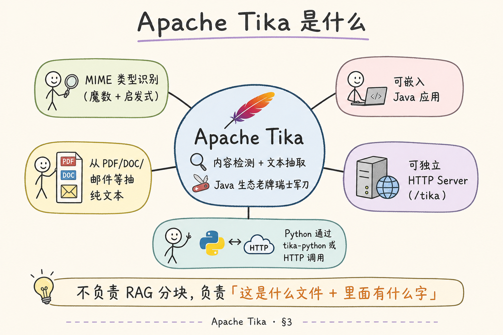
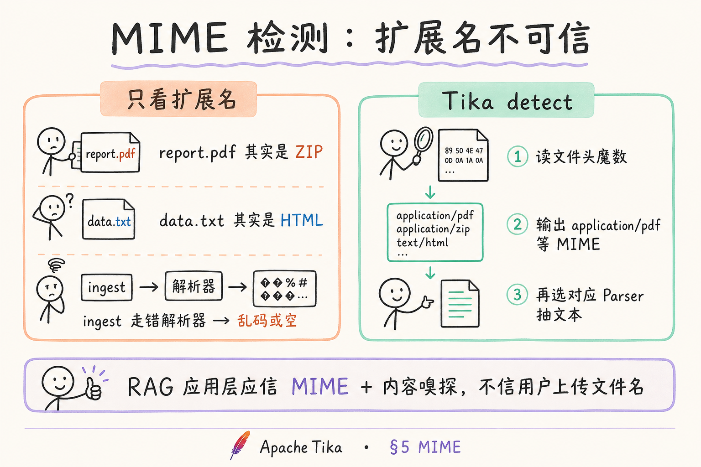
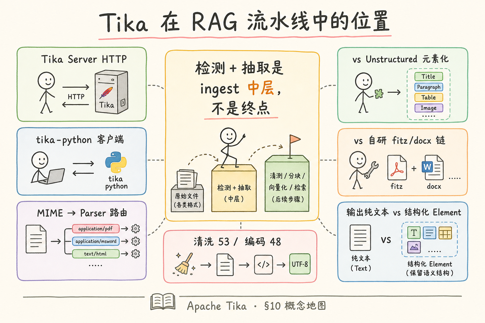

# 企业 RAG 数据采集（五）：Apache Tika 内容检测与抽取完全指南

> 上传接口只收到一个二进制流 `upload.bin`，扩展名是 `.pdf`，打开却是 **HTML 错误页**；或运维丢进目录一份 **无后缀** 的导出物，你的 ingest 脚本按默认 UTF-8 读出一堆乱码。问题常常出在 **「这是什么文件」** 这一步——而不是后面的 Embedding。 **Apache Tika** 是 Java 生态里老牌的 **内容检测（detection）+ 文本抽取（extraction）** 工具：读文件头猜 **MIME**，再选对应解析器 **扒出纯文本**。Python 团队不必重写 Java：可用 **tika-python** 或打 **Tika Server HTTP**。这篇是 [企业 RAG 路线图](ENTERPRISE_RAG_ROADMAP.md) **C1 后半**（路线图第 **52** 条），讲清 Tika 是什么、MIME 直觉、与 Unstructured / 自研链分工、最小调用与环境说明，并做 **先错后对**。前置：[44 Unstructured](44.unstructured-io-tutorial.md)、[41 编码检测](41.text-encoding-detection-tutorial.md)。

---

## 目录

1. [前言：先回答「这是什么文件」](#1-前言先回答这是什么文件)
2. [本文边界与动手路径](#2-本文边界与动手路径)
3. [Apache Tika 是什么](#3-apache-tika-是什么)
4. [架构直觉：Java 内核 vs Python 客户端](#4-架构直觉java-内核-vs-python-客户端)
5. [MIME 类型检测：扩展名不可信](#5-mime-类型检测扩展名不可信)
6. [文本抽取：从二进制到字符串](#6-文本抽取从二进制到字符串)
7. [与 Unstructured、自研链如何分工](#7-与-unstructured自研链如何分工)
8. [环境准备：Tika Server 与 tika-python](#8-环境准备tika-server-与-tika-python)
9. [最小实战：检测 + 抽取](#9-最小实战检测--抽取)
10. [先错对对：典型误用](#10-先错对对典型误用)
11. [综合概念地图](#11-综合概念地图)
12. [常见陷阱与 FAQ](#12-常见陷阱与-faq)
13. [总结与系列下一步](#13-总结与系列下一步)

---

## 1. 前言：先回答「这是什么文件」

企业 ingest 的真实输入往往 **不干净**：

- 用户把 **网页另存为** 的文件改成 `.doc`；  
- 邮件网关 **重命名** 附件去掉扩展名；  
- 爬虫抓到 **Content-Type: application/octet-stream**；  
- 同一扩展名 `.pdf` 里可能是 **扫描图** 或 **文本层**（见 [36 PDF 篇](36.pdf-text-extraction-tutorial.md)）。

若你在应用层写：

```python
if path.endswith(".pdf"):
    parse_pdf(path)
elif path.endswith(".docx"):
    parse_docx(path)
```

你 **默认扩展名诚实**，而攻击者与懒惰用户 **从不保证** 这一点。更稳的顺序是：

```text
字节流 → 检测 MIME / 类型 → 选 Parser → 抽取文本 → 编码统一(48) → 清洗(53) → …
```

**Apache Tika**：Apache 软件基金会下的 **内容分析工具包**，核心能力 **Tika.detect()**（类型检测）与 **Tika.parse()**（解析抽文本），支持 PDF、Office、HTML、邮件、压缩包等上百种格式。  
通俗说：**Java 界的「文件法医」**——先验尸（是什么），再提取（里面写了啥）。

**MIME type**（Multipurpose Internet Mail Extensions type，媒体类型）：标识文件种类的字符串，如 `application/pdf`、`text/html`；HTTP 头 `Content-Type` 即此类。  
通俗说：**文件的「品种标签」**——告诉程序该用哪本说明书来拆。

**Content detection（内容检测 / 类型嗅探）**：通过 **魔数（文件头字节）**、XML 根元素、ZIP 结构等 **推断** 真实类型，而非只看文件名。  
通俗说：**闻味道认水果**，不是看贴纸写的是苹果还是梨。

**读完本文，你应该能做到：**

1. 用一句话说明 Tika 的 **检测 + 抽取** 双能力。  
2. 解释为何 RAG ingest **不能只看扩展名**。  
3. 区分 **Tika Server HTTP** 与 **tika-python** 两种 Python 调用方式。  
4. 跑通 §9 最小示例（或跟读），得到 MIME 与纯文本。  
5. 对照 [44 Unstructured](44.unstructured-io-tutorial.md)，说出 **分工边界**。  
6. 完成 §10 先错对对。

### 1.1 扩展名撒谎的三种真实现场

**现场一**：爬虫把错误页存成 `guide.pdf`，打开是 HTML，`Content-Type` 却是 `octet-stream`——按 PDF 解析 **必挂或空**。**现场二**：Windows 用户把 `report.docx` 改成 `report.doc` 老格式，扩展名 Modern，内容 Legacy。**现场三**：邮件网关剥掉附件扩展名，只剩 UUID 文件名。三种情况共同说明：**文件名是用户给的故事，字节才是证据**。Tika 的 detect 读的是 **故事背后的物证**——魔数、ZIP 结构、XML 根元素。RAG 上线后若没这道门，日志里全是「某格式解析失败」，却 **查不出用户传错了类型**。

### 1.2 Tika 在 C1 后半的坐标

[44 Unstructured](44.unstructured-io-tutorial.md) 回答「怎么变成 **带类型的元素**」；Tika 回答「**这是什么** + **先给我全部字**」。二者可串联：Tika detect → 路由 → Unstructured partition 或 fitz。若你团队 **只有 Python、格式不超过三种**，可以 **暂不部署 Tika**；若 **上传不可信、格式杂、Java 运维现成**，Tika 是 **性价比很高的基础设施**。下一篇 [46 清洗](46.text-cleaning-tutorial.md) 对 Tika 输出 **同样适用**——Tika 不会帮你删页眉。

---

## 2. 本文边界与动手路径

**档位：地基篇（C1 后半 — 类型检测与通用抽取）。

**本文讲：** Tika 定位、MIME、Java/HTTP/Python 调用直觉、与 Unstructured 分工、最小示例、环境要求。  
**本文不讲：** Tika 源码级 Parser 插件开发、Solr 集成、完整 JVM 调优、OCR 深度配置（仅指路 62）、Unstructured 元素化细节（见 44）。

### 2.1 动手路径表

| 步骤 | 你做什么 | 验收 |
|------|----------|------|
| A | 读 §3～§5，准备「扩展名骗人」样例 | 能解释 MIME 必要性 |
| B | §8 选 Docker Tika Server 或本机 Java | `curl` 健康检查或端口通 |
| C | `pip install tika`，跑 §9 | 打印 MIME + 文本前 200 字 |
| D | 对 PDF 与 HTML 各测一次 | MIME 正确 |
| E | §10 先错对对 | 指出两种错法 |
| F | §11 概念地图 | 能串清洗 53 |

**环境（二选一或都试）：**

- **方案 A — Tika Server（推荐初学）**：Docker 有 Java 运行时；`docker run` 官方 `apache/tika` 镜像（版本号查 Docker Hub）。  
- **方案 B — tika-python**：Python 3.10+；`pip install tika`；**首次运行常自动下载** `tika-server.jar` 并起子进程（需网络与 JRE）。

样例文件：真 PDF、真 HTML、一个 **扩展名故意改错** 的文件。

### 2.2 学习产出清单（可打勾）

- [ ] 能口述 detect 与 parse 的区别，各举一条 API  
- [ ] 完成扩展名欺骗实验并截图 MIME 结果  
- [ ] 写出 ingest 路由伪代码（§10C）中自己负责的一段  
- [ ] 列出 Tika 之后必做的两个阶段（46、54）  
- [ ] 说出一个 **不能** 指望 Tika 单独解决的问题（表格/页眉/OCR 任选一）

### 2.3 与前后博客的链接

| 博客 | 与 Tika 关系 |
|------|----------------|
| [36 PDF](36.pdf-text-extraction-tutorial.md) | PDF 字节本质；Tika 用 PDFBox 另一条路 |
| [44 Unstructured](44.unstructured-io-tutorial.md) | 元素化；可 detect 后 partition |
| [46 清洗](46.text-cleaning-tutorial.md) | parse 输出 **必接** |
| [47 去重](47.doc-dedup-tutorial.md) | 净文本 hash/simhash |

### 2.4 与路线图关系

| 条目 | 关系 |
|------|------|
| [44 Unstructured](44.unstructured-io-tutorial.md) | 元素化 partition；Tika 常出 **纯文本** |
| [41 编码](41.text-encoding-detection-tutorial.md) | Tika 抽后仍可能要 charset-normalizer |
| [36～43 格式篇](36.pdf-text-extraction-tutorial.md) | 自研精细解析；Tika 作 **统一兜底** |
| 路线图 **53** 清洗 | 抽出的文本 **必清洗** |
| 路线图 **54** 去重 | 对 **规范化正文** 做 hash / simhash |

---

## 3. Apache Tika 是什么

读下图：Tika 作为枢纽，连接 **检测** 与 **多格式 Parser**，输出 **纯文本**（及可选元数据）。




对照上图：

**Text extraction（文本抽取）**：从复合文档二进制格式中还原 **人类可读字符序列** 的过程；Tika 的 `parse` 走各格式 **Parser** 实现。  
通俗说：**不管外包装是 PDF 还是 PPT，尽量扒出字**。

Tika 在 Apache 生态多年，被 Solr、Elasticsearch ingest、各类 CMS 使用——成熟度在 **「广谱格式覆盖」**，不在 **「RAG 友好元素结构」**（那是 Unstructured 的主场）。

### 3.1 两大 API 心智模型

| API | 问的问题 | 典型输出 |
|-----|----------|----------|
| `detect` | 这是什么？ | `application/pdf` |
| `parse` | 里面有什么字？ | `str` + Metadata |

Metadata 里常有 `title`、`author`、`Content-Type` 等——可写入 RAG **doc 级** 字段（路线图 **57～59**）。

### 3.2 不是什么

- **不是** 向量数据库；  
- **不是** 分块器；  
- **不是** 表格结构恢复专家（复杂表仍可能变 **一行逗号分隔**）；  
- **不是** Python-native——核心是 **JVM**。

---

## 4. 架构直觉：Java 内核 vs Python 客户端

### 4.1 三层结构

```text
你的 Python ingest 脚本
        ↓ HTTP 或 tika-python
Tika Server（JVM 进程，跑 tika-server.jar）
        ↓
各格式 Parser（PDFBox、POI、HTML 等）
        ↓
纯文本 + Metadata
```

**Tika Server**：独立 JVM 进程，暴露 REST 如 `PUT /tika` 上传文件抽文本、`PUT /detect/stream` 检测类型。  
通俗说：**专门干脏活的 Java 小服务**，Python 当 HTTP 客户端。

**tika-python**：PyPI 包，封装 **启动本地 JAR** 或连接已有 Server；API 如 `from tika import parser`。  
通俗说：**Python 遥控器**，真正干活仍是 Java。

### 4.2 Java 团队 vs Python 团队

| 谁 | 典型集成 |
|----|----------|
| Java / Spring | 直接嵌 `tika-core` 依赖 |
| Python / FastAPI | Tika Server 容器 + `requests` |
| 混合 | K8s 里 Tika Deployment，ingest worker 走集群 DNS |

Python 初学者 **不必学 Java**，但要接受：**多一个 JVM 服务** 的运维面（内存、健康检查、版本升级）。

### 4.3 资源直觉

Tika Server 默认 **堆内存** 建议 **512MB～1GB+**（视并发与文件大小）；大 PDF 批量解析要 **限流**，避免 OOM——与 PyMuPDF 单进程崩溃同理，要 **进程隔离**。

---

## 5. MIME 类型检测：扩展名不可信

读下图：只看扩展名 vs Tika detect 的路径差异。



对照上图：

**Magic number（魔数 / 文件签名）**：文件头部固定字节模式，如 PDF 的 `%PDF`、ZIP 的 `PK\x03\x04`。  
通俗说：**文件自带的出生印记**。

检测流程（简化）：

1. 读前 N 字节看魔数；  
2. 若 MIME 仍模糊，看 **ZIP 内** `mimetype` 或 XML 根；  
3. 结合 **扩展名提示**（权重低于内容）；  
4. 输出 **最可能** MIME + 置信相关元数据。

### 5.1 RAG 路由示例

```python
MIME_ROUTE = {
    "application/pdf": "pipeline_pdf",
    "application/vnd.openxmlformats-officedocument.wordprocessingml.document": "pipeline_docx",
    "text/html": "pipeline_html",
    "text/plain": "pipeline_txt",
}

def route(mime: str) -> str:
    return MIME_ROUTE.get(mime, "pipeline_fallback_tika_parse")
```

Tika detect 后，你可：

- **仍走自研** fitz/docx（精细）；或  
- **直接 Tika parse** 当兜底（快糙猛）。

### 5.2 与 [41 编码篇](41.text-encoding-detection-tutorial.md) 的分工

| 阶段 | 工具 |
|------|------|
| 二进制文档 → 文本 | Tika / Unstructured / fitz |
| `.txt` / `.csv` 字节 → Unicode | charset-normalizer |
| 统一存储 | UTF-8 |

Tika 抽 HTML/PDF 时通常已给 **Unicode 字符串**；纯文本文件仍建议 **41 的检测**，不要假设 Tika 会替你读 GBK CSV。

---

## 6. 文本抽取：从二进制到字符串

`parse` 返回的 **body** 常为 **纯文本**（部分格式带简单结构符）。对 RAG：

**优点**：接入极快，**广谱**。  
**缺点**：**无 Title/Table 标签**；双栏 PDF 顺序可能乱（与 [37 版面](37.pdf-layout-tables-tutorial.md) 同）；表格变 **空格对齐的糊墙**。

### 6.0 抽出来的文本长什么样（心理预期）

初学者第一次 `print(tika_text[:500])` 常失望：PDF **两栏** 输出却是 **左栏末句接右栏首句**；Word **表格** 变成 **制表符糊墙**。这是 **「要字不要格子」** 的通用代价，非 Tika 独有。验收用 **「关键句是否出现」**，版式还原交给 pdfplumber / Unstructured Table。预期对了，评审就不会拿 Tika 输出 **硬对 Excel**。

### 6.1 Metadata 值得收

```python
# 概念字段名，以实际 Tika 版本为准
{
    "Content-Type": "application/pdf",
    "title": "员工手册 2024",
    "Author": "HR",
    "page_count": "42",
}
```

写入 `doc_id` / `source` / `version` 辅助 **过滤与引用**（路线图 **59**、**61**）。

### 6.2 输出长度与截断

极大 PDF parse 可能 **数分钟**；生产应 **超时**、**大小上限**、**异步队列**。与 [28 上下文窗口](28.context-window-tutorial.md) 无关——那是模型侧；这里是 **ingest 侧 SLA**。

---

## 7. 与 Unstructured、自研链如何分工

| 能力 | Tika | Unstructured (44) | 自研 fitz+docx |
|------|------|-------------------|----------------|
| MIME 检测 | **强** | 部分自动路由 | 无（需自写） |
| 输出形状 | 纯文本 + Metadata | **Element 列表** | 自定义 |
| 格式广度 | **很广** | 广，Python 生态 | 看你怎么写 |
| 表格 / 版面 | 一般 | 中等 | pdfplumber **强** |
| 运行时 | **JVM** | Python 重依赖 | Python 轻 |
| 典型角色 | **路由 + 兜底抽取** | **统一元素层** | **主格式精修** |

### 7.1 推荐组合模式

**模式 1 — Tika 网关**

```text
上传 → Tika detect → 路由 → 精细解析器（fitz/docx/unstructured）
```

**模式 2 — Tika 兜底**

```text
未知格式 / 小众格式 → 直接 Tika parse → 清洗 → chunk
```

**模式 3 — 仅 Tika（POC）**

```text
一切 parse → 清洗 → 固定长度 chunk → 先跑通 RAG
```

模式 3 最适合 **概念验证**；生产表格多的企业 PDF 应升级到 **43 pdfplumber** 或 **44 partition**。

### 7.2 谁替代谁？

- Tika **不能简单替代** Unstructured 的 **Title 分块**；  
- Unstructured **不能简单替代** Tika 在 **Java 栈 / 极简 HTTP 网关** 里的地位；  
- 自研链在 **单一格式极致** 时，常 **优于** 二者；  
- **三者可并存**，按格式与团队技能 **路由**。

---

## 8. 环境准备：Tika Server 与 tika-python

### 8.1 Docker 起 Tika Server（示例）

版本号请查 [Docker Hub apache/tika](https://hub.docker.com/r/apache/tika) 当前 tag：

```bash
docker run -d --name tika -p 9998:9998 apache/tika:2.9.2.0-full
```

验收：

```bash
curl -s -o /dev/null -w "%{http_code}" http://localhost:9998/tika
# 期望 200 或 405（方法不对也说明活着）
```

**full** 镜像格式支持更全；**minimal** 更轻但可能缺 Office 等 Parser。

### 8.2 tika-python 安装

```bash
pip install tika
```

首次 `parser.from_file` 可能：

1. 下载 `tika-server.jar` 到临时目录；  
2. 启动 Java 子进程。

需本机 **Java 8+**（`java -version` 可查）。企业 CI 应 **缓存 JAR** 或 **固定连接外部 Tika Server**，避免每次下载。

### 8.3 环境对照表

| 组件 | Tika Server Docker | tika-python 本地 |
|------|-------------------|------------------|
| Java | 镜像内含 | 本机必装 |
| 网络 | 容器端口映射 | 首次可能下 JAR |
| 隔离 | 好 | JAR 子进程在宿主机 |
| 生产 | **常用** | 开发方便 |

---

## 9. 最小实战：检测 + 抽取

### 9.1 方式 A：HTTP 调 Tika Server

```python
"""
minimal_tika_http.py
前提：docker run -p 9998:9998 apache/tika:2.9.2.0-full
依赖：pip install requests
"""
from __future__ import annotations

from pathlib import Path

import requests

TIKA = "http://localhost:9998"


def detect(path: Path) -> str:
    with path.open("rb") as f:
        r = requests.put(
            f"{TIKA}/detect/stream",
            data=f,
            headers={"Content-Type": "application/octet-stream"},
            timeout=60,
        )
    r.raise_for_status()
    return r.text.strip()


def extract_text(path: Path) -> str:
    with path.open("rb") as f:
        r = requests.put(
            f"{TIKA}/tika",
            data=f,
            headers={"Accept": "text/plain"},
            timeout=120,
        )
    r.raise_for_status()
    return r.text


if __name__ == "__main__":
    sample = Path("samples/report.pdf")
    print("MIME:", detect(sample))
    text = extract_text(sample)
    print("chars:", len(text))
    print(text[:300])
```

### 9.2 方式 B：tika-python

```python
"""
minimal_tika_python.py
依赖：pip install tika；本机 java 可用
环境变量 TIKA_SERVER_ENDPOINT 可指向远程 Server，避免本地起 JAR
"""
from __future__ import annotations

from pathlib import Path

from tika import detector, parser


def inspect(path: str) -> None:
    p = Path(path)
    mime = detector.from_file(str(p))
    parsed = parser.from_file(str(p))
    content = (parsed.get("content") or b"").decode("utf-8", errors="replace")
    meta = parsed.get("metadata", {})
    print("MIME:", mime)
    print("metadata keys:", list(meta.keys())[:8])
    print("chars:", len(content))
    print(content[:300])


if __name__ == "__main__":
    inspect("samples/report.pdf")
    inspect("samples/page.html")
```

### 9.3 扩展名欺骗实验

1. 复制 `page.html` 为 `fake.pdf`；  
2. `detect` 应接近 `text/html` 而非 `application/pdf`；  
3. 若你按扩展名走 fitz 会 **失败**；按 MIME 走 HTML 管线 **成功**。

这是 §10 先错对对的 **实验证据**。

### 9.4 接入 ingest 最小壳

```python
def ingest_file(path: Path) -> dict:
    mime = detect(path)
    raw = extract_text(path)
    # 下游：41 编码（若需要）→ 53 清洗 → 54 去重
    return {"mime": mime, "text": raw, "source": path.name}
```

---

## 10. 先错对对：典型误用

### 10.1 错法 A：只看 `path.suffix` 选解析器


**后果**：`fake.pdf`（实为 HTML）送进 PyMuPDF **报错或空文本**；无 MIME 日志时 **难排查**。  
**对法**：**先 detect** 再路由；日志打 `mime` + `sha256`（54）。

### 10.2 错法 B：把 Tika 输出直接 embedding，不清洗

**后果**：PDF 页眉、HTML `script` 残留（若 Parser 漏网）、 `\r\n` 混乱 —— 检索噪音。  
**对法**：路线图 **53**；HTML 仍建议走 [39 HTML 正文篇](39.html-content-extraction-tutorial.md) 专用抽取 **对比** Tika 质量。

### 10.3 错法 C：不设超时，大文件拖死 ingest worker

**后果**：队列堆积，内存暴涨。  
**对法**：HTTP `timeout`、文件大小上限、Tika Server **独立扩缩容**。

### 10.4 错法 D：期待 Tika 还原表格结构答 RAG 数值题

**后果**：「Q3 华东销售额」问法，表里数字 **挤成一行**，模型胡编。  
**对法**：表格密集文档改 **43 pdfplumber** 或 **44 Table 元素**；Tika 作 **非表格页兜底**。

### 10.5 错法 E：生产 Tika Server 裸奔公网

**后果**：任意人 `PUT /tika` 上传恶意文件 **打 JVM**（Zip bomb、巨型 XML），DoS 或 RCE 历史 CVE 面。  
**对法**：Tika **仅内网**；前置 API 网关鉴权；限流与 **文件大小**；镜像 **定期升级**；不可信文件 **隔离网段** 解析。

---

## 10A. Tika 解析器覆盖面（扩展）

Tika 通过 **Parser** 插件支持大量格式，RAG 常见如下：

| 类别 | 扩展名示例 | 备注 |
|------|------------|------|
| PDF | `.pdf` | 基于 PDFBox；扫描件仍需 OCR |
| Office | `.doc`, `.docx`, `.ppt`, `.pptx`, `.xls`, `.xlsx` | 老 `.doc` 依赖 POI 等 |
| Web | `.html`, `.xml` | 常带标签噪音，要清洗 |
| 文本 | `.txt`, `.csv`, `.json` | CSV 仍建议 [41 编码](41.text-encoding-detection-tutorial.md) |
| 邮件 | `.eml`, `.msg` | 附件可递归 parse |
| 压缩 | `.zip`, `.tar` | **慎开**：可能 Zip bomb |
| 媒体元数据 | `.mp3`, `.mp4` | 抽 **字幕/元数据**，非 RAG 正文主力 |

**Recursive parsing（递归解析）**：ZIP 内嵌 PDF 时，Tika 可 **逐层** 解开——企业 ingest 要设 **深度与总大小上限**，防资源耗尽。

---

## 10B. HTTP API 速查（Tika Server）

| 端点 | 方法 | 用途 |
|------|------|------|
| `/tika` | PUT | 上传 body，返回 **纯文本** |
| `/meta` | PUT | 返回 **元数据** JSON/XML |
| `/detect/stream` | PUT | 返回 **MIME 字符串** |
| `/tika` | GET | 服务信息（健康检查） |

请求头常用：

- `Content-Type: application/octet-stream`（检测时）；  
- `Accept: text/plain` 或 `application/json`；  
- 部分版本支持 `Password` 头传 PDF 密码。

Python `requests` 示例见 §9.1；Java 侧用 `HttpURLConnection` 同样 **PUT 字节流**——**无状态 REST** 使多语言客户端一致。

---

## 10C. 与 ingest 路由的完整伪代码

```python
def ingest_blob(filename: str, raw: bytes) -> dict:
    mime = tika_detect(raw)
    log.info("detected", extra={"filename": filename, "mime": mime})

    if mime == "application/pdf":
        # 精细路径：抽样看是否有表格，有则 pdfplumber
        text = pymupdf_extract(raw) or tika_extract(raw)
    elif mime.endswith("wordprocessingml.document"):
        text = partition_docx_bytes(raw)  # 或 python-docx
    elif mime in ("text/plain", "text/csv"):
        text = decode_with_charset_normalizer(raw)  # 41
    else:
        text = tika_extract(raw)  # 兜底

    text = clean_text(text)  # 53
    dedup = check_hashes(raw, text)  # 54
    if dedup.skip:
        return {"status": "duplicate", "of": dedup.doc_id}

    return {"status": "ok", "mime": mime, "text": text}
```

Tika 在这里是 **detect 的权威** 与 **兜底 parse**——不是每条路径都必须 Tika parse。

---

## 10D. Java 内嵌 vs Server：怎么选

| 方式 | 优点 | 缺点 |
|------|------|------|
| `tika-core` 嵌 Spring | 无 HTTP  hop；事务内 parse | JVM 与业务耦合；升级要发版 |
| Tika Server 独立 | 语言无关；可 **单独扩缩** | 多一跳网络；要运维健康检查 |
| tika-python 本地 JAR | 脚本快试 | 不适合高并发生产 |

**混合**：检测 detect 走 **轻量 HTTP**；大文件 parse 走 **专用大内存 Tika 池**。Java 单体若已存在，**嵌 core** 往往比再架 Server 省事；Python-only 团队 **优先 Docker Server**。

---

## 10E. 元数据字段与 RAG doc 级索引

Tika `metadata` 常见键（大小写因版本略异）映射建议：

| Tika 键 | 写入 RAG 字段 | 用途 |
|---------|---------------|------|
| `title` | `doc_title` | UI 列表展示 |
| `Author` / `creator` | `author` | 过滤「制度 vs 合同」 |
| `Content-Type` | `mime` | 审计、路由 |
| `page_count` | `page_count` | 进度与异常检测 |
| `created` | `source_timestamp` | 与 61 版本时间线 |

**勿** 把 metadata 全文当 chunk embedding——多数是 **短字符串**，应进 **过滤索引** 或 **doc 级** 字段。

---

## 10F. 故障排查清单

| 症状 | 可能原因 | 动作 |
|------|----------|------|
| `Connection refused :9998` | Tika Server 未起 | `docker ps` / 查端口 |
| `Java not found` | tika-python 无 JRE | 装 JDK 或改 `TIKA_SERVER_ENDPOINT` |
| 中文 PDF 方块 | 字体未嵌入 | 换 PyMuPDF 或 OCR |
| detect 与扩展名不符 | 正常——信 detect | 改路由 |
| 超大 ZIP 超时 | Zip bomb 风险 | 限大小、禁递归或降深度 |
| 返回空 text | 扫描件 / 加密 PDF | 密码 / OCR |

每次故障保留 **`mime` + 文件 hash + 耗时`**，方便和供应商、安全团队复盘。

---

## 10G. 初学者一周上手计划

| 天 | 任务 |
|----|------|
| 一 | 读 §3～§5，Docker 起 Tika，curl 健康检查 |
| 二 | 跑 §9 HTTP 示例，记 PDF/HTML 的 MIME |
| 三 | 做扩展名欺骗实验，写 ingest 路由草图 |
| 四 | 接 [46 clean_text](46.text-cleaning-tutorial.md) 到 parse 输出 |
| 五 | 读 [44 Unstructured](44.unstructured-io-tutorial.md) 对比分工 |
| 六 | 整理团队「何时 Tika parse、何时 fitz」一页纸 |
| 日 | 复盘：列 3 个 Tika **不能** 独自解决的场景 |

---

## 11. 综合概念地图

读下图，把 Tika 放在 C1 数据面的位置。



对照上图：

- **上游**：不可信扩展名、无后缀、octet-stream。  
- **Tika**：detect → parse → text + metadata。  
- **并列**：Unstructured 元素化；自研 fitz/docx。  
- **下游**：编码 48 → 清洗 53 → 去重 54 → chunk → Embedding。

---

## 12. 常见陷阱与 FAQ

**Q：Tika 与 `file` 命令（Linux）谁准？**  
A：类似魔数思路；Tika 集成 **更多复合格式**（Office、邮件），适合 **应用内嵌**。

**Q：能否不用 Java？**  
A：纯 Python 可用 `python-magic` 做 **检测**，但 **广谱抽取** 仍常借 Tika 或 Unstructured；完全自研成本高。

**Q：Tika 抽 PDF 和 PyMuPDF 谁快？**  
A：因文件而异；PyMuPDF 常 **更快更控**；Tika 胜在 **统一** 与 **格式广**。

**Q：密码保护的 PDF？**  
A：需密码或预处理；Tika 会失败或空 —— 应 **前置校验** 并人工流程。

**Q：中文 PDF 乱码？**  
A：多为 **字体编码/嵌入** 问题；换 fitz 或 OCR；不是 UTF-8 问题 alone。

**Q：生产版本怎么升？**  
A：固定 Docker tag；黄金样例回归；注意 **CVE** 公告（JVM 与 Parser 依赖）。

**Q：tika-python 每次启动都很慢？**  
A：设环境变量 `TIKA_SERVER_ENDPOINT` 指向 **长驻** Tika Server，避免每请求起 JAR。CI 里 **缓存** `tika-server.jar`。

**Q：Tika 抽出的 HTML 还带标签吗？**  
A：多数配置下 **纯文本**；若见残留 `<div>`，加强 [46 清洗](46.text-cleaning-tutorial.md) 或改用 HTML 专用解析。

**Q：和操作系统 `file` / `magic` 库重复吗？**  
A：检测层面部分重叠；Tika **优势在 Office、邮件、嵌套压缩** 与 **同栈 parse**，不仅 detect。

**Q：Java 团队能否不用 Python？**  
A：完全可以——Spring Boot 嵌 `tika-core`，上传接口 **直接 parse**，下游 Kafka 发 **净文本**。Python RAG 团队再消费消息即可。

**Q：多租户 SaaS 如何隔离？**  
A：每租户 **队列隔离**；Tika Worker **无状态** 可水平扩；解析结果写 **租户前缀** 对象存储，防路径穿越。

**Q：detect 与 parse 必须成对吗？**  
A：不必。可 **只 detect** 走路由后 **不用 Tika parse**；也可对 **可信 MIME** 跳过 detect（不推荐上传场景）。上传场景 **建议 detect 每次必做**。

**Q：Tika 日志应保留多久？**  
A：合规场景 **mime、hash、耗时、结果码** 建议 **与文档生命周期同长** 或不少于一年，便于审计「当时为何判成 HTML」。

---

## 12A. 场景走读：上传网关里的 Tika

某法务 SaaS 的上传接口原先按扩展名分支：`pdf` 走 PyMuPDF，`docx` 走 python-docx。一次渗透测试里，测试员上传 `evil.pdf`（实为含脚本的 HTML），PyMuPDF 抛错，异常栈把 **内网路径** 打进日志；另一次运维误把 **无扩展名** 的 GBK 导出物标成 `.txt`，全库检索不到中文条款。

改造后，网关 **第一步** `PUT` 到内网 Tika `detect/stream`，记录 `mime` 与 `sha256`；**第二步** 仅对可信 MIME 走精细解析，其余 **Tika parse 兜底** 或拒收；**第三步** [41 编码](41.text-encoding-detection-tutorial.md) 处理纯文本；**第四步** [46 清洗](46.text-cleaning-tutorial.md)。扩展名只作 **日志提示**，不作 **安全决策**。Tika Server 跑在 **无出站权限** 的子网，单文件 **20MB 上限**，超时 **60 秒**——52 条在这里是 **安全与路由中枢**，不是取代 pdfplumber 的表格能力。

对 Java 存量客户，同一逻辑用 `tika-core` 嵌在 Spring 里，detect 与 parse **同事务** 写对象存储；Python RAG 消费时 **只见 mime 与 text**，团队分工清晰。记住：**Tika 让你少信用户文件名**，**清洗让你少信 Tika 吐出的每一个字**。

### 12A.1 常见组织架构下的落地姿势

**全 Python 团队**：Docker 起 Tika Server，ingest worker 用 `requests`，零 Java 代码。**Java 主、Python RAG 辅**：Spring 上传接口内嵌 `tika-core`，Kafka 发 `ParsedDocument` 事件，Python 消费后只做清洗、分块、embed。**混合云**：Tika 放 VPC 内网，公网 API 只收 **预签名对象存储 URI**，避免大文件穿透网关。三种姿势共同点：**detect 日志必须落库**，否则出了乱码工单无法复盘是 **MIME 错** 还是 **清洗错**。

### 12A.2 MIME 与 Content-Type 常见误区

用户浏览器上传时带的 `Content-Type` **也可伪造**——与扩展名一样不可全信。Tika detect 读 **文件内容** 比读 HTTP 头 **更可靠**；最佳实践是 **以 detect 为准**，头信息只作 **日志**。另一误区：认为 `text/plain` 一定是 UTF-8——可能是 GBK（41）。Tika parse 给出 Unicode 后，纯文本仍建议 **charset-normalizer 二次确认** 若来源是 **已知易错渠道**（老 Excel 导出）。把 Tika 当成 **二进制→字的通用_decoder**，而不是 **charset 的终点**。

### 12A.3 与 Unstructured 串联的推荐流水线（复习）

```text
上传字节 → Tika detect(mime) → 若需元素化则 partition
         → 若只需快文则 Tika parse → clean_text → dedup → chunk
```

一条流水线两种终点，由 **文档类型注册表** 配置，而不是写死在代码里。注册表示例列：`mime`、`parser`（tika|unstructured|fitz）、`clean_profile`、`dedup_threshold`。

### 12A.4 成本粗算（给排期用）

单次 detect+parse **百毫秒～数秒** 因格式与大小而异；Tika Server **常驻** 占 **512MB～1GB** 堆。对比 **每次 ingest 起 JVM** 的 tika-python 冷启动，生产 **更宜长驻 Server**。人力成本上，**MIME 路由表** 与 **扩展名欺骗用例** 写进测试，一般 **0.5 人日** 可固化；比事后排查「为何 PDF 脚本吃了 HTML」**便宜一个数量级**。把 Tika 写进 **威胁模型**：上传接口是 **不可信输入** 的第一道边界，detect 日志是 **安全与质量** 的共同审计线索。

### 12A.5 与 44、46、47 的接力棒

| 阶段 | 篇目 | 产出 |
|------|------|------|
| 检测+抽取 | 本篇 45 | mime + raw text |
| 元素化（可选） | 44 | Element 列表 |
| 清洗 | 46 | clean_text |
| 去重 | 47 | accept/skip/supersede |

Tika 常是 **第一棒**；若你跳过 Tika 用 Unstructured auto partition，仍要在 **上传边界** 做 **类型可信性** 校验——可用轻量 `python-magic` 或 **抽样 detect**。全栈 Python 团队 **最小集** 可以是：magic 检测 + fitz/docx + 46 + 47；加 Tika 是 **加可靠性与格式广度**，不是 **替代思考**。

初学者若时间紧：**今天** 起 Docker Tika + §9 HTTP 示例；**本周** 内完成扩展名欺骗实验并写入团队 wiki；**下周** 接 46 清洗。三天可见 MIME 路由价值，一周可挡 **一类真实线上事故**——这比读完 JVM 源码 **划算得多**。把 `detect/stream` 的 curl 示例 **贴进 onboarding 文档**，新人第一天就能 **复现扩展名欺骗**。52 条的核心不是「会用 Java」，而是 **在 ingest 入口建立类型可信链**——这一点对 Python-only 团队 **同样成立**。

**复习**：Tika 解决 **信什么格式**；Unstructured 解决 **什么形状进分块**；46 解决 **什么字能 embed**；54 解决 **什么文档别重复占坑**——五十二条的兄弟篇，别只装 Tika 不装后续三门。

下一篇 [46 清洗](46.text-cleaning-tutorial.md) 会告诉你：**Tika 吐出的每一个字，在 embed 之前都该过一遍 `clean_text`**——否则 MIME 再准，检索仍会被页脚淹没。

**本篇最后一句话**：先 detect，再 parse，再清洗——顺序写反，工单会教你做人。请把这句话贴在 Tika Server 旁。必做。

---

## 13. 总结与系列下一步

**Apache Tika** 解决 **「这是什么 + 里面有什么字」**；**MIME 检测** 是 ingest **路由安全** 的第一道门。Python 团队通过 **Tika Server HTTP** 或 **tika-python** 接入 JVM 能力，与 [44 Unstructured](44.unstructured-io-tutorial.md) 的 **元素化**、自研 **fitz/docx** 的 **精细** 形成三角分工。

建议你接下来：

1. 做 **扩展名欺骗** 实验（§9.3），写入团队 ingest 规范。  
2. 读路线图 **53** [46 清洗篇](46.text-cleaning-tutorial.md) —— Tika 之后 **必做**。  
3. 读路线图 **54** [47 去重篇](47.doc-dedup-tutorial.md) —— 多版本文档 **省空间、减噪音**。

下一篇：[46 文本清洗完全指南](46.text-cleaning-tutorial.md) —— 空白、乱码、页眉页脚，**可运行 `clean_text`**，衔接编码 41 与版面 37。
