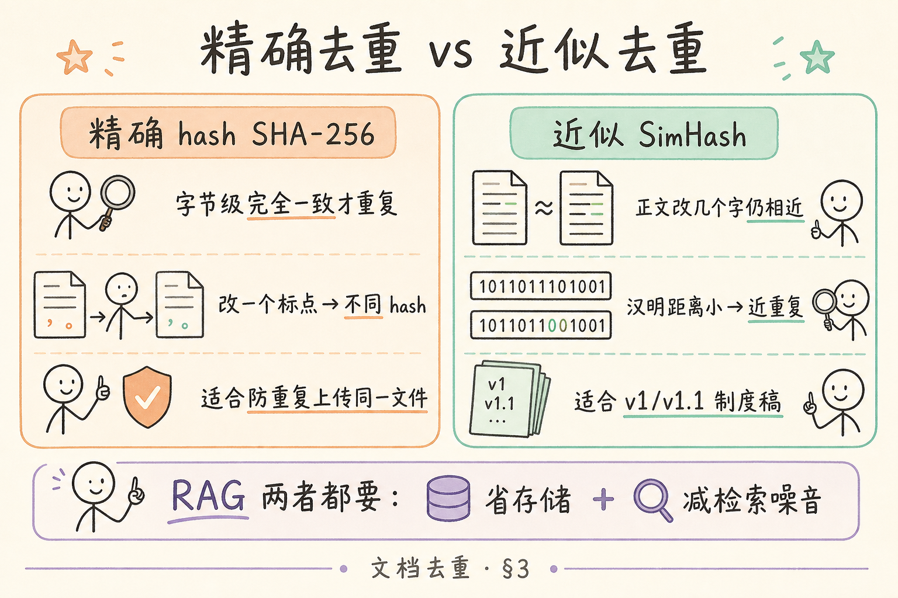
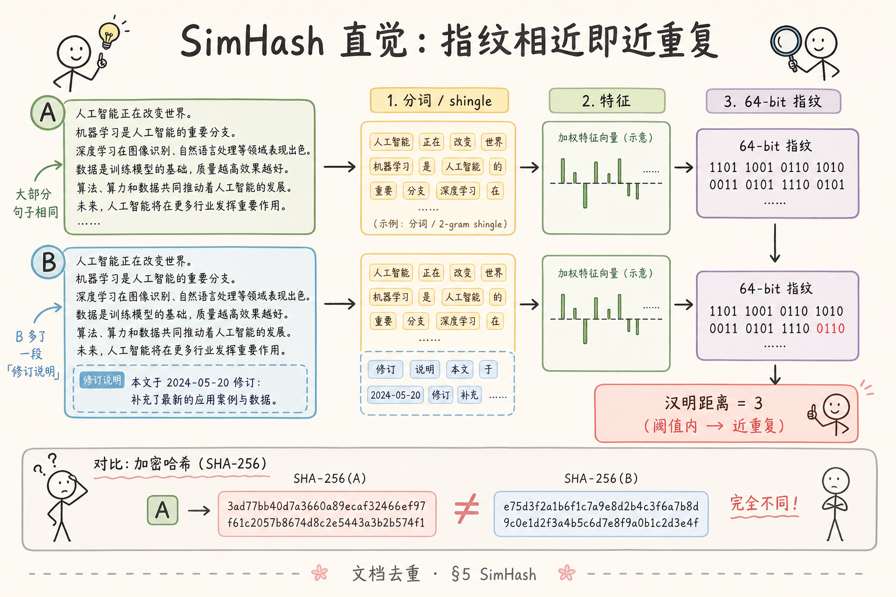
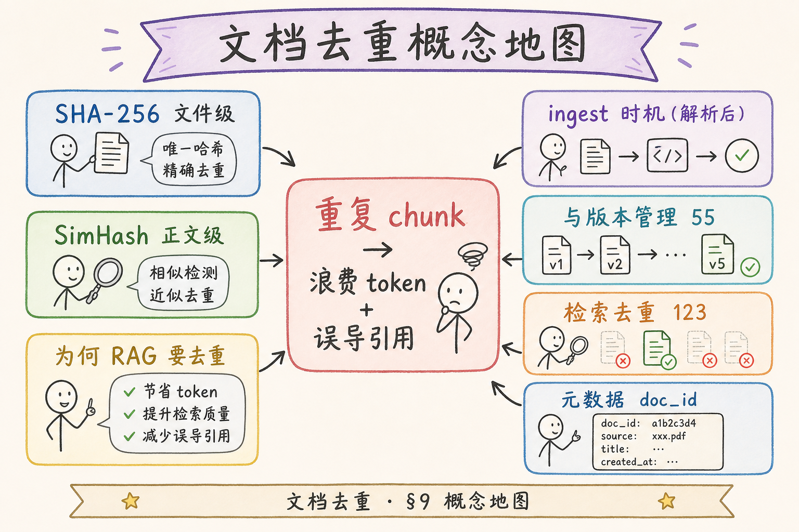

# 企业 RAG 数据采集（七）：文档去重（Hash / SimHash）完全指南

> HR 把《员工手册 2024》上传了一遍，法务又上传了 **改了两处标点** 的「2024 修订版」，运营还留着 **去年扫描 PDF** 和 **今年 Word 导出 PDF**——三套内容 **90% 相同**。你的 ingest 若照单全收：向量库里 **三倍 chunk** 占存储；用户问「试用期多长」，检索 Top-5 **五条几乎一样**，浪费 **token**（[27](27.token-counting-billing-tutorial.md)），引用 UI 还显示 **三个 doc_id** 让用户懵。 **文档去重** 是 ingest 里 **低成本高收益** 的一环：**精确 hash** 挡 **完全重复上传**；**近似 SimHash** 收 **小改、换格式、扫描重导** 的 **近重复**。这篇是 [企业 RAG 路线图](ENTERPRISE_RAG_ROADMAP.md) **C1 后半**（路线图第 **54** 条），讲清两类去重、RAG 为何要去重、**SHA-256** 最小示例与 **SimHash** 直觉（含纯 Python 简化），并做 **先错对对**。前置：[46 文本清洗](46.text-cleaning-tutorial.md)（去重应对 **净文本**）；可选 [41 编码](41.text-encoding-detection-tutorial.md)。

---

## 目录

1. [前言：重复文档如何拖垮 RAG](#1-前言重复文档如何拖垮-rag)
2. [本文边界与动手路径](#2-本文边界与动手路径)
3. [精确去重 vs 近似去重](#3-精确去重-vs-近似去重)
4. [为何 RAG 必须去重](#4-为何-rag-必须去重)
5. [SimHash 直觉：近重复指纹](#5-simhash-直觉近重复指纹)
6. [最小实战：SHA-256 与 SimHash](#6-最小实战sha-256-与-simhash)
7. [ingest 去重策略与元数据](#7-ingest-去重策略与元数据)
8. [先错对对：典型误用](#8-先错对对典型误用)
9. [综合概念地图](#9-综合概念地图)
10. [常见陷阱与 FAQ](#10-常见陷阱与-faq)
11. [总结与系列下一步](#11-总结与系列下一步)

---

## 1. 前言：重复文档如何拖垮 RAG

重复不只 **浪费磁盘**。在 RAG 链路里：

1. **检索**：近重复 chunk **embedding 极似**，挤占 Top-K，**多样性丧失**。  
2. **生成**：模型收到 **五段同一政策**，可能 **合并错版本**（旧版试用期 3 月 vs 新版 6 月）。  
3. **引用**：Grounding（[34](34.grounding-citation-tutorial.md)）指向 **三个文件名**，用户不信。  
4. **成本**：重复 chunk 重复算 embedding 费、重复进长上下文（[28](28.context-window-tutorial.md)）。

**精确去重**（Exact deduplication）：字节或规范化全文 **完全一致** 才判重复，常用 **SHA-256** 等密码学 hash。  
通俗说：**双胞胎要 DNA 每个碱基都一样才算同一人**。

**近似去重**（Near deduplication / fuzzy dedup）：允许 **少量编辑、换行、多一段前言** 仍判 **近重复**，常用 **SimHash**、MinHash、embedding 距离。  
通俗说：**兄妹长得像就算一家子**——制度 v1 和 v1.1 常该只留 **最新**。

**SimHash**（Similarity Hash，相似性哈希）：把文本映射为固定位数（如 64 bit）指纹，使 **相似文本** 的指纹 **汉明距离小**。  
通俗说：**文章的身份证号**——改几个字，号还 **差不多**。

**读完本文，你应该能做到：**

1. 区分 **SHA-256 文件级** 与 **SimHash 正文级** 场景。  
2. 解释 RAG 里 **不去重** 的四类代价。  
3. 跑通 §6 **hash 与 simhash** 示例，对两份微差文本算距离。  
4. 设计 **ingest 去重门**：何时 skip、何时 merge、何时留新版。  
5. 完成 §8 先错对对。

### 1.1 重复文档的隐性成本

重复文档不会在仪表盘上标红——**ingest 成功率** 仍是一百 percent。成本藏在：**embedding 账单**（同一政策 embed 五遍）、**检索体验**（Top-K 像复印机）、**引用可信度**（三个文件名同一答案）、**版本混乱**（旧版试用期 3 月未被 supersedes）。去重是 **数据治理**，不是可有可无的优化。52 Tika、44 Unstructured 让你 **更容易 ingest**；54 让你 **ingest 不等于灌水**。

### 1.2 精确与近似缺一不可

只靠 **文件 hash**：挡不住 **PDF 与 DOCX 双份**、**「修订说明」增一段** 的近重复。只靠 **SimHash**：挡不住 **同一文件上传两次**（字节完全相同）。生产 **三道门**（§6.5、§6.8）是标准答案。阈值不是理论值，是 **用你家制度库标定出来的业务参数**——十对样本（§6.10）是下限，不是可选。

### 1.3 与 46 清洗的硬依赖

对 **未清洗** 正文做 simhash，页眉会让 **不同文档** 看起来 **很像**（大家都带「内部资料」），**同文档不同导出** 反而 **距离变远**。务必 **46 后再 54**；对 CSV 务必 **41 后再 46 再 54**。这条顺序写进 code review checklist。

---

## 2. 本文边界与动手路径

**档位：地基篇（C1 后半 — ingest 质量控制）。

**本文讲：** 精确/近似概念、RAG 动机、SHA-256 示例、SimHash 简化实现、ingest 策略、先错对对。  
**本文不讲：** 向量库内 **检索结果去重**（路线图 **123**）、分布式 MinHash LSH 集群、加密 hash 合规、区块链存证。

### 2.1 动手路径表

| 步骤 | 你做什么 | 验收 |
|------|----------|------|
| A | 读 §3～§4，想自家库重复来源 | 列出 2 种重复 |
| B | §6.1 对同一文件算两次 SHA-256 | 十六进制一致 |
| C | §6.2 改标点再算 SHA | **不同** hash |
| D | §6.3 SimHash 算汉明距离 | 微差文本距离 < 阈值 |
| E | §7 写 ingest 伪代码 | 有 `canonical_text` 步骤 |
| F | §8 先错对对 | 指出「只 hash 原文件」问题 |

**环境：** Python 3.10+；§6 标准库即可；可选 `pip install simhash` 对照（非必须）。

### 2.2 与路线图关系

| 条目 | 关系 |
|------|------|
| [46 清洗](46.text-cleaning-tutorial.md) | 去重前 **同一套净文本** |
| [41 编码](41.text-encoding-detection-tutorial.md) | 编码错 → hash 误不同或误相同 |
| 路线图 **55** 版本管理 | 近重复常是 **版本** 问题 |
| 路线图 **56** 变更检测 | 增量更新时 **diff + simhash** |
| 路线图 **57** `doc_id` | 去重后 **保留权威 doc_id** |
| 路线图 **123** 检索去重 | ingest 去重 **不减** 检索层 dedup 需求 |

---

## 3. 精确去重 vs 近似去重

读下图：左精确、右近似，解决不同重复形态。




对照上图：

| 维度 | SHA-256（精确） | SimHash（近似） |
|------|-----------------|-----------------|
| 输入 | 原始字节或规范化全文 | 通常 **清洗后正文** |
| 改一个标点 | hash **变** | 距离可能仍 **小** |
| PDF vs 同内容 DOCX | 字节不同 → **不判** | 抽字相似 → **可判** |
| 用途 | 防 **同一文件传两次** | 防 **多版本冗余** |
| 误杀风险 | 低 | 阈值要调 |
| 计算成本 | 极低 | 低～中 |

**Hash（哈希）**：任意长度输入映射为 **固定长度摘要**；密码学 hash（SHA-256）改一字节摘要 **雪崩变**。  
通俗说：**数字指纹**——文件动一根头发，指纹就换。

**Hamming distance（汉明距离）**：等长两串比特，不同位个数；SimHash 常 **<3～8** 判近重复（视业务调）。  
通俗说：**两个身份证号有几位不一样**。

---

## 4. 为何 RAG 必须去重

### 4.1 四类代价（复习）

| # | 现象 | 根因 |
|---|------|------|
| 1 | Top-K 雷同 | 近重复 embedding 挤占 |
| 2 | 答错版本 | 旧版 chunk 仍被召 |
| 3 | 引用混乱 | 多 doc_id 同段 |
| 4 | 成本翻倍 | 重复算 embed 与 token |

### 4.2 去重发生时机

```text
解析 → 清洗(46) → 【canonical 规范化】→ hash/simhash 门 → 分块 → embed
```

**Canonical text（规范正文）**：用于比对的 **标准化字符串**，如 NFKC、小写（可选）、去空白后。  
通俗说：**比对人前统一化妆**——否则「你」和「您」被当两篇。

### 4.3 与版本管理（55）分工

- **去重**：决定 **入不入库 / 替不替换**。  
- **版本管理**：入库后 **保留 lineage**（v2023 → v2024）、**生效日**。

近重复 **不应** 简单静默丢弃——常 **留新弃旧** 并记 `supersedes` 元数据。

---

## 5. SimHash 直觉：近重复指纹

读下图：两段微差正文 → 指纹相近；SHA 完全不同。



对照上图，简化流程：

1. **分词 / shingle**：如字符 3-gram 或词级（中文可用字 bigram）。  
2. 每个特征 hash 成 64 位向量，**加权投票** 得最终 64 bit。  
3. 两文 SimHash **XOR** 数 1 的个数 = 汉明距离。

**Shingle（n-gram 片段）**：滑动窗口切出的子串，如 `"员工手册"` → `"员工"`,`"工手"`,`"手册"`。  
通俗说：**重叠小碎片**——改一处只动少量碎片。

生产可用 **`simhash` PyPI** 或 Elasticsearch `similarity`；教学用下面 **纯 Python 极简版**（不追求与 Google 原版 bit 级一致，但 **距离直觉对**）。

---

## 6. 最小实战：SHA-256 与 SimHash

### 6.1 文件级 SHA-256（精确）

```python
"""
doc_dedup_hash.py — 精确去重
"""
from __future__ import annotations

import hashlib
from pathlib import Path


def sha256_bytes(data: bytes) -> str:
    return hashlib.sha256(data).hexdigest()


def sha256_file(path: Path, chunk_size: int = 1 << 20) -> str:
    h = hashlib.sha256()
    with path.open("rb") as f:
        while True:
            block = f.read(chunk_size)
            if not block:
                break
            h.update(block)
    return h.hexdigest()


if __name__ == "__main__":
    p = Path("samples/handbook.pdf")
    print(sha256_file(p))
    print(sha256_file(p))  # 同一文件两次相同
```

**ingest 用法**：上传瞬间算 **原文件 hash**，数据库 **唯一索引** `content_sha256` → 重复 **直接 409** 或 **跳过解析省成本**。

### 6.2 正文级 SHA-256（仍「精确」但跨格式）

```python
def canonical_text(text: str) -> str:
    import unicodedata
    import re
    text = unicodedata.normalize("NFKC", text)
    text = re.sub(r"\s+", " ", text).strip()
    return text


def sha256_text(text: str) -> str:
    return hashlib.sha256(canonical_text(text).encode("utf-8")).hexdigest()


a = "员工试用期为六个月。\n"
b = "员工试用期为六个月。 "  # 多一空格
print(sha256_text(a) == sha256_text(b))  # True，若 canonical 压空白
```

改一字：

```python
c = "员工试用期为三个月。"
print(sha256_text(a) == sha256_text(c))  # False — 需 SimHash
```

### 6.3 纯 Python 简化 SimHash

```python
"""
doc_dedup_simhash.py — 教学用简化 SimHash
"""
from __future__ import annotations

import hashlib
import re
from itertools import zip_longest


def tokenize(text: str) -> list[str]:
    text = re.sub(r"\s+", "", text)
    if len(text) < 2:
        return [text] if text else []
    return [text[i : i + 2] for i in range(len(text) - 1)]  # 字 bigram


def simhash64(text: str) -> int:
    tokens = tokenize(text)
    if not tokens:
        return 0
    v = [0] * 64
    for tok in tokens:
        h = int(hashlib.md5(tok.encode("utf-8")).hexdigest(), 16)
        for i in range(64):
            bit = (h >> i) & 1
            v[i] += 1 if bit else -1
    out = 0
    for i in range(64):
        if v[i] > 0:
            out |= 1 << i
    return out


def hamming(a: int, b: int) -> int:
    x = a ^ b
    n = 0
    while x:
        n += 1
        x &= x - 1
    return n


if __name__ == "__main__":
    base = "第三章 试用期制度。试用期为六个月，经考核合格后转正。"
    near = base + "（2024年修订）"
    far = "完全不同的另一份销售提成管理办法，与试用期无关。"

    h0, h1, h2 = simhash64(base), simhash64(near), simhash64(far)
    print("near hamming:", hamming(h0, h1))
    print("far  hamming:", hamming(h0, h2))
    print("sha equal near:", hashlib.sha256(base.encode()).hexdigest()
          == hashlib.sha256(near.encode()).hexdigest())
```

典型观察：`near hamming` **小于** `far hamming`；SHA 对 near **不等**。

**阈值**：中文制度文本可从 **≤5** 试起；误杀时 **放宽到 8** 或 **仅告警不自动删**。

### 6.4 可选：simhash 库对照

```bash
pip install simhash
```

```python
from simhash import Simhash

def simhash_lib(text: str) -> int:
    # 库常用分词；中文可传入字列表
    chars = list(re.sub(r"\s+", "", text))
    return Simhash(chars).value
```

与自写版 **数值不必相同**，但 **近远相对关系** 应一致——用于 **生产** 时 **固定一种实现** 并 **锁阈值**。

### 6.5 组合门 ingest 伪代码

```python
def should_ingest(raw_bytes: bytes, clean_text: str, db) -> str:
    file_hash = sha256_bytes(raw_bytes)
    if db.exists_file_hash(file_hash):
        return "skip_exact_duplicate_file"

    text_hash = sha256_text(clean_text)
    if db.exists_text_hash(text_hash):
        return "skip_exact_duplicate_content"

    fp = simhash64(clean_text)
    neighbor = db.find_simhash_neighbor(fp, max_distance=5)
    if neighbor:
        return f"near_duplicate_of:{neighbor.doc_id}"

    return "accept"
```

### 6.6 MinHash 与 LSH（扩展阅读）

**MinHash**：对文档 shingle 集合用多种 hash 采样，使 **Jaccard 相似度** 与 MinHash 碰撞概率相关。  
通俗说：**用多种抽签法估计两篇有多像**——适合 **亿级** 文档候选对生成。

**LSH（Locality-Sensitive Hashing，局部敏感哈希）**：把相似项 **哈希到同一桶** 的概率高于不相似项，从而 **避免全库两两比**。  
通俗说：**相似文章分同一抽屉**——只和同抽屉比 simhash，省算力。

RAG 企业库 **万～百万** 文档：**SimHash + 线性扫近期** 常够；**十亿级** 网页库才更常 MinHash+LSH。路线图 **123** 检索去重可再用 **向量距离 / MMR** 精滤。

### 6.7 数据库表设计示例

```sql
CREATE TABLE documents (
    doc_id          TEXT PRIMARY KEY,
    content_sha256  TEXT NOT NULL,
    text_sha256     TEXT NOT NULL,
    simhash         BIGINT NOT NULL,
    status          TEXT NOT NULL,
    supersedes      TEXT,
    ingested_at     TIMESTAMPTZ DEFAULT now()
);

CREATE UNIQUE INDEX idx_content_sha256 ON documents(content_sha256);
CREATE INDEX idx_simhash ON documents(simhash);
```

近重复：对新 `simhash`，可用 **高 16 位分桶** 粗滤再算汉明；POC 阶段 **扫全表** 也可接受。

### 6.8 与路线图 55、56 的衔接

| 场景 | 54 去重 | 55 版本 | 56 变更 |
|------|---------|---------|---------|
| 同一文件传两次 | SHA 挡 | — | — |
| 制度 v2023 → v2024 | SimHash 近 | lineage | diff 关键条 |
| 每周同步外部 PDF | SimHash + 日期 | `version` | 仅 ingest 新页 |

默认策略：**新版 supersedes 旧 doc_id**，勿静默丢弃实质修订。

### 6.9 完整可运行脚本 `doc_dedup_demo.py`

```python
"""
doc_dedup_demo.py — 路线图 54 最小演示
"""
from __future__ import annotations

import hashlib
import re
from pathlib import Path

# 假设同目录有 text_cleaning.py
from text_cleaning import clean_text


def sha256_bytes(data: bytes) -> str:
    return hashlib.sha256(data).hexdigest()


def canonical_text(text: str) -> str:
    import unicodedata
    text = unicodedata.normalize("NFKC", text)
    return re.sub(r"\s+", " ", text).strip()


def sha256_text(text: str) -> str:
    return hashlib.sha256(canonical_text(text).encode("utf-8")).hexdigest()


def tokenize(text: str) -> list[str]:
    text = re.sub(r"\s+", "", text)
    return [text[i : i + 2] for i in range(max(0, len(text) - 1))]


def simhash64(text: str) -> int:
    tokens = tokenize(text)
    if not tokens:
        return 0
    v = [0] * 64
    for tok in tokens:
        h = int(hashlib.md5(tok.encode("utf-8")).hexdigest(), 16)
        for i in range(64):
            v[i] += 1 if (h >> i) & 1 else -1
    out = 0
    for i in range(64):
        if v[i] > 0:
            out |= 1 << i
    return out


def hamming(a: int, b: int) -> int:
    x = a ^ b
    n = 0
    while x:
        n += 1
        x &= x - 1
    return n


def ingest_decision(raw: bytes, raw_text: str, neighbors: list[tuple[str, int]]) -> str:
    print("file sha256:", sha256_bytes(raw)[:16], "...")
    clean = clean_text(raw_text)
    print("text sha256:", sha256_text(clean)[:16], "...")
    fp = simhash64(clean)
    print("simhash:", hex(fp))
    for doc_id, dist in neighbors:
        if hamming(fp, doc_id_to_simhash(doc_id)) <= 5:
            return f"near_duplicate:{doc_id} dist={dist}"
    return "accept"


def doc_id_to_simhash(doc_id: str) -> int:
    # 演示：真实应从 DB 读
    return 0


if __name__ == "__main__":
    raw = Path("samples/v1.txt").read_bytes()
    text = raw.decode("utf-8")
    print(ingest_decision(raw, text, []))
```

把 **清洗** 嵌进 `ingest_decision`，体现 **46 → 54** 顺序。

### 6.10 阈值标定实验（建议必做）

准备 **10 对** 文档：

| 类型 | 期望 |
|------|------|
| 5 对近重复 | 汉明 ≤ 阈值 |
| 5 对明显不同 | 汉明 > 阈值 |

记录每对距离，画简单分布；选 **最大近重复距离 + 1** 为初始阈值。每季度用 **新制度版本** 复核，避免 **误杀** 或 **漏去重**。

### 6.11 对象存储与 content-addressable

原文件存 `s3://bucket/sha256/ab/cd/{full_hash}`：

- **天然去重**：同 hash 只存一份；  
- ingest 时 **先算 hash 查桶**，存在则 **跳过上传**；  
- 与 `doc_id` 解耦——同一内容多别名共享 blob。

---

## 7. ingest 去重策略与元数据

### 7.1 三种处置

| 判定 | 动作 |
|------|------|
| 精确文件重复 | **跳过**，返回已有 `doc_id` |
| 精确正文重复 | **跳过** 或 **合并元数据别名** |
| 近似重复 | **默认留新弃旧** 或 **人工审核队列** |

### 7.2 建议字段

```json
{
  "doc_id": "handbook-2024",
  "content_sha256": "a1b2...",
  "text_sha256": "c3d4...",
  "simhash": "9e8f7...",
  "supersedes": "handbook-2023",
  "ingest_action": "accept"
}
```

### 7.3 与清洗顺序

**必须先 [46 清洗](46.text-cleaning-tutorial.md)** 再 canonical——否则页眉让 **本同文档** simhash **变远**，或 **不同扫描** 因同一页眉 **变近**。

### 7.4 与编码 41

同一 GBK 文件若一次 UTF-8 错读、一次对读，**正文 hash 全不同**——去重 **帮不了**，反而 **并存两份乱码与正版**。ingest **先统一 UTF-8**。

---

## 8. 先错对对：典型误用

### 8.1 错法 A：只对 **原文件字节** hash，不做正文近似

**后果**：PDF 与 DOCX **双份入库**；扫描重导 **无法识别**。  
**对法**：文件 hash **+** 净文本 hash **+** SimHash。

### 8.2 错法 B：未清洗就 simhash

**后果**：页眉差异让 **同制度不同导出** 距离变大；或 **页眉相同** 让 **无关文档** 距离变小。  
**对法**：46 `clean_text` → `canonical_text` → simhash。

### 8.3 错法 C：近重复 **静默丢弃** 无审计

**后果**：法务以为新版已进库，实际 **被 skip**。  
**对法**：返回 `near_duplicate_of`；UI **替换确认**；记 `supersedes`。

### 8.4 错法 D：阈值 0，只认完全相同 SimHash

**后果**：加「修订说明」一段就 **进第二套** —— 回到 Top-K 雷同。  
**对法**：业务标定黄金对（10 组正例、10 组反例）调 **汉明阈值**。

### 8.5 错法 E：对未解密 / 损坏文件算 simhash 后入库

**后果**：乱码全文与另一份乱码 **汉明很近**，误并；或空文本 **hash 碰撞** 风险。  
**对法**：解析失败 **不进 simhash 门**；空文本 `len(clean)<50` **拒收** 或人工；加密 PDF **先解密** 再比。

### 8.6 工作流示例：近重复人工确认

```text
上传 → 清洗 → simhash 发现 neighbor (distance=3)
     → API 返回 202: "near_duplicate_suspected"
     → 法务 UI 对比 diff 高亮
     → 用户选「替换旧版」→ supersedes 旧 doc_id，重 embed
     → 或「仍保留两者」→ 打 tag reason=material_change
```

**人工回路** 避免全自动误杀 **实质修订** 文档（如试用期 3 月改 6 月）。

---

## 9. 综合概念地图

读下图，把去重放在清洗之后、分块之前。




对照上图：

- **输入**：净文本 + 可选原文件字节。  
- **精确**：SHA-256 挡 **重复上传**。  
- **近似**：SimHash 收 **版本微差**。  
- **输出**：accept / skip / supersede → chunk → embed。  
- **延伸**：55 版本、56 变更、123 检索 dedup。

---

## 10. 常见陷阱与 FAQ

**Q：用 embedding 余弦做去重行吗？**  
A：可行但 **贵**；SimHash 在 ingest **海量扫库** 更轻。可 **simhash 粗滤 + embedding 精滤**。

**Q：分块后去重还是分块前？**  
A：**文档级** 先去重省 **整块 embed 成本**；chunk 级 dedup 在 **123** 检索侧补。

**Q：加密 PDF 同内容不同密码，hash？**  
A：字节不同 → 文件 hash 不同；靠 **正文 simhash** 若你能解密抽字。

**Q：多语言混合？**  
A：canonical 与 bigram 仍可用；阈值 **分语言标定**。

**Q：Git 式内容寻址和 SHA-256？**  
A：同一思想；对象存储 **content-addressable** 天然防精确重复。

**Q：图片 / 扫描 PDF 去重？**  
A：字节 hash 不同；若 OCR 文本相似，**正文 simhash** 可近；无 OCR 则只能靠 **感知 hash（pHash）** 图像层——超出本篇，见路线图 62。

**Q：用户故意上传同名不同内容？**  
A：文件名不可信；以 **content_sha256** 为准；若 bytes 不同但 simhash 近，走 **§8.6 人工确认**。

**Q：去重和权限 acl（60）？**  
A：替换旧版时 **继承 acl** 或按新规重算；两版并存时检索 **filter 最新 version**。

**Q：chunk 级重复段落？**  
A：文档级去重 **不减** 单篇内重复段；可在分块后做 **chunk simhash** 或检索侧 MMR（123）。

---

## 10A. 场景走读：制度库三倍膨胀

某互联网公司 HR 知识库半年 ingest **四千份** 文件，向量库 **chunk 数破百万**。存储账单尚可，直到法务发现：问「竞业限制期限」，模型引用了 **2022 旧版** 与 **2024 新版** 各两条，答案摇摆。排查发现：三份文件 **字节 hash 各不相同**（PDF 导出、Word 导出、扫描件），但 `clean_text` 后正文 simhash 汉明距离 **≤4**；另有运营 **重复上传** 同一 PDF 七次，文件 hash 完全相同却 **没挡**——早期只做正文 hash，未做 **content_sha256 唯一索引**。

改造：**上传即算文件 hash**，重复秒拒；**清洗后 simhash**，近重复进 **「替换或并存」** 工单；检索默认 `filter version=latest`。chunk 数降 **四成**，同一问题 Top-K **不再五条粘贴**。54 条与 55 版本管理衔接：去重决策不是 **删了算了**，而是 **谁取代谁、旧版是否只读归档**。

阈值标定（§6.10）用十对样本起步；他们后来发现 **加一段「修订记录」** 的汉明距离常在 **6～8**，把自动替换阈值定在 **5**，6 以上 **人工确认**——避免自动删掉 **实质变更** 的制度。SimHash 是 **粗筛**，不是法官；法官是 **业务规则 + 人**。

### 10B. 去重决策表（可贴墙）

| 信号 | 动作 |
|------|------|
| 文件 hash 相同 | 秒拒，返回已有 doc_id |
| 正文 hash 相同 | 拒或合并别名 |
| simhash ≤ 阈值 | 默认 supersedes 旧版，或人工 |
| simhash 中等 | 告警，并存+打 tag |
| 远 | 正常入库 |

### 10C. 与检索层 123 的边界

ingest 去重（54）减 **库内冗余**；检索去重（123）减 **一次 query 多条相似 chunk**。二者 **都要**：前者省存储与 embed，后者改善 **用户体验**。勿说「入库去重了，检索不必 MMR」。

### 10D. 法条级样例：什么该去重、什么该并存

**该去重**：同一《员工手册》PDF 连传七次；2023 版与 2024 版 **仅修订日期和两处标点**（simhash 近）；扫描件与 Word 导出 **正文一致**。**该并存**：2024 版 **实质变更试用期**（simhash 中距离，人工确认）；**不同事业部** 两套同名但内容不同的「门店规范」（simhash 远，且 `acl` 不同，60）；**附件** 与 **正文** 永不因 simhash 误并。把「近」当成「同」会 **删错版本**；把「远」当成「不同」会 **浪费存储**——54 条教的是 **门**，不是 **自动真理**。

### 10E. 实施顺序 Checklist

1. 上传算 `content_sha256`，库内唯一。  
2. 解析 → [46 清洗](46.text-cleaning-tutorial.md)。  
3. `canonical_text` → `text_sha256`。  
4. `simhash64` → 查邻居。  
5. 决策写 `ingest_action` 与 `supersedes`。  
6. 仅对 `accept` / `supersede` 做分块 embed。  
7. 季度复核阈值与黄金十对。

### 10F. 纯 Python SimHash 的局限与升级路径

本篇 §6.3 教学实现用 **字 bigram + MD5 投票**，与 Google 原版 SimHash **bit 不必一致**，但 **近远相对序** 应对。生产若文档 **超长**（十万字制度），建议 **抽样 shingle** 或 **simhash 库** 以控时延；若文档 **百万级**，再加 **LSH 桶**（§6.6）。升级路径：**教学脚本 → PyPI simhash → 带 LSH 的检索服务**，按量走，不要第一天就上分布式。无论哪级，**清洗后 canonical** 不变。

### 10G. 与对象存储、备份的协同

备份系统常 **按字节复制**，产生 **相同 content_sha256** 的重复对象——去重层可 **指向同一 blob**，省 **备份带宽**。注意：**加密侧信道** 下同一明文不同密文 **字节不同**，仍靠 **正文 simhash** 识别。灾备恢复后应 **重建 simhash 索引**，防 **索引与对象不一致**。

### 10H. 延伸阅读：Jaccard、MinHash、embedding 去重

**Jaccard 相似度**：两文档 shingle 集合交集除以并集；**MinHash** 用随机置换估计 Jaccard；**LSH** 把 MinHash 向量分桶。SimHash 可看作 **另一类指纹**，实现更简单，**单文档对比** 够用。若你已用 **embedding** 做语义检索，可用 **向量距离** 做 **第三道** 近重复筛——贵，适合 **高价值小库**。初学 **SHA + SimHash** 足够；别第一天 **三套全上** 却 **没做 46 清洗**。

### 10I. 对外 API 响应示例

```json
{
  "status": "near_duplicate_suspected",
  "upload_id": "up_9f2a",
  "content_sha256": "ab12...",
  "neighbor_doc_id": "handbook-2023",
  "simhash_distance": 4,
  "suggested_action": "supersede_or_review"
}
```

产品可据此弹窗：「检测到与 2023 版高度相似，是否替换？」——把 54 条从 **后端逻辑** 变成 **用户可理解** 的治理动作。

### 10J. 一周实施去重（给排期）

| 天 | 任务 |
|----|------|
| 一 | 上传接口算 content_sha256，重复拒 |
| 二 | 接 46 clean_text，算 text_sha256 |
| 三 | 实现 simhash64 + 汉明，库表加字段 |
| 四 | 十对样本标定阈值 |
| 五 | API 返回 duplicate 状态，产品弹窗文案 |
| 六 | 与 55 版本字段 `supersedes` 联调 |
| 日 | 看 chunk 总量与 Top-K 多样性是否改善 |

去重上线后应用 **两周对照实验**：同一批 query 比较 Top-5 **唯一 doc_id 数** 与 **用户点击引用** 分布——若唯一 doc 数上升、胡编投诉下降，说明 54 条价值 **可量化**；若否，先查 **阈值** 与 **46 清洗** 是否到位，再调 simhash 实现。

### 10K. 三道门再总结（背诵版）

**第一道门**：文件字节 SHA-256，挡 **同一文件传多次**。**第二道门**：canonical 净文本 SHA-256，挡 **不同外壳、同一正文**。**第三道门**：SimHash 汉明距离，收 **微改、修订说明、标点级差异**。任何一道门都不能省；省一道就会在 **成本、体验或版本正确性** 上付利息。利息最终会算在 **客服工单与 embedding 账单** 上。

C1 后半 **51～54** 串联记忆：**Unstructured/Tika 负责拿字，46 负责净字，54 负责不重复存字**。下一批路线图 **55 版本管理** 会在 **54 决策之后** 回答「保留谁、谁只读、谁生效」——去重是版本治理的 **前门**。

### 10L. FAQ 补充

**问：法务要求「旧版也必须可检索」怎么办？**  
答：近重复 **不删旧库**，打 `status=archived` + 检索默认 `version=latest`；54 决策是 **入库策略**，不是 **物理删除**。**问：多语言两版算近重复吗？**  
答：译文 simhash 常 **远**；应靠 **doc 元数据关联** `translation_of`，而非强行去重。**问：图片 PDF 与 OCR 后文本去重？**  
答：对 **OCR 净文本** simhash；无 OCR 则无法正文去重，仅文件 hash。

**问：去重失败会丢数据吗？**  
答：应用层应 **幂等**：`skip` 返回已有 `doc_id` 指针，不是 **静默丢上传**。**问：能否只对标题算 simhash？**  
答：可试，但制度类 **标题常同、正文变**，会 **漏杀**；默认 **全文 canonical** 更稳。**问：embedding 模型换了要重算 simhash 吗？**  
答：不必——simhash 在 **文本层**，与向量模型 **解耦**；模型换了要 **重 embed**，不是 **重 simhash**。

**问：小文件很多，全表扫 simhash 慢怎么办？**  
答：按 **租户+时间窗** 扫邻居；或 simhash 高 16 位分桶；百万前 **不必 LSH**。**问：和 Git SHA 一样吗？**  
答：文件 hash 思想同 **content-addressable**；simhash 是 **相似性指纹**，不是加密完整性校验。

**实施提醒**：去重逻辑放在 **ingest API 同步路径** 会拖慢上传；大库 neighbor 查询应 **异步** 或 **先收文件后决策**，用户界面显示 **处理中**，避免 **超时重传** 造成 **双倍重复**。

54 条与 55 版本、56 变更、123 检索 dedup 共同构成 **「库内不胖、检索不吵、版本可追」** 三角；本篇是 **库内不胖** 的入门实现，代码可一下午跑通，收益却贯穿 **全库生命周期**。

建议今日作业：找两份 **你确定内容相近** 的制度文件，手算或跑 §6.3 的汉明距离，写下 **若阈值为 5 该替还是该并存** 的一句话理由——比再读十页理论更能 **把 54 条变成肌肉记忆**。

**C1 后半收尾**：51 Unstructured 统一元素、52 Tika 检测抽取、53 清洗净字、54 去重守门——四篇读完，ingest **质量链** 闭环；缺一环都会在 **客服工单** 里补课。

下一批可进入路线图 **55 文档版本管理**：在 54 决策 **谁取代谁** 之后，把 **生效时间、只读归档、检索默认版本** 写清楚——去重与版本是 **同一治理故事的两页**。动手跑通 §6，比收藏本文更有用。现在就打开终端试一次即可。值得一试啊。真的。

---

## 11. 总结与系列下一步

RAG ingest **应用三道门**：**文件 SHA-256** 防重复传、**正文 SHA-256** 防规范化后仍相同、**SimHash** 收近重复版本。去重 **依赖 [46 清洗](46.text-cleaning-tutorial.md)** 与 **41 正确解码**；与 **55 版本管理**、**123 检索去重** 互补而非替代。

建议你接下来：

1. 拿 **PDF + DOCX 同源** 样例跑 §6，记录汉明距离与阈值。  
2. 在 ingest API 返回 **`duplicate_of`** 字段，产品可提示用户。  
3. 读路线图 **55** 版本管理、**56** 变更检测 —— 去重 **决策** 升级 **版本 lineage**。

C1 数据采集后半 **51～54**（Unstructured、Tika、清洗、去重）至此连成 **解析 → 清洗 → 去重** 质量链；下一批可进入 **55 文档版本管理** 与 **C2 分块**（路线图 64+）。
