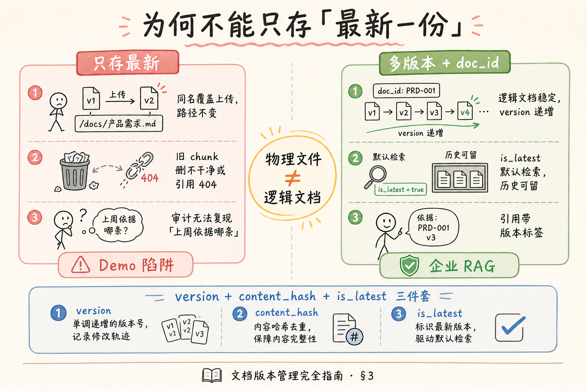
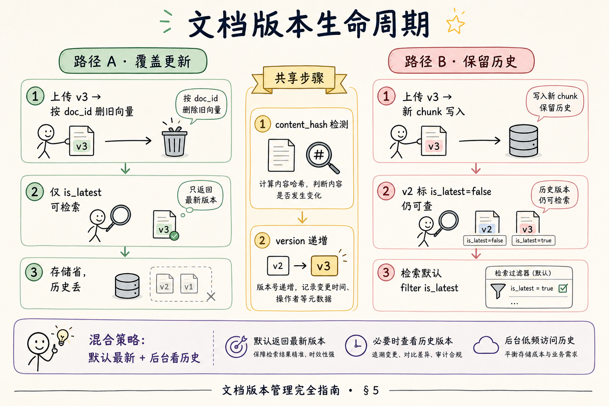
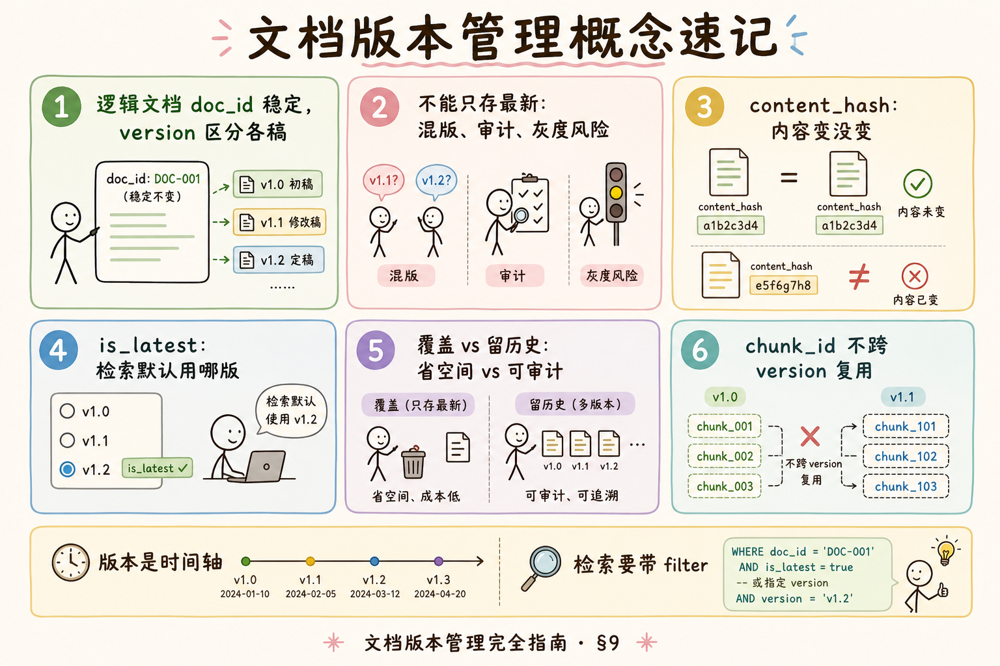

# RAG 数据采集与解析（十）：文档版本管理完全指南

> 企业知识库里的同一份制度，今年修订了三次；用户问「今年差旅标准」时，系统却引用了去年的 PDF。根因往往不是 Embedding 不够强，而是 **索引层只保留了「最新一份字节流」**，没有 **版本维度**——旧 chunk 被覆盖、新 chunk 与旧引用打架、检索也不知道该用哪一版。这篇是 [企业 RAG 路线图](ENTERPRISE_RAG_ROADMAP.md) **C 轨第十篇**（路线图第 **55** 条），讲清 **为何不能只存最新**、`version` 字段怎么设计、**覆盖 vs 留历史** 的取舍，以及检索时 **「用哪版」** 与最小元数据。前置：[38 Markdown 解析](38.markdown-parsing-tutorial.md)、路线图 **54** 文档去重；为 **56** 增量更新、**57** `doc_id` 铺路。

---

## 目录

1. [前言：同一份文件，三个「现在」](#1-前言同一份文件三个现在)
2. [本文边界与动手路径](#2-本文边界与动手路径)
3. [为何不能只存「最新一份」](#3-为何不能只存最新一份)
4. [version 字段：版本到底是什么](#4-version-字段版本到底是什么)
5. [覆盖 vs 留历史：两种存储哲学](#5-覆盖-vs-留历史两种存储哲学)
6. [检索时「用哪版」：默认策略与显式选择](#6-检索时用哪版默认策略与显式选择)
7. [最小元数据设计：能跑起来的 schema](#7-最小元数据设计能跑起来的-schema)
8. [先错后对：只认文件名当版本](#8-先错对对只认文件名当版本)
9. [综合概念地图](#9-综合概念地图)
10. [常见陷阱与 FAQ](#10-常见陷阱与-faq)
11. [总结与系列下一步](#11-总结与系列下一步)

---

## 1. 前言：同一份文件，三个「现在」

上线第一周，HR 上传 `差旅制度.pdf`；第三周法务修订后 **同名覆盖**；第五周又改了一版。你的向量库里如果只有「当前文件内容」，会出现三类尴尬：

1. **引用溯源对不上**：上周用户看到的答案引用了「第 3 页」，这周文件页码与条文都变了。  
2. **审计说不清**：合规问「三月一日生效的是哪条」，系统无法证明当时索引的是哪版。  
3. **检索混版**：增量任务没删干净，**v2 与 v3 的 chunk 同时可搜到**，模型拼出「500 元兼 800 元」的怪答案。

**文档版本管理**（Document Versioning）：为同一逻辑文档的多次修订保留 **可区分的版本标识**，并在索引、检索、引用链路中一致使用。  
通俗说：**同本书的不同印次要有编号**，不能书架上只留最后一本却假装从没换过。

**读完本文，你应该能做到：**

1. 列出至少三条「只存最新」在 RAG 里的业务风险。  
2. 定义 `version` 字段并区分 **内容版本** 与 **存储路径版本**。  
3. 在 **覆盖更新** 与 **保留历史** 之间做场景化选择。  
4. 给出检索侧 **默认用最新、可指定历史** 的策略草图。  
5. 写出可落地的 **最小元数据 JSON**，并与 `doc_id` 预留衔接。

---

## 2. 本文边界与动手路径

**档位：地基篇（C1 治理向）。**

**本文讲：** 版本必要性、`version` 语义、覆盖/留历史、检索选版、最小 schema、典型误用。  
**本文不讲：** Git 式分支合并、Office 自带修订追踪解析、多租户权限模型、完整 CMIS 企业内容管理。

### 2.1 动手路径表

| 步骤 | 你做什么 | 验收 |
|------|----------|------|
| A | 读 §3，写下你们库「同名覆盖」发生过什么 | 能举 1 个风险 |
| B | 读 §4～§5，为样例制度选覆盖或留历史 | 能说出理由 |
| C | 读 §6，画检索默认「仅 latest」过滤 | 口头能讲 |
| D | 按 §7 填一版元数据 JSON | 含 version、is_latest |
| E | 完成 §8 先错对对 | 指出两种错法 |

**环境：** 概念为主；有一块向量库或 Postgres 表即可在纸上演练 schema。

### 2.2 与路线图前后条的关系

| 条目 | 关系 |
|------|------|
| 路线图 **54** 去重 | 去重问「是不是同一份内容」；版本问「同逻辑文档的第几稿」 |
| 路线图 **56** 增量更新 | 变更检测后要决定 **覆盖哪一版** 还是 **挂新版本** |
| 路线图 **57** `doc_id` | 版本挂在 **稳定 doc_id** 之下，不随文件名变 |
| 路线图 **69** 分块 | 切块策略变了，版本边界要重新定 |

---

## 3. 为何不能只存「最新一份」

很多 Demo 的隐含假设是：知识库 = 当前文件夹快照，**Upsert 即真理**。企业生产环境里，「真理」往往带 **时间维度**。

### 3.1 四类刚需场景

| 场景 | 只存最新的后果 |
|------|----------------|
| 合规审计 | 无法重现「当时系统依据哪条制度作答」 |
| 灰度发布 | 新制度想先给试点部门看，全库覆盖会误伤全员 |
| 并行有效 | 旧合同模板对老项目仍有效，新模板不能抹掉旧条文检索 |
| 评测回归 | 改版后评测集答案全变，无法对比「索引改动」本身的影响 |

### 3.2 与向量库删除的联动

若你 **覆盖文件但不版本化**，常见做法是：删旧向量 → 重嵌新全文。问题在于：

- 删除是 **按 chunk_id 还是按 source 路径**？路径不变时容易 **删不干净**。  
- 用户会话里缓存的 **旧引用** 仍在 UI 展示，但后端 chunk 已不存在 → 点击溯源 404。  
- 日志里 `document_id` 若没版本号，运维无法对齐 **哪次 ingestion 任务** 写入了什么。

读下图，把「只留最新」与「多版本并存」放在同一张心智图里对比。




对照上图：

**逻辑文档**（Logical Document）：业务上认定为「同一份制度/合同/手册」的实体，不随单次上传文件名或存储路径变化。  
通俗说：**书名不变，印次可以有很多**。

**物理文件**（Physical File）：对象存储或磁盘上的某个具体字节序列，路径与 hash 随上传变。  
通俗说：**仓库里那一摞纸的某一捆**。

RAG 索引应绑定 **逻辑文档 + 版本**，而不是仅绑定 **物理路径**。

### 3.3 和「去重」分工

路线图 **54** 用 hash / simhash 问：「这两份上传是不是内容一样？」  
版本管理问：「内容 **不一样** 时，是不是 **同一逻辑文档的下一稿**？」

二者正交：  
- 重复上传同一 PDF 两次 → **去重** 拦截，不必升版本。  
- 制度从 v1 改到 v2 → **升版本**，即使文件名仍是 `policy.pdf`。

### 3.4 真实事故片段（便于对号入座）

| 症状 | 可能根因 | 与版本的关系 |
|------|----------|--------------|
| 同一问题两种金额 | 旧版 chunk 未删 | 缺 version 过滤或覆盖不干净 |
| 点击引用跳 404 | 物理路径已换 | 只存路径未存 version 快照 |
| 合规要「三月版」给不出 | 从未留历史 | 只有覆盖策略 |
| 灰度试点看到全员新版 | 全库覆盖 | 缺按部门绑 version |

**Incident**（事故）：线上可观测的异常现象，常由多个底层缺口叠加。  
通俗说：**用户看到的不对劲**，背后往往有一串设计债。

---

## 4. version 字段：版本到底是什么

`version` 不是装饰性字符串，它参与 **唯一性约束、检索过滤、引用展示**。

### 4.1 三种常见版本语义

| 类型 | 示例 | 适用 |
|------|------|------|
| 单调序号 | `1`, `2`, `3` 或 `2024.1` | 内部制度迭代 |
| 业务生效日 | `2025-03-01` | 法规、合同「自某日生效」 |
| 内容寻址 | `sha256:abc...` 前 8 位 | 强审计、无人工编号 |

**Version**（版本标识）：在 `doc_id` 固定前提下，区分不同内容快照的标量或短字符串。  
通俗说：**同一本书的第几版**。

**Effective Date**（生效日期）：版本对外产生法律或流程效力的起始时间。  
通俗说：**从哪天起算数**。

实践建议：**存储层用单调 `version` 或 `version_int`**，展示层再映射 `effective_date`；不要只靠「上传时间」当版本——运维重传会乱序。

### 4.2 最小字段组合

```json
{
  "doc_id": "policy-travel-expense",
  "version": 3,
  "version_label": "2025-Q2",
  "effective_from": "2025-04-01",
  "is_latest": true,
  "content_hash": "a1b2c3d4...",
  "ingested_at": "2025-04-02T10:00:00Z"
}
```

说明：

- `doc_id`：稳定逻辑主键（详见 [50 doc_id 篇](50.metadata-doc-id-tutorial.md)）。  
- `version`：与 `doc_id` 组成 **文档级唯一键** `doc_id + version`。  
- `is_latest`：检索默认过滤用，避免每次 `MAX(version)` 子查询。  
- `content_hash`：判断「这一版内容是否真变了」（为 **56** 增量更新服务）。

### 4.3 版本谁生成？

| 来源 | 做法 |
|------|------|
| 业务系统 | API 带 `doc_id` + `version`，RAG 只消费 |
| 文档 front matter | Markdown YAML 里 `version: 2` |
| 入库服务 | 检测 `content_hash` 变了则 `version += 1` |

**原则：** 版本递增规则 **单点定义**，不要解析器升一次、向量任务又升一次。

### 4.4 版本与对象存储键（S3 Key）

对象存储常用 `bucket/policies/travel/v3/file.pdf` 这类 **带版本的路径**。注意：

- **S3 Key 版本** 是存储布局，不等于 RAG 的 `version` 字段自动对齐。  
- 入库时应 **显式写入** `version=3`，不要假设路径里有个 `v3` 就能被检索 filter 识别。  
- 若 Key 含随机 UUID（`uploads/7f3a…/file.pdf`），更 **不能** 用 Key 当 version。

**Object Key**（对象键）：对象存储中定位一个 blob 的路径式字符串。  
通俗说：**仓库货架编号**，和「制度第几版」不是一回事。

### 4.5 多文件同一版本

一份制度可能同时有 PDF（对外）与 Markdown（内部维护）。它们应：

- 共享同一 `doc_id` + `version`；  
- `document_sources` 表列多个 `source_uri`；  
- 解析 pipeline 选 **primary** 源生成 chunk，或按规则合并（进阶）。

避免 PDF 升到 v4、MD 仍索引 v3 的 **混版文档**——版本是 **逻辑文档级**，不是「某个扩展名文件级」。

---

## 5. 覆盖 vs 留历史：两种存储哲学

### 5.1 覆盖更新（Replace / Overwrite）

**做法：** 向量库只保留 `is_latest=true` 的 chunk；新版本入库前 **按 doc_id 删除旧版** 或 **原地覆盖 metadata**。

| 优点 | 缺点 |
|------|------|
| 存储省、检索简单 | 丢历史，审计弱 |
| 不会混版 | 误覆盖不可逆 |

适合：营销话术、实时性极高且无人追责「上周答案」的 FAQ。

### 5.2 保留历史（Append / Immutable）

**做法：** 每个版本 **独立一批 chunk**，`version` 不同；旧版 `is_latest=false` 但 **仍可被检索**（在带版本过滤的查询下）。

| 优点 | 缺点 |
|------|------|
| 可审计、可对比 | 存储与索引体积涨 |
| 支持灰度、多版本并行 | 检索必须带 **版本策略** |

适合：制度、合规、合同模板、财务政策。

读下图，看一次「上传新版本」在两种哲学下的生命周期差异。




对照上图：

**Immutable Version**（不可变版本）：一经发布的内容快照不再原地修改，更正通过 **新版本** 完成。  
通俗说：**印好的纸不用橡皮擦，错印就发新印次**。

**Latest Pointer**（最新指针）：在多个版本中标记 **默认对外** 的那一条，通常 `is_latest=true` 唯一。  
通俗说：**书架最外面那本标「当前有效」**。

### 5.3 混合策略（企业常见）

- **默认检索：** 只搜 `is_latest=true`。  
- **管理后台：** 可切换「查看历史版本」只读。  
- **会话级锁定：** 用户开始长对话时 **固定版本快照**，避免中途制度改版导致前后矛盾。  
- **定期归档：** 超过 N 年的版本从热索引迁到冷存储，但保留 hash 与元数据。

### 5.4 存储成本粗算（留历史时）

设：平均每文档 40 chunk，每 chunk metadata + 向量约 6 KB（粗估），1000 份文档，保留 5 个历史版本。

| 策略 | 向量条数量级 | 备注 |
|------|--------------|------|
| 仅最新 | 4 万 | 基线 |
| 5 版历史 | 20 万 | 约 5 倍存储 |

是否可接受取决于 **向量库计费** 与 **审计刚需**。很多团队选择：**热库只保留 2～3 版**，更老版本 **仅留 catalog + 冷归档对象**，按需重嵌。

### 5.5 与权限、多租户的衔接（预览）

多部门制度库常见需求：「法务看草案 v4，全员仍用 v3」。实现思路：

- 同一 `doc_id` 下多 version 并存；  
- 检索 filter = `is_latest` **且** `visibility in user_groups`；  
- 或 **两套路由**：生产库只索引 `published` 版，试点库索引 `draft` 版（环境隔离更简单）。

地基篇记住：**版本是维度**，权限是另一个维度，不要混成一个布尔 flag。

---

## 6. 检索时「用哪版」：默认策略与显式选择

向量检索 **不会自动懂「最新」**，除非你通过 metadata filter 告诉它。

### 6.1 三层策略

| 层级 | 行为 |
|------|------|
| 默认 | `filter: is_latest == true` |
| 用户显式 | 「依据 2024 版制度回答」→ `version=2` 或 `effective_from<=2024-12-31` |
| 系统推断 | 问「去年标准」→ 用时间解析映射到对应 `effective_from` 版本 |

**Version-aware Retrieval**（版本感知检索）：在 embedding 相似度之外，用 metadata 限定 **候选 chunk 的版本集合**。  
通俗说：**先圈定「哪一年的手册」，再在里面找相关段落**。

### 6.2 与引用的关系

引用卡片应展示：**文档名 + 版本标签 + 页码/章节**。  
仅展示 `差旅制度.pdf` 而不展示版本，用户无法核对「是不是我看的那版」。

若采用覆盖更新，旧会话引用应：

- **软失效**：标注「内容已更新，仅供参考」；或  
- **快照**：会话层缓存 chunk 文本（占内存，但溯源一致）。

### 6.3 和 LLM 提示词

在 system 或资料块 header 写清：

```text
以下资料来自《差旅制度》版本 2025-Q2，生效日 2025-04-01。
若用户询问其他版本，请说明当前仅加载此版本。
```

避免模型把训练记忆里的「常见差旅标准」与 **未加载的旧版** 混在一起。

### 6.4 评测环境的版本锁定

做 RAG 回归评测时，应 **固定 corpus 版本**：

```json
{
  "eval_suite": "travel-policy-2025Q1",
  "corpus_snapshot": {
    "doc_id": "policy-travel-expense",
    "version": 3
  }
}
```

否则制度悄悄升到 v4，分数下降是 **corpus 变了** 而非检索算法退化。  
**Corpus Snapshot**（语料快照）：评测时绑定的文档版本集合。  
通俗说：**考试大纲印哪一版，改大纲要换卷子**。

### 6.5 API 参数设计示例

```http
GET /api/v1/search?q=住宿标准&doc_id=policy-travel-expense&version=3
GET /api/v1/search?q=住宿标准&latest=true
```

对外文档写清：省略 `version` 时等价 `latest=true` → 过滤 `is_latest`。

---

## 7. 最小元数据设计：能跑起来的 schema

### 7.1 文档级（Document-level）

| 字段 | 类型 | 必填 | 说明 |
|------|------|------|------|
| `doc_id` | string | 是 | 逻辑主键，不随文件名变 |
| `version` | int/string | 是 | 与 doc_id 联合唯一 |
| `is_latest` | bool | 是 | 默认检索过滤 |
| `content_hash` | string | 是 | 变更检测 |
| `source_uri` | string | 否 | 原始路径或对象键 |
| `title` | string | 否 | 展示用 |
| `effective_from` | date | 否 | 业务生效 |
| `supersedes_version` | int | 否 | 上一版版本号，链式审计 |

### 7.2 块级（Chunk-level）

每个 chunk **继承** 文档级 `doc_id`、`version`，并自有 `chunk_id`（见 [51 chunk_id 篇](51.metadata-chunk-id-tutorial.md)）。

```json
{
  "chunk_id": "policy-travel-expense:v3:c00012",
  "doc_id": "policy-travel-expense",
  "version": 3,
  "is_latest": true,
  "section": "住宿标准",
  "page": 4,
  "text": "一线城市住宿上限 500 元/晚……"
}
```

**关键约束：** 同一 `chunk_id` 不应跨版本复用——新版本切块后应生成 **新 chunk_id**，否则溯源串版。

### 7.3 向量库侧过滤示例（伪代码）

```python
def search(query: str, doc_id: str | None = None, version: int | None = None):
    filters = {"is_latest": True}  # 默认
    if version is not None:
        filters = {"doc_id": doc_id, "version": version}
    elif doc_id is not None:
        filters = {"doc_id": doc_id, "is_latest": True}
    return vector_store.query(
        embedding=embed(query),
        filter=filters,
        top_k=8,
    )
```

### 7.4 入库时更新 `is_latest` 的流程

1. 新内容入库，`version = previous_max + 1`。  
2. 事务内：将同 `doc_id` 下旧行 `is_latest=false`；新行 `is_latest=true`。  
3. 若策略为覆盖删除：删除旧版 chunk 向量；若留历史：仅改标志位。

**不要用「先删后写」无事务**：中间态会导致短暂 **无最新版** 可检索。

---

## 8. 先错后对：只认文件名当版本

### 8.1 错法一：同名文件即同一文档

**现象：** `制度.pdf` 覆盖上传，路径不变，metadata 里 `source=制度.pdf`，无 `version`。  
**后果：** 向量库残留旧 chunk；或删除时误删其他同名不同目录文件。  
**对法：** 引入 `doc_id`；路径放 `source_uri`；版本用 `version` + `content_hash`。

### 8.2 错法二：用 `mtime` 或上传时间当版本号展示

**现象：** 界面显示「更新于 2025-04-02」，用户以为是制度生效日。  
**后果：** 合规对话对不齐；跨时区运维重传导致版本乱序。  
**对法：** 区分 `ingested_at`（系统入库时间）与 `effective_from`（业务生效）；`version` 单调递增。

### 8.3 错法三：检索不做 `is_latest` 过滤

**现象：** 历史版本 chunk 仍在索引，相似度又高。  
**后果：** 模型引用旧版 500 元与新版 800 元混合条文。  
**对法：** 默认 `is_latest=true`；历史版本仅显式查询时开放。

### 8.4 错法四：chunk_id 跨版本复用

**现象：** 切块脚本用 `doc_id + chunk_index`，改版后 index 对齐「碰巧」相同。  
**后果：** 溯源显示 v3，实际文本来自 v2 缓存。  
**对法：** `chunk_id` 编入 `version` 或内容 hash 前缀（详见第五十一篇）。

---

## 9. 综合概念地图




对照上图：版本是 **逻辑文档** 上的时间轴；检索、引用、增量都要挂在同一套 `doc_id + version` 上。

### 9.1 速记表

| 概念 | 一句话 |
|------|--------|
| 不能只存最新 | 审计、灰度、混版风险 |
| version | doc_id 下的第几稿 |
| 覆盖 | 省空间，丢历史 |
| 留历史 | 可审计，检索要带过滤 |
| is_latest | 默认检索用哪版 |
| content_hash | 内容变没变 |

---

### 9.2 与 Word「修订模式」的区别

Office 修订追踪记录 **谁改了哪个字**；RAG 版本管理记录 **哪一版内容进了索引**。  
可以共存：解析时取「接受所有修订」后的清洁正文算 hash，版本号仍由业务系统发。  
不要把 Word 里的红色删除线原样 embed——那是编辑态，不是发布态。

### 9.3 小团队最小可行版本方案

若暂时不想建完整 `document_versions` 表，最低限度：

1. 每个 `doc_id` 维护 `version_int` 单调递增；  
2. 向量 metadata 带 `version` + `is_latest`；  
3. 检索默认 `is_latest=true`；  
4. 覆盖上传前 `delete by doc_id`。

四条做到，已能避免八成混版事故；以后再补 `effective_from` 与历史只读 UI。

## 10. 常见陷阱与 FAQ

1. **把版本等同于文件路径** —— 路径会变，逻辑文档不变。  
2. **版本号从 UI 手工填** —— 易跳号、重复，应用规则或业务 API 下发。  
3. **只版本化 PDF，不版本化 MD** —— Wiki 同步同样会改版。  
4. **忽略「失效日」** —— 仅有 `effective_from` 没有 `effective_to`，并行有效期会糊。  

**Q：小团队能否先不做版本，只做全量重建？**  
A：可以撑早期 Demo；一旦出现「上周答案不能复现」或混版，就应补 `version` 与 `is_latest`，成本远低于事后洗库。

**Q：版本存在 Postgres，向量只存 chunk，可以吗？**  
A：常见做法。文档级版本表在 OLTP；chunk metadata 冗余 `version` 便于向量库过滤。

**Q：用户问「对比今年和去年制度差异」怎么做？**  
A：分别检索 `version=current` 与 `version=previous` 的 chunk，交给 LLM 做 diff 摘要；不要在一次检索里混两个 `is_latest`。

**Q：和 Git 管理文档的关系？**  
A：Git commit 可当 `version_label` 来源，但 RAG 仍需自己的 `doc_id`/`chunk_id`——Git 管变更史，向量库管 **可检索快照**。

**Q：`supersedes_version` 必填吗？**  
A：最小可省略；审计强场景建议填，形成版本链。

---

## 10.5 端到端故事：制度改版的一周

**周一**：法务在 CMS 发布《差旅制度》v3，`effective_from=2025-04-01`，业务 API 推送 `doc_id=policy-travel-expense, version=3`。  
**周二凌晨**：增量任务拉取 API，算 `content_hash`，与 catalog v2 不同 → 进入 pipeline。留历史策略：v2 的 `is_latest=false`，v3 写入新 chunk，`chunk_id` 全部带 `:v3:`。  
**周二白天**：用户问「上海住宿标准」→ 检索 `is_latest=true` → 引用显示「2025-Q2 版 · 第 4 页」。  
**周四**：合规问「3 月 28 日某工单依据哪版」→ 查会话日志 `corpus_version=2` → 用 `version=2` 过滤复现答案。  
**周五**：试点部门仍需 v2 对比 → 管理后台「历史版本」只读检索，不 flip `is_latest`。

这条故事串起本文所有字段：**没有 version，周四周五都无法交代**。

## 10.6 字段对照速查（打印用）

| 用户问题 | 用哪个字段 |
|----------|------------|
| 现在生效的是哪版 | `is_latest` + `effective_from` |
| 内容有没有真变 | `content_hash` |
| 和上一版什么关系 | `supersedes_version` |
| 系统何时收录 | `ingested_at` |
| 物理文件从哪读 | `source_uri` |
| 逻辑上是哪份制度 | `doc_id` |

## 10.7 与增量任务（第五十九篇）的接口约定

增量检出 `changed` 后，版本模块应回答：

1. `content_hash` 变了吗？没变可跳过 embed。  
2. 变了吗 → `next_version` 是多少？  
3. 覆盖还是留历史 → 删哪些 chunk 范围？

把这三条封装成 `VersioningService.next_action(doc_id, new_hash)`，增量 worker 不要散落 if-else。

## 10.8 读路径自检（5 分钟）

闭眼答：

1. 为什么 `ingested_at` 不能当 `effective_from`？  
2. 留历史时，默认检索 filter 写什么？  
3. 改版后 chunk_id 能沿用吗？  

三条都能答，本篇达标。

## 10.9 版本标签对用户话术

| 内部字段 | 用户可见文案 |
|----------|--------------|
| version=3 | 「2025 年第二季度版」 |
| effective_from | 「自 2025 年 4 月 1 日起生效」 |
| is_latest=false | 「历史版本，仅供参考」 |

产品文案与存储字段 **解耦**——工程师看 int，业务看季度标签。

## 10.10 与法务「生效日期」对齐的例句

制度正文写「本办法自 2025 年 6 月 1 日起施行」，则：

- `effective_from = 2025-06-01`  
- 若 5 月 25 日已入库预热，`is_latest` 可先 true，但检索 filter 可加 `effective_from <= today`  
- 用户问「下个月标准」需结合日历与版本，提示词写清 **禁止用未生效版作答**

**预热索引**（Warm Indexing）：生效日前入库但不对外默认检索。  
通俗说：**新菜单印好了，开业日前不挂在门口**。

## 10.11 版本字段的 JSON Schema 片段（供 API 校验）

```json
{
  "type": "object",
  "required": ["doc_id", "version", "content_hash", "is_latest"],
  "properties": {
    "doc_id": {"type": "string", "minLength": 3},
    "version": {"type": "integer", "minimum": 1},
    "content_hash": {"type": "string", "pattern": "^[a-f0-9]{64}$"},
    "is_latest": {"type": "boolean"},
    "effective_from": {"type": "string", "format": "date"}
  }
}
```

入库 API 用 schema 拦截「version 传字符串」「hash 长度不对」等低级错误，避免脏数据进向量库后 **很难洗**。

## 10.12 双轨术语小结

| 英文 | 中文 | 通俗说 |
|------|------|--------|
| Document Versioning | 文档版本管理 | 同一制度多印次要编号 |
| is_latest | 是否最新版 | 书架最外面那本 |
| content_hash | 内容哈希 | 指纹判变没变 |
| Version-aware Retrieval | 版本感知检索 | 先圈年份再找段落 |
| Immutable Version | 不可变版本 | 错印发新印次不改旧纸 |

记住：**版本管时间，doc_id 管身份，chunk_id 管段落**——三者在入库链路上应同批写入。

---

## 11. 总结与系列下一步

1. 企业 RAG **不能只存最新字节流**——合规、灰度、混版都会爆雷。  
2. `version` 与稳定 `doc_id` 绑定，配合 `content_hash` 与 `is_latest`。  
3. **覆盖** 省而脆，**留历史** 繁而稳；默认检索只打 `is_latest`。  
4. 引用与 chunk 元数据必须 **带版本标签**，chunk_id 不跨版本复用。

### 11.1 系列下一步

| 目标 | 阅读 |
|------|------|
| 增量更新与变更检测 | [49 增量更新](49.incremental-update-tutorial.md) |
| 稳定 doc_id | [50 doc_id](50.metadata-doc-id-tutorial.md) |
| chunk_id 与溯源 | [51 chunk_id](51.metadata-chunk-id-tutorial.md) |

### 11.2 学习目标自检

- [ ] 能说出三条「只存最新」的风险  
- [ ] 能解释 version 与 content_hash 分工  
- [ ] 能选择覆盖或留历史并说明理由  
- [ ] 能写出带 `is_latest` 的检索过滤  
- [ ] 完成先错对对四组  

---

> **初学者可能仍困惑的点**  
> - 「版本」不是越细越好——没有业务需求时 `version_int` 单调递增就够。  
> - 留历史不等于 **永远全量检索**——默认仍只搜 `is_latest`。  
> - 版本化发生在 **入库逻辑**，不是 Embedding 模型自带的功能。  
> - 下一篇讲 **文件变了怎么只重嵌变的**，与本文的 `content_hash` 直接衔接。
