# REST API 设计完全指南：从新手到出坑，写让人心情愉悦的接口

> 你是否调过这样的 API——创建用户用 `POST /api/v1/users`，更新用户用 `POST /api/v1/updateUser`，删除用户用 `GET /api/v1/users/delete?id=123`？三个操作三个风格，让你怀疑写接口的人是不是在搞行为艺术。这篇教程从零带你掌握 REST API 的设计哲学，用资源思维重新理解 URL，写出来被人称赞「这接口真清爽」的 API。

---

## 目录

1. [前言：那些年我们调过的奇葩 API](#1-前言那些年我们调过的奇葩-api)
2. [REST 是什么以及为什么重要](#2-rest-是什么以及为什么重要)
3. [资源设计：URL 是名词，不是动词](#3-资源设计url-是名词不是动词)
4. [HTTP 方法的正确使用](#4-http-方法的正确使用)
5. [状态码：让响应自己会说话](#5-状态码让响应自己会说话)
6. [请求与响应设计](#6-请求与响应设计)
7. [分页、过滤与排序](#7-分页过滤与排序)
8. [版本管理策略](#8-版本管理策略)
9. [认证与授权](#9-认证与授权)
10. [错误处理设计](#10-错误处理设计)
11. [实战：设计一个完整的 REST API](#11-实战设计一个完整的-rest-api)
12. [常见反模式与最佳实践](#12-常见反模式与最佳实践)
13. [REST vs GraphQL vs gRPC](#13-rest-vs-graphql-vs-grpc)
14. [总结](#14-总结)
    - [14.1 常见问题（FAQ）](#141-常见问题faq)

---

## 1. 前言：那些年我们调过的奇葩 API

先来做个测试。下面四个 API 接口，你觉得哪些设计得好？

```python
# 接口 A
POST /api/v1/create_user
body: {"name": "张三", "email": "zhangsan@example.com"}

# 接口 B
POST /api/v1/users
body: {"name": "张三", "email": "zhangsan@example.com"}

# 接口 C
GET /api/v1/delete_user?id=123

# 接口 D
DELETE /api/v1/users/123
```

如果你觉得 **B 和 D** 更好——恭喜，你已经有了 REST 的直觉。

但现实世界远比这四个例子更加混乱。从业这些年，我见过以下「杰作」：

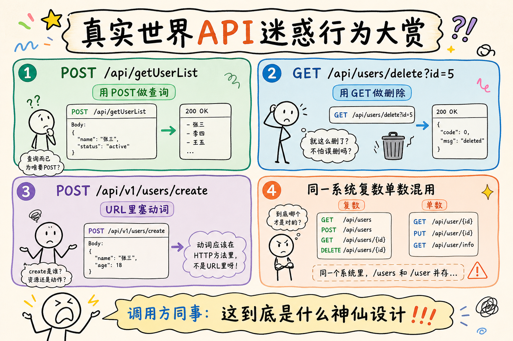


更痛苦的是，当你需要对接这样一个 API：

- 错误时返回 HTTP 200，body 里写 `{"code": -1, "msg": "未知错误"}`
- 成功时 `{"data": null}` 和 `{"data": []}` 混着用，不确定何时返回什么
- 分页参数有的叫 `page/pageSize`，有的叫 `offset/limit`，有的叫 `start/count`
- 同一个实体，列表里叫 `user_name`，详情里叫 `name`

**好的 API 让人调用时心情愉悦，烂的 API 让人想摔键盘。** REST 就是为了解决这个问题而生的——它提供了一套约定，让 API 设计变得「可预测」。

**读完你能做什么：**
- 用资源思维设计 URL，正确选择 HTTP 方法与状态码
- 写一份带分页、认证、错误格式的 REST API 设计稿
- 判断何时 REST 够用、何时考虑 GraphQL/gRPC

**前置知识：** 知道 HTTP 请求/响应基本结构即可；无需特定后端框架经验。

---

## 2. REST 是什么以及为什么重要

### 2.1 REST 的核心思想

**REST** = **RE**presentational **S**tate **T**ransfer（表述性状态转移）

这名字听起来很学术，但核心思想其实非常简单。我们不谈 Roy Fielding 2000 年的博士论文，用大白话说就是：

> **把服务器上的一切都看作「资源」。用 URL 定位资源，用 HTTP 方法操作资源。每个资源有唯一地址，你通过这个地址访问和修改它的「表述」（representation）。**
>
> **representation**（表述）：资源当前呈现给客户端的样子，常见是 JSON 对象。通俗说：同一份用户数据，列表页可能只返回 `id/name`，详情页返回完整字段——都是同一资源的 different representation。

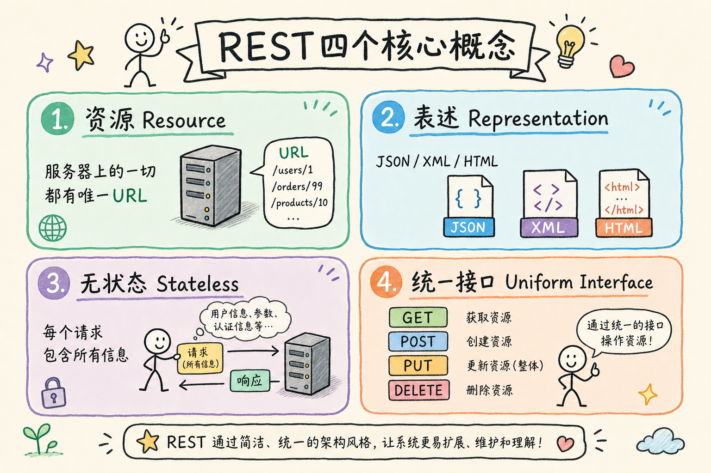


### 2.2 一个类比：图书馆

把 REST API 想象成一个图书馆管理系统：

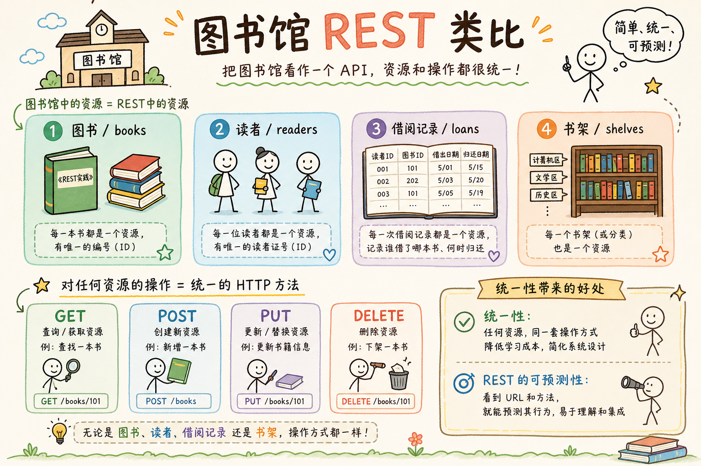


### 2.3 REST 的成熟度模型

Richardson 提出了一个四级成熟度模型，帮你判断一个 API 到底有多 REST：

| 级别 | 名称 | 通俗说 |
|------|------|--------|
| 0 | 隧道 | 一个 URL 打天下，全靠 POST |
| 1 | 资源 | 不同 URL 代表不同资源 |
| 2 | HTTP 动词 | 用 GET/POST/PUT/DELETE 表达操作 |
| 3 | HATEOAS | 响应里带「下一步可点的链接」，客户端按链接发现操作 |

**HATEOAS**（Hypermedia as the Engine of Application State）：响应中嵌入链接（如 `"links": {"comments": "/articles/1/comments"}`），让客户端不必硬编码所有 URL。实践中成本高，多数团队停在 Level 2。

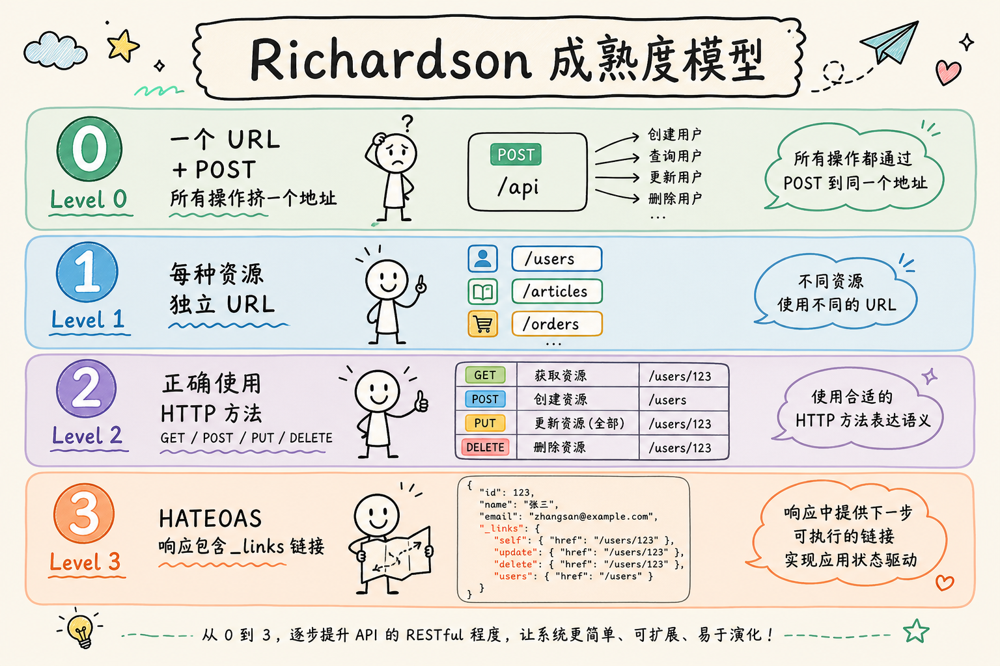


> **大多数团队的追求是 Level 2。** Level 3（HATEOAS）理论优美，但实践中成本高、收益不明显。本教程聚焦 Level 2 的设计。

---

## 3. 资源设计：URL 是名词，不是动词

这是 REST 设计中最重要的一课，值得单独成章。

### 3.1 核心原则

```
URL 代表资源（名词），
HTTP 方法代表动作（动词）。

好的 URL 看起来像文件夹路径，每段都是「东西」。
```

```python
# ❌ URL 里塞动词——这是 RPC 风格，不是 REST
POST /api/getUserList
POST /api/createUser
POST /api/updateUser
POST /api/deleteUser
GET  /api/searchUsers

# ✅ URL 只有名词——HTTP 方法就是动作
GET    /api/users        # 获取用户列表     (动词 GET + 资源 users)
GET    /api/users/123    # 获取单个用户     (动词 GET + 资源 users/123)
POST   /api/users        # 创建用户         (动词 POST + 资源 users)
PUT    /api/users/123    # 全量更新用户     (动词 PUT + 资源 users/123)
PATCH  /api/users/123    # 部分更新用户     (动词 PATCH + 资源 users/123)
DELETE /api/users/123    # 删除用户         (动词 DELETE + 资源 users/123)
```

### 3.2 资源命名规范

URL 应像目录结构一样可读：用**名词复数**表示资源，动词交给 HTTP 方法。

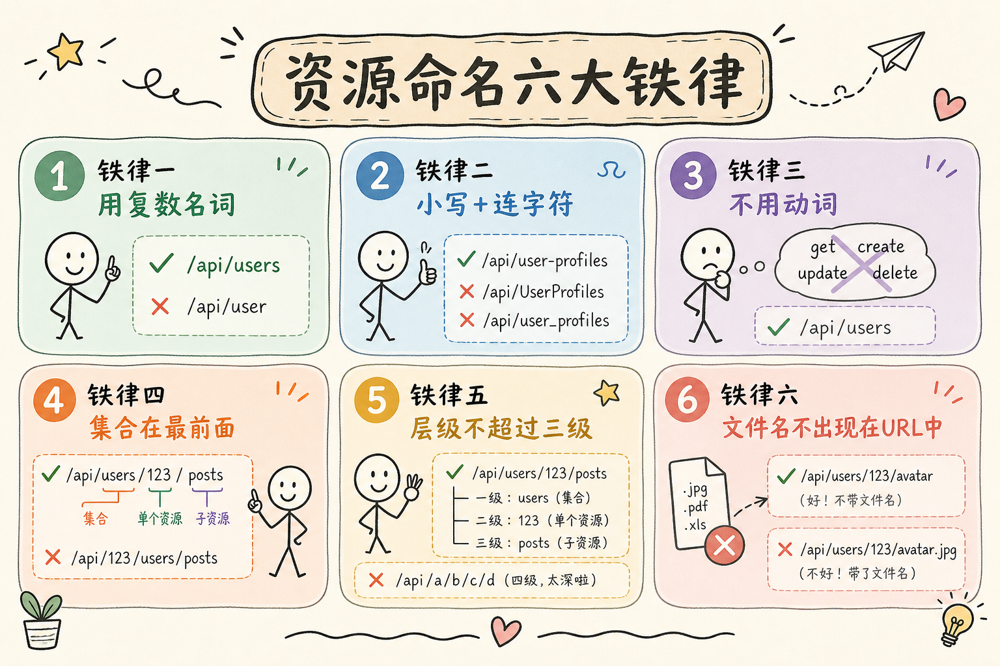

对照上图：用复数（`/users`）、小写连字符、嵌套表示从属（`/users/123/orders`）。

### 3.3 集合资源和单体资源

```python
# 集合 (collection) —— 复数，结尾不带 ID
GET    /api/users          # 用户列表
POST   /api/users          # 创建用户（新用户会加入这个集合）

# 单体 (singleton) —— 带 ID，在集合下面
GET    /api/users/123      # 单个用户
PUT    /api/users/123      # 更新用户
DELETE /api/users/123      # 删除用户

# 子资源（sub-resource）—— 嵌套在父资源下
GET    /api/users/123/orders       # 用户 123 的所有订单
GET    /api/users/123/orders/5     # 用户 123 的第 5 号订单
POST   /api/users/123/orders       # 为用户 123 创建新订单
```

### 3.4 处理「非 CRUD 操作」

不是所有操作都能用增删改查表示。比如「激活用户」「发送邮件」「审批订单」：

```http
# 方案一（优先）：用 PATCH 改状态字段
PATCH /api/users/123
body: {"status": "active"}

PATCH /api/orders/456
body: {"status": "approved"}

# 方案二：把动作建模为名词资源（审计/流程记录）
POST /api/users/123/activations      # 创建一条「激活记录」
POST /api/orders/456/approvals       # 创建一条「审批记录」

# 方案三（工程折中，非最 REST）：动词路径，团队能统一也可接受
POST /api/users/123/activate
POST /api/orders/456/approve

# 方案四（最后才考虑）：独立动词端点
POST /api/activate-user/123
```

> `/activate` 仍是动词路径；若需要 REST 纯度，优先方案一或二。方案三/四是务实折中，关键是团队内一致。

---

## 4. HTTP 方法的正确使用

### 4.0 安全方法与幂等性

在讲具体方法前，先记两个 HTTP 术语：

- **安全方法（Safe）**：不修改服务端状态。典型：`GET`、`HEAD`。搜索引擎爬虫预加载 GET 不会「误删数据」——所以删除绝不能用 GET。
- **幂等（Idempotent）**：同一请求执行多次，**资源最终状态相同**。不要求每次响应状态码或 body 完全一样。

| 方法 | 安全 | 幂等 | 通俗说 |
|------|------|------|--------|
| GET | ✅ | ✅ | 只读 |
| POST | ❌ | ❌ | 创建，重复调用可能产生多条记录 |
| PUT | ❌ | ✅ | 全量替换，重试安全 |
| PATCH | ❌ | ⚠️ | 部分更新，是否幂等取决于实现 |
| DELETE | ❌ | ✅ | 删完后资源「不存在」，再删状态仍是不存在 |

### 4.1 五大方法速查

§4.0 表格已列出安全性与幂等性；下图从**典型用途**角度再速查一遍。

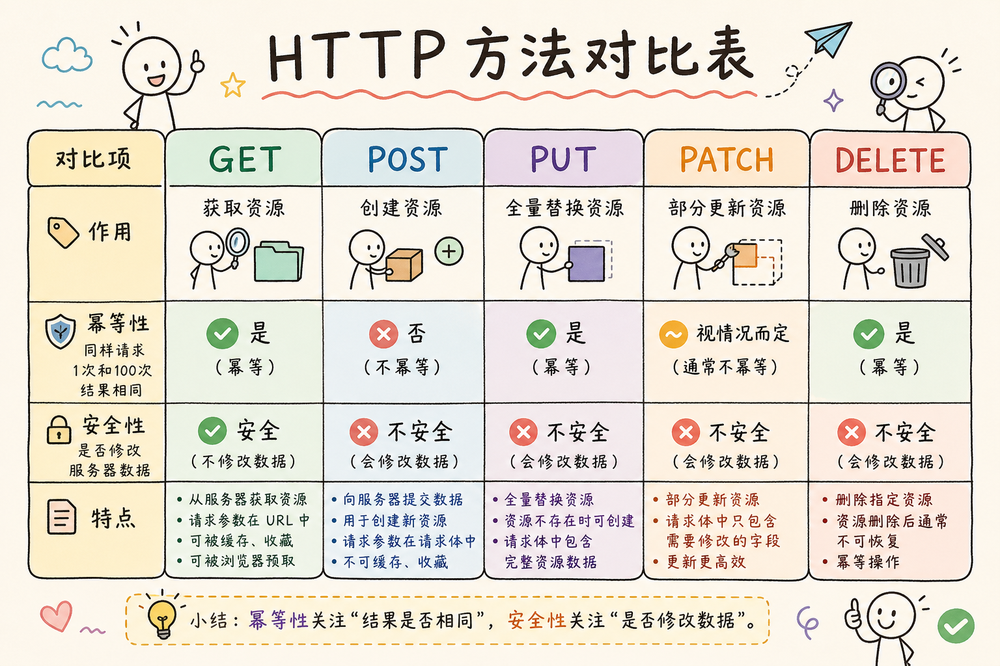

记住：**GET/HEAD 只读**；**POST 创建**；**PUT 全量替换、DELETE 删除**（通常幂等）；**PATCH 部分更新**。

### 4.2 GET——绝不修改数据

```python
# ✅ 正确用法
GET /api/users                  # 获取用户列表
GET /api/users/123              # 获取单个用户
GET /api/users/123/orders       # 获取用户的订单
GET /api/search?q=keyword       # 搜索

# ❌ 错误用法
GET /api/users/delete?id=123    # 用 GET 做删除——危险！
# 搜索引擎爬虫可能会触发删除操作
# 浏览器可能会预加载 GET 请求
# 永远不要用 GET 修改服务端数据
```

### 4.3 POST——创建新资源

```python
# 请求
POST /api/users
Content-Type: application/json

{
    "name": "张三",
    "email": "zhangsan@example.com",
    "age": 25
}

# 响应 (201 Created)
HTTP/1.1 201 Created
Location: /api/users/128        # 新资源的位置
{
    "id": 128,
    "name": "张三",
    "email": "zhangsan@example.com",
    "age": 25,
    "created_at": "2024-03-15T10:30:00Z"
}
```

POST 的几个关键点：
- 返回 **201 Created**，不是 200
- 响应头包含 `Location`，指向新资源
- 响应体返回新建的资源（含服务器生成的 id、时间戳等）
- POST 不幂等——调用两次会创建两个用户

### 4.4 PUT——全量替换

```python
# PUT 要求你发送资源的完整表示
PUT /api/users/123
{
    "name": "张三三",       # 更新
    "email": "newemail@example.com",  # 更新
    "age": 26              # 更新
    # 注意：如果 User 还有 phone 字段，这里没传，
    # 标准 PUT 语义下 phone 会被清空（或设为默认值）
}

# 响应
HTTP/1.1 200 OK
{
    "id": 123,
    "name": "张三三",
    "email": "newemail@example.com",
    "age": 26,
    "updated_at": "2024-03-15T11:00:00Z"
}
```

PUT 的关键特性：

```
PUT 是幂等的——调 1 次和调 100 次，结果完全一样。

第一次: PUT /users/123 {"name": "张三"}
        → 用户 123 的 name 变成 "张三"

第二次: PUT /users/123 {"name": "张三"}
        → 用户 123 的 name 还是 "张三"

第一百次: PUT /users/123 {"name": "张三"}
        → 用户 123 的 name 依然是 "张三"

幂等性意味着：网络超时时你可以放心重试 PUT 请求。
```

### 4.5 PATCH——部分更新

```python
# PATCH 只发送要更新的字段，不影响其他字段
PATCH /api/users/123
{
    "email": "newemail@example.com"
    # 只改邮箱，name、age 等字段保持不变
}

# 响应
{
    "id": 123,
    "name": "张三",                          # 没变
    "email": "newemail@example.com",         # 变了
    "age": 25,                               # 没变
    "updated_at": "2024-03-15T11:30:00Z"
}
```

**PUT vs PATCH 到底怎么选？**

客户端提交**完整资源快照** → **PUT**；只改少量字段 → **PATCH**。

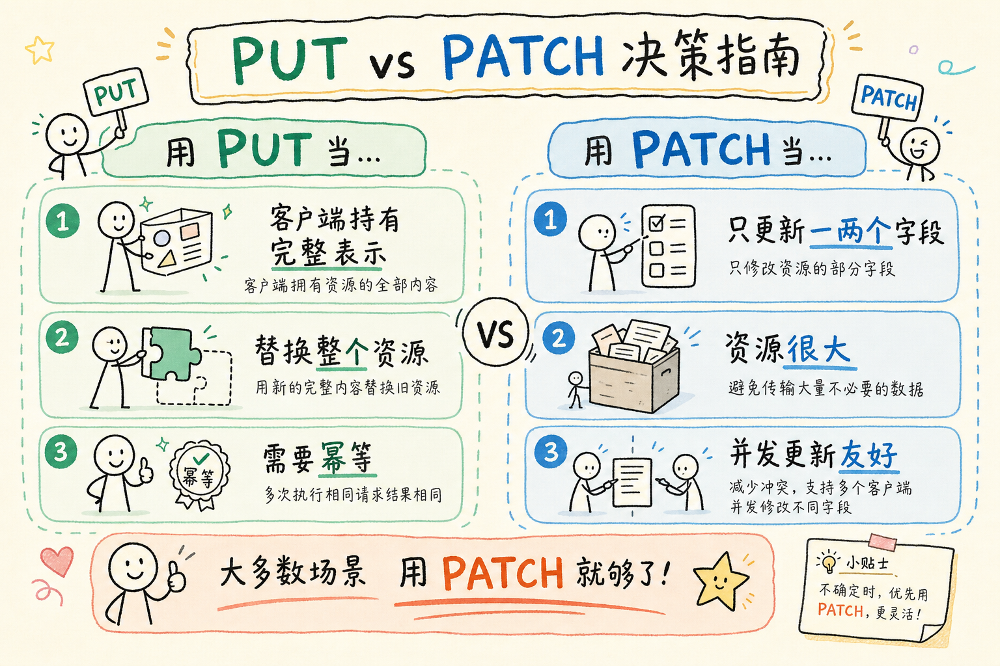

团队应在文档里固定一种默认策略，避免同一资源两种写法并存。

### 4.6 DELETE——删除资源

```python
# 请求
DELETE /api/users/123

# 响应 (204 No Content)——删除成功，没有响应体
HTTP/1.1 204 No Content

# 或者返回 200 + 被删除的资源信息（方便前端确认）
HTTP/1.1 200 OK
{
    "id": 123,
    "deleted": true
}
```

DELETE 也是幂等的——**幂等指资源最终状态不再变化**，不要求响应完全相同。第一次 DELETE 可返回 `204`；第二次对已删资源返回 `404` 也常见，仍算幂等（资源依旧不存在，无新副作用）。

---

## 5. 状态码：让响应自己会说话

### 5.1 五大类状态码

```
1xx  信息性——「收到了，正在处理」
2xx  成功——「搞定了」
3xx  重定向——「你要的东西搬家了」
4xx  客户端错误——「你的问题」
5xx  服务端错误——「我的问题，我修」
```

### 5.2 常用的 15 个状态码

REST API 日常开发中，下面 15 个状态码覆盖绝大多数场景。

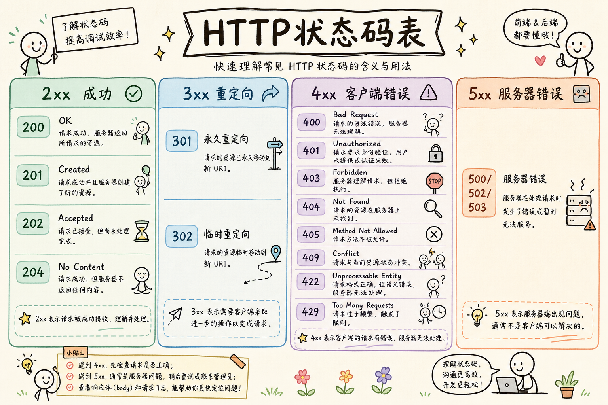

**高频组合**：创建 `201` + `Location`；删除 `204`；未登录 `401`；无权限 `403`；不存在 `404`；冲突 `409`。

### 5.3 状态码使用——正确与错误对比

```python
# ❌ 千篇一律 200
# 无论成功失败都返回 200，然后 body 里写 code 字段
HTTP/1.1 200 OK
{"code": -1, "msg": "用户不存在"}

# HTTP 自带的状态码机制被完全浪费了

# ✅ 使用正确的状态码
GET /api/users/99999
HTTP/1.1 404 Not Found
{
    "error": {
        "code": "user_not_found",
        "message": "用户 99999 不存在"
    }
}

DELETE /api/users/123
HTTP/1.1 204 No Content
# (空响应体——204 本就不需要 body)

POST /api/users
HTTP/1.1 201 Created
Location: /api/users/129
{
    "id": 129,
    "name": "新用户",
    ...
}

# 状态码用得对，前端只需看 HTTP 状态码就能判断请求是否成功
# 不需要再检查 body 里的业务 code 字段
```

### 5.4 401 vs 403 的区别

这是最容易搞混的两个状态码：

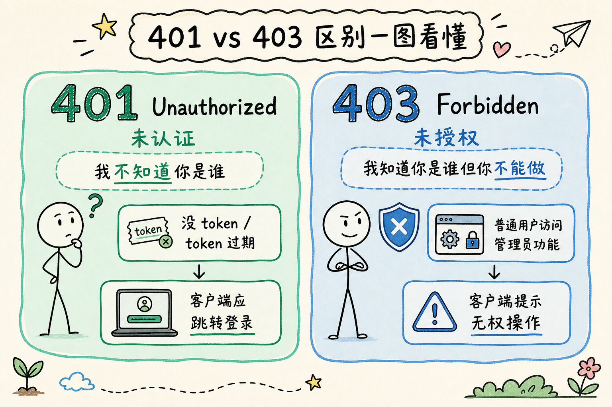


```python
# 下面是接近 FastAPI 的伪代码，重点看 401/403/404 的判断顺序，不是完整可运行程序
# from fastapi import HTTPException

def get_order(order_id, current_user):
    order = Order.find(order_id)
    if order is None:
        # 404——资源不存在（不要暴露「别人有这个订单」）
        raise HTTPException(404, "订单不存在")

    if order.user_id != current_user.id:
        # 403——你登录了，但这个订单不是你的
        raise HTTPException(403, "无权访问此订单")

    return order
```

---

## 6. 请求与响应设计

### 6.1 JSON 命名约定

```json
// ✅ 推荐：camelCase（前端友好）或 snake_case（Python 友好）
// 重要：整个 API 统一使用一种，不要混用

// 选项一：camelCase（JavaScript/前端生态喜欢）
{
    "userId": 123,
    "userName": "张三",
    "createdAt": "2024-03-15T10:30:00Z",
    "isActive": true
}

// 选项二：snake_case（Python/Ruby 生态喜欢）
{
    "user_id": 123,
    "user_name": "张三",
    "created_at": "2024-03-15T10:30:00Z",
    "is_active": true
}

// ❌ 大忌：同一个 API 里混用
{
    "userId": 123,          // camelCase
    "user_name": "张三",    // snake_case
    "createdAt": "...",    // camelCase
    "is_active": true      // snake_case
}
// 调用方同事: 🤬
```

### 6.2 统一响应格式

```json
// 成功响应——单条数据
{
    "data": {
        "id": 123,
        "name": "张三",
        "email": "zhangsan@example.com"
    }
}

// 成功响应——列表数据
{
    "data": [
        {"id": 123, "name": "张三"},
        {"id": 124, "name": "李四"}
    ],
    "pagination": {
        "page": 1,
        "page_size": 20,
        "total": 500,
        "total_pages": 25
    }
}

// 错误响应——统一格式
{
    "error": {
        "code": "validation_error",
        "message": "请求参数校验失败",
        "details": [
            {
                "field": "email",
                "message": "邮箱格式不正确"
            },
            {
                "field": "age",
                "message": "年龄必须在 0 到 150 之间"
            }
        ]
    }
}
```

> 本文采用 **`data` 包裹** 作为团队约定（类似 [JSON:API](https://jsonapi.org/) 思路），方便扩展 `pagination`、`meta` 等字段，并区分「`data` 为 null（有意义的空值）」与「请求失败无 data」。**REST 本身不强制 envelope**——直接返回资源对象 `{ "id": 1, "name": "..." }` 也常见，关键是团队统一。

### 6.3 日期时间格式

```json
// ✅ 使用 ISO 8601 格式（国际标准，所有语言都支持解析）
{
    "created_at": "2024-03-15T10:30:00Z",     // UTC 时间
    "updated_at": "2024-03-15T18:30:00+08:00"  // 带时区偏移
}

// ❌ 对外 JSON API 默认避免（人类不可读，单位/时区易混）
{
    "timestamp": 1710498600                   // 若使用，须文档标明是秒还是毫秒
}
// 日志、事件流、性能敏感内部接口仍常用 Unix 时间戳
```

### 6.4 布尔字段命名

```json
// ✅ 用 is_、has_、can_ 前缀
{
    "is_active": true,
    "is_verified": false,
    "has_paid": true,
    "can_edit": false
}

// ❌ 含义模糊的名字
{
    "active": true,       // 什么 active? 用户状态? 还是连接状态?
    "verified": false,    // 谁 verified?
    "editor": true        // 是编辑者还是「可以编辑」?
}
```

### 6.5 空值的表示

```json
// ✅ 明确表示: 不存在的字段直接不返回，值为空的用 null
{
    "name": "张三",
    "nickname": null,        // 明确: 昵称为空（没有设置昵称）
    // phone 字段压根不出现:  没有手机号字段
}

// ❌ 含义模糊
{
    "name": "张三",
    "nickname": "",          // 空字符串和 null 含义不同！
    "phone": null            // 到底是「没填」还是「不可见」?
}
// 业务约定: null = 没有值，空字符串 = 值就是空的，不返回 = 无此属性
```

---

## 7. 分页、过滤与排序

### 7.1 分页——三种主流方式

**方式一：基于页码（最常见，最易理解）**

```python
GET /api/users?page=1&page_size=20

# 响应
{
    "data": [...],
    "pagination": {
        "page": 1,
        "page_size": 20,
        "total": 500,
        "total_pages": 25
    }
}
```

**方式二：基于游标（适合实时数据、无限滚动）**

```python
GET /api/articles?cursor=eyJpZCI6MTAwfQ&limit=20

# 响应
{
    "data": [...],
    "pagination": {
        "next_cursor": "eyJpZCI6MTIwfQ",  // 下一页的游标
        "has_more": true
    }
}
```

**方式三：基于偏移量**

```python
GET /api/users?offset=40&limit=20    # 跳过前 40 条，取 20 条
```

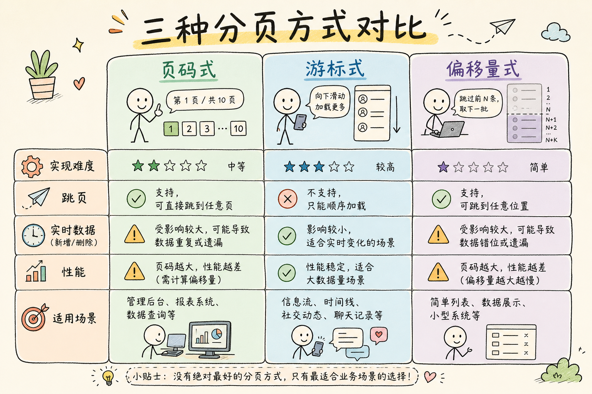

**何时不用哪种：**
- **页码分页**：后台管理、需要跳页 → 最直观；数据频繁增删时页码可能「漂移」。
- **游标分页**：无限滚动、时间线、实时流 → 不能随意跳页，实现稍复杂。
- **偏移量**：小数据集或内部工具 → 大 offset 性能差，生产列表慎用。
- 所有列表接口都应设 **最大 `limit`/`page_size`**，防止一次拉全库。

### 7.2 过滤——让查询变得灵活

```python
# 精确匹配
GET /api/users?status=active

# 范围查询
GET /api/products?price_min=100&price_max=500

# 模糊搜索
GET /api/users?search=张三

# 多值过滤
GET /api/products?category=electronics,books

# 日期范围
GET /api/orders?created_after=2024-01-01&created_before=2024-03-31

# 嵌套资源过滤
GET /api/orders?user_id=123&status=paid

# 复杂过滤（用方括号）
GET /api/users?filter[status]=active&filter[role]=admin
```

### 7.3 排序

```python
# 升序
GET /api/users?sort=created_at

# 降序（加负号或 desc）
GET /api/users?sort=-created_at
GET /api/users?sort=created_at:desc

# 多字段排序
GET /api/users?sort=-created_at,name
#  先按创建时间降序，再按名字升序
```

### 7.4 字段选择

```python
# 只返回需要的字段（减少传输量）
GET /api/users?fields=id,name,email

# 响应中只包含指定字段
{
    "data": [
        {"id": 1, "name": "张三", "email": "zhangsan@example.com"},
        {"id": 2, "name": "李四", "email": "lisi@example.com"}
    ]
}
```

---

## 8. 版本管理策略

### 8.1 为什么需要版本管理

```
你的 API 上线后，有 50 个客户在调用。
某天你要改 /api/users 的返回格式——
加了新字段、改了字段名、删了旧字段。

你发布后，50 个客户的代码全炸了。
他们冲到你的群里: 🤬🤬🤬

→ 你需要版本管理——让新旧 API 同时存在，
  老客户继续用老版本，新客户用新版。
```

### 8.2 三种版本策略

**策略一：URL 路径（最常见，最透明）**

```python
GET /api/v1/users
GET /api/v2/users
```

```
✅ 简单直观，一眼看出版本
✅ 调试方便，直接在浏览器地址栏改
⚠️ URL 路径变化；从「资源标识纯粹性」看不如 Header 干净，但是**工程上最常用的取舍**
```

**策略二：请求头（理论「最 REST」）**

```python
GET /api/users
Accept: application/vnd.myapp.v2+json
#       或
X-API-Version: 2
```

```
✅ URL 不变，资源标识更「干净」
❌ 不好调试，不能直接在浏览器里试
❌ 很多 HTTP 代理缓存时忽略 header
⚠️ 与 URL 版本都是**工程取舍**，没有绝对优劣
```

**策略三：查询参数（最轻量）**

```python
GET /api/users?version=2
```

```
✅ 简单
❌ URL 不干净，容易被人忘记加参数
❌ 一般是临时方案，不推荐长期使用
```

### 8.3 什么时候升大版本

```
需要发 v2 的信号（有破坏性变更）：

❌ 删除或重命名字段
❌ 改变字段的数据类型（string → object）
❌ 改变 URL 结构
❌ 改变错误响应格式
❌ 改变认证方式

不需要升版本（向后兼容的变更）：

✅ 添加新字段（老客户端不传就行）
✅ 添加新的 API 端点
✅ 添加新的可选查询参数
✅ 放宽验证规则
✅ 改变内部实现（不改变对外契约）

核心原则：任何会破坏现有客户端代码的变更 → 升版本
```

---

## 9. 认证与授权

**认证（Authentication）**：证明「你是谁」——登录、验 token。
**授权（Authorization）**：判断「你能不能做这件事」——角色、资源归属。

**Bearer Token**：HTTP 头 `Authorization: Bearer <token>` 里的「通行证」；客户端每次请求带上，服务端验证后识别用户。**JWT**（JSON Web Token）是 token 的一种常见格式（自包含、可验签），不是唯一选择。

### 9.1 主流认证方式

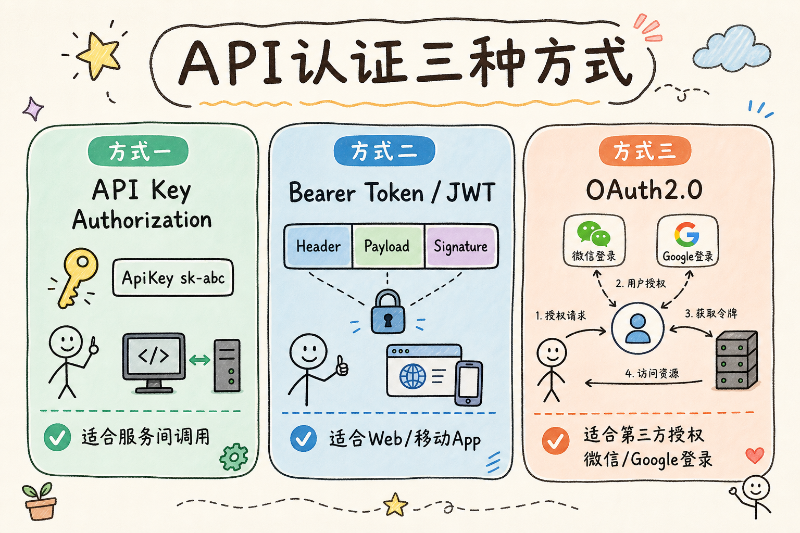

文字摘要：**API Key** 适合服务间调用；**Bearer/JWT** 适合用户登录后的 API；敏感操作还应配合 HTTPS、短过期时间与刷新 token。

### 9.2 认证失败的响应

```python
# 没有提供 token
HTTP/1.1 401 Unauthorized
WWW-Authenticate: Bearer realm="api"
{
    "error": {
        "code": "authentication_required",
        "message": "请先登录"
    }
}

# token 过期
HTTP/1.1 401 Unauthorized
{
    "error": {
        "code": "token_expired",
        "message": "登录已过期，请重新登录"
    }
}

# token 有效但没有权限
HTTP/1.1 403 Forbidden
{
    "error": {
        "code": "insufficient_permissions",
        "message": "你没有执行此操作的权限"
    }
}
```

---

## 10. 错误处理设计

### 10.1 错误响应结构

```json
// 基础错误格式
{
    "error": {
        "code": "resource_not_found",
        "message": "用户 99999 不存在",
        "request_id": "req_abc123"       // 方便排查问题时搜索日志
    }
}

// 带详细信息的校验错误
{
    "error": {
        "code": "validation_error",
        "message": "请求参数校验失败",
        "request_id": "req_abc123",
        "details": [
            {
                "field": "email",
                "message": "不是有效的邮箱地址",
                "value": "not-an-email"
            },
            {
                "field": "items[2].quantity",
                "message": "数量必须大于 0",
                "value": -5
            }
        ]
    }
}
```

### 10.2 错误码设计

```python
# 用字符串常量，不要用数字
# ❌ {"code": -1, "message": "..."}   ← -1 是什么？谁知道！
# ❌ {"code": 10001, "message": "..."} ← 10001 又是什么？
# ✅ {"code": "user_not_found", "message": "..."}

# 推荐命名规范: {资源}_{原因}
error_codes = {
    "user_not_found":          "用户不存在",
    "user_email_exists":       "该邮箱已被注册",
    "user_phone_exists":       "该手机号已被注册",

    "order_not_found":         "订单不存在",
    "order_already_paid":      "订单已支付，无法重复支付",
    "order_cannot_cancel":     "订单状态不允许取消",

    "auth_token_expired":      "登录已过期",
    "auth_token_invalid":      "无效的登录凭证",
    "auth_insufficient_role":  "角色权限不足",

    "rate_limit_exceeded":     "请求过于频繁，请稍后再试",

    "internal_error":          "服务器内部错误，请稍后再试",
}
```

### 10.3 错误状态码速查

```
要查找的资源不存在        → 404
要查找的资源存在但无权访问  → 403
请求参数格式不对          → 400
请求参数格式对但语义不对   → 422
未认证/登录过期           → 401
认证通过但权限不足         → 403
重复创建冲突              → 409
请求太多触发限流          → 429
请求体太大               → 413
请求的格式不支持          → 415
服务器内部错误            → 500
服务器暂时不可用          → 503
```

### 10.4 不要暴露内部信息

```python
# ❌ 危险——暴露了数据库结构和堆栈信息
{
    "error": {
        "message": "SQLSTATE[42S22]: Column not found: 1054 Unknown column 'usernam' in 'field list'",
        "trace": "at UserController.php:42\nat Router.php:108\n..."
    }
}

# ✅ 安全——只给必要的排查信息
{
    "error": {
        "code": "internal_error",
        "message": "服务器内部错误",
        "request_id": "req_abc123"    // 用这个 ID 去查后端日志
    }
}

# 调试时返回详细信息，生产环境脱敏
if DEBUG:
    response["error"]["debug_info"] = str(exception)
```

---

## 11. 实战：设计一个完整的 REST API

> **阅读顺序：** 建议先读完第 3–10 章。本章是 **API 设计稿**，不是可运行后端；统一约定：snake_case 字段、Bearer Token 认证、成功响应用 `data` 包裹、错误格式与分页规则沿用前文。

### 11.1 场景描述

我们来为一个**博客系统**设计完整的 REST API。需求如下：

- 用户可以注册、登录、查看/修改个人资料
- 用户可以写文章、修改文章、删除自己的文章
- 用户可以在文章下评论
- 用户可以收藏文章

### 11.2 资源模型设计

博客系统核心实体：**User、Article、Comment、Bookmark**。

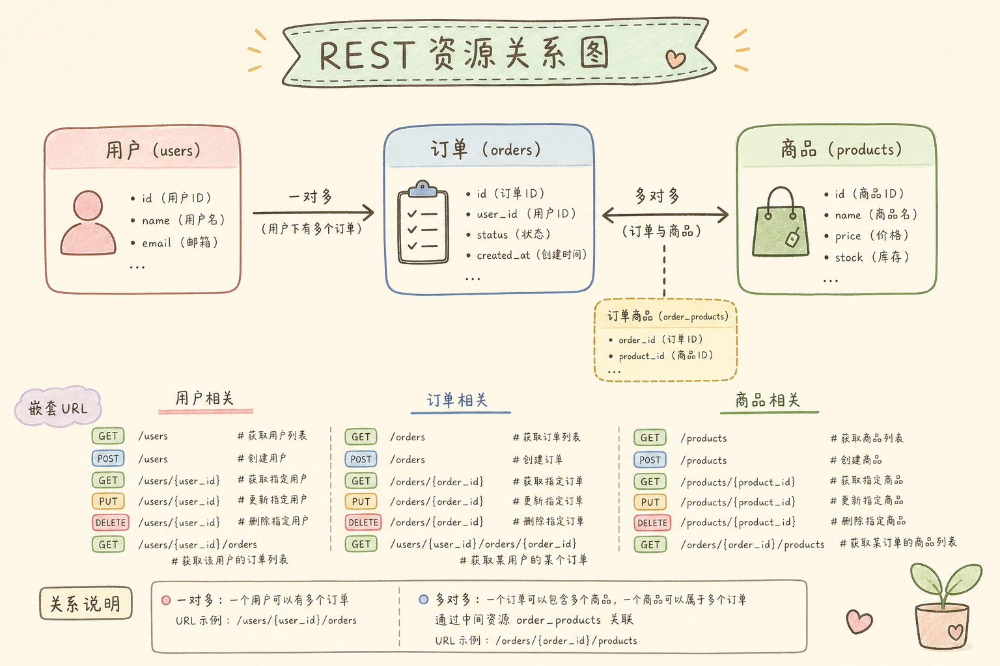

读图时注意嵌套：`/users/{id}/articles` 表示某用户的文章；`/articles/{id}/comments` 表示某文章下的评论。

### 11.3 完整 API 文档

#### 用户相关

```http
# ===== 注册与认证 =====

# 注册新用户
POST /api/v1/users
Request:
{
    "username": "zhangsan",
    "email": "zhangsan@example.com",
    "password": "SecureP@ss123"
}
Response: 201 Created
{
    "data": {
        "id": 128,
        "username": "zhangsan",
        "email": "zhangsan@example.com",
        "created_at": "2024-03-15T10:30:00Z"
    }
}

# 登录
POST /api/v1/auth/token
Request:
{
    "email": "zhangsan@example.com",
    "password": "SecureP@ss123"
}
Response: 200 OK
{
    "data": {
        "access_token": "eyJhbGciOi...",
        "token_type": "Bearer",
        "expires_in": 3600
    }
}

# 刷新 token
POST /api/v1/auth/refresh
Request:
{
    "refresh_token": "eyJhbGciOi..."
}
Response: 200 OK
{
    "data": {
        "access_token": "eyJhbGciOi...",
        "expires_in": 3600
    }
}

# ===== 用户资料 =====

# 获取当前用户资料
GET /api/v1/users/me
Authorization: Bearer eyJhbGciOi...
Response: 200 OK
{
    "data": {
        "id": 128,
        "username": "zhangsan",
        "email": "zhangsan@example.com",
        "bio": "一个热爱 Python 的程序员",
        "avatar_url": "https://cdn.example.com/avatars/128.jpg",
        "article_count": 42,
        "created_at": "2024-01-15T08:00:00Z"
    }
}

# 更新个人资料
PATCH /api/v1/users/me
Authorization: Bearer eyJhbGciOi...
Request:
{
    "bio": "Python + Go 全栈工程师",      # 只发要改的字段
    "avatar_url": "https://cdn.example.com/avatars/128_new.jpg"
}
Response: 200 OK
{
    "data": {
        "id": 128,
        "username": "zhangsan",           # 没变的字段保持不变
        "email": "zhangsan@example.com",
        "bio": "Python + Go 全栈工程师",   # 变了
        "avatar_url": "https://cdn.example.com/avatars/128_new.jpg",  # 变了
        "updated_at": "2024-03-15T11:00:00Z"
    }
}
```

#### 文章相关

```http
# ===== 文章 CRUD =====

# 获取文章列表
GET /api/v1/articles?page=1&page_size=20&sort=-created_at&status=published
Response: 200 OK
{
    "data": [
        {
            "id": 1,
            "title": "Python 异步编程完全指南",
            "summary": "这篇教程从零带你掌握 asyncio...",
            "author": {
                "id": 128,
                "username": "zhangsan",
                "avatar_url": "..."
            },
            "tags": ["python", "async", "tutorial"],
            "comment_count": 23,
            "favorite_count": 156,
            "created_at": "2024-03-14T09:00:00Z"
        }
    ],
    "pagination": {
        "page": 1,
        "page_size": 20,
        "total": 42,
        "total_pages": 3
    }
}

# 获取单篇文章（含完整内容）
GET /api/v1/articles/1
Response: 200 OK
{
    "data": {
        "id": 1,
        "title": "Python 异步编程完全指南",
        "content": "## 前言\n\n你的 Python 程序是不是经常卡在……",
        "author": {
            "id": 128,
            "username": "zhangsan"
        },
        "tags": ["python", "async", "tutorial"],
        "is_favorited": false,              // 针对当前用户的状态
        "comment_count": 23,
        "favorite_count": 156,
        "created_at": "2024-03-14T09:00:00Z",
        "updated_at": "2024-03-14T09:00:00Z"
    }
}

# 创建文章
POST /api/v1/articles
Authorization: Bearer eyJhbGciOi...
Request:
{
    "title": "我的第一篇博客",
    "content": "## 你好世界\n\n这是内容……",
    "tags": ["hello", "first"],
    "status": "published"            // draft(草稿) 或 published(发布)
}
Response: 201 Created
Location: /api/v1/articles/43
{
    "data": {
        "id": 43,
        "title": "我的第一篇博客",
        "content": "## 你好世界\n\n这是内容……",
        "author": {"id": 128, "username": "zhangsan"},
        "tags": ["hello", "first"],
        "status": "published",
        "created_at": "2024-03-15T12:00:00Z"
    }
}

# 更新文章
PUT /api/v1/articles/43
Authorization: Bearer eyJhbGciOi...
Request:
{
    "title": "我的第一篇博客（修订版）",
    "content": "## 你好世界\n\n这是修改后的内容……",
    "tags": ["hello", "first", "updated"],
    "status": "published"
}
Response: 200 OK
{
    "data": {
        "id": 43,
        "title": "我的第一篇博客（修订版）",
        ...
        "updated_at": "2024-03-15T12:30:00Z"
    }
}

# 删除文章
DELETE /api/v1/articles/43
Authorization: Bearer eyJhbGciOi...
Response: 204 No Content
```

#### 评论相关

```http
# 获取文章评论
GET /api/v1/articles/1/comments?page=1&page_size=20&sort=created_at
Response: 200 OK
{
    "data": [
        {
            "id": 500,
            "article_id": 1,
            "author": {
                "id": 256,
                "username": "lisi"
            },
            "content": "写得真好，学到了很多！",
            "created_at": "2024-03-14T10:00:00Z"
        }
    ],
    "pagination": {"page": 1, "page_size": 20, "total": 23, "total_pages": 2}
}

# 发表评论
POST /api/v1/articles/1/comments
Authorization: Bearer eyJhbGciOi...
Request:
{
    "content": "感谢分享，有一个问题请教……"
}
Response: 201 Created
Location: /api/v1/articles/1/comments/501
{
    "data": {
        "id": 501,
        "article_id": 1,
        "author": {"id": 128, "username": "zhangsan"},
        "content": "感谢分享，有一个问题请教……",
        "created_at": "2024-03-15T12:00:00Z"
    }
}

# 删除评论（只有作者本人或管理员可以删除）
DELETE /api/v1/articles/1/comments/500
Authorization: Bearer eyJhbGciOi...
Response: 204 No Content
```

#### 收藏相关

```http
# 获取我的收藏
GET /api/v1/users/me/favorites?page=1&page_size=20
Authorization: Bearer eyJhbGciOi...
Response: 200 OK
{
    "data": [
        {
            "id": 1,
            "title": "Python 异步编程完全指南",
            "author": {"id": 256, "username": "lisi"},
            "favorited_at": "2024-03-15T12:00:00Z"
        }
    ],
    "pagination": {...}
}

# 收藏文章
POST /api/v1/articles/1/favorite
Authorization: Bearer eyJhbGciOi...
Response: 201 Created
{
    "data": {
        "article_id": 1,
        "favorited_at": "2024-03-15T13:00:00Z"
    }
}

# 取消收藏
DELETE /api/v1/articles/1/favorite
Authorization: Bearer eyJhbGciOi...
Response: 204 No Content
```

---

## 12. 常见反模式与最佳实践

### 12.1 REST API 十大反模式

```
反模式 1: URL 里塞动词
❌ POST /api/users/create
✅ POST /api/users

反模式 2: 所有状态都返回 200
❌ 错误也返回 200 + {"success": false}
✅ 用正确的 HTTP 状态码

反模式 3: 响应只用顶级字段，不用 data 包裹
❌ {"id": 1, "name": "张三"}
✅ {"data": {"id": 1, "name": "张三"}}
(用 data 包裹后，可以安全地加 pagination、meta 等扩展字段)

反模式 4: GET 请求修改数据
❌ GET /api/articles/read?id=1    (标记为已读)
✅ POST /api/articles/1/read

反模式 5: 敏感资源暴露可枚举 ID 且无鉴权
❌ GET /api/orders/1001  订单号可被遍历，且未校验归属
✅ 递增 ID 可以（如公开文章 /articles/42），但须配合鉴权、防遍历、限流
✅ 高敏感资源可用 UUID / 雪花 ID，降低被猜测的概率

反模式 6: 响应嵌套太深
❌ {"data": {"user": {"profile": {"address": {"city": "北京"}}}}}
✅ {"data": {"user_id": 1, "city": "北京"}}
(扁平化优于深层嵌套，或者至少控制在 3 层以内)

反模式 7: 字段命名不一致
❌ {"user_id": 1, "userId": 2, "user_name": "张三", "fullName": "张三丰"}
✅ 整个代码库使用一种命名风格

反模式 8: 不提供分页的列表接口
❌ GET /api/users → 返回全部 500 万条数据
✅ GET /api/users?page=1&page_size=20

反模式 9: 在 URL 里传敏感信息
❌ GET /api/users?token=eyJhbGciOi...&password=secret
(URL 会出现在服务器日志、浏览器历史、referer 头中)
✅ 敏感信息放在请求头或请求体中

反模式 10: 不设置请求频率限制
❌ 用户可以无限制调 POST /api/send-sms → 被刷爆
✅ 加 Rate Limiting，敏感接口更要严格限制
```

### 12.2 检查清单

```
设计新 API 时，逐条打勾：

□ URL 只用名词（复数），不用动词
□ URL 全部小写，单词间用连字符
□ 正确使用了 GET/POST/PUT/PATCH/DELETE 方法
□ 每种情况都返回了合适的状态码（不是全 200）
□ 成功响应用 data 字段包裹
□ 错误响应有统一的格式和错误码
□ 列表接口有分页
□ 分页、排序、过滤参数命名一致
□ 日期时间用 ISO 8601 格式
□ 有认证机制（至少 Bearer Token）
□ 有请求频率限制
□ 敏感信息不通过 URL 传递
□ 不暴露数据库内部结构
□ 字段命名风格统一
□ API 有版本号
□ 接口文档和代码同步
```

---

## 13. REST vs GraphQL vs gRPC

**何时不必用 REST：** 前端强定制、多端字段差异大 → 可考虑 GraphQL；服务间高性能、强类型 RPC → 可考虑 gRPC；简单公开 HTTP API、要缓存与调试友好 → REST 仍是默认首选。

### 13.1 横向对比

三种风格在**协议、类型系统、客户端灵活性**上差异明显。


**直觉**：对外公开 API → REST；BFF 灵活选字段 → GraphQL；内部微服务低延迟 → gRPC。

### 13.2 选型决策树

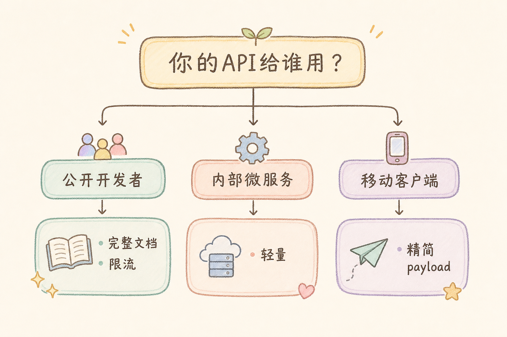

文字版决策摘要：
- **公开 HTTP API / 移动端 / 第三方集成** → REST
- **前端要灵活选字段、减少往返** → GraphQL
- **内部微服务、低延迟、强类型** → gRPC
- **不确定** → 先 REST，遇到明确痛点再评估迁移成本

> REST 依然是最安全、最通用的选择。不要因为 GraphQL 或 gRPC 听起来更「高级」就贸然选择——REST 的简单性和 HTTP 原生的缓存能力在很多场景下是巨大优势。

---

## 14. 总结

### 14.1 常见问题（FAQ）

**Q：PUT 和 PATCH 怎么选？**
全量替换、客户端能发完整资源 → PUT；只改几个字段 → PATCH（更常见）。

**Q：401 和 403 区别？**
401 = 没登录或 token 无效；403 = 已登录但无权访问该资源。

**Q：400 和 422 区别？**
400 = JSON 格式错、缺必填字段；422 = 格式对但语义不对（如邮箱格式非法、数量为负）。

**Q：成功响应必须用 `data` 包裹吗？**
REST 不强制；本文推荐团队统一 envelope，便于扩展分页与 meta。

**Q：DELETE 第二次返回 404 算失败吗？**
对客户端可能是 404，但 DELETE 仍幂等——资源最终状态都是「不存在」。

### 核心原则速记

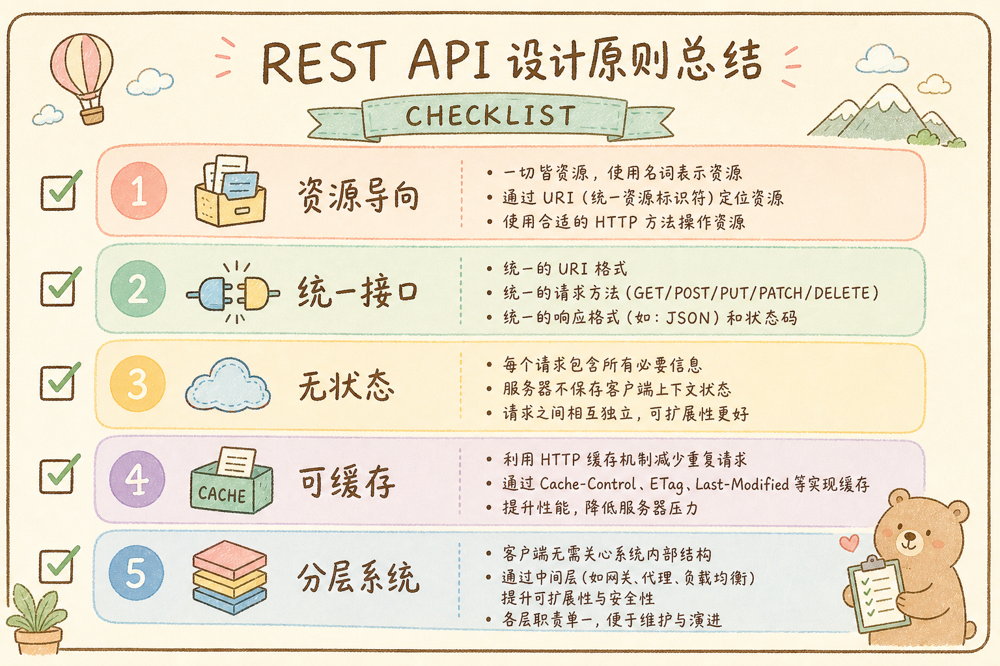


### 一句话总结

> **REST API 不是高深的理论，而是一套「可预测」的约定。当你把一切看作「资源」，用 URL 定位它们，用 HTTP 方法操作它们，用状态码表达结果——调用方不需要翻文档就能猜到下一个接口怎么用。这就是好的 API 设计。**

---

> **延伸阅读：**
> - [Microsoft REST API Guidelines](https://github.com/microsoft/api-guidelines)——微软的 API 设计规范，非常详尽
> - [Google API Design Guide](https://cloud.google.com/apis/design)——Google Cloud 的设计指南
> - [Zalando RESTful API Guidelines](https://opensource.zalando.com/restful-api-guidelines/)——欧洲电商 Zalando 的开放规范
> - [HTTP 状态码速查](https://httpstatuses.io/)——一个简洁的状态码参考网站
> - [JSON:API 规范](https://jsonapi.org/)——如果你想要一套开箱即用的 JSON API 格式标准
> - [Roy Fielding 的博士论文](https://www.ics.uci.edu/~fielding/pubs/dissertation/top.htm)——REST 的源头，建议先读本教程再看
