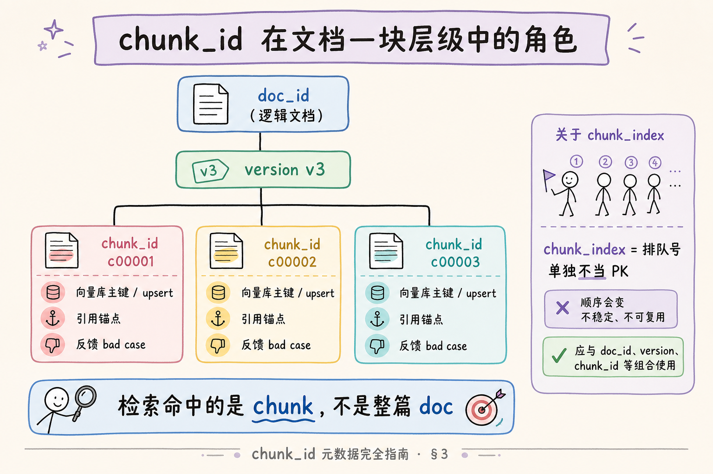
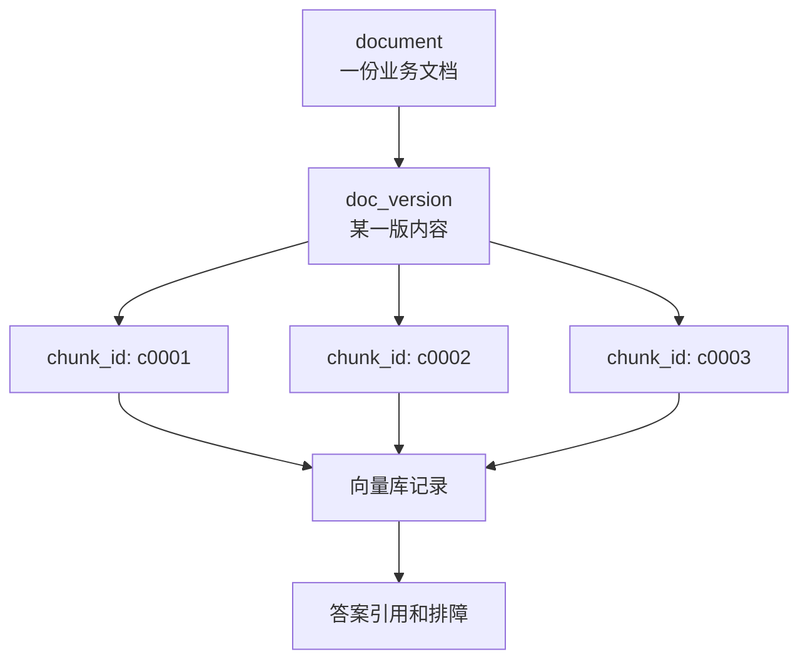
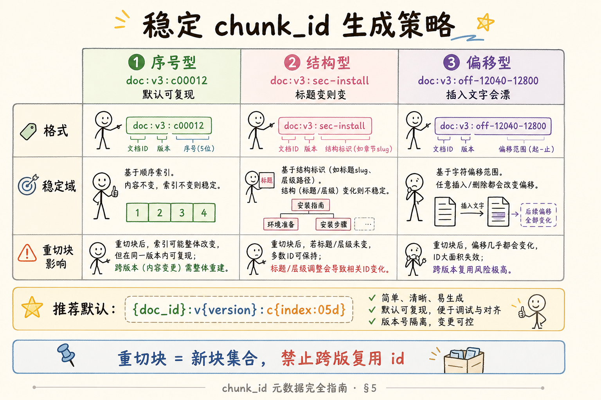
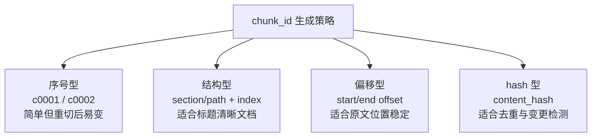
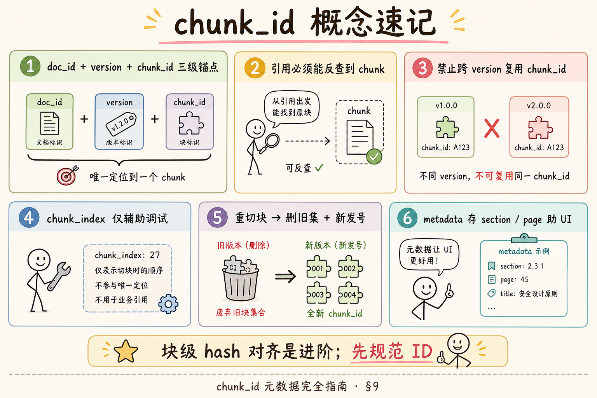
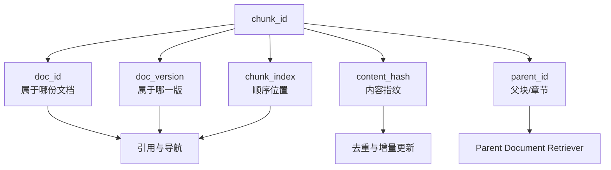

# RAG 数据采集与解析（十三）：chunk_id 元数据完全指南

> 检索命中了一段话，前端要高亮「第几段」、运维要删「改版后失效的旧块」、评测要比对「同一 chunk 两次入库是否一致」——若你只有 `doc_id + 序号 0..n`，一旦 **重切块** 或 **插入新段**，序号整体错位，引用全库过时。`chunk_id` 是 **块级稳定身份**（在约定边界下），与 [50 doc_id](50.metadata-doc-id-tutorial.md) 构成 **文档—块** 两级主键。这篇是 [企业 RAG 路线图](ENTERPRISE_RAG_ROADMAP.md) **C 轨第十三篇**（路线图第 **58** 条），讲清 **chunk_id 与 doc_id 关系**、**稳定可复现** 的生成规则、**引用溯源** 契约，以及 **重切块后 ID 策略**。前置：doc_id、 [48 版本](48.doc-versioning-tutorial.md)、 [49 增量](49.incremental-update-tutorial.md)、路线图 **69** 分块。

---

## 目录

1. [前言：命中了哪一段，必须说得清](#1-前言命中了哪一段必须说得清)
2. [本文边界与动手路径](#2-本文边界与动手路径)
3. [chunk_id 扮演什么角色](#3-chunk_id-扮演什么角色)
4. [与 doc_id、version 的关系](#4-与-doc_idversion-的关系)
5. [稳定可复现：生成规则设计](#5-稳定可复现生成规则设计)
6. [引用溯源：从检索到 UI](#6-引用溯源从检索到-ui)
7. [重切块后的 ID 策略](#7-重切块后的-id-策略)
8. [先错对对：纯序号与跨版复用](#8-先错对对纯序号与跨版复用)
9. [综合概念地图](#9-综合概念地图)
10. [常见陷阱与 FAQ](#10-常见陷阱与-faq)
11. [总结与系列下一步](#11-总结与系列下一步)

---

## 1. 前言：命中了哪一段，必须说得清

RAG 引用不是「出自某 PDF」就够——用户要核对 **哪一节、哪一段**；工程师要 **按 chunk 删除、更新、评测**。  
若 metadata 只有：

```json
{"doc_id": "policy-travel", "chunk_index": 12}
```

会出现：

- 切块长度从 500 改 800 → index 12 **指向另一段文字**。  
- 文档开头插入新章节 → 后面 index **整体平移**。  
- 同一 version 重跑任务 → index 相同但 embedding 输入变了，**溯源对不上**。

**chunk_id**（Chunk Identifier，块标识符）：在 `doc_id`（及通常 `version`）语境下，唯一标识一个 **文本块** 的字符串，用于向量库主键、引用、日志与评测对齐。  
通俗说：**书中某一页的某一段，有独立页签号**。

**读完本文，你应该能做到：**

1. 说明 `chunk_id` 与 `doc_id`、`version`、`chunk_index` 的分工。  
2. 设计一种 **可复现** 的 chunk_id 生成规则（含 version 编入）。  
3. 描述引用 API 应返回哪些字段支持 UI 高亮。  
4. 在 **重切块、升版本、改分块参数** 时选对 ID 策略。  
5. 指出纯序号与跨版复用 chunk_id 的事故模式。

---

## 2. 本文边界与动手路径

**档位：地基篇（C1 元数据核心）。**

**本文讲：** chunk_id 角色、层级关系、生成规则、溯源、重切块策略、误用案例。  
**本文不讲：** 子句级 span 对齐、LayoutLM 字符 offset、多模态图块 ID、GraphRAG 实体节点 ID。

本篇会明确回答五个基础问题：`chunk_id` 是什么、有什么用、解决了什么问题、在项目里怎么用、常见用法和误用分别是什么。

### 2.1 动手路径表

| 步骤 | 你做什么 | 验收 |
|------|----------|------|
| A | 打开你们向量库任一条 metadata | 是否有 chunk_id |
| B | 读 §4～§5，写一条生成公式 | 含 doc_id+version |
| C | 读 §6，草绘引用 JSON | 含 snippet、page |
| D | 读 §7，模拟「chunk_size 变大」 | 说旧 chunk 怎么处理 |
| E | 完成 §8 先错对对 | 两种错法 |

### 2.2 与路线图前后条的关系

| 条目 | 关系 |
|------|------|
| 路线图 **57** doc_id | chunk_id 从属于 doc_id |
| 路线图 **55** version | 新版块必须新 chunk_id |
| 路线图 **56** 增量 | 更新 doc 时按 doc_id 删旧 chunk 集合 |
| 路线图 **59** source/page | 定位字段补充 chunk_id |
| 路线图 **69** 分块 | 分块算法变 → ID 策略要跟着变 |

---

## 3. chunk_id 扮演什么角色
先把 chunk_id 想成“每一小段知识的身份证”。RAG 系统检索到的不是整份文档，而是文档里被切出来的 chunk；chunk_id 的作用，就是让系统能稳定地说清楚“命中的是哪一段、来自哪一版、后续要更新或追责哪一条记录”。

### 3.1 三个用途

| 用途 | 说明 |
|------|------|
| 向量库主键 | upsert/delete 精确到块 |
| 引用锚点 | UI、日志、评测说「就是这一段」 |
| 增量对账 | 块级 hash 对账（进阶），文档级不够用时 |

**Chunk**（文本块）：分块策略把文档切成的检索单元，介于整篇与单句之间。  
通俗说：** RAG 检索时的「一页纸一块」**。

读下图，看 chunk_id 在 doc 之下的位置。




下面这张图把 `chunk_id` 放回“文档-版本-块”的层级里看。读图时重点看：`chunk_id` 不是随便编号，而是让每个检索命中的片段都能被稳定追溯。



结论：没有稳定的 `chunk_id`，你只能知道“检索命中了某些文本”，却很难知道它来自哪份文档、哪一版、哪一块。

对照上图：

**Document-Chunk Hierarchy**（文档—块层级）：一篇逻辑文档含多个 chunk；检索命中的是 chunk 而非整 doc。  
通俗说：**一本书拆成若干卡片检索，每张卡片有自己的编号**。

**chunk_index**（块序号）：从 0 开始的遍历顺序，**便于调试**，不宜单独当全局主键。  
通俗说：**排队号码**——队伍重组后号码会变。

### 3.2 与向量主键的关系

部分向量库用 **自增 id** + metadata 存 chunk_id；有的允许 **自定义 id**。  
原则：**业务逻辑认 chunk_id**；库内自增 id 只是实现细节。

```python
vector_store.upsert(
    ids=[chunk.chunk_id],  # 业务主键
    embeddings=[vec],
    metadatas=[{**chunk_meta}],
)
```

这段代码演示的是“把业务主键交给向量库”。即使某些向量库内部还有自增编号，排障、删除、引用、评测都应围绕 `chunk_id` 展开，而不是围绕库内部行号展开。

---

## 4. 与 doc_id、version 的关系
doc_id、version、chunk_id 是三级定位：doc_id 说明是哪份文档，version 说明是哪一版，chunk_id 说明是哪一段。初学者最容易犯的错，是只给 chunk 编一个流水号；一旦文档改版或重新切块，流水号就会失去上下文。

### 4.1 层级公式（概念）

下面这四行不是代码，而是定位层级。读的时候按“哪份文档 → 哪个版本 → 哪一块 → 第几个块”的顺序理解。

```text
doc_id        → 哪份逻辑文档
version       → 哪一版内容
chunk_id      → 这一版里的哪一块
chunk_index   → 块在遍历中的顺序（辅助）
```

结论：`chunk_index` 只能说明遍历顺序，不能单独承担身份；真正能跨引用、日志和反馈流转的是 `chunk_id`。

推荐唯一性约束：

```text
UNIQUE (doc_id, version, chunk_id)
# 或 chunk_id 全局唯一字符串，已编码 doc_id+version
```

### 4.2 为何 chunk_id 应编入 version

[48 版本篇](48.doc-versioning-tutorial.md) 强调：**不要跨版本复用 chunk_id**。  
制度 v2 的第 3 块与 v3 的第 3 块 **不是同一段话**——若 chunk_id 都是 `policy-travel:c00003`，溯源与删除会串版。

推荐模式：

下面这个公式把 `doc_id`、`version` 和块序号都编码进 ID。初学者可以先采用它作为默认方案，等遇到标题型文档或超长 ID 再考虑结构型或 hash 压缩。

```text
chunk_id = f"{doc_id}:v{version}:c{chunk_index:05d}"
# 例：policy-travel-expense:v3:c00012
```

**Version-scoped Chunk**（版本作用域块）：chunk 身份在某一 `version` 内有效；升版即新块集。  
通俗说：**新版书重新分页，页码不和旧版共用**。

### 4.3 content_hash 与块级 hash（进阶）

文档级 `content_hash` 不够定位「哪块变了」。可对每块算：

下面的 `block_hash` 不是用来替代 `chunk_id`，而是用来判断“这一块文本内容是否变化”。ID 负责定位，hash 负责对比。

```text
block_hash = sha256(normalize(chunk.text))
```

用于 **块级增量**（只重 embed 变块）——chunk_id 仍建议含 version+index，block_hash 放 metadata 作对比。

---

### 4.4 一对多：Parent Chunk 与 Child Chunk

长文检索常用 **小块检索、大块生成**（Parent-Document Retrieval）。

| 层级 | chunk_id 建议 |
|------|----------------|
| Parent | `doc:v3:c00012:parent` |
| Child | `doc:v3:c00012:s00`, `s01` … |

子块命中后，把 parent 文本送 LLM。  
**禁止** 子块与父块共用同一 id 又不加后缀——upsert 会互相覆盖。

### 4.5 表格、代码块等「不可拆」单元

Markdown 代码围栏、PDF 表格行常被 **整段进一块**。此时 `section` 或 `block_type=code` 比 index 更能表达语义。  
若代码块必须完整，chunk_id 仍用序号，但 metadata 标 `atomic=true`，增量时 **整段替换** 不拆行。

## 5. 稳定可复现：生成规则设计

**Stable & Reproducible**（稳定可复现）：相同 `doc_id + version + 分块参数 + 源文本`，多次跑 pipeline 得到 **相同 chunk 边界与 chunk_id 集合**。  
通俗说：**同一规则切同一本书，每次切出来的卡片编号一致**。

### 5.1 影响复现的因素

| 因素 | 变了会怎样 |
|------|------------|
| chunk_size / overlap | 边界变，必须 **新 version 或新 chunk 世代** |
| 分块算法（按字 vs 按标题） | 边界变 |
| 清洗规则 | 文本变，边界变 |
| 解析器升级 | 页码/结构变 |

**Chunk Generation**（分块世代）：用 `chunker_version` 或 bump `version` 标记「切块规则变更是新版本」。  
通俗说：**换了一种剪刀裁纸，要算新一版裁剪**。

### 5.2 三种生成策略

| 策略 | 格式示例 | 稳定域 |
|------|----------|--------|
| 序号型 | `doc:v3:c00012` | 同 version 同参数可复现 |
| 结构型 | `doc:v3:sec-install:para-2` | 依赖标题 slug 稳定 |
| 偏移型 | `doc:v3:off-12040-12800` | 用字符起止偏移 |

**Structure-based ID**（结构型 ID）：从标题路径生成，如 `## 安装` → `sec-install`。  
通俗说：**按章名贴标签，不只看第几块**。

**Offset-based ID**（偏移型 ID）：用规范化全文中的 `[start,end)` 字符区间。  
通俗说：**从第几个字到第几个字**——文本插入后偏移变，需配合 version。

读下图，对比序号型与结构型在重切块时的行为。




下面这张图对比三类常见 `chunk_id` 生成方式。读图时重点看：稳定性来自“同一份内容重复处理后仍能生成同样 ID”。



结论：企业 RAG 常把 `doc_id + version + chunk_index/hash` 组合使用，既便于排序，也便于排查重建索引后的变化。

对照上图：

### 5.3 推荐默认（企业地基）

下面是最小可用的生成函数。它假设你已经在分块阶段拿到了稳定的 `doc_id`、`version` 和从 0 开始或从 1 开始的块序号。

```python
def make_chunk_id(doc_id: str, version: int, index: int) -> str:
    return f"{doc_id}:v{version}:c{index:05d}"
```

如果输入 `("policy-travel-expense", 3, 12)`，输出就是 `policy-travel-expense:v3:c00012`。这类 ID 既方便人读，也方便日志搜索。

同时在 metadata 存：

```json
{
  "chunk_id": "policy-travel-expense:v3:c00012",
  "doc_id": "policy-travel-expense",
  "version": 3,
  "chunk_index": 12,
  "section": "住宿标准",
  "heading_path": ["差旅制度", "住宿标准"],
  "page_start": 4,
  "page_end": 4,
  "char_start": 12040,
  "char_end": 12800
}
```

`section` / `heading_path` / `page_*` **不参与主键** 亦可，但强烈建议存——UI 高亮与人工排障靠它们。

### 5.4 向量库 id 长度限制

部分库限制 id 长度（如 512 字节）。`doc_id` 过长时可用：

```text
chunk_id = sha256(f"{doc_id}|{version}|{index}")[:32]
```

metadata 仍存完整 `doc_id`；**不要** 只留 hash 让人无法读。

---

## 6. 引用溯源：从检索到 UI
引用溯源的核心问题是：模型回答里那句“住宿上限 500 元”到底来自哪一段原文。chunk_id 不只在后端检索时有用，也会一路传到引用卡片、用户反馈和评测日志里，让每一次回答都能回查到具体证据。

### 6.1 检索命中 → 引用对象

下面的结构体代表一次检索命中。注意它同时保留 `chunk_id`、`doc_id`、`version` 和原文 `text`：引用能不能追溯，取决于这些字段是否从检索层一路传到生成层。

```python
@dataclass
class RetrievalHit:
    chunk_id: str
    doc_id: str
    version: int
    score: float
    text: str
    metadata: dict
```

有了这个对象，系统既能把 `text` 塞进 prompt，也能把 `chunk_id` 留给引用、反馈和评测。

生成引用时 **原样带出 chunk_id**，LLM  cite 标记建议用短号映射：

```text
资料 [1] 来自 chunk policy-travel-expense:v3:c00012 …
```

**Citation**（引用）：告诉用户答案依据哪段来源；必须能反查到 chunk 与文档。  
通俗说：**脚注要能翻到原页**。

### 6.2 前端展示字段

前端不一定把 `chunk_id` 展示给普通用户，但必须在内部状态里保留它。用户看到的是标题、章节、页码和 snippet；工程师需要的是能定位原始 chunk 的键。

| 字段 | 用途 |
|------|------|
| `title` | 文档名 |
| `version_label` | 用户可读版本 |
| `section` / `heading_path` | 章节导航 |
| `page_start` | PDF 跳页 |
| `snippet` | 摘要高亮 |
| `chunk_id` | 内部定位、反馈 bad case |
| `deep_link` | CMS 锚点（若有） |

### 6.3 用户反馈闭环

用户点「这段不对」应上报 `chunk_id` + `query_id`，运维可：

1. 在向量库拉该 chunk 全文；  
2. 对照源文件该页；  
3. 判断是 **解析、切块还是检索排序** 问题。

没有 chunk_id，只能猜「大概是差旅制度某一页」——无法闭环。

### 6.4 与会话缓存

长对话可缓存已检索 chunk 列表（按 chunk_id 去重）。  
文档改版后，旧 chunk_id 在库中 `is_latest=false` 或已删除——会话应检测 **失效引用** 并提示重新检索。

---

### 6.5 引用 UI 高亮：有 offset 更好

若前端能打开 PDF.js 或 HTML 锚点，metadata 提供：

```json
{
  "char_start": 12040,
  "char_end": 12800,
  "quote": "一线城市住宿上限 500 元/晚"
}
```

`quote` 用于在页面内 **子串高亮**；`chunk_id` 用于后端聚合反馈。  
没有 offset 时，只能展示整段 snippet，体验仍可用，但精确定位弱。

### 6.6 多模态预留（了解）

若 chunk 含图片 caption，可扩展 `chunk_id` 不变，metadata 加 `modalities: ["text","image"]` 与 `image_uri`。  
地基篇仍以 **文本块** 为主；id 规则先按文本定，别为图片单独造一套无 doc_id 的 id。

### 6.7 流式回答中的引用稳定性

流式 SSE 输出时，引用编号 `[1]` 应在 **检索完成瞬间** 固定映射到 `chunk_id`，不要等生成结束再猜。否则模型重述资料时 cite 序号可能漂移，用户看到的 `[1]` 与真实证据对不上。

```python
citations = {i+1: hit.chunk_id for i, hit in enumerate(hits)}
stream_llm(..., citation_map=citations)
```

这段代码的含义是：先把短编号和真实 `chunk_id` 绑死，再启动流式生成。后续无论模型怎么组织语言，引用编号都不会重新洗牌。

### 6.8 多 chunk 合并进上下文

当 `top_k=8` 的多段资料一起塞进提示词，建议在每段前面写清楚短编号、`chunk_id` 和用户可读位置：

```text
[1] chunk_id=policy-travel-expense:v3:c00004 (第4页 住宿标准)
一线城市住宿上限 500 元/晚…
```

这样做的好处是双向的：模型回答时能引用 `[1]`，评测脚本也能用字符串匹配检查事实是否真的来自对应 chunk。

### 6.9 无效 chunk 处理

检索命中 `chunk_id` 在库中已删或已过期时，API 应明确返回失效错误，而不是继续展示旧 snippet：

```json
{"error": "citation_stale", "chunk_id": "...", "message": "资料已更新，请重新提问"}
```

不要静默展示旧 snippet——那是 **静默幻觉** 的一种。更稳妥的做法是重新检索最新版本，或提示用户当前资料已更新。

## 7. 重切块后的 ID 策略

**Re-chunking**（重切块）：不改变源文件，但改变 chunk 边界或算法。  
**Re-indexing**（重索引）：内容或版本变，重新 embed 入库。

### 7.1 决策树

```text
仅重 embed（边界不变）？
  → 是：chunk_id 可不变，覆盖向量值
  → 否：边界变？
      → 是：新 chunk 集合 + 新 chunk_id
          → 内容也变？升 version（48 篇）
          → 仅算法变？升 version 或 chunker_version，删旧块
```

### 7.2 操作清单（边界变化）

1. bump `version` 或 `chunker_version`（与产品约定「对用户是否算新版」）。  
2. [49 增量](49.incremental-update-tutorial.md)：`delete_vectors(filter={doc_id, is_latest})` 或按旧 version 删。  
3. 生成新 `chunk_id` 集合，**禁止** 复用旧 id。  
4. 更新 `document_catalog.content_hash` 与 `is_latest`。  
5. 跑评测对比 **召回与引用偏移**。

### 7.3 块级增量（可选进阶）

若块边界算法稳定，仅 **少数块文本变**（如单页 PDF 替换）：

- 对每块算 `block_hash`；  
- hash 变的那几块：删 `chunk_id` → 重嵌 → 插入；  
- 不变块：**跳过 embed**，省 API。

这需要 **页级或结构级切分**，地基篇先掌握 **文档级增量 + 全块新 id**。

### 7.4 与评测集对齐

评测集常存「金标 chunk 文本」。改版后应用 **doc_id+version+chunk_index** 或 **block_hash** 对齐；  
若只对文本 exact match，改版后需 **重新标注** 或写对齐脚本。

---

## 8. 先错对对：纯序号与跨版复用
下面这些错误看起来都很小：少拼一个 version、复用一个序号、把页码当主键。但在真实系统里，它们会让旧文档、新文档和相邻 chunk 混在一起，最终表现成“引用对不上”或“明明改了制度，答案还是旧的”。

### 8.1 错法一：全局 `chunk_index` 当 chunk_id

**现象：** `chunk_id = str(index)`，跨文档不唯一，跨运行不稳定。  
**对法：** 编入 `doc_id` + `version`；index 仅辅助。

### 8.2 错法二：跨 version 复用 `doc:c00012`

**现象：** v3 覆盖写入 `policy:c00012`，v2 同名块仍在库。  
**后果：** 检索混版；删除 v3 误伤 v2。  
**对法：** `policy:v3:c00012`；删时带 version filter。

### 8.3 错法三：重切块不删旧 chunk

**现象：** 切块参数变了，新 index 写入，旧 index 残留。  
**后果：** 同一 doc 两套块共存，答案重复或矛盾。  
**对法：** 变更切块参数 = 新版本；删旧版全部 chunk_id。

### 8.4 错法四：chunk_id 不含 doc_id 却全局 upsert

**现象：** 多租户共用 `c00001`。  
**对法：** 至少 `tenant:doc:version:chunk` 四级；或 chunk_id 全局 UUID 但 metadata 必含 doc_id。

---

## 9. 综合概念地图

读下图时，先看「chunk_id 元数据概念速记」想表达的主线：它把本节的概念关系压缩成一张可对照的图。




下面这张概念地图总结 `chunk_id` 相关字段。读图时重点看：`chunk_id` 要和版本、来源、父子块关系一起设计。



结论：`chunk_id` 是检索结果的身份证。它同时服务引用跳转、索引重建、增量更新和 bad case 复盘。

对照上图：`doc_id` 定文档，`version` 定版次，`chunk_id` 定块；引用与删除都认这套层级。

### 9.1 速记表

| 概念 | 一句话 |
|------|--------|
| chunk_id | 块级唯一身份 |
| doc_id | 父级逻辑文档 |
| version | 编入 chunk_id 防串版 |
| chunk_index | 辅助序号，单独不当 PK |
| 重切块 | 新边界 → 新 chunk_id 集 |
| 引用 | 必须能反查 chunk_id |

---

### 9.2 chunk 过大过小与 ID 无关但常一起出现

| 症状 | 调 chunk 还是调 id |
|------|-------------------|
| 检索命中很长一段 | 调 chunk_size |
| 引用无法精确定位 | 加 section/offset metadata |
| 改版后引用全挂 | 调 version + 新 chunk_id |

ID 设计正确 **不能救** 切块过大；但切块变了 **一定** 要新 id。

### 9.3 与路线图 59 source/page 的拼接

完整引用展示串示例：

```text
《差旅制度》2025-Q2 版 · 第 4 页 · 住宿标准 · chunk policy-travel-expense:v3:c00012
```

用户看前半；工程师复制最后一截进工单。

## 10. 常见陷阱与 FAQ

1. **chunk 太短** —— ID 再完美也救不了语义残缺；先调分块（路线图 69）。  
2. **重叠区 overlap** —— 相邻块重复文本，引用时两段都命中；overlap 不进 chunk_id，用 index 区分即可。  
3. **多语言混排** —— char_start 基于规范化 UTF-8 字节或 codepoint，规则要写死。  
4. **仅存 page 不存 chunk_id** —— 一页多段时无法精确定位。  

**Q：chunk_id 要给用户看吗？**  
A：一般隐藏，展示 `section`+`page`；反馈工单可带 chunk_id 给工程师。

**Q：Parent-Child / Small-to-Big 怎么编 ID？**  
A：子块 `...:c00012:sub00`，父块 `...:c00012:parent`；或子块独立 index，metadata 存 `parent_chunk_id`。

**Q：删除文档时 chunk_id 要逐条记吗？**  
A：不必若向量库支持 `delete filter doc_id`；catalog 可选缓存 chunk_id 列表做审计。

**Q：和 Elasticsearch `_id` 关系？**  
A：可直接用 chunk_id 作 `_id`，方便 GET by id。

**Q：重嵌同一块，id 不变可以吗？**  
A：可以——边界与文本同，仅换 embedding 模型时，覆盖同 chunk_id 向量即可。

---

### 10.5 切块参数变更演练

**初始**：`chunk_size=500, overlap=50`，`policy-travel:v2` 共 42 块。  
**调整**：改为 `chunk_size=800`（路线图 69 调优）。  
**正确操作**：

1. `version` 升到 3（或 `chunker_version=2` 若业务认定不算新制度版）；  
2. `delete_vectors(doc_id, version=2)` 或删全部 is_latest；  
3. 新块 `policy-travel:v3:c00001..c00028`；  
4. 跑 20 条 golden query 对比引用偏移。

**错误操作**：直接重跑切块脚本，id 仍 `c00001` 但文本变了——用户反馈「引用对不上」。

### 10.6 chunk_id 在评测集中的存法

评测集里不要只存“正确答案文本”，还要存这道题应该命中的 `gold_chunk_ids`。这样检索升级后，即使最终答案看起来差不多，也能判断系统是否仍然找到了正确证据。

```json
{
  "query_id": "q-012",
  "question": "上海住宿上限？",
  "gold_chunk_ids": ["policy-travel-expense:v3:c00004"],
  "gold_answer": "500 元/晚"
}
```

回归时检查 **top_k 是否含 gold_chunk_id**，比只比对最终答案更利于定位 **检索 vs 生成** 问题。

### 10.7 与 Grounding 引用格式（路线图 41）

LLM 输出 `[1]` 时，映射表：

```json
{
  "1": {
    "chunk_id": "policy-travel-expense:v3:c00004",
    "doc_id": "policy-travel-expense",
    "quote": "一线城市住宿上限 500 元/晚"
  }
}
```

**Grounding** 要求生成句子的每个事实能指向 chunk；没有 chunk_id，映射表只能写「某 PDF 某一页」——评测 attribution 会失败。

### 10.8 块级反馈闭环示例

用户点击「这段引用有误」→ 上报：

```json
{
  "chunk_id": "policy-travel-expense:v3:c00004",
  "query": "上海住宿标准",
  "session_id": "sess-9f2a"
}
```

工程师 SQL：`SELECT text, page FROM chunks WHERE chunk_id = '...'` → 对照源 PDF 第 4 页 → 判断是 OCR 错字还是切块切断 → 针对性修 parser 或 chunker。  
**闭环天数** 从「猜」变成「半天」——这是 chunk_id 的隐藏 ROI。

### 10.9 重叠（overlap）区的 id 与引用

相邻块 overlap 50 字时，同一句可能出现在 `c00012` 与 `c00013`。  
引用时 **去重展示**；反馈时记录 **实际命中的 chunk_id**。  
评测 attribution 应用 **命中块** 的 id，不要用 parent 代替。

### 10.10 结构型 id 示例：Markdown

`docs/install/docker.md` 按 H2 切：

```
policy-travel:v3:sec-docker-install
policy-travel:v3:sec-docker-troubleshoot
```

标题 slug 用稳定 ASCII；中文标题转拼音或 CMS anchor id，避免手写汉字进 id。

### 10.11 向量库 id 长度超限的折中

当 `doc_id` 很长、标题路径也很长时，向量库主键可能超过长度限制。折中做法是把机器主键压短，但在 metadata 里保留完整可读字段。

```python
import hashlib

def compact_chunk_id(doc_id: str, version: int, index: int) -> str:
    raw = f"{doc_id}|v{version}|c{index}"
    return "chk_" + hashlib.sha256(raw.encode()).hexdigest()[:24]
```

metadata **必须** 冗余完整 `doc_id, version, chunk_index` 供人读。

### 10.12 读路径自检

1. chunk_id 为什么要编入 version？  
2. 重切块后能否保留旧 chunk_id？  
3. 用户反馈应上报什么字段？

### 10.13 三种 ID 策略实战对比表

| 场景 | 推荐 chunk_id 形态 |
|------|-------------------|
| 固定 chunk_size 滑动窗口 | `doc:v3:c00012` |
| 按 Markdown H2 | `doc:v3:sec-{slug}` |
| 按 PDF 页 | `doc:v3:p0004`（一页多块再加后缀） |
| 法律条文「第X条」 | `doc:v3:article-12` |

没有银弹——选一种 **团队能解释清楚** 的规则，写入 `chunker_version` 文档。

### 10.14 练习：改版前后 id 对照

**v2** 有 42 块，`policy-travel:v2:c00012` 是「住宿标准」段。  
**v3** 在第一章插入新节，滑动窗口导致原段落变成 `c00015`。

问：能否为了「语义连续」保留 `c00012` 给新段落？  
答：**不能**。应新建 `v3:c00015`，评测重新标 gold；「连续」是内容概念，不是 id 义务。

### 10.15 与混合检索（BM25 + 向量）

稀疏检索倒排文档 ID 常与 `chunk_id` 对齐。  
重建稀疏索引时，用同一 `chunk_id` 作 Lucene/ES `_id`，混合检索 merge 结果按 id 去重。

### 10.16 团队 Runbook：收到 chunk 相关工单

1. 复制工单里的 `chunk_id`；  
2. 向量库 GET + catalog 查 `doc_id, version`；  
3. 打开 `source_uri` 对应源文件定位；  
4. 判断 parser / chunker / retriever 哪一层；  
5. 修后 bump version 或 chunker_version，增量重嵌该 doc。

### 10.17 滑动窗口切块下的 id 密度

`chunk_size=512, overlap=64` 时，一篇 20k 字约 40～50 个 chunk_id。  
向量库百万级 chunk 时，id 字符串长度影响 metadata 存储——`c00012` 比 UUID 省空间，且可读。

### 10.18 按页切块（PDF）注意

一页 2000 字可能超 chunk_size，需 **页内二次切**：  
`doc:v3:p0004:c00`, `doc:v3:p0004:c01`。  
引用展示「第 4 页」来自 `page=4`，块内序号用户不可见。

### 10.19 评测：chunk 命中率

下面这个函数衡量“检索结果前 k 条里，有多少 gold chunk 被命中”。它比只看最终答案更早暴露召回问题。

```python
def chunk_recall_at_k(gold_ids, retrieved_ids, k=5):
    return len(set(gold_ids) & set(retrieved_ids[:k])) / len(gold_ids)
```

检索升级后先看 **chunk_recall** 是否掉，再怪生成——许多「答案错」是 **没召回到对块**。

### 10.20 与多轮对话

第二轮追问时，若仍依赖第一轮检索的 chunk_id 列表，应在 session 存：

```json
{"turn": 1, "chunk_ids": ["policy-travel:v3:c00004", "..."]}
```

避免每轮重新检索漂到相邻块，导致前后矛盾。

### 10.21 小结动机

`chunk_id` 把「命中了哪段」从模糊印象变成 **可机器处理的键**——没有它，Grounding、评测、运维闭环都会退化成手工对 PDF。

### 10.22 长文档目录树与 chunk_id

对于嵌套标题：

```text
# 制度
## 第一章

## 第二节
### 第一节
```

可编码：`doc:v3:h1-01-h2-03-h3-02`，或用 `heading_path` 数组 metadata 而不全塞进 id。  
原则：**id 不宜过长**（>128 字符时考虑 hash 压缩，见 §5.4）。

### 10.23 块文本 hash 辅助增量（块级）

当一份长文只改了一小段时，`block_hash` 可以帮助你判断哪些 chunk 真的需要重新 embedding。注意：它只能在切块边界稳定时使用。

```python
def block_hash(text: str) -> str:
    norm = normalize_whitespace(text)
    return hashlib.sha256(norm.encode()).hexdigest()
```

文档级增量完成后，若仅 **一段** 文字变了（单页 PDF 替换），可对每块比对 `block_hash`，只重 embed 变块——前提：切块边界 **完全 reproducible**。这是第五十九篇块级进阶，地基先掌握文档级。

### 10.24 引用样式：脚注 vs 侧栏

| UI | 需要字段 |
|----|----------|
| 脚注 `[1]` | cite 序号 → chunk_id 映射 |
| 侧栏卡片 | title, section, page, snippet |
| PDF 高亮 | page + char offset 或 quote |

chunk_id 是 **所有样式的共同后端键**。

### 10.25 与幻觉归因（路线图 41）

归因树问：「这句话哪来的？」叶节点应是 **chunk_id + quote**。  
若叶节点只能写「差旅制度.pdf」，归因失败，评测无法自动打分。

### 10.26 读者自测

1. 改版后 chunk_index 相同，chunk_id 能否相同？（不能，若 version 已升）  
2. 仅有 page 无 chunk_id，能否精确定位一段？（多段同页时不能）  
3. Parent-Child 检索子块 id 为何要后缀？（防 upsert 覆盖）  
4. 重切块不改 version 可以吗？（仅当业务认定非新版且愿承担混块风险——一般不推荐）  
5. 流式输出应在何时固定 cite 映射？（检索结束立即）

### 10.27 双轨术语小结

| 英文 | 中文 | 通俗说 |
|------|------|--------|
| chunk_id | 块标识符 | 书中某一页的页签号 |
| chunk_index | 块序号 | 排队号，单独不当主键 |
| Version-scoped Chunk | 版本作用域块 | 新版重新分页 |
| Structure-based ID | 结构型 ID | 按章名贴标签 |
| Offset-based ID | 偏移型 ID | 按起止字符定位 |
| Re-chunking | 重切块 | 换剪刀裁纸要新发号 |

### 10.28 与 doc_id、version 的三行口诀

**doc_id 定是哪本书，version 定是哪一版，chunk_id 定是哪一段。**  
检索命中后，引用、反馈、评测、归因四条线都回指这三个字段；少任何一个，运维就会在日志和 PDF 之间来回手工对页。

### 10.29 落地第一周行动清单

| 天 | 动作 |
|----|------|
| D1 | 审计现有向量 metadata 是否含 chunk_id |
| D2 | 确定生成公式并写入 `chunker_version` 文档 |
| D3 | 引用 API 增加 chunk_id 字段 |
| D4 | 选一个改版文档演练删旧块+新发号 |
| D5 | 把用户反馈表单接上 chunk_id |

### 10.30 给检索工程师的检查项

- [ ] top_k 结果每条有 chunk_id  
- [ ] 混合检索 merge 时按 chunk_id 去重  
- [ ] reranker 不丢弃 metadata 字段  
- [ ] 缓存 key 含 chunk_id 防串会话  

### 10.31 给标注同学的说明

标注 gold 答案时，请同时抄录系统返回的 **chunk_id** 与 **原文一句**，不要只截 PDF 屏幕——否则模型升级或重切块后，无法自动对齐是否仍命中同一块。

### 10.32 与第五十篇的闭合关系

doc_id 解决「哪份文档」；chunk_id 解决「哪一段」。  
两篇合起来，才构成 RAG 元数据 **纵向主线**；横向再补 source、page、section（路线图 59），引用 UI 就完整了。

### 10.33 特殊块类型 metadata 建议

| block_type | 额外字段 |
|------------|----------|
| code | `language`, `fence_start_line` |
| table | `table_id`, `row_range` |
| list | `list_level` |
| quote | `attribution` |

chunk_id 仍用统一公式；**类型** 进 metadata 方便 UI 渲染代码高亮，而不是把 `code-python` 塞进 id 字符串。

### 10.34 反例画廊：三条真实会炸的日志

1. `upsert chunk_id=c12` —— 跨文档撞车。  
2. `delete source=制度.pdf` —— 误删多目录同名。  
3. `citation: 制度.pdf 第4页` —— 无 chunk_id，无法自动评测归因。

看到日志里出现以上模式，优先修 id，再调模型。

### 10.35 读完本篇应能回答的面试题

- chunk_id 与 chunk_index 区别？  
- 为何 chunk_id 要含 version？  
- 重切块后旧 id 如何处理？  
- 引用反馈最少上报什么？  
- Parent-Child 子块 id 如何命名？

五条都能脱口答，本篇达标。

### 10.36 chunk 数量与检索延迟（直觉）

单库百万 chunk 时，**id 字符串长度** 影响 metadata 存储与网络传输。`doc:v3:c00012` 通常比 UUID 更省字节；但不必为了省字节牺牲可读性——先正确，再优化。

### 10.37 与 [50 doc_id](50.metadata-doc-id-tutorial.md) 的联合验收

| 检查项 | 通过标准 |
|--------|----------|
| 任意 chunk 有 doc_id | 100% |
| chunk_id 含 version | 是 |
| 同 doc 跨 version 无 id 碰撞 | 是 |
| 用户反馈带 chunk_id | 表单已接 |

四项全绿，元数据纵向主线可宣告 **地基完工**。

### 10.38 最后一句话

检索回答的是「哪段话」；**chunk_id 让「哪段」可计算、可删除、可追责**——这是企业 RAG 与聊天 Demo 的分水岭之一。  
下周做引用 UI 时，请把 chunk_id 放进开发者工具可见字段，方便一线排障。  
与 [50 doc_id](50.metadata-doc-id-tutorial.md) 合读一遍，再打开向量库看三条真实 metadata，比再读十遍理论更有效。  
**chunk_id 规范到位，引用与评测才有共同语言。**  
没有块级 id，再好的检索模型也难证明「答对了哪一段」。  
本篇与第五十篇合起来，构成元数据地基的 **纵向主线**。

---

## 11. 总结与系列下一步

1. `chunk_id` 是检索、引用、运维的 **块级锚点**，不能只用序号。  
2. 推荐 `{doc_id}:v{version}:c{index}`，**禁止跨版本复用**。  
3. metadata 补充 `section`、`page`、`heading_path` 服务 UI，但不替代 chunk_id。  
4. **重切块 = 新块集合**；配合 version 与 [49 增量](49.incremental-update-tutorial.md) 删旧写新。

### 11.1 系列下一步

| 目标 | 阅读 |
|------|------|
| source / page / section | 路线图 **59** |
| 结构感知分块 | 路线图 **69** |
| Grounding 与引用 | [34 Grounding](34.grounding-citation-tutorial.md) |

### 11.2 学习目标自检

- [ ] 能区分 chunk_id 与 chunk_index  
- [ ] 能写出含 version 的生成公式  
- [ ] 能列出引用 JSON 必填字段  
- [ ] 能说明重切块后的删除与发号流程  
- [ ] 能指出跨版复用 chunk_id 的风险  

---

> **初学者可能仍困惑的点**  
> - chunk_id 稳定是 **在同一 version + 同一 chunker 配置下** 稳定，不是「永远不变」。  
> - 块级 hash 对齐是进阶优化；先把文档级增量与 chunk_id 规范做对。  
> - 结构型 ID 好看，但标题一改就全变，要有 version bump 预期。  
> - 元数据三线（doc_id / version / chunk_id）齐了之后，再去做 source、page 等展示字段会顺很多。
