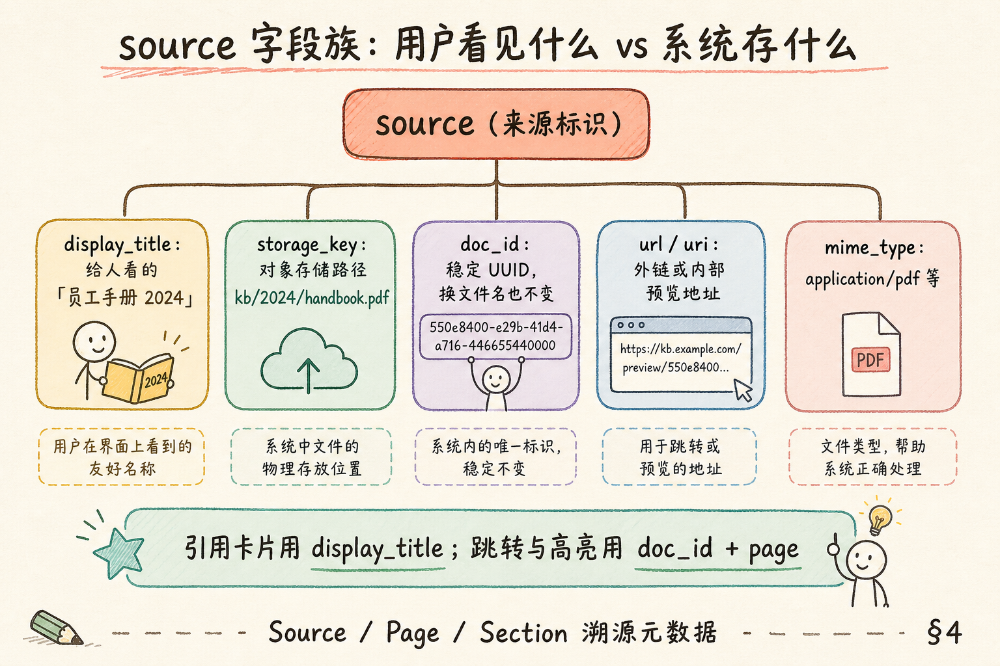
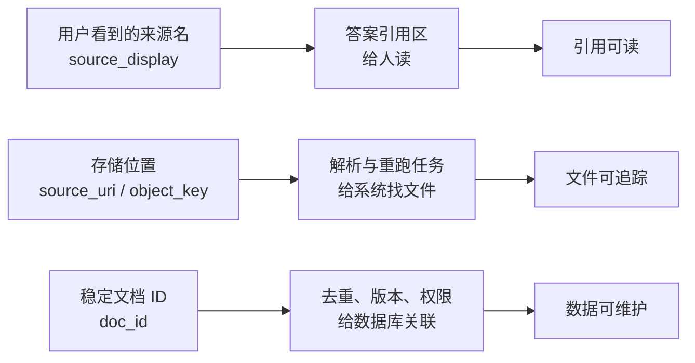
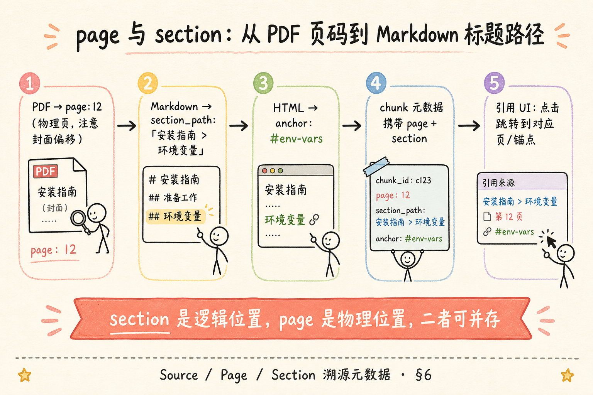
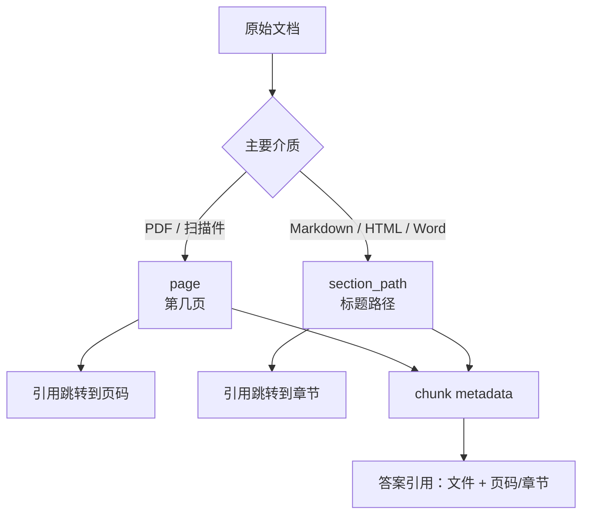
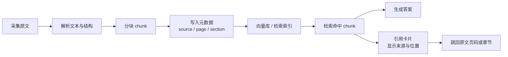

# RAG 数据采集与解析（十）：Source / Page / Section 溯源元数据完全指南

> 用户点开引用卡片，期望 **一秒跳回原文第几页、第几节**——若你的 chunk 只有一段裸文本，Grounding 再严也只是「看起来专业」。本篇是 [企业 RAG 路线图](ENTERPRISE_RAG_ROADMAP.md) **C1 轨第十篇**（路线图第 **59** 条），讲清 **source**（来源）、**page**（页码）、**section**（章节路径）三类溯源元数据：怎么在入库时写对、怎么在引用 UI 里用、字段缺失时如何降级而不造假。前置：[34 Grounding 与引用](34.grounding-citation-tutorial.md)、[36 PDF 文本提取](36.pdf-text-extraction-tutorial.md)、[38 Markdown 解析](38.markdown-parsing-tutorial.md)；路线图 **57～58** 的 `doc_id` / `chunk_id` 建议已读。

---

## 目录

1. [前言：引用要能跳，不能只报文件名](#1-前言引用要能跳不能只报文件名)
2. [本文边界与动手路径](#2-本文边界与动手路径)
3. [三类字段各管什么](#3-三类字段各管什么)
4. [source 字段族：显示名、存储键与稳定 ID](#4-source-字段族显示名存储键与稳定-id)
5. [page：PDF 页码与「第几页」的坑](#5-pagepdf-页码与第几页的坑)
6. [section：Markdown 标题路径与逻辑章节](#6-sectionmarkdown-标题路径与逻辑章节)
7. [引用跳转：从 chunk 到可点击溯源](#7-引用跳转从-chunk-到可点击溯源)
8. [综合实战：构造带完整溯源的 chunk 记录](#8-综合实战构造带完整溯源的-chunk-记录)
9. [字段缺失时怎么办](#9-字段缺失时怎么办)
10. [先错后对：伪造页码与空 section](#10-先错对对伪造页码与空-section)
11. [综合概念地图](#11-综合概念地图)
12. [常见陷阱与 FAQ](#12-常见陷阱与-faq)
13. [总结与系列下一步](#13-总结与系列下一步)

---

## 1. 前言：引用要能跳，不能只报文件名

企业知识库问答里，最常见的产品差评不是「答错了」，而是 **「你说依据员工手册——手册哪一页？」**  
[第 34 篇](34.grounding-citation-tutorial.md) 要求答案绑证据；证据绑完之后，用户还要 **能导航**：PDF 预览跳到第 12 页、Markdown 文档滚到「环境变量」小节、内部 wiki 打开对应锚点。

这三步导航靠的不是模型口才，而是你在 **分块入库时写进向量库的元数据**。路线图 **59** 把这件事拆成三个关键词：

- **source**（来源）：这份内容 **从哪个文档** 来；  
- **page**（页码）：在 **PDF 等分页介质** 上位于第几页；  
- **section**（章节）：在 **逻辑结构** 上属于哪条标题路径。

**Source metadata**（来源元数据）：标识 chunk 所属文档及其对外展示名的字段集合。  
通俗说：用户看见「员工手册 2024」，系统里还要存 **不会随重命名而丢的稳定 ID**。

**Page metadata**（页码元数据）：记录 chunk 在分页文档中的物理页序号。  
通俗说：印刷 PDF 上角标 **「12」** 那一页——不是 Word 里的「第 12 段」。

**Section metadata**（章节元数据）：记录 chunk 在文档大纲中的逻辑位置，常为标题面包屑。  
通俗说：**「第三章 > 考勤 > 年假」** 这条路径，方便无页码的 MD/HTML 溯源。

**读完本文，你应该能做到：**

1. 区分 source / page / section 的职责，不混用「文件名」与 `doc_id`。  
2. 为 PDF 与 Markdown 各设计一套最小元数据形状。  
3. 说明引用卡片跳转需要哪些字段组合。  
4. 在 page 或 section 缺失时给出 **诚实降级** 策略，不伪造定位。  
5. 完成 §8 的 chunk 构造练习，并对照 §10 识别坏味道。

---

## 2. 本文边界与动手路径

**档位：地基篇（C1 元数据子系列）。**

**本文讲：** 三字段语义、跨格式差异、引用跳转契约、缺失降级、最小 JSON 示例。  
**本文不讲：** 完整引用卡片 React 组件（F2 轨）、PDF.js 高亮实现、Parent-Document Retriever 代码（C2 **72**）、向量库具体 filter 语法（C4）。

### 2.1 动手路径表

| 步骤 | 你做什么 | 验收 |
|------|----------|------|
| A | 读 §3～§4，画出 source 字段族 | 能分 display vs doc_id |
| B | 读 §5～§6，各写一条 PDF / MD 元数据 | 含 page 或 section_path |
| C | 读 §7，列出引用 UI 跳转所需字段 | 不少于 4 个字段 |
| D | 跟做 §8 chunk 构造 | JSON 可被 mock 检索返回 |
| E | 完成 §10 先错对对 | 能指出伪造页码 |
| F | 对照 §11 概念地图复盘 | 速记表能口述 |

**环境：** 纸笔或任意 JSON 编辑器即可；有 Python 时可用 `dict` 跟练 §8。

### 2.2 沿用前文

| 概念 | 来自 |
|------|------|
| 句级引用 `[n]` 与拒答 | [34 Grounding](34.grounding-citation-tutorial.md) |
| PDF 按页提取 | [36 PDF 提取](36.pdf-text-extraction-tutorial.md) |
| 标题层级与 AST | [38 Markdown 解析](38.markdown-parsing-tutorial.md) |
| `doc_id` / `chunk_id` | 路线图 **57～58**（本系列前置） |

---

## 3. 三类字段各管什么

用一张对照表先立住直觉：

| 字段 | 回答的问题 | 典型载体 | 用户感知 |
|------|------------|----------|----------|
| source | 哪份文档？ | 全格式 | 「员工手册 2024」 |
| page | 物理第几页？ | PDF、扫描件、部分 DOCX | 「p.12」 |
| section | 逻辑哪一节？ | MD、HTML、结构化 PDF | 「第三章 > 年假」 |

三者 **可并存**：一份 PDF 既有 page，也可从书签抽出 section；一份 Markdown 通常 **无 page 但有 section**。

**Provenance**（溯源 / 出处）：信息从哪来、如何被改写的可追踪链条。  
通俗说：不止「答案对了」，还要 **能追到原文坐标**。

**Citation anchor**（引用锚点）：前端用来滚动、高亮、打开预览的定位信息。  
通俗说：点击 `[1]` 后浏览器 **跳到哪里** 的那组参数。

工程上建议：**每个 chunk 至少具备 source +（page 或 section 之一）**。两者皆无的 chunk，只能做「全文搜索式」引用，体验打折，应在入库日志标黄。

### 3.1 一个具体用户故事

法务专员打开问答助手：「劳动合同试用期最长多久？」系统返回正确数字，引用写 **「劳动合规指引 p.7 [1]」**。她点击卡片，PDF 预览 **直接跳到第 7 页** 并高亮该句——三秒内完成核对，邮件回复业务方。  
若引用只有「劳动合规指引.pdf」而无 `page`，她要在 80 页里搜索，**产品信任瞬间清零**。  
这就是 source/page/section 存在的理由：**把 Grounding 从「文本对齐」推进到「空间对齐」**。

### 3.2 与 chunk_id 的三角关系

| 标识 | 粒度 | 典型用途 |
|------|------|----------|
| doc_id | 文档 | 版本、权限、预览路由 |
| chunk_id | 段落 | 检索命中、日志、快照 |
| page / section | 坐标 | 人类导航 |

三者缺一不可的场景：**审计**要求「谁、何时、从哪段、哪一页」引用了什么——只有 chunk 文本没有 page，审计材料不合格。

---

## 4. source 字段族：显示名、存储键与稳定 ID

读下图，分清「给人看的名字」和「给系统用的键」。初学者最容易犯的错误，是把文件名、对象存储路径、文档 ID 都塞进一个 `source` 字符串里，后面展示、去重、迁移时都会互相牵制。






上图的结论是：`source_display` 负责可读，`source_uri` 负责定位，`doc_id` 负责稳定关联。三者拆开后，同一份文档改名、换存储桶或重跑解析时，不会把引用链路一起打断。

对照上图，建议把 source 拆成 **一族字段**，而不是单个字符串：

| 字段 | 含义 | 示例 |
|------|------|------|
| `doc_id` | 稳定文档 ID，换文件名不变 | `doc_a8f3…` |
| `source` / `storage_key` | 对象存储或相对路径 | `kb/2024/handbook.pdf` |
| `display_title` | UI 展示标题 | `员工手册（2024 版）` |
| `mime_type` | 介质类型 | `application/pdf` |
| `url` | 可选外链或预览地址 | `https://…/preview/…` |

**doc_id**（文档标识符）：全库唯一、与物理文件名解耦的 ID。  
通俗说：用户把 `handbook.pdf` 改成 `手册.pdf`，**doc_id 不变**，历史 chunk 仍挂得住。

**display_title**（展示标题）：引用卡片上给人看的短标题。  
通俗说：比 `kb/2024/handbook_final_v3.pdf` 体面得多。

### 4.1 为什么不只存文件名

| 只存文件名的问题 | 后果 |
|------------------|------|
| 重命名 / 迁移目录 | 旧 chunk 溯源断链 |
| 同名不同版本 | 「员工手册.pdf」指代不明 |
| 用户上传覆盖 | 引用指向错误版本 |

因此：**source 字段族的核心是 `doc_id` + `display_title`**；路径类字段为运维与预览服务。

### 4.3 多语言 display_title（可选）

同一 `doc_id` 下可有 **多语言展示名**（`locale` 字段），坐标不变：

```json
"display_title": "员工手册（2024）",
"display_title_en": "Employee Handbook 2024",
"locale": "zh-CN"
```

**Locale**（语言区域）：如 `zh-CN`、`en-US`，用于 UI 选标题，不改变 page/section。

### 4.4 与 chunk_id 的分工

路线图 **58** 的 `chunk_id` 标识 **这一段**；`doc_id` 标识 **整本文档**。  
引用卡片常见展示：`display_title` + page/section；后台跳转用 `doc_id` + `chunk_id` 取原文快照。

---

## 5. page：PDF 页码与「第几页」的坑
这里先把 source 和 page 当成“证据定位坐标”来看：source 告诉系统证据来自哪份材料，page 告诉用户该去哪里复核原文。对初学者来说，关键不是多存字段，而是让每条检索结果都能被人回查。

### 5.1 page 是什么

对 PDF 类文档，`page` 一般表示 **从 1 开始的物理页序号**（与 PyMuPDF、`pypdf` 的 `page_index + 1` 对齐，以你选用的库为准并在全库统一）。

**Page index**（页索引）：部分 API 从 0 计数；对外展示通常 **+1 转成人类页码**。  
通俗说：程序员手里的 `0`，用户眼里的 **「第 1 页」**。

### 5.2 常见偏移

| 情况 | 处理 |
|------|------|
| 封面、版权页不算正文 | 业务定义「正文第 1 页」映射表，或仍用物理页但在 UI 标注 |
| 扫描件 OCR 后页序乱 | 提取阶段写 `warnings`，人工抽测 |
| 合并 PDF | 记录 `source_page_range` 或子文档 ID |

**不要** 在元数据里混用「印刷页码」（书上印的罗马数字页）与「文件页序」而不加说明——否则法务引用会对不上。

### 5.3 非 PDF 要不要 page

- **Markdown / HTML**：通常 **无 page**，用 section + 字符偏移 `char_start` 可选；  
- **DOCX**：可有「打印页」概念，但提取常不稳定，优先 section；  
- **纯 TXT**：无 page，用行号 `line_start` 作弱替代（可选）。

原则：**没有可靠页码时，不硬造 page**——交给 §9 降级策略。

### 5.4 提取器与 page 的代码契约

以 [36 篇](36.pdf-text-extraction-tutorial.md) 的按页循环为例，**page 必须在提取循环内写入**，而不是事后猜：

```python
pages_out = []
for page_index, page in enumerate(doc):
    pages_out.append({
        "page": page_index + 1,  # 全库统一：1-based
        "text": page.extract_text() or "",
        "kind": "text",
    })
```

分块时：

```python
for block in split_page_text(page_text):
    chunks.append({
        **acl_and_doc_fields,
        "page": current_page,  # 继承自所在页
        "char_start": block.start,
        "char_end": block.end,
    })
```

**1-based page**（从 1 开始的页码）：面向用户与 UI 的页序约定。  
通俗说：第一页就是 **1**，不是程序员习惯的 **0**。

若团队内部 API 用 0-based，**只在边界转换一次**，并在 README 写明；切勿提取用 0、展示用 1、入库又混用。

### 5.5 扫描 PDF 与 OCR 页的 page

路线图 **62 OCR** 将详述；此处只记：**OCR 后 page 仍指原图页序**，与是否识别出字无关。  
空页 OCR 失败时 `text=""` 但 `page` 仍保留，方便 UI 显示「本页无文本」而非跳页错乱。

---

## 6. section：Markdown 标题路径与逻辑章节

读下图，看 page 与 section 如何并行服务不同介质。`page` 更像纸质坐标，适合 PDF、扫描件；`section` 更像目录路径，适合 Markdown、HTML、Word 转结构化文本。






上图要表达的是：`page` 和 `section_path` 不是二选一，而是并行坐标。一个 chunk 可以同时带页码和章节；检索命中后，产品层再决定展示「第 5 页」还是「制度 > 报销 > 机票」。

对照上图：

**section_path**（章节路径 / 标题面包屑）：从文档根到当前块的路径，常用 `>` 连接。  
通俗说：`安装指南 > 环境变量 > Linux` 告诉人和模型 **这段在讲什么位置**。

### 6.1 Markdown 怎么生成 section_path

解析 AST 时沿 heading 栈累积（见 [38 篇](38.markdown-parsing-tutorial.md)）：

```text
# 安装指南          → ["安装指南"]
## 环境变量         → ["安装指南", "环境变量"]

这一节先给出「环境变量         → ["安装指南", "环境变量"]」的整体框架，再拆到下面的小节；这样读者不会一上来就被表格、代码或清单打断。
### Linux           → ["安装指南", "环境变量", "Linux"]
```

入库字段示例：

```json
"section_path": ["安装指南", "环境变量", "Linux"],
"heading_level": 3,
"anchor": "linux"
```

**Heading hierarchy**（标题层级）：`H1`～`H6` 形成的文档大纲树。  
通俗说：目录树骨架，**结构感知分块**（路线图 **69**）靠它切。

### 6.2 HTML 与 PDF 书签

- HTML：用 `id` 锚点或 `h2#env-vars` 选择器；  
- PDF：若有 Outline/书签，可把「第一章 > 考勤」写入 `section_path`，与 `page` 并用。

### 6.4 从 section 生成「人类可读」引用行

```python
def human_loc(chunk: dict) -> str:
    if chunk.get("page"):
        return f"p.{chunk['page']}"
    path = chunk.get("section_path") or []
    if path:
        return " › ".join(path)
    return f"片段 {chunk.get('chunk_index', '?')}"
```

前端卡片：`{display_title} · {human_loc(chunk)}`——**五个字以内**能懂在哪，比 JSON 堆字段重要。

### 6.5 结构感知分块预告（路线图 69）

按 `##` 切块时，**chunk 的 section_path 应等于块顶标题路径**，不要把子节内容挂在父节路径下却不写子标题——否则用户点开发现「标题是环境变量，正文却在讲 Linux 内核参数」对不上。

---

## 7. 引用跳转：从 chunk 到可点击溯源

用户点击引用时，后端/前端通常需要：

| 步骤 | 需要字段 |
|------|----------|
| 取原文 | `chunk_id` 或 `doc_id` + 偏移 |
| 显示标题 | `display_title` |
| 打开 PDF 到页 | `doc_id`, `page`, 预览服务 URL |
| 滚到 MD 小节 | `doc_id`, `section_path` 或 `anchor` |
| 高亮句子 | `char_start`/`char_end` 或存原文快照 |

**Deep link**（深链接）：直接打开文档某一页或某一锚点的 URL。  
通俗说：不是打开手册首页，而是 **打开手册第 12 页**。

### 7.1 与 Grounding 的拼接

[34 篇](34.grounding-citation-tutorial.md) 的 `[1]` 在 UI 层应映射为：

```json
{
  "ref_id": 1,
  "chunk_id": "chk_001",
  "doc_id": "doc_a8f3",
  "display_title": "员工手册（2024）",
  "page": 12,
  "section_path": ["第三章", "年假"],
  "snippet": "入职满一年，享受 10 个工作日年假……"
}
```

模型正文写「满一年 10 天 [1]」；卡片展示 **员工手册 p.12 · 第三章 > 年假**。

### 7.3 前端 DeepLinkRouter 职责划分（概念）

| 层 | 职责 |
|----|------|
| 检索 API | 返回带元数据的 chunk |
| 引用解析 | `[n] → chunk_id` |
| DeepLinkRouter | 按 `mime_type` 调 PDF/MD 查看器 |
| 查看器 | 执行滚动、高亮 |

**Highlight range**（高亮区间）：`char_start`/`char_end` 或 PDF 文本矩形；MVP 可只做 **页级跳转**，句级高亮作二期。

### 7.4 拿不到预览服务时的诚实 UI

内网部分文档只有 **下载链接** 无在线预览：卡片按钮写 **「下载查看」** 而非假 **「打开第 12 页」**。  
有 `page` 时在下载文件名或卡片副标题注明页码，用户仍节省寻找时间。

---

## 8. 综合实战：构造带完整溯源的 chunk 记录

下面用 **同一政策句** 演示 PDF 与 Markdown 两种入库形态（教学用，非生产 schema 唯一标准）。

### 8.1 PDF 来源 chunk

```python
pdf_chunk = {
    "chunk_id": "chk_pdf_0042",
    "doc_id": "doc_handbook_2024",
    "source": "kb/2024/handbook.pdf",
    "display_title": "员工手册（2024 版）",
    "mime_type": "application/pdf",
    "page": 12,
    "section_path": ["第三章 考勤", "年假"],
    "chunk_index": 42,
    "text": "入职满一年，享受 10 个工作日年假。",
}
```

### 8.2 Markdown 来源 chunk

```python
md_chunk = {
    "chunk_id": "chk_md_0018",
    "doc_id": "doc_onboard_guide",
    "source": "docs/onboard/README.md",
    "display_title": "新人入职指南",
    "mime_type": "text/markdown",
    "page": None,
    "section_path": ["考勤说明", "年假"],
    "anchor": "年假",
    "heading_level": 2,
    "chunk_index": 18,
    "text": "入职满一年，享受 10 个工作日年假。",
}
```

注意：`page: None` **显式为空**，前端走「按标题跳转」分支，而非默认 `p.1`。

### 8.3 拼进 RAG 提示（片段）

```python
def format_evidence(i: int, c: dict) -> str:
    loc = f"p.{c['page']}" if c.get("page") else " > ".join(c.get("section_path", []))
    return f"[{i}]（{c['display_title']} · {loc}）\n{c['text']}"
```

### 8.4 批量质检脚本思路

```python
def validate_chunk(c: dict) -> list[str]:
    errs = []
    if not c.get("doc_id"):
        errs.append("missing doc_id")
    if not c.get("display_title") and not c.get("source"):
        errs.append("missing display_title/source")
    if not c.get("page") and not c.get("section_path"):
        errs.append("missing page and section_path")
    if c.get("page") is not None and c["page"] < 1:
        errs.append("invalid page")
    return errs
```

CI 中对 staging 索引跑一遍，**阻断带 errs 的批次上线**——比上线后用户截图反馈便宜一个数量级。

### 8.5 与 HTML 正文抽取（39 篇）的坐标

[39 HTML 正文抽取](39.html-content-extraction-tutorial.md) 去掉导航栏噪声后，主内容区标题仍可映射 `section_path`；`anchor` 来自 heading 的 `id` 属性。  
若站点无 `id`，可用 **XPath 或 CSS 路径** 作弱 anchor——稳定性不如 MD，需在 `warnings` 标明。

---

## 9. 字段缺失时怎么办

缺失是常态：老库没 page、HTML 没稳定 anchor、合并 chunk 跨页。策略是 **诚实降级 + 可观测**，不是 **编造**。

| 缺失 | 降级展示 | 后台动作 |
|------|----------|----------|
| 无 `page` | 只显示 section 或「全文」 | 日志 `missing_page` |
| 无 `section` | 显示 `p.N` 或 `chunk 42/200` | 提示补解析 |
| 无 `display_title` | 回退 `source` 文件名 | 入库质检失败 |
| 无 `doc_id` | **阻断发布** | 严重：无法版本追溯 |
| 全无定位 | 仅 snippet + 文档名 | UI 标「定位不可用」 |

**Graceful degradation**（优雅降级）：功能缩水但信息真实，不伪造坐标。  
通俗说：宁可写 **「出处：员工手册，具体页码未知」**，也不写假 **p.1**。

### 9.1 给用户的文案示例

```text
来源：员工手册（2024 版）· 章节：考勤 > 年假（页码未收录，请联系管理员补全元数据）
```

### 9.2 给工程师的告警


这里提醒工程侧不要只看单次成功结果：应把异常样例、日志字段和可回放步骤一起保留，方便后续定位和回归。

### 9.3 与日志、可观测的字段

每次检索返回引用时，日志建议记：

```json
{
  "chunk_id": "chk_pdf_0042",
  "doc_id": "doc_handbook_2024",
  "page": 12,
  "section_path": ["第三章 考勤", "年假"],
  "has_deep_link": true
}
```

`has_deep_link: false` 时前端别渲染可点击图标，避免 **死链** 挫败感。

---

## 10. 先错对对：伪造页码与空 section
下面这些错误看起来只是实现细节，实际会破坏检索、引用、评测或用户体验。读的时候重点看：错法缺少了哪个必要信息，以及正确做法如何补上这个缺口。

### 10.1 错：统一写 page=1

**错例：** 所有 PDF chunk 默认 `page: 1`「占位」。  
**危害：** 用户跳到封面，认定产品「造假引用」。

**对：** 未知则 `null`，UI 降级；修复提取链路。

### 10.2 错：把 chunk_index 当 page

**错例：** 第 42 个块写 `page: 42`。  
**危害：** 文档不足 42 页时荒谬；与真实页码无关。

**对：** `chunk_index` 与 `page` 分字段；page 只来自提取器页循环。

### 10.3 错：section 写文件名

**错例：** `section_path: ["handbook.pdf"]`。  
**危害：** 对导航无帮助，浪费重排信号。

**对：** 来自标题栈或 PDF Outline，至少一层有意义的中文/英文标题。

### 10.5 错：section 从正文第一句截取

**错例：** `section_path: ["入职满一年，享受 10 个工作日年假"]`。  
**危害：** 目录导航失效，重排信号变噪声。

**对：** 仅来自 **标题栈或 Outline**，不从正文句抽取。

### 10.6 错：多文档合并 source

**错例：** 把多份 PDF 拼成一个虚拟 chunk，`source: "批量导入.zip"`。  
**危害：** 无法跳转单份文档。

**对：** 每份物理文档独立 `doc_id`；合并只发生在 **检索结果列表** 层，不在入库层。

---

## 11. 综合概念地图

读下图时，先看「Source / Page / Section 概念地图」想表达的主线：从解析阶段写入元数据，到检索阶段返回引用，再到用户点击引用回到原文。




上图的检查点是：只保存文本不够，必须在分块时同步保存来源坐标。否则答案虽然能生成，但用户无法确认「这句话来自哪份文件、哪一页、哪一节」。

对照上图：**提取 → 分块写元数据 → 检索返回 → 引用跳转** 四段闭环；source 定文档身份，page/section 定坐标。

### 11.1 速记表

| 概念 | 一句话 |
|------|--------|
| source | 哪份文档；核心是 doc_id + 展示名 |
| page | PDF 物理页；无则 null |
| section | 标题面包屑；MD/HTML 主路径 |
| 深链接 | doc_id + page/anchor 跳转 |
| 降级 | 缺字段诚实说明，不伪造 |
| chunk_id | 这一段；与 doc_id 分工 |

---

## 11.2 跨格式溯源对照表

把「同一种用户问题」在不同介质上的落点一次看清，日后做统一 `CitationService` 时少返工：

| 介质 | source 主字段 | 定位主字段 | 跳转实现提示 |
|------|---------------|------------|--------------|
| PDF | `doc_id` + `display_title` | `page` | PDF.js `page=` 或厂商预览 API |
| Markdown | `doc_id` + `display_title` | `section_path`, `anchor` | 站内路由 `#anchor` 或 MD 查看器 |
| HTML | `url` 或 `doc_id` | `anchor` / CSS 选择器 | 浏览器深链接 |
| DOCX | `doc_id` | `section` 为主，`page` 可选 | 转 PDF 预览或 OOXML 偏移（进阶） |
| 粘贴纯文本 | `doc_id`（虚拟文档） | `line_start` / `char_start` | 代码审查式行号展示 |

**Unified citation model**（统一引用模型）：后端用同一 JSON schema 描述引用，前端按 `mime_type` 选渲染器。  
通俗说：**一套 `[1]` 编号**，点开后 PDF 跳页、MD 滚标题，用户无感。

### 11.3 入库流水线中的写入时机

| 阶段 | 应确定的字段 | 常见遗漏 |
|------|--------------|----------|
| 上传 | `doc_id`, `display_title`, `mime_type` | 用临时 UUID 后未回写 |
| 提取 | `page`（PDF） | 只拼全文丢页界 |
| 解析 MD | `section_path`, `heading_level` | 当纯文本切 |
| 分块 | `chunk_index`, 继承 page/section | 跨页块只写起始页 |
| 索引 | 全字段进 metadata | 只存 vector 不存 meta |

建议在分块服务输出 **契约测试**：随机抽 100 chunk，断言 `doc_id` 非空且 `page` 与 `section_path` 至少其一存在（纯 TXT 豁免需白名单）。

### 11.5 与路线图 62 OCR 的衔接

扫描件入库后 **page 仍有意义**（见 §5.5），但 `section` 可能只能靠 **人工书签** 或 **版面标题检测**。  
OCR 质量差时 `section_path` 为空可接受，**page 不能丢**——否则用户只能在整本 PDF 里盲搜。

### 11.6 面试常问：source 和 citation 区别？

| | source 元数据 | citation 展示 |
|--|---------------|---------------|
| 存哪 | 向量库 chunk metadata | API 响应 + 前端 |
| 何时写 | 入库 | 检索后组装 |
| 目的 | 持久坐标 | 当次问答溯源 |

一句话：**source/page/section 是原料；[1] 卡片是成品。**

### 11.7 白板 60 秒复述（自测）

对着镜子或同事用 60 秒讲清：

1. `doc_id` 不随重命名变；  
2. PDF 用 `page`，MD 用 `section_path`；  
3. 引用跳转要 `doc_id` + page 或 anchor；  
4. 缺页码就诚实降级，别写假 p.1；  
5. 与 53/54 组成 **位置、权限、时效** 三角。

卡壳就回 §3 用户故事想 **法务专员点引用** 那个画面。

### 11.8 与 F2 引用 UI 的验收标准

产品验收时至少确认：**点击 [n] 后 2 秒内** 出现正确文档上下文（页或锚点）；失败则记录 `chunk_id` 与 `has_deep_link`。  
把「能答对」与 **「能跳对」** 分成两个验收列，避免 demo 只测生成不测溯源。

### 11.9 术语对照速查（双轨）

| 英文 | 中文 | 字段 |
|------|------|------|
| Source | 来源 | doc_id, display_title |
| Page | 页码 | page |
| Section | 章节 | section_path, anchor |
| Deep link | 深链接 | 预览 URL 参数 |
| Provenance | 溯源 | 元数据 + 日志 |

---

## 12. 常见陷阱与 FAQ

1. **封面算第几页团队没对齐**——产品、提取、法务三方定一种展示规则并写进文档。  
2. **多 chunk 跨页**——主 `page` 用块起始页，可选 `page_end`；或按页再切分。  
3. **重入库不换 doc_id**——新版本应用新 `doc_id` 或明确 version（见 [54 篇](54.metadata-timestamp-version-tutorial.md)）。  
4. **只存对象存储 key 给人看**——用户看不懂 `s3://…`。  
5. **Grounding 了但不给跳转字段**——用户仍无法核验，差评照旧。

**Q：HTML 页面没有 PDF 式页码怎么办？**  
A：以 `section_path` + `anchor` 为主；可选记录 `url` 全路径。

**Q：同一页多个 chunk 引用会重复吗？**  
A：会，这是正常的；`chunk_id` 区分。UI 可合并「同页多段」展示。

**Q：扫描件 OCR 后页码可靠吗？**  
A：页序通常可靠，字符可能错；页码仍值得保留，配合 OCR 质量字段。

**Q：能否用字符偏移代替 page？**  
A：对 TXT/MD 可以作辅助；PDF 预览仍需要 page。

**Q：与路线图 55 版本管理的关系？**  
A：`doc_id` 定身份，**version** 定哪一版；换版后 source 展示名可带年份，见 54 篇。

**Q：用户上传同名文件两次怎么办？**  
A：生成两个 `doc_id`；`display_title` 可带上传时间或版本后缀，避免引用混淆。

**Q：chunk 跨两个 PDF 页怎么处理？**  
A：主 `page` 写起始页，附 `page_end`；或按页边界强制切分——后者更利于高亮。

**Q：外链 URL 当 source 可以吗？**  
A：可以，但爬虫内容易变；建议落库后 `doc_id` 指向快照，`url` 作参考。

**Q：多语言文档 section 路径怎么统一？**  
A：保留原语言标题即可；UI 层可做映射表，别在元数据里混中英两套路径。

### 12.1 排障：用户说「跳错页」

| 步骤 | 检查 |
|------|------|
| 1 | 日志里该 `chunk_id` 的 `page` 与提取服务是否一致 |
| 2 | 预览服务页码是否 0/1 基混用 |
| 3 | 封面是否导致「正文第 1 页」≠ `page=1` |
| 4 | 是否用了旧版 `doc_id` 的 chunk |
| 5 | OCR 页是否空白导致偏移 |

把 5 步写成 runbook，客服才能转工程而不是复读「请刷新」。

### 12.2 产品文案：引用卡片字段优先级

展示空间有限的移动端，推荐优先级：

1. `display_title`（必有）  
2. `page` 或 `section_path` 其一（必有，否则标黄）  
3. `version` / 生效日（见 [54 篇](54.metadata-timestamp-version-tutorial.md)）  
4. `snippet` 一行预览  

**Snippet**（摘要片段）：引用卡片上展示的一两句原文，帮助用户决定是否点开。  
通俗说：**「是不是我要找的那段」** 的预览，不是第二份答案。

### 12.3 给产品经理的一句话

**Source/page/section 不是工程师自嗨字段**——它们是引用卡片和法务核对的生命线；缺了可以上线，但别指望用户夸你 Grounding 做得好。

---

## 13. 总结与系列下一步

1. **source** 管文档身份，**page** 管物理页，**section** 管逻辑章节；三者互补。  
2. 引用跳转最小集：`doc_id` + `display_title` +（`page` 或 `section_path`）+ `chunk_id`/snippet。  
3. 缺失时 **降级 + 告警**，禁止伪造页码或假 section。  
4. PDF 与 Markdown 入库形状不同，**page 可为 null** 要显式表达。  
5. 本篇是 C1 元数据三角的 **「位置」** 一角；权限见 [53 篇](53.metadata-acl-tutorial.md)，时效见 [54 篇](54.metadata-timestamp-version-tutorial.md)。

**收束一句：** 溯源元数据的价值不在数据库里好看，而在用户 **敢点、敢信、敢转发给同事** 时还能对得上原文——这就是 enterprise RAG 与聊天机器人的分水岭之一。写元数据时永远问一句：**「用户点 [1] 会落到哪里？」** 答不上来就先别索引。

### 13.1 系列下一步

| 目标 | 阅读 |
|------|------|
| ACL 权限元数据（路线图 **60**） | [53](53.metadata-acl-tutorial.md) |
| 时间版本元数据（路线图 **61**） | [54](54.metadata-timestamp-version-tutorial.md) |
| 结构感知分块 | 路线图 **69** → C2 分块 |
| 引用 UI | 路线图 F2 |
| OCR 扫描件 | 路线图 **62** |

### 13.2 学习目标自检

- [ ] 能解释 source / page / section 分工  
- [ ] 能写出 PDF 与 MD 各一条 chunk JSON  
- [ ] 能列出引用跳转所需字段  
- [ ] 能设计缺失字段降级文案  
- [ ] 能识别伪造页码等坏味道  

---

> **初学者可能仍困惑的点**  
> - `source` 既是路线图关键词，也是常作字段名——记住「一族字段」就不乱。  
> - 没有 page 不等于不能上线，但要在 UI 诚实标注。  
> - 下一篇 **ACL** 解决「谁能看到这段」；没有权限元数据，溯源做得再漂亮也可能泄密。
