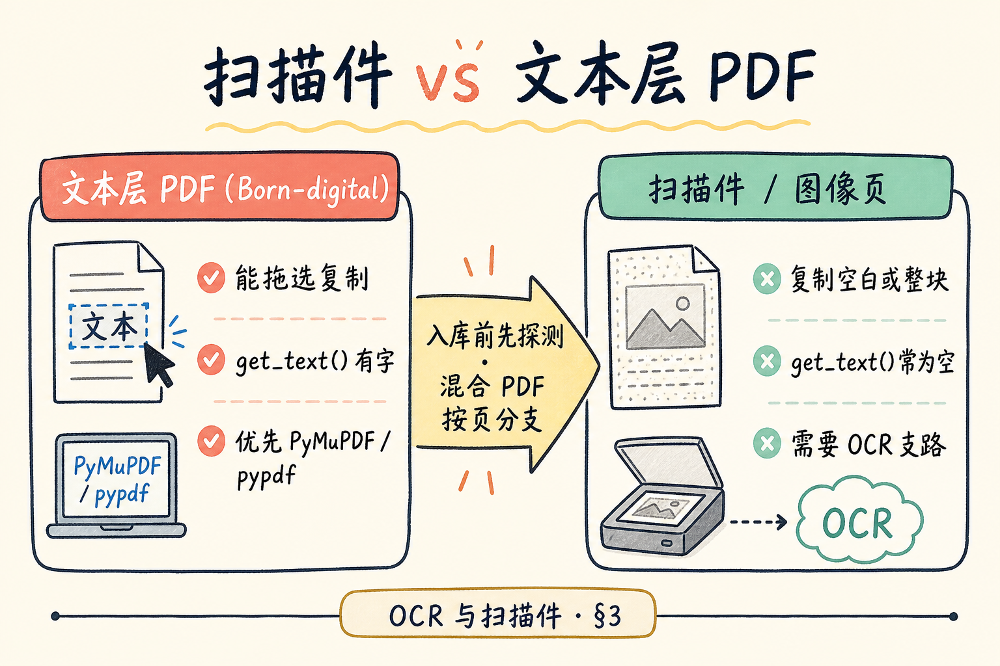
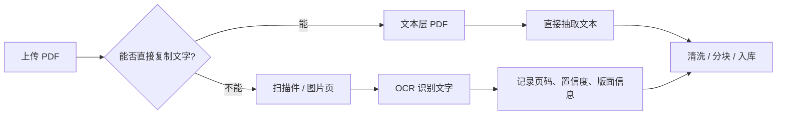
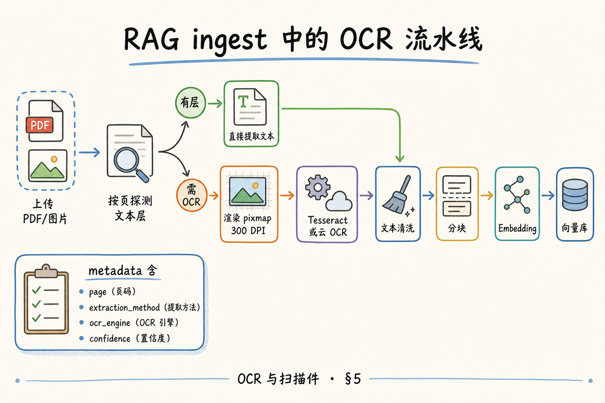
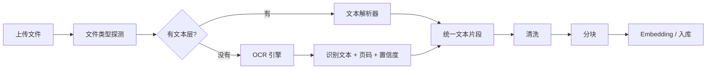
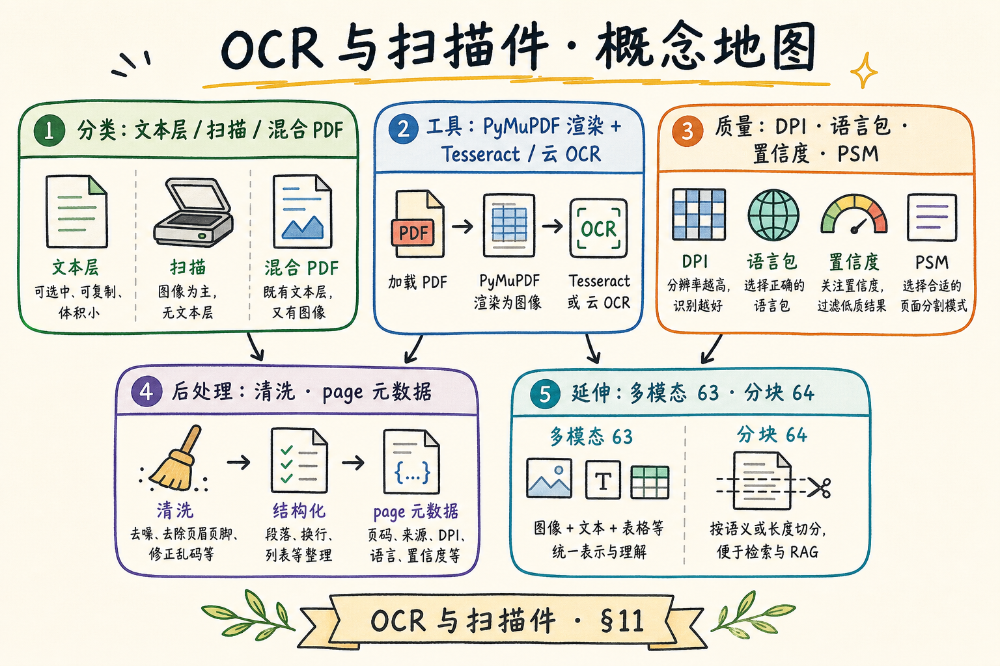
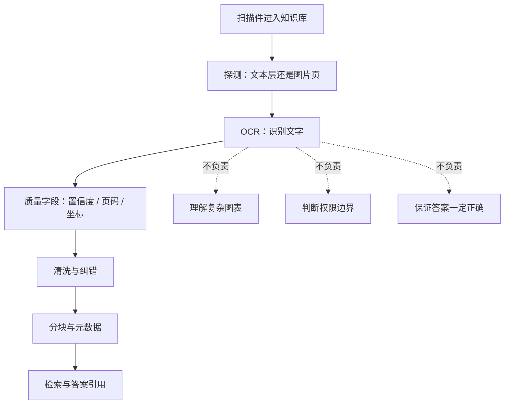

# 企业 RAG 数据采集（延伸）：OCR 与扫描件完全指南

> [PyMuPDF 篇](42.pymupdf-tutorial.md) 按页 `get_text()` 抽出来是空白；[PDF 文本提取篇](36.pdf-text-extraction-tutorial.md) 说过「扫描件没有文本层」——那 **RAG 怎么办？** 答案通常是 **OCR**（光学字符识别）：把页面 **当图片看**，猜出上面的字。这篇是 [企业 RAG 路线图](ENTERPRISE_RAG_ROADMAP.md) **C1 延伸**（路线图第 **62** 条，**加分档**），讲清文本层为空时的分支、OCR 直觉、Tesseract / 云 OCR 了解、质量坑、与 PyMuPDF 衔接，以及 **pytesseract** 最小示例（含环境说明）。前置：[36 PDF 文本提取](36.pdf-text-extraction-tutorial.md)、[42 PyMuPDF](42.pymupdf-tutorial.md)；清洗见 [46 文本清洗](46.text-cleaning-tutorial.md)。

---

## 目录

1. [前言：复制按钮是灰的](#1-前言复制按钮是灰的)
2. [本文边界与动手路径](#2-本文边界与动手路径)
3. [扫描件 vs 文本层：先分类再动手](#3-扫描件-vs-文本层先分类再动手)
4. [OCR 直觉：从像素到字符](#4-ocr-直觉从像素到字符)
5. [OCR 流水线：RAG 里放哪一步](#5-ocr-流水线rag-里放哪一步)
6. [Tesseract 与 pytesseract 最小实战](#6-tesseract-与-pytesseract-最小实战)
7. [云 OCR 与商用 API：何时外包识别](#7-云-ocr-与商用-api何时外包识别)
8. [质量坑：识别错比没有字更危险](#8-质量坑识别错比没有字更危险)
9. [与 PyMuPDF 衔接：渲染页再 OCR](#9-与-pymupdf-衔接渲染页再-ocr)
10. [先错对对：典型 OCR 误用](#10-先错对对典型-ocr-误用)
11. [综合概念地图](#11-综合概念地图)
12. [常见陷阱与 FAQ](#12-常见陷阱与-faq)
13. [总结与系列下一步](#13-总结与系列下一步)

---

## 1. 前言：复制按钮是灰的

法务上传一份 **扫描盖章合同**：Acrobat 里能 **看见** 全文，但 **拖选复制** 只能框到空白；`fitz.open(...).load_page(0).get_text()` 返回 `""`。这不是库坏了，是 PDF **根本没有文本层**——每一页只是一张 **位图**。

若 ingest 流水线仍走「只抽文本层」分支，结果有两种坏法：

- **静默失败**：chunk 为空，用户问条款 **检索不到**；  
- **更糟**：某页混有 **水印 OCR 垃圾** 或 **页眉被当正文**，模型 **胡编** 还标引用。

**OCR**（Optical Character Recognition，光学字符识别）：对图像中的文字区域检测并识别为 Unicode 字符序列的技术。  
通俗说：**让计算机「读图上的字」**，像人眼看扫描件。

**Scanned PDF**（扫描件 PDF）：页面内容由扫描仪或拍照得到的 **栅格图像** 构成，无独立文字对象；有时称 **image-only PDF**。  
通俗说：**PDF 外壳，里面是照片**。

**Text layer**（文本层）：PDF 里与视觉位置对应的 **可选中、可搜索** 字符数据；与「眼睛看到的像素」可以分离存在。  
通俗说：**隐形字模**，复制按钮靠它。

**读完本文，你应该能做到：**

1. 判断一份 PDF 该走 **文本层提取** 还是 **OCR**。  
2. 用一句话描述 OCR 在 RAG ingest 中的 **位置与产出**。  
3. 在本地跑通 **Tesseract + pytesseract** 最小示例（或读懂伪代码）。  
4. 列出至少四条 **OCR 质量坑** 及工程对策。  
5. 写出 **PyMuPDF 渲染 → OCR** 的衔接思路。  
6. 完成 §10 先错对对。

---

## 2. 本文边界与动手路径

**档位：加分篇（C1 采集延伸，非全员必修）。**

**本文讲：** 扫描件识别、OCR 直觉、Tesseract/云 OCR 概览、质量与后处理、PyMuPDF 衔接、最小可运行示例。  
**本文不讲：** CRNN/Transformer OCR 训练、版面分析模型微调、GPU 批量集群运维、手写体专用识别、多模态 VLM 读图（见路线图 **63** [56 篇](56.multimodal-image-text-tutorial.md)）。

### 2.1 动手路径表

| 步骤 | 你做什么 | 验收 |
|------|----------|------|
| A | 读 §3，对样例 PDF 做「能否选中文字」测试 | 分类正确 |
| B | 读 §4～§5，画 ingest 分支图 | 含 OCR 支路 |
| C | §6 安装 Tesseract + `pip install pytesseract pymupdf` | `tesseract --version` 有输出 |
| D | 跑 §6 脚本或 §9 衔接脚本 | 终端打出识别文本 |
| E | 读 §8，对照自己的输出找一处错字/乱序 | 能解释原因 |
| F | 完成 §10 先错对对 | 指出 DPI 与语言包问题 |

**环境：** Python 3.10+；系统安装 [Tesseract OCR](https://github.com/tesseract-ocr/tesseract)（Windows 需把安装目录加入 PATH 或配置 `pytesseract.pytesseract.tesseract_cmd`）；`pip install pytesseract pymupdf pillow`；准备 1 份 **扫描 PDF**（5 页内即可）。

### 2.2 与路线图关系

| 概念 | 来自 / 去向 |
|------|-------------|
| 文本层 vs 扫描 | [36 PDF 文本提取](36.pdf-text-extraction-tutorial.md) §4 |
| 按页提取 | [42 PyMuPDF](42.pymupdf-tutorial.md) |
| 清洗 OCR 噪音 | [46 文本清洗](46.text-cleaning-tutorial.md) |
| page / source 元数据 | [52 溯源元数据](52.metadata-source-page-tutorial.md) |
| 图片内复杂图表 | 路线图 **63** → [56 多模态篇](56.multimodal-image-text-tutorial.md) |
| 分块 | 路线图 **64** → [57 固定长度分块](57.fixed-size-chunking-tutorial.md) |

---

## 3. 扫描件 vs 文本层：先分类再动手

读下图：同一份「看起来是 PDF」的文件，底层可能是两条完全不同的路。文本层 PDF 可以直接抽字；扫描件只是图片，需要先做 OCR，再进入后续清洗与分块。






上图的关键判断是：先探测，再选路线。不要把扫描件当普通 PDF 解析，否则后面看到的不是「检索效果差」，而是更基础的「根本没有抽到可用文本」。

对照上图，**入库前先做探测**，别等 chunk 为空才排查：

| 信号 | 文本层 PDF | 扫描件 / 图像页 |
|------|------------|-----------------|
| 鼠标拖选 | 能选中字 | 只能框整块或选不中 |
| `get_text()` | 通常非空 | 常为空或极少 |
| 文件体积 | 相对小 | 页数少但 MB 大 |
| 放大边缘 | 字仍清晰（矢量） | 锯齿（位图） |
| 搜索 | 能搜到词 | 搜不到或靠 OCR 层 |

**Hybrid PDF**（混合 PDF）：部分页有文本层、部分页纯扫描（常见于旧文档补扫）。  
通俗说：**同一文件里两种页混在一起**——要 **按页** 分支，不能整本一刀切。

**Born-digital PDF**（原生数字 PDF）：由 Word/LaTeX/导出工具生成，通常带文本层。  
通俗说：**软件「生」出来的 PDF**，优先走 PyMuPDF/pypdf。

### 3.1 最小探测逻辑

```python
import fitz

def page_has_text_layer(page, min_chars=10) -> bool:
    text = page.get_text("text").strip()
    return len(text) >= min_chars
```

对 `False` 的页标记 `needs_ocr=True`，写入 chunk 元数据方便排障。  
**切忌**：文本层 **极少**（如只有页码）就当作成功——要设 **阈值** 与 **人工抽检**。

### 3.2 RAG 后果：走错路的代价

| 走错路 | 用户看到的现象 |
|--------|----------------|
| 扫描件当文本层 | 「库里明明有这份合同，搜不到条款」 |
| 文本层重复 OCR | 慢、错字增多、成本浪费 |
| 不区分混合 PDF | 前几页正常、后几页空白，答案 **半真半假** |

---

## 4. OCR 直觉：从像素到字符

**OCR** 不是魔法单步，工程上常拆成：

1. **预处理**：灰度、二值化、去噪、倾斜校正、对比度增强；  
2. **版面分析**（可选）：找文本块、表格、图片区；  
3. **行/词/字切分**；  
4. **识别**：每个字图 → 字符或 subword；  
5. **后处理**：词典、语言模型、拼写校正。

**Preprocessing**（预处理）：在识别前对图像做的增强与规范化，提高信噪比。  
通俗说：**把糊图尽量洗清楚** 再认字。

**Layout analysis**（版面分析）：判断页面上哪里是正文、页眉、表格、图。  
通俗说：**先圈出「字在哪块」**，再认——RAG 里乱序常出在这一步失败。

**Confidence score**（置信度）：引擎对某段识别结果的确信程度，常 0～1 或 0～100。  
通俗说：**OCR 自己有多虚**——低置信度要 flag 或拒索引。

初学者只需记住：**输入图像质量 + 语言包 + 版式** 决定上限；后面 Embedding 救不了「把 8 认成 0」。

### 4.1 和「文本提取」的分工

| 阶段 | 文本层路线 | OCR 路线 |
|------|------------|----------|
| 输入 | PDF 内容流 | 页面位图 |
| 工具 | PyMuPDF、pypdf | Tesseract、云 OCR |
| 速度 | 快 | 慢（尤其高 DPI） |
| 顺序 | 可能乱，但有字 | 依赖版面分析，常更乱 |
| 元数据 | 直接带 page | page + `ocr_engine` + `confidence` |

### 4.3 常见 OCR 误认模式（建立肉眼检查习惯）

| 视觉 | 易误认 | RAG 风险 |
|------|--------|----------|
| `l` / `I` / `1` | 互换 | 编号、金额错误 |
| `0` / `O` | 互换 | 工号、版本号 |
| 中文「口」/「日」 | 缺笔 | 专有名词搜不到 |
| 印章红字 | 随机汉字 | 噪音 chunk |
| 竖排古籍 | 顺序颠倒 | 整段不可读 |
| 低对比灰字 | 空或乱码 | 静默丢条款 |

抽检时 **不要只数 CER**，要 **grep 业务关键词**（如「甲方」「违约金」）是否在 OCR 结果里 **完整出现**——这比平均错率更贴近 RAG 体验。

### 4.4 倾斜、噪点与扫描仪设置

扫描仪 **歪斜 2°** 对肉眼几乎无感，对行切分可能是灾难——Tesseract 有 **OSD**（Orientation and Script Detection，方向与脚本检测）可尝试自动旋转，但 **不保证**。入库前批量 **deskew**（纠偏）是档案类客户的常规 ETL。

**DPI 与文件体积**：300 DPI 的 A4 单页 PNG 约 **数 MB**；整本合同百页 **临时磁盘** 要估好。流水线可在 OCR 后 **删 pixmap 缓存**，只留文本与可选缩略图——别长期存全量无损 PNG 除非合规要求。

---

## 5. OCR 流水线：RAG 里放哪一步

读下图：从上传到 chunk，OCR 支路插在 **解析** 阶段，仍在 **清洗与分块** 之前。这样做的好处是：后面的 chunk、metadata、索引逻辑都可以沿用文本 RAG 的主流程。






上图说明 OCR 不是一条完全独立的 RAG，而是解析阶段的一条分支。只要分支输出契约统一，后面的清洗、分块、向量化就不需要为扫描件重写一套。

对照上图，推荐 **最小 OCR ingest 契约**：

```json
{
  "text": "甲方应在三十日内……",
  "metadata": {
    "doc_id": "contract-2024-scan",
    "source": "contract_scan.pdf",
    "page": 3,
    "extraction_method": "ocr",
    "ocr_engine": "tesseract-5.3",
    "ocr_lang": "chi_sim+eng",
    "confidence_avg": 0.91
  }
}
```

**Ingest pipeline**（入库流水线）：从原始文件到向量库索引的一串自动化步骤。  
通俗说：**上传后后台跑的那条工厂线**。

**Extraction method**（提取方式）：标记正文来自 `text_layer`、`ocr` 还是 `vlm`——便于监控与降级。  
通俗说：**这行字怎么来的** 标签。

### 5.1 分支伪代码

```python
for page in doc:
    if page_has_text_layer(page):
        text = page.get_text("text")
        method = "text_layer"
    else:
        pixmap = page.get_pixmap(dpi=300)
        text = run_ocr(pixmap)
        method = "ocr"
    yield {"text": clean(text), "page": page.number + 1, "method": method}
```

`clean()` 对接 [46 清洗篇](46.text-cleaning-tutorial.md)：去 hyphen 断行、多余空白、常见 OCR 替换（`l`/`1`/`I` 在编号里）。

### 5.2 何时整本 OCR 而非按页

极少数 PDF **文本层是故意灌的假字**（copy protection）——肉眼复制乱码。此时要 **强制 OCR 全覆盖**。检测启发式：文本层存在但 **与渲染图像相似度低** 或 **Unicode 私用区过多**——进阶话题，知道存在即可。

---

## 6. Tesseract 与 pytesseract 最小实战

**Tesseract**：Google 维护的开源 OCR 引擎，支持 100+ 语言，RAG 原型常用。  
通俗说：**免费、可本地跑** 的认字引擎。

**pytesseract**：Tesseract 的 Python 薄封装，把 PIL/图像传给 CLI。  
通俗说：**Python 里调 Tesseract 的遥控器**。

### 6.1 环境安装要点

| 平台 | 要点 |
|------|------|
| Windows | 安装 UB Mannheim 等打包版；设 `tesseract_cmd` 指向 `tesseract.exe` |
| macOS | `brew install tesseract tesseract-lang` |
| Linux | `apt install tesseract-ocr tesseract-ocr-chi-sim` |
| 中文 | 需 **`chi_sim`**（简体）语言包，否则中文页几乎全错 |

```python
# Windows 示例（路径按本机修改）
import pytesseract
pytesseract.pytesseract.tesseract_cmd = r"C:\Program Files\Tesseract-OCR\tesseract.exe"
```

### 6.2 对单张 PNG 的最小示例

```python
from PIL import Image
import pytesseract

img = Image.open("page3.png")
text = pytesseract.image_to_string(img, lang="chi_sim+eng")
print(text[:500])
```

`lang="chi_sim+eng"` 表示 **中英混排** 常见合同场景；纯英文用 `eng` 即可。

### 6.3 带置信度与 HOCR（了解）

```python
data = pytesseract.image_to_data(img, lang="chi_sim+eng", output_type=pytesseract.Output.DICT)
for i, word in enumerate(data["text"]):
    if not word.strip():
        continue
    conf = int(data["conf"][i])
    if conf < 60:
        continue  # 低置信度词可丢弃或标红
```

RAG 可策略：**段落平均 conf < 阈值 → 不索引 / 仅索引人工复核队列**。

### 6.4 直接对 PDF 页（配合 PyMuPDF）

见 §9 完整脚本；核心是一页 **`get_pixmap(dpi=300)`** → **`image_to_string`**。

**DPI**（Dots Per Inch，每英寸点数）：渲染分辨率；OCR 常用 **300**，过低漏笔画，过高慢且占内存。  
通俗说：**把页画成多「密」的像素图**——300 是经验起点。

### 6.5 Tesseract 配置项速查（了解）

| 配置 | 含义 | 何时改 |
|------|------|--------|
| `-l chi_sim+eng` | 语言 | 中英混排合同 |
| `--psm 6` | 单块文本 | 正文页 |
| `--psm 11` | 稀疏文本 | 幻灯片截图 |
| `-c preserve_interword_spaces=1` | 保留空格 | 英文对齐 |
| `tessedit_char_whitelist` | 字符白名单 | 仅数字编号页 |

**Whitelist**（白名单）：限制输出字符集，适合 **纯数字页码表**——别对全文开，否则中文全灭。

### 6.6 从 PNG/JPG 文件夹批量 OCR 伪代码

```python
from pathlib import Path
from PIL import Image
import pytesseract

for img_path in Path("scans/").glob("*.png"):
    text = pytesseract.image_to_string(Image.open(img_path), lang="chi_sim+eng")
    # yield chunk: source=img_path.name, page=1, method=ocr
```

照片合同 **无 PDF page** 时，`source` 用文件名，`page=1`；若一本拍多页，文件名约定 `contract_p03.jpg` 便于解析页码。

---

## 7. 云 OCR 与商用 API：何时外包识别

本地 Tesseract 适合 **原型、内网、成本敏感**；以下场景常考虑 **云 OCR**：

| 场景 | 云 OCR 优势 |
|------|-------------|
| 中文繁简混排、竖排、古籍 | 商用模型更强 |
| 表格密集发票 | 带 **表格结构** 的 API |
| 手写批注（少量） | 专用模型 |
| 无运维装语言包 | SaaS 即开即用 |
| 峰值批量百万页 | 弹性算力 |

**Cloud OCR**（云 OCR）：通过 HTTP API 把图像发到厂商服务，返回文本或结构化结果。  
通俗说：**认字算力租别人的**。

常见厂商（了解即可，非广告）：Google Document AI、Azure Read、AWS Textract、百度/腾讯/阿里国内 OCR、PaddleOCR 自建服务等。选型看 **准确率 SLA、单价、数据出境合规、VPC 专有云**。

### 7.1 与 Tesseract 的分工建议

| 阶段 | 建议 |
|------|------|
| 开发 | Tesseract 跑通流水线 |
| 评测 | 抽 100 页人工标注 **字错率 CER** |
| 上线 | CER 超阈值再上云或混合 **「Tesseract 初筛 + 低 conf 页云补刀」** |

**CER**（Character Error Rate，字符错误率）：识别结果与真值的编辑距离除以真值长度。  
通俗说：**平均多少字错一个**——比「感觉还行」可靠。

### 7.1.1 云 OCR 请求形态（抽象）

无论哪家厂商，HTTP 形态大致类似：

```json
POST /v1/ocr
{ "image_base64": "...", "language": "zh-CN", "return_layout": true }
→ { "text": "...", "blocks": [{ "bbox", "text", "confidence" }] }
```

**Layout blocks**（版面块）：带 **bounding box** 的文字区域——可用于 **阅读顺序排序**。RAG 可把每 block 当 **小 chunk** 并带 bbox 元数据供 UI 高亮——进阶交互，了解即可。

### 7.1.2 混合云策略

```text
全部 Tesseract → 低 conf 页送云 → 云结果写回缓存
```

设低 conf 占 15%、云 0.01 元/页，百页文档 **额外约 1.5 元**——Often 比全量云省一个数量级。按月看 `ocr_cloud_page_ratio` 与 CER 抽检。

### 7.2 合规：扫描件常含 PII

合同、身份证扫描 **出网 OCR** 要过安全评审；很多金融客户要求 **私有化 Tesseract / 本地 Paddle**。日志里 **不要** 存原图 unless 加密与 retention 策略明确。

---

## 8. 质量坑：识别错比没有字更危险

| 坑 | 表现 | RAG 后果 | 对策 |
|----|------|----------|------|
| DPI 过低 | 小字糊成块 | 缺条款 | ≥300 DPI；关键页提高 |
| 语言包缺失 | 中文变乱码 | 垃圾 chunk | 装 `chi_sim`，混排加 `eng` |
| 倾斜未校正 | 行断裂 | 检索词截断 | 预处理旋转；用 `--psm` 模式 |
| 双栏当单栏 | 左栏右栏交错 | 答案拼接 nonsense | 分栏检测或商用版面 API |
| 水印/印章 | 识别成字 | 奇怪引用 |  mask 红色印章区（进阶） |
| 表格 | 列对齐丢失 | 数字串错位 | 路线图 **44** 表格篇 / 专用 OCR |
| 低置信度仍入库 | 8→0、l→1 | **错误答案高置信引用** | conf 阈值 + 人工队列 |
| 不清洗 hyphen | `regula-\ntion` | 搜 regulation 失败 | [46 清洗](46.text-cleaning-tutorial.md) |

**PSM**（Page Segmentation Mode，页面分割模式）：Tesseract 假设的版式类型（单块、单行、稀疏文本等）。  
通俗说：**告诉 OCR「这页长什么样」**——默认常不对复杂页。

### 8.1 `--psm` 直觉（Tesseract）

| 值 | 适用 |
|----|------|
| 3 | 默认，全自动 |
| 6 | 假定单一均匀文本块（常见正文页） |
| 11 | 稀疏文本（截图、幻灯片少量字） |

复杂合同仍可能需 **试几个 psm 取 conf 最高**——写进离线评测，别在线暴力枚举。

### 8.2 监控指标

| 指标 | 说明 |
|------|------|
| `ocr_page_ratio` | 需要 OCR 的页占比 |
| `ocr_empty_rate` | OCR 后仍空白 |
| `ocr_low_conf_rate` | conf 低于阈值 |
| `user_report_wrong_quote` | 引用与 PDF 肉眼不符 |

---

## 9. 与 PyMuPDF 衔接：渲染页再 OCR

[42 篇](42.pymupdf-tutorial.md) 的 **`page.get_pixmap()`** 是把 PDF 页 **光栅化** 的桥梁——OCR 输入必须是图像。

```python
"""pdf_ocr_page.py — 环境: Python 3.10+, pymupdf, pytesseract, 系统 Tesseract + chi_sim"""
import fitz
import pytesseract
from io import BytesIO
from PIL import Image

# Windows 用户取消下一行注释并改路径
# pytesseract.pytesseract.tesseract_cmd = r"C:\Program Files\Tesseract-OCR\tesseract.exe"

OCR_LANG = "chi_sim+eng"
DPI = 300
MIN_TEXT_LAYER_CHARS = 10


def pixmap_to_pil(pix: fitz.Pixmap) -> Image.Image:
    if pix.alpha:
        pix = fitz.Pixmap(fitz.csRGB, pix)
    return Image.open(BytesIO(pix.tobytes("png")))


def extract_page_text(page: fitz.Page) -> tuple[str, str]:
    layer = page.get_text("text").strip()
    if len(layer) >= MIN_TEXT_LAYER_CHARS:
        return layer, "text_layer"
    zoom = DPI / 72
    mat = fitz.Matrix(zoom, zoom)
    pix = page.get_pixmap(matrix=mat, alpha=False)
    img = pixmap_to_pil(pix)
    ocr_text = pytesseract.image_to_string(img, lang=OCR_LANG)
    return ocr_text.strip(), "ocr"


def pdf_to_text_by_page(pdf_path: str) -> list[dict]:
    doc = fitz.open(pdf_path)
    rows = []
    for i in range(len(doc)):
        page = doc.load_page(i)
        text, method = extract_page_text(page)
        rows.append({
            "page": i + 1,
            "text": text,
            "extraction_method": method,
        })
    doc.close()
    return rows


if __name__ == "__main__":
    import json
    import sys
    path = sys.argv[1] if len(sys.argv) > 1 else "scan_sample.pdf"
    print(json.dumps(pdf_to_text_by_page(path), ensure_ascii=False, indent=2))
```

**Rasterization**（光栅化）：把矢量/ PDF 页绘制为像素矩阵的过程。  
通俗说：**把一页「打印」成 bitmap** 再给 OCR。

衔接 [52 溯源](52.metadata-source-page-tutorial.md)：`page` 仍 **1-based**；`extraction_method` 写入 metadata 供引用 UI 显示「OCR 页，请核对原件」。

### 9.1 性能提示

| 参数 | 影响 |
|------|------|
| DPI | 线性影响像素量与 OCR 时间 |
| 并行 | 按页 `ProcessPoolExecutor` 可提速 |
| 缓存 | 同页 hash 不变则跳过 re-OCR（配合 [49 增量](49.incremental-update-tutorial.md)） |

---

## 10. 先错对对：典型 OCR 误用
下面这些错误都来自同一个误区：以为 OCR 只是“把图片变成文字”。真实系统还要处理版面、置信度、表格、页码和人工复核，否则识别出来的文字很容易误导检索。

### 10.1 错法 A：不装中文包，抱怨 Tesseract 不行

**现象**：输出 `□□□` 或拉丁乱码。  
**对法**：安装 `chi_sim`，`lang="chi_sim+eng"`。

### 10.2 错法 B：72 DPI 默认 pixmap 直接 OCR

**现象**：小字号合同条款缺失。  
**对法**：`dpi=300` 或等价 `Matrix(300/72, 300/72)`。

### 10.3 错法 C：OCR 结果不清洗直接 chunk

**现象**：断词、多余换行导致检索失败。  
**对法**：走 [46 清洗](46.text-cleaning-tutorial.md)；合并行内 hyphen。

### 10.4 错法 D：混合 PDF 整本强制 OCR

**现象**：原生页 **错字反而增多**、pipeline 慢 10 倍。  
**对法**：§3 **按页分支**。

### 10.5 错法 E：低置信度仍高亮引用

**现象**：用户核对 PDF，发现 **金额数字错一位**。  
**对法**：conf 阈值、人工复核队列、UI 标注「OCR 可能有误」。

### 10.6 错法 F：不做按页探测，整本强制 OCR

**现象**：原生 PDF 被 OCR 后 **错字率上升**、ingest 时间 **×10**。  
**对法**：§3 `page_has_text_layer` 阈值；混合 PDF **逐页** 分支。日志打 `ocr_page_ratio` 应在 **合理区间**（如扫描库 80%+，混合库 10～40%）。

### 10.7 错法 G：OCR 文本不进清洗

**现象**：行尾 hyphen、页眉「第 x 页」进 chunk，检索 **噪音命中**。  
**对法**：[46 清洗](46.text-cleaning-tutorial.md) 对 OCR 与文本层 **同一套**；额外规则去 **孤立页码行**。

---

## 11. 综合概念地图

读下图，把本篇与前后篇挂到一张 mental map。它强调的是：OCR 只解决「图片里的字怎么变成文本」，不自动解决版面理解、权限、引用和质量评估。






上图的结论是：OCR 是入口能力，不是最终答案能力。它把扫描件接入文本管道，但仍需要后续的清洗、分块、引用和质量门来兜底。

对照上图：

| 模块 | 本篇要点 | 延伸阅读 |
|------|----------|----------|
| 分类 | 文本层 / 扫描 / 混合 | [36](36.pdf-text-extraction-tutorial.md) |
| 提取 | PyMuPDF vs OCR | [42](42.pymupdf-tutorial.md) |
| 引擎 | Tesseract / 云 | 本篇 §6～§7 |
| 质量 | DPI、语言、conf | 本篇 §8 |
| 后处理 | 清洗、元数据 | [46](46.text-cleaning-tutorial.md)、[52](52.metadata-source-page-tutorial.md) |
| 复杂图 | 图表标题 | [56 多模态](56.multimodal-image-text-tutorial.md) |
| 下一步 | 分块 | [57 固定长度](57.fixed-size-chunking-tutorial.md) |

---

## 12. 常见陷阱与 FAQ

**Q：所有扫描件都要 OCR 吗？**  
A：是，除非你们接受 **只检索目录/文件名**——通常不可接受。

**Q：OCR 能替代 PyMuPDF 吗？**  
A：不能；有文本层时 **优先文本层**，更快更准。

**Q：密码 PDF 怎么办？**  
A：先解密再处理；无密码无法合法 OCR。

**Q：图片 PNG/JPG 合同照片呢？**  
A：与扫描页同一套 OCR，无 `page` 则 `page=1` 或拍照序号。

**Q：要不要存 OCR 中间 PNG？**  
A：排障期可短期存；生产用 **doc_id+page hash** 缓存策略，遵守 retention。

**Q：和 56 多模态 VLM 怎么选？**  
A：纯文字扫描 → OCR；图表语义、复杂信息图 → 了解 [56 篇](56.multimodal-image-text-tutorial.md)。

**Q：表格扫出来列乱了？**  
A：OCR 只给 **字串**；表格结构见 [37 表格版面](37.pdf-layout-tables-tutorial.md)、pdfplumber [43](43.pdfplumber-tutorial.md)。

**Q：能否 GPU 加速 Tesseract？**  
A：标准 Tesseract CPU 为主；大流量考虑 PaddleOCR、云 API 或专用推理服务。

### 12.1 上线 checklist

- [ ] 按页探测文本层阈值已配置  
- [ ] `chi_sim`（及所需语言）已装  
- [ ] DPI 与 psm 经样本评测  
- [ ] 低 conf 策略（丢弃/复核/标注）  
- [ ] 清洗流水线已接  
- [ ] metadata 含 `extraction_method`、`page`  
- [ ] 监控 `ocr_empty_rate` / CER 抽检  

### 12.2 批量 OCR 的工程参数

扫描件占比一高，**单机串行** 会成为 ingest 瓶颈。可按 **页** 并行，但要注意 **内存与 Tesseract 进程数**：

| 参数 | 经验值 | 说明 |
|------|--------|------|
| worker 数 | CPU 核数 − 1 | 过多反而上下文切换 |
| 队列深度 | 100～500 页 | 背压防 OOM |
| DPI | 300 默认 | 法务小字页可 400 |
| 超时 | 60s/页 | 超大页单独标记 |
| 重试 | 最多 2 次 | 换 psm 或略提 DPI |

**Backpressure**（背压）：上游生产速度超过下游 OCR 能力时，用队列长度限制 **暂停拉取新 PDF**，避免内存爆掉。  
通俗说：**流水线别挤爆**——扫描季高峰尤其要配。

缓存键建议：`sha256(page_bytes) + ocr_engine_version + lang + dpi`。引擎或语言包升级时 **整体 bump 版本号**，否则旧 OCR 结果会 **静默过时**。

### 12.3 与 [49 增量更新](49.incremental-update-tutorial.md) 的衔接

文档重传时，若 **页图像 hash 未变**，跳过 re-OCR，直接复用上次文本与 conf 统计。若仅 **第 3 页** 替换（混合 PDF 补扫），只 OCR 第 3 页，其余页走文本层或旧 OCR 缓存——这与增量更新的 **变更检测** 同一思想：贵步骤 **按最小变更单元** 触发。

### 12.4 人工复核队列：低置信度不等于丢弃

完全丢弃低 conf 页会导致 **知识空洞**；更稳妥的是 **双轨**：

1. **默认检索索引**：仅 conf 达标页；  
2. **复核队列**：低 conf 页进入运营后台，人工确认或修正文本后再 **升档入库**。

UI 上对 OCR 页引用可加 **「识别置信度较低，请以原件为准」**——比静默错字更符合 [34 Grounding](34.grounding-citation-tutorial.md) 精神。

### 12.5 评测集：100 页怎么标

加分篇也要 **可验收**。抽 100 页扫描件（含表格页、印章页、中英混排），人工转录 ground truth，算 **CER** 与 **词级 F1**。重点看：

- 金额、日期、条款编号——**一位错即 P0**；  
- 页眉页脚是否误入正文——影响检索噪音；  
- 双栏顺序——左栏读完再右栏是否为你们的 **阅读顺序约定**。

把 baseline Tesseract 与（若试）云 OCR 的 CER 写在 README 里，后续改 DPI/psm 才有 **对比尺**。

### 12.6 Windows 与 Linux 部署差异备忘

Windows 桌面原型常见 **路径含空格** 导致 `tesseract_cmd` 找不到；Linux 容器里常 **缺语言包** 导致中文全灭。Docker 镜像建议 **显式 apt 安装 `tesseract-ocr-chi-sim`** 并在 CI 跑 §6 单页 smoke test——别等上线才发现容器里只有 `eng`。

---

## 13. 总结与系列下一步

1. **文本层为空 ≠ 无内容**——扫描件必须 OCR 或外包识别。  
2. **先分类、按页分支**；混合 PDF 忌一刀切。  
3. **Tesseract + PyMuPDF** 够做企业原型；量产看 CER 与合规上云。  
4. **质量坑** 在 DPI、语言包、版式、置信度——错字入库比空库更毒。  
5. OCR 产出仍是 **plain text**——清洗、元数据、分块接 [46](46.text-cleaning-tutorial.md)、[52](52.metadata-source-page-tutorial.md)、[57](57.fixed-size-chunking-tutorial.md)。

**收束一句：** OCR 是 RAG 采集的 **兜底眼睛**——文本层抽不到字时，别让用户对着空白库提问；但也别用 **糊图 + 错字** 假装知识已经就绪。

### 13.1 系列下一步

| 目标 | 阅读 |
|------|------|
| 图片/图表内语义 | [56 多模态](56.multimodal-image-text-tutorial.md) |
| 固定长度分块 | [57 固定长度分块](57.fixed-size-chunking-tutorial.md) |
| PyMuPDF 复习 | [42 PyMuPDF](42.pymupdf-tutorial.md) |
| 文本清洗 | [46 清洗](46.text-cleaning-tutorial.md) |

### 13.2 学习目标自检

- [ ] 能分类扫描件与文本层 PDF  
- [ ] 能描述 OCR 五步直觉  
- [ ] 能跑通 pytesseract 最小示例  
- [ ] 能写 PyMuPDF→OCR 衔接  
- [ ] 能列四条质量坑与对策  
- [ ] 能完成 §10 先错对对  

### 13.3 附录：OCR 排障决策树（口述用）

1. `get_text()` 空？→ 是：OCR 支路；否：文本层 + 清洗。  
2. OCR 后仍空？→ 查 DPI、语言包、是否全页图片 mask。  
3. 有错字？→ 看 conf、psm、是否双栏。  
4. 顺序乱？→ 版面块 / 云 OCR layout / 人工抽检。  
5. 表格乱？→ 不走纯 OCR 字串，转 [37 表格](37.pdf-layout-tables-tutorial.md)。  
6. 仍不满足？→ [56 多模态](56.multimodal-image-text-tutorial.md) 或结构化导出。

### 13.4 附录：与 C2 分块的衔接句

OCR 产出 **plain text** 后，与 born-digital PDF **同一套** [57 固定长度](57.fixed-size-chunking-tutorial.md) / [58 递归](58.recursive-character-chunking-tutorial.md) 流水线——**别** 为 OCR 单独 invent 分块规则，除非 scan 页 **极短**（一页一块也可）。metadata 继承 `extraction_method=ocr` 即可区分来源。

### 13.5 附录：扫描库占比与人力估算（粗算）

设企业库 **10 万份 PDF**，其中 **30% 需 OCR**、平均每份 **20 页**、单机 **3 秒/页**（300 DPI，8 核并行约 **0.4 秒/页** 摊销）：串行总 CPU 时间约 **10万×0.3×20×3 = 1800 万秒** 量级——必须 **并行 + 增量缓存**，不能每次全量重 OCR。PoC 阶段 **100 份扫描件** 跑通 §9 脚本即可验收；量产再谈 **队列、K8s Job、GPU OCR**。人力上：**1 名后端 1～2 周** 可接好 Tesseract 支路；**云 OCR 对接 + 合规评审** 常再加 **2～4 周**——加分篇的「加分」在 **排期** 上也要留余量。

### 13.6 附录：OCR 与 Grounding 的引用卡片字段

引用 UI 除 [52 篇](52.metadata-source-page-tutorial.md) 的 page/source 外，OCR 页建议额外展示：**提取方式=OCR**、**引擎版本**、**可选置信度**。用户投诉「与 PDF 不一致」时，客服 **第一眼看 extraction_method** 即可分流——文本层问题走排版，OCR 问题走 **复核队列** 或 **原件核对**，减少无意义 rerank 调参。

### 13.7 附录：与路线图 62 在 C1 中的位置

62 是 **C1 采集延伸加分**，不阻塞 **C2 分块** 主线——扫描占比低的团队可 **先 57/58 再回补 55**。扫描占比高的团队应 **55 与 57 并行**：没有 OCR 的 ingest，分块再完美也是 **切空串**。

---

> **初学者可能仍困惑的点**  
> - OCR **慢**是正常的——优化靠按页并行与缓存，不是跳过探测。  
> - 「能复制」的 PDF **仍可能** 顺序乱——那是文本层问题，不是 OCR 问题。  
> - 加分篇不等于可跳过：**扫描占比高的行业**（法务、档案、政务）这篇几乎是必修。
