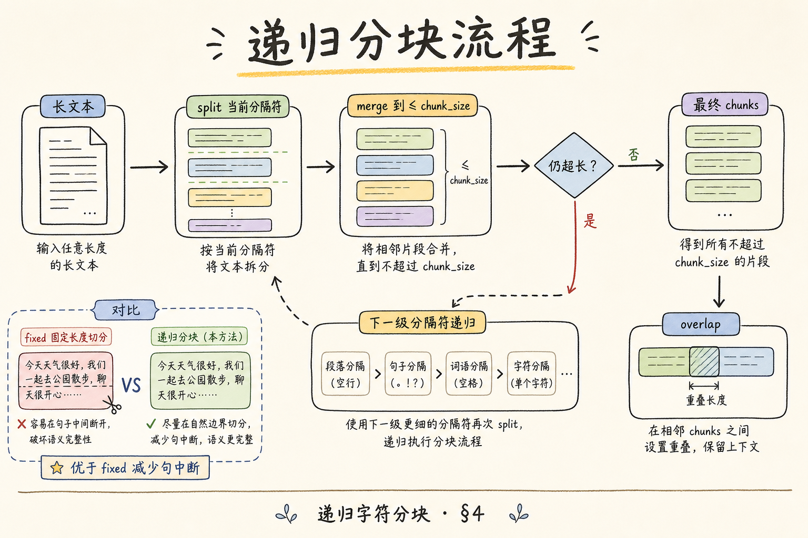
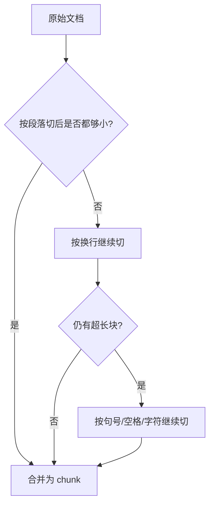
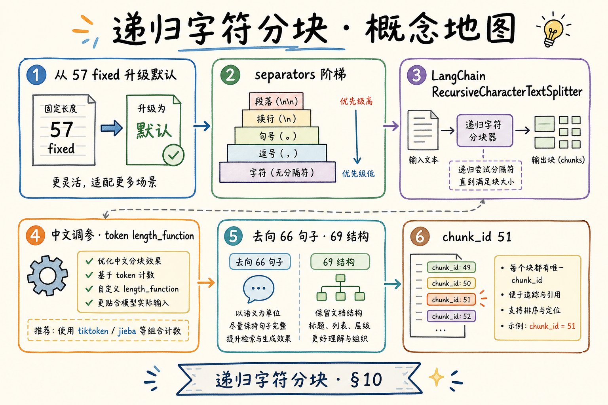

# 企业 RAG 分块（二）：递归字符分块完全指南

固定长度分块会把段落、列表、代码块硬切开，RAG 检索时经常捞到“半句话”。**递归字符分块**（Recursive Character Chunking）先按段落、换行、句号等自然分隔符尝试切分，实在放不下再退到更细粒度。通俗说，它像切蛋糕：先沿完整块切，切不动才用小刀。

读完本文，你应能说清它解决什么问题、怎么配置分隔符、如何做最小实验，并知道它不是语义分块。

---

## 目录

1. [前言：为什么固定长度不够](#1-前言为什么固定长度不够)
2. [本文边界与动手路径](#2-本文边界与动手路径)
3. [递归字符分块是什么](#3-递归字符分块是什么)
4. [分隔符优先级怎么工作](#4-分隔符优先级怎么工作)
5. [最小可运行示例](#5-最小可运行示例)
6. [chunk_size 与 overlap](#6-chunk_size-与-overlap)
7. [在 RAG 入库中的位置](#7-在-rag-入库中的位置)
8. [调参方法与观察指标](#8-调参方法与观察指标)
9. [先错后对：常见翻车](#9-先错后对常见翻车)
10. [总结与下一步](#10-总结与下一步)

---

## 1. 前言：为什么固定长度不够

企业文档常有标题、列表、表格和代码。如果按每 500 个字符硬切，可能把“适用条件”和“例外条款”切到两个 chunk，检索时只召回一半，模型就容易答偏。

递归字符分块的目标不是理解语义，而是尽量保留文本的自然边界：优先段落，其次换行，再其次句子，最后才逐字切开。

## 2. 本文边界与动手路径

本文讲的是分块阶段的工程方法，不讲 embedding 模型、向量库选型和语义聚类。动手路径如下：

| 步骤 | 你做什么 | 验收 |
|------|----------|------|
| A | 准备一段含标题、列表、长段落的文本 | 能看见自然结构 |
| B | 用递归分隔符切分 | chunk 不再随意断句 |
| C | 调整 `chunk_size` 与 `chunk_overlap` | 命中 chunk 可读 |
| D | 对比固定长度切分 | 能解释差异 |

## 3. 递归字符分块是什么

**递归字符分块**：给定一组分隔符，先用最粗的分隔符尝试切文本；如果某块仍超过 `chunk_size`，就用下一个更细的分隔符继续拆。






这张图的结论是：递归分块不是一次切完，而是从粗到细逐级退让。

## 4. 分隔符优先级怎么工作

常见中文技术文档可以从这组分隔符起步：

```python
separators = ["\n\n", "\n", "。", "，", " ", ""]
```

顺序很重要：`"\n\n"` 代表段落，优先保留完整段落；空字符串放最后，表示没有自然边界时才逐字符切。


不要把空字符串放前面，否则算法一开始就退化成硬切，前面配置的自然分隔符都失效。

## 5. 最小可运行示例

下面示例用 LangChain 的 `RecursiveCharacterTextSplitter`。如果没有安装，先执行：

```bash
pip install langchain-text-splitters
```

```python
from langchain_text_splitters import RecursiveCharacterTextSplitter

text = """
# 报销制度

员工出差前应提交审批单。审批通过后，方可预订交通和住宿。

住宿标准：一线城市每晚不超过 600 元，其他城市每晚不超过 400 元。

例外情况：项目负责人书面批准后，可以临时提高标准。
"""

splitter = RecursiveCharacterTextSplitter(
    chunk_size=80,
    chunk_overlap=15,
    separators=["\n\n", "\n", "。", "，", " ", ""],
)

chunks = splitter.split_text(text)
for i, chunk in enumerate(chunks, 1):
    print(f"--- chunk {i} ---")
    print(chunk)
```

预期结果不是每块长度完全相同，而是尽量让标题、规则和例外说明保持在可读边界内。

## 6. chunk_size 与 overlap

`chunk_size` 控制每块最大长度，`chunk_overlap` 控制相邻 chunk 重叠多少。重叠的作用是防止答案所需信息刚好落在切分边界。

| 参数 | 太小的问题 | 太大的问题 | 起步建议 |
|------|------------|------------|----------|
| `chunk_size` | 上下文碎、召回多 | 单块太长、噪声多 | 300-800 token 等价长度 |
| `chunk_overlap` | 边界信息丢失 | 成本和重复率升高 | 10%-20% |

不要只看 chunk 数量，还要抽样读 chunk 是否像“可引用的小段落”。

## 7. 在 RAG 入库中的位置

递归字符分块位于解析清洗之后、embedding 之前。


从图里应得出的结论是：分块前清洗质量很关键。如果页眉、页脚、版权声明没清掉，递归分块会认真保留这些噪声。

## 8. 调参方法与观察指标

建议用 20 个真实问题做小实验：每次只改一个参数，观察召回结果。

| 指标 | 怎么看 | 说明 |
|------|--------|------|
| chunk 可读性 | 人工抽样 20 块 | 是否完整表达一个点 |
| 命中率 | 问题能否召回正确制度 | 检索层指标 |
| 重复率 | 相邻 chunk 是否大量重复 | overlap 过大信号 |
| 成本 | chunk 数与总 token | 影响 embedding 成本 |

如果 chunk 很可读但召回差，问题可能在 embedding 或查询改写；如果召回命中但答案缺证据，可能是 overlap 或分隔符需要调整。

## 9. 先错后对：常见翻车

**错：把空字符串放在第一位。** 结果会接近逐字硬切。正确做法是从段落到字符逐级退让。

**错：只追求 chunk 数少。** chunk 少不代表质量高，过长 chunk 会夹带无关信息。

**错：把递归分块当语义分块。** 它不理解“这两段是否同一主题”，只按字符和分隔符工作。

**错：不清洗文档就分块。** 页眉页脚会污染每个 chunk，检索时反复出现无用内容。



## 10. 总结与下一步

递归字符分块解决的是固定长度硬切带来的可读性问题。它通过分隔符优先级尽量保留自然文本边界，再用 `chunk_size` 和 `chunk_overlap` 控制块大小与边界信息。


下一步可以读向量库篇，例如 [76 Chroma](76.chroma-vector-db-tutorial.md)，把这些 chunk 写入可检索的 collection。
