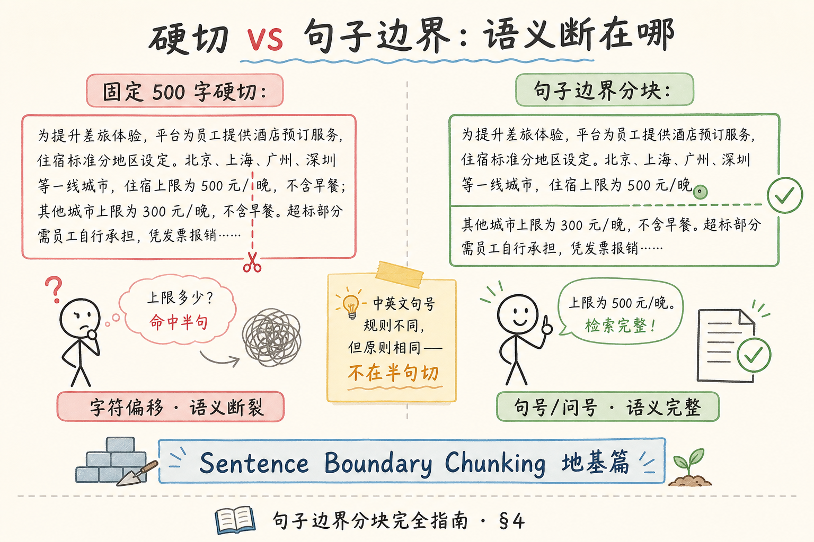
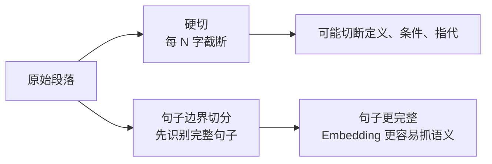
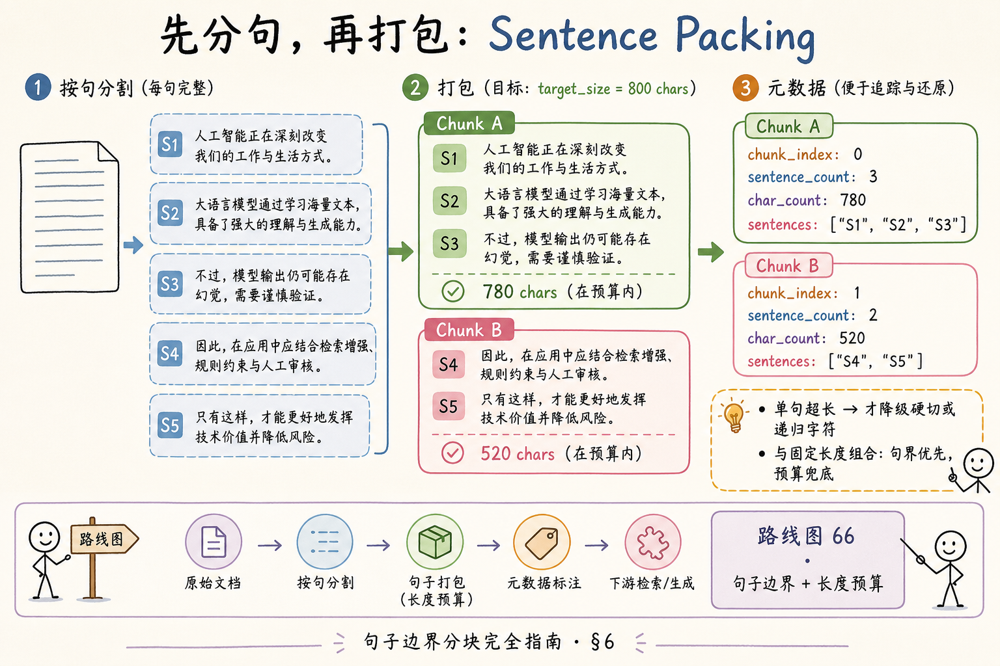
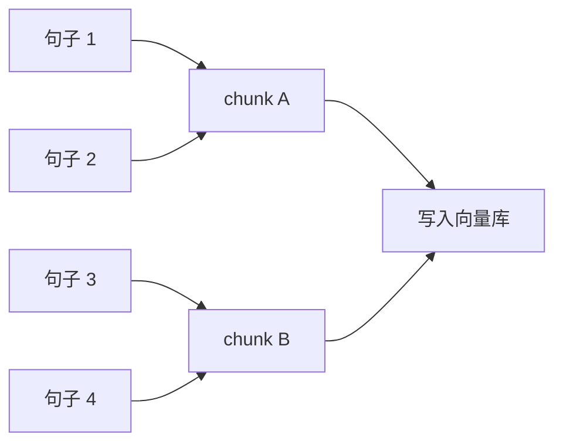
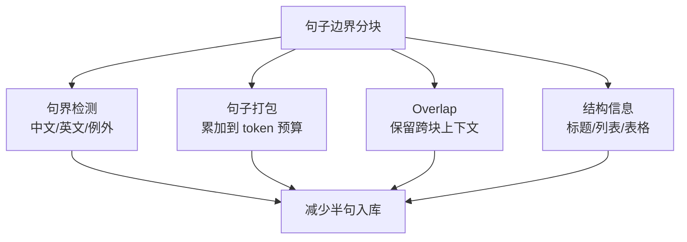

# RAG 数据采集与解析（十四）：句子边界分块完全指南

> 固定长度分块（路线图 **64**）按字符数一刀切，常把「500 元/晚」切成「500 元/」和「晚，不含…」——用户问住宿上限，检索命中半句，模型只能猜。更温和的第一步是 **句子边界分块**（Sentence Boundary Chunking）：先在 **句号、问号、感叹号** 处断开，再把完整句子 **打包** 进 chunk 预算。这篇是 [企业 RAG 路线图](ENTERPRISE_RAG_ROADMAP.md) **C 轨第十四篇**（路线图第 **66** 条），定位 **地基篇**：讲清中英文句界规则、为何优于硬切、与固定长度如何组合，并提供 **可运行最小示例**。前置：路线图 **64～65**（固定长度 / 递归字符概念）；后续 [60 Overlap](60.chunk-overlap-tutorial.md)、[61 Chunk size](61.chunk-size-tradeoff-tutorial.md)。

---

## 目录

1. [前言：半句入库，检索必输](#1-前言半句入库检索必输)
2. [本文边界与动手路径](#2-本文边界与动手路径)
3. [分块在 RAG 链路中的位置](#3-分块在-rag-链路中的位置)
4. [硬切 vs 句子边界：一眼看懂](#4-硬切-vs-句子边界一眼看懂)
5. [句界检测：中英文句号与例外](#5-句界检测中英文句号与例外)
6. [句子打包：累加到 chunk 预算](#6-句子打包累加到-chunk-预算)
7. [与固定长度组合：句界优先，预算兜底](#7-与固定长度组合句界优先预算兜底)
8. [最小实战：Python 分句与打包](#8-最小实战python-分句与打包)
9. [先错对对：两种典型切法事故](#9-先错对对两种典型切法事故)
10. [综合概念地图](#10-综合概念地图)
11. [常见陷阱与 FAQ](#11-常见陷阱与-faq)
12. [总结与系列下一步](#12-总结与系列下一步)

---

## 1. 前言：半句入库，检索必输

企业制度、产品手册、FAQ 的正文，绝大多数是 **完整句子** 串起来的。人类阅读时，句号就是「这一意思说完了」的信号；向量检索却常常按 **字符偏移** 切 chunk——语义单元与存储单元 **不对齐**，bad case 就会系统性出现。

**句子边界分块**（Sentence Boundary Chunking）：先识别自然语言中的 **句子结束位置**，以 **整句** 为最小切分单位，再按目标长度把若干句子合并为一个 chunk。  
通俗说：**先按句号切卡片，再把卡片叠成一小摞**，而不是从卡片中间撕一刀。

**Sentence Boundary Detection**（SBD，句界检测）：判断文本中哪里是一句话结束、下一句话开始的算法或规则。  
通俗说：**找句号、问号、感叹号该切的地方**——比「每 500 字切一刀」多一步智能。

**读完本文，你应该能做到：**

1. 说明硬切为何会在 **事实问答** 里制造半句命中。  
2. 列出中文、英文常见的 **句界标点** 与至少两类 **不能切** 的例外。  
3. 描述「先分句 → 再打包到 chunk_size」的两阶段流程。  
4. 解释句界分块与 **固定长度** 如何组合（句界优先，超长句降级）。  
5. 运行 §8 脚本，对样例文本输出带句界的 chunk 列表。

---

## 2. 本文边界与动手路径

**档位：地基篇（C2 分块起点）。**

**本文讲：** 句界直觉、中英文标点、打包算法、与固定长度组合、最小 Python 示例、事故对照。  
**本文不讲：** spaCy 多语言模型训练、法律判例级分句、PDF 版面还原后的句界、Overlap 专论（见 [60 篇](60.chunk-overlap-tutorial.md)）。

### 2.1 动手路径表

| 步骤 | 你做什么 | 验收 |
|------|----------|------|
| A | 读 §4～§5，找一篇制度 PDF 导出 txt 标 3 个硬切错点 | 能指出半句 |
| B | 读 §6～§7，手算 5 句打包到 size=200 | 块内无断句 |
| C | 跑 §8 脚本，改 `TARGET_CHARS` | 控制台打印 chunk |
| D | 完成 §9 先错对对 | 两种错法各说一条 |
| E | （可选）把输出接到 [25 Embedding](25.embedding-vector-tutorial.md) 流水线 | 块数与硬切对比 |

**环境：** Python 3.10+；§8 仅用标准库 `re`，无第三方依赖。

### 2.2 与路线图前后条的关系

| 条目 | 关系 |
|------|------|
| 路线图 **64** 固定长度 | 本文在其上增加 **句界约束** |
| 路线图 **65** 递归字符 | 单句超长时的 **降级切法** |
| 路线图 **67** Overlap | 句界切完后再加重叠窗口 |
| [38 Markdown](38.markdown-parsing-tutorial.md) | MD 可句界 + 标题 **双层** 策略 |
| [51 chunk_id](51.metadata-chunk-id-tutorial.md) | 分块算法变 → ID 策略要跟着变 |

---

## 3. 分块在 RAG 链路中的位置

典型入库路径：

```text
解析出纯文本 → 清洗 → 分块（本篇）→ Embedding → 向量库 → 检索 → 生成
```

**Chunk**（文本块）：分块策略输出的 **检索最小单元**，长度介于整篇文档与单句之间。  
通俗说：**向量库里的「一张卡片」**，检索时整卡命中。

| 分块策略 | 切在哪里 | 优点 | 缺点 |
|----------|----------|------|------|
| 固定长度 | 第 N 个字符 | 实现极简 | 半句、断词 |
| 递归字符 | `\n\n` → `\n` → 空格 → 硬切 | LangChain 默认友好 | 仍可能断句 |
| **句子边界（本篇）** | 句号等 | 语义完整 | 需处理缩写/小数 |
| 结构感知 | H2/H3 标题 | 章节完整 | 依赖文档结构 |

句子边界是 **低成本高收益** 的升级：不解析 PDF 版面、不建 AST，只要 **干净字符串** 就能做——适合 TXT、简单 HTML 正文、PDF 抽字后的第一站。

### 3.1 从固定长度到句界：升级路径

很多团队的第一版索引器只有三行：

```python
text = open(path).read()
for i in range(0, len(text), 500):
    chunks.append(text[i:i+500])
```

这在 Demo 阶段「能跑」。文档上百份、问题从「你好」变成「二线城市的住宿标准是否含早餐」时，bad case 会 **成片出现**——不是模型变笨，而是 **切块把事实撕碎了**。句子边界是在 **不引入 Markdown 解析、不碰 PDF 版面** 的前提下，性价比最高的 **第二版升级**：改动通常集中在 **分块模块**，解析与 Embedding 流水线可不动。

| 版本 | 策略 | 适用阶段 |
|------|------|----------|
| v0 | 固定 500 字 | 内部 Demo |
| v1 | 句界 + 打包（本篇） | 纯 TXT / PDF 抽字初上线 |
| v2 | + overlap（60 篇） | 流程类 bad case 仍多 |
| v3 | + 结构 H2（62 篇） | 有 MD/DOCX 标题 |
| v4 | chunk_size 实验表（61 篇） | 规模化评测驱动 |

**Ingestion Pipeline**（入库流水线）：从原始文件到向量库记录的自动化链路。  
通俗说：**文档怎么进库的一整条工厂线**——分块只是其中一个工位，但 bad case 常从这里开始。

### 3.2 为什么「整句」对 Embedding 友好

**Embedding**（向量嵌入）：把文本映射到高维向量，语义相近的文本向量距离近。  
通俗说：**把话变成坐标，意思近的坐标也近**。

Embedding 模型在训练时多见 **完整句子或段落**。半句「住宿上限为 500 元/」缺少谓语宾语闭合，向量 **语义不完整**，与用户问句「一晚多少钱」的相似度会被 **噪声拉偏**。整句「一线城市住宿上限为 500 元/晚。」则是一个 **可独立理解的事实单元**。

这不是说半句永远检索不到——而是 **同样文本量下，整句策略的 hit 质量更稳**，尤其在 **数字、条件、步骤** 类 FAQ 上。

---

## 4. 硬切 vs 句子边界：一眼看懂

读下图，对照同一段制度正文：左边按 500 字硬切，右边按句界切后再打包。




下面这张图对比“硬切”和“句子边界切分”。读图时重点看：硬切只按长度截断，句界切分会尽量保留完整句子。



结论：句子边界切分不是为了“看起来更自然”，而是为了减少半句话入库导致的语义丢失。

对照上图：

**Fixed-size Chunking**（固定长度分块）：按固定字符数或 token 数切分，不关心语义边界。  
通俗说：**切蛋糕按厘米，不管奶油花在哪**。

**Sentence-boundary Chunking**（句子边界分块）：切分点落在 **句子结束符** 之后，保证 chunk 内是 **0 条或多条完整句子**，不在句中开刃。  
通俗说：**只在句号后面下刀**。

典型事故（硬切）：

| 用户问题 | 硬切后果 |
|----------|----------|
| 住宿上限多少？ | 命中「500 元/」缺单位 |
| 报销要几步？ | 步骤 2 在块尾、步骤 3 在下一块 |
| 谁有审批权限？ | 「部门经」和「理及以上」分属两块 |

句界分块 **不能消灭** 所有 bad case——「步骤列表跨多句」仍可能分散在相邻块——但 **单句级事实** 的完整性会大幅提升。跨句语义丢失交给 [60 Overlap](60.chunk-overlap-tutorial.md) 与 [62 结构感知](62.structure-aware-chunking-tutorial.md) 处理。

---

## 5. 句界检测：中英文句号与例外
句界检测的目标是尽量不要把一句完整意思切断。中文句号、英文缩写、编号列表和小数点都会干扰切分规则，所以这一节先建立“哪些符号真的表示句子结束”的判断方式。

### 5.1 常见句界标点

| 语言 | 强句界 | 弱句界（视场景） |
|------|--------|------------------|
| 中文 | `。` `？` `！` `；`（列表项有时当句界） | `…` `——` 引号闭合 |
| 英文 | `.` `?` `!` | `;` 分号句（学术体） |

**Strong Sentence Boundary**（强句界）：高概率表示一句话结束的标点。  
通俗说：**看到就可以考虑切一刀的地方**。

中文里 **全角句号 `。`** 是默认主力；英文 **句号 `.`** 需额外小心——缩写 `Dr.`、`e.g.`、小数 `3.14`、版本号 `v2.0.1` 里的点 **不是句界**。

### 5.2 不能切的典型例外

| 例外 | 示例 | 处理思路 |
|------|------|----------|
| 英文缩写 | `U.S.A.` `Fig. 2` | 缩写表 + 正则负向 |
| 小数/版本 | `3.14` `v1.2.3` | 数字两侧的点不切 |
| 中文三点号 | `等等……` | 合并为一句 |
| 引号/括号未闭合 | `"他说：` | 延迟切分到闭合 |
| URL / Email | `https://a.com/path.` | 域名内点号不切 |
| 列表项 | `1. 第一步` | 编号点非句界 |

生产上 **规则 + 小例外表** 往往够用；多语言、口语、社交媒体可再引入 **spaCy**、**syntok** 等库——地基篇先把 **规则法** 跑通。

### 5.3 中英文混排文档

企业 MD、双语制度常见「中文段落 + English note」交替。建议：

1. **统一先规范化空白**（[46 清洗](46.text-cleaning-tutorial.md)）；  
2. 分句正则 **分别覆盖** 中日韩句号与 ASCII `.?!`；  
3. 对英文段启用 **缩写保护** 再切。

**Mixed-language Document**（混排文档）：同一文件内多种语言段落并存。  
通俗说：**一篇里既有中文制度也有 English appendix**——句界规则要 **两套标点都认**。

### 5.4 分句器选型：规则法 vs 库

| 方案 | 优点 | 缺点 | 何时用 |
|------|------|------|--------|
| 正则 + 例外表（本篇 §8） | 零依赖、可审计 | 英文缩写要维护 | 中文为主、混排不多 |
| **syntok** | 英文 SBD 成熟 | 中文弱 | 英文合同、邮件 |
| **spaCy** `sentencizer` | 多语言 | 模型体积、版本锁定 | 多语混合、口语 |
| **jieba** 分句辅助 | 中文生态 | 与「句界」非同一概念 | 勿与分词混淆 |

**Tokenizer vs Sentence Splitter**：分词把句 **切成词**；分句把段 **切成句**——RAG 分块先要 **分句**，分词在 BM25 或中文检索里另有用场（路线图 **24** 分词）。

### 5.5 实战：三类文本的分句差异

**政策条文（中文为主）：**

```text
员工出差应提前三个工作日提交申请。申请须附行程单与预算表。
```

按 `。` 切 → 2 句，无误。

**技术 README（中英混排）：**

```text
Run pip install foo-bar. See README for config. 默认端口为 8080。
```

需同时认 `.` 与 `。`；`foo-bar` 中的连字符不切；`config.` 后的点 **是句界**。

**枚举列表（弱句界）：**

```text
支持三种方式：一、OA 提交；二、邮件申请；三、现场登记。
```

整段可视为 **一句**（分号连接）或 **按分号切三句**——应用 golden set 验证；FAQ 检索常受益于 **整段一块**（此时应上 [62 结构感知](62.structure-aware-chunking-tutorial.md) 按 H3 切，而非强行分句）。

---

## 6. 句子打包：累加到 chunk 预算

句界检测得到句子序列 `S1, S2, …, Sn` 之后，第二步是 **打包**（Packing）。

读下图：句子像珠子，按顺序串进 chunk，直到接近 `chunk_size` 预算。




下面这张图展示“先分句，再打包成 chunk”的过程。读图时重点看：chunk 的边界由句子累加到预算决定，而不是在句子中间硬截断。



结论：句子打包的核心是“预算内尽量装完整句”。如果下一个句子会超预算，就开新 chunk。

对照上图：

**Sentence Packing**（句子打包）：按文档顺序累加完整句子，当即将超出 `chunk_size` 时开启新 chunk。  
通俗说：**往小箱子里装整句，满了换下一个箱子**。

伪代码逻辑：

```text
current = ""
for sentence in sentences:
    if len(current) + len(sentence) <= TARGET:
        current += sentence
    else:
        emit chunk(current)
        current = sentence
emit chunk(current)  # 最后一块
```

**Chunk Size Budget**（块大小预算）：单个 chunk 允许的最大字符数或 token 数。  
通俗说：**每个 chunk 的「容量上限」**——本篇先用 **字符** 便于初学者手算；上线应用 [27 Token 计数](27.token-counting-billing-tutorial.md) 对齐 Embedding 模型。

### 6.1 单句超长怎么办

若某一句 alone 就超过 `TARGET`（如超长法律条文一句 2000 字）：

1. **优先**：在该句内部找 **分号、逗号** 做次级切（仍优于随机硬切）；  
2. **降级**：对该句 alone 调用 **递归字符分块**（路线图 **65**）；  
3. **记录 metadata**：`split_reason: oversize_sentence`，便于 bad case 归因。

原则：**句界优先，预算兜底**——不要为了凑满 800 字把下一句 **半句** 拽进当前块。

---

## 7. 与固定长度组合：句界优先，预算兜底

句子边界不是要 **取代** 固定长度，而是 **约束** 切点：

| 阶段 | 做什么 |
|------|--------|
| 1. 分句 | SBD 得到句子列表 |
| 2. 打包 | 累加到 `chunk_size` |
| 3. 降级 | 超长句 → 递归字符 |
| 4. （可选）Overlap | 相邻块共享 10～20% 句（见 60 篇） |

**Hybrid Chunking**（混合分块）：多种策略按优先级组合，而非单一算法走天下。  
通俗说：**先按句号切，再按长度装箱，装不下再撕半句**——最后一步尽量少用。

与 [38 Markdown](38.markdown-parsing-tutorial.md) 的关系：MD 有标题时 **结构感知优先**（62 篇），标题 **内部** 仍可用本篇句界打包。优先级建议：

```text
有 H2/H3 → 按节切（62 篇）
节内仍超长 → 句界打包（本篇）
单句仍超长 → 递归字符（65）
```

---

## 8. 最小实战：Python 分句与打包

下面脚本演示：**中文全角句界 + 英文 `.?!` + 简单小数保护**，再打包到 `TARGET_CHARS`。

```python
import re
from dataclasses import dataclass

TARGET_CHARS = 180  # 演示用小一点，生产常用 500~1200 字或按 token

# 在中英文强句界后切分，保留标点在前句末尾
SENT_SPLIT = re.compile(
    r"(?<=[。！？!?])"           # 中文 + 英文 ?!
    r"(?<!\d\.)"                 # 非「数字.」小数（简化）
    r"(?![0-9])"                 # 点后非数字开头
)

@dataclass
class Chunk:
    index: int
    text: str
    sentence_count: int

def split_sentences(text: str) -> list[str]:
    text = re.sub(r"\s+", " ", text.strip())
    parts = [p.strip() for p in SENT_SPLIT.split(text) if p.strip()]
    return parts

def pack_sentences(sentences: list[str], target: int) -> list[Chunk]:
    chunks: list[Chunk] = []
    buf: list[str] = []
    buf_len = 0
    idx = 0

    def flush():
        nonlocal idx, buf, buf_len
        if not buf:
            return
        chunks.append(Chunk(idx, "".join(buf), len(buf)))
        idx += 1
        buf, buf_len = [], 0

    for sent in sentences:
        if len(sent) > target:
            flush()
            # 降级：超长单句单独成块（生产可接递归字符）
            chunks.append(Chunk(idx, sent, 1))
            idx += 1
            continue
        if buf_len + len(sent) > target:
            flush()
        buf.append(sent)
        buf_len += len(sent)
    flush()
    return chunks

SAMPLE = (
    "一线城市住宿上限为 500 元/晚。二线城市为 350 元/晚。"
    "报销须先提交 OA 申请。经理审批通过后，财务在 5 个工作日内打款。"
    "Questions? Contact hr@example.com. "
    "See policy v2.0.1 for details."
)

if __name__ == "__main__":
    sents = split_sentences(SAMPLE)
    print("=== 分句 ===")
    for i, s in enumerate(sents):
        print(f"  S{i}: {s}")
    print("\n=== 打包 chunk ===")
    for c in pack_sentences(sents, TARGET_CHARS):
        print(f"--- chunk {c.index} ({c.sentence_count} 句, {len(c.text)} 字) ---")
        print(c.text)
```

**运行预期：** 每块内句子完整；`v2.0.1` 不会因 `.` 被误切（简化规则下）；最后一块可能未满 `TARGET_CHARS`——**允许末块偏短**。

**建议 metadata 字段：**

| 字段 | 含义 |
|------|------|
| `chunk_index` | 文档内序号 |
| `sentence_count` | 块内句数 |
| `char_start` / `char_end` | 溯源偏移（可选） |
| `split_strategy` | `sentence_boundary` |

与 [51 chunk_id](51.metadata-chunk-id-tutorial.md) 联动：chunk_id 生成应 **编入 version + 分块参数**，避免改 `TARGET_CHARS` 后 index 错位却 ID 不变。

### 8.1 接入 LangChain 的两种写法

**写法 A：自定义 separators**

```python
# 概念示例：LangChain RecursiveCharacterTextSplitter
# separators=["\n\n", "。", ". ", " ", ""]
# 句号优先级高于空格 —— 逼近本篇策略
```

**写法 B：先分句再 CharacterTextSplitter**

```python
# sentences = split_sentences(text)  # 本篇 §8
# chunks = pack_sentences(sentences, target=512)
# 逻辑更清晰，metadata 更好挂
```

团队内 **更推荐写法 B**：单元测试可以针对 `split_sentences` 单测，bad case 归因更快。

### 8.2 样例输出解读

对 §8 的 `SAMPLE` 文本，`TARGET_CHARS=180` 时通常得到 **2～3 个 chunk**：

| chunk | 预期内容要点 |
|-------|--------------|
| 0 | 一线/二线住宿标准两句 |
| 1 | 报销 OA + 经理审批 + 财务打款 |
| 2 | 英文 Questions + policy 版本句 |

若你看到「财务打款」与英文段在同一 chunk，说明 **打包预算** 仍够；若英文单独成块，说明 **预算已满触发 flush**——两种都 **合法**，取决于 `TARGET_CHARS`。

---

## 9. 先错对对：两种典型切法事故
下面这些切块错误表面只是参数选择，实际会直接影响召回和引用：切太碎会丢上下文，切太粗会稀释重点，overlap 用错还会制造重复证据。

### 9.1 错法 A：只要句界，不设 chunk 上限

**现象：** 某制度全文只有 40 句，每句打包成 40 个 chunk，或一句 3000 字单独成块。  
**后果：** 块数爆炸 → Embedding 费用高；或单块过大 → 检索 **语义稀释**（见 [61 篇](61.chunk-size-tradeoff-tutorial.md)）。  
**对法：** 句界 + **明确 chunk_size 预算** + 超长句降级。

### 9.2 错法 B：英文句号一刀切

**现象：** 正则 `(?<=[.])` 切分，`Dr. Smith approved v2.0.1.` 变成三截。  
**后果：** 英文事实碎片化，引用展示荒谬。  
**对法：** 缩写表、小数/版本保护，或英文段用 **syntok** 等库。

### 9.4 错法 C：PDF 未修版式就句界分块

**现象：** 抽字结果是「表3 华东」换行「区销售」——句界在错误位置切。  
**后果：** 整句是 **乱序拼接**，比硬切更「像真的」——幻觉风险升。  
**对法：** 先 [37 版面](37.pdf-layout-tables-tutorial.md) / [42 PyMuPDF](42.pymupdf-tutorial.md) 修顺序，再句界。

### 9.5 对照表（扩展）

| 维度 | 硬切 500 字 | 只分句不打包 | 本篇推荐 |
|------|-------------|--------------|----------|
| 半句命中 | 高 | 低 | 低 |
| 块大小可控 | 是 | 否 | 是 |
| 实现复杂度 | 最低 | 低 | 中低 |
| 跨句步骤 | 仍可能丢 | 仍可能丢 | +Overlap 缓解 |
| PDF 乱序文本 | 同样差 | 同样差 | **先修解析** |
| 可单测性 | 低 | 中 | 高（分句函数） |

---

## 10. 综合概念地图

读下图，把本篇放进 C2 分块策略族谱。


下面这张概念地图总结句子边界分块的关键决策。读图时重点看：分句、预算、overlap 和结构信息要一起考虑。



结论：句子边界分块不是单独技巧，而是固定长度分块向结构感知分块过渡的关键一步。

对照上图，串起全文：

1. **SBD** 找句号 → **Packing** 装预算 → **降级** 处理超长句。  
2. 与 **固定长度** 是 **约束关系**，不是互斥关系。  
3. 下一步 **Overlap** 解决 **块与块之间** 的语义缝；**结构感知** 解决 **章与章之间** 的语义单元。  
4. 改分块参数必须联动 **chunk_id / 重索引**（[49 增量](49.incremental-update-tutorial.md)）。

---

## 11. 常见陷阱与 FAQ

**Q：中文用 `。` 够了，还要管英文吗？**  
A：企业文档混排很常见；只认中文句号会在 English 段回到硬切问题。

**Q：分号 `；` 要不要当句界？**  
A：中文并列分句有时用分号连接 closely related 分句——政策文可切，文学性段落可保守不切。用 bad case 集验证。

**Q：和 LangChain `RecursiveCharacterTextSplitter` 什么关系？**  
A：LangChain 默认分隔符列表含 `\n\n`、`\n`、空格—— **没有句号优先**。你可自定义 `separators=["\n\n", "。", ". ", " ", ""]` 逼近本篇策略；或 **先分句再 Character split**。

**Q：PDF 抽字后直接句界分块行吗？**  
A：可以作第一站，但若 [37 版面](37.pdf-layout-tables-tutorial.md) 乱序，句子本身可能是 **半行拼接**——先修解析再分块。

**Q：句界分块还要 Overlap 吗？**  
A：要。句界保证 **块内** 不断句；Overlap 保证 **块间** 定义与步骤不断裂。见 [60 篇](60.chunk-overlap-tutorial.md)。

**Q：chunk 用字符还是 token 预算？**  
A：Demo 用字符；生产用 **与 Embedding 模型一致的 tokenizer** 计数（[27 篇](27.token-counting-billing-tutorial.md)）。

**Q：一句里有两个句号（引用嵌套）怎么办？**  
A：中文引号内 `。「……。」` 有时整段一句；规则法可 **延迟切分** 到引号闭合；复杂场景用 bad case 加例外。

**Q：空行很多的长 TXT 要先删吗？**  
A：要。[46 清洗](46.text-cleaning-tutorial.md) 合并多余空白，避免「空 chunk」；但 **段落间双换行** 有时暗示话题切换，可保留给递归字符（65）作次级界。

### 11.1 上线前检查清单

| 检查项 | 通过标准 |
|--------|----------|
| 随机抽 20 chunk | 无句中切断（除标注 oversize 降级） |
| 含数字的句 | 「500 元/晚」等同句完整 |
| 英文段 | 缩写、版本号未误切 |
| metadata | 有 split_strategy |
| 改 size 后 | 计划重索引与 chunk_id 升级 |

### 11.2 与评测集联动

建 **20 条** 带 **must_contain 数字或术语** 的问题（如「二线住宿上限」「审批几天」）。句界分块上线前后各跑一遍 **hit@3**——通常 **数字类 hit 上升最明显**，这是验收本篇改动的 **硬指标**，比「感觉更准」可靠。

### 11.3 综合案例：差旅制度段落 walkthrough

原文（连续）：

```text
员工因公出差应遵守本制度。一线城市住宿费用上限为每人每夜 500 元人民币，不含餐饮与市内交通。二线城市上限为 350 元。超标部分须书面说明并经分管副总批准。未经批准的超标费用不予报销。
```

**硬切 500 字（假设仅 120 字，演示第 60 字切）：**

- Chunk A 结尾：「……每人每夜 500 元人民」  
- Chunk B 开头：「币，不含餐饮……」

问「一线住宿上限？」→ 命中 A 时 **缺「币/晚」闭合**。

**句界 + 打包（TARGET=100 字演示）：**

- S1：员工因公出差应遵守本制度。  
- S2：一线城市……500 元人民币，不含餐饮与市内交通。  
- S3：二线城市上限为 350 元。  
- S4～S5：超标与报销句。

Chunk0 = S1+S2（完整一线标准）；Chunk1 = S3+S4+S5。问「一线住宿上限？」→ **整句 500 元** 在同块。

**Sentence Integrity**（句子完整性）：检索单元内 **主谓宾与关键数字不被切断**。  
通俗说：**问多少钱时，块里那句得能独立念完**。

### 11.4 生产配置 YAML 示例

```yaml
chunking:
  version: 2
  strategy: sentence_boundary
  target_tokens: 512
  tokenizer: cl100k_base  # 与 embed 一致
  sbd:
    chinese: ["。", "！", "？", "；"]
    english: [".", "!", "?"]
    protect_patterns:
      - '\d+\.\d+'      # 小数
      - 'v\d+\.\d+\.\d+' # 版本号
      - 'Dr\.|Mr\.|Mrs\.' # 缩写
  oversize_fallback: recursive_char  # 路线图 65
```

**Configuration as Code**（配置即代码）：分块参数 **进 Git**，与 [49 增量](49.incremental-update-tutorial.md) 联动 **chunking.version** 变更触发重索引。

### 11.5 面试速记：三句话讲清句界分块

1. **问题**：固定长度会在 **半句、数字、英文缩写** 处切断，导致检索命中 **不可独立理解** 的片段。  
2. **做法**：SBD 得句子列表 → 按顺序 **打包到 chunk_size** → 超长句 **递归字符降级**。  
3. **边界**：句界只管 **块内**；块间靠 **overlap**（60 篇）；有 **标题** 时结构优先（62 篇）。

### 11.6 与路线图 64～65 的衔接说明

路线图 **64 固定长度** 是 **字符/ token 计数切**；**65 递归字符** 是 **按分隔符优先级切**（`\n\n`、`\n`、空格）。本篇 **句界** 可视为 **递归字符列表里把句号放在最前** 的特化版——三者是 **递进增强**，不是互斥项目。实际工程常写：

```text
separators = ["\n\n", "## ", "### ", "。", ". ", "\n", " ", ""]
```

MD 场景下 `##` 与句号 **同时存在** 时，**标题边界优先于句号**（62 篇），句号用于 **节内** 二次切。

### 11.7 延伸阅读与工具清单

| 工具/库 | 用途 |
|---------|------|
| 标准库 `re` | 规则分句（本篇 §8） |
| syntok | 英文 SBD |
| spaCy | 多语言 sentencizer |
| LangChain TextSplitter | 生产集成 |
| tiktoken | token 计数对齐 embed |

团队 **MVP 阶段** 用 §8 规则法足够；**bad case 集中在英文合同** 时再引入 syntok，避免 **过早依赖** 大模型分句。

**最后提醒**：句界分块改的是 **检索单元边界**——若上游 [46 清洗](46.text-cleaning-tutorial.md) 把换行全删成一行，句界仍有效，但 **段落话题边界** 会丢失；若上游 PDF 抽字乱序，句界 **救不了** 乱序——请先修 **解析质量** 再谈分块。

---

## 12. 总结与系列下一步

1. **硬切** 在 FAQ/数字类问题上系统性制造半句命中。  
2. **句子边界分块** = 先 SBD，再 **打包** 到 chunk_size，超长句 **降级**。  
3. 中英文 **句号规则不同**，英文要防缩写与小数。  
4. 与固定长度是 **组合关系**；MD 有结构时 **结构优先**（62 篇）。  
5. 改参数 → 重索引 → 更新 chunk_id 策略。

### 12.1 系列下一步

| 目标 | 阅读 |
|------|------|
| Overlap 重叠窗口 | [60 chunk-overlap](60.chunk-overlap-tutorial.md) |
| Chunk size 调参 | [61 chunk-size-tradeoff](61.chunk-size-tradeoff-tutorial.md) |
| 结构感知分块 | [62 structure-aware](62.structure-aware-chunking-tutorial.md) |
| chunk 元数据 | [51 chunk_id](51.metadata-chunk-id-tutorial.md) |

### 12.2 学习目标自检

- [ ] 能画「分句 → 打包 → 降级」三步  
- [ ] 能举 2 个英文不能切 `.` 的例子  
- [ ] 跑通 §8 脚本并解释输出  
- [ ] 完成 §9 先错对对  

---

> **初学者可能仍困惑的点**  
> - 句界分块 **不会** 让 chunk 大小完全相等——末块偏短是正常的。  
> - 「整句」不等于「完整答案」——多句步骤仍要 Overlap 或结构切。  
> - 规则法在 80% 企业 TXT/MD 上够用；剩下 20% 再引 NLP 库不迟。  
> - 下一篇专讲 **Overlap**：用存储换边界安全。
