# WebSocket 与长连接完全指南：从轮询到实时推送，让服务端主动「开口说话」

> 你是否还在用「每 3 秒轮询一次」的方式检查新消息？前端每隔几秒就朝服务器大喊一声「有新消息吗？」，服务器只能回答「没有」。99% 的请求都是白费力气的空查询。这篇教程从零带你掌握 WebSocket，用真正的长连接替代轮询，让服务端在数据到达的第一时间主动推送给客户端。

---

## 目录

1. [前言：一个轮询程序员的崩溃](#1-前言一个轮询程序员的崩溃)
2. [为什么需要 WebSocket——从写信到打电话](#2-为什么需要-websocket从写信到打电话)
3. [WebSocket 协议解密](#3-websocket-协议解密)
4. [浏览器端 WebSocket 实战](#4-浏览器端-websocket-实战)
5. [Python 服务端 WebSocket 实战](#5-python-服务端-websocket-实战)
6. [实战案例一：实时聊天室](#6-实战案例一实时聊天室)
7. [实战案例二：实时数据看板](#7-实战案例二实时数据看板)
8. [心跳与断线重连](#8-心跳与断线重连)
9. [WebSocket vs SSE vs 长轮询](#9-websocket-vs-sse-vs-长轮询)
10. [生产环境部署](#10-生产环境部署)
11. [安全注意事项](#11-安全注意事项)
12. [最佳实践与避坑指南](#12-最佳实践与避坑指南)
    - [12.3 什么时候不必用 WebSocket](#123-什么时候不必用-websocket)
    - [12.4 常见踩坑实录](#124-常见踩坑实录)
13. [总结](#13-总结)

---

## 1. 前言：一个轮询程序员的崩溃

凌晨两点，服务器监控告警响了。你打开 Grafana，看到一条令人窒息的内存曲线——从午夜开始缓慢爬升，凌晨两点冲破 90%，两点半触顶 100%。

排查两小时后发现，不是内存泄漏，是你在三个月前写的那段代码：

```javascript
// 聊天消息轮询——每 2 秒查一次
setInterval(async () => {
    const res = await fetch('/api/messages?since=' + lastTimestamp);
    const data = await res.json();
    if (data.length > 0) {
        renderMessages(data);
    }
}, 2000);
```

这看起来人畜无害的代码，在 500 个用户同时在线时，产生了什么效果？

500 个用户 × 每 2 秒轮询一次 × 持续 8 小时 ≈ **720 万次 HTTP 请求**，其中真正有新消息的不到 2 万次——**99.8% 是空轮询**。每次请求还要承担 TCP/TLS 握手、HTTP 头、数据库查询等开销，内存和连接数就这样被慢慢拖垮。

这就是轮询的本质问题：**客户端不停敲门问「有新消息吗」，服务器除了反复说「没有」，什么也做不了。** 而且为了降低延迟（用户不想等），你只能把轮询间隔越调越短——形成恶性循环。

**WebSocket 是如何解决这个问题的？**

建立一次连接后，双方随时互发消息——服务器有新数据立刻推送，不必等客户端再来问：

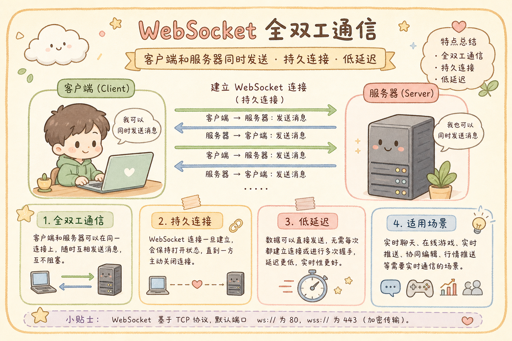

对照上图：轮询是「问一次答一次」的短连接风暴；WebSocket 是「拨通电话后持续通话」。
**读完你能做什么：** 用浏览器 + Python 跑通本地 WebSocket 聊天 demo；理解心跳、重连与 wss://；能判断 WebSocket / SSE / 普通 HTTP 该选谁。

**环境要求：** Python 3.10+；示例服务端用 `fastapi` + `uvicorn` 或 `websockets` 库。

---

## 2. 为什么需要 WebSocket——从写信到打电话

### 2.1 HTTP 的局限性

HTTP 协议在设计之初就是为了「请求-响应」模式——**客户端发起请求，服务器返回响应**。底层 TCP 连接在 HTTP/1.1 起可复用（长连接），HTTP/2/3 也会复用连接，但**应用层语义**仍是「你问一句、我答一句」——服务器不能像 WebSocket 那样，在同一条双向通道里随时主动推送业务消息。

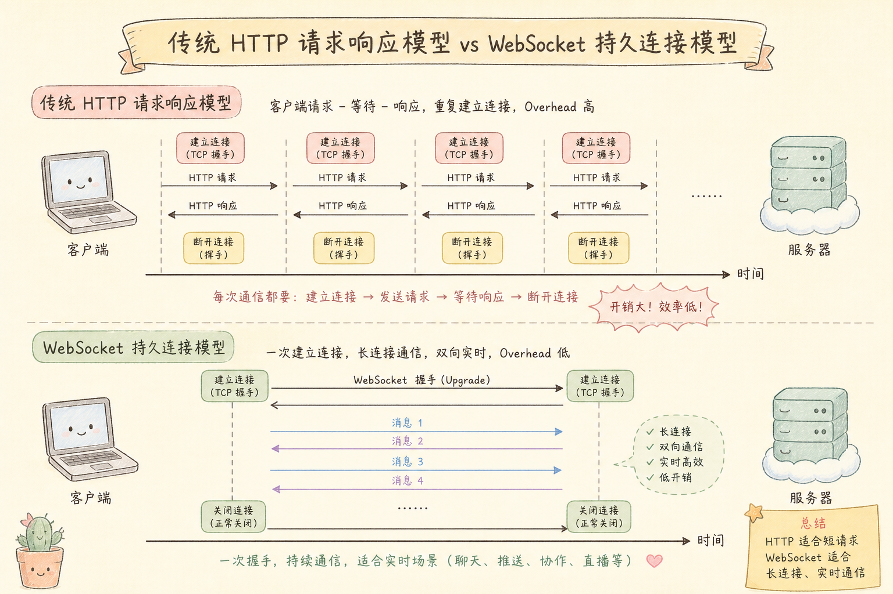


这种模式对于「获取网页」「提交表单」非常合适，但对于以下场景就力不从心了：

- 聊天消息（用户需要实时收到新消息）
- 股票行情（价格每秒钟都在变）
- 游戏状态（玩家的每一步都要广播给其他人）
- 协作编辑（多个人同时改一个文档）
- 实时监控（服务器指标需要持续推送到看板）

这些场景的共同特点：**服务器有数据时，需要立即告诉客户端。**

### 2.2 实时通信的四种方式——从写信到打电话

下面用「写信到打电话」类比四种方案；读图时重点看**延迟、服务器压力、是否双向**四列。

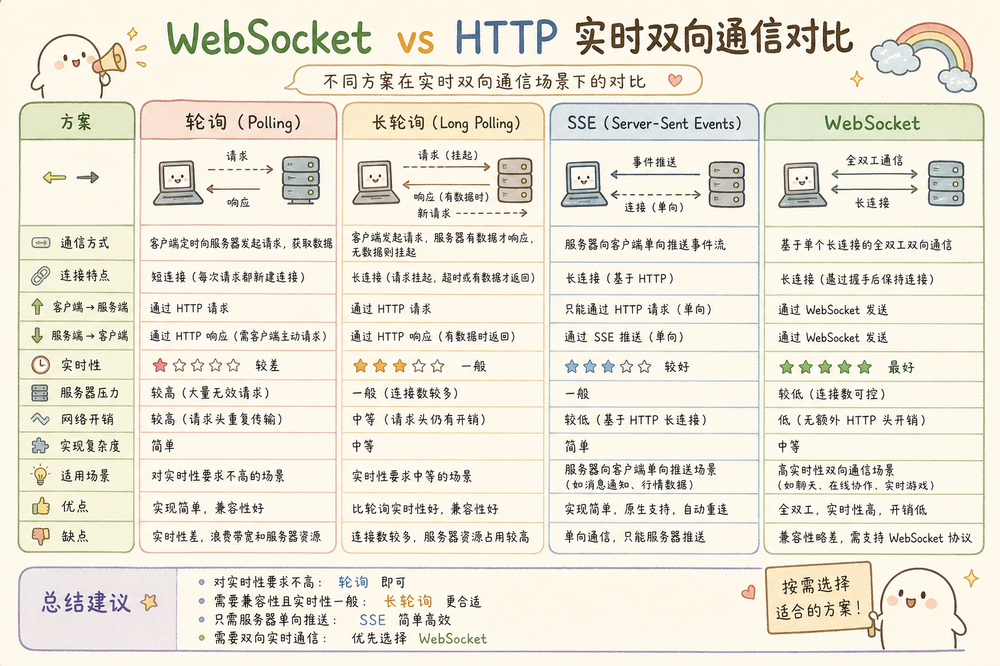

对照上图：**短轮询**像反复敲门；**长轮询**像在门口等；**SSE**像单向广播；**WebSocket**像通电话——需要双向即时互动时选 WebSocket。

### 2.3 为什么不用 HTTP/2 或 HTTP/3 替代

你可能听说过 HTTP/2 支持多路复用，HTTP/3 更快。那为什么还需要 WebSocket？

```
HTTP/2 的多路复用让多个请求可以共用一个 TCP 连接，
但它本质上还是「请求-响应」——客户端不发请求，服务器通常不能主动推业务数据。

HTTP/2 的 Server Push 曾用于推送 CSS/JS 等静态资源，
不适合聊天、行情这类业务实时消息，且多数浏览器已弃用。

HTTP/3 主要改进在传输层（UDP-based QUIC），应用层模型不变。

单向推送仍可用 SSE（Server-Sent Events）或 HTTP 流式响应实现；
WebSocket 则是「全双工、低延迟、持续交互」场景的更合适选择——
客户端和服务器可以随时、独立地向对方发送数据。
```

---

## 3. WebSocket 协议解密

### 3.1 从 HTTP 开始的魔法——握手

WebSocket 连接从一个普通的 HTTP 请求开始，然后「升级」为 WebSocket 连接：

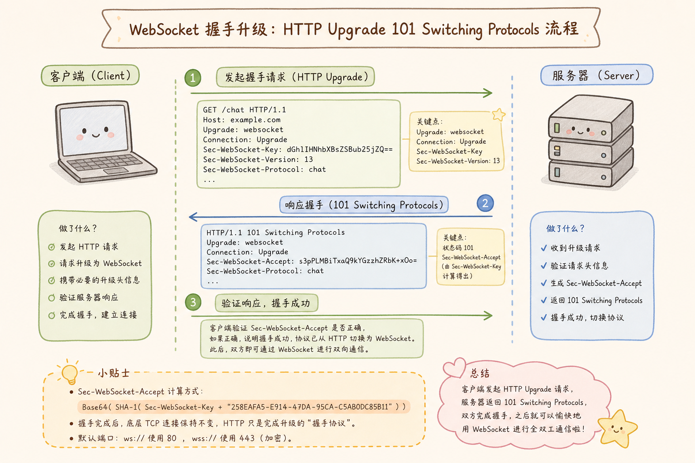


握手的关键点：

1. 客户端发送 `Upgrade: websocket` 头，说「我要升级协议」
2. 服务器同意则返回 `101 Switching Protocols`
3. `Sec-WebSocket-Key` / `Sec-WebSocket-Accept` 是一对挑战-响应，防止意外连接
4. 握手完成后，这条 TCP 连接就不再走 HTTP 了，变成 WebSocket 专用

### 3.2 数据帧格式

握手之后，双方通过「帧」（Frame）来交换数据。WebSocket 帧的结构：

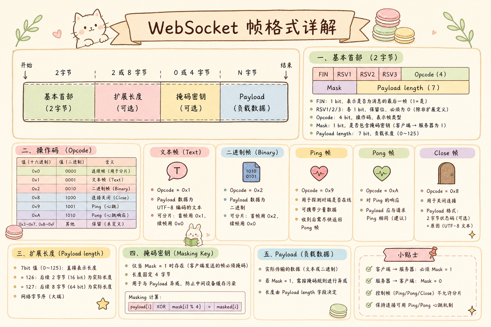


帧的要点：

- **mask**（掩码）：客户端发出的每一帧必须带 4 字节掩码 key，对 payload 做 XOR 扰动。通俗说：防止中间缓存设备误把 WebSocket 帧当成普通 HTTP 响应缓存起来（缓存投毒）。
- **opcode**（操作码）：标识帧类型，如 `0x1` 文本、`0x2` 二进制、`0x8` 关闭、`0x9` Ping、`0xA` Pong。
- **协议级 Ping/Pong**：由底层库处理心跳探测；**浏览器 JS API 不能主动发协议级 Ping**，所以浏览器端常用应用层 JSON 心跳（见 §8）。
- 文本帧（opcode=0x1）和二进制帧（opcode=0x2）是最常用的两种

### 3.3 WebSocket 的连接状态

浏览器 `WebSocket.readyState` 四个值：

| 值 | 常量 | 含义 |
|----|------|------|
| 0 | CONNECTING | 握手中，还不能 `send()` |
| 1 | OPEN | 已连接，可收发 |
| 2 | CLOSING | 正在关闭 |
| 3 | CLOSED | 已关闭 |

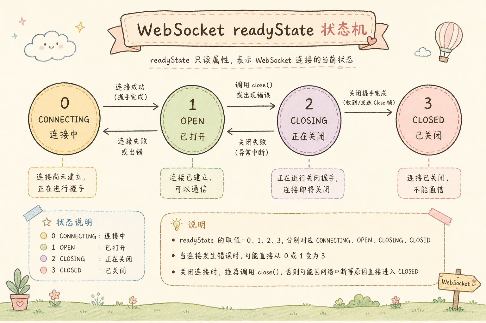

---

## 4. 浏览器端 WebSocket 实战

浏览器通过 `WebSocket` 构造函数建立连接；下图概括 API 的核心用法（事件、`send()`、`close()`）。

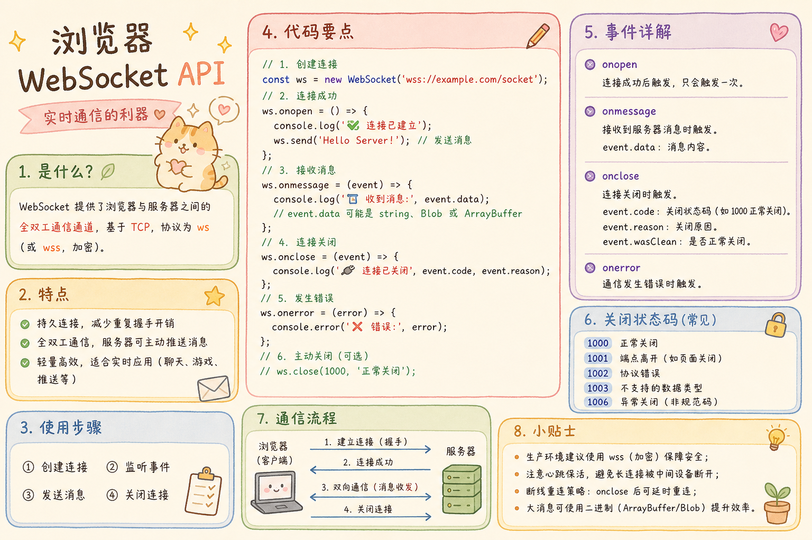

### 4.1 最简单的例子

> **说明：** 下面 URL 是占位地址，不能直接运行。本地练习请用 §5.1 或 §6 的服务端地址。

```javascript
// 创建连接
const ws = new WebSocket('wss://api.example.com/ws');

// 连接成功
ws.addEventListener('open', () => {
    console.log('连接已建立');
    // 发送消息——用 send()，自动转为文本帧
    ws.send(JSON.stringify({ type: 'greeting', text: 'Hello!' }));
});

// 收到消息
ws.addEventListener('message', (event) => {
    console.log('收到消息:', event.data);
    const data = JSON.parse(event.data);
    // event.data 是字符串。如果是二进制，可能是 Blob 或 ArrayBuffer
});

// 连接关闭
ws.addEventListener('close', (event) => {
    console.log(`连接关闭: code=${event.code}, reason=${event.reason}`);
    // 常见关闭码:
    // 1000: 正常关闭
    // 1001: 页面离开 / 服务器关闭
    // 1006: 异常断开（网络断了）
    // 1011: 服务器内部错误
});

// 连接错误
ws.addEventListener('error', (error) => {
    console.error('连接出错:', error);
    // 注意: error 事件不携带具体的错误信息（浏览器安全限制）
    // 你只能知道「出错了」，需要配合 close 事件判断具体原因
});
```

### 4.2 发送文本和二进制数据

下图对比文本、JSON、二进制等消息形态及适用场景。

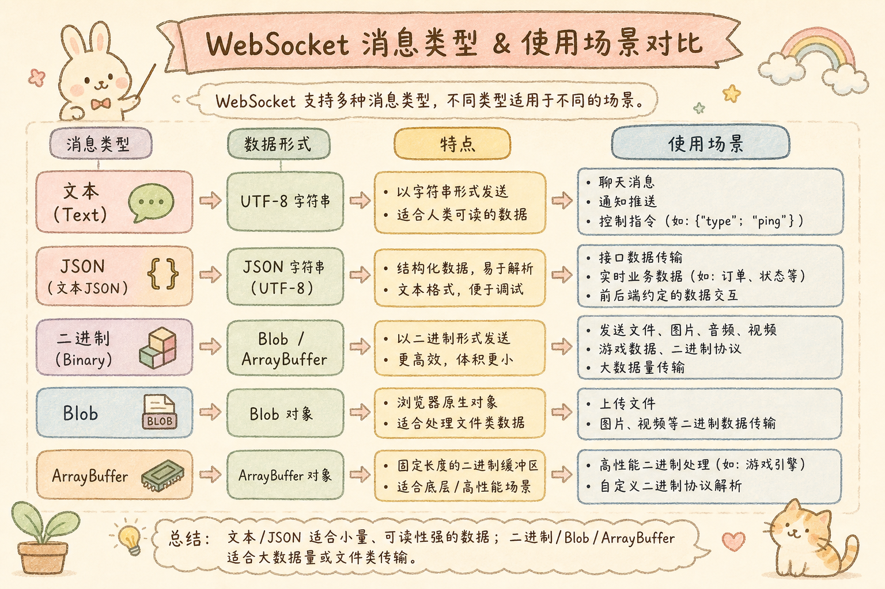

> 以下 `send()` 都应在连接 `open` 后执行，或先判断 `ws.readyState === WebSocket.OPEN`。

```javascript
// 发送文本
ws.send('Hello, Server!');

// 发送 JSON
ws.send(JSON.stringify({
    type: 'chat_message',
    room: 'general',
    text: '大家好！',
    timestamp: Date.now()
}));

// 发送二进制数据 (ArrayBuffer)
const buffer = new ArrayBuffer(16);
const view = new Uint8Array(buffer);
view[0] = 1;
ws.send(buffer);

// 发送 Blob（如文件上传）
const fileInput = document.querySelector('#file');
fileInput.addEventListener('change', () => {
    const file = fileInput.files[0];
    ws.send(file);   // Blob 直接发送
});

// 控制接收到的二进制数据类型
ws.binaryType = 'arraybuffer';  // 默认是 'blob'
ws.addEventListener('message', (event) => {
    if (event.data instanceof ArrayBuffer) {
        const bytes = new Uint8Array(event.data);
        console.log('收到', bytes.length, '字节');
    }
});
```

### 4.3 一个健壮的 WebSocket 客户端

```javascript
class ReconnectingWebSocket {
    constructor(url, options = {}) {
        this.url = url;
        this.options = {
            maxRetries: options.maxRetries || Infinity,
            retryDelay: options.retryDelay || 1000,     // 初始重试间隔(ms)
            maxRetryDelay: options.maxRetryDelay || 30000,
            retryMultiplier: options.retryMultiplier || 1.5,  // 指数退避因子
            heartbeatInterval: options.heartbeatInterval || 30000,
            heartbeatTimeout: options.heartbeatTimeout || 10000,
            ...options
        };

        this.retryCount = 0;
        this.listeners = {};
        this.connect();
    }

    connect() {
        console.log(`[WS] 正在连接 ${this.url}...`);
        this.ws = new WebSocket(this.url);

        // 心跳管理
        this.ws.addEventListener('open', () => {
            console.log('[WS] 连接成功');
            this.retryCount = 0;
            this.startHeartbeat();
            this.emit('open');
        });

        this.ws.addEventListener('message', (event) => {
            // 应用层心跳：收到 pong 则重置超时（与 §8 JSON 格式一致）
            try {
                const data = JSON.parse(event.data);
                if (data.type === 'pong') {
                    this._waitingPong = false;
                    clearTimeout(this._pongTimeout);
                    return;
                }
            } catch (_) { /* 非 JSON 业务消息 */ }
            this.emit('message', event.data);
        });

        this.ws.addEventListener('close', (event) => {
            console.log(`[WS] 连接关闭 (code=${event.code})`);
            this.stopHeartbeat();
            this.emit('close', event);

            if (event.code !== 1000 && event.code !== 1001) {
                this.scheduleReconnect();    // 非正常关闭，重连
            }
        });

        this.ws.addEventListener('error', (error) => {
            console.error('[WS] 连接错误');
            this.emit('error', error);
            // error 后通常会触发 close，在 close 中统一处理重连
        });
    }

    send(data) {
        if (this.ws.readyState === WebSocket.OPEN) {
            this.ws.send(typeof data === 'string' ? data : JSON.stringify(data));
        } else {
            console.warn('[WS] 连接未就绪，消息未发送');
        }
    }

    // ---- 心跳 ----
    startHeartbeat() {
        this._heartbeatTimer = setInterval(() => {
            if (this.ws.readyState === WebSocket.OPEN) {
                this.ws.send(JSON.stringify({ type: 'ping' }));
                this._waitingPong = true;

                // 超时没收到 pong → 强制断开（触发重连）
                this._pongTimeout = setTimeout(() => {
                    if (this._waitingPong) {
                        console.warn('[WS] 心跳超时，断开重连');
                        this.ws.close();
                    }
                }, this.options.heartbeatTimeout);
            }
        }, this.options.heartbeatInterval);
    }

    stopHeartbeat() {
        clearInterval(this._heartbeatTimer);
        clearTimeout(this._pongTimeout);
        this._waitingPong = false;
    }

    // ---- 重连 ----
    scheduleReconnect() {
        if (this.retryCount >= this.options.maxRetries) {
            console.error('[WS] 已达最大重试次数，放弃重连');
            return;
        }

        // 指数退避: delay = min(初始值 × multiplier^retryCount, 最大值)
        const delay = Math.min(
            this.options.retryDelay * Math.pow(this.options.retryMultiplier, this.retryCount),
            this.options.maxRetryDelay
        );

        this.retryCount++;
        console.log(`[WS] ${delay/1000}秒后第 ${this.retryCount} 次重连...`);

        setTimeout(() => this.connect(), delay);
    }

    close() {
        this.stopHeartbeat();
        this.ws.close(1000, '客户端主动关闭');
    }

    // ---- 简易事件系统 ----
    on(event, callback) {
        (this.listeners[event] ||= []).push(callback);
    }
    emit(event, data) {
        (this.listeners[event] || []).forEach(fn => fn(data));
    }
}

// 使用
const ws = new ReconnectingWebSocket('wss://api.example.com/ws', {
    retryDelay: 1000,
    maxRetryDelay: 30000,
    heartbeatInterval: 15000,
});

ws.on('message', (data) => {
    console.log('收到:', JSON.parse(data));
});

ws.send({ type: 'subscribe', channel: 'stock.AAPL' });
```

---

## 5. Python 服务端 WebSocket 实战

### 5.1 用 `websockets` 库——最纯粹的体验

**环境：** `pip install websockets`；在项目目录保存为 `ws_server.py` 后执行 `python ws_server.py`。
**预期：** 终端显示 `WebSocket 服务器运行在 ws://0.0.0.0:8765`；这是**教学级原型**（无鉴权、限流、持久化），与 §6 的 FastAPI 聊天室是**两个独立示例**。

```bash
pip install websockets
```

```python
import asyncio
import websockets
import json

# 存储所有连接的客户端
connected = set()

async def handler(websocket):
    """处理每个 WebSocket 连接"""
    # 注册新客户端
    connected.add(websocket)
    client_addr = websocket.remote_address
    print(f"[+] 客户端连接: {client_addr} (当前 {len(connected)} 人在线)")

    try:
        # 持续接收消息
        async for message in websocket:
            data = json.loads(message)
            print(f"[消息] {client_addr}: {data}")

            # 广播给所有其他客户端
            await broadcast(json.dumps({
                "from": str(client_addr),
                "type": data.get("type", "message"),
                "content": data.get("content", ""),
                "timestamp": data.get("timestamp")
            }), exclude=websocket)

    except websockets.exceptions.ConnectionClosed:
        print(f"[-] 客户端断开: {client_addr}")
    finally:
        connected.remove(websocket)
        print(f"[信息] 当前在线: {len(connected)}")

async def broadcast(message, exclude=None):
    """向所有连接的客户端发送消息"""
    if not connected:
        return
    # 并发发送，某个客户端发送失败不影响其他
    tasks = [
        ws.send(message)
        for ws in connected
        if ws != exclude
    ]
    # return_exceptions=True: 某个发送失败不抛异常
    await asyncio.gather(*tasks, return_exceptions=True)

async def main():
    async with websockets.serve(handler, "0.0.0.0", 8765):
        print("🚀 WebSocket 服务器运行在 ws://0.0.0.0:8765")
        await asyncio.Future()  # 永远运行

asyncio.run(main())
```

这段代码演示「连接注册 + 广播」的核心逻辑；距离生产还缺：鉴权、限流、异常 JSON 处理、消息持久化等（§11、§12 会涉及）。

### 5.2 用 FastAPI——生产级 WebSocket

FastAPI 对 WebSocket 有原生支持：

```python
from fastapi import FastAPI, WebSocket, WebSocketDisconnect
from typing import Dict, Set
import json

app = FastAPI()

# 连接管理器
class ConnectionManager:
    def __init__(self):
        # room_id → {websocket: user_info}
        self.rooms: Dict[str, Dict[WebSocket, dict]] = {}

    async def connect(self, room_id: str, websocket: WebSocket, user_info: dict):
        await websocket.accept()
        if room_id not in self.rooms:
            self.rooms[room_id] = {}
        self.rooms[room_id][websocket] = user_info
        print(f"[+] {user_info.get('name')} 加入 {room_id}")
        await self.broadcast(room_id, {
            "type": "user_joined",
            "user": user_info,
            "online_count": len(self.rooms[room_id])
        })

    def disconnect(self, room_id: str, websocket: WebSocket):
        if room_id in self.rooms:
            user = self.rooms[room_id].pop(websocket, None)
            if user:
                print(f"[-] {user.get('name')} 离开 {room_id}")
            if not self.rooms[room_id]:
                del self.rooms[room_id]

    async def broadcast(self, room_id: str, message: dict, exclude: WebSocket = None):
        if room_id not in self.rooms:
            return
        dead_connections = []
        for ws in self.rooms[room_id]:
            if ws == exclude:
                continue
            try:
                await ws.send_json(message)
            except Exception:
                dead_connections.append(ws)

        # 清理断开的连接
        for ws in dead_connections:
            self.disconnect(room_id, ws)

    def get_online_users(self, room_id: str) -> list:
        if room_id not in self.rooms:
            return []
        return list(self.rooms[room_id].values())

    async def broadcast_all(self, message: dict):
        """向所有房间的所有连接广播（用于 shutdown 通知等）"""
        for room_id in list(self.rooms.keys()):
            await self.broadcast(room_id, message)


manager = ConnectionManager()


@app.websocket("/ws/{room_id}")
async def websocket_endpoint(websocket: WebSocket, room_id: str):
    # 从查询参数获取用户信息
    username = websocket.query_params.get("username", "匿名用户")

    await manager.connect(room_id, websocket, {
        "name": username,
        "joined_at": "now"  # 实际项目用 datetime
    })

    try:
        while True:
            # 接收消息
            raw = await websocket.receive_text()
            data = json.loads(raw)

            # 根据消息类型处理
            msg_type = data.get("type")

            if msg_type == "chat_message":
                await manager.broadcast(room_id, {
                    "type": "chat_message",
                    "user": username,
                    "content": data["content"],
                    "timestamp": data.get("timestamp")
                })

            elif msg_type == "typing":
                await manager.broadcast(room_id, {
                    "type": "typing",
                    "user": username,
                    "is_typing": data.get("is_typing", True)
                }, exclude=websocket)

            elif msg_type == "ping":
                await websocket.send_json({"type": "pong"})

    except WebSocketDisconnect:
        manager.disconnect(room_id, websocket)
        await manager.broadcast(room_id, {
            "type": "user_left",
            "user": username,
            "online_count": len(manager.rooms.get(room_id, {}))
        })
```

### 5.3 WebSocket 的生命周期管理

```python
from contextlib import asynccontextmanager
from fastapi import FastAPI, WebSocket, WebSocketDisconnect
import asyncio

# 在应用启动/关闭时管理后台任务
@asynccontextmanager
async def lifespan(app: FastAPI):
    # 启动时：开启后台任务
    cleanup_task = asyncio.create_task(periodic_cleanup())
    yield
    # 关闭时：清理
    cleanup_task.cancel()
    # 通知所有客户端服务器即将关闭
    await manager.broadcast_all({"type": "server_shutdown"})

app = FastAPI(lifespan=lifespan)


async def periodic_cleanup():
    """定期清理死连接"""
    while True:
        await asyncio.sleep(60)
        # 向所有连接发送 ping，收集无响应的
        for room_id in list(manager.rooms.keys()):
            for ws in list(manager.rooms.get(room_id, {}).keys()):
                try:
                    await ws.send_json({"type": "ping"})
                except Exception:
                    manager.disconnect(room_id, ws)
        print(f"[清理] 当前房间数: {len(manager.rooms)}")
```

---

## 6. 实战案例一：实时聊天室

下面是一个典型的聊天室架构：客户端通过 WebSocket 连到服务器，由**连接管理器**维护长连接，**消息路由器**负责广播，**Room 管理器**划分房间。

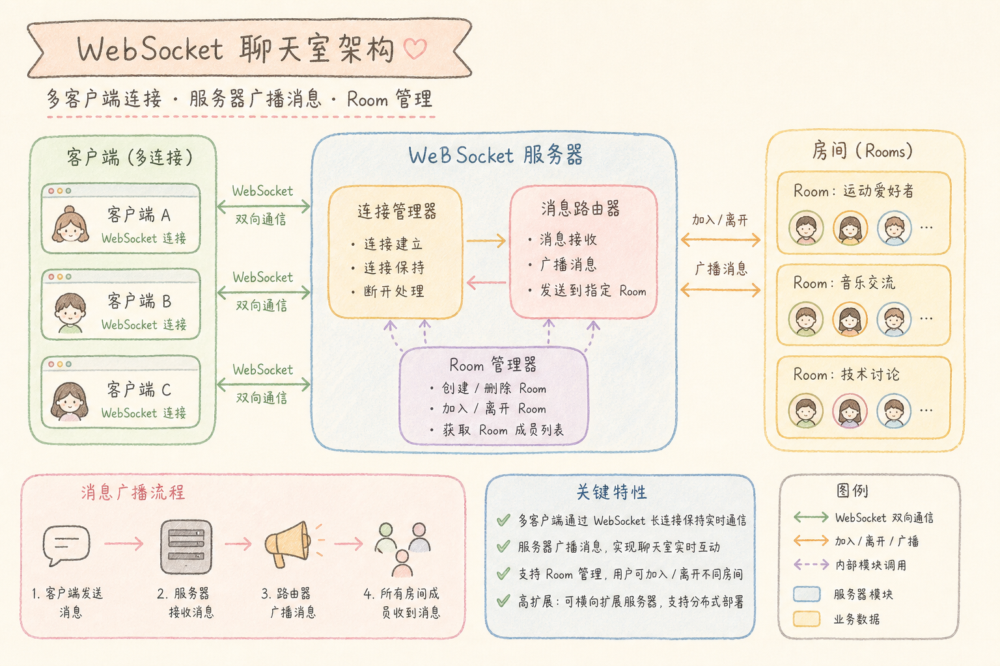

对照上图：用户加入某个 `room_id` 后，发往该房间的消息由路由器广播给房间内所有连接；离开或断线时连接管理器负责清理。

### 6.1 服务端完整代码

**环境：** `pip install fastapi uvicorn`；保存为 `chat_server.py`。
**启动：** `uvicorn chat_server:app --reload --port 8765`
**前端：** 将 §6.2 HTML 存为 `chat.html`，用浏览器直接打开（连接 `ws://localhost:8765/ws/chat/lobby`）。

```python
# chat_server.py
import json
import time
from fastapi import FastAPI, WebSocket, WebSocketDisconnect

app = FastAPI()

class ChatRoom:
    """聊天室管理器"""
    def __init__(self):
        self.connections: dict[str, list[WebSocket]] = {}  # room → [ws]
        self.message_history: dict[str, list[dict]] = {}   # room → [msg]
        self.MAX_HISTORY = 50

    async def join(self, room: str, ws: WebSocket):
        await ws.accept()
        self.connections.setdefault(room, []).append(ws)

        # 发送最近的历史消息
        for msg in self.message_history.get(room, [])[-20:]:
            await ws.send_json(msg)

        await self._broadcast(room, {
            "type": "system",
            "content": f"一位用户加入了房间 (在线 {len(self.connections[room])})",
            "online_count": len(self.connections[room]),
            "timestamp": int(time.time() * 1000)
        })

    async def leave(self, room: str, ws: WebSocket):
        if room in self.connections:
            self.connections[room].remove(ws)
            if not self.connections[room]:
                del self.connections[room]
            else:
                await self._broadcast(room, {
                    "type": "system",
                    "content": f"一位用户离开了房间 (在线 {len(self.connections[room])})",
                    "online_count": len(self.connections[room]),
                    "timestamp": int(time.time() * 1000)
                })

    async def handle_message(self, room: str, sender: WebSocket, data: dict):
        """处理聊天消息"""
        msg_type = data.get("type")

        if msg_type == "chat":
            message = {
                "type": "chat",
                "id": f"msg_{int(time.time() * 1000)}_{id(sender) % 10000}",
                "username": data.get("username", "匿名"),
                "content": data.get("content", ""),
                "timestamp": int(time.time() * 1000),
            }
            # 存入历史
            self.message_history.setdefault(room, []).append(message)
            if len(self.message_history[room]) > self.MAX_HISTORY:
                self.message_history[room] = self.message_history[room][-self.MAX_HISTORY:]

            await self._broadcast(room, message)

        elif msg_type == "ping":
            await sender.send_json({"type": "pong"})

    async def _broadcast(self, room: str, message: dict):
        if room not in self.connections:
            return
        dead = []
        for ws in self.connections[room]:
            try:
                await ws.send_json(message)
            except Exception:
                dead.append(ws)
        for ws in dead:
            await self.leave(room, ws)

chat = ChatRoom()


@app.websocket("/ws/chat/{room_id}")
async def chat_websocket(websocket: WebSocket, room_id: str):
    await chat.join(room_id, websocket)
    try:
        async for msg_text in websocket.iter_text():
            data = json.loads(msg_text)
            await chat.handle_message(room_id, websocket, data)
    except WebSocketDisconnect:
        pass
    finally:
        await chat.leave(room_id, websocket)
```

### 6.2 前端完整代码

```html
<!DOCTYPE html>
<html lang="zh">
<head>
    <meta charset="UTF-8">
    <title>实时聊天室</title>
    <style>
        * { margin: 0; padding: 0; box-sizing: border-box; }
        body { font-family: system-ui; display: flex; justify-content: center;
               background: #f0f2f5; min-height: 100vh; }
        .chat-container { width: 100%; max-width: 600px; display: flex;
                          flex-direction: column; height: 100vh; background: white;
                          box-shadow: 0 2px 12px rgba(0,0,0,.1); }
        .chat-header { padding: 16px; background: #4f46e5; color: white;
                       font-size: 18px; font-weight: bold; text-align: center; }
        .online-badge { font-size: 12px; opacity: .85; margin-top: 2px; }
        .messages { flex: 1; overflow-y: auto; padding: 16px; }
        .message { margin-bottom: 12px; }
        .message.system { text-align: center; font-size: 12px; color: #999; }
        .message .username { font-weight: bold; color: #4f46e5; margin-right: 8px; }
        .message .content { word-break: break-word; }
        .typing-indicator { font-size: 12px; color: #999; padding: 0 16px 8px;
                            font-style: italic; min-height: 20px; }
        .input-area { display: flex; padding: 12px; border-top: 1px solid #eee;
                      background: #fafafa; }
        .input-area input { flex: 1; padding: 10px 14px; border: 1px solid #ddd;
                            border-radius: 20px; font-size: 14px; outline: none; }
        .input-area input:focus { border-color: #4f46e5; }
        .input-area button { margin-left: 8px; padding: 10px 18px; background: #4f46e5;
                             color: white; border: none; border-radius: 20px;
                             cursor: pointer; font-size: 14px; }
        .input-area button:hover { background: #4338ca; }
    </style>
</head>
<body>
<div class="chat-container">
    <div class="chat-header">
        实时聊天室
        <div class="online-badge" id="onlineCount">连接中...</div>
    </div>
    <div class="messages" id="messages"></div>
    <div class="typing-indicator" id="typingIndicator"></div>
    <div class="input-area">
        <input id="messageInput" placeholder="输入消息..." maxlength="500"
               autocomplete="off">
        <button id="sendButton">发送</button>
    </div>
</div>

<script>
class ChatClient {
    constructor(url, username) {
        this.url = url;
        this.username = username;
        this.connect();
    }

    connect() {
        this.ws = new WebSocket(this.url);

        this.ws.onopen = () => {
            console.log('已连接');
            this.addSystemMessage('已连接到聊天室');
        };

        this.ws.onmessage = (event) => {
            const msg = JSON.parse(event.data);

            if (msg.type === 'chat') {
                this.addChatMessage(msg);
            } else if (msg.type === 'system') {
                this.addSystemMessage(msg.content);
                this.updateOnlineCount(msg.online_count);
            } else if (msg.type === 'typing') {
                this.showTyping(msg.username, msg.is_typing);
            }
        };

        this.ws.onclose = (event) => {
            this.addSystemMessage(`连接断开 (${event.code})，3 秒后重连...`);
            setTimeout(() => this.connect(), 3000);
        };

        this.ws.onerror = () => {
            this.addSystemMessage('连接出错');
        };
    }

    send(content) {
        if (this.ws.readyState === WebSocket.OPEN) {
            this.ws.send(JSON.stringify({
                type: 'chat',
                username: this.username,
                content: content,
                timestamp: Date.now()
            }));
            return true;
        }
        return false;
    }

    addChatMessage(msg) {
        const el = document.createElement('div');
        el.className = 'message';
        el.innerHTML = `<span class="username">${this.escape(msg.username)}</span>`
                     + `<span class="content">${this.escape(msg.content)}</span>`;
        document.getElementById('messages').appendChild(el);
        this.scrollToBottom();
    }

    addSystemMessage(text) {
        const el = document.createElement('div');
        el.className = 'message system';
        el.textContent = text;
        document.getElementById('messages').appendChild(el);
        this.scrollToBottom();
    }

    updateOnlineCount(count) {
        document.getElementById('onlineCount').textContent =
            count ? `在线: ${count} 人` : '';
    }

    showTyping(username, isTyping) {
        const el = document.getElementById('typingIndicator');
        el.textContent = isTyping ? `${username} 正在输入...` : '';
    }

    scrollToBottom() {
        const container = document.getElementById('messages');
        container.scrollTop = container.scrollHeight;
    }

    escape(text) {
        const div = document.createElement('div');
        div.textContent = text;
        return div.innerHTML;
    }

    close() {
        this.ws.close(1000, '用户离开');
    }
}

// ---- 初始化 ----
const username = '用户_' + Math.random().toString(36).slice(2, 6);
const client = new ChatClient('ws://localhost:8765/ws/chat/lobby', username);

// 发送按钮
document.getElementById('sendButton').addEventListener('click', () => {
    const input = document.getElementById('messageInput');
    const text = input.value.trim();
    if (text && client.send(text)) {
        input.value = '';
    }
});

// 回车发送
document.getElementById('messageInput').addEventListener('keydown', (e) => {
    if (e.key === 'Enter') {
        document.getElementById('sendButton').click();
    }
});

// 页面关闭时优雅断开
window.addEventListener('beforeunload', () => client.close());
</script>
</body>
</html>
```

---

## 7. 实战案例二：实时数据看板

### 7.1 场景描述

你要做一个运维监控大屏，实时展示服务器的 CPU、内存、网络流量、请求量等指标。后端从消息队列（如 Redis Pub/Sub 或 Kafka）获取指标数据，通过 WebSocket 推送给前端看板。

### 7.2 后端代码

**环境：** `pip install fastapi uvicorn`；保存为 `dashboard_server.py`。
**启动：** `uvicorn dashboard_server:app --reload --port 8765`（与 §6 聊天室端口相同，**不要同时运行两个服务**）。

```python
# dashboard_server.py
import asyncio
import json
import random
import time
from contextlib import asynccontextmanager
from fastapi import FastAPI, WebSocket, WebSocketDisconnect

@asynccontextmanager
async def lifespan(app: FastAPI):
    """应用生命周期：启动模拟数据源，关闭时取消任务"""
    cpu_task = asyncio.create_task(simulate_cpu_metrics())
    req_task = asyncio.create_task(simulate_request_metrics())
    yield
    cpu_task.cancel()
    req_task.cancel()

app = FastAPI(lifespan=lifespan)

class MetricsBroadcaster:
    """指标广播器"""
    def __init__(self):
        self.subscribers: dict[str, set[WebSocket]] = {}  # metric_type → {ws}

    async def subscribe(self, metric_type: str, ws: WebSocket):
        await ws.accept()
        self.subscribers.setdefault(metric_type, set()).add(ws)
        print(f"[订阅] {metric_type} (总订阅: {len(self.subscribers[metric_type])})")

    def unsubscribe(self, metric_type: str, ws: WebSocket):
        if metric_type in self.subscribers:
            self.subscribers[metric_type].discard(ws)

    async def broadcast_metrics(self, metric_type: str, data: dict):
        """推送指标数据给所有订阅者"""
        if metric_type not in self.subscribers:
            return

        message = json.dumps({
            "type": "metrics_update",
            "metric_type": metric_type,
            "data": data,
            "timestamp": int(time.time() * 1000)
        })

        dead = []
        for ws in self.subscribers[metric_type]:
            try:
                await ws.send_text(message)
            except Exception:
                dead.append(ws)

        for ws in dead:
            self.unsubscribe(metric_type, ws)


broadcaster = MetricsBroadcaster()


@app.websocket("/ws/metrics/{metric_type}")
async def metrics_endpoint(websocket: WebSocket, metric_type: str):
    await broadcaster.subscribe(metric_type, websocket)
    try:
        while True:
            # 只接收 ping 维持连接
            data = await websocket.receive_text()
            if json.loads(data).get("type") == "ping":
                await websocket.send_text(json.dumps({"type": "pong"}))
    except WebSocketDisconnect:
        pass
    finally:
        broadcaster.unsubscribe(metric_type, websocket)


# ---- 模拟数据源 ----
async def simulate_cpu_metrics():
    """模拟 CPU 数据（实际项目从消息队列或 Prometheus 取）"""
    while True:
        await broadcaster.broadcast_metrics("cpu", {
            "usage_percent": round(random.uniform(10, 90), 1),
            "cores": 8,
            "load_average": round(random.uniform(0.5, 6.0), 2),
        })
        await asyncio.sleep(2)   # 每 2 秒推送


async def simulate_request_metrics():
    """模拟请求量数据"""
    while True:
        await broadcaster.broadcast_metrics("requests", {
            "qps": random.randint(100, 5000),
            "avg_latency_ms": round(random.uniform(10, 200), 1),
            "error_rate": round(random.uniform(0, 5), 2),
            "status_codes": {
                "200": random.randint(1000, 50000),
                "404": random.randint(10, 200),
                "500": random.randint(0, 50),
            }
        })
        await asyncio.sleep(3)


# 模拟任务在 lifespan 中启动（见文件顶部），不再使用 @app.on_event("startup")
```

### 7.3 前端——实时图表

```html
<!-- 使用 Chart.js 渲染实时曲线图 -->
<script src="https://cdn.jsdelivr.net/npm/chart.js@4"></script>
<canvas id="cpuChart" width="800" height="300"></canvas>

<script>
// 初始化图表
const ctx = document.getElementById('cpuChart').getContext('2d');
const chart = new Chart(ctx, {
    type: 'line',
    data: {
        labels: [],   // 时间轴
        datasets: [{
            label: 'CPU 使用率 (%)',
            data: [],
            borderColor: '#4f46e5',
            backgroundColor: 'rgba(79, 70, 229, 0.1)',
            tension: 0.3,
        }]
    },
    options: {
        responsive: true,
        animation: false,            // 实时场景关掉动画，否则会卡
        scales: {
            y: { min: 0, max: 100 }
        }
    }
});

// 建立 WebSocket
const ws = new WebSocket('ws://localhost:8765/ws/metrics/cpu');
const MAX_POINTS = 60;  // 图表最多显示 60 个点

ws.onmessage = (event) => {
    const msg = JSON.parse(event.data);
    if (msg.type !== 'metrics_update') return;

    const time = new Date(msg.timestamp).toLocaleTimeString();
    const usage = msg.data.usage_percent;

    // 更新图表数据
    chart.data.labels.push(time);
    chart.data.datasets[0].data.push(usage);

    // 维持窗口大小
    if (chart.data.labels.length > MAX_POINTS) {
        chart.data.labels.shift();
        chart.data.datasets[0].data.shift();
    }

    chart.update();
};
</script>
```

---

## 8. 心跳与断线重连

这是 WebSocket 生产部署中最重要的两个话题。没有心跳，你无法知道连接是否还活着。没有重连，断了就永远断了。

### 8.1 为什么需要应用层心跳

TCP 连接可能因 NAT 超时、中间设备静默丢包而「假死」——两端都以为还连着，其实中间早已断开。应用层心跳定期发 Ping/Pong（或 JSON `{type:"ping"}`），超时则主动断开并触发 §8.3 的重连。

典型流程：

```
客户端                          服务器
  │──── ping ──────────────────►│  （每 30 秒）
  │◄─── pong ───────────────────┤  （应立即回复）
  │──── ping ──────────────────►│
  │         （无响应…）          │  ← 连接可能已死
  │         （等待 10 秒）       │
  ├──── 主动 close + 重连 ──────┤
```

关键参数：**心跳间隔**通常 15–30 秒（须短于 NAT/代理空闲超时）；**心跳超时**通常 5–10 秒（超时未收到 pong 则判定断线）。Nginx `proxy_read_timeout` 等代理超时必须大于心跳间隔。

### 8.2 使用协议级 Ping/Pong

```python
# 服务端——使用 websockets 库的内置机制
import asyncio
import websockets

async def handler(websocket):
    """使用协议级 ping/pong"""
    # 方法一: 手动发送 ping
    async def heartbeat():
        while True:
            await asyncio.sleep(30)
            try:
                pong_waiter = await websocket.ping()
                await asyncio.wait_for(pong_waiter, timeout=10)
                print("心跳正常")
            except asyncio.TimeoutError:
                print("心跳超时——客户端可能已断开")
                await websocket.close()
                break
            except websockets.exceptions.ConnectionClosed:
                print("连接已关闭")
                break

    heartbeat_task = asyncio.create_task(heartbeat())

    try:
        async for message in websocket:
            await websocket.send(f"Echo: {message}")
    finally:
        heartbeat_task.cancel()
```

```javascript
// 客户端——也可以用协议级 ping（但浏览器 WebSocket API 不暴露 ping）
// 所以通常用应用层消息模拟
const PING_INTERVAL = 30000;
const PONG_TIMEOUT = 10000;

let pingTimer, pongTimer;
let waitingPong = false;

function startHeartbeat(ws) {
    pingTimer = setInterval(() => {
        if (ws.readyState === WebSocket.OPEN) {
            ws.send(JSON.stringify({ type: 'ping' }));
            waitingPong = true;

            pongTimer = setTimeout(() => {
                if (waitingPong) {
                    console.warn('心跳超时，断开连接');
                    ws.close();  // 触发 onclose → 重连
                }
            }, PONG_TIMEOUT);
        }
    }, PING_INTERVAL);
}

ws.addEventListener('message', (event) => {
    const data = JSON.parse(event.data);
    if (data.type === 'pong') {
        waitingPong = false;
        clearTimeout(pongTimer);
        return;
    }
    // ... 处理业务消息
});
```

### 8.3 断线重连策略

客户端应在 `onclose` 里触发重连，但**不要固定间隔立刻重连**——服务器重启或网络抖动时，密集重连只会雪上加霜。推荐**指数退避（exponential backoff）**：

| 断开次数 | 等待后再连 | 说明 |
|---------|-----------|------|
| 第 1 次 | 1 秒 | 可能是瞬时闪断 |
| 第 2 次 | 2 秒 | |
| 第 3 次 | 4 秒 | 每次翻倍 |
| 第 4 次 | 8 秒 | |
| 第 5 次 | 16 秒 | |
| … | 封顶 30 秒 | 延迟不再增加 |
| 超过 10 次 | 放弃并提示用户 | 避免无限重试 |

为什么用指数退避而不是固定 1 秒一轮？服务器正在重启时，立即重连只会延长它的恢复时间；逐步拉长等待，给服务端喘息空间，也减少无效连接风暴。

```javascript
// 指数退避重连（浏览器端示例）
let retryCount = 0;
const MAX_RETRIES = 10;
const MAX_DELAY_MS = 30_000;

function connect() {
    const ws = new WebSocket('wss://api.example.com/ws');

    ws.addEventListener('open', () => {
        retryCount = 0;  // 连成功后重置计数
    });

    ws.addEventListener('close', () => {
        if (retryCount >= MAX_RETRIES) {
            alert('连接失败次数过多，请检查网络后刷新页面');
            return;
        }
        const delay = Math.min(1000 * 2 ** retryCount, MAX_DELAY_MS);
        retryCount += 1;
        setTimeout(connect, delay);
    });

    return ws;
}
```

**服务端也需要处理重连：**

```python
# 服务端处理重连的常见逻辑
# 客户端在 WebSocket URL 中带上 session_id 或 reconnect_token

@app.websocket("/ws/{client_id}")
async def ws_endpoint(websocket: WebSocket, client_id: str):
    reconnect_token = websocket.query_params.get("token")

    # 如果是重连，恢复之前的会话状态
    if reconnect_token and reconnect_token in pending_sessions:
        session = pending_sessions.pop(reconnect_token)
        # 把旧会话的订阅、状态迁移过来
        await restore_session(websocket, session)
        await websocket.send_json({"type": "session_restored"})
    else:
        await websocket.accept()

    # ... 后续处理
```

---

## 9. WebSocket vs SSE vs 长轮询

### 9.1 横向对比

三种方案在**方向、协议复杂度、浏览器支持、代理友好度**上差异很大。读矩阵时重点看：你的场景是单向还是双向？

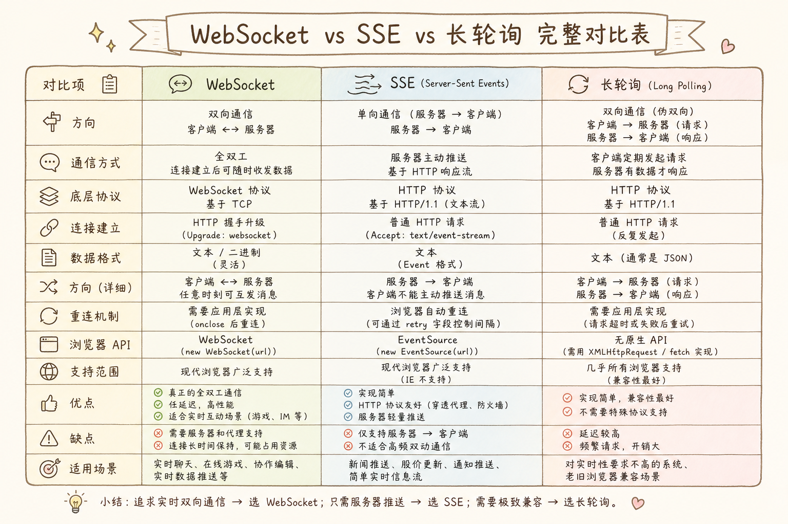

从资源开销角度，三种方案在内存、连接数、带宽、CPU 和延迟上差异同样明显：

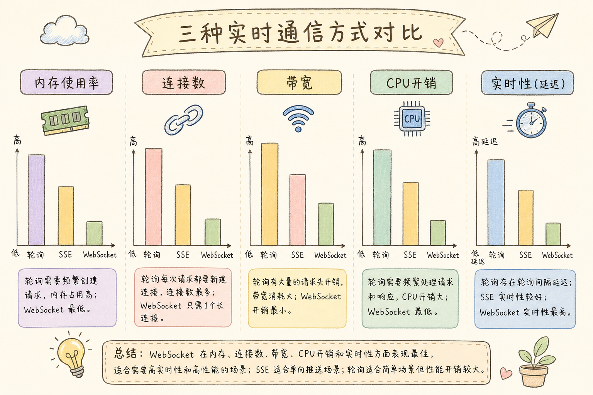

**速记**：只要服务器→客户端单向推送，优先评估 SSE；需要低延迟双向通道再用 WebSocket；长轮询适合 legacy 或极简原型。

### 9.2 SSE 快速入门

SSE（Server-Sent Events）是 HTTP 原生支持的单向推送方案，比 WebSocket 更简单：

```python
# FastAPI SSE 服务端
from fastapi import FastAPI
from fastapi.responses import StreamingResponse
import asyncio
import json

app = FastAPI()

async def event_stream():
    """生成 SSE 事件流"""
    while True:
        data = {"time": "2024-03-15T10:30:00Z", "value": 42}
        # SSE 格式: data: <内容>\n\n
        yield f"data: {json.dumps(data)}\n\n"
        await asyncio.sleep(1)

@app.get("/events")
async def sse_endpoint():
    return StreamingResponse(
        event_stream(),
        media_type="text/event-stream",
        headers={
            "Cache-Control": "no-cache",
            "Connection": "keep-alive",
            "X-Accel-Buffering": "no",   # 关闭 Nginx 缓冲
        }
    )
```

```javascript
// 浏览器端——超级简单，只需要 EventSource
const es = new EventSource('/events');

es.onmessage = (event) => {
    const data = JSON.parse(event.data);
    console.log('收到:', data);
    // 更新 UI...
};

// 特有的命名事件
es.addEventListener('alert', (event) => {
    console.log('警报:', JSON.parse(event.data));
});

// 内置自动重连！
es.onerror = () => {
    // EventSource 会自动重连，你不需要写任何重连代码
    console.log('连接断开，自动重连中...');
};
```

### 9.3 选型决策树

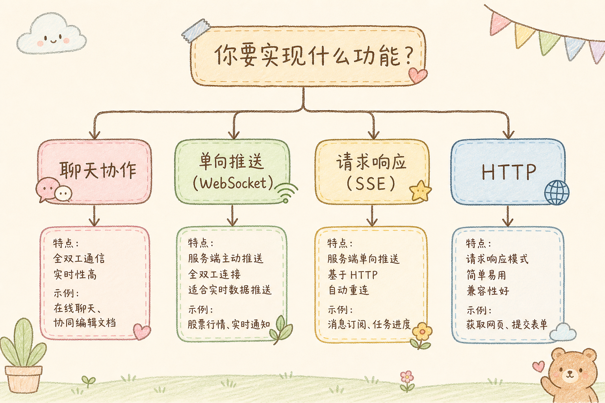

文字摘要：
- **只要服务器推、客户端收** → SSE（实现简单，自带重连）
- **双向实时、低延迟** → WebSocket
- **兼容老环境、实现最快** → 长轮询
- **普通 CRUD、低频查询** → 不必上 WebSocket（见 §12.3）

## 10. 生产环境部署

### 10.1 Nginx 反向代理 WebSocket

```nginx
# nginx.conf
server {
    listen 443 ssl http2;
    server_name api.example.com;

    # SSL 证书配置...
    ssl_certificate     /etc/nginx/ssl/fullchain.pem;
    ssl_certificate_key /etc/nginx/ssl/privkey.pem;

    # API 接口——普通 HTTP 请求
    location /api/ {
        proxy_pass http://backend:8000;
        proxy_set_header Host $host;
        proxy_set_header X-Real-IP $remote_addr;
        proxy_set_header X-Forwarded-For $proxy_add_x_forwarded_for;
        proxy_set_header X-Forwarded-Proto $scheme;
    }

    # WebSocket 接口
    location /ws/ {
        proxy_pass http://backend:8000;

        # === WebSocket 必需的配置 ===
        proxy_http_version 1.1;              # 必须用 HTTP/1.1
        proxy_set_header Upgrade $http_upgrade;
        proxy_set_header Connection "upgrade";

        proxy_set_header Host $host;
        proxy_set_header X-Real-IP $remote_addr;
        proxy_set_header X-Forwarded-For $proxy_add_x_forwarded_for;
        proxy_set_header X-Forwarded-Proto $scheme;

        # === 超时配置——对长连接至关重要 ===
        proxy_read_timeout 3600s;            # 读取超时（1 小时）
        proxy_send_timeout 3600s;            # 发送超时
        proxy_connect_timeout 10s;           # 连接超时 (可以短)

        # === 关闭缓冲——实时推送不能缓冲 ===
        proxy_buffering off;
    }
}
```

> **`proxy_read_timeout` 必须设置得比心跳间隔长**——如果 Nginx 在心跳到达之前就断开了连接，一切重连都是白费。

### 10.2 水平扩展——WebSocket 的天然难题

普通 HTTP 请求可以随便分发到任何服务器。但 WebSocket 连接是**有状态的**——客户端和服务器建立了持久连接，消息路由不能随意切换。

**Redis Pub/Sub** 只解决「跨实例广播」：每个进程仍维护本机连接表；**不保证**离线消息、不持久化、断线重连后订阅需自行恢复。生产还需粘性会话（sticky session）或统一会话层。

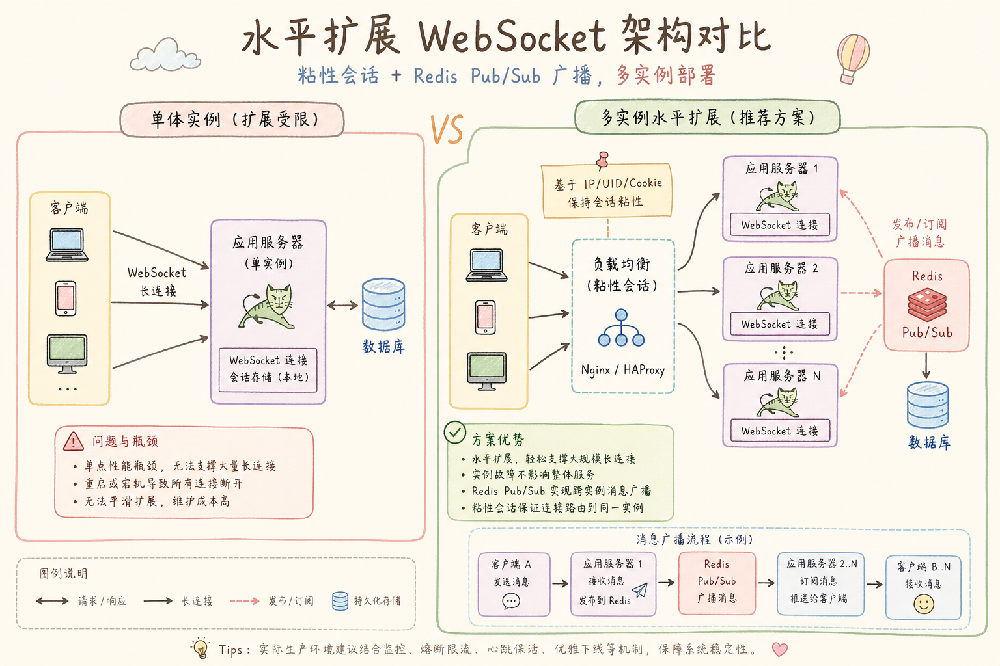

典型架构：客户端连到任意 WebSocket 节点 → 本机维护连接表 → 经 **Redis Pub/Sub** fan-out 到所有节点 → 各节点推送给本机连接。

```python
# 使用 Redis Pub/Sub 的 WebSocket 服务
import redis.asyncio as redis

class DistributedChat:
    def __init__(self):
        self.redis = redis.Redis.from_url("redis://localhost:6379")
        self.local_connections: dict[str, list[WebSocket]] = {}

    async def broadcast(self, room: str, message: dict):
        # 发布到 Redis —— 所有服务器都会收到
        await self.redis.publish(f"room:{room}", json.dumps(message))

    async def listen_redis(self):
        """后台任务: 监听 Redis 消息"""
        pubsub = self.redis.pubsub()
        await pubsub.psubscribe("room:*")

        async for msg in pubsub.listen():
            if msg["type"] != "pmessage":
                continue
            room = msg["channel"].decode().split(":", 1)[1]
            data = json.loads(msg["data"])

            # 推送给本机连接到此房间的客户端
            if room in self.local_connections:
                for ws in self.local_connections[room]:
                    try:
                        await ws.send_json(data)
                    except Exception:
                        pass  # 死连接清理略
```

### 10.3 连接数上限调优

```bash
# Linux 系统层面——增加文件描述符限制
ulimit -n 65535

# /etc/sysctl.conf
net.core.somaxconn = 65535           # 监听队列最大长度
net.ipv4.tcp_max_syn_backlog = 8192  # SYN 队列长度
net.ipv4.ip_local_port_range = 1024 65000
net.ipv4.tcp_tw_reuse = 1            # 快速回收 TIME_WAIT 连接

# Nginx worker_connections
events {
    worker_connections 65535;
    use epoll;              # Linux 下高性能事件模型
}
```

---

## 11. 安全注意事项

### 11.1 五大安全风险及防御

WebSocket 与 HTTP 共用端口与代理链路，但长连接带来更多攻击面。读图时按五条风险逐项核对：TLS、Origin 校验、鉴权、消息校验、限流。

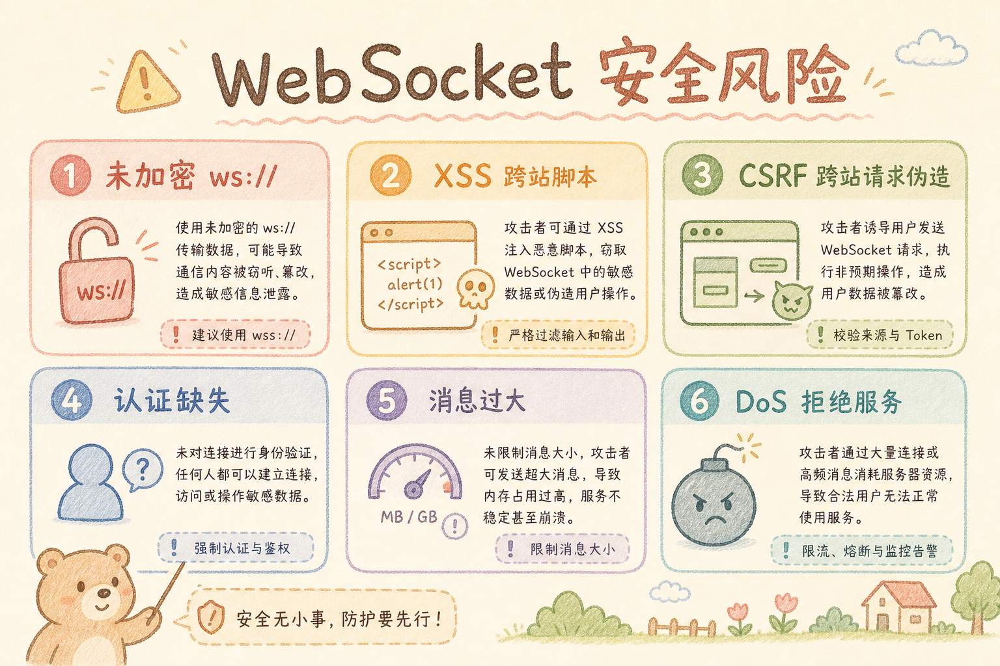

对照上图：生产环境务必 `wss://`；握手阶段校验 `Origin` 与 Token；服务端不信任客户端 JSON，需做 schema 校验与速率限制。

### 11.2 安全实践代码

> 以下为**片段示例**，需自行定义 `ALLOWED_ORIGINS`、`SECRET_KEY`，并 `pip install pyjwt`。

```python
# 服务端安全实践
import json
import jwt
import time
from collections import defaultdict
from fastapi import FastAPI, WebSocket, WebSocketDisconnect

app = FastAPI()

ALLOWED_ORIGINS = {"https://app.example.com", "http://localhost:3000"}
SECRET_KEY = "change-me-in-production"

# 限流器: 每个连接每秒最多 10 条消息
rate_limits = defaultdict(list)

def check_rate_limit(ws_id: str, max_per_second: int = 10) -> bool:
    now = time.time()
    history = rate_limits[ws_id]
    # 清理 1 秒前的记录
    rate_limits[ws_id] = [t for t in history if now - t < 1.0]
    if len(rate_limits[ws_id]) >= max_per_second:
        return False
    rate_limits[ws_id].append(now)
    return True


@app.websocket("/ws")
async def secure_websocket(websocket: WebSocket):
    # 1. 验证 Origin
    origin = websocket.headers.get("origin", "")
    if origin not in ALLOWED_ORIGINS:
        await websocket.close(code=4001, reason="不被允许的来源")
        return

    # 2. 验证 token（从查询参数取）
    token = websocket.query_params.get("token")
    if not token:
        await websocket.close(code=4001, reason="缺少认证 token")
        return

    try:
        payload = jwt.decode(token, SECRET_KEY, algorithms=["HS256"])
        user_id = payload["sub"]
    except jwt.InvalidTokenError:
        await websocket.close(code=4001, reason="token 无效")
        return

    # 3. 通过验证，接受连接
    await websocket.accept()

    try:
        while True:
            # 4. 消息大小限制
            raw = await websocket.receive_text()
            if len(raw) > 65536:  # 64KB
                await websocket.close(code=4002, reason="消息过大")
                break

            # 5. 频率限制
            if not check_rate_limit(user_id):
                await websocket.send_json({
                    "type": "error",
                    "error": "发送过于频繁，请稍后再试"
                })
                continue

            # 6. 处理消息...
            data = json.loads(raw)
            # ...

    except WebSocketDisconnect:
        pass
```

### 11.3 扩展、子协议与压缩（可选阅读）

握手阶段还可协商 **permessage-deflate 压缩**、**子协议**（`Sec-WebSocket-Protocol`）和 **认证**方式。日常业务开发可先跳过，遇到多协议版本或带宽敏感场景再回来查。

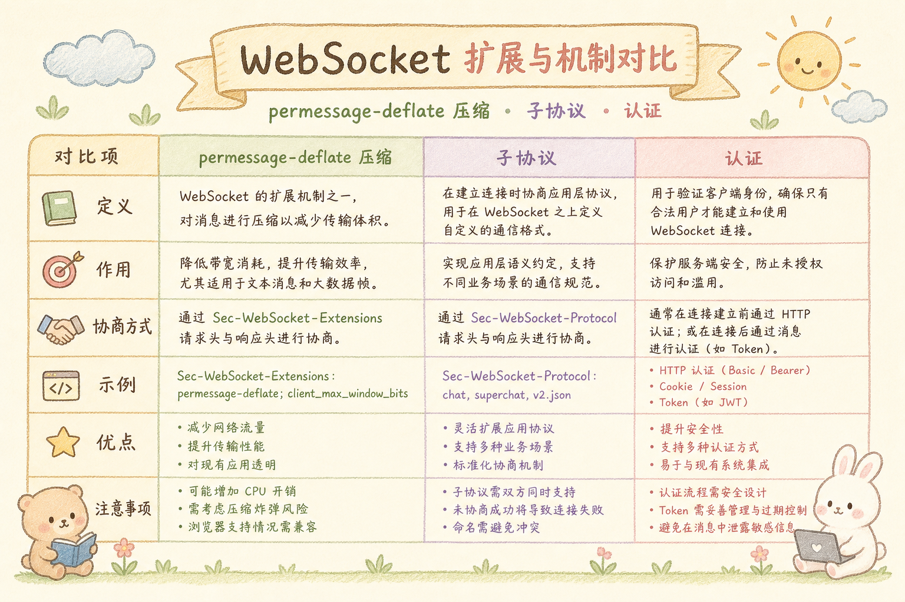

对照上图：`permessage-deflate` 省带宽但有 CPU 开销；子协议需双方同时支持否则握手失败；认证常在握手前用 HTTP Header / Token 完成，与上文 §11.2 代码示例一致。

---

## 12. 最佳实践与避坑指南

### 12.1 八大黄金法则

**法则一：HTTPS 页面必须用 wss://；本地开发可用 ws://**

```javascript
// ✅ 本地开发
const ws = new WebSocket('ws://localhost:8765/ws/chat/lobby');

// ✅ 生产环境（HTTPS 页面必须用 wss）
const protocol = location.protocol === 'https:' ? 'wss:' : 'ws:';
const ws = new WebSocket(`${protocol}//${location.host}/ws`);
```

**法则二：消息用 JSON 封装，带上 type 字段**

```json
// ❌ 裸字符串——无法区分消息类型
"Hello"

// ✅ 结构化的消息
{
    "type": "chat_message",
    "id": "msg_001",
    "payload": {"content": "Hello"},
    "timestamp": 1710498600000
}
```

**法则三：客户端和服务端都要有心跳**

```python
# 实际上几行代码就能避免大量「莫名断开」的问题
# 服务端:
await websocket.ping()  # 每 30 秒

# 客户端:
setInterval(() => ws.send(JSON.stringify({type: 'ping'})), 30000);
```

**法则四：始终处理重连**

无论网络多好，WebSocket 连接总会断——手机锁屏、WiFi 切换、服务器重启、代理超时……

必须在前端实现重连逻辑。第 4.3 节的 `ReconnectingWebSocket` 封装可以直接用。

**法则五：一个用户一个连接，不要开多个**

```javascript
// ❌ 每个页面组件都 new WebSocket
function ChatWidget() {
    const ws = new WebSocket('wss://...');    // 已有一个连接
    // ...
}
function NotificationBell() {
    const ws = new WebSocket('wss://...');    // 又一个连接！
    // ...
}

// ✅ 全局共享一个连接，通过事件分发
const globalWS = new WebSocket('wss://...');
// ChatWidget 和 NotificationBell 都监听同一个 globalWS
```

**法则六：设置合理的超时**

```
Nginx proxy_read_timeout  >  服务端心跳间隔  >  客户端心跳间隔
     3600 秒            >     60 秒        >     30 秒

如果 Nginx 在 60 秒内没看到任何活动就断开，
而你的心跳是每 30 秒一次 → Nginx 每 30 秒看到一次活动
→ 连接永远不会被 Nginx 误杀
```

**法则七：不要在 WebSocket 里传输大文件**

```javascript
// ❌ 通过 WebSocket 发送 50MB 的视频
ws.send(videoBlob);

// ✅ WebSocket 只传信令，文件用 HTTP 或专用协议
// 1. 通过 WebSocket 发: {"type": "file_ready", "fileId": "abc"}
// 2. 客户端通过 HTTP 下载: GET /files/abc
// 3. 或者用 WebRTC Data Channel（P2P 更快）
```

**法则八：做好日志和监控**

```
需要监控的指标:
• 当前活跃连接数
• 每分钟新建/断开连接数
• 消息吞吐量 (条/秒)
• 平均消息处理延迟
• 心跳超时断开的比例
• 按房间/用户维度的连接分布

这些指标帮你:
• 发现内存泄漏（连接数只增不减）
• 定位性能瓶颈
• 提前感知即将打满的连接池
```

### 12.3 什么时候不必用 WebSocket

| 场景 | 更合适的方案 |
|------|--------------|
| 低频状态查询（如「保存了吗」） | 普通 HTTP GET |
| 表单提交、文件上传下载 | HTTP POST / 分块上传 |
| 服务端单向通知（告警、进度条） | SSE 或长轮询 |
| 只需偶尔刷新列表 | 短轮询 + 合理间隔 |
| 强一致、要离线消息队列 | 消息队列 + HTTP，而非裸 WebSocket |

WebSocket 适合：**双向、低延迟、持续在线**（聊天、协作、实时看板、游戏状态同步）。

### 12.4 常见踩坑实录

**坑一：手机锁屏后连接断开**

```
移动端 WebSocket 在 App 切到后台或锁屏时会断开。
→ 监听 visibilitychange 事件，页面恢复可见时检查连接状态
→ 页面隐藏时暂停心跳，恢复时立即检查并可能重连
```

**坑二：Nginx 缓冲导致消息延迟**

```nginx
# 如果不关闭 proxy_buffering，Nginx 可能会攒满缓冲区再转发
# → 实时消息变成了「攒一波再发」
proxy_buffering off;  # WebSocket 必须加这行
```

**坑三：用错 WebSocket 库**

```python
# ❌ ws4py (2014年后基本没更新)
# ❌ gevent-websocket (耦合 gevent)

# ✅ websockets (纯 Python，异步原生，维护活跃)
# ✅ FastAPI/Starlette 内置的 WebSocket (生产级)
# ✅ uvicorn + websockets (最高性能)
# ✅ Django Channels (如果你的栈是 Django)
```

**坑四：在 WebSocket 里做复杂计算**

```python
# ❌ 阻塞事件循环
async def handler(ws):
    async for msg in ws:
        result = heavy_computation(msg)  # 阻塞！其他连接全卡住
        await ws.send(result)

# ✅ 放进线程池
async def handler(ws):
    loop = asyncio.get_running_loop()
    async for msg in ws:
        result = await loop.run_in_executor(None, heavy_computation, msg)
        await ws.send(result)
```

**坑五：把 WebSocket 当数据库**

```
WebSocket 只负责传输——不负责存储。
收到消息后立刻存入数据库/队列，然后再广播。
如果服务重启，内存中的连接会丢，但数据不该丢。
```

---

## 13. 总结

### 核心概念速记

生产环境五条实践：WSS 加密、Token 鉴权、心跳保活、限流防滥用、优雅关闭。

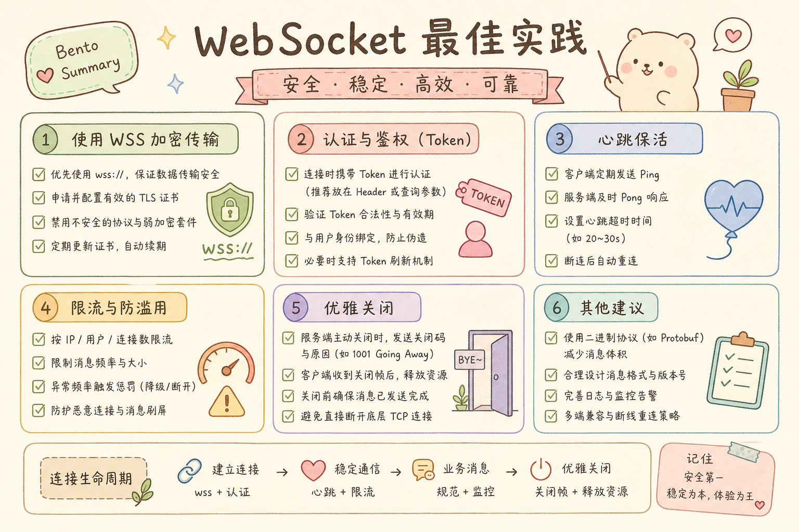

对照上图：连接生命周期是「建立（wss + 认证）→ 稳定通信（心跳 + 限流）→ 业务消息 → 优雅关闭」；§8 的心跳与重连、本章的安全措施，都是上图的具体落地。

### 一句话总结

> **WebSocket 把 HTTP 的「一问一答」变成了「持续通话」。它让你从「每 2 秒轮询一次服务器问有没有新消息」这种 99.8% 的请求都是浪费的模式中解脱出来，让服务器在数据到达的第一时间主动推送给客户端。但力量越大，责任越大——心跳、重连、安全、扩容，每一个都是生产环境逃不掉的必修课。**

### 推荐技术栈

```
起步阶段:   FastAPI + 浏览器原生 WebSocket API
           → 代码最少，学习曲线最平

生产阶段:   FastAPI + Redis Pub/Sub + Nginx + wss
           → 已验证的架构，能支撑数十万连接

高级阶段:   uvicorn + websockets + Kafka + Docker Swarm/K8s
           → 极致性能，水平扩展

备选方案:   Django Channels（如果项目已经是 Django）
           Socket.IO（如果需要兼容不支持 WebSocket 的旧客户端）
           SSE（如果只需要服务器→客户端单向推送）
```

---

> **延伸阅读：**
> - [WebSocket 协议 RFC 6455](https://datatracker.ietf.org/doc/html/rfc6455)——协议的权威文档
> - [MDN WebSocket API 文档](https://developer.mozilla.org/zh-CN/docs/Web/API/WebSocket)——浏览器端最佳参考
> - [websockets 库官方文档](https://websockets.readthedocs.io/)——Python 最流行的 WebSocket 库
> - [FastAPI WebSocket 文档](https://fastapi.tiangolo.com/advanced/websockets/)
> - [Nginx WebSocket 代理指南](https://nginx.org/en/docs/http/websocket.html)
> - [HTML Standard: WebSocket](https://html.spec.whatwg.org/multipage/web-sockets.html)——浏览器 WebSocket 规范
> - [Socket.IO 文档](https://socket.io/zh-CN/docs/v4/)——如果需要兼容旧客户端或自动重连等高级特性
