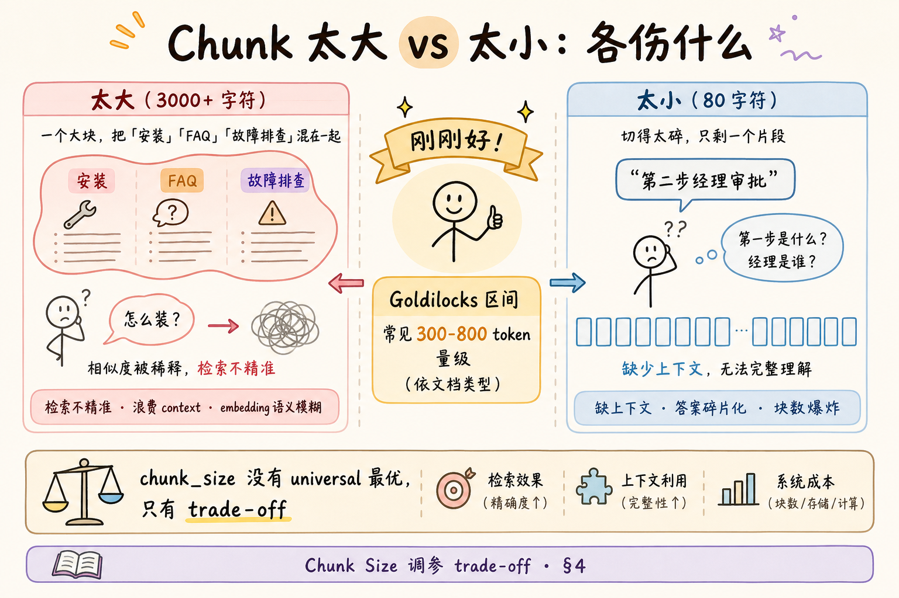
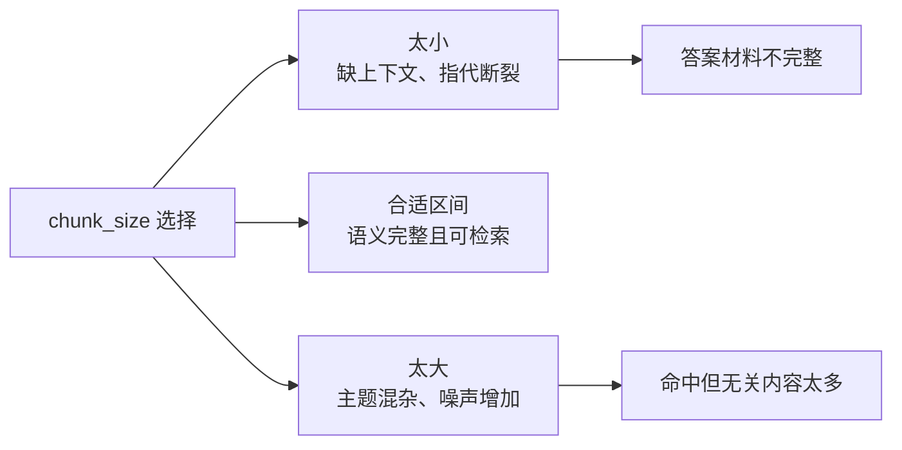
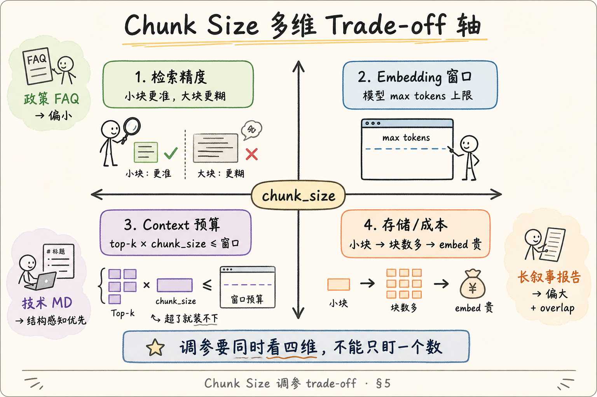
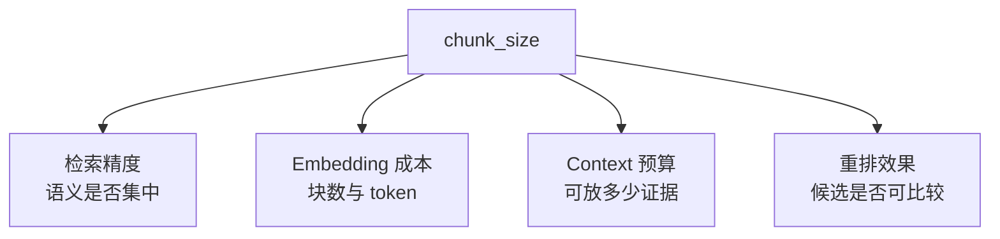
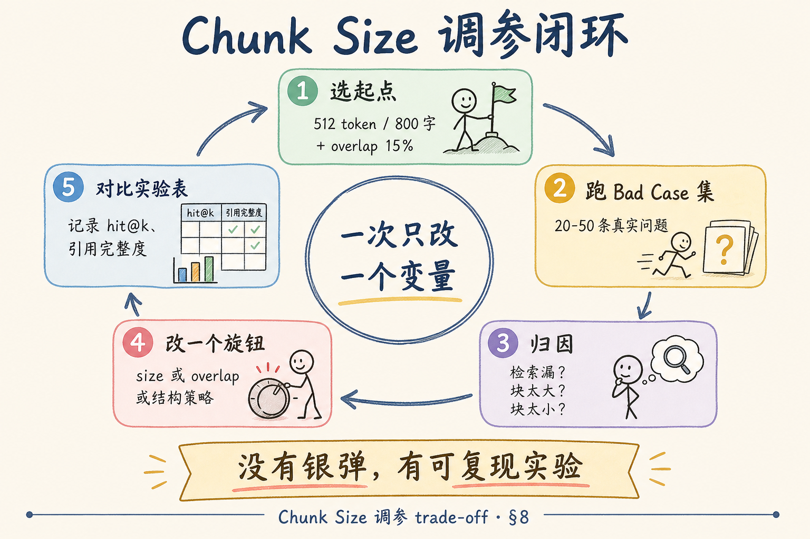
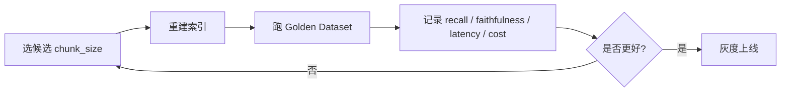
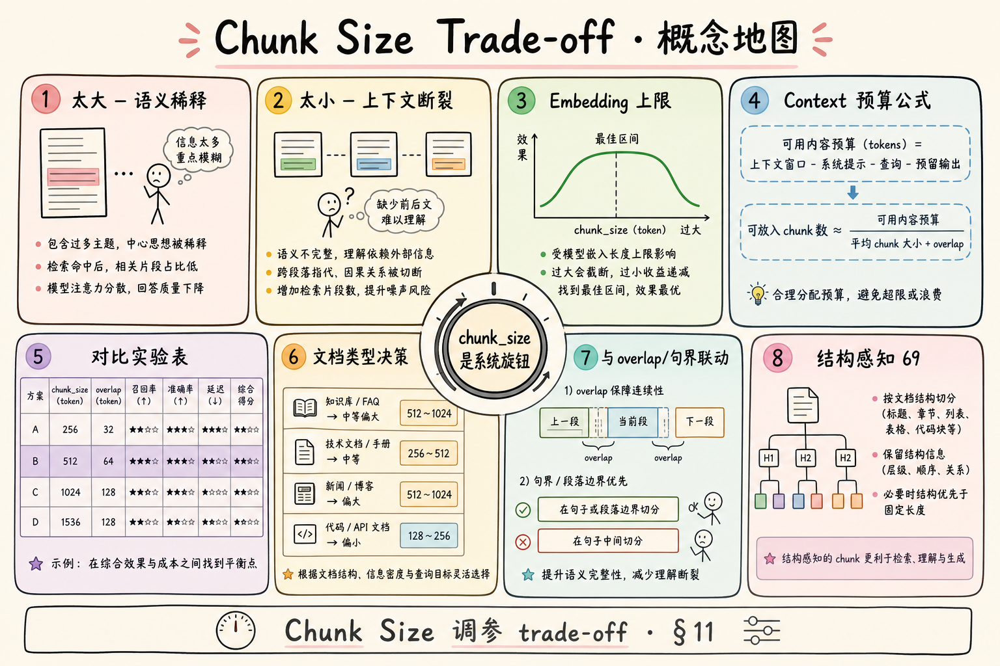
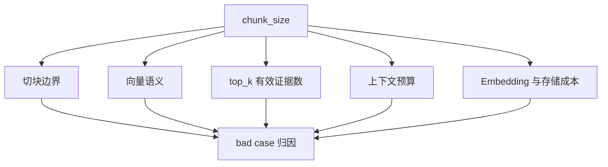

# RAG 数据采集与解析（十六）：Chunk Size 调参 Trade-off 完全指南

> 团队第一次做 RAG，有人问：「chunk 设 512 还是 2048？」——有人照搬 LangChain 默认，有人把整篇 PDF 塞一块「上下文越多越好」。上线后一边抱怨 **检索不准**（块太大语义糊），一边抱怨 **答案缺前因后果**（块太小）。**Chunk size** 不是配置文件里的 magic number，而是 **检索精度、Embedding 上限、Context 预算、存储成本** 四维 trade-off 的交汇点。这篇是 [企业 RAG 路线图](ENTERPRISE_RAG_ROADMAP.md) **C 轨第十六篇 / C2 主线篇**（路线图第 **68** 条），**厚度刻意加码**：太大太小各伤什么、与 embedding 窗口和 top-k 预算的算术、**动手路径 + 对比实验表**、调参闭环与 **分文档类型决策建议**。前置：[59 句界](59.sentence-boundary-chunking-tutorial.md)、[60 Overlap](60.chunk-overlap-tutorial.md)、[25 Embedding](25.embedding-vector-tutorial.md)、[28 Context Window](28.context-window-tutorial.md)。

---

## 目录

1. [前言：没有 universal 最优，只有 trade-off](#1-前言没有-universal-最优只有-trade-off)
2. [本文边界与动手路径](#2-本文边界与动手路径)
3. [Chunk size 在 RAG 链路中的位置](#3-chunk-size-在-rag-链路中的位置)
4. [太大 vs 太小：各伤什么](#4-太大-vs-太小各伤什么)
5. [四维 trade-off 轴](#5-四维-trade-off-轴)
6. [与 Embedding 窗口的关系](#6-与-embedding-窗口的关系)
7. [与检索精度、Context 预算的算术](#7-与检索精度context-预算的算术)
8. [调参闭环：对比实验表与动手路径](#8-调参闭环对比实验表与动手路径)
9. [分文档类型的决策建议](#9-分文档类型的决策建议)
10. [与 overlap、句界、结构的联动](#10-与-overlap句界结构的联动)
11. [综合概念地图](#11-综合概念地图)
12. [常见陷阱与 FAQ](#12-常见陷阱与-faq)
13. [总结与系列下一步](#13-总结与系列下一步)

---

## 1. 前言：没有 universal 最优，只有 trade-off

**Chunk Size**（块大小）：单个检索单元允许的目标长度，常用 **token 数** 或 **字符数** 表示。  
通俗说：**向量库里「一张卡片」有多厚**。

同一个知识库往往混着 **政策 FAQ、技术 README、扫描 PDF 叙事、表格财报**——一种 chunk_size 无法同时优化全部 bad case。工程师要做的是：

1. 理解 **旋钮拧大/拧小** 各伤害什么；  
2. 用 **可复现实验** 而非直觉拍脑袋；  
3. 把结论 **写进配置与 chunk_id 版本**（[51 篇](51.metadata-chunk-id-tutorial.md)），方便回滚。

**Chunk Size Trade-off**（块大小权衡）：在检索精度、上下文完整性、模型窗口、成本之间找 **可接受的折中点**。  
通俗说：**块不是越大越好，也不是越小越好——要在四件事中间找平衡**。

**读完本文，你应该能做到：**

1. 列举 chunk **过大** 与 **过小** 各 3 类典型症状。  
2. 写出 `top_k × chunk_size ≤ context_budget` 的估算式并代入你家模型。  
3. 设计一张 **对比实验表**（至少 3 组 size × overlap）。  
4. 按文档类型给出 **第一组参数起点** 与调参顺序。  
5. 完成调参闭环 §8，并说明为何 **一次只改一个旋钮**。

---

## 2. 本文边界与动手路径

**档位：主线篇（C2 核心，要厚）。**

**本文讲：** 四维 trade-off、embedding/context 算术、实验方法论、决策表、联动策略、FAQ。  
**本文不讲：** 神经架构搜索自动 chunk、多粒度 hierarchical index 实现、ColBERT  token 级检索、生产级 AutoML 调参平台。

### 2.1 动手路径表（建议按顺序）

| 步骤 | 你做什么 | 验收 |
|------|----------|------|
| A | 读 §4～§5，用自家 3 条 bad case 归类「太大/太小」 | 各写 1 条 |
| B | 读 §6～§7，查 Embedding 模型 max tokens，算 context 占用 | 写出不等式 |
| C | 读 §8，复制实验表模板，选 20 条 golden questions | 表头完整 |
| D | 跑 3 组 (size, overlap)，填 hit@3、引用完整度 | 有数字 |
| E | 读 §9，为 MD / PDF / FAQ 各写一行起点 | 能辩护 |
| F | 读 §10，画组合优先级图 | 结构>句界>size |

**环境：** 任意向量库 + 同一 Embedding 模型；golden set 可来自客服日志脱敏。

### 2.2 与路线图前后条的关系

| 条目 | 关系 |
|------|------|
| **66** 句界 | size 是 **打包预算** |
| **67** overlap | 与 size **按比例** 联动 |
| **69** 结构感知 | 有结构时 **先按节**，size 约束节内 |
| **58** chunk_id | size 变更 → **新 ID 策略** |
| **167** bad case 切块 | 本篇是 **预防** 层 |

---

## 3. Chunk size 在 RAG 链路中的位置

```text
解析 → 分块(size, overlap, 策略) → Embed → 索引
                                      ↓
用户问句 → 检索 top-k chunks → 拼进 prompt → LLM 生成
```

**Retrieval Unit**（检索单元）：向量检索 **一次命中一条** 的记录粒度，通常 = chunk。  
通俗说：**搜出来的是「第几段」不是「第几页」**（除非你把页当 chunk，不推荐）。

| 阶段 | chunk_size 影响 |
|------|-----------------|
| 分块 | 块数、块内语义纯度 |
| Embedding | 单次输入长度、截断风险 |
| 检索 | 向量区分度、hit 粒度 |
| 生成 | 进 prompt 的总 token、噪声比例 |

---

## 4. 太大 vs 太小：各伤什么

读下图：左侧 chunk 过大混装多主题，右侧过小只剩碎片。




下面这张图对比 chunk 太大和太小的后果。读图时重点看：两边都会伤检索，只是伤法不同。



结论：chunk size 不是越大越好，也不是越小越精准。目标是让一个 chunk 能承载一个相对完整的语义单元。

对照上图：

### 4.1 Chunk 过大（常见 >1500 token 且混主题）

**Semantic Dilution**（语义稀释）：一块内多个子主题，Embedding 向量成为 **折中平均**，与 **单一意图** 问句相似度下降。  
通俗说：**一张卡片写安装+FAQ+故障，问「怎么装」却像整本手册的摘要**。

| 症状 | 例子 |
|------|------|
| 检索 hit 但答非所问 | 问「二线住宿标准」命中整章差旅 |
| 引用过长难核对 | UI 展示 2000 字让用户自己找 |
| 浪费 context | top-k=5 五块占满窗口，多样性差 |
| 表格/列表噪声 | 无关行列进 prompt，诱发幻觉 |

### 4.2 Chunk 过小（常见 <100 token 且缺上下文）

**Context Fragmentation**（上下文碎片化）：关键 **前提、定义、指代** 在相邻块，单块无法自洽。  
通俗说：**只检索到「第二步点提交」，不知道第一步是什么**。

| 症状 | 例子 |
|------|------|
| 答案缺步骤/条件 | 「谁可报销」缺「正式员工」前提 |
| 块数爆炸 | 入库慢、embed 贵、索引大 |
| 专有名词悬空 | 「该政策」指代不明 |
| Overlap 压力 | 要靠很大 overlap 补上下文 → 费用反升 |

### 4.3 「金发姑娘区」Goldilocks Zone

没有固定数字，但 **中文企业文档** 常见 **第一组实验**：

| 场景 | chunk_size 起点（token 量级） | 备注 |
|------|------------------------------|------|
| 政策 FAQ | 256～512 | 事实短、定义清晰 |
| 技术 MD | 512～800 | 配合 H2 结构（62 篇） |
| 长报告 PDF | 800～1200 | overlap 15%～20% |
| 法条合同 | 按条/款切 + 512 上限 | 结构优先 |

**Goldilocks Zone**（适中区间）：在 bad case 集上 **hit 率与引用完整度** 同时可接受的参数带。  
通俗说：**不大不小刚好的那块地——要靠实验量出来**。

---

## 5. 四维 trade-off 轴

读下图：chunk_size 位于中心，四轴拉扯。




下面这张图把 chunk size 的四个取舍轴放在一起。读图时重点看：调一个参数会同时影响召回、成本、上下文预算和重排。



这张图的结论是：chunk size 调参必须用实验表记录结果，不能凭感觉改一次就上线。

对照上图，逐轴展开：

### 5.1 轴一：检索精度

块越小 → 单块主题越纯 → **精准 hit** ↑；但 **完整答案** 可能要 **多块拼接** 或靠 overlap。

块越大 → **一次 hit 信息多**；但 **相似度打分** 变「糊」，错误块也更容易混进 top-k。

### 5.2 轴二：Embedding 窗口

**Embedding Max Tokens**（嵌入最大 token）：模型单次编码允许的上限，超出则 **截断** 或 **报错**。  
通俗说：**Embedding 模型一次最多「读」多长**。

若 chunk_size > max tokens → **尾部 silently 丢弃**（部分 API）→ 你以为入库 2000 字，向量只 represent 前 512 token。

| 模型类 | 典型 max | 建议 chunk 上限 |
|--------|----------|-----------------|
| 小型 sentence | 512 | ≤480 留余量 |
| 中型 | 8192 | 仍建议 ≤1500 保检索精度 |
| 长上下文 embed | 32k+ | 仍不建议整篇一块 |

### 5.3 轴三：Context 预算

**Context Budget**（上下文预算）：生成阶段 prompt 中 **留给检索资料** 的 token 上限。  
通俗说：**模型一次能读多少参考材料**。

粗算：

```text
资料占用 ≈ top_k × avg_chunk_tokens × (1 - 重复率)
系统+用户+历史 + 资料 + 生成预留 ≤ context_window
```

例：context_window=128k，但 RAG 只分配 **8k 给资料**；top_k=5，chunk≈1500 token → **7500**，已满——还没算 overlap 重复。

**Retrieval Precision vs Context Load**（检索精度 vs 上下文负载）：块越大，**同样 k 值** 占窗口越多，**挤占** 多文档多样性。

### 5.4 轴四：存储与成本

块数 ≈ `L / (size - overlap)`（见 [60 篇](60.chunk-overlap-tutorial.md)）。

| size ↓ | 块数 ↑ | Embed 调用 ↑ | 检索索引 ↑ |
|--------|--------|--------------|------------|
| size ↑ | 块数 ↓ | 单次 token ↑ | 单块噪声 ↑ |

**Total Cost of Ownership**（TCO）：不只看 API 账单，还有 **向量库内存、重建索引时间、运维复杂度**。

---

## 6. 与 Embedding 窗口的关系
这一节只讨论一个边界：Embedding 模型一次到底能读多长。初学者最容易忽略的是，chunk 超过窗口后可能被截断，系统不一定会显式报错。

### 6.1 截断 vs 语义完整

```text
if len_tokens(chunk) > embed_max:
    # 危险：静默截断
    vector = embed(chunk[:embed_max])
```

**Truncation**（截断）：超出模型窗口的尾部 **不参与** 向量计算。  
通俗说：**书只读了前几页就去做摘要标签**。

对策：

1. **chunk_size 设低于 embed_max 10%～15%** 留 safety margin；  
2. 入库前 **assert** token 计数；  
3. 超长节 **结构切 + 句界切**，不要赌截断。

### 6.2 同一模型 embed 与 generate

常见架构：**同一 family** 的 embed 模型与 chat 模型 **tokenizer 不同**。  
chunk_size 应用 **embed tokenizer** 计；context 预算用 **chat tokenizer** 计 **检索结果**——不要混为一个数字。

### 6.3 维度与 chunk 长度

Embedding **维度**（768/1536/…）不随 chunk 变；变的是 **向量语义质量**。过长 chunk 的向量 **不可解释地「平均化」**——这是精度问题，不是维度问题。

---

## 7. 与检索精度、Context 预算的算术
这一节把 size、top_k 和 prompt 预算放在一起算。只要你能算出 `top_k × 平均 chunk tokens`，就能提前判断检索结果会不会把上下文窗口挤爆。

### 7.1 工作示例

假设：

- embed_max = 512 tokens  
- chat context = 32k，RAG 资料预算 = 6k tokens  
- top_k = 6  
- 平均 chunk = 400 tokens（目标 size）  
- overlap 导致 **重复率 10%**（检索 dedup 前）

资料占用 ≈ `6 × 400 × 0.9 = 2160` tokens —— **宽裕**。

若 chunk = 1200 tokens：

资料占用 ≈ `6 × 1200 × 0.9 = 6480` —— **超预算**，需降 k 或降 size。

### 7.2 Hit@k 与 chunk 粒度

**Hit@k**（前 k 条命中）：评测时 **正确 chunk 是否出现在检索前 k 条**。  
通俗说：**正确答案在不在「搜出来的前五条」里**。

| chunk 状态 | 对 Hit@k 的典型影响 |
|------------|---------------------|
| 过大 | 相关块排名下降（稀释） |
| 过小 | 正确块在，但 **信息不够** → 生成仍错 |
| 适中 + overlap | Hit 与 **引用完整度** 同时改善 |

评测要 **两列**：`hit@k` + **answer completeness**（人工或 LLM judge）。

### 7.3 与 BM25 的交互

混合检索时，小块 **词项更聚焦**，BM25 有时更喜小块；向量侧可能喜 **语义完整句**。  
**Hybrid Retrieval**（混合检索）：稀疏 + dense 融合——chunk_size 改变要 **两边重跑** 实验。

### 7.4 完整算例：从参数到 prompt 占用

**给定：**

- Chat 模型 context_window = 32,768 token  
- 系统提示 + 用户问题 + 历史 ≈ 4,000 token  
- 生成预留 = 2,048 token  
- 可用于 **检索资料** ≈ 26,720 token（理论上限）  
- 工程上常 **人为 cap** RAG 资料 = 6,000 token  

**方案对比：**

| 方案 | top_k | chunk_size | 粗算资料 token | 是否超 cap |
|------|-------|------------|----------------|------------|
| A | 5 | 512 | ~2,560 | 否 |
| B | 5 | 1,500 | ~7,500 | 超 6k cap |
| C | 8 | 512 | ~4,096 | 否 |
| D | 3 | 1,200 | ~3,600 | 否 |

**Prompt Assembly**（提示词组装）：把检索 chunk 拼进 User Message 的过程。  
通俗说：**把搜到的卡片排好队塞进问题下面**——chunk_size 决定每张卡片有多厚。

### 7.5 Hit 与「答对」可能背离

实验表必须 **两列**：`hit@k` + **answer correctness**——否则会把生成问题误判为「还要再减 chunk」。

---

## 8. 调参闭环：对比实验表与动手路径

读下图：调参不是一次性，而是 **闭环**。




下面这张图给出 chunk size 调参闭环。读图时重点看：每次修改都要用固定问题集验证，而不是只看单个成功案例。



结论：chunk size 是索引级参数，改完要重建索引并回归评测，否则结果不可追溯。

对照上图五步法：

### 8.1 Step 1：选起点

默认第一组（无结构纯文本）：

```yaml
chunk_size_tokens: 512
overlap_ratio: 0.15
strategy: sentence_boundary  # 59 篇
```

有 Markdown H2：**先 62 篇结构切**，节内 `max_section_tokens: 800`。

### 8.2 Step 2：Golden Set

| 字段 | 说明 |
|------|------|
| question | 真实用户问法 |
| expected_doc | 应命中文档 doc_id |
| expected_section | 可选，章节名 |
| must_contain | 答案必含短语/数字 |

20～50 条即可启动；覆盖 **事实、流程、对比、否定** 四类。

### 8.3 Step 3：对比实验表（模板）

| 实验 ID | size | overlap | 策略 | 块数 | hit@3 | 完整度(1-5) | context占用 | 备注 |
|---------|------|---------|------|------|-------|-------------|-------------|------|
| E0 | 512 | 15% | 句界 | | | | | baseline |
| E1 | 256 | 15% | 句界 | | | | | 测过小 |
| E2 | 1024 | 15% | 句界 | | | | | 测过大 |
| E3 | 512 | 0% | 句界 | | | | | 测 overlap |
| E4 | 512 | 15% | H2+句界 | | | | | 结构感知 |

**一次只改一列**（E1 只改 size，E3 只改 overlap）。

### 8.4 Step 4：归因

实验结果出来后，先按现象归因，再决定下一次只改哪一个旋钮。不要看到分数低就同时改 size、overlap 和结构策略。

| 现象 | 可能旋钮 |
|------|----------|
| 命中对节但数字错 | 块内混表，结构切 |
| 完全检不到 | 块过大稀释 or 过小碎片化 |
| 检到但缺步骤 | ↑ overlap 或 ↑ size 或结构 |
| top-k 全重复 | ↓ overlap 或 dedup |
| prompt 超长 | ↓ k 或 ↓ size |

### 8.5 Step 5：固化与版本

```yaml
# config/chunking_v3.yaml
version: 3
chunk_size: 512
overlap: 77   # 15% of 512
strategy: heading_h2_then_sentence
```

升 version → [48 文档版本](48.doc-versioning-tutorial.md) → 全量或增量重索引 → **新 chunk_id**（[51 篇](51.metadata-chunk-id-tutorial.md)）。

### 8.6 实验记录样例（填数示范）

| 实验 ID | size | overlap | hit@3 | 完整度 | 块数(万篇) | 结论 |
|---------|------|---------|-------|--------|------------|------|
| E0 | 512 | 15% | 0.72 | 3.8 | 12.4 | baseline |
| E1 | 256 | 15% | 0.68 | 3.2 | 22.1 | 过小，弃 |
| E2 | 1024 | 15% | 0.61 | 3.5 | 6.8 | 过大，弃 |
| E3 | 512 | 0% | 0.65 | 3.1 | 10.9 | 边界丢，加 overlap |
| E4 | 512 | 15% | H2 | 0.79 | 4.2 | 11.0 | **采纳** |

数字为 **示意**——你的库必须自己跑。E4 显示：**结构感知 + 适中 size** 常胜过单纯把 size 拧到极端。

### 8.7 谁该参与评审

| 角色 | 看什么 |
|------|--------|
| 算法 | hit@k、实验归因 |
| 业务 | 完整度、引用是否可读 |
| 运维 | 块数、重建时间、存储 |
| 财务 | embed token 账单变化 |

**Cross-functional Review**（跨职能评审）：避免工程师 alone 把 size 调到 **检索分数最高** 但 **引用不可读** 或 **成本翻倍**。

---

## 9. 分文档类型的决策建议
不同文档不该共用同一个默认 size。FAQ、Markdown、扫描 PDF、合同条款的结构完全不同，所以这一节给的是起点参数和判断顺序，而不是标准答案。

### 9.1 Markdown / 技术文档

**优先结构**（62 篇）：

```text
H2 为 chunk 边界 → 节内 token > 800 再句界+size 切
chunk_size 作节内上限，非全文上限
```

起点：`section_max=800`, `overlap=120`, 代码块 **不切断**。

### 9.2 PDF 制度 / 扫描件

解析质量参差（[37 篇](37.pdf-layout-tables-tutorial.md)）：

```text
句界 + size 512~800 + overlap 15%~20%
表格单独 chunk 或转 Markdown 表（43 篇）
```

避免 **整页一块**——除非页内纯图片 OCR 段。

### 9.3 FAQ / 短问答

FAQ 的天然边界是“一问一答”。这类文档通常不需要很大的 chunk，重点是保持一条问答语义完整。

```text
size 256~512，可按 Q&A 对切（一条 FAQ 一块）
overlap 可低（10%）——边界已是完整问答
```

### 9.4 法律 / 合同

法律和合同类文档最怕条号、定义和正文分离。切块时应优先尊重“条/款/项”的结构，再用 size 约束超长条款。

```text
「条」「款」为结构边界（类似 H2）
单条过长再 size 切；引用必须带条号 metadata
```

### 9.5 决策树（文字版）

下面这棵文字决策树适合做初次排查。它不是替代评测表，而是帮助你先选对实验方向。

```text
有清晰标题/条款？
  是 → 结构感知，size 约束节内
  否 → 句界 + size + overlap
单块仍超 embed_max？
  是 → 强制再切，禁止截断
context 预算紧？
  是 → 略减 size 或 k，不要硬塞大块
bad case 仍边界丢？
  是 → 先调 overlap，再调 size
```

### 9.6 行业样例参数（起点，非标准答案）

| 行业 | 文档特点 | size 起点 | overlap | 结构 |
|------|----------|-----------|---------|------|
| 金融合规 | 长条款、指代多 | 512～768 | 18%～22% | 条/款 |
| SaaS 帮助中心 | MD、FAQ | 400～512 | 12%～15% | H3 |
| 制造业 SOP | 步骤列表 | 512 | 20% | H2+句界 |
| 法务合同 | 定义+引用 | 按条 | 15% | 条号 |

**Domain-specific Chunking**（领域分块）：同一套框架，**参数随文档形态变**——面试时能讲 **为什么金融 overlap 略高**（指代与定义跨句多），比背「512」加分。

### 9.7 与 Long Context 模型的关系

Context Window 变大（[28 篇](28.context-window-tutorial.md)）≠ 可以把 chunk 调到 8000。**检索精度** 仍随块变大而下降；长窗口解决的是 **多块拼接进 prompt**，不是 **单块越大越好**。Long context 时代更常见：**中小 chunk + 略增 top_k + rerank**，而非 **整章一块 embed**。

---

## 10. 与 overlap、句界、结构的联动

| 优先级 | 策略 | 解决什么 |
|--------|------|----------|
| 1 | 结构感知 H2/H3 | 章、节、代码块、FAQ |
| 2 | 句子边界 | 块内不断句 |
| 3 | chunk_size 预算 | 控制块数与精度 |
| 4 | overlap | 块间语义缝 |
| 5 | 递归字符 | 超长句降级 |

**Knob Coupling**（旋钮耦合）：同时改 size 和 overlap 和结构 → **无法归因**。  
通俗说：**一次拧一个钮，否则不知道谁治好了病**。

推荐比例：`overlap = round(chunk_size * 0.15)`，size 变则 overlap 跟着变。

---

## 11. 综合概念地图

读下图时，先看「Chunk Size Trade-off 概念地图」想表达的主线：它把本节的概念关系压缩成一张可对照的图。




下面这张概念地图总结 chunk size 的主要影响面。读图时重点看：它连接切块、检索、生成和成本。



掌握这张图后，遇到检索坏案例时就不会只改 prompt，而会回到索引参数一起检查。

对照上图，主线篇 **自检清单**：

- [ ] 四维 trade-off 能各用一句解释  
- [ ] 算过自家 context 占用  
- [ ] 有一张填过的实验表  
- [ ] 文档类型决策树能口述  
- [ ] 改 size 知道要升 version 重索引  

---

## 12. 常见陷阱与 FAQ

**Q：ChatGPT 说 chunk 1024 最好，要听吗？**  
A：不听。用你家 **golden set + 同一 embed 模型** 测；不同库不同问法结论不同。

**Q：chunk_size 用字符还是 token？**  
A：生产 **token**（[27 篇](27.token-counting-billing-tutorial.md)）；教程手算可用字符 ÷ 1.6 粗估中文 token。

**Q：Parent-Document Retriever 还要调 size 吗？**  
A：要。子块 size 影响 **检索**；父块 size 影响 **生成上下文**——两套参数。

**Q：表格要不要单独 size=0（整表一块）？**  
A：表宽可控时 **整表一块** 常优于切碎；宽表按行组切（37/43 篇）。

**Q：size 调小 hit 上升但答案仍错？**  
A：可能是 **生成** 或 **提示词** 问题——用 [33 幻觉](33.llm-hallucination-tutorial.md) 归因，不要无限减 size。

**Q：多语言库 size 要分语言吗？**  
A：可用同一 token 预算；注意 **英文 token 密度** 与中文不同，分语言抽评测子集。

### 12.1 与路线图 167「切块错误」的对应

| Bad case 标签 | 常见 chunk 原因 | 旋钮 |
|---------------|-----------------|------|
| 检索命中但缺数字 | 半句 / 表被切 | 句界、结构 |
| 完全检不到 | 块过大稀释 | 减 size 或结构切 |
| 引用对但答错 | 生成问题 | 非 size 主因 |
| top-k 全同 doc 重复 | overlap 过大 | 降 overlap / dedup |

**Chunking Attribution**（切块归因）：把检索失败 **先分类** 再调参——避免「大小不行就再小一点」的无限循环。

### 12.2 简历/面试怎么讲

可表述为：「我们用 **golden set + 对比实验表** 在 **512 token + 15% overlap + H2 结构** 上落地，hit@3 从 0.65 提到 0.79，embed 块数仅增 11%。」——比「我用了 LangChain 默认」有 **区分度**。

### 12.3 附录：token 与字符换算备忘

| 文本类型 | 粗算 1 token ≈ |
|----------|----------------|
| 英文 | 4 字符 / 0.75 词 |
| 中文（GPT 类 BPE） | 1.5～2 字符 |
| 混合技术 MD | 按 embed tokenizer 实测 |

**Rule of Thumb**（经验法则）：中文 **512 token ≈ 300～450 汉字**——仅用于 **实验设计**，入库 **必须实测**。

### 12.4 附录：LangChain / LlamaIndex 参数对照

| 框架 | 参数名 | 本篇对应 |
|------|--------|----------|
| LangChain | `chunk_size` | chunk_size |
| LangChain | `chunk_overlap` | overlap |
| LlamaIndex | `chunk_size` | 同 |
| LlamaIndex | `chunk_overlap` | 同 |

改框架 **不改实验表逻辑**——golden set 与 hit@k 才是 **跨框架可比** 的。

### 12.5 三维矩阵：文档 × 问题 × 参数

调参时建议建 **小矩阵**（不必全 factorial）：

|  | 事实类问题 | 流程类问题 | 对比类问题 |
|--|------------|------------|------------|
| MD 文档 | E4 结构+512 | +overlap 20% | H3 切 |
| PDF 纯文本 | 512+15% | +overlap 20% | 难，先修解析 |
| FAQ 短答 | 256～512 | Q&A 一块 | 512 够用 |

**Question Taxonomy**（问题 taxonomy）：golden set 按 **问题类型** 分层抽样——否则参数只对 **某一类** 优化，上线另一类 **崩盘**。

### 12.6 监控指标（上线后）

| 指标 | 说明 | chunk 相关 |
|------|------|------------|
| hit@k | 检索 | size/overlap/结构 |
| avg_chunks_per_query | 去重后进 prompt 数 | overlap+dedup |
| citation_span_len | 引用平均长度 | size 过大则长 |
| embed_tokens/day | 成本 | size↓ 块数↑ |

**Observability**（可观测性）：分块参数变更后 **盯一周** 这四项，比「用户没说不好」可靠。

### 12.7 Parent / Child 双粒度（进阶了解）

部分框架支持 **小块检索、大块生成**：

| 粒度 | 大小 | 用途 |
|------|------|------|
| Child | 256～512 | 检索精准 |
| Parent | 1500～3000 | 生成上下文 |

**Dual-granularity Index**（双粒度索引）：检索与生成 **使用不同 chunk 规格**。  
通俗说：**用小卡片找位置，把整章塞给模型读**。

此时 **child size** 仍受本篇 trade-off 约束；parent size 受 **context 预算** 约束——两套数字 **都要写进实验表**，不要混为一谈。

### 12.8 面试速记：chunk size 四句话

面试或复盘时，不需要背具体数字。能把下面四句话讲清楚，就说明你理解了 trade-off。

1. **太大** → 语义稀释、检索糊、浪费 context。  
2. **太小** → 上下文碎、块数贵、指代悬空。  
3. **必须** ≤ embed max，且 **top_k × size** 算进 prompt 预算。  
4. **调法** → golden set + 对比表 + **一次一改** + 结构优先于盲调 size。

### 12.9 失败复盘模板（Bad Case 报告）

每条 bad case 建议 **五段式** 记录：

```markdown
## BC-042 二线住宿标准答成一线
- 问句：二线城市住宿上限？
- 检索 top-3 chunk_id：…
- 块内容摘要：含「一线 500」不含「二线 350」
- 归因：□块过大 □块过小 □overlap □结构 □生成
- 动作：H2 按城市分节 / 减 chunk / 加 overlap / 其他
```

**Bad Case Log**（坏例日志）：调 chunk 参数时 **唯一可信输入**——没有日志的「感觉调大点」会 **毁掉** 已调好的检索。

### 12.10 与 Rerank 的分工

**Rerank**（重排序）：对 top-50 粗检索结果用 **交叉编码器** 精排。  
通俗说：**先粗搜一把，再用贵模型给候选打分排队**。

Rerank **不能** 召回索引里 **根本不存在的** 边界语义——若 overlap=0 导致正确块 **排名 40 开外**，rerank 也 **救不了**。顺序仍是：**分块参数先把 recall 做够** → 再 rerank 提 precision。

### 12.11 交付物 checklist（主线篇完成标准）

主线篇的验收标准要落到可交付物。只读完概念但没有实验表和配置版本，不能算完成。

- [ ] 对比实验表 ≥3 组已填数  
- [ ] context 占用算式写进设计 doc  
- [ ] 文档类型决策表 ≥3 类  
- [ ] chunking.yaml 进 Git 带 version  
- [ ] 与 51 chunk_id 变更流程对齐  

### 12.12 工作表示例：两周调参 sprint

| 天 | 任务 | 产出 |
|----|------|------|
| D1 | 抽 30 条 golden + 归类 | 问题 taxonomy |
| D2 | E0 baseline 512/15% | 实验表首行 |
| D3 | E1/E2 改 size | 太大太小结论 |
| D4 | E3 overlap 0 vs 20% | overlap 必要度 |
| D5 | E4 加 H2 结构 | 最终参数 |
| D6～D7 | 写 config + 重索引 + 回归 | chunking_v3 上线 |

**Tuning Sprint**（调参冲刺）：集中 **一周** 做完对比，比 **三个月零散改** 更易 **归因**——且 **chunk_id version** 只升一次，运维 **少踩坑**。

### 12.13 与 Context Window 128k 的误区澄清

模型宣传 **128k context** 时，常见误解：「chunk 可以调到 32k」。实际上 **检索** 仍靠 **相似度**——32k 一块的向量 **无法** 像 512 token 块那样 **精准命中** 一句话事实。长窗口的正确用法是 **多 chunk 进 prompt** 或 **parent document**，不是 **mega chunk embed**。

### 12.14 多租户 / 多知识库参数隔离

SaaS 场景不同租户 **文档形态不同**——应用 **config profile**：

```yaml
profiles:
  tenant_a_faq:
    chunk_size: 384
    overlap_ratio: 0.12
    split_at_heading: 3
  tenant_b_manual:
    chunk_size: 768
    overlap_ratio: 0.18
    split_at_heading: 2
```

**Tenant Chunk Profile**（租户分块配置）：同一套代码，**不同 YAML**——避免 **租户 A 的 FAQ 参数** 误用于 **租户 B 的长手册**。

### 12.15 成本-质量 Pareto 前沿（直觉）

在 size-overlap 平面上，通常存在 **拐点**：再减 size **hit 略升** 但块数 **陡增**；再增 overlap **边界略好** 但 **重复召回陡增**。实验表的目的就是找 **拐点** 而非 **极值**——**Pareto 最优** 在业务上叫「够用且省」。

### 12.16 附录：常见 Embedding 模型与 chunk 上限建议

| 模型（示例） | max tokens | 建议 chunk 上限 | 备注 |
|--------------|------------|-----------------|------|
| text-embedding-3-small | 8191 | 512～1024 | 精度随长块降 |
| bge-small-zh | 512 | 480 | 留 6% 余量 |
| bge-large-zh | 512 | 480 | 与 bge-base-zh 相同，先用 480 作为保守起点，再用评测集校准 |
| 自建 minilm | 256 | 240 | 短 FAQ |

**Model-specific Limit**（模型专属上限）：换 Embedding 模型 **必须重跑** 实验表——不是 **只 re-embed**，而是 **可能改 size** 再 embed。

### 12.17 写给 PM 的一页纸（非技术）

这段话可以直接用于和产品经理解释为什么需要做分块实验。重点是用“卡片厚度”解释参数，而不是讲向量细节。

> 我们能把文档切成「检索用的小段」。**段太大** 像把整本手册塞进一张卡片，搜「二线标准」却命中整章；**段太小** 像只撕下「第二步」没有第一步。**chunk size** 就是卡片厚度旋钮；**overlap** 是让相邻卡片 **故意重复几句**，避免步骤刚好被切在两张卡中间。我们用 **真实问题测 3～5 组厚度**，选 **答对率最高且成本可接受** 的一组，写进配置并可回滚。

### 12.18 与 28 上下文窗口的衔接公式（完整版）

记：

- `W` = chat context_window（token）  
- `S` = system + user + history 占用  
- `G` = 生成预留  
- `R` = 检索资料预算 = `min(W - S - G, rag_cap)`  
- `k` = top_k  
- `c` = 平均每 chunk token（含 overlap 重复前 dedup 后）  
- 需满足：`k × c ≤ R`

若不等式 **不成立**，优先 **降 k** 还是 **降 c**，看 bad case：**缺来源多样性** → 降 c；**单块信息不够** → 降 k 同时 **略增 c** 或 **加 parent**—— **没有固定答案**，看实验表。

### 12.19 主线篇完成声明

当你 **填完对比实验表**、**写出 chunking.yaml**、**向 PM 解释过一页纸**，且 **golden set hit@3 相对 baseline 有可演示提升** 时，路线图 **68** 可勾选 **「能讲 trade-off 并给出决策」**——而非 **「读过 512 这个数字」**。下一篇 **69 结构感知** 会在 **many 场景** 比单纯调 size **更有效**，但 **size/overlap 仍是节内二次切的底座**。

**读者练习：** 用 §7.4 算例代入你们 chat 模型的 `W,S,G,rag_cap,k`，判断 `512×5` 是否超预算；若超，写出 **两套** 合法 `(k,c)` 组合并说明 **各牺牲什么**——此练习 **5 分钟**，能避免上线后 **prompt  silently 截断** 检索资料。

**与 66/67 的衔接：** chunk_size 与 overlap **必须成对出现** 在配置里；单独改 size 不改 overlap 比例会导致 **stride 行为漂移**——review 配置时看到 `chunk_size=1024` 仍 `overlap=100`（绝对值）应 **警惕**，应改为 **比例制** 或 **同步重算**。

**本篇最后一句话：** Chunk size 没有 **银弹数字**，只有 **在你家文档、你家模型、你家问题分布** 下的 **Pareto 拐点**——用 §8 实验表找到它，写进 **chunking.yaml + version**，比记住「512」值一万。

---

## 13. 总结与系列下一步

1. Chunk size 是 **四维 trade-off**，不是越大越好。  
2. **过大** → 语义稀释；**过小** → 碎片化 + 成本。  
3. 必须 **≤ Embedding max**，并核算 **top_k × size** 与 context 预算。  
4. 用 **对比实验表 + golden set** 闭环；**一次一改**。  
5. **结构 > 句界 > size > overlap** 是常见优先级。

### 13.1 系列下一步

读完本篇后，建议继续看结构感知、Markdown AST 和 bad case 归因。它们会把“调 size”推进到更稳定的结构化切块。

| 目标 | 阅读 |
|------|------|
| 结构感知分块 | [62 structure-aware](62.structure-aware-chunking-tutorial.md) |
| Markdown AST 分块 | 路线图 **70** |
| Bad case 切块归因 | 路线图 **167** |
| chunk_id | [51 metadata-chunk-id](51.metadata-chunk-id-tutorial.md) |

### 13.2 学习目标自检

- [ ] 四维轴 + 太大太小症状  
- [ ] context 算术例题  
- [ ] 实验表至少跑 E0～E2  
- [ ] 文档类型决策 3 条  

---

> **初学者可能仍困惑的点**  
> - 「512」是 token 不是汉字——512 token 中文大约 **三百～五百字** 量级，视分词而定。  
> - 调 size 后 **必须重索引**，否则线上仍是旧块——与 [49 增量](49.incremental-update-tutorial.md) 联动。  
> - 检索准了生成仍错，别继续减 size——该查 prompt 与 grounding。  
> - 下一篇 **62** 讲 **有标题时 size 应约束节内**，不是放弃 size。
