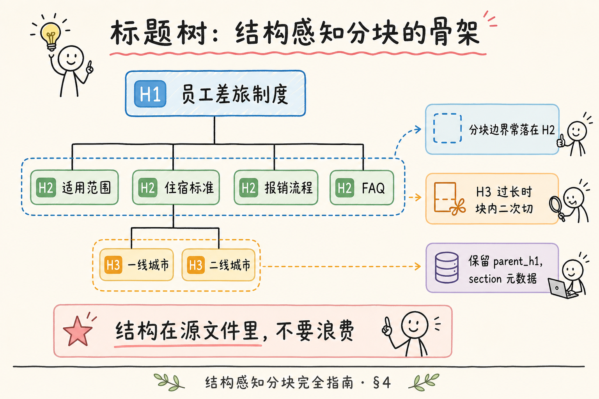
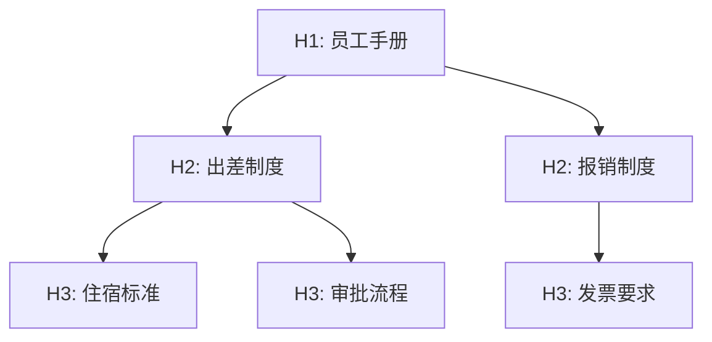
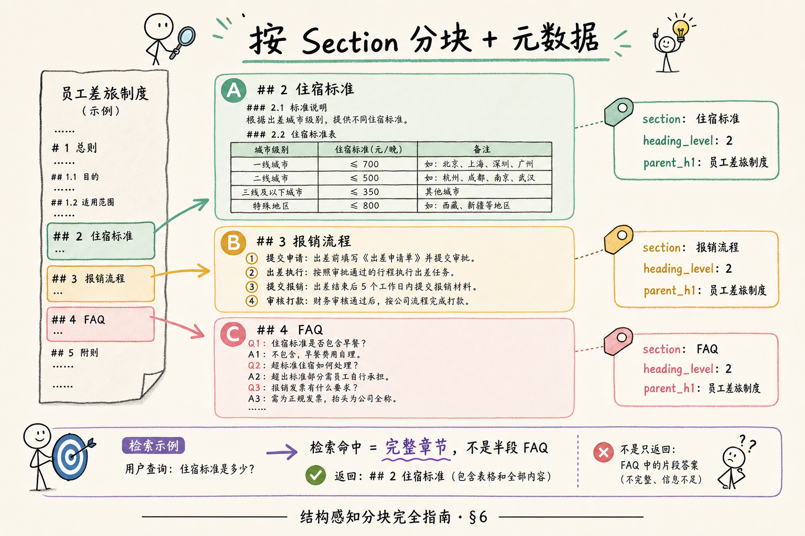
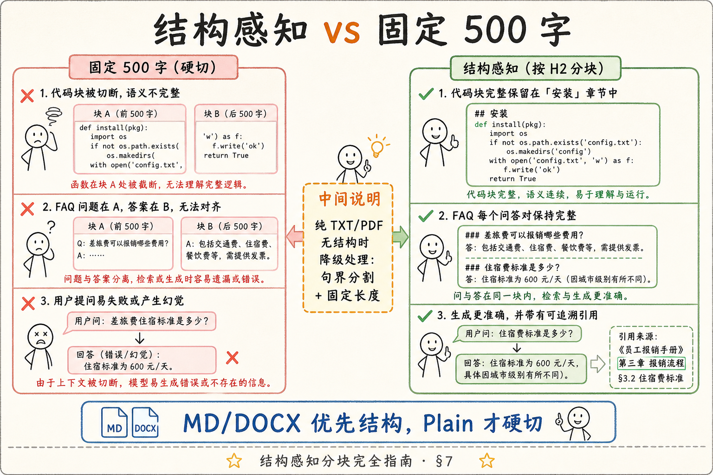
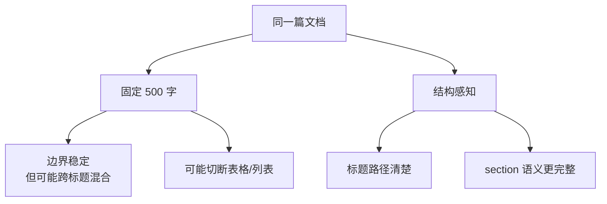
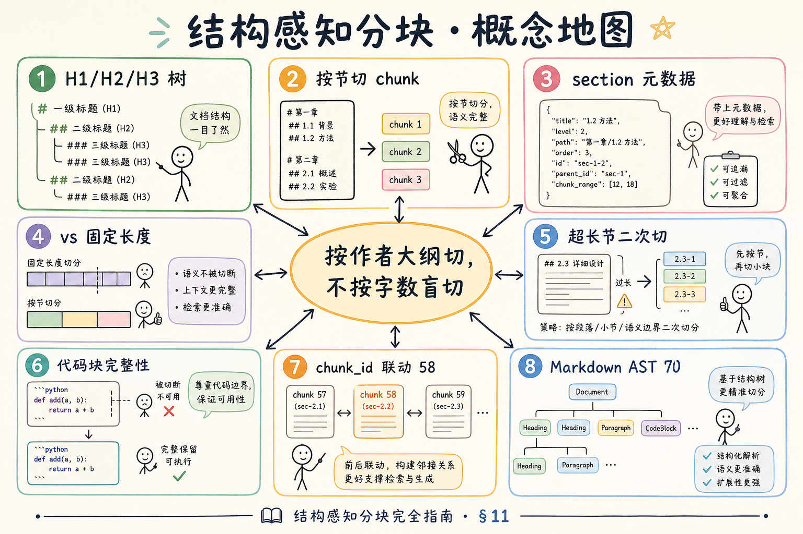
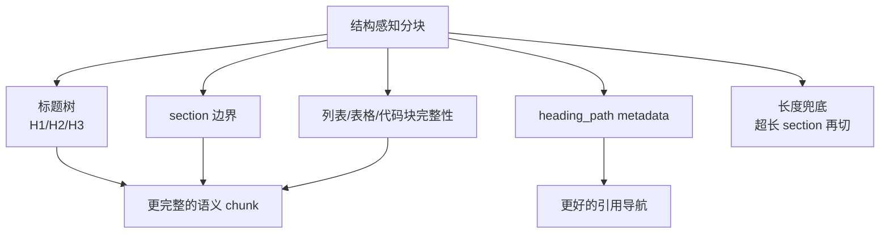

# RAG 数据采集与解析（十七）：结构感知分块（标题层级）完全指南

> 把 Markdown 当纯文本 **每 500 字切一刀**，FAQ 的问题在 Chunk A、答案在 Chunk B；安装说明的 ```bash 从 `pip inst` 中间断开；用户问「第三章报销流程」，引用却显示「字符 1200～1700」。文档作者已经用 **H1/H2/H3** 写好了大纲——**结构感知分块**（Structure-aware Chunking）按 **标题层级** 切 chunk，并保留 **section** 元数据，让检索命中 **完整章节** 而非随机字节段。这篇是 [企业 RAG 路线图](ENTERPRISE_RAG_ROADMAP.md) **C 轨第十七篇 / C2 主线篇**（路线图第 **69** 条），**厚度刻意加码**：标题树、按节切分、metadata 契约、与固定长度对比、**完整动手路径 + Python 示例**、与 [61 chunk size](61.chunk-size-tradeoff-tutorial.md) 的节内二次切。前置：[38 Markdown 解析](38.markdown-parsing-tutorial.md)、[59 句界](59.sentence-boundary-chunking-tutorial.md)、[61 Chunk size](61.chunk-size-tradeoff-tutorial.md)、[51 chunk_id](51.metadata-chunk-id-tutorial.md)。

---

## 目录

1. [前言：作者的大纲，就是你的切刀](#1-前言作者的大纲就是你的切刀)
2. [本文边界与动手路径](#2-本文边界与动手路径)
3. [结构感知分块在链路中的位置](#3-结构感知分块在链路中的位置)
4. [标题树：H1 / H2 / H3 怎么读](#4-标题树h1--h2--h3-怎么读)
5. [按 Section 切：边界规则与例外](#5-按-section-切边界规则与例外)
6. [Section 元数据契约](#6-section-元数据契约)
7. [与固定长度分块对比](#7-与固定长度分块对比)
8. [动手路径：从大纲到 chunk 列表](#8-动手路径从大纲到-chunk-列表)
9. [最小实战：Python 按 H2 分块](#9-最小实战python-按-h2-分块)
10. [节内超长：与 chunk_size、句界组合](#10-节内超长与-chunk_size句界组合)
11. [综合概念地图](#11-综合概念地图)
12. [常见陷阱与 FAQ](#12-常见陷阱与-faq)
13. [总结与系列下一步](#13-总结与系列下一步)

---

## 1. 前言：作者的大纲，就是你的切刀

**Structure-aware Chunking**（结构感知分块）：利用文档已有 **逻辑结构**（标题、条款、样式、AST 节点类型）决定 chunk 边界，而非仅按字符数或句号。  
通俗说：**按作者写的章节目录切，不按字数盲切**。

**Heading Hierarchy**（标题层级）：H1 文题 → H2 章 → H3 节……形成的 **树状大纲**。  
通俗说：**# 多少级，就是第几层标题**。

企业 MD、DOCX、Wiki 导出、静态站 docs **自带结构**——[38 篇](38.markdown-parsing-tutorial.md) 已讲解析；本篇聚焦 **切分策略与 metadata**，是 C2 分块里 **性价比最高** 的一招。

**读完本文，你应该能做到：**

1. 手画一篇 MD 的 **H1/H2/H3 树**，标出推荐 chunk 边界。  
2. 列出 **section / heading_level / parent_h1** 等 metadata 字段含义。  
3. 对比 **固定 500 字** 与 **按 H2 切** 在 FAQ、代码块上的差异。  
4. 跑通 §9 脚本，输出带 section 的 chunk JSON。  
5. 描述 **节内超长** 时如何叠加 [59 句界](59.sentence-boundary-chunking-tutorial.md) + [61 size](61.chunk-size-tradeoff-tutorial.md) + [60 overlap](60.chunk-overlap-tutorial.md)。

---

## 2. 本文边界与动手路径

**档位：主线篇（C2 核心，要厚）。**

**本文讲：** 标题树、按节切、metadata、vs 固定长度、完整 Python 示例、节内二次切、FAQ。  
**本文不讲：** Markdown AST 全节点遍历（路线图 **70**）、LayoutLM PDF 标题检测、GraphRAG 社区发现、多文件站点全局 TOC 合并。

### 2.1 动手路径表（建议按顺序）

| 步骤 | 你做什么 | 验收 |
|------|----------|------|
| A | 读 §4，选仓库 README 手画标题树 | H2 边界标色 |
| B | 读 §5～§6，填 metadata 表到设计笔记 | 5 个字段 |
| C | 读 §7，找 2 个固定长度失败例子 | 对应结构解法 |
| D | `pip install mistune` 跑 §9 | JSON 输出 |
| E | 读 §10，写一节超 800 token 的二次切规则 | 含 overlap |
| F | 对接 [51 chunk_id](51.metadata-chunk-id-tutorial.md) 公式 | 含 section slug |

**环境：** Python 3.10+；`pip install mistune`（或改用 markdown-it-py，与 38 篇一致）。

### 2.2 与路线图前后条的关系

| 条目 | 关系 |
|------|------|
| **38** MD 解析 | AST/事件是 **实现手段** |
| **40** DOCX | Word **Heading 1/2** 同构 |
| **66～68** 句界/overlap/size | **节内** 二次切 |
| **70** MD AST 分块 | 本篇规则的上层实现 |
| **58** chunk_id | section 编入 ID 可选 |

---

## 3. 结构感知分块在链路中的位置

```text
.md / .docx → 解析(标题树) → 结构感知切 chunk → (节内) 句界+size+overlap → embed
```

| 输入形态 | 结构来源 | 本篇适用度 |
|----------|----------|------------|
| Markdown | `#` 标题 | ★★★★★ |
| DOCX | Heading 样式 | ★★★★（40 篇） |
| HTML | h1/h2 标签 | ★★★（39 篇） |
| PDF | 常需布局模型 | ★★（37 篇） |
| 纯 TXT | 无 | 降级 59+61 |

**Section**（节）：标题层级下 **归属同一 H2（或 H3）** 的正文聚合单元，常作为 **一个 chunk 或 chunk 序列**。  
通俗说：**「第三章 报销流程」整节是一张或一组卡片**。

### 3.1 与「语义分块」的区别

**Semantic Chunking**（语义分块）：用 Embedding 相似度 **自动找** 话题边界——无需标题，但 **算力贵、边界难解释**。  
结构感知 **用作者显式大纲**，可解释、可溯源、**零额外模型调用**——企业 MD 库首选。

---

## 4. 标题树：H1 / H2 / H3 怎么读

读下图：典型制度文档的标题树及推荐切点。




下面这张图展示标题树如何表达文档结构。读图时重点看：H1、H2、H3 不是样式，而是作者给出的层级线索。



结论：结构感知分块会尽量让同一小节的内容留在一起，这比按 500 字硬切更接近人的阅读方式。

对照上图：

### 4.1 层级约定

| 级别 | Markdown | 常见角色 | 分块建议 |
|------|----------|----------|----------|
| H1 | `#` | 文档标题 | 通常 **不切**；进 doc 级 metadata |
| H2 | `##` | 章 | **首选 chunk 边界** |
| H3 | `###` | 节 | 长 H2 下 **再切** 或 metadata |
| H4+ | `####` | 细目 | 一般 **并入父 H2/H3** |

**H1 Singularity**（H1 唯一性）：一篇 MD  ideally **一个 H1**；多个 H1 可能是多文合并，需拆分 doc_id。

### 4.2 不要跳级

H1 下直接 H3 → 大纲树 **缺层**，分块时 **仍按出现顺序** 挂到最近上级，但 metadata 应 **flag `heading_skip: true`** 便于清洗。

### 4.3 标题下有什么算「同一节」

归入同一 section 直到 **同级或更高级标题** 出现：

- 段落  
- 列表（有序/无序）  
- 代码块  
- 表格  
- 引用块  
- 子标题 H3（若策略为「H2 一大块」则 H3 在内；若「H3 切」则 H3 起新块）

**Block-level Element**（块级元素）：MD 中占独立行的结构单元（段、表、代码围栏等）。  
通俗说：**标题下面挂着的那些「一整块」东西**。

---

## 5. 按 Section 切：边界规则与例外

读下图：同一 MD 按 H2 切成带 metadata 的彩色 chunk。



下面这张图说明“按 section 切”的基本流程。读图时重点看：先识别标题边界，再把标题路径写进 metadata。


结论：结构感知不是完全不切长文本，而是先尊重结构，再在必要时用长度预算兜底。

对照上图：

### 5.1 默认规则（Markdown 政策 / 技术 doc）

```text
每个 H2 及其子内容 → 1 个 chunk（直到下一 H2）
若 H2 下 token > section_max（如 800）→ 在 H3 或句界二次切
代码块、表格 → 尽量不从中切断
```

**Section Boundary**（节边界）：由 **标题事件** 触发的切分点，优先级 **高于** 字符计数。  
通俗说：**见到 ## 就考虑「这里要不要换卡片」**。

### 5.2 FAQ 特殊处理

FAQ 常见：

```markdown
## 常见问题

这一节先给出「常见问题」的整体框架，再拆到下面的小节；这样读者不会一上来就被表格、代码或清单打断。
### 出差能否住民宿？
可以，但需……
### 发票丢失怎么办？
联系财务……
```

策略 A：**每个 H3 问答一块**（精准）。  
策略 B：**整个 FAQ H2 一块**（H3 少且短）。  
用 [61 篇](61.chunk-size-tradeoff-tutorial.md) golden set 选——问法细 → 策略 A。

### 5.3 代码块完整性

**Fenced Code Block**（围栏代码块）：`` ```lang ... ``` `` 包裹的代码。  
通俗说：**安装命令、配置 YAML 那一整段**。

规则：**禁止在 ``` 中间切 chunk**；若代码块本身超 `section_max`， **单独成 chunk** 并 metadata `content_type: code`。

### 5.4 Front Matter

YAML 头 **不进正文 chunk**；字段进 **文档级 metadata**（[50 doc_id](50.metadata-doc-id-tutorial.md) 侧）。

---

## 6. Section 元数据契约

结构感知的 **额外价值** 在 metadata——检索过滤、UI 溯源、ACL（[53 篇](53.metadata-acl-tutorial.md)）都靠它。


### 6.1 推荐字段

| 字段 | 类型 | 含义 | 示例 |
|------|------|------|------|
| `section` | string | 当前节标题文本 | `住宿标准` |
| `heading_level` | int | 切分锚点级别 | `2` |
| `parent_h1` | string | 所属 H1 文题 | `员工差旅制度` |
| `heading_path` | string | 面包屑 | `差旅制度 > 住宿标准 > 一线城市` |
| `section_index` | int | 文档内第几节 | `3` |
| `content_type` | enum | prose / code / table / faq | `prose` |
| `source_format` | string | md / docx | `md` |

**Heading Path**（标题路径）：从 H1 到当前节的 **层级链**，用于 UI「来源：第三章 > 第二节」。  
通俗说：**浏览器面包屑那种路径**。

### 6.2 与 source / page 的关系

[52 source/page](52.metadata-source-page-tutorial.md) 管 **文件与页**；section 管 **文内逻辑位置**。  
PDF 若有 **页码 + 节号**，两者 **并存**。

### 6.3 chunk_id 编入 section（可选）

```text
chunk_id = hash(doc_id + version + heading_path + sub_index)
```

**Stable Section ID**（稳定节 ID）：同一 version、同一标题路径 → **可复现 chunk_id**（[51 篇](51.metadata-chunk-id-tutorial.md)）。  
改 H2 标题文字 → 路径变 → **新 chunk_id**——符合预期。

---

## 7. 与固定长度分块对比

读下图：左固定 500 字，右按 H2 结构切。




下面这张图对比结构感知分块和固定长度分块。读图时重点看：固定长度稳定但可能切断结构，结构感知更适合政策、README、帮助文档。



结论：如果文档本身有清晰标题树，优先利用结构；如果文档没有结构，再退回固定长度或句子边界策略。

对照上图：

| 维度 | 固定 500 字 | 结构感知 H2 |
|------|-------------|-------------|
| FAQ 问答 | Q/A 常分离 | 可 H3 一整对 |
| 代码块 | 易切断 | 整段保留 |
| 溯源 | 字符偏移 | 「第二节 住宿标准」 |
| 检索过滤 | 难 | `section=住宿标准` |
| 块大小均匀 | 较均匀 | 节长参差 |
| 无结构 TXT | 可用 | 需降级 |

**Fixed-size Chunking**（固定长度分块）：路线图 **64**——实现简单，**忽视逻辑结构**。  
**Structure-first**（结构优先）：有标题时 **默认策略**；无结构才 **固定长度 + 句界**。

### 7.1 实测：同一篇 README 的 chunk 对比

假设某 `docs/install.md` 含：H1 标题、3 个 H2、2 个 fenced 代码块、5 条 FAQ（H3）。

| 策略 | 块数 | 代码块完整 | FAQ 完整 | 问「pip 装什么」 |
|------|------|------------|----------|------------------|
| 固定 500 字 | ~8 | 否 | 否 | 可能命中半行命令 |
| 按 H2 | 3～4 | 是 | 视 H3 策略 | 命中「安装步骤」整节 |
| H3 FAQ 各一块 | ~10 | 是 | 是 | 精准 |

**Install Command QA**（安装命令问答）：技术文档最高频 bad case 之一——结构切 + 代码块 **不切断** 比把 chunk_size 从 512 调到 256 **更有效**。

### 7.2 何时仍需要固定长度

- 单 H2 下 **8000 字叙事**（极少见）→ 节内 [59+61+60]；  
- 纯 TXT 日志；  
- PDF 抽字 **无标题**（37 篇版面修复前）。

### 7.3 块大小参差不是 bug

短节 chunk 200 字、长节 1200 字（切后）→ **检索更准** 比 **块大小方差** 重要。  
若向量库要求 **近似等长**，那是 **错误优化目标**——除非有硬性能约束。

---

## 8. 动手路径：从大纲到 chunk 列表
这一节开始把概念落到可操作步骤上；你可以先按顺序跑通最小路径，再回头替换成自己的业务数据。

### 8.1 六步流水线

```text
1. 解析 MD → 标题事件流 + 块级元素
2. 构建标题栈（遇 H2 刷新 section）
3. 累积块级元素到 current_section
4. 遇新 H2 或文档结束 → emit chunk + metadata
5. 检查 token > section_max → 二次切（§10）
6. 施加 overlap（可选，节内序列）
```

### 8.2 人工验收清单

- [ ] 每个 chunk 有且仅有 **一个主 section 标题**（H2 或 H3 策略）  
- [ ] 无代码块被拦腰切断  
- [ ] FAQ 问答对 **不被 500 字切开**  
- [ ] `heading_path` 与肉眼大纲一致  
- [ ] front matter 未进 chunk 正文  

### 8.3 与 DOCX 的同构

[40 DOCX](40.docx-office-parsing-tutorial.md) 用 **段落样式 Heading 1/2** 代替 `#`——**同一套 section 规则**，仅解析 API 不同。

### 8.3 DOCX 映射表

| Word 样式 | Markdown 等价 | chunk 边界 |
|-----------|---------------|------------|
| Heading 1 | H1 | doc 标题，通常不切 |
| Heading 2 | H2 | **默认切点** |
| Heading 3 | H3 | FAQ 或子块 |
| Normal | paragraph | 并入当前 section |
| List Paragraph | list | 并入当前 section |

**Style-based Heading**（样式标题）：DOCX 靠 **段落样式名** 而非 `#` 表达层级。  
通俗说：**Word 里选「标题 2」就相当于 Markdown 的 ##**。

### 8.4 多文件 docs 站

Monorepo 文档站常有 `docs/a.md`、`docs/b.md`：

```text
每文件独立 doc_id（50 篇）
heading_path 前缀 file_title 或 path
站内链接不自动 merge chunk —— 除非产品要做「全书检索」
```

---

## 9. 最小实战：Python 按 H2 分块

用 **mistune** 解析 Markdown AST，按 **H2** 聚合 chunk：

```python
import json
import re
import mistune

SECTION_MAX_CHARS = 900  # 节内上限，超出二次切（演示用字符）

def slug(s: str) -> str:
    return re.sub(r"\s+", "-", s.strip())[:64]

def render_nodes(nodes) -> str:
    """简化：把 AST 子树转回文本（生产可用自定义 renderer）"""
    parts = []
    for n in nodes:
        t = n.get("type")
        if t == "text":
            parts.append(n.get("raw", n.get("text", "")))
        elif t == "code":
            parts.append("```" + n.get("attrs", {}).get("info", "") + "\n")
            parts.append(n.get("raw", ""))
            parts.append("\n```\n")
        elif t == "block_code":
            parts.append(n.get("raw", ""))
        elif "children" in n:
            parts.append(render_nodes(n["children"]))
        elif "body" in n:  # heading
            parts.append(render_nodes(n["body"]))
    return "".join(parts)

def split_by_h2(md_text: str, doc_id: str = "demo") -> list[dict]:
    md = mistune.create_markdown(renderer="ast")
    ast = md(md_text)
    h1_title = ""
    chunks = []
    current_title = None
    current_level = None
    current_nodes = []
    section_index = 0
    parent_h1 = ""

    def flush():
        nonlocal section_index, current_title, current_nodes
        if current_title is None or not current_nodes:
            return
        text = render_nodes(current_nodes).strip()
        if not text:
            return
        section_index += 1
        meta = {
            "doc_id": doc_id,
            "section": current_title,
            "heading_level": current_level,
            "parent_h1": parent_h1 or h1_title,
            "heading_path": f"{parent_h1 or h1_title} > {current_title}",
            "section_index": section_index,
            "content_type": "prose",
        }
        # 节内超长：演示按字符硬切二次（生产改句界+overlap）
        if len(text) <= SECTION_MAX_CHARS:
            chunks.append({"text": text, "metadata": meta})
        else:
            start = 0
            sub = 0
            while start < len(text):
                piece = text[start : start + SECTION_MAX_CHARS]
                sub += 1
                m = {**meta, "sub_index": sub, "split_reason": "section_oversize"}
                chunks.append({"text": piece, "metadata": m})
                start += SECTION_MAX_CHARS
        current_nodes = []

    for node in ast:
        if node["type"] == "heading":
            level = node["attrs"]["level"]
            title = render_nodes(node.get("body", [])).strip()
            if level == 1:
                h1_title = title
                parent_h1 = title
                continue
            if level == 2:
                flush()
                current_title = title
                current_level = 2
                continue
            # H3+ 并入当前 H2（策略：H2 大块）
        if current_title:
            current_nodes.append(node)
    flush()
    return chunks

SAMPLE = """# 员工差旅制度

## 适用范围
本制度适用于全部正式员工。实习生另行规定。

## 住宿标准

这一节先给出「住宿标准」的整体框架，再拆到下面的小节；这样读者不会一上来就被表格、代码或清单打断。
### 一线城市
上限 500 元/晚。

### 二线城市
上限 350 元/晚。

## 报销流程
1. 提交 OA
2. 经理审批
3. 财务打款
"""

if __name__ == "__main__":
    for i, c in enumerate(split_by_h2(SAMPLE)):
        print(f"=== chunk {i} ===")
        print(json.dumps(c, ensure_ascii=False, indent=2))
        print()
```

**预期：** 「住宿标准」下两个 H3 **在同一块**（本策略 H2 聚合）；「报销流程」独立一块；metadata 含 `section`、`heading_path`。

**生产升级：**

1. H3 独立策略：level==3 时也 `flush()`；  
2. 节内二次切改用 [59 句界](59.sentence-boundary-chunking-tutorial.md) + [60 overlap](60.chunk-overlap-tutorial.md)；  
3. 表格节点 `content_type: table` 单独处理；  
4. 对接 [51 chunk_id](51.metadata-chunk-id-tutorial.md) 生成。

### 9.1 策略开关：H2 大块 vs H3 细分

在 §9 脚本中，将 `level == 3` 时也 `flush()` 可切换为 **H3 策略**：

| 策略 | 行为 | 适用 |
|------|------|------|
| H2 聚合 | 一个 H2 下所有 H3 同块 | 节短、上下文重要 |
| H3 切分 | 每个 H3 独立块 | FAQ、条目化政策 |
| 混合 | H2 下超 N 字则 H3 切 | 生产常见 |

**Policy Toggle**（策略开关）：用配置项 `split_at_heading_level: 2|3` 控制，**不要写死在代码里**——不同 doc 集合可不同（FAQ 库用 3，叙事库用 2）。

### 9.2 输出 JSON 与向量库 upsert

```python
# 伪代码：写入向量库
for c in split_by_h2(SAMPLE):
    chunk_id = make_chunk_id(doc_id, version, c["metadata"]["heading_path"])
    vector = embed(c["text"])
    upsert(id=chunk_id, vector=vector, metadata={**c["metadata"], "text": c["text"]})
```

metadata 中 **同时存 text 快照** 便于 UI 展示；`heading_path` 供 **过滤检索**（「只在报销流程章搜」）。

---

## 10. 节内超长：与 chunk_size、句界组合

单 H2 超 `section_max` 时 **不要** 回到全文固定 500 字——在 **节内** 应用：

```text
1. 若有 H3 → 先按 H3 切
2. 仍超长 → 句界打包到 chunk_size（59）
3. 施加 overlap（60）
4. metadata: split_reason, sub_index, parent section 不变
```

**Sub-chunk**（子块）：同一 section 内因长度限制产生的 **第 2、3… 块**，共享 `section` 标题。  
通俗说：**同一章太长，拆成 2-1、2-2，但溯源仍写「第二章」**。

| 参数 | 建议 |
|------|------|
| section_max | 600～1000 token |
| overlap | 15% of chunk_size |
| 代码块 | 单独 chunk，可超 section_max 一档 |

与 [61 篇](61.chunk-size-tradeoff-tutorial.md) 决策树一致：**结构 > 句界 > size > overlap**。

### 10.1 节内切分的 metadata 扩展

| 字段 | 含义 |
|------|------|
| `sub_index` | 同一 section 内第几块 |
| `split_reason` | `section_oversize` / `code_block` |
| `parent_section` | 与 `section` 相同，便于 filter |
| `is_partial` | bool，是否节内子块 |

UI 展示引用时可写：**「差旅制度 > 报销流程（第 2/3 段）」**——用户能定位长节中的位置。

### 10.2 列表与编号步骤

有序列表 `1. 2. 3.` 应 **与同 section 正文同块**——除非整节超长。无序列表 bullet 同理。**Never** 在 `2.` 与 `3.` 之间切 chunk，除非 overlap 覆盖。

---

## 11. 综合概念地图

读下图时，先看「结构感知分块概念地图」想表达的主线：它把本节的概念关系压缩成一张可对照的图。




下面这张概念地图总结结构感知分块的关键对象。读图时重点看：标题、section、metadata、兜底切分是一个整体。



结论：结构感知分块的目标，是让检索命中的 chunk 不只包含文字，还带着它在原文里的语义位置。

对照上图：

1. **标题树** 决定 **第一刀** 切在哪。  
2. **Metadata** 是结构感知的 **产品价值**（过滤、溯源、ACL）。  
3. **固定长度** 是无结构时的 **降级**，不是 MD 默认。  
4. **70 AST 分块** 是本篇的工程化延伸（列表项、嵌套引用更细）。

---

## 12. 常见陷阱与 FAQ

**Q：H2 下只有两行，也单独一块？」**  
A：可以。短块 **检索更准**；若块数过多，可 **合并相邻短 H2**（高级）——先测 bad case。

**Q：多文件 docs 站怎么切？**  
A：每文件 **独立 doc_id**；`heading_path` 加 **文件名** 前缀防冲突。

**Q：标题文字改了，chunk_id 变吗？**  
A：若 ID 编入 `heading_path` → **变**；升 [48 version](48.doc-versioning-tutorial.md) 删旧块。

**Q：PDF 能结构感知吗？**  
A：需 **书签/字体层级/布局模型**（37 篇）；无结构则 59+61。

**Q：和 38 篇重复吗？**  
A：38 讲 **解析**；本篇讲 **分块策略 + metadata + 对比实验**——衔接关系。

**Q：Unstructured.io 呢？**  
A：[44 篇](44.unstructured-io-tutorial.md) 可输出 **Title/ NarrativeText** 元素——映射为本篇 section 规则。

### 12.1 Wiki / Confluence 导出注意

Wiki HTML 导出常 **丢 heading 层级** 或 **H1 重复**——入库前用 [39 HTML 抽取](39.html-content-extraction-tutorial.md) + 标题修复；否则结构感知 **退化为固定长度**。

### 12.2 权限与 section 过滤

[53 ACL](53.metadata-acl-tutorial.md) 可按 **section** 或 **doc_id** 过滤——结构 metadata 使 **「仅搜 FAQ 章」** 成为可选项：

```json
{"filter": {"section": "常见问题", "allowed_groups": ["all_staff"]}}
```

**Section-scoped Retrieval**（按节检索）：在向量查询加 metadata filter，缩小搜索空间、降低 **跨章串味**。

### 12.3 与 38 篇分工再强调

| 篇章 | 职责 |
|------|------|
| [38 Markdown 解析](38.markdown-parsing-tutorial.md) | AST、mistune、代码块类型 |
| **62 本篇** | **切分策略**、metadata 契约、对比实验、Python 分块 |
| 路线图 **70** | AST 全节点、列表项级细切 |

### 12.4 综合案例：FAQ 文档 walkthrough

`faq.md` 含 H2「安装」（下挂 Windows/macOS 两个 H3）与 H2「常见问题」（两个 FAQ H3）。**H3 策略** 产生 4 块：问「忘记密码」精准命中对应块，`heading_path` 可直接用于 UI 溯源。

**Q&A Pair Chunking**（问答对分块）：每个 FAQ **问题+答案同块**——检索 FAQ 的最优结构策略之一。

### 12.5 chunk_id 与 heading_path 示例

```text
chunk_id = sha256(doc_id + "|" + version + "|" + heading_path + "|" + sub_index)[:32]
```

标题文字变更 → path 变 → **新 chunk_id**——与 [48 版本](48.doc-versioning-tutorial.md) 一致。

### 12.6 常见文档反模式

| 反模式 | 后果 | 修复 |
|--------|------|------|
| 全文一个 H1、无 H2 | 无法结构切 | 编辑补标题或降级 59 |
| H2 下 2 万字 | 单块过大 | H3 或节内 61 |
| 代码块无 fenced | 边界难检测 | 规范 MD 或 46 清洗 |
| 粘贴 Word 假标题（加粗非 ##） | 解析无 heading | 转真实标题或 DOCX 40 篇 |

**Heading Hygiene**（标题卫生）：入库前 **抽样审计** 标题树——结构感知 **Garbage in, garbage chunk**。

### 12.7 端到端：从 MD 文件到引用 UI 的字段流

```text
split_by_h2(md)
  → chunk.text + metadata.section / heading_path
  → chunk_id (51)
  → vector + metadata 写入向量库
  → 检索返回 chunk_id, text, heading_path
  → UI: 「来源：《员工差旅制度》· 住宿标准 > 一线城市」
```

**Citation UX**（引用体验）：`heading_path` 比 **字符偏移** 更 **业务可读**——这是结构感知除检索精度外 **产品侧** 的核心价值。

### 12.8 面试速记：结构感知四句话

1. **有 H2/H3 就按大纲切**，不要对 MD 固定 500 字。  
2. **metadata** 带 section、heading_path，支持过滤与溯源。  
3. **代码块、FAQ** 有 **完整性规则**，必要时 H3 单独成块。  
4. **节内仍超长** → 句界 + size + overlap，**不改 section 归属**。

### 12.9 扩展阅读：路线图 70 Markdown AST 分块

本篇用 **mistune AST + 标题 level** 实现 **80% 价值**。路线图 **70** 将在 **列表项、blockquote、嵌套引用** 上 **更细粒度**——例如 **每条 bullet 是否独立 chunk**、**引用块是否带 attribution**。学习路径：**62 先上线 H2 策略** → bad case 驱动 **70 精细化**。

### 12.10 与 Unstructured / LlamaIndex 的映射

| 组件 | Unstructured | LlamaIndex | 本篇概念 |
|------|--------------|------------|----------|
| 标题元素 | Title | Heading | section 边界 |
| 正文 | NarrativeText | TextNode | section 内容 |
| 元数据 | element.metadata | node.metadata | heading_path |

**Framework Mapping**（框架映射）：换框架 **不换策略**——仍是 **Title 边界 + section metadata**。

### 12.11 交付物 checklist（主线篇完成标准）

- [ ] 仓库内 ≥1 篇 MD 手画标题树  
- [ ] §9 脚本跑通且输出 JSON  
- [ ] metadata 表写入团队 wiki  
- [ ] 与固定 500 字对比 **3 条** bad case  
- [ ] chunk_id 公式含 heading_path  

### 12.12 全库策略：混合文档类型

真实企业库 **PDF + MD + DOCX** 并存——ingress 路由：

```text
.md  → 62 结构感知
.docx → 40 解析 + 62 同构规则
.pdf  → 42/43 抽字 → 59 句界 + 61 size（无结构时）
.html → 39 正文 + 若有 h2 则 62
```

**Format-aware Routing**（格式感知路由）：**一种 chunk 策略包打天下** 会在 **某一类文档** 上持续流血——按 MIME/扩展名 **分支** 是 C2 成熟标志。

### 12.13 表格与代码在结构切中的细则

**Markdown 表格**（`| a | b |`）：应尽量 **整表在同一 section chunk**；若表超 `section_max`，按 **行组** 切并保留 **表头行** 复制到每个子块——否则问「Q3 华东」缺列头。  
**围栏代码**：语言标签 ` ```python ` 到闭合 **不可切开**；超长脚本 **单独 chunk**，`content_type: code`，必要时 **不参与 overlap**（避免半段代码重复 embed）。

### 12.14 与 52 source/page 的联合 metadata

| 字段 | 来源 | 示例 |
|------|------|------|
| `source` | 文件路径/URL | `docs/travel.md` |
| `page` | PDF 页码 | 12 |
| `section` | 本篇 | `住宿标准` |
| `heading_path` | 本篇 | `制度>住宿>一线` |

用户点击引用：**PDF 跳页** + **MD 跳 section**——产品侧 **统一引用组件** 读这四类字段。

### 12.15 两周落地计划（团队可照抄）

| 周 | 后端 | 验收 |
|----|------|------|
| W1 | 实现 split_by_h2 + metadata | 10 篇 MD 入库 |
| W1 | chunk_id 含 heading_path | 重跑 id 稳定 |
| W2 | 节内 59+61+60 二次切 | 长节无 mega chunk |
| W2 | golden 20 条对比固定 500 | hit@3 提升可演示 |

### 12.16 反例：结构感知失败时如何降级

| 信号 | 降级策略 |
|------|----------|
| 解析后 heading 数 = 0 | 59 句界 + 61 size |
| 单 H2 占全文 90% | 该 H2 内 H3 或句界 |
| 标题全是「正文」样式 | 40 DOCX 修样式或纯 59 |
| Wiki 导出无 h 标签 | 39 抽取 + 59 |

**Graceful Degradation**（优雅降级）：结构感知 **尝试优先**，失败 **自动 fallback**——pipeline 不应 **因无标题而 crash**。

### 12.17 与增量更新 49 的联动

文档 **仅改一节**（content_hash 变）时：

```text
delete all chunk_id where doc_id=X and version old
re-split 整篇 MD（结构切依赖全文标题栈）
re-embed 全部 chunk
```

局部「只 re-embed 改节」**难**——因 heading_path 序号可能 **整体平移**。**doc 级重切** 是 **简单正确** 默认；超大 doc 优化是 **进阶**（路线图 70+）。

### 12.18 读者练习（建议独立完成）

1. 取你们 Git 仓库 `README.md`，手画 H2 树并标 chunk 边界。  
2. 用 §9 脚本跑一遍，对比 **固定 500 字** 块数与 **结构切** 块数。  
3. 写 5 条 **must_contain** 问题，测哪种策略 hit 更高。  
4. 把 `heading_path` 写进 **引用 UI  mock** 字符串。  

### 12.19 与 38 篇代码复用说明

[38 篇 §8](38.markdown-parsing-tutorial.md) 的 mistune 遍历 **打印 heading 列表**；本篇 §9 **在同一 AST 上累积 chunk**。建议 **一个 `md_parse` 模块** 输出：

```python
@dataclass
class MdOutline:
    headings: list[HeadingNode]
    chunks: list[ChunkRecord]  # 本篇
```

避免 **解析跑两次**——大库 ingest **CPU 可省一半**。

### 12.20 结构感知在 RAG 产品中的可见价值

| 用户可见 | 无结构 | 有 structure metadata |
|----------|--------|------------------------|
| 引用文案 | 「字符 2400-2900」 | 「安装 > Windows」 |
| 筛选 | 仅 doc | doc + section |
| 高亮 | 难 | 按 section 跳锚 |
| 信任感 | 低 | 高 |

**Trust via Provenance**（溯源建立信任）：企业用户 **更信章节名** 不信偏移——结构 metadata 是 **产品而不仅是算法** 需求。

### 12.21 静态站多文件站点的 chunk 边界

Docusaurus / MkDocs 常 **一文件一 H1**。此时 **每个 .md 文件 = 一个 doc_id**（[50 篇](50.metadata-doc-id-tutorial.md)），文件内 **H2 切 chunk**——**不要** 把全站 merge 成一个虚拟大 MD 再切，否则 **单 doc 过大** 且 **增量更新**（[49 篇](49.incremental-update-tutorial.md)）只能 **整站重切**。站内 `sidebar` 顺序 **不必** 写进 chunk metadata，除非产品要做 **按目录浏览检索**。

### 12.22 结构感知 + ACL 53 的联合过滤示例

```json
{
  "query": "住宿标准",
  "filter": {
    "allowed_roles": ["employee"],
    "section_prefix": "住宿"
  }
}
```

**Metadata Filter**（元数据过滤）：向量库支持 filter 时，**section** 字段可 **缩小检索空间**——既 **保 ACL** 又 **降误检**（不会搜到 **已离职人员专用** 章节里的相似词）。

### 12.23 主线篇完成声明

结构感知 **不是 luxury**——对 **MD/DOCX 占比 >30%** 的企业库，**跳过 69 直接调 embedding** 是 **常见浪费**。完成 §9 脚本、**12.11 checklist** 与 **读者练习** 后，你应能在面试中 **白板画标题树 + 讲 metadata 字段 + 对比固定 500 字失败案例**——路线图 **69** 勾选标准。下一步 **70 AST 分块** 在本篇 **H2 策略稳定** 后再上，避免 **过早优化列表项级边界**。

**读者练习：** 打开 [38 篇](38.markdown-parsing-tutorial.md) 任一样例 MD，列出全部 H2 标题；为每个 H2 写一句 **「用户可能会问的」** 问题；检查 **固定 500 字** 是否会切断该 H2 内 **代码或 FAQ**——把结论写进 **结构切 vs 固定切** 对比表的一行。此练习 **15 分钟**，是 §7 对照图的 **手写版**。

**与 51 chunk_id 的再强调：** section 改名、H2 合并、H3 升降级都会导致 **chunk 集合变化**——不要 **原地 upsert 同 chunk_id 不同 text**；应 **version 升级 + 删旧块集合 + 新 ID**（[48 版本](48.doc-versioning-tutorial.md)、[49 增量](49.incremental-update-tutorial.md)）。结构感知 **提高溯源体验** 的同时，也 **提高 metadata 变更频率**——运维流程要 **跟得上**。

**路线图 69 勾选标准：** 能白板画 H2 树、能列出 section/heading_path 字段、能跑 §9 脚本、能对比 **固定 500 字** 至少 **两条** 失败案例——MD 占比高的团队 **应优先 69 再细调 68**。

**本篇最后一句话：** 结构感知分块 **尊重作者已经写进文档的大纲**——把 H2/H3 变成 **chunk 边界与 metadata**，是 MD/DOCX 知识库 **最低成本、最高可解释性** 的分块升级；无结构时再 ** honest 降级** 到 59+61+60，不要 **对 Markdown 盲目固定 500 字**。

> **初学者最后一问：** 「Wiki 只有 HTML 没有 MD 怎么办？」——走 [39 HTML 抽取](39.html-content-extraction-tutorial.md) 保留 `h1/h2` 标签，**映射为本篇同一套 section 规则**；若 HTML 无标题，再 **降级 59 句界**，不要 **强行 structure**。

**62 篇完成标记：** 结构感知 = **标题树 + section metadata + 节内 59/61/60 二次切 + chunk_id 联动**；C2 四篇（59～62）至此 **闭环**，可进入路线图 **70 Markdown AST** 做 **列表/引用级** 精细化。路线图 **69** 可勾选。

**与 38 篇联合复习建议：** 先 **38 解析出 AST**，再 **62 按 H2 切 chunk**——同一文件、两次阅读、两个工位，拼起来就是 **MD 入库最小闭环**。

**C2 四篇组合默认配置（起点）：** 结构 H2（若有）→ 句界打包 → `chunk_size=512 token` → `overlap=15%` → embed；改任一参数 **升 chunking_version** 并重索引。

**面试白板题（自测）：** 给定一段含 H2/H3 的 MD，请在 **90 秒** 内画出标题树、标 chunk 界、写出 `heading_path` 示例、说明 **为何固定 500 字会切断代码块**——能流畅答出即 **69 条掌握**。路线图 **69** 勾选完成。恭喜完成 **结构感知分块** 主线篇。下一阅读：[61 chunk size](61.chunk-size-tradeoff-tutorial.md) 回顾节内二次切，或路线图 **70** AST 分块。

---

## 13. 总结与系列下一步

1. **结构感知** = 按 H1/H2/H3 **大纲切**，不是按字数盲切。  
2. **H2 为默认 chunk 边界**；FAQ、代码块有特殊规则。  
3. **section / heading_path** metadata 支撑溯源与过滤。  
4. **固定长度** 是无结构降级；MD/DOCX **结构优先**。  
5. 节内超长 → **H3 → 句界 → size → overlap**，不改 section 归属。

### 13.1 系列下一步

| 目标 | 阅读 |
|------|------|
| Markdown AST 分块 | [63 Markdown AST 分块](63.markdown-ast-chunking-tutorial.md) |
| chunk_id | [51 metadata-chunk-id](51.metadata-chunk-id-tutorial.md) |
| source/page | [52 metadata-source-page](52.metadata-source-page-tutorial.md) |
| Chunk size 调参 | [61 chunk-size-tradeoff](61.chunk-size-tradeoff-tutorial.md) |

### 13.2 学习目标自检

- [ ] 手画标题树并标 chunk 界  
- [ ] metadata 表 5 字段  
- [ ] 跑通 §9 并改 H3 策略  
- [ ] 说清 vs 固定 500 字 3 点差异  

---

> **初学者可能仍困惑的点**  
> - 结构感知 **不保证** 每块一样长——那是 feature。  
> - 作者乱写标题（全文 H1）→ 先 **清洗或降级** 固定长度。  
> - 代码块单独成块时，问「安装命令」可能 **只命中代码块**——往往正是想要的。  
> - 下一篇路线图 **70** 用 AST 精细处理列表、引用嵌套——本篇规则仍适用。
